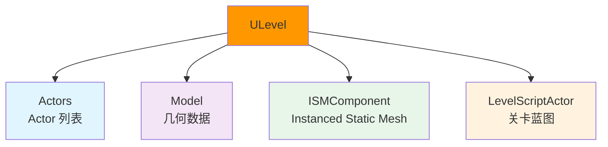
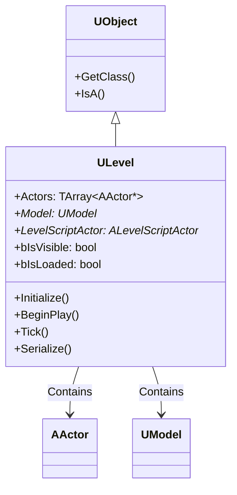
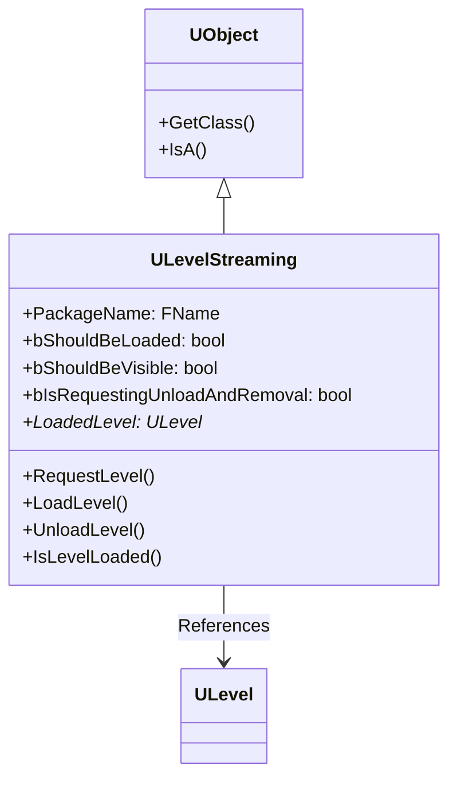
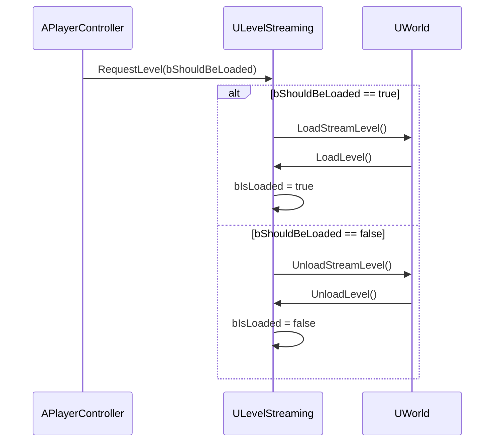
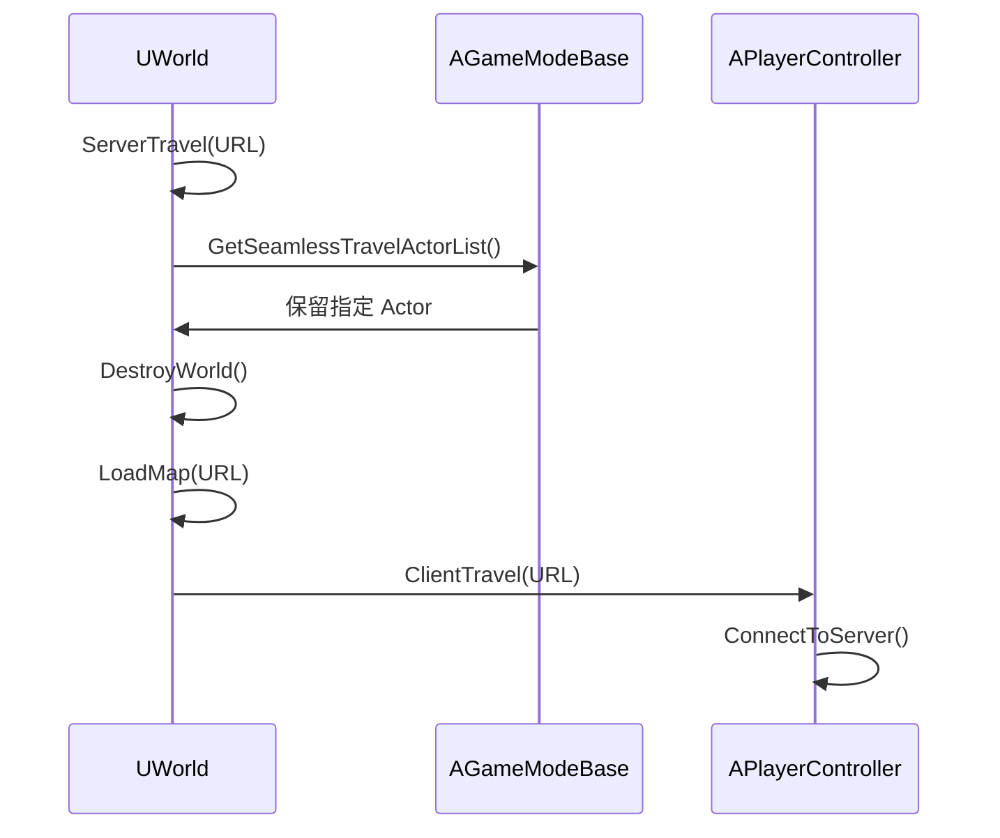
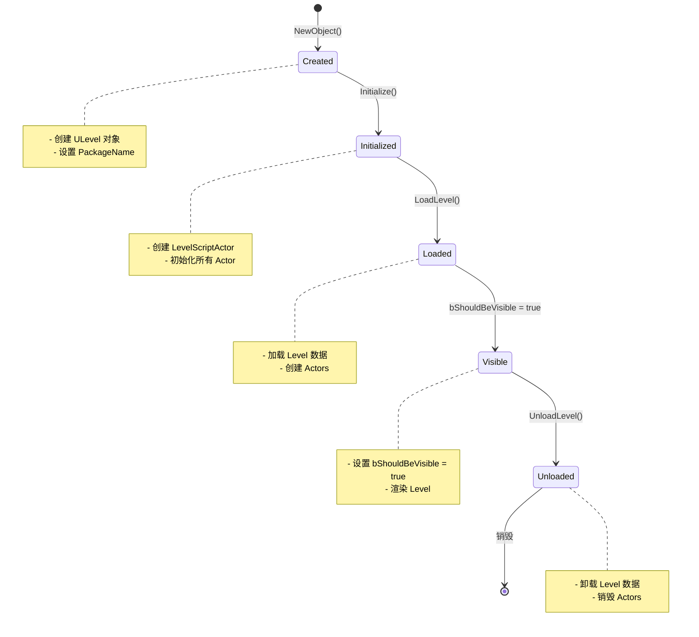
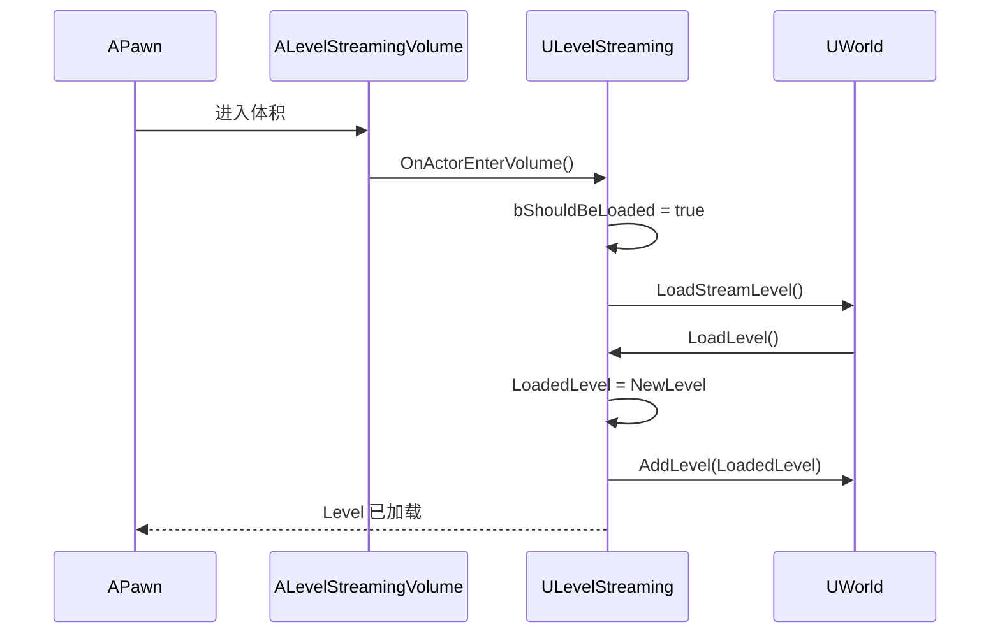
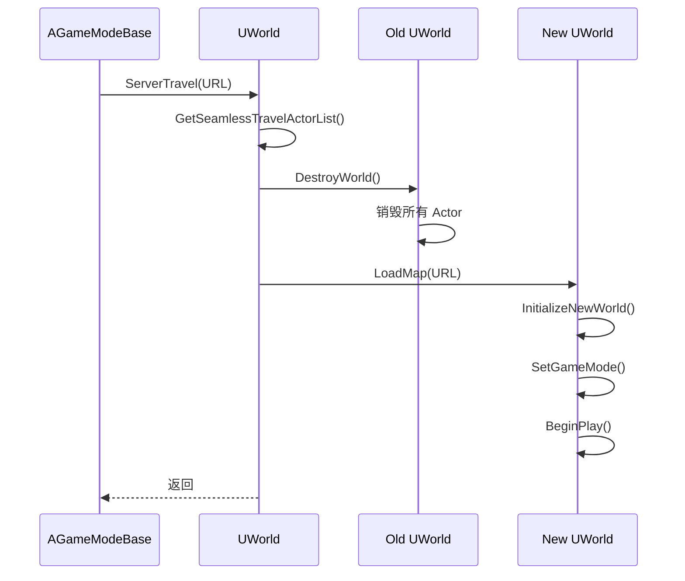
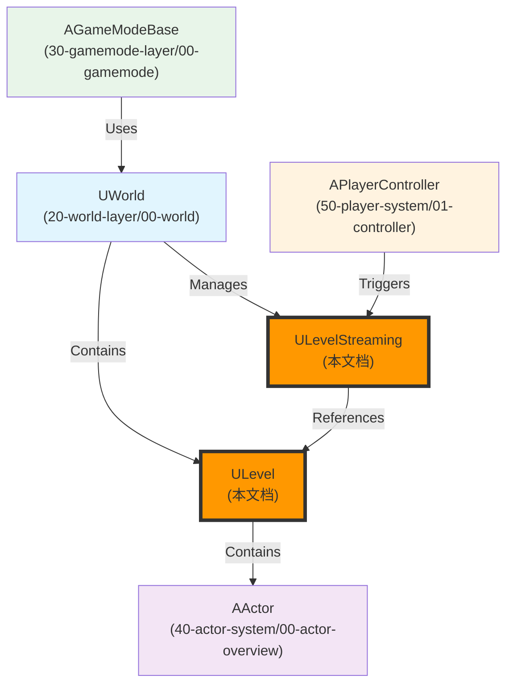

# ULevel与LevelStreaming详解

## 概述

> `ULevel` 是 UWorld 的组成部分，包含一组 Actor 和几何数据（Model）。一个 World 至少有一个 `PersistentLevel` 和 0-N 个 `StreamingLevels`（流关卡）。`Level Streaming` 允许动态加载/卸载关卡，实现大地图的无缝加载。

---

## 核心概念

### Level 的职责

`ULevel` 是关卡的载体，负责管理：



**核心职责**：
1. **Actor 管理**：管理 Level 中的所有 Actor
2. **几何数据管理**：管理 Level 的几何数据（BSP、Static Mesh）
3. **Level Script 管理**：管理 Level 的关卡蓝图（Level Blueprint）
4. **Streaming 支持**：支持动态加载/卸载（流关卡）

### Level Streaming（流关卡）

> **流关卡**允许关卡数据以数据流的形式加载到游戏中，过程平稳，对当前关卡没有影响。具体表现就是，当你在场景 A 中向场景 B 行走的时候，B 场景会在你事先指定好的地点（或者其他条件）加载进来，而你感觉不到 B 场景的加载过程。

**两种控制方式**：

1. **Level Streaming Volume**（体积触发）
   - 当玩家摄像机进入 `LevelStreamingVolume` 体积内时，对应的流关卡就会加载
   - 对应关系通过 Levels 窗口设置

2. **脚本（代码）控制**
   - 通过代码逻辑控制流关卡的加载/卸载
   - 使用 `LoadStreamLevel()` / `UnloadStreamLevel()` 节点

> 💡 **注意**：你可以把流关卡理解成一种"无缝加载"，但是这与 UE 官方文档里面的无缝加载（Seamless Travel）并不是同一个东西。

### World 切换（Travel）

World 切换有三种方式：

| 方式 | 发起方 | 说明 |
|------|--------|------|
| **ClientTravel** | 客户端 | 客户端断开当前连接，连接到新的服务器或单机地图 |
| **ServerTravel** | 服务器 | 服务器带着所有连接的客户端一起切换到新的关卡 |
| **Seamless Travel** | 服务器 | 无缝切换，保留指定 Actor（如 PlayerController） |

---

## 架构解析

### ULevel 类继承关系



### ULevelStreaming 类继承关系



### 关键方法详解

#### ULevel::Initialize() - 初始化 Level

**功能**：初始化 Level，创建 `LevelScriptActor`。

**关键代码**：

```cpp
void ULevel::Initialize()
{
    // 创建 LevelScriptActor
    LevelScriptActor = GetWorld()->SpawnActor<ALevelScriptActor>(ALevelScriptActor::StaticClass());
    
    // 初始化所有 Actor
    for (AActor* Actor : Actors)
    {
        Actor->Initialize();
    }
}
```

#### ULevel::BeginPlay() - 开始游戏

**功能**：触发 Level 中所有 Actor 的 `BeginPlay()`。

**关键代码**：

```cpp
void ULevel::BeginPlay()
{
    // 遍历所有 Actor，调用 BeginPlay()
    for (AActor* Actor : Actors)
    {
        Actor->BeginPlay();
    }
}
```

#### ULevelStreaming::RequestLevel() - 请求加载/卸载 Level

**功能**：请求加载或卸载流关卡。

**执行流程**：



**关键代码**：

```cpp
void ULevelStreaming::RequestLevel(bool bInShouldBeLoaded, bool bInShouldBeVisible)
{
    bShouldBeLoaded = bInShouldBeLoaded;
    bShouldBeVisible = bInShouldBeVisible;
    
    if (bShouldBeLoaded)
    {
        // 请求加载
        LoadLevel();
    }
    else
    {
        // 请求卸载
        UnloadLevel();
    }
}
```

#### UWorld::ServerTravel() - 服务器旅行

**功能**：服务器发起的关卡切换，带着所有连接的客户端一起切换到新的关卡。

**执行流程**：



**关键代码**：

```cpp
bool UWorld::ServerTravel(const FString& FURL, bool bAbsolute, bool bShouldSkipGameNotify)
{
    // 获取需要保留的 Actor 列表（Seamless Travel）
    TArray<AActor*> ActorsToKeep;
    GetAuthGameMode()->GetSeamlessTravelActorList(ActorsToKeep);
    
    // 销毁当前 World
    DestroyWorld(false, nullptr);
    
    // 加载新地图
    LoadMap(FURL(nullptr, *FURL, TRAVEL_Absolute), ...);
    
    // 通知所有客户端切换到新地图
    for (FConstPlayerControllerIterator It = GetPlayerControllerIterator(); It; ++It)
    {
        APlayerController* PC = It->Get();
        PC->ClientTravel(FURL, TRAVEL_Absolute);
    }
    
    return true;
}
```

---

## 执行流程

### Level 加载流程



### Level Streaming 加载流程



### World 切换流程（ServerTravel）



---

## 与其他模块的关系

`ULevel` 和 `ULevelStreaming` 作为关卡的载体，与以下系统紧密相关：



**关系说明**：

| 相关模块 | 关系 | 说明 |
|----------|------|------|
| **UWorld** | 包含 Level | `UWorld` 包含 `PersistentLevel` 和 `StreamingLevels` |
| **AActor** | 被 Level 包含 | `ULevel` 管理 Level 中的所有 Actor |
| **AGameModeBase** | 使用 World | `AGameModeBase::ServerTravel()` 触发 World 切换 |
| **APlayerController** | 触发流关卡 | `APlayerController` 进入 `LevelStreamingVolume` 触发流关卡加载 |

---

## 常见陷阱与最佳实践

### ⚠️ 常见陷阱

1. **混淆流关卡和 Seamless Travel**
   - ❌ 错误：认为流关卡就是 Seamless Travel
   - ✅ 正确：流关卡是动态加载/卸载关卡，Seamless Travel 是服务器切换关卡时保留指定 Actor

2. **在错误的时机访问流关卡**
   - ❌ 错误：在 `RequestLevel()` 后立即访问 `LoadedLevel`
   - ✅ 正确：流关卡加载是异步的，需要等待 `IsLevelLoaded()` 返回 true

3. **不理解 Level 的生命周期**
   - ❌ 错误：认为 `ULevel` 会在 World 切换时立即销毁
   - ✅ 正确：`ULevel` 会在 `DestroyWorld()` 中销毁

### ✅ 最佳实践

1. **使用流关卡优化大地图**
   - 大地图 → 使用 `Level Streaming` 分区加载
   - 动态加载/卸载关卡 → 使用 `ULevelStreaming::RequestLevel()`

2. **使用 Seamless Travel 保留 Actor**
   - 需要保留的 Actor → 在 `AGameModeBase::GetSeamlessTravelActorList()` 中添加
   - 避免断开连接 → 使用 `ServerTravel()` 而不是 `ClientTravel()`

3. **理解 Level 的加载时机**
   - 需要访问 Level 中的 Actor → 等待 `IsLevelLoaded()` 返回 true
   - 避免在 `BeginPlay()` 之前访问 Level

---

## 参考资料

### UE 官方文档
- [UE5 官方文档](https://docs.unrealengine.com/5.0/zh-CN/)
- [Level Streaming 官方文档](https://docs.unrealengine.com/5.0/zh-CN/level-streaming-in-unreal-engine/)
- [World Composition 官方文档](https://docs.unrealengine.com/5.0/zh-CN/world-composition-in-unreal-engine/)

### 内部文档
- [[30-tutorials/ue-framework/00-UE框架概述|UE 框架概述]]
- [[30-tutorials/ue-framework/01-UE游戏主循环详解|游戏主循环详解]]
- [[30-tutorials/ue-framework/20-world-layer/00-UWorld详解|UWorld 详解]]

### 原文档
- 

### 外部参考
- [UE4流关卡与无缝地图切换总结](https://gwb.tencent.com/community/detail/121543)
- [关卡系统三、关卡切换流程](https://zhuanlan.zhihu.com/p/461781710)
- [Unreal丨游戏中的关卡切换](https://zhuanlan.zhihu.com/p/391604314)

---

**文档版本**：v1.0  
**最后更新**：2026-05-16  
**维护者**：AI Agent（按项目规范维护）

<!-- nav:auto -->

---

**导航**: ← [[30-tutorials/ue-framework/20-world-layer/00-UWorld详解|00-UWorld详解]] · [[30-tutorials/ue-framework/30-gamemode-layer/00-AGameModeBase详解|00-AGameModeBase详解]] →

<!-- /nav:auto -->
