# AGameModeBase详解

## 概述

> `AGameModeBase` 是游戏规则的制定者，负责管理游戏的逻辑规则（如玩家加入/退出、暂停、关卡切换等）。每个 `UWorld` 有且仅有一个 `GameMode`。`AGameMode` 是 `AGameModeBase` 的子类，增加了队友伤害、友军伤害等默认实现。

---

## 核心概念

### GameMode 的职责

`AGameModeBase` 是游戏逻辑的总控，负责管理：

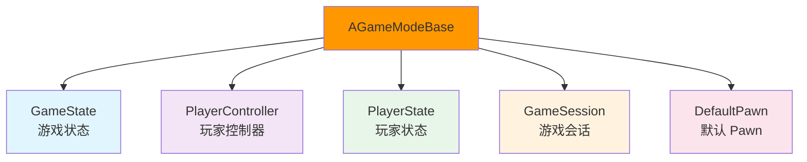

**核心职责**：
1. **游戏规则管理**：定义游戏的规则（如胜利条件、失败条件）
2. **玩家管理**：处理玩家加入/退出（Login/PostLogin）
3. **GameState 管理**：创建和管理 `GameState`
4. **Pawn 管理**：生成默认 Pawn（SpawnDefaultPawnAtTransform）
5. **游戏流程管理**：控制游戏开始/暂停/结束（StartMatch/SetGamePaused）

### GameMode 与 GameState 的关系

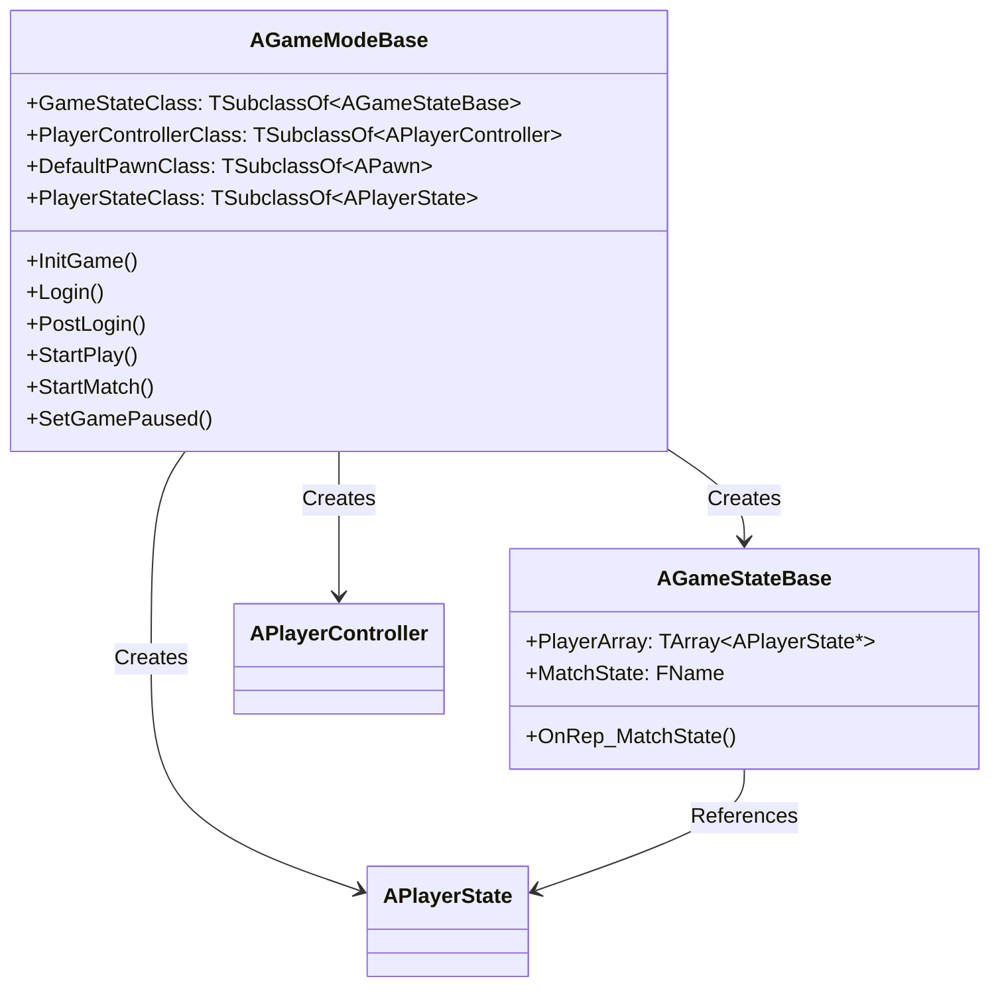

**关系说明**：
- `AGameModeBase` 创建 `AGameStateBase`（在 `InitGame()` 中）
- `AGameModeBase` 创建 `APlayerController`（在 `Login()` 中）
- `AGameModeBase` 创建 `APlayerState`（在 `PostLogin()` 中）
- `AGameStateBase` 引用所有 `APlayerState`（通过 `PlayerArray`）

---

## 架构解析

### AGameModeBase 类继承关系

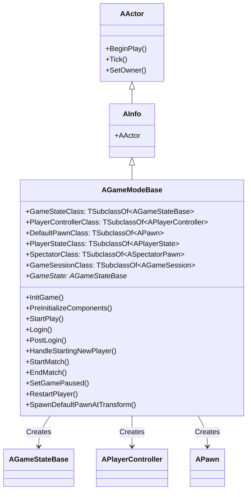

### AGameMode 类继承关系

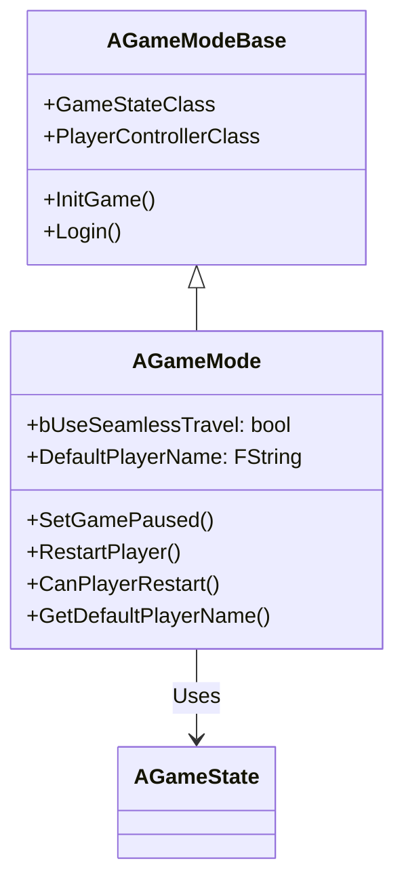

### 关键方法详解

#### InitGame() - 初始化游戏

**功能**：初始化游戏，创建 `GameState` 和 `GameSession`。

**执行流程**：

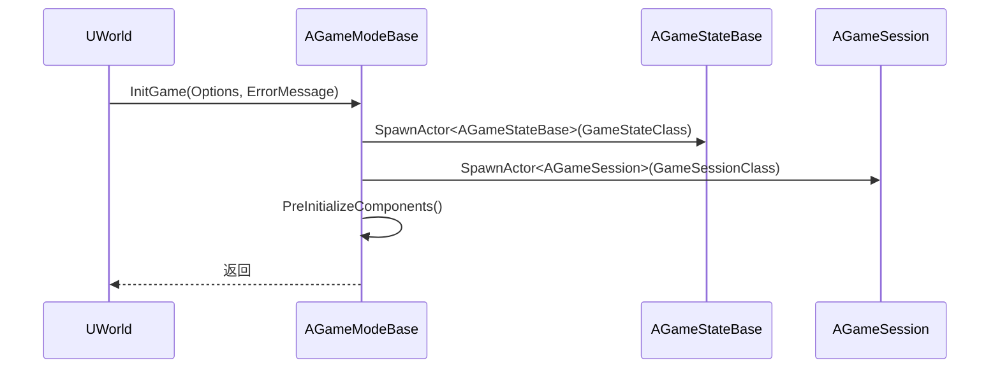

**关键代码**：

```cpp
void AGameModeBase::InitGame(const FString& Options, FString& ErrorMessage)
{
    // 创建 GameState
    GameState = GetWorld()->SpawnActor<AGameStateBase>(GameStateClass);
    
    // 创建 GameSession
    GameSession = GetWorld()->SpawnActor<AGameSession>(GameSessionClass);
    
    // 预初始化组件
    PreInitializeComponents();
}
```

#### Login() - 玩家登录

**功能**：处理玩家登录请求，创建 `PlayerController`。

**执行流程**：

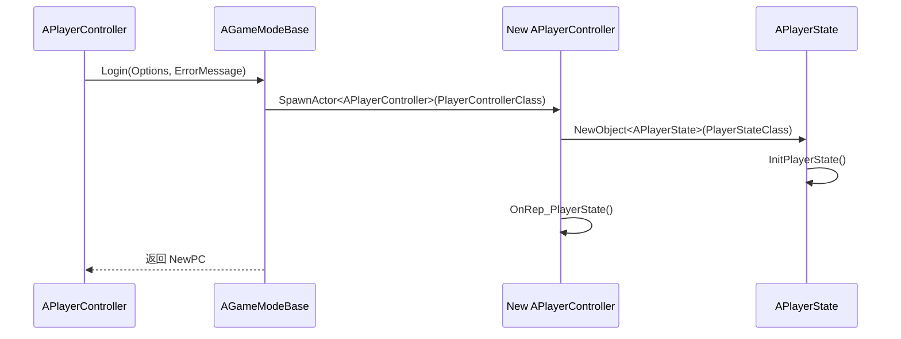

**关键代码**：

```cpp
APlayerController* AGameModeBase::Login(const FString& Options, const FUniqueNetIdRepl& UniqueId, FString& ErrorMessage)
{
    // 创建 PlayerController
    APlayerController* NewPlayerController = GetWorld()->SpawnActor<APlayerController>(PlayerControllerClass);
    
    // 创建 PlayerState
    NewPlayerController->PlayerState = NewObject<APlayerState>(PlayerStateClass);
    NewPlayerController->PlayerState->InitPlayerState();
    
    return NewPlayerController;
}
```

#### PostLogin() - 登录后处理

**功能**：在玩家登录后调用，将 `PlayerState` 添加到 `GameState`。

**执行流程**：

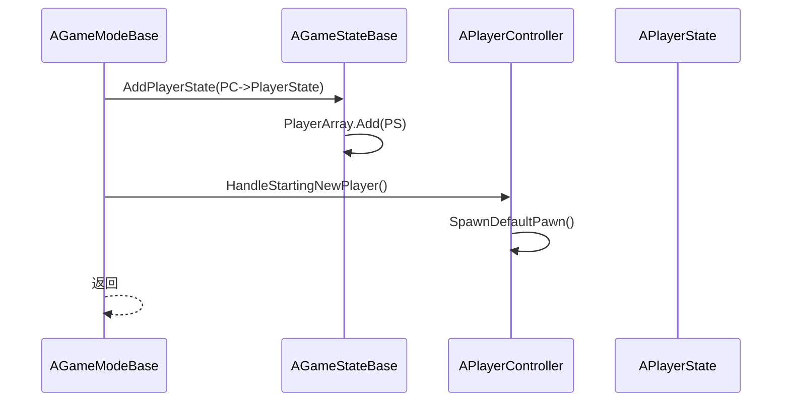

**关键代码**：

```cpp
void AGameModeBase::PostLogin(APlayerController* NewPlayer)
{
    // 将 PlayerState 添加到 GameState
    AGameStateBase* GameState = GetGameState<AGameStateBase>();
    GameState->AddPlayerState(NewPlayer->PlayerState);
    
    // 处理新玩家（生成 Pawn）
    HandleStartingNewPlayer(NewPlayer);
}
```

#### StartPlay() - 开始游戏

**功能**：开始游戏，调用 `StartMatch()`。

**执行流程**：

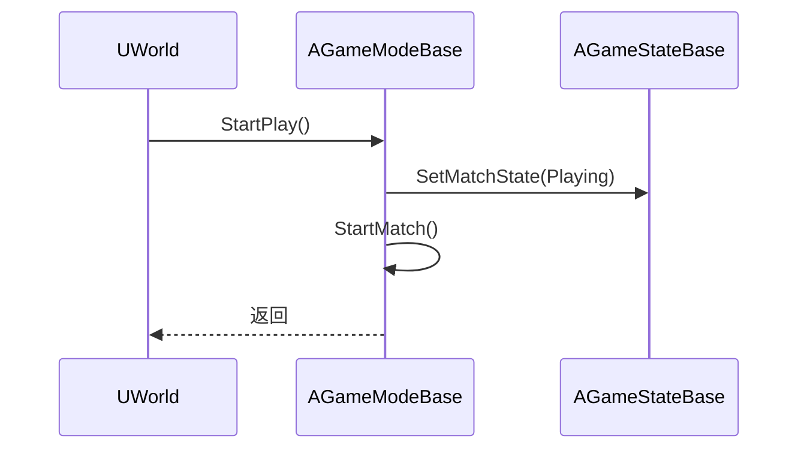

**关键代码**：

```cpp
void AGameModeBase::StartPlay()
{
    // 设置 MatchState 为 Playing
    AGameStateBase* GameState = GetGameState<AGameStateBase>();
    GameState->SetMatchState(MatchState::Playing);
    
    // 开始比赛
    StartMatch();
}
```

#### StartMatch() - 开始比赛

**功能**：开始比赛，通知所有客户端。

**关键代码**：

```cpp
void AGameModeBase::StartMatch()
{
    // 通知所有 PlayerController 比赛开始
    for (FConstPlayerControllerIterator It = GetWorld()->GetPlayerControllerIterator(); It; ++It)
    {
        APlayerController* PC = It->Get();
        PC->ClientStartMatch();
    }
}
```

---

## 执行流程

### GameMode 完整生命周期

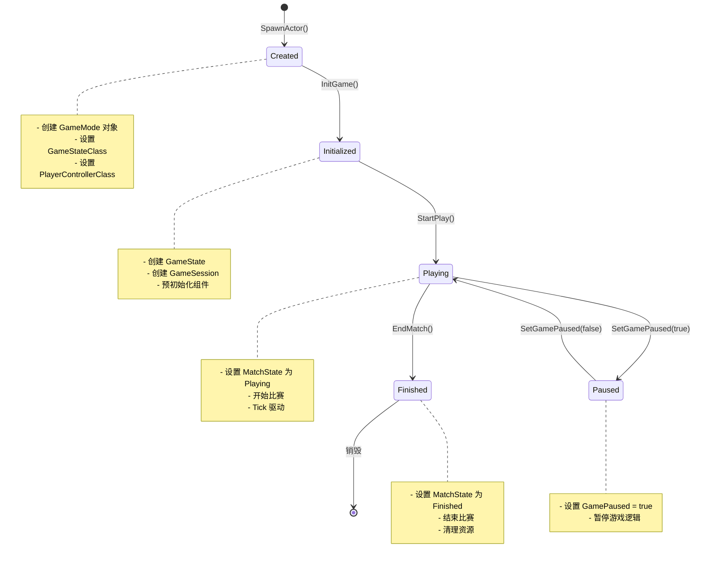

### Login → PostLogin 流程

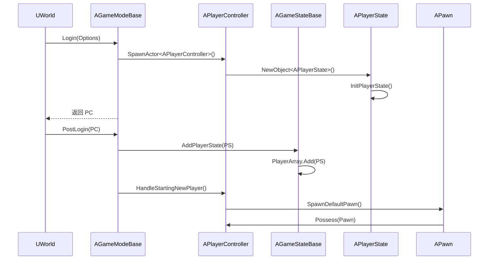

### 玩家加入完整流程

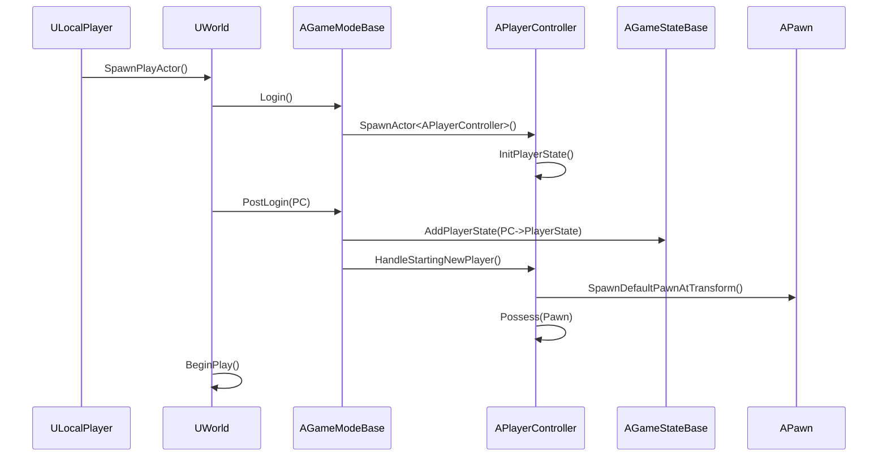

---

## 与其他模块的关系

`AGameModeBase` 作为游戏逻辑的总控，与以下系统紧密相关：

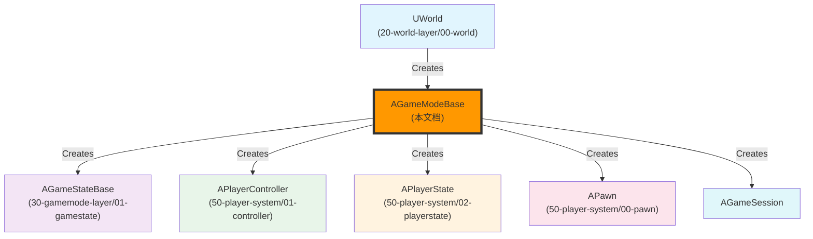

**关系说明**：

| 相关模块 | 关系 | 说明 |
|----------|------|------|
| **UWorld** | 创建 GameMode | `UWorld::SetGameMode()` 中创建 `GameMode` |
| **AGameStateBase** | 被 GameMode 创建 | `AGameModeBase::InitGame()` 中创建 `GameState` |
| **APlayerController** | 被 GameMode 创建 | `AGameModeBase::Login()` 中创建 `PlayerController` |
| **APlayerState** | 被 GameMode 创建 | `AGameModeBase::Login()` 中创建 `PlayerState` |
| **APawn** | 被 GameMode 创建 | `AGameModeBase::SpawnDefaultPawnAtTransform()` 中创建 `Pawn` |
| **AGameSession** | 被 GameMode 创建 | `AGameModeBase::InitGame()` 中创建 `GameSession` |

---

## 常见陷阱与最佳实践

### ⚠️ 常见陷阱

1. **在错误的时机访问 GameMode**
   - ❌ 错误：在 `UWorld::InitializeNewWorld()` 中尝试访问 `GameMode`
   - ✅ 正确：`GameMode` 在 `UWorld::SetGameMode()` 中创建，只能在之后访问

2. **不理解 GameMode 的生命周期**
   - ❌ 错误：认为 `GameMode` 会在 World 切换时销毁
   - ✅ 正确：`GameMode` 在 `World` 销毁时销毁

3. **混淆 GameMode 和 GameState**
   - ❌ 错误：在 `GameMode` 中存储需要复制的状态
   - ✅ 正确：`GameMode` 只在服务器存在，`GameState` 会复制到所有客户端

### ✅ 最佳实践

1. **使用 GameMode 管理游戏规则**
   - 游戏规则（如胜利条件、失败条件） → 放在 `GameMode` 中
   - 游戏状态（如当前分数、玩家列表） → 放在 `GameState` 中

2. **使用 GameState 同步游戏状态**
   - 需要同步到所有客户端的状态 → 放在 `GameState` 中
   - 使用 `UPROPERTY(Replicated)` 标记需要复制的属性

3. **理解 Login → PostLogin 流程**
   - 玩家加入 → `Login()` 创建 `PlayerController` 和 `PlayerState`
   - 登录后 → `PostLogin()` 将 `PlayerState` 添加到 `GameState`，生成 `Pawn`

---

## 参考资料

### UE 官方文档
- [UE5 官方文档](https://docs.unrealengine.com/5.0/zh-CN/)
- [GameMode 官方文档](https://docs.unrealengine.com/5.0/zh-CN/gamemode-in-unreal-engine/)
- [GameState 官方文档](https://docs.unrealengine.com/5.0/zh-CN/gamestate-in-unreal-engine/)

### 内部文档
- [[30-tutorials/ue-framework/00-UE框架概述|UE 框架概述]]
- [[30-tutorials/ue-framework/01-UE游戏主循环详解|游戏主循环详解]]
- [[30-tutorials/ue-framework/20-world-layer/00-UWorld详解|UWorld 详解]]
- [[30-tutorials/ue-framework/30-gamemode-layer/01-AGameStateBase详解|AGameStateBase 详解]]

### 原文档
- 

---

**文档版本**：v1.0  
**最后更新**：2026-05-16  
**维护者**：AI Agent（按项目规范维护）

<!-- nav:auto -->

---

**导航**: ← [[30-tutorials/ue-framework/20-world-layer/01-ULevel与LevelStreaming详解|01-ULevel与LevelStreaming详解]] · [[30-tutorials/ue-framework/30-gamemode-layer/01-AGameStateBase详解|01-AGameStateBase详解]] →

<!-- /nav:auto -->
