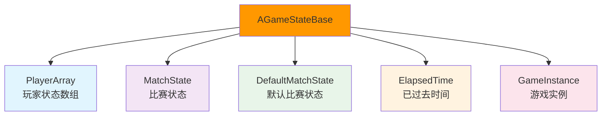
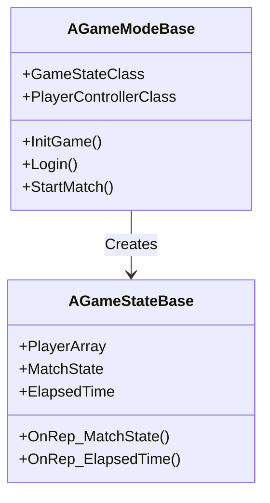
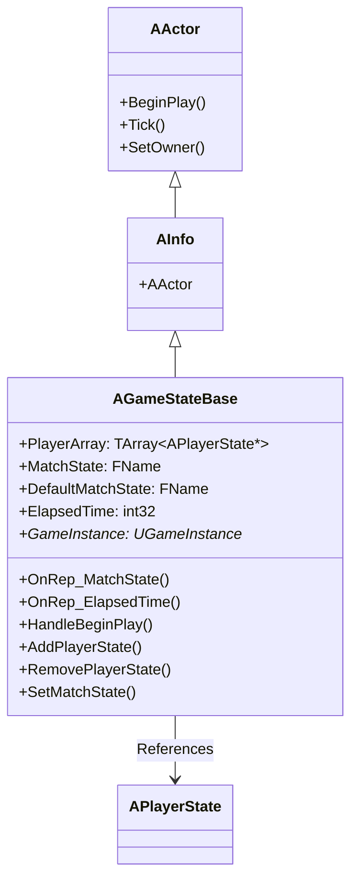
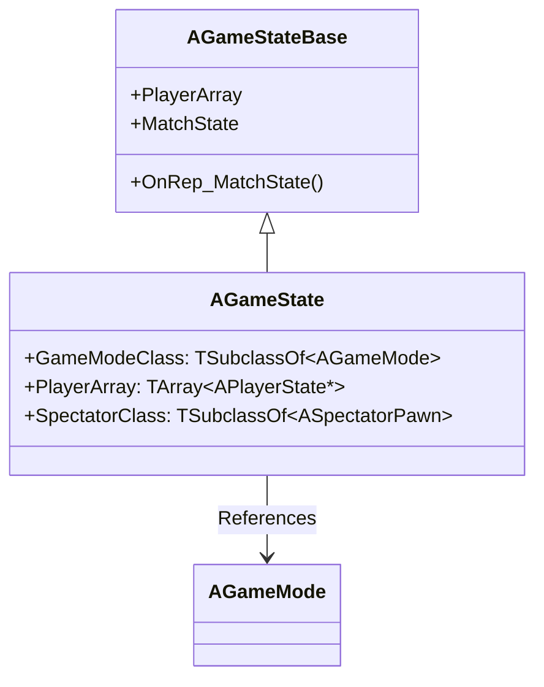
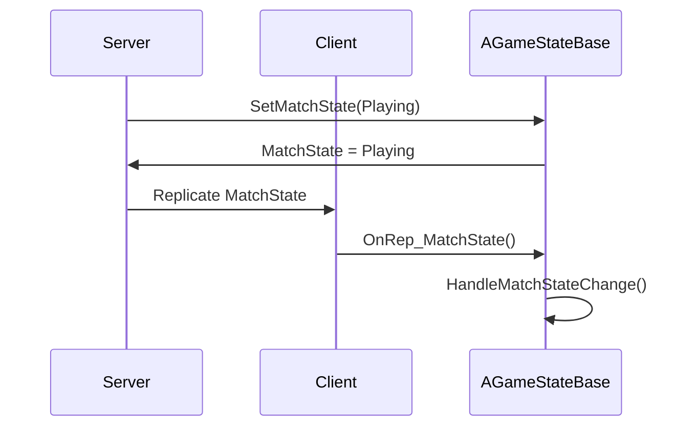
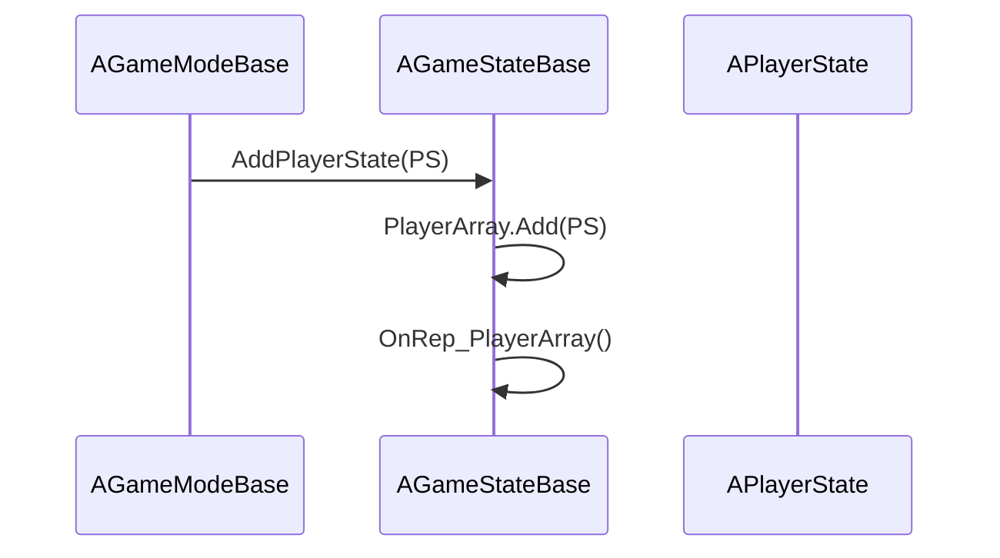
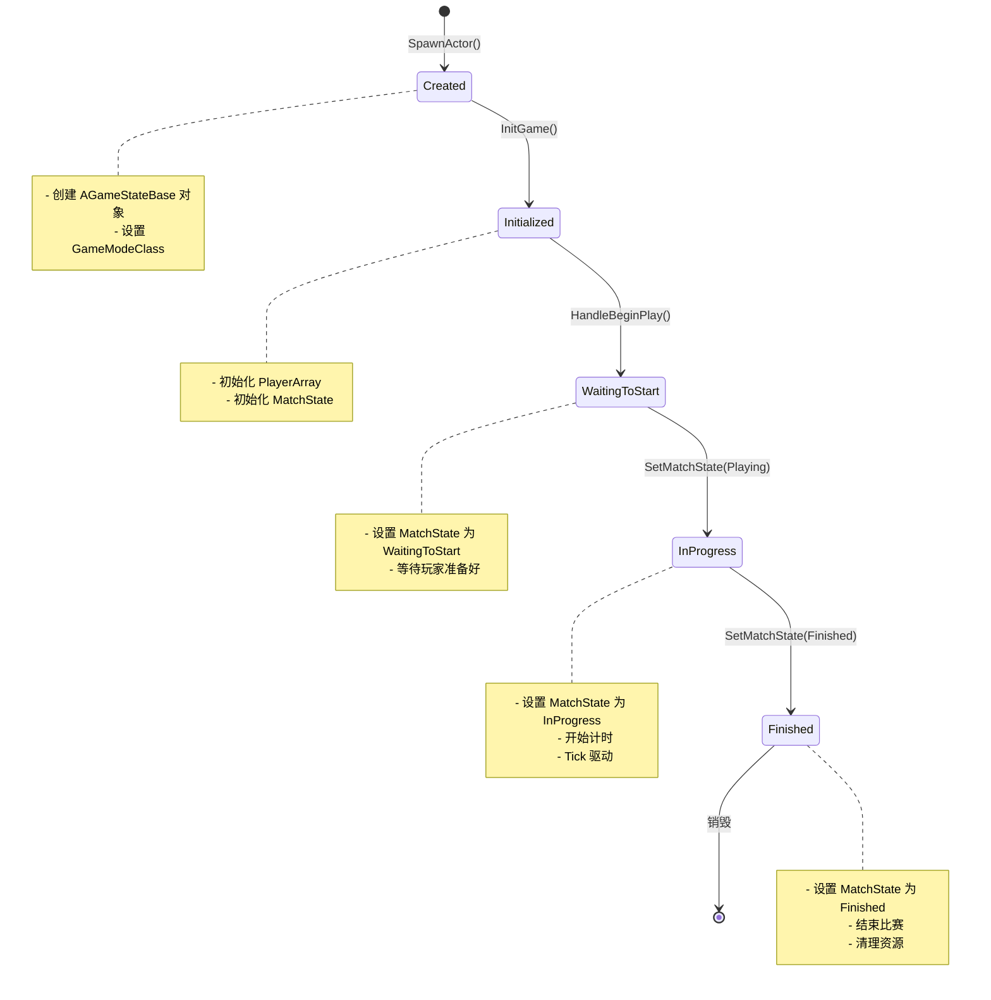
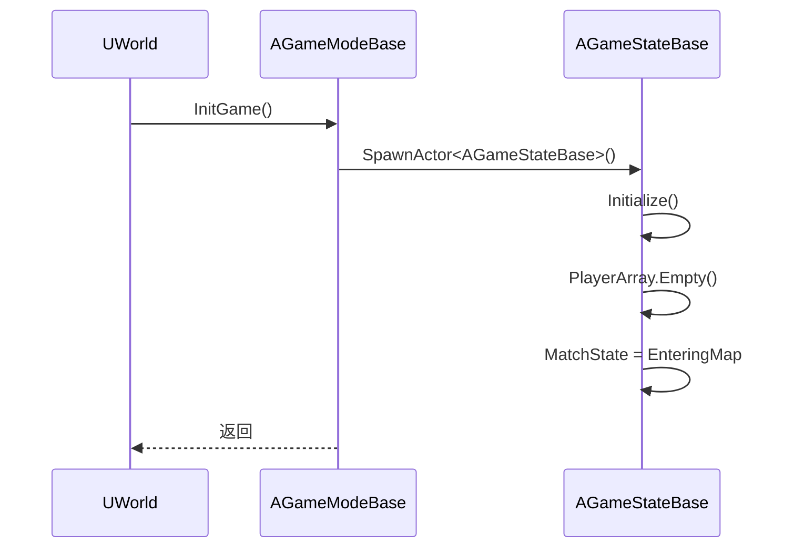
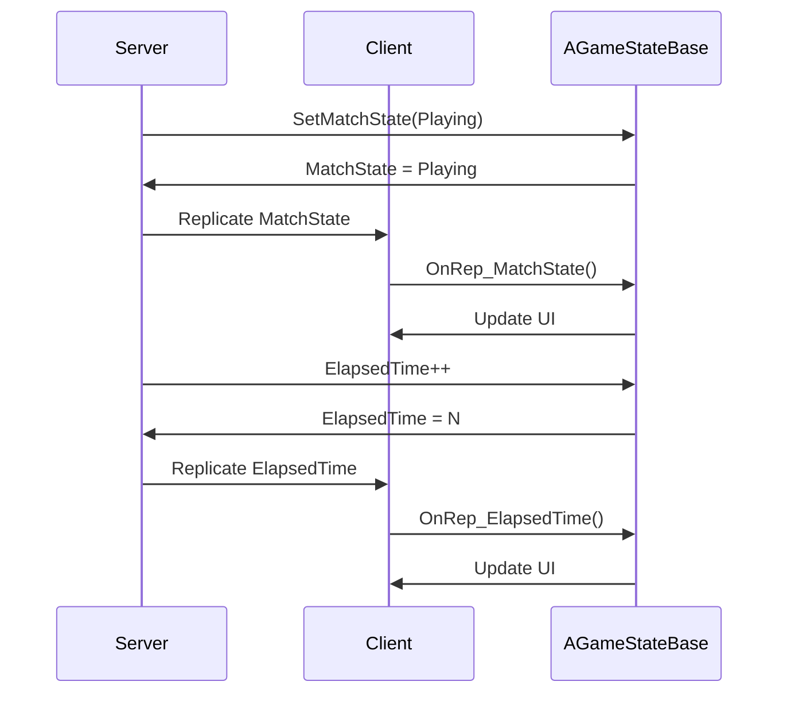
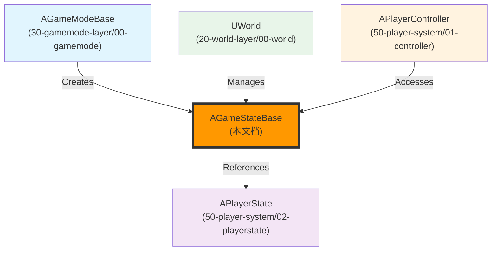

# AGameStateBase详解

## 概述

> `AGameStateBase` 是游戏状态的记录者，负责管理游戏的全局状态（如比赛状态、玩家列表等）。`AGameStateBase` 会复制到所有客户端，而 `AGameModeBase` 只在服务器存在。每个 `UWorld` 有且仅有一个 `GameState`。

---

## 核心概念

### GameState 的职责

`AGameStateBase` 是游戏状态的载体，负责管理：



**核心职责**：
1. **游戏状态管理**：管理比赛的当前状态（WaitingToStart/InProgress/Finished）
2. **玩家状态管理**：管理所有玩家的 `PlayerState`（`PlayerArray`）
3. **时间管理**：管理游戏已过去的时间（`ElapsedTime`）
4. **网络复制**：将游戏状态复制到所有客户端
5. **比赛流程管理**：控制比赛的开始/暂停/结束

### GameState 与 GameMode 的区别



**区别说明**：

| 特性 | AGameModeBase | AGameStateBase |
|------|---------------|----------------|
| **存在位置** | 只在服务器 | 服务器 + 所有客户端（复制） |
| **职责** | 制定游戏规则 | 记录游戏状态 |
| **网络复制** | 不复制 | 复制到所有客户端 |
| **生命周期** | World 销毁时销毁 | World 销毁时销毁 |
| **访问权限** | 服务器才能访问 | 所有客户端都能访问 |

> 💡 **重要**：`AGameModeBase` 只在服务器存在，客户端无法访问。`AGameStateBase` 会复制到所有客户端，客户端可以通过 `GetGameState()` 获取游戏状态。

---

## 架构解析

### AGameStateBase 类继承关系



### AGameState 类继承关系



### 关键属性详解

#### PlayerArray - 玩家状态数组

```cpp
/** Array of all PlayerStates, maintained on both clients and server. */
UPROPERTY(Replicated)
TArray<TObjectPtr<APlayerState>> PlayerArray;
```

**说明**：
- 包含所有玩家的 `APlayerState`
- 会在服务器和客户端之间复制
- 客户端可以通过 `PlayerArray` 获取所有玩家的状态

#### MatchState - 比赛状态

```cpp
/** The current match state, shown on clients so they can update state. */
UPROPERTY(Replicated)
FName MatchState;
```

**说明**：
- 当前比赛的状态
- 会在服务器和客户端之间复制
- 客户端可以通过 `OnRep_MatchState()` 监听状态变化

**比赛状态枚举**：

| 状态 | 说明 |
|------|------|
| `EnteringMap` | 正在进入地图 |
| `WaitingToStart` | 等待开始 |
| `InProgress` | 进行中 |
| `WaitingPostMatch` | 等待比赛结束 |
| `LeavingMap` | 正在离开地图 |
| `Aborted` | 中止 |

#### ElapsedTime - 已过去时间

```cpp
/** Elapsed game time, in seconds. */
UPROPERTY(Replicated)
int32 ElapsedTime;
```

**说明**：
- 游戏已过去的时间（秒）
- 会在服务器和客户端之间复制
- 客户端可以通过 `OnRep_ElapsedTime()` 监听时间变化

### 关键方法详解

#### OnRep_MatchState() - 比赛状态复制回调

**功能**：当 `MatchState` 复制时调用，通知客户端比赛状态变化。

**执行流程**：



**关键代码**：

```cpp
void AGameStateBase::OnRep_MatchState()
{
    // 处理比赛状态变化
    HandleMatchStateChange();
}

void AGameStateBase::HandleMatchStateChange()
{
    // 根据 MatchState 执行相应逻辑
    if (MatchState == MatchState::InProgress)
    {
        // 比赛开始
        OnMatchStart();
    }
    else if (MatchState == MatchState::Finished)
    {
        // 比赛结束
        OnMatchEnd();
    }
}
```

#### AddPlayerState() - 添加玩家状态

**功能**：将 `APlayerState` 添加到 `PlayerArray`。

**执行流程**：



**关键代码**：

```cpp
void AGameStateBase::AddPlayerState(APlayerState* PlayerState)
{
    // 添加到 PlayerArray
    PlayerArray.Add(PlayerState);
    
    // 标记需要复制
    MARK_PROPERTY_DIRTY_FROM_NAME(AGameStateBase, PlayerArray, this);
}
```

#### HandleBeginPlay() - 处理开始游戏

**功能**：在游戏开始时调用，初始化游戏状态。

**关键代码**：

```cpp
void AGameStateBase::HandleBeginPlay()
{
    // 设置比赛状态为 WaitingToStart
    SetMatchState(MatchState::WaitingToStart);
    
    // 开始计时
    ElapsedTime = 0;
}
```

---

## 执行流程

### GameState 完整生命周期



### GameState 初始化流程



### 属性复制流程



---

## 与其他模块的关系

`AGameStateBase` 作为游戏状态的记录者，与以下系统紧密相关：



**关系说明**：

| 相关模块 | 关系 | 说明 |
|----------|------|------|
| **AGameModeBase** | 创建 GameState | `AGameModeBase::InitGame()` 中创建 `GameState` |
| **APlayerState** | 被 GameState 引用 | `AGameStateBase::PlayerArray` 包含所有玩家的 `PlayerState` |
| **UWorld** | 管理 GameState | `UWorld` 管理 `GameState` 的生命周期 |
| **APlayerController** | 访问 GameState | `APlayerController` 可以通过 `GetGameState()` 获取游戏状态 |

---

## 常见陷阱与最佳实践

### ⚠️ 常见陷阱

1. **在客户端访问 GameMode**
   - ❌ 错误：在客户端调用 `GetGameMode()`
   - ✅ 正确：`AGameModeBase` 只在服务器存在，客户端应该访问 `GetGameState()`

2. **不理解 GameState 的复制机制**
   - ❌ 错误：在客户端修改 `MatchState`
   - ✅ 正确：`MatchState` 只在服务器修改，客户端通过 `OnRep_MatchState()` 监听变化

3. **混淆 GameMode 和 GameState 的职责**
   - ❌ 错误：在 `GameMode` 中存储需要复制的状态
   - ✅ 正确：`GameMode` 制定规则，`GameState` 记录状态

### ✅ 最佳实践

1. **使用 GameState 同步游戏状态**
   - 需要同步到所有客户端的状态 → 放在 `GameState` 中
   - 使用 `UPROPERTY(Replicated)` 标记需要复制的属性

2. **使用 OnRep_ 函数监听状态变化**
   - 需要监听属性变化 → 使用 `OnRep_` 函数
   - 在 `OnRep_` 函数中更新 UI 或执行逻辑

3. **理解 GameState 的生命周期**
   - `GameState` 在 `GameMode::InitGame()` 中创建
   - `GameState` 会在 `World` 销毁时销毁

---

## 参考资料

### UE 官方文档
- [UE5 官方文档](https://docs.unrealengine.com/5.0/zh-CN/)
- [GameState 官方文档](https://docs.unrealengine.com/5.0/zh-CN/gamestate-in-unreal-engine/)

### 内部文档
- [[30-tutorials/ue-framework/00-UE框架概述|UE 框架概述]]
- [[30-tutorials/ue-framework/01-UE游戏主循环详解|游戏主循环详解]]
- [[30-tutorials/ue-framework/30-gamemode-layer/00-AGameModeBase详解|AGameModeBase 详解]]

### 原文档
- 

---

**文档版本**：v1.0  
**最后更新**：2026-05-16  
**维护者**：AI Agent（按项目规范维护）

<!-- nav:auto -->

---

**导航**: ← [[30-tutorials/ue-framework/30-gamemode-layer/00-AGameModeBase详解|00-AGameModeBase详解]] · [[30-tutorials/ue-framework/40-actor-system/00-AActor架构概述|00-AActor架构概述]] →

<!-- /nav:auto -->
