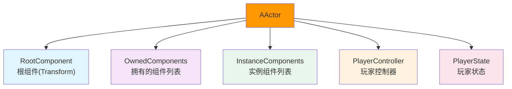
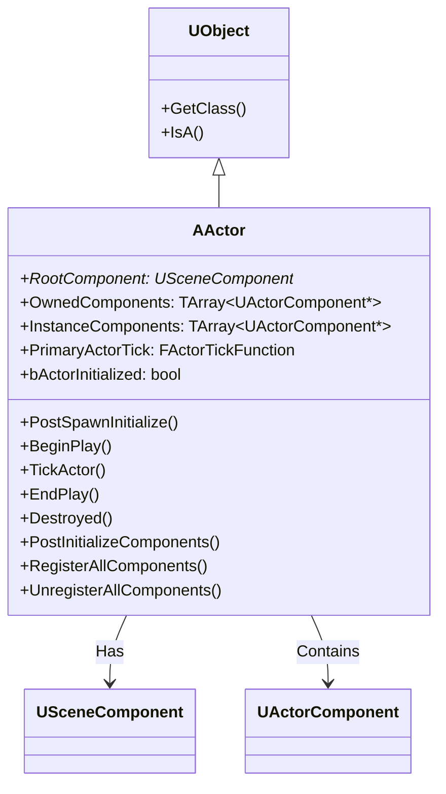
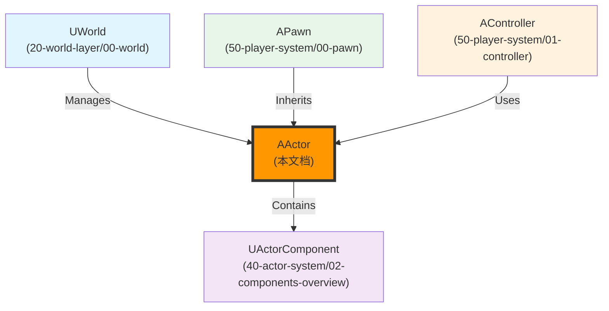

# AActor架构概述

## 概述

> `AActor` 是 Unreal Engine 中可以在世界中放置或生成的基础类。Actor 可以包含一组 `ActorComponent`，用于控制 Actor 如何移动、如何渲染等。Actor 的另一个主要功能是游戏期间跨网络的属性复制和函数调用。

---

## 核心概念

### Actor 的职责

`AActor` 是游戏世界中的基本实体，负责管理：



**核心职责**：
1. **组件管理**：管理 `ActorComponent` 的注册、初始化、Tick、销毁
2. **网络复制**：管理属性和函数调用在网络间的复制
3. **生命周期管理**：管理 Actor 的完整生命周期（Spawn → BeginPlay → EndPlay → Destroy）
4. **碰撞检测**：管理 Actor 的碰撞和重叠事件
5. **Tick 驱动**：驱动 Actor 和组件的 Tick

### Actor 的特点

> 💡 **重要**：Actor 不自带 Transform 信息，Transform 信息是 `USceneComponent` 拥有的。一个 Actor 如果需要在 3D 世界里表示，必须要有一个具有 Transform 信息的 `USceneComponent`（通常是 `RootComponent`）。

**但不是所有的 Actor 都需要在场景里摆放**，比如纯数据类型的 `AInfo`、`AWorldSettings`、`AGameMode`。

**Actor 可以互相嵌套**，拥有相对的父子关系（通过 `AttachToActor()` 实现）。

---

## 架构解析

### AActor 类继承关系



### Actor 初始化步骤（官方注释）

```cpp
/**
 * Actor initialization has multiple steps, here's the order of important virtual functions that get called:
 *  - UObject::PostLoad: For actors statically placed in a level...
 *  - UActorComponent::OnComponentCreated: When an actor is spawned in the editor or during gameplay...
 *  - AActor::PreRegisterAllComponents: For statically placed actors...
 *  - UActorComponent::RegisterComponent: All components are registered...
 *  - AActor::PostRegisterAllComponents: Called for all actors...
 *  - AActor::PostActorCreated: When an actor is created in the editor or during gameplay...
 *  - AActor::UserConstructionScript: Called for blueprints...
 *  - AActor::OnConstruction: Called at the end of ExecuteConstruction...
 *  - AActor::PreInitializeComponents: Called before InitializeComponent...
 *  - UActorComponent::Activate: This will be called only if the component has bAutoActivate set...
 *  - UActorComponent::InitializeComponent: This will be called only if the component has bWantsInitializeComponent set...
 *  - AActor::PostInitializeComponents: Called after the actor's components have been initialized...
 *  - AActor::BeginPlay: Called when the level starts ticking...
 */
```

### 关键属性详解

#### RootComponent - 根组件

```cpp
/** The component that defines the transform (location, rotation, scale) of this Actor in the world, all other components must be attached to this one somehow */
UPROPERTY(BlueprintGetter=K2_GetRootComponent, Category="Transform")
TObjectPtr<USceneComponent> RootComponent;
```

**说明**：
- 定义 Actor 在世界中的 Transform（位置、旋转、缩放）
- 所有其他组件必须以某种方式附加到这个组件上
- 如果 Actor 需要在 3D 世界中表示，必须有一个 `USceneComponent` 作为 `RootComponent`

#### OwnedComponents - 拥有的组件列表

```cpp
/** Array of components that are owned by this Actor */
UPROPERTY(Instanced)
TArray<TObjectPtr<UActorComponent>> OwnedComponents;
```

**说明**：
- 包含 Actor 拥有的所有组件
- 在构造函数中通过 `CreateDefaultSubobject<>()` 创建的组件会自动添加到这个数组
- 在运行时通过 `NewObject<>()` 创建并调用 `RegisterComponent()` 的组件也会添加到这个数组

#### PrimaryActorTick - Actor 主 Tick 函数

```cpp
/** Primary Actor tick function, which calls TickActor() */
UPROPERTY(EditDefaultsOnly, Category=Tick)
struct FActorTickFunction PrimaryActorTick;
```

**说明**：
- Actor 的主 Tick 函数
- 控制 Actor 是否 Tick（`StartWithTickEnabled`、`TickInterval`）
- 在 `BeginPlay()` 中启用 Tick

---

## 执行流程

### Actor 完整初始化流程

```mermaid
sequenceDiagram
    participant World as UWorld
    participant Actor as AActor
    participant Comp as UActorComponent
    
    World->>Actor: SpawnActor<AActor>()
    Actor->>Actor: PostSpawnInitialize()
    Actor->>Comp: DispatchOnComponentsCreated()
    Actor->>Comp: RegisterAllComponents()
    Actor->>Actor: PostActorCreated()
    Actor->>Actor: FinishSpawning()
    Actor->>Actor: ExecuteConstruction()
    Actor->>Actor: PostActorConstruction()
    Actor->>Comp: PreInitializeComponents()
    Actor->>Comp: InitializeComponent()
    Actor->>Comp: PostInitializeComponents()
    Actor->>Comp: BeginPlay()
    Actor->>Actor: RegisterAllActorTickFunctions()
```

### Actor Tick 流程

```mermaid
sequenceDiagram
    participant World as UWorld
    participant Actor as AActor
    participant Comp as UActorComponent
    
    World->>Actor: Tick(DeltaSeconds)
    Actor->>Actor: TickActor(DeltaSeconds)
    Actor->>Comp: TickComponent(DeltaSeconds)
    Comp->>Comp: Tick(DeltaSeconds)
```

### Actor 销毁流程

```mermaid
sequenceDiagram
    participant World as UWorld
    participant Actor as AActor
    participant Comp as UActorComponent
    
    World->>Actor: Destroy()
    Actor->>World: DestroyActor(this)
    World->>Actor: Destroyed()
    Actor->>Comp: EndPlay()
    Actor->>Comp: UninitializeComponent()
    Actor->>Comp: UnregisterComponent()
    Actor->>Actor: RouteEndPlay()
    Actor->>World: RemoveNetworkActor(this)
```

---

## 与其他模块的关系

`AActor` 作为游戏世界中的基本实体，与以下系统紧密相关：



**关系说明**：

| 相关模块 | 关系 | 说明 |
|----------|------|------|
| **UWorld** | 管理 Actor | `UWorld` 管理 World 中的所有 Actor |
| **UActorComponent** | 被 Actor 包含 | `AActor` 包含一组 `UActorComponent` |
| **APawn** | 继承自 AActor | `APawn` 是 `AActor` 的子类，增加了移动和控制器功能 |
| **AController** | 使用 Actor | `AController` 控制 `APawn`（继承自 `AActor`） |

---

## 常见陷阱与最佳实践

### ⚠️ 常见陷阱

1. **在错误的时机访问 RootComponent**
   - ❌ 错误：在构造函数中访问 `RootComponent`
   - ✅ 正确：`RootComponent` 在 `PostSpawnInitialize()` 之后才有效

2. **不理解 Actor 的生命周期**
   - ❌ 错误：在 `BeginPlay()` 之前调用 `Tick()`
   - ✅ 正确：`Tick()` 在 `BeginPlay()` 之后才开始

3. **混淆 OwnedComponents 和 InstanceComponents**
   - ❌ 错误：认为所有组件都在 `OwnedComponents` 中
   - ✅ 正确：`OwnedComponents` 是拥有的组件，`InstanceComponents` 是实例化的组件（如蓝图中的临时组件）

### ✅ 最佳实践

1. **使用 CreateDefaultSubobject 创建组件**
   - 需要在构造函数中创建组件 → 使用 `CreateDefaultSubobject<>()`
   - 组件会自动添加到 `OwnedComponents` 并注册

2. **理解 Actor 的初始化顺序**
   - 需要在组件初始化后执行逻辑 → 重写 `PostInitializeComponents()`
   - 需要开始游戏逻辑 → 重写 `BeginPlay()`

3. **使用 Tick 驱动游戏逻辑**
   - 需要每帧执行的逻辑 → 重写 `TickActor()` 或 `Tick()`
   - 不需要 Tick → 设置 `PrimaryActorTick.bCanEverTick = false` 优化性能

---

## 参考资料

### UE 官方文档
- [UE5 官方文档](https://docs.unrealengine.com/5.0/zh-CN/)
- [Actor 官方文档](https://docs.unrealengine.com/5.0/zh-CN/actors-in-unreal-engine/)

### 内部文档
- [[30-tutorials/ue-framework/00-UE框架概述|UE 框架概述]]
- [[30-tutorials/ue-framework/01-UE游戏主循环详解|游戏主循环详解]]
- [[30-tutorials/ue-framework/20-world-layer/00-UWorld详解|UWorld 详解]]
- [[30-tutorials/ue-framework/40-actor-system/01-AActor完整生命周期|AActor 完整生命周期]]

---

**文档版本**：v1.0  
**最后更新**：2026-05-16  
**维护者**：AI Agent（按项目规范维护）

<!-- nav:auto -->

---

**导航**: ← [[30-tutorials/ue-framework/30-gamemode-layer/01-AGameStateBase详解|01-AGameStateBase详解]] · [[30-tutorials/ue-framework/40-actor-system/01-AActor完整生命周期|01-AActor完整生命周期]] →

<!-- /nav:auto -->
