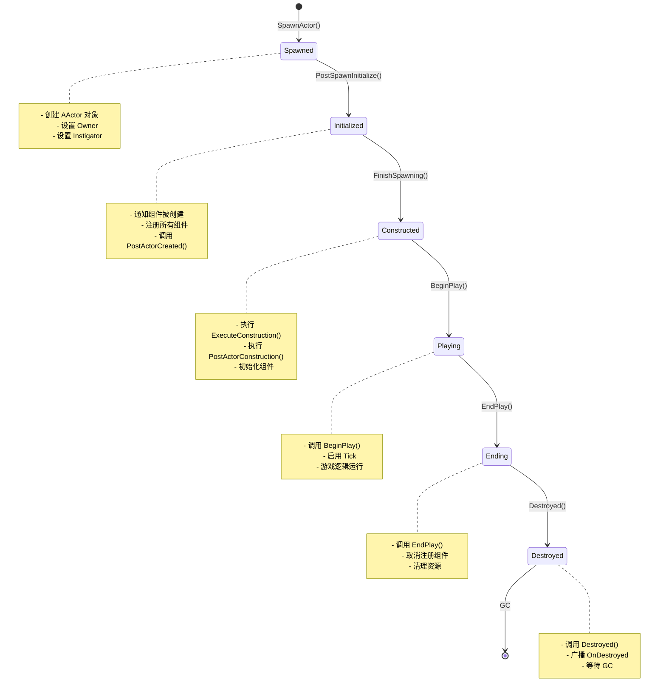
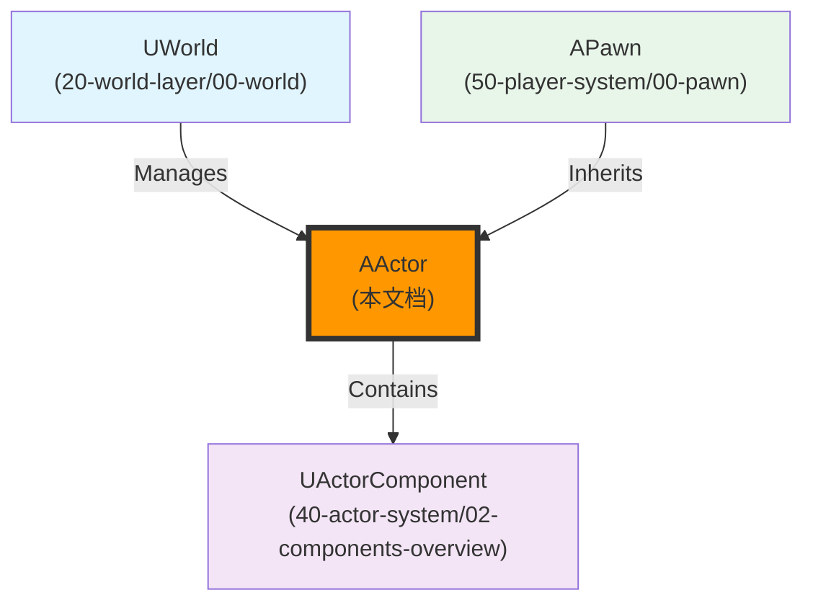

# AActor完整生命周期

## 概述

> `AActor` 有一套完整的生命周期流程，从 Spawn 到 Destroy，每个阶段都有对应的虚函数可以重写。理解 Actor 的生命周期对于正确初始化和清理资源至关重要。

---

## 核心概念

### Actor 生命周期阶段

Actor 的生命周期可以分为以下几个阶段：



**阶段说明**：

| 阶段 | 函数 | 说明 |
|------|------|------|
| **Spawned** | `SpawnActor()` | 创建 Actor 对象 |
| **Initialized** | `PostSpawnInitialize()` | 初始化 Actor（注册组件、调用 `PostActorCreated()`） |
| **Constructed** | `FinishSpawning()` | 执行构造脚本（蓝图的 `Construction Script`） |
| **Playing** | `BeginPlay()` | 开始游戏逻辑（启用 Tick、调用组件 `BeginPlay()`） |
| **Ending** | `EndPlay()` | 结束游戏逻辑（清理资源、调用组件 `EndPlay()`） |
| **Destroyed** | `Destroyed()` | 销毁 Actor（广播 `OnDestroyed`、等待 GC） |

---

## 架构解析

### Actor 生命周期关键方法

#### PostSpawnInitialize() - Spawn 后初始化

**功能**：在 Actor Spawn 后调用，初始化 Actor。

**执行流程**：

```mermaid
sequenceDiagram
    participant World as UWorld
    participant Actor as AActor
    participant Comp as UActorComponent
    
    World->>Actor: SpawnActor<AActor>()
    Actor->>Actor: PostSpawnInitialize()
    Actor->>Comp: DispatchOnComponentsCreated()
    Actor->>Comp: RegisterAllComponents()
    Actor->>Actor: PostActorCreated()
    Actor->>Actor: FinishSpawning()
```

**关键代码**：

```cpp
void AActor::PostSpawnInitialize(FTransform const& SpawnTransform, AActor* InOwner, APawn* InInstigator, bool bRemoteOwned, bool bNoFail, bool bDeferConstruction, ESpawnActorScaleMethod TransformScaleMethod)
{
    // 通知组件被创建了（直接挂在蓝图上的）
    DispatchOnComponentsCreated(this);
    
    // 为所有创建的组件执行注册
    RegisterAllComponents();
    
    // 这里可以通过重载处理一些初始化逻辑（在 BeginPlay 执行之前）
    PostActorCreated();
    
    // Actor 创建完成（执行组件的初始化、调用 BeginPlay）
    FinishSpawning(UserSpawnTransform, true);
}
```

#### FinishSpawning() - 创建结束

**功能**：完成 Actor 的创建，执行构造脚本和组件初始化。

**执行流程**：

```mermaid
sequenceDiagram
    participant Actor as AActor
    participant Comp as UActorComponent
    
    Actor->>Actor: FinishSpawning()
    Actor->>Actor: ExecuteConstruction()
    Actor->>Comp: PreInitializeComponents()
    Actor->>Comp: InitializeComponent()
    Actor->>Comp: PostInitializeComponents()
    Actor->>Comp: BeginPlay()
```

**关键代码**：

```cpp
void AActor::FinishSpawning(FTransform const& UserSpawnTransform, bool bIsDefaultTransform, const FComponentInstanceDataCache* InstanceDataCache, bool bDeferPostSpawnInitialize)
{
    // 执行 OnConstruction 函数（包括蓝图的）
    ExecuteConstruction(UserSpawnTransform, false, InstanceDataCache);
    
    // 执行组件的初始化，调用 BeginPlay
    PostActorConstruction(bIsDefaultTransform, bDeferPostSpawnInitialize);
}

void AActor::PostActorConstruction(bool bIsDefaultTransform, bool bDeferPostSpawnInitialize)
{
    // 组件的初始化
    PreInitializeComponents();
    InitializeComponents();
    PostInitializeComponents();
    
    // 执行 BeginPlay
    // (部分逻辑可能会放到滞后去处理，比如网络复制创建时通过 AActor::PostNetInit 在网络数据准备之后再执行)
    if (bRunBeginPlay)
    {
        SCOPE_CYCLE_COUNTER(STAT_ActorBeginPlay);
        DispatchBeginPlay();
    }
}
```

#### DispatchBeginPlay() - 初始化游戏逻辑状态

**功能**：调用 `BeginPlay()`，启动 Tick，通知组件的 `BeginPlay()`。

**执行流程**：

```mermaid
sequenceDiagram
    participant Actor as AActor
    participant Comp as UActorComponent
    
    Actor->>Actor: DispatchBeginPlay()
    Actor->>Actor: RegisterAllActorTickFunctions()
    Actor->>Comp: RegisterAllComponentTickFunctions()
    Comp->>Comp: BeginPlay()
    Actor->>Actor: BeginPlay()
```

**关键代码**：

```cpp
void AActor::DispatchBeginPlay(bool bFromLevelStreaming)
{
    // 准备需要网络复制的组件
    BuildReplicatedComponentsInfo();
    
#if UE_WITH_IRIS
    BeginReplication();
#endif // UE_WITH_IRIS
    
    // 调用 BeginPlay，启动 Tick，通知组件的 BeginPlay
    // 子类可以重载实现各种初始化操作
    BeginPlay();
}

void AActor::BeginPlay()
{
    // 尝试启用 Tick
    RegisterAllActorTickFunctions(true, false); // Components are done below.
    
    // 调用组件的 BeginPlay 并尝试启用组件的 Tick
    for (UActorComponent* Component : Components)
    {
        if (Component->IsRegistered() && !Component->HasBegunPlay())
        {
            Component->RegisterAllComponentTickFunctions(true);
            Component->BeginPlay();
        }
    }
}
```

#### Destroy() - 销毁 Actor

**功能**：销毁 Actor，调用 `UWorld::DestroyActor()`。

**执行流程**：

```mermaid
sequenceDiagram
    participant Actor as AActor
    participant World as UWorld
    participant Comp as UActorComponent
    
    Actor->>Actor: Destroy()
    Actor->>World: DestroyActor(this)
    World->>Actor: Destroyed()
    Actor->>Comp: UnregisterAllComponents()
    Actor->>Actor: RegisterAllActorTickFunctions(false)
```

**关键代码**：

```cpp
bool AActor::Destroy(bool bNetForce, bool bShouldModifyLevel)
{
    if (!IsPendingKillPending())
    {
        UWorld* World = GetWorld();
        if (World)
        {
            World->DestroyActor(this, bNetForce, bShouldModifyLevel);
        }
    }
    
    return IsPendingKillPending();
}

bool UWorld::DestroyActor(AActor* ThisActor, bool bNetForce, bool bShouldModifyLevel)
{
    // 通知 Actor 即将被销毁
    ThisActor->Destroyed();
    
    // 取消注册组件
    ThisActor->UnregisterAllComponents();
    
    // 取消 Tick
    ThisActor->RegisterAllActorTickFunctions(...);
}
```

#### Destroyed() - 销毁前的清理

**功能**：在 Actor 销毁前调用，执行清理逻辑。

**执行流程**：

```mermaid
sequenceDiagram
    participant Actor as AActor
    participant Comp as UActorComponent
    
    Actor->>Actor: Destroyed()
    Actor->>Actor: RouteEndPlay(EEndPlayReason::Destroyed)
    Actor->>Comp: EndPlay()
    Actor->>Actor: ReceiveDestroyed()
    Actor->>Actor: OnDestroyed.Broadcast(this)
```

**关键代码**：

```cpp
void AActor::Destroyed()
{
    // 调用 EndPlay
    RouteEndPlay(EEndPlayReason::Destroyed);
    
    // 蓝图事件
    ReceiveDestroyed();
    
    // 广播委托
    OnDestroyed.Broadcast(this);
}
```

#### RouteEndPlay() - 清理游戏逻辑状态

**功能**：调用 `EndPlay()`，清理游戏逻辑，调用组件的 `EndPlay()`。

**执行流程**：

```mermaid
sequenceDiagram
    participant Actor as AActor
    participant Comp as UActorComponent
    
    Actor->>Actor: RouteEndPlay(EndPlayReason)
    Actor->>Actor: EndPlay(EndPlayReason)
    Actor->>Comp: EndPlay(EndPlayReason)
    Actor->>Actor: UninitializeComponents()
```

**关键代码**：

```cpp
void AActor::RouteEndPlay(const EEndPlayReason::Type EndPlayReason)
{
    if (bActorInitialized)
    {
        if (ActorHasBegunPlay == EActorBeginPlayState::HasBegunPlay)
        {
            // 调用 EndPlay，子类可以重载
            EndPlay(EndPlayReason);
        }
        
        if (EndPlayReason == EEndPlayReason::RemovedFromWorld)
        {
            ClearComponentOverlaps();
            
            bActorInitialized = false;
            if (UWorld* World = GetWorld())
            {
                World->RemoveNetworkActor(this);
#if UE_WITH_IRIS
                EndReplication(EndPlayReason);
#endif
            }
        }
    }
    
    // 组件卸载操作
    UninitializeComponents();
}

void AActor::EndPlay(const EEndPlayReason::Type EndPlayReason)
{
    if (ActorHasBegunPlay == EActorBeginPlayState::HasBegunPlay)
    {
        ActorHasBegunPlay = EActorBeginPlayState::HasNotBegunPlay;
        
#if UE_WITH_IRIS
        EndReplication(EndPlayReason);
#endif
        
        // 通知 EndPlay
        ReceiveEndPlay(EndPlayReason);
        OnEndPlay.Broadcast(this, EndPlayReason);
        
        // 调用组件的 EndPlay
        TInlineComponentArray<UActorComponent*> Components;
        GetComponents(Components);
        
        for (UActorComponent* Component : Components)
        {
            if (Component->HasBegunPlay())
            {
                Component->EndPlay(EndPlayReason);
            }
        }
    }
}
```

---

## 执行流程

### Actor 完整生命周期时序图

```mermaid
sequenceDiagram
    participant World as UWorld
    participant Actor as AActor
    participant Comp as UActorComponent
    
    Note over World,Actor: === Spawn 阶段 ===
    World->>Actor: SpawnActor<AActor>()
    Actor->>Actor: PostSpawnInitialize()
    Actor->>Comp: DispatchOnComponentsCreated()
    Actor->>Comp: RegisterAllComponents()
    Actor->>Actor: PostActorCreated()
    
    Note over World,Actor: === Construction 阶段 ===
    Actor->>Actor: FinishSpawning()
    Actor->>Actor: ExecuteConstruction()
    Actor->>Comp: PreInitializeComponents()
    Actor->>Comp: InitializeComponent()
    Actor->>Comp: PostInitializeComponents()
    
    Note over World,Actor: === BeginPlay 阶段 ===
    Actor->>Actor: DispatchBeginPlay()
    Actor->>Actor: BeginPlay()
    Actor->>Actor: RegisterAllActorTickFunctions()
    Actor->>Comp: BeginPlay()
    Actor->>Comp: RegisterAllComponentTickFunctions()
    
    Note over World,Actor: === Tick 阶段 ===
    loop 每帧
        World->>Actor: Tick(DeltaSeconds)
        Actor->>Comp: TickComponent(DeltaSeconds)
    end
    
    Note over World,Actor: === EndPlay 阶段 ===
    Actor->>Actor: Destroy()
    Actor->>World: DestroyActor(this)
    World->>Actor: Destroyed()
    Actor->>Actor: RouteEndPlay()
    Actor->>Actor: EndPlay()
    Actor->>Comp: EndPlay()
    Actor->>Comp: UnregisterComponent()
    
    Note over World,Actor: === Destroyed 阶段 ===
    Actor->>Actor: ReceiveDestroyed()
    Actor->>Actor: OnDestroyed.Broadcast()
    Actor->>World: 等待 GC
```

---

## 与其他模块的关系

`AActor` 的生命周期与以下系统紧密相关：



**关系说明**：

| 相关模块 | 关系 | 说明 |
|----------|------|------|
| **UWorld** | 管理 Actor | `UWorld` 管理 Actor 的生命周期（Spawn/Destroy） |
| **UActorComponent** | 被 Actor 包含 | `AActor` 包含一组 `UActorComponent`，组件的生命周期跟随 Actor |
| **APawn** | 继承自 AActor | `APawn` 继承自 `AActor`，增加了移动和控制器功能 |

---

## 常见陷阱与最佳实践

### ⚠️ 常见陷阱

1. **在错误的时机访问组件**
   - ❌ 错误：在构造函数中访问 `RootComponent`
   - ✅ 正确：`RootComponent` 在 `PostSpawnInitialize()` 之后才有效

2. **不理解 Actor 的生命周期**
   - ❌ 错误：在 `BeginPlay()` 之前调用 `Tick()`
   - ✅ 正确：`Tick()` 在 `BeginPlay()` 之后才开始

3. **忘记清理资源**
   - ❌ 错误：只在 `Destroyed()` 中清理资源
   - ✅ 正确：在 `EndPlay()` 中清理游戏逻辑资源，在 `Destroyed()` 中清理非游戏逻辑资源

### ✅ 最佳实践

1. **使用正确的初始化函数**
   - 需要在组件初始化后执行逻辑 → 重写 `PostInitializeComponents()`
   - 需要开始游戏逻辑 → 重写 `BeginPlay()`
   - 需要执行构造脚本 → 重写 `OnConstruction()`

2. **使用正确的清理函数**
   - 需要清理游戏逻辑 → 重写 `EndPlay()`
   - 需要清理非游戏逻辑资源 → 重写 `Destroyed()`

3. **理解网络复制的时机**
   - 网络复制的 Actor → `BeginPlay()` 可能在网络数据准备好之前调用
   - 需要等待网络数据 → 重写 `PostNetInit()`

---

## 参考资料

### UE 官方文档
- [UE5 官方文档](https://docs.unrealengine.com/5.0/zh-CN/)
- [Actor 生命周期官方文档](https://docs.unrealengine.com/5.0/zh-CN/actor-lifecycle-in-unreal-engine/)

### 内部文档
- [[30-tutorials/ue-framework/00-UE框架概述|UE 框架概述]]
- [[30-tutorials/ue-framework/01-UE游戏主循环详解|游戏主循环详解]]
- [[30-tutorials/ue-framework/40-actor-system/00-AActor架构概述|AActor 架构概述]]

---

**文档版本**：v1.0  
**最后更新**：2026-05-16  
**维护者**：AI Agent（按项目规范维护）

<!-- nav:auto -->

---

**导航**: ← [[30-tutorials/ue-framework/40-actor-system/00-AActor架构概述|00-AActor架构概述]] · [[30-tutorials/ue-framework/50-player-system/00-APawn与ACharacter详解|00-APawn与ACharacter详解]] →

<!-- /nav:auto -->
