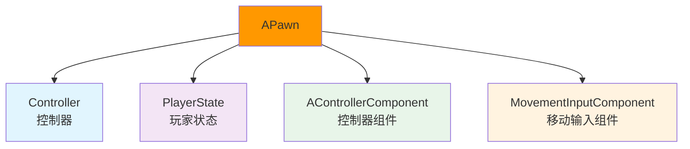
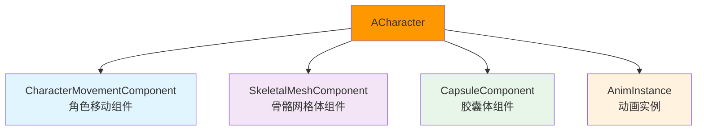
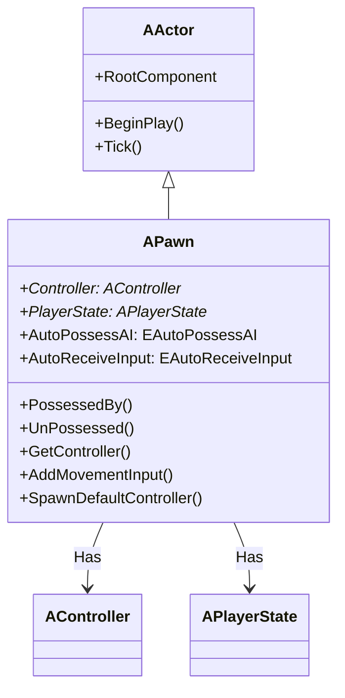
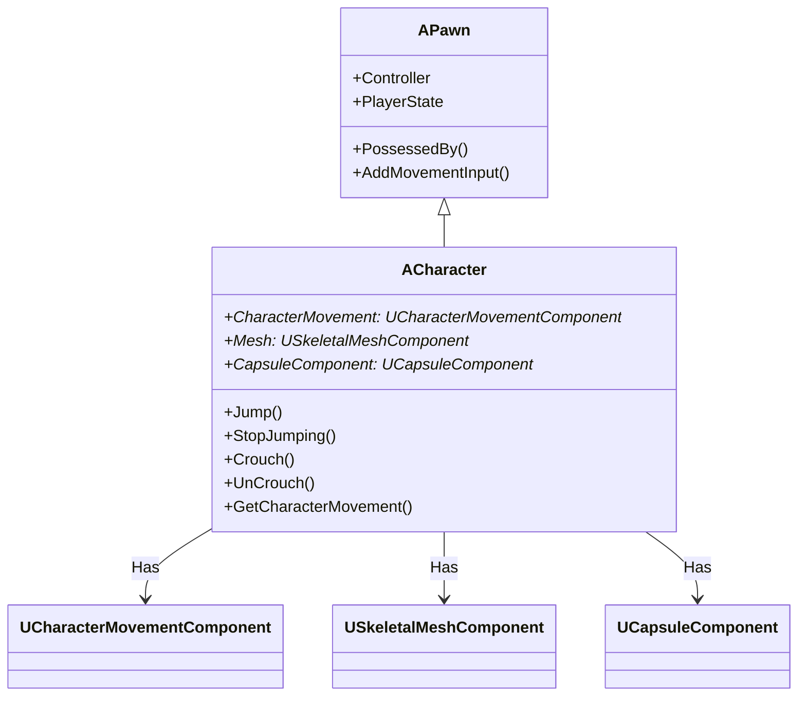
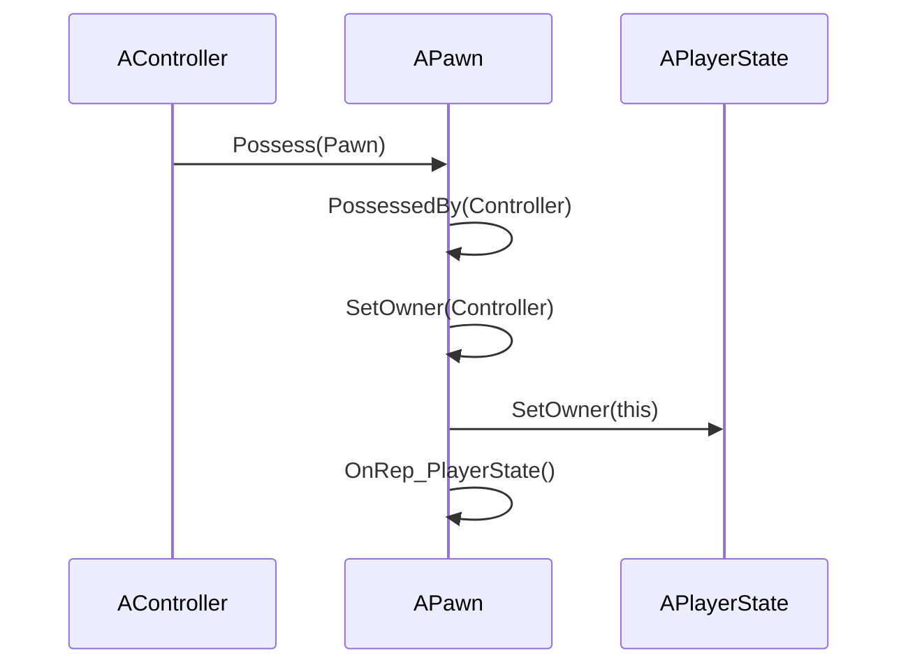
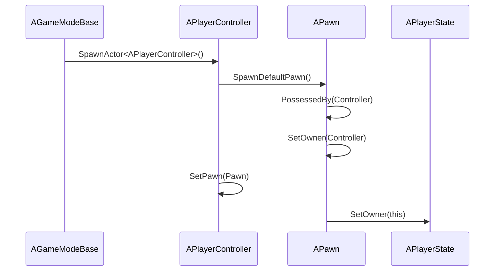
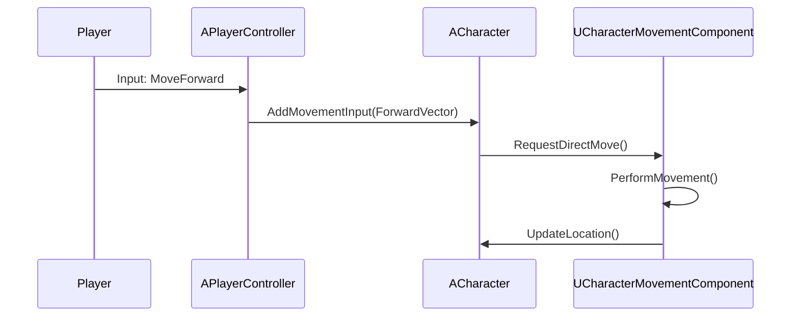
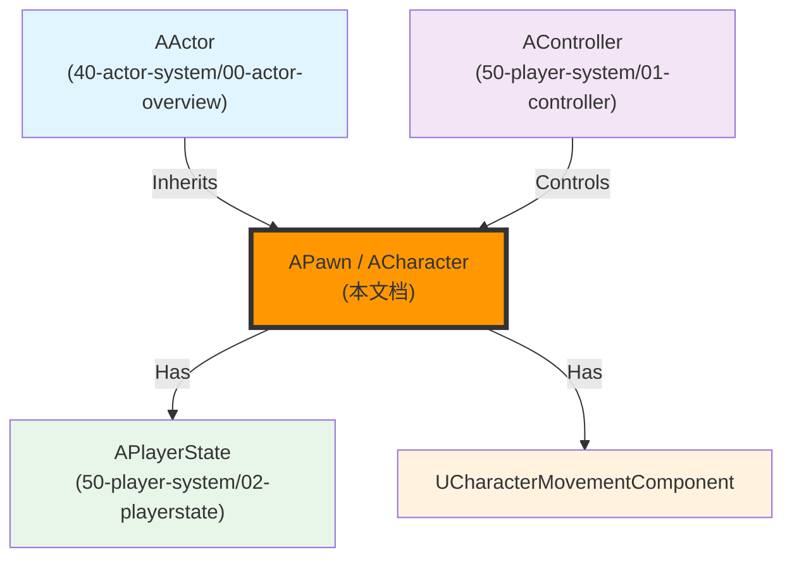

# APawn与ACharacter详解

## 概述

> `APawn` 是 `AActor` 的子类，增加了移动、控制器、输入处理等功能。`ACharacter` 是 `APawn` 的子类，增加了骨骼网格体、动画、移动组件等人类角色特有的功能。

---

## 核心概念

### Pawn 的职责

`APawn` 是游戏中的"角色"载体，负责管理：



**核心职责**：
1. **控制器管理**：被 `AController` 控制（`PossessedBy()` / `UnPossessed()`）
2. **移动输入处理**：接收移动输入（`AddMovementInput()`）
3. **玩家状态管理**：关联 `PlayerState`
4. **碰撞检测**：管理 Pawn 的碰撞和重叠事件

### Character 的职责

`ACharacter` 是人类角色的具体实现，增加了：



**核心职责**：
1. **移动功能**：通过 `UCharacterMovementComponent` 实现行走、跑步、跳跃、蹲伏等
2. **动画功能**：通过 `USkeletalMeshComponent` 和 `UAnimInstance` 实现动画播放
3. **碰撞功能**：通过 `UCapsuleComponent` 实现碰撞检测
4. **输入处理**：处理跳跃、蹲伏、移动等输入

---

## 架构解析

### APawn 类继承关系



### ACharacter 类继承关系



### 关键属性详解

#### Controller - 控制器

```cpp
/** Controller currently possessing this Actor */
UPROPERTY(BlueprintReadOnly, meta=(AllowPrivateAccess="true"), Category=Pawn)
AController* Controller;
```

**说明**：
- 当前控制这个 Pawn 的 Controller
- 通过 `GetController()` 获取
- 通过 `PossessedBy()` 设置

#### PlayerState - 玩家状态

```cpp
/** PlayerState containing replicated information about the Player using this pawn */
UPROPERTY(replicatedUsing=OnRep_PlayerState, BlueprintReadOnly, Category=Pawn)
APlayerState* PlayerState;
```

**说明**：
- 包含玩家的复制信息（如玩家名字、分数等）
- 会在服务器和客户端之间复制
- 通过 `OnRep_PlayerState()` 监听变化

### 关键方法详解

#### PossessedBy() - 被 Controller 控制

**功能**：当 Pawn 被 Controller 控制时调用。

**执行流程**：



**关键代码**：

```cpp
void APawn::PossessedBy(AController* NewController)
{
    // 设置 Controller
    Controller = NewController;
    
    // 设置 Owner
    SetOwner(NewController);
    
    // 设置 PlayerState
    if (PlayerState && NewController->PlayerState)
    {
        PlayerState = NewController->PlayerState;
    }
    
    // 触发复制回调
    OnRep_PlayerState();
}
```

#### UnPossessed() - 失去控制

**功能**：当 Pawn 失去 Controller 控制时调用。

**关键代码**：

```cpp
void APawn::UnPossessed()
{
    // 清除 Controller
    Controller = nullptr;
}
```

#### AddMovementInput() - 添加移动输入

**功能**：添加移动输入，用于驱动 Pawn 移动。

**关键代码**：

```cpp
void APawn::AddMovementInput(FVector WorldDirection, float ScaleValue)
{
    // 将输入传递给 Controller
    if (Controller)
    {
        Controller->AddMovementInput(WorldDirection, ScaleValue);
    }
}
```

#### Jump() / StopJumping() - 跳跃

**功能**：控制 Character 跳跃。

**关键代码**（ACharacter）：

```cpp
void ACharacter::Jump()
{
    // 通知 CharacterMovementComponent 开始跳跃
    if (CharacterMovement)
    {
        CharacterMovement->DoJump();
    }
}

void ACharacter::StopJumping()
{
    // 通知 CharacterMovementComponent 停止跳跃
    if (CharacterMovement)
    {
        CharacterMovement->StopJumping();
    }
}
```

#### Crouch() / UnCrouch() - 蹲伏

**功能**：控制 Character 蹲伏。

**关键代码**（ACharacter）：

```cpp
void ACharacter::Crouch()
{
    // 通知 CharacterMovementComponent 开始蹲伏
    if (CharacterMovement)
    {
        CharacterMovement->Crouch();
    }
}

void ACharacter::UnCrouch()
{
    // 通知 CharacterMovementComponent 停止蹲伏
    if (CharacterMovement)
    {
        CharacterMovement->UnCrouch();
    }
}
```

---

## 执行流程

### Pawn 被 Controller 控制流程



### Character 移动流程



---

## 与其他模块的关系

`APawn` 和 `ACharacter` 作为游戏中的"角色"载体，与以下系统紧密相关：



**关系说明**：

| 相关模块 | 关系 | 说明 |
|----------|------|------|
| **AActor** | 被继承 | `APawn` 继承自 `AActor` |
| **AController** | 控制 Pawn | `AController` 通过 `Possess()` 控制 `APawn` |
| **APlayerState** | 被 Pawn 关联 | `APawn` 关联 `APlayerState`（存储玩家信息） |
| **UCharacterMovementComponent** | 被 Character 包含 | `ACharacter` 包含 `UCharacterMovementComponent`（处理移动） |

---

## 常见陷阱与最佳实践

### ⚠️ 常见陷阱

1. **在错误的时机访问 Controller**
   - ❌ 错误：在构造函数中访问 `Controller`
   - ✅ 正确：`Controller` 在 `PossessedBy()` 之后才有效

2. **不理解 Pawn 和 Controller 的关系**
   - ❌ 错误：认为 Pawn 可以直接处理输入
   - ✅ 正确：输入应该由 `Controller` 处理，然后传递给 `Pawn`

3. **混淆 Pawn 和 Character**
   - ❌ 错误：在 `APawn` 中处理动画
   - ✅ 正确：动画应该由 `ACharacter` 处理（通过 `USkeletalMeshComponent` 和 `UAnimInstance`）

### ✅ 最佳实践

1. **使用 PossessedBy() 处理控制逻辑**
   - Pawn 被控制时 → 重写 `PossessedBy()`
   - 在 `PossessedBy()` 中初始化与控制相关的逻辑

2. **使用 CharacterMovementComponent 处理移动**
   - 需要自定义移动 → 继承自 `UCharacterMovementComponent`
   - 在 `ACharacter::PossessedBy()` 中设置移动参数

3. **理解 Pawn 和 Controller 的生命周期**
   - `Pawn` 可以在 `Controller` 之前创建
   - `Controller` 通过 `Possess()` 控制 `Pawn`
   - `Controller` 销毁时，会自动调用 `Pawn::UnPossessed()`

---

## 参考资料

### UE 官方文档
- [UE5 官方文档](https://docs.unrealengine.com/5.0/zh-CN/)
- [Pawn 官方文档](https://docs.unrealengine.com/5.0/zh-CN/pawns-in-unreal-engine/)
- [Character 官方文档](https://docs.unrealengine.com/5.0/zh-CN/characters-in-unreal-engine/)

### 内部文档
- [[30-tutorials/ue-framework/00-UE框架概述|UE 框架概述]]
- [[30-tutorials/ue-framework/01-UE游戏主循环详解|游戏主循环详解]]
- [[30-tutorials/ue-framework/40-actor-system/00-AActor架构概述|AActor 架构概述]]
- [[30-tutorials/ue-framework/50-player-system/01-AController详解|AController 详解]]

---

**文档版本**：v1.0  
**最后更新**：2026-05-16  
**维护者**：AI Agent（按项目规范维护）

<!-- nav:auto -->

---

**导航**: ← [[30-tutorials/ue-framework/40-actor-system/01-AActor完整生命周期|01-AActor完整生命周期]] · [[30-tutorials/ue-framework/50-player-system/01-AController详解|01-AController详解]] →

<!-- /nav:auto -->
