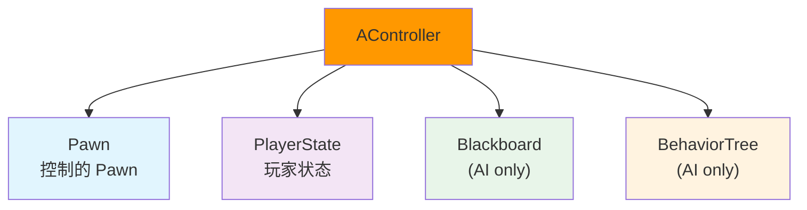
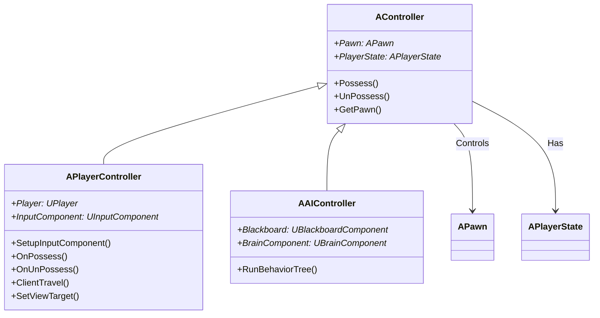
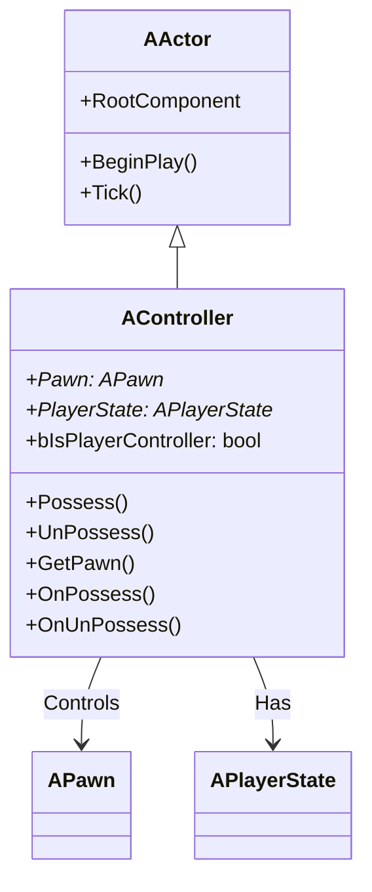
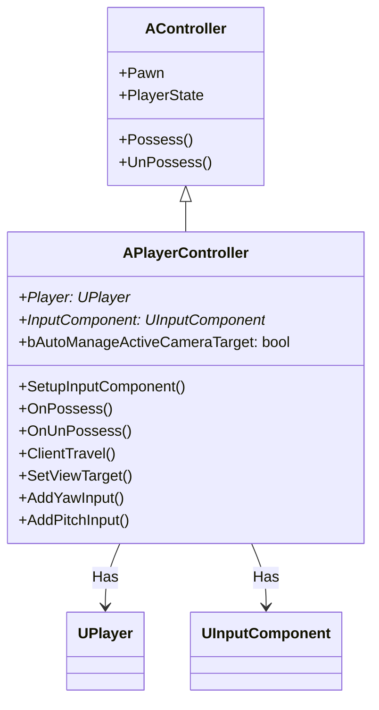
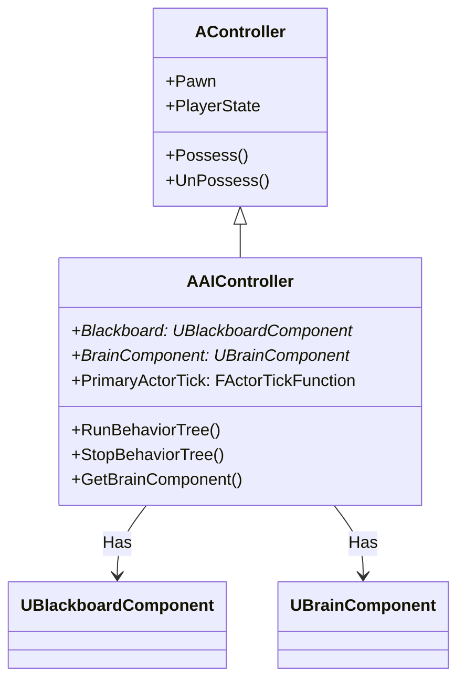
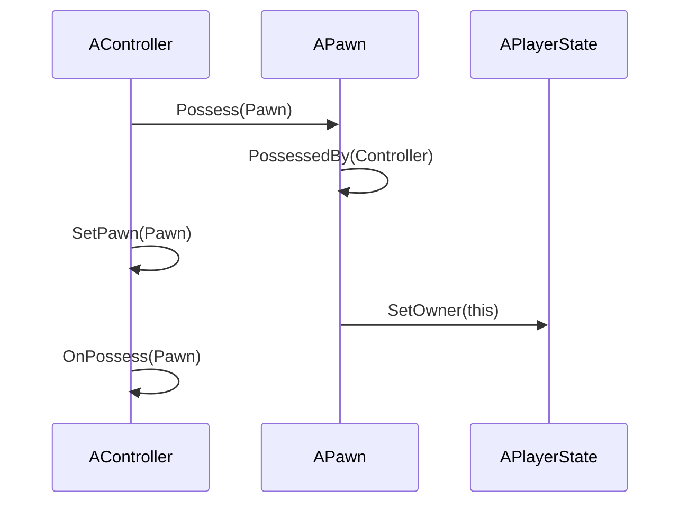
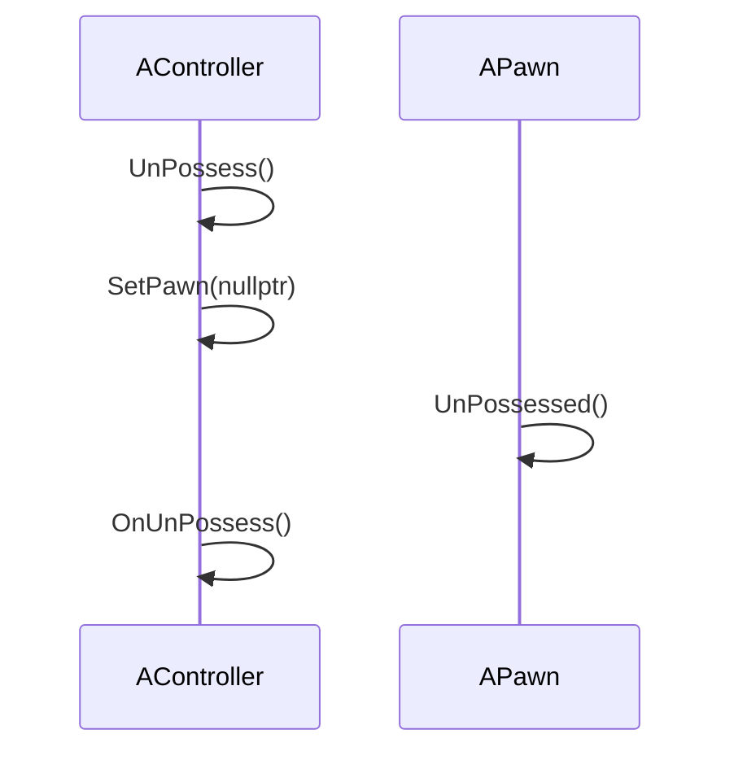
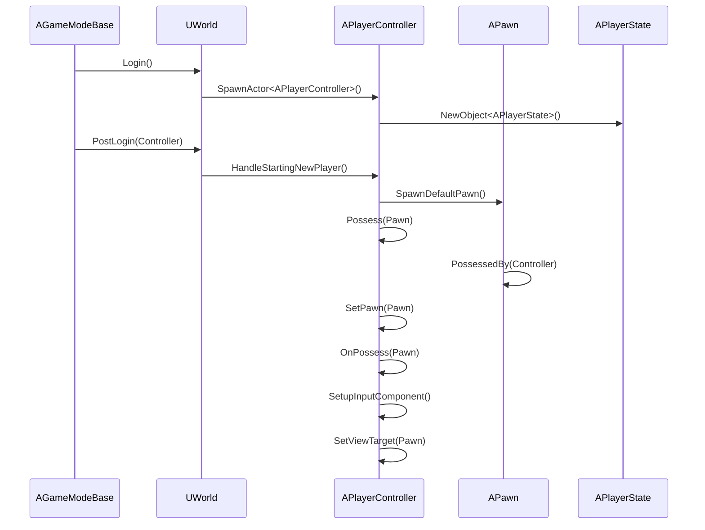
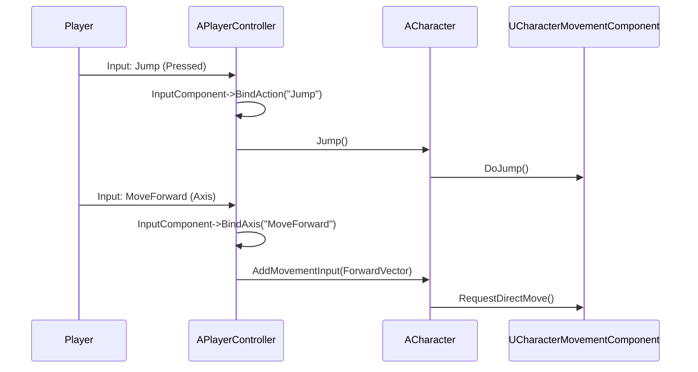
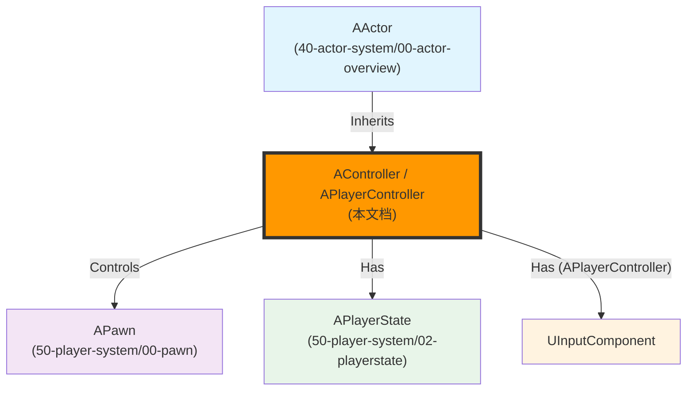

# AController详解

## 概述

> `AController` 是 `AActor` 的子类，用于控制 `APawn`。`AController` 有两个主要子类：`APlayerController`（玩家控制器）和 `AAIController`（AI 控制器）。Controller 负责控制 Pawn 的移动、视角、输入处理等。

---

## 核心概念

### Controller 的职责

`AController` 是 Pawn 的控制器，负责管理：



**核心职责**：
1. **Pawn 控制**：控制 Pawn 的移动、视角、输入处理（`Possess()` / `UnPossess()`）
2. **玩家状态管理**：关联 `PlayerState`
3. **输入处理**：处理玩家输入（仅 `APlayerController`）
4. **AI 行为管理**：管理行为树和黑板（仅 `AAIController`）

### Controller 与 Pawn 的关系



**关系说明**：
- `AController` 控制 `APawn`（通过 `Possess()` 和 `UnPossess()`）
- `APlayerController` 处理玩家输入，控制 `APawn`
- `AAIController` 运行行为树，控制 `APawn`

---

## 架构解析

### AController 类继承关系



### APlayerController 类继承关系



### AAIController 类继承关系



### 关键属性详解

#### Pawn - 控制的 Pawn

```cpp
/** Pawn currently being controlled by this controller */
UPROPERTY(BlueprintReadOnly, Category="Controller")
APawn* Pawn;
```

**说明**：
- 当前被这个 Controller 控制的 Pawn
- 通过 `GetPawn()` 获取
- 通过 `Possess()` 设置

#### PlayerState - 玩家状态

```cpp
/** PlayerState containing replicated information about the Player using this controller */
UPROPERTY(replicatedUsing=OnRep_PlayerState, BlueprintReadOnly, Category="Controller")
APlayerState* PlayerState;
```

**说明**：
- 包含玩家的复制信息（如玩家名字、分数等）
- 会在服务器和客户端之间复制
- 通过 `OnRep_PlayerState()` 监听变化

### 关键方法详解

#### Possess() - 控制 Pawn

**功能**：控制指定的 Pawn。

**执行流程**：



**关键代码**：

```cpp
void AController::Possess(APawn* InPawn)
{
    // 设置 Pawn
    SetPawn(InPawn);
    
    // 通知 Pawn 被控制
    InPawn->PossessedBy(this);
    
    // 调用虚函数（子类可以重写）
    OnPossess(InPawn);
}
```

#### UnPossess() - 失去 Pawn

**功能**：失去对 Pawn 的控制。

**执行流程**：



**关键代码**：

```cpp
void AController::UnPossess()
{
    // 清除 Pawn
    APawn* OldPawn = GetPawn();
    SetPawn(nullptr);
    
    // 通知 Pawn 失去控制
    if (OldPawn)
    {
        OldPawn->UnPossessed();
    }
    
    // 调用虚函数（子类可以重写）
    OnUnPossess();
}
```

#### OnPossess() - 控制 Pawn 时的回调（APlayerController）

**功能**：当 PlayerController 控制 Pawn 时调用。

**关键代码**（APlayerController）：

```cpp
void APlayerController::OnPossess(APawn* InPawn)
{
    // 设置输入组件
    SetupInputComponent();
    
    // 设置视角目标
    SetViewTarget(InPawn);
    
    // 激活 Input Component
    if (InputComponent)
    {
        InputComponent->bIsActive = true;
    }
}
```

#### SetupInputComponent() - 设置输入组件

**功能**：设置输入组件，绑定输入动作。

**关键代码**（APlayerController）：

```cpp
void APlayerController::SetupInputComponent()
{
    // 创建 InputComponent
    InputComponent = NewObject<UInputComponent>(this);
    
    // 绑定输入动作
    InputComponent->BindAction("Jump", IE_Pressed, this, &ThisClass::Jump);
    InputComponent->BindAxis("MoveForward", this, &ThisClass::MoveForward);
    // ...
}
```

---

## 执行流程

### Controller 控制 Pawn 的完整流程



### PlayerController 输入处理流程



---

## 与其他模块的关系

`AController` 作为 Pawn 的控制器，与以下系统紧密相关：



**关系说明**：

| 相关模块 | 关系 | 说明 |
|----------|------|------|
| **AActor** | 被继承 | `AController` 继承自 `AActor` |
| **APawn** | 被 Controller 控制 | `AController` 通过 `Possess()` 控制 `APawn` |
| **APlayerState** | 被 Controller 关联 | `AController` 关联 `APlayerState`（存储玩家信息） |
| **UInputComponent** | 被 PlayerController 包含 | `APlayerController` 包含 `UInputComponent`（处理输入） |

---

## 常见陷阱与最佳实践

### ⚠️ 常见陷阱

1. **在错误的时机访问 Pawn**
   - ❌ 错误：在构造函数中访问 `GetPawn()`
   - ✅ 正确：`Pawn` 在 `Possess()` 之后才有效

2. **不理解 Controller 和 Pawn 的生命周期**
   - ❌ 错误：认为 Controller 销毁时 Pawn 会自动销毁
   - ✅ 正确：Controller 销毁时，会调用 `UnPossess()`，但 Pawn 不会自动销毁

3. **混淆 PlayerController 和 AIController**
   - ❌ 错误：在 `APlayerController` 中运行行为树
   - ✅ 正确：行为树应该由 `AAIController` 运行

### ✅ 最佳实践

1. **使用 Possess() 和 UnPossess() 管理控制关系**
   - 需要控制 Pawn → 调用 `Possess(Pawn)`
   - 需要释放 Pawn → 调用 `UnPossess()`

2. **使用 SetupInputComponent() 绑定输入**
   - 需要绑定输入动作 → 重写 `SetupInputComponent()`
   - 在 `OnPossess()` 中会自动调用 `SetupInputComponent()`

3. **理解 Controller 和 Pawn 的关系**
   - `Controller` 控制 `Pawn`
   - `Pawn` 被 `Controller` 控制
   - 一个 `Controller` 只能控制一个 `Pawn`
   - 一个 `Pawn` 只能被一个 `Controller` 控制

---

## 参考资料

### UE 官方文档
- [UE5 官方文档](https://docs.unrealengine.com/5.0/zh-CN/)
- [Controller 官方文档](https://docs.unrealengine.com/5.0/zh-CN/controllers-in-unreal-engine/)
- [PlayerController 官方文档](https://docs.unrealengine.com/5.0/zh-CN/player-controllers-in-unreal-engine/)
- [AIController 官方文档](https://docs.unrealengine.com/5.0/zh-CN/ai-controllers-in-unreal-engine/)

### 内部文档
- [[30-tutorials/ue-framework/00-UE框架概述|UE 框架概述]]
- [[30-tutorials/ue-framework/01-UE游戏主循环详解|游戏主循环详解]]
- [[30-tutorials/ue-framework/50-player-system/00-APawn与ACharacter详解|APawn 与 ACharacter 详解]]

---

**文档版本**：v1.0  
**最后更新**：2026-05-16  
**维护者**：AI Agent（按项目规范维护）

<!-- nav:auto -->

---

**导航**: ← [[30-tutorials/ue-framework/50-player-system/00-APawn与ACharacter详解|00-APawn与ACharacter详解]] · [[30-tutorials/ue-framework/60-tick-system/00-Tick系统架构概述|00-Tick系统架构概述]] →

<!-- /nav:auto -->
