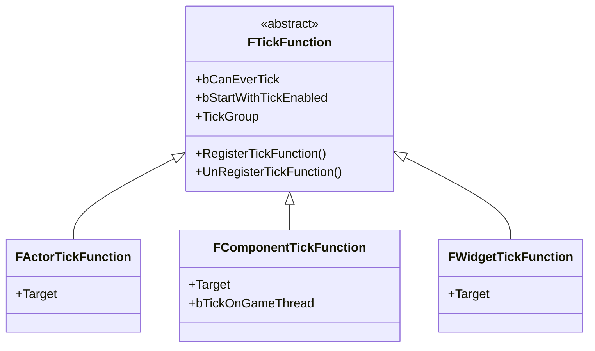
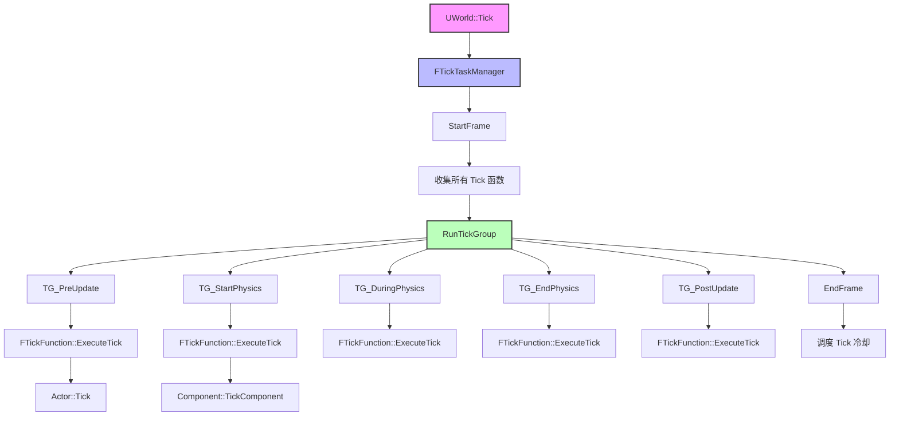
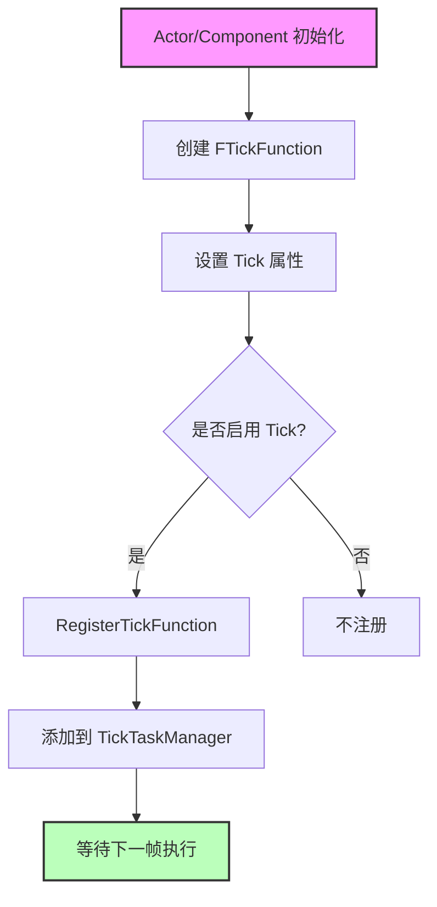
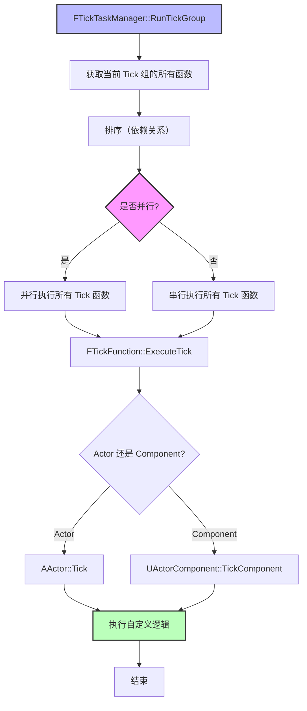

# Tick系统架构概述

> **文档定位**：本文档深入分析 Unreal Engine 5 的 Tick 系统架构，帮助开发者理解 Tick 的底层机制、调度策略和性能优化方法。

## 概述

**Tick 系统**是 Unreal Engine 的核心驱动机制，负责在每一帧中更新所有需要帧更新的对象（Actor、Component、UMG 等）。Tick 系统的设计目标是：

1. **灵活性**：支持不同类型的对象在不同的时机进行帧更新
2. **并行性**：支持多线程并行 Tick，提高性能
3. **可控性**：支持动态启用/禁用 Tick，优化性能

**核心类/结构体**：
- **FTickFunction**：Tick 函数的抽象基类，定义了 Tick 的基本行为
- **FTickTaskManager**：Tick 任务管理器，负责调度和执行所有 Tick 函数
- **ETickingGroup**：Tick 分组枚举，定义了 Tick 的执行顺序

## 核心概念

### 1. Tick 函数（FTickFunction）

**FTickFunction** 是一个抽象结构体，是所有 Tick 函数的基类。每个需要 Tick 的对象（Actor、Component 等）都会包含一个或多个 FTickFunction。

**核心职责**：
- 定义 Tick 的基本行为（是否启用、Tick 间隔、Tick 组等）
- 注册/取消注册到 Tick 任务管理器
- 执行实际的 Tick 逻辑

**继承关系**：


### 2. Tick 分组（ETickingGroup）

**ETickingGroup** 定义了 Tick 函数的执行顺序。UE5 将 Tick 分为多个组，每个组在不同的时机执行，确保依赖关系正确。

**Tick 组顺序**（按执行顺序）：

| Tick 组 | 说明 |
|---------|------|
| `TG_PreUpdate` | 在帧更新开始前执行，用于准备数据 |
| `TG_StartPhysics` | 在物理模拟开始前执行 |
| `TG_DuringPhysics` | 在物理模拟期间执行（可以并行） |
| `TG_EndPhysics` | 在物理模拟结束后执行 |
| `TG_PostUpdate` | 在帧更新结束后执行 |
| `TG_PostPhysics` | 在物理模拟结束后执行（延迟） |
| `TG_LastDemotable` | 最后一个可以降级的 Tick 组 |
| `TG_NewlySpawned` | 新生成的 Actor 的 Tick 组 |

**设计意图**：
- **物理同步**：确保物理模拟前后的逻辑正确执行
- **并行优化**：`TG_DuringPhysics` 可以与物理模拟并行执行
- **依赖管理**：后一个 Tick 组可以依赖前一个 Tick 组的结果

### 3. Tick 任务管理器（FTickTaskManager）

**FTickTaskManager** 是 Tick 系统的核心管理器，负责：

1. **收集 Tick 函数**：在帧开始时，收集所有需要 Tick 的函数
2. **分组调度**：按照 Tick 组顺序，依次执行每个组的 Tick 函数
3. **并行执行**：在同一个 Tick 组内，尽可能并行执行 Tick 函数
4. **依赖管理**：处理 Tick 函数之间的依赖关系

**核心方法**：
- `StartFrame()`：开始一个新的 Tick 帧，收集所有需要 Tick 的函数
- `RunTickGroup()`：执行一个 Tick 组的所有 Tick 函数
- `EndFrame()`：结束 Tick 帧，清理状态

---

## 架构解析

### 1. Tick 系统架构图



### 2. FTickFunction 结构体

**头文件**：`Engine/Source/Runtime/Engine/Classes/Engine/EngineBaseTypes.h`

**关键属性**：

```cpp
USTRUCT()
struct FTickFunction
{
    GENERATED_USTRUCT_BODY()
    
    // Tick 组（决定执行顺序）
    UPROPERTY(EditDefaultsOnly, Category="Tick", AdvancedDisplay)
    TEnumAsByte<enum ETickingGroup> TickGroup;
    
    // 是否允许 Tick（可以在默认值中设置）
    UPROPERTY()
    uint8 bCanEverTick : 1;
    
    // 是否默认启用 Tick
    UPROPERTY(EditDefaultsOnly, Category="Tick")
    uint8 bStartWithTickEnabled : 1;
    
    // 是否允许在专用服务器上运行
    UPROPERTY(EditDefaultsOnly, Category="Tick", AdvancedDisplay)
    uint8 bAllowTickOnDedicatedServer : 1;
    
    // Tick 间隔（0 表示每帧都 Tick）
    UPROPERTY(EditDefaultsOnly, Category="Tick", AdvancedDisplay)
    float TickInterval;
    
    // 是否启用 Tick（运行时可动态修改）
    uint8 bTickEnabled : 1;
};
```

**关键方法**：

```cpp
// 注册 Tick 函数到 Tick 任务管理器
ENGINE_API void RegisterTickFunction(class ULevel* Level);

// 取消注册 Tick 函数
ENGINE_API void UnRegisterTickFunction();

// 启用/禁用 Tick
ENGINE_API void SetTickFunctionEnable(bool bInEnabled);

// 执行 Tick（纯虚函数，需要子类实现）
virtual void ExecuteTick(float DeltaTime, ELevelTick TickType, ENamedThreads::Type CurrentThread, const FGraphEventRef& MyCompletionGraphEvent) PURE_VIRTUAL(,);

// 更新 Tick 间隔
ENGINE_API void UpdateTickIntervalAndCoolDown(float NewTickInterval);
```

### 3. FTickTaskManager 类

**源文件**：`Engine/Source/Runtime/Engine/Private/TickTaskManager.cpp`

**核心职责**：
- 管理所有 Tick 函数的注册和取消注册
- 在帧开始时收集所有需要 Tick 的函数
- 按照 Tick 组顺序，依次执行每个组的 Tick 函数
- 支持并行执行（在同一个 Tick 组内）

**关键方法**：

```cpp
// 开始一个新的 Tick 帧
virtual void StartFrame(UWorld* InWorld, float InDeltaSeconds, ELevelTick InTickType, const TArray<ULevel*>& LevelsToTick) override;

// 运行一个 Tick 组
virtual void RunTickGroup(ETickingGroup Group, bool bBlockTillComplete) override;

// 结束 Tick 帧
virtual void EndFrame() override;

// 添加 Tick 函数
void AddTickFunction(ULevel* InLevel, FTickFunction* TickFunction);

// 移除 Tick 函数
void RemoveTickFunction(FTickFunction* TickFunction);
```

---

## 执行流程

### 1. Tick 系统完整执行流程

以下时序图展示了 Tick 系统在一个帧中的完整执行流程：

```mermaid
sequenceDiagram
    participant World as UWorld
    participant Manager as FTickTaskManager
    participant TickFunc as FTickFunction
    participant Actor as AActor
    participant Component as UActorComponent
    
    World->>World: Tick(DeltaSeconds, TickType)
    World->>Manager: StartFrame(World, DeltaSeconds, TickType, Levels)
    Manager->>Manager: 收集所有 Tick 函数
    
    loop 每个 Tick 组（按 TG_PreUpdate → TG_PostUpdate 顺序）
        World->>Manager: RunTickGroup(CurrentGroup, bBlockTillComplete)
        
        alt 并行执行
            Manager->>TickFunc: ExecuteTick (并行)
            TickFunc->>Actor: Tick(DeltaTime)
            TickFunc->>Component: TickComponent(DeltaTime)
        else 串行执行
            Manager->>TickFunc: ExecuteTick (串行)
            TickFunc->>Actor: Tick(DeltaTime)
            TickFunc->>Component: TickComponent(DeltaTime)
        end
    end
    
    World->>Manager: EndFrame()
    Manager->>Manager: 调度 Tick 冷却
    Manager->>Manager: 清理状态
```

### 2. Tick 函数注册流程

以下流程图展示了 Tick 函数的注册流程：



### 3. Tick 函数执行流程

以下流程图展示了 Tick 函数的执行流程：



---

## 与其他模块的关系

### 1. 与 UWorld 的关系

- **UWorld** 是 Tick 系统的驱动者：
  - 在 `UWorld::Tick()` 中调用 `FTickTaskManager::StartFrame()`
  - 按照 Tick 组顺序，依次调用 `FTickTaskManager::RunTickGroup()`
  - 在帧结束时调用 `FTickTaskManager::EndFrame()`

### 2. 与 AActor 的关系

- **AActor** 包含一个 `FActorTickFunction`：
  - 在 Actor 初始化时，注册 Tick 函数
  - 在 Actor 销毁时，取消注册 Tick 函数
  - 在 Tick 时，调用 `AActor::Tick()`

### 3. 与 UActorComponent 的关系

- **UActorComponent** 包含一个 `FComponentTickFunction`：
  - 在 Component 初始化时，注册 Tick 函数
  - 在 Component 销毁时，取消注册 Tick 函数
  - 在 Tick 时，调用 `UActorComponent::TickComponent()`

### 4. 与物理引擎的关系

- **物理引擎** 在 `TG_StartPhysics` 和 `TG_EndPhysics` 之间执行
- **TG_DuringPhysics** 可以与物理模拟并行执行
- 这确保了物理模拟前后的逻辑正确执行

---

## 常见陷阱与最佳实践

### 陷阱

1. **Tick 函数未启用**
   - **现象**：Tick 函数没有执行
   - **原因**：
     - `bCanEverTick` 为 `false`
     - `bTickEnabled` 为 `false`
     - 没有调用 `RegisterTickFunction()`
   - **解决**：检查以上属性，确保在正确的时机注册 Tick 函数

2. **Tick 函数执行顺序错误**
   - **现象**：依赖于其他对象的 Tick 逻辑执行顺序错误
   - **原因**：Tick 组设置错误
   - **解决**：正确设置 `TickGroup`，确保依赖关系正确

3. **Tick 函数性能问题**
   - **现象**：游戏帧率下降
   - **原因**：
     - 太多对象启用了 Tick
     - Tick 函数中有耗时操作
   - **解决**：
     - 减少不必要的 Tick
     - 使用 `TickInterval` 降低 Tick 频率
     - 将耗时操作移到其他线程

### 最佳实践

1. **合理设置 Tick 组**
   - 确保 Tick 函数的执行顺序正确
   - 利用并行 Tick 提高性能

2. **动态启用/禁用 Tick**
   - 在不需要 Tick 时，及时禁用 Tick
   - 使用 `SetTickFunctionEnable()` 动态控制

3. **使用 Tick 间隔**
   - 对于不需要每帧更新的逻辑，使用 `TickInterval`
   - 例如：AI 感知可以每 0.1 秒更新一次

4. **避免在 Tick 中做耗时操作**
   - Tick 是每帧执行的，耗时操作会严重影响性能
   - 将耗时操作移到其他线程，或使用定时器

---

## 参考资料

### 源码位置

- **FTickFunction 结构体**：`Engine/Source/Runtime/Engine/Classes/Engine/EngineBaseTypes.h`
- **FTickTaskManager 类**：`Engine/Source/Runtime/Engine/Private/TickTaskManager.cpp`
- **ETickingGroup 枚举**：`Engine/Source/Runtime/Engine/Classes/Engine/EngineBaseTypes.h`
- **ELevelTick 枚举**：`Engine/Source/Runtime/Engine/Classes/Engine/EngineBaseTypes.h`

### 相关文档

- [[30-tutorials/ue-framework/01-UE游戏主循环详解]] - 游戏主循环详解
- [[30-tutorials/ue-framework/40-actor-system/00-AActor架构概述]] - AActor 架构概述
- [[30-tutorials/ue-framework/40-actor-system/01-AActor完整生命周期]] - AActor 完整生命周期

### 进一步阅读

- [Unreal Engine 5 官方文档 - Tick](https://docs.unrealengine.com/5.0/en-US/)
- [Unreal Engine 5 源码分析 - Tick 系统](https://www.unrealengine.com/)

<!-- nav:auto -->

---

**导航**: ← [[30-tutorials/ue-framework/50-player-system/01-AController详解|01-AController详解]] · [[30-tutorials/ue-framework/60-tick-system/01-FTickFunction与组件Tick详解|01-FTickFunction与组件Tick详解]] →

<!-- /nav:auto -->
