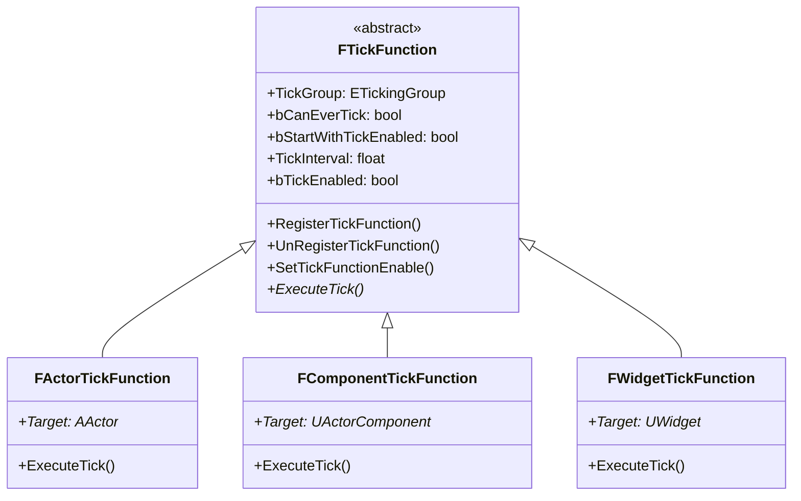
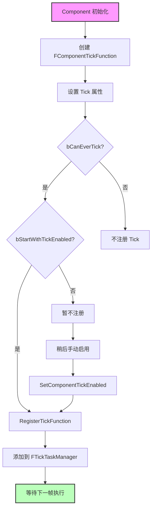
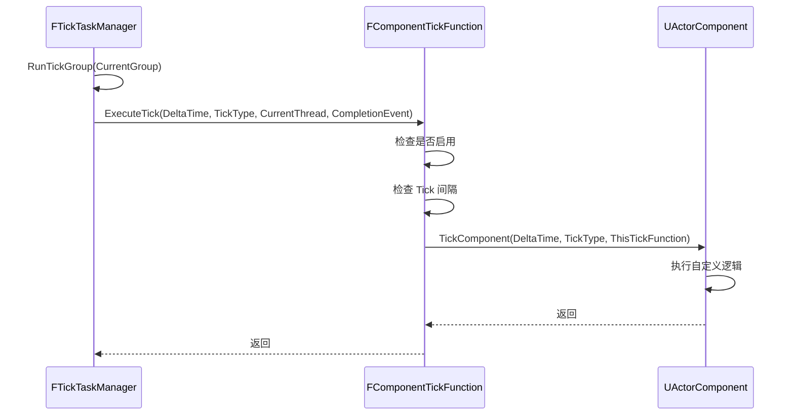
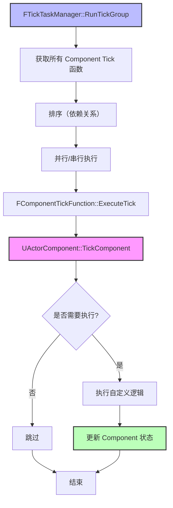

# FTickFunction与组件Tick详解

> **文档定位**：本文档深入分析 `FTickFunction` 结构体和组件 Tick 机制，帮助开发者理解 UE5 中 Tick 的底层实现和性能优化方法。

## 概述

**FTickFunction** 是一个抽象结构体，是所有 Tick 函数的基类。每个需要 Tick 的对象（Actor、Component 等）都会包含一个或多个 `FTickFunction`。

**核心概念**：
1. **定义 Tick 行为**：是否启用、Tick 间隔、Tick 组等
2. **注册/取消注册**：将 Tick 函数注册到 Tick 任务管理器
3. **执行 Tick**：调用对象的 Tick 方法（如 `AActor::Tick()`、`UActorComponent::TickComponent()`）

**设计模式**：
- **策略模式**：不同的 Tick 函数（Actor、Component、Widget）有不同的执行逻辑
- **注册模式**：Tick 函数需要注册到 Tick 任务管理器才能执行

## 核心概念

### 1. FTickFunction 的职责

**FTickFunction** 定义了 Tick 的基本行为，每个需要 Tick 的对象都有一个或多个 `FTickFunction`。

**核心职责**：
- 定义 Tick 的基本行为（是否启用、Tick 间隔、Tick 组等）
- 注册/取消注册到 Tick 任务管理器
- 执行实际的 Tick 逻辑

### 2. 组件 Tick 机制

**UActorComponent** 可以独立控制是否 Tick，不需要依赖 Actor 的 Tick。

**核心属性**：
- **bCanEverTick**：是否允许 Tick（可以在默认值中设置）
- **bStartWithTickEnabled**：是否默认启用 Tick
- **PrimaryComponentTick**：组件的 Tick 函数（FTickFunction）

**设计优势**：
- **灵活性**：组件可以独立控制 Tick，不需要依赖 Actor
- **性能优化**：不需要 Tick 的组件可以禁用 Tick
- **精细控制**：可以设置 Tick 间隔、Tick 组等

### 3. Tick 组（ETickingGroup）

**ETickingGroup** 决定了 Tick 函数的执行顺序。合理设置 Tick 组可以确保依赖关系正确。

**常见 Tick 组**：
- `TG_PreUpdate`：在帧更新开始前执行
- `TG_StartPhysics`：在物理模拟开始前执行
- `TG_DuringPhysics`：在物理模拟期间执行（可以并行）
- `TG_EndPhysics`：在物理模拟结束后执行
- `TG_PostUpdate`：在帧更新结束后执行

## 架构解析

### 1. FTickFunction 结构体

**头文件**：`Engine/Source/Runtime/Engine/Classes/Engine/EngineBaseTypes.h`

**关键属性**：

```cpp
USTRUCT()
struct FTickFunction
{
    GENERATED_USTRUCT_BODY()
    
    // Tick 组（决定执行顺序）
    UPROPERTY(EditDefaultsOnly, Category="Tick", AdvancedDisplay)
    TEnumAsByte<enum ETickingGroup> TickGroup;
    
    // 是否允许 Tick（可以在默认值中设置）
    UPROPERTY()
    uint8 bCanEverTick : 1;
    
    // 是否默认启用 Tick
    UPROPERTY(EditDefaultsOnly, Category="Tick")
    uint8 bStartWithTickEnabled : 1;
    
    // 是否允许在专用服务器上运行
    UPROPERTY(EditDefaultsOnly, Category="Tick", AdvancedDisplay)
    uint8 bAllowTickOnDedicatedServer : 1;
    
    // Tick 间隔（0 表示每帧都 Tick）
    UPROPERTY(EditDefaultsOnly, Category="Tick", AdvancedDisplay)
    float TickInterval;
    
    // 是否启用 Tick（运行时可动态修改）
    uint8 bTickEnabled : 1;
};
```

**关键方法**：

```cpp
// 注册 Tick 函数到 Tick 任务管理器
ENGINE_API void RegisterTickFunction(class ULevel* Level);

// 取消注册 Tick 函数
ENGINE_API void UnRegisterTickFunction();

// 启用/禁用 Tick
ENGINE_API void SetTickFunctionEnable(bool bInEnabled);

// 执行 Tick（纯虚函数，需要子类实现）
virtual void ExecuteTick(float DeltaTime, ELevelTick TickType, ENamedThreads::Type CurrentThread, const FGraphEventRef& MyCompletionGraphEvent) PURE_VIRTUAL(,);

// 更新 Tick 间隔
ENGINE_API void UpdateTickIntervalAndCoolDown(float NewTickInterval);
```

### 2. FTickFunction 继承关系

以下类图展示了 FTickFunction 的继承关系：



### 3. UActorComponent 的 Tick 相关属性

**头文件**：`Engine/Source/Runtime/Engine/Classes/Components/ActorComponent.h`

**关键属性**：

```cpp
UCLASS()
class ENGINE_API UActorComponent : public UObject
{
    GENERATED_BODY()
    
    // 是否允许此组件 Tick
    UPROPERTY()
    uint8 bCanEverTick : 1;
    
    // 是否默认启用 Tick
    UPROPERTY(EditDefaultsOnly, BlueprintReadOnly, Category="ComponentTick")
    uint8 bStartWithTickEnabled : 1;
    
    // 组件的 Tick 函数
    UPROPERTY()
    struct FComponentTickFunction PrimaryComponentTick;
    
    // Tick 间隔
    UPROPERTY(EditDefaultsOnly, BlueprintReadOnly, Category="ComponentTick", AdvancedDisplay)
    float TickInterval;
};
```

**关键方法**：

```cpp
// 激活组件（会注册 Tick 函数）
UFUNCTION(BlueprintCallable, Category="Components")
virtual void Activate(bool bReset=false);

// 停用组件（会取消注册 Tick 函数）
UFUNCTION(BlueprintCallable, Category="Components")
virtual void Deactivate();

// Tick 函数（子类重写）
virtual void TickComponent(float DeltaTime, ELevelTick TickType, FActorComponentTickFunction* ThisTickFunction);

// 设置组件是否启用 Tick
UFUNCTION(BlueprintCallable, Category="Components")
void SetComponentTickEnabled(bool bEnabled);

// 设置 Tick 间隔
UFUNCTION(BlueprintCallable, Category="Components")
void SetComponentTickInterval(float TickInterval);
```

---

## 执行流程

### 1. FTickFunction 注册流程

以下流程图展示了 FTickFunction 的注册流程：



### 2. FTickFunction 执行流程

以下时序图展示了 FTickFunction 的执行流程：



### 3. UActorComponent 的 Tick 流程

以下流程图展示了 UActorComponent 的完整 Tick 流程：



---

## 与其他模块的关系

### 1. 与 AActor 的关系

- **AActor** 包含一个 `FActorTickFunction`
- **AActor** 可以包含多个 `UActorComponent`，每个 Component 可以有自己的 `FComponentTickFunction`
- **执行顺序**：
  1. Actor 的 `FActorTickFunction::ExecuteTick()` 调用 `AActor::Tick()`
  2. Component 的 `FComponentTickFunction::ExecuteTick()` 调用 `UActorComponent::TickComponent()`

### 2. 与 FTickTaskManager 的关系

- **FTickFunction** 需要注册到 `FTickTaskManager` 才能执行
- **FTickTaskManager** 负责调度和执行所有 Tick 函数
- **注册时机**：
  - 在 `UActorComponent::RegisterComponent()` 中注册 Tick 函数
  - 在 `UActorComponent::UnregisterComponent()` 中取消注册 Tick 函数

### 3. 与 UWorld 的关系

- **UWorld** 在 `UWorld::Tick()` 中驱动 Tick 系统
- **UWorld** 调用 `FTickTaskManager::StartFrame()` 开始 Tick 帧
- **UWorld** 按照 Tick 组顺序，调用 `FTickTaskManager::RunTickGroup()`
- **UWorld** 在帧结束时调用 `FTickTaskManager::EndFrame()`

---

## 常见陷阱与最佳实践

### 陷阱

1. **组件 Tick 未启用**
   - **现象**：`TickComponent()` 没有执行
   - **原因**：
     - `bCanEverTick` 为 `false`
     - `bStartWithTickEnabled` 为 `false`
     - 没有调用 `RegisterComponent()`
   - **解决**：
     ```cpp
     // 在构造函数中
     bCanEverTick = true;
     bStartWithTickEnabled = true;
     
     // 或者在运行时
     Component->SetComponentTickEnabled(true);
     ```

2. **Tick 执行顺序错误**
   - **现象**：依赖于其他 Component 的 Tick 逻辑执行顺序错误
   - **原因**：Tick 组设置错误
   - **解决**：正确设置 `PrimaryComponentTick.TickGroup`

3. **Tick 性能问题**
   - **现象**：游戏帧率下降
   - **原因**：
     - 太多 Component 启用了 Tick
     - `TickComponent()` 中有耗时操作
   - **解决**：
     - 减少不必要的 Tick
     - 使用 `TickInterval` 降低 Tick 频率
     - 将耗时操作移到其他线程

### 最佳实践

1. **合理设置 Tick 组**
   - 确保 Component 的 Tick 执行顺序正确
   - 利用并行 Tick 提高性能

2. **动态启用/禁用 Tick**
   - 在不需要 Tick 时，及时禁用 Tick
   - 使用 `SetComponentTickEnabled()` 动态控制

3. **使用 Tick 间隔**
   - 对于不需要每帧更新的逻辑，使用 `TickInterval`
   - 例如：AI 感知可以每 0.1 秒更新一次

4. **避免在 Tick 中做耗时操作**
   - Tick 是每帧执行的，耗时操作会严重影响性能
   - 将耗时操作移到其他线程，或使用定时器

5. **使用 PrimaryComponentTick 控制 Tick**
   - `PrimaryComponentTick` 是 Component 的主要 Tick 函数
   - 可以通过 `PrimaryComponentTick.bCanEverTick` 控制是否允许 Tick
   - 可以通过 `PrimaryComponentTick.bStartWithTickEnabled` 控制是否默认启用 Tick

---

## 参考资料

### 源码位置

- **FTickFunction 结构体**：`Engine/Source/Runtime/Engine/Classes/Engine/EngineBaseTypes.h`
- **FActorTickFunction 结构体**：`Engine/Source/Runtime/Engine/Classes/Engine/EngineBaseTypes.h`
- **FComponentTickFunction 结构体**：`Engine/Source/Runtime/Engine/Classes/Engine/EngineBaseTypes.h`
- **UActorComponent 类**：`Engine/Source/Runtime/Engine/Classes/Components/ActorComponent.h`

### 相关文档

- [[30-tutorials/ue-framework/60-tick-system/00-Tick系统架构概述]] - Tick 系统架构概述
- [[30-tutorials/ue-framework/40-actor-system/00-AActor架构概述]] - AActor 架构概述
- [[30-tutorials/ue-framework/40-actor-system/01-AActor完整生命周期]] - AActor 完整生命周期

### 进一步阅读

- [Unreal Engine 5 官方文档 - Tick](https://docs.unrealengine.com/5.0/en-US/)
- [Unreal Engine 5 源码分析 - Tick 系统](https://www.unrealengine.com/)

<!-- nav:auto -->

---

**导航**: ← [[30-tutorials/ue-framework/60-tick-system/00-Tick系统架构概述|00-Tick系统架构概述]] · [[30-tutorials/ue-framework/70-lyra-case-study/00-Lyra架构总览|00-Lyra架构总览]] →

<!-- /nav:auto -->
