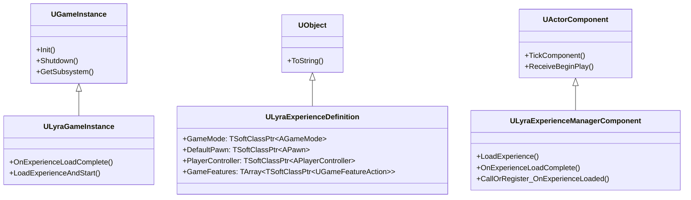
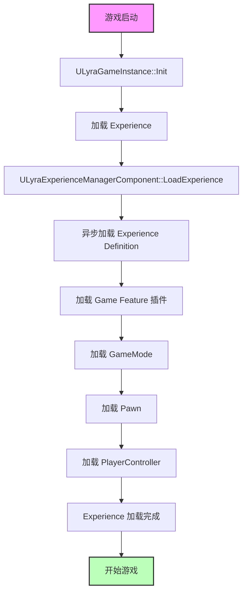
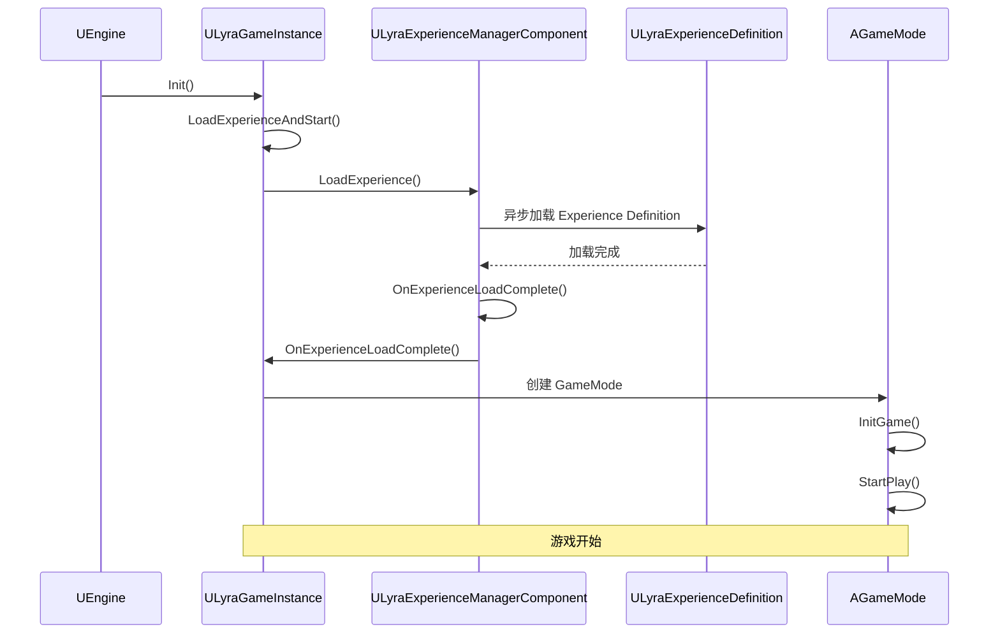
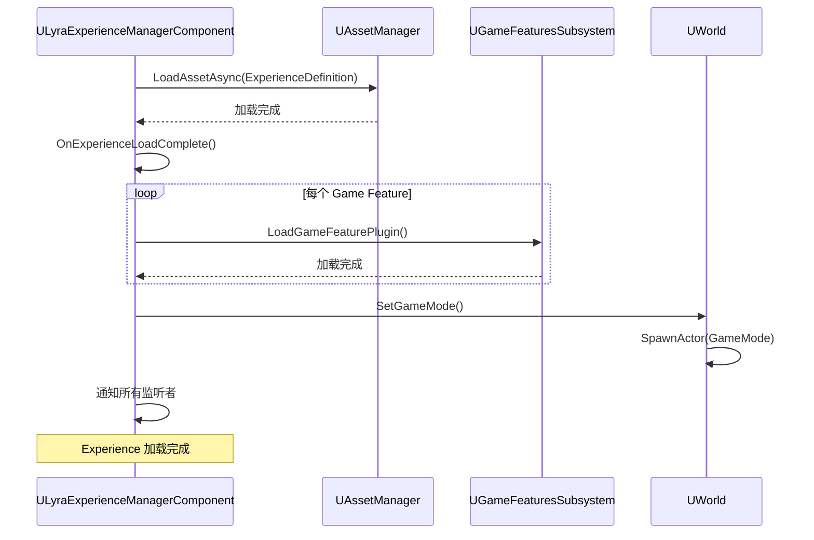
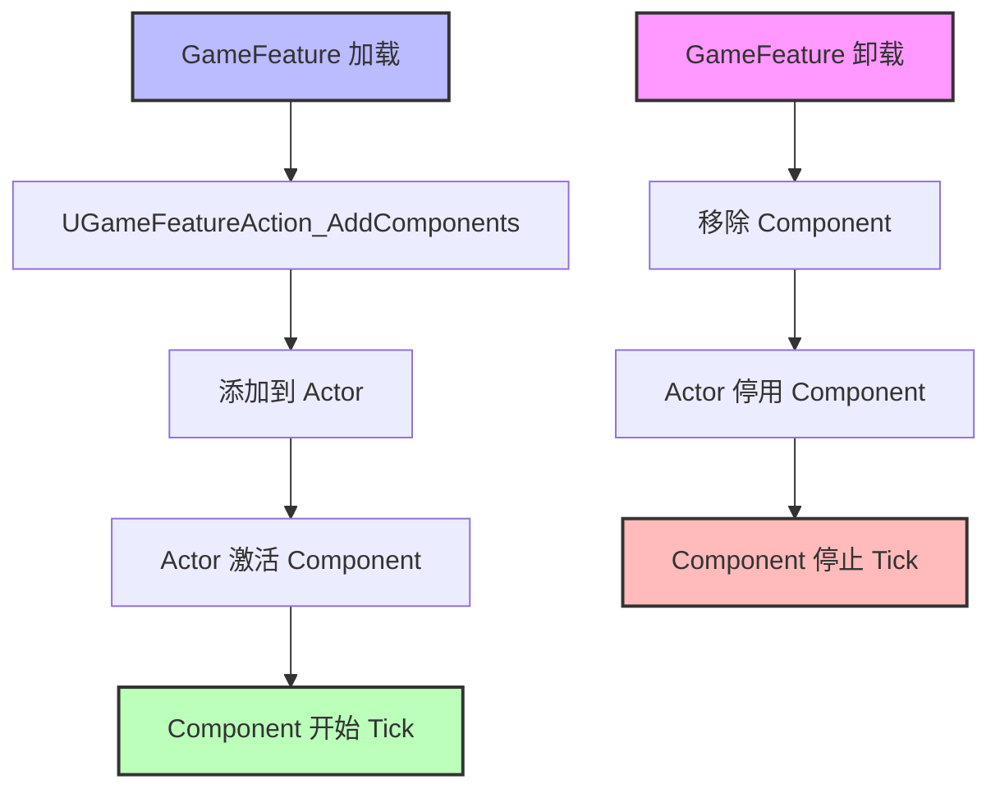

# Lyra架构总览

> **文档定位**：本文档深入分析 Lyra 项目的架构设计，帮助开发者理解 Lyra 的核心系统、模块划分和设计模式。

## 概述

**Lyra** 是 Unreal Engine 5 的官方示例项目，展示了 UE5 的最佳实践和核心功能。

**核心设计理念**：
1. **Experience 驱动**：游戏逻辑由 Experience 定义，支持动态加载和切换
2. **模块化设计**：使用 Modular Gameplay 插件，支持动态添加/移除 Component
3. **数据驱动**：使用 Data Asset 定义游戏数据，支持非程序员编辑
4. **GAS 集成**：深度集成 Gameplay Ability System，实现技能系统

**核心系统**：
- **Experience 系统**：定义游戏的完整体验（GameMode、Pawn、Ability 等）
- **Modular Gameplay**：动态添加/移除 Component 到 Actor
- **Game Features**：动态加载/卸载游戏功能插件
- **GAS**：Gameplay Ability System，实现技能、属性、效果

## 核心概念

### 1. Experience 系统

**Experience** 是 Lyra 的核心概念，定义了游戏的完整体验。

**核心类**：
- **ULyraExperienceDefinition**：Experience 定义（Data Asset）
- **ULyraExperienceManagerComponent**：Experience 管理器（Component）

**职责**：
- 定义 GameMode、Pawn、PlayerController 等
- 定义默认的 Game Feature 插件
- 定义默认的 Ability、Attribute、Effect

**设计优势**：
- **灵活性**：可以动态切换 Experience，实现不同的游戏模式
- **模块化**：Experience 可以包含多个 Game Feature 插件
- **数据驱动**：非程序员可以编辑 Experience

### 2. Modular Gameplay

**Modular Gameplay** 是 UE5 的新特性，允许动态添加/移除 Component 到 Actor。

**核心类**：
- **UModularGameplayActorComponent**：Modular Gameplay 的核心 Component
- **FComponentRequestHandle**：Component 请求句柄

**设计优势**：
- **动态性**：可以在运行时动态添加/移除 Component
- **模块化**：将功能拆分为独立的 Component
- **解耦**：Actor 不需要知道具体的 Component 实现

### 3. Game Features

**Game Features** 是 UE5 的新特性，允许动态加载/卸载游戏功能插件。

**核心类**：
- **UGameFeatureAction**：Game Feature 动作基类
- **UGameFeatureAction_AddComponents**：添加 Component 的 Game Feature 动作

**设计优势**：
- **动态加载**：可以在运行时动态加载/卸载 Game Feature 插件
- **模块化**：将游戏功能拆分为独立的插件
- **热更新**：支持热更新 Game Feature 插件

---

## 架构解析

### 1. Lyra 核心类继承关系

以下类图展示了 Lyra 核心类的继承关系：



### 2. Experience 加载流程

以下流程图展示了 Experience 的加载流程：



### 3. Lyra 核心类说明

#### ULyraGameInstance

**头文件**：`Source/LyraGame/System/LyraGameInstance.h`

**核心职责**：
- 初始化游戏实例
- 加载 Experience
- 管理游戏生命周期

**关键方法**：
```cpp
// 初始化 GameInstance
virtual void Init() override;

// Experience 加载完成回调
void OnExperienceLoadComplete();

// 加载 Experience 并开始游戏
void LoadExperienceAndStart();
```

#### ULyraExperienceDefinition

**头文件**：`Source/LyraGame/GameModes/LyraExperienceDefinition.h`

**核心职责**：
- 定义 Experience 的完整配置
- 包含 GameMode、Pawn、PlayerController 等

**关键属性**：
```cpp
// GameMode 类
TSoftClassPtr<AGameMode> GameMode;

// 默认 Pawn 类
TSoftClassPtr<APawn> DefaultPawn;

// PlayerController 类
TSoftClassPtr<APlayerController> PlayerController;

// 默认加载的 Game Feature 插件
TArray<TSoftClassPtr<UGameFeatureAction>> GameFeatures;
```

#### ULyraExperienceManagerComponent

**头文件**：`Source/LyraGame/GameModes/LyraExperienceManagerComponent.h`

**核心职责**：
- 管理 Experience 的加载
- 通知所有监听者 Experience 加载完成

**关键方法**：
```cpp
// 加载 Experience
void LoadExperience(TSoftClassPtr<ULyraExperienceDefinition> ExperienceClass);

// Experience 加载完成回调
void OnExperienceLoadComplete();

// 注册 Experience 加载完成回调（如果已加载完成，立即调用）
void CallOrRegister_OnExperienceLoaded(TFunction<void()> Callback);
```

---

## 执行流程

### 1. Lyra 启动流程

以下时序图展示了 Lyra 的启动流程：



### 2. Experience 加载流程

以下时序图展示了 Experience 的详细加载流程：



### 3. Modular Gameplay 流程

以下流程图展示了 Modular Gameplay 的工作流程：



---

## 与其他模块的关系

### 1. 与 GameMode 的关系

- **Experience** 定义了使用哪个 GameMode
- **GameMode** 在 Experience 加载完成后创建
- **GameMode** 负责生成 Pawn、PlayerController 等

### 2. 与 GAS 的关系

- **Experience** 可以定义默认的 Ability、Attribute、Effect
- **Lyra** 使用 GAS 实现技能系统
- **Lyra** 使用 `ULyraAbilitySystemComponent` 扩展 GAS

### 3. 与 Modular Gameplay 的关系

- **Game Feature** 使用 Modular Gameplay 动态添加/移除 Component
- **Actor** 不需要知道具体的 Component 实现
- **Component** 可以独立开发和测试

---

## 常见陷阱与最佳实践

### 陷阱

1. **Experience 加载失败**
   - **现象**：游戏无法启动
   - **原因**：
     - Experience Definition 路径错误
     - Game Feature 插件加载失败
   - **解决**：
     - 检查 Experience Definition 路径
     - 检查 Game Feature 插件是否正确配置

2. **Game Feature 插件卸载失败**
   - **现象**：内存泄漏
   - **原因**：Game Feature 插件卸载时，没有正确清理 Component
   - **解决**：确保 Game Feature 插件正确清理所有 Component

3. **Modular Gameplay Component 冲突**
   - **现象**：多个 Component 修改同一个属性，导致冲突
   - **原因**：Component 之间没有协调
   - **解决**：使用接口或事件协调 Component 之间的交互

### 最佳实践

1. **合理拆分 Experience**
   - 将不同的游戏模式拆分为不同的 Experience
   - 每个 Experience 只定义必要的 Game Feature

2. **使用 Game Feature 插件**
   - 将游戏功能拆分为独立的 Game Feature 插件
   - 支持动态加载/卸载，提高灵活性

3. **使用 Modular Gameplay**
   - 将功能拆分为独立的 Component
   - 支持动态添加/移除，提高灵活性

4. **数据驱动**
   - 使用 Data Asset 定义游戏数据
   - 支持非程序员编辑

---

## 参考资料

### 源码位置

- **ULyraGameInstance**：`Source/LyraGame/System/LyraGameInstance.h`
- **ULyraExperienceDefinition**：`Source/LyraGame/GameModes/LyraExperienceDefinition.h`
- **ULyraExperienceManagerComponent**：`Source/LyraGame/GameModes/LyraExperienceManagerComponent.h`

### 相关文档

- [[30-tutorials/ue-framework/30-gamemode-layer/00-AGameModeBase详解]] - AGameModeBase 详解
- [[30-tutorials/ue-framework/50-player-system/00-APawn与ACharacter详解]] - APawn 与 ACharacter 详解
- [[30-tutorials/ue-framework/50-player-system/01-AController详解]] - AController 详解

### 进一步阅读

- [Unreal Engine 5 官方文档 - Lyra 示例项目](https://docs.unrealengine.com/5.0/zh-CN/lyra-sample-game-in-unreal-engine/)
- [Unreal Engine 5 官方文档 - Modular Gameplay](https://docs.unrealengine.com/5.0/en-US/)
- [Unreal Engine 5 官方文档 - Game Features](https://docs.unrealengine.com/5.0/en-US/)

<!-- nav:auto -->

---

**导航**: ← [[30-tutorials/ue-framework/60-tick-system/01-FTickFunction与组件Tick详解|01-FTickFunction与组件Tick详解]] · [[30-tutorials/ue-framework/70-lyra-case-study/01-Lyra中的GameMode与Player系统实现|01-Lyra中的GameMode与Player系统实现]] →

<!-- /nav:auto -->
