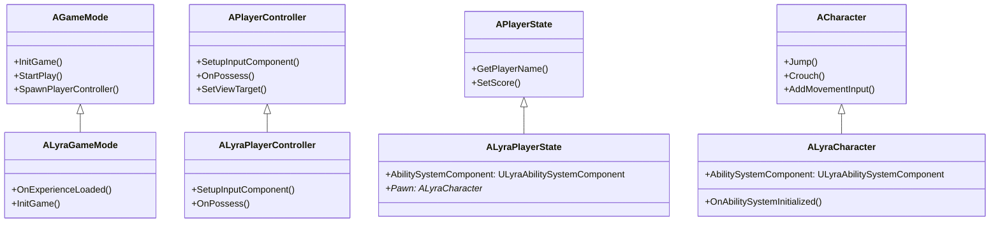
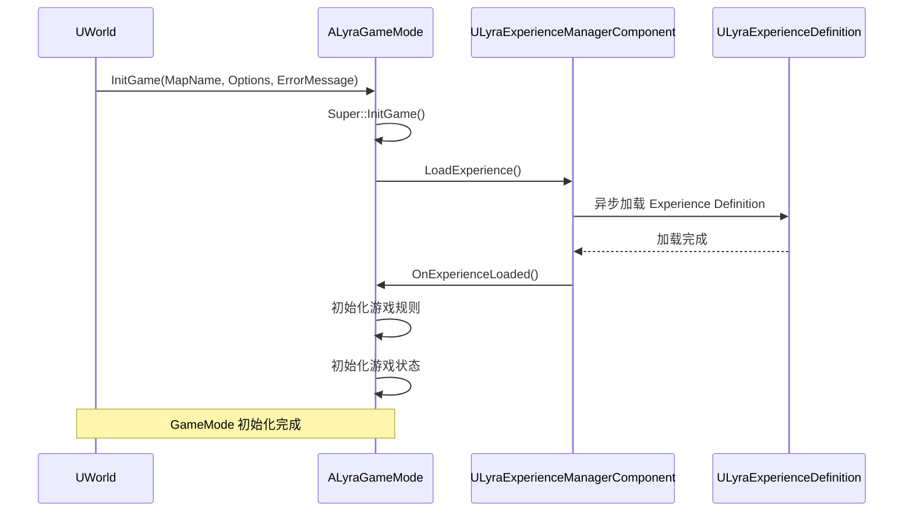
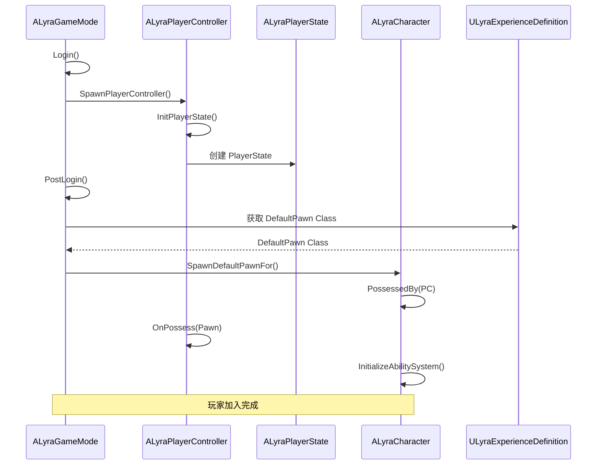
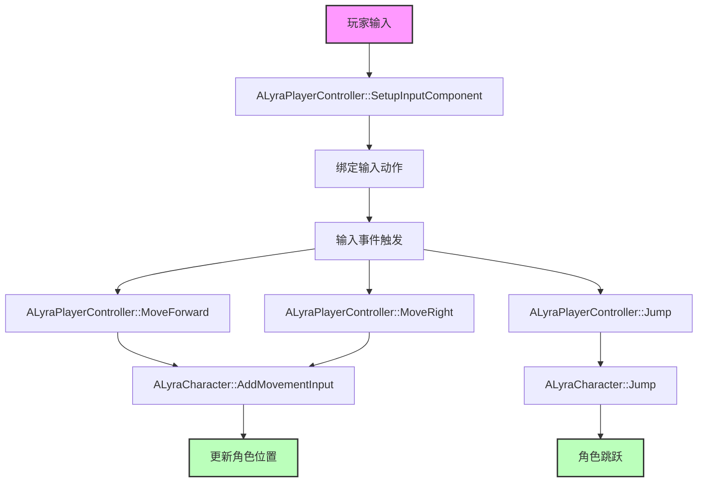

# Lyra中的GameMode与Player系统实现

> **文档定位**：本文档深入分析 Lyra 项目中的 GameMode、PlayerController、PlayerState 等核心类的实现，帮助开发者理解 Lyra 的架构设计。

## 概述

**Lyra** 的 GameMode 和 Player 系统展示了 UE5 的最佳实践，包括 Experience 系统、Modular Gameplay、GAS 集成等。

**核心设计理念**：
1. **Experience 驱动**：GameMode 由 Experience 定义，支持动态加载和切换
2. **模块化设计**：使用 Modular Gameplay 插件，支持动态添加/移除 Component
3. **GAS 集成**：深度集成 Gameplay Ability System，实现技能系统
4. **数据驱动**：使用 Data Asset 定义游戏数据，支持非程序员编辑

**核心类**：
- **ALyraGameMode**：Lyra 的 GameMode 实现
- **ALyraPlayerController**：Lyra 的 PlayerController 实现
- **ALyraPlayerState**：Lyra 的 PlayerState 实现
- **ALyraCharacter**：Lyra 的 Character 实现

## 核心概念

### 1. LyraGameMode 的职责

**ALyraGameMode** 继承自 `AGameMode`, 负责：

1. **定义游戏规则**：获胜条件、失败条件等
2. **管理游戏状态**：当前回合、剩余时间等
3. **生成 Player**：创建 Pawn、PlayerController、PlayerState
4. **加载 Experience**：在 `InitGame()` 中加载 Experience

**设计特点**：
- **Experience 驱动**：GameMode 的行为由 Experience 定义
- **模块化**：使用 Modular Gameplay 动态添加/移除 Component
- **数据驱动**：使用 Data Asset 定义游戏规则

### 2. Lyra 中的 Player 系统

**Lyra** 的 Player 系统包括以下核心类：

1. **ALyraPlayerController**：
   - 处理用户输入
   - 管理视角
   - 与 HUD 交互

2. **ALyraPlayerState**：
   - 存储玩家数据（得分、等级等）
   - 网络复制

3. **ALyraCharacter**：
   - 实现玩家角色
   - 处理移动、跳跃、蹲下等
   - 集成 GAS

**设计特点**：
- **GAS 集成**：使用 `ULyraAbilitySystemComponent` 实现技能系统
- **模块化**：使用 Modular Gameplay 动态添加/移除 Component
- **数据驱动**：使用 Data Asset 定义角色数据

---

## 架构解析

### 1. Lyra 核心类继承关系

以下类图展示了 Lyra 核心类的继承关系：



### 2. ALyraGameMode 类

**头文件**：`Source/LyraGame/GameModes/LyraGameMode.h`

**核心职责**：
- 加载 Experience
- 定义游戏规则
- 管理游戏状态

**关键方法**：
```cpp
// 初始化 GameMode
virtual void InitGame(const FString& MapName, const FString& Options, FString& ErrorMessage) override;

// Experience 加载完成回调
void OnExperienceLoaded();
```

### 3. ALyraPlayerController 类

**头文件**：`Source/LyraGame/Player/LyraPlayerController.h`

**核心职责**：
- 处理用户输入
- 管理视角
- 与 HUD 交互

**关键方法**：
```cpp
// 设置输入绑定
virtual void SetupInputComponent() override;

// 控制 Pawn
virtual void OnPossess(APawn* InPawn) override;

// 失去 Pawn
virtual void OnUnPossess() override;
```

### 4. ALyraPlayerState 类

**头文件**：`Source/LyraGame/Player/LyraPlayerState.h`

**核心职责**：
- 存储玩家数据（得分、等级等）
- 网络复制

**关键属性**：
```cpp
// Ability System Component
UPROPERTY()
TObjectPtr<ULyraAbilitySystemComponent> AbilitySystemComponent;

// 玩家得分
UPROPERTY(Replicated)
int32 Score;
```

### 5. ALyraCharacter 类

**头文件**：`Source/LyraGame/Characters/LyraCharacter.h`

**核心职责**：
- 实现玩家角色
- 处理移动、跳跃、蹲下等
- 集成 GAS

**关键属性**：
```cpp
// Ability System Component
UPROPERTY()
TObjectPtr<ULyraAbilitySystemComponent> AbilitySystemComponent;

// 当前武器
UPROPERTY()
TObjectPtr<ALyraWeapon> CurrentWeapon;
```

---

## 执行流程

### 1. LyraGameMode 初始化流程

以下时序图展示了 LyraGameMode 的初始化流程：



### 2. Lyra 中玩家加入流程

以下时序图展示了 Lyra 中玩家加入的完整流程：



### 3. Lyra 中输入处理流程

以下流程图展示了 Lyra 中的输入处理流程：



---

## 与其他模块的关系

### 1. 与 Experience 系统的关系

- **ALyraGameMode** 在 `InitGame()` 中加载 Experience
- **Experience** 定义了使用哪个 Pawn、PlayerController、PlayerState
- **Experience** 定义了默认的 Ability、Attribute、Effect

### 2. 与 GAS 的关系

- **ALyraPlayerState** 和 **ALyraCharacter** 都包含 `ULyraAbilitySystemComponent`
- **ALyraCharacter** 使用 GAS 实现技能系统
- **Experience** 可以定义默认的 Ability、Attribute、Effect

### 3. 与 Modular Gameplay 的关系

- **Game Feature** 使用 Modular Gameplay 动态添加/移除 Component
- **ALyraCharacter** 可以动态添加/移除 Component
- **Component** 可以独立开发和测试

---

## 常见陷阱与最佳实践

### 陷阱

1. **Experience 加载失败**
   - **现象**：游戏无法启动
   - **原因**：
     - Experience Definition 路径错误
     - Game Feature 插件加载失败
   - **解决**：
     - 检查 Experience Definition 路径
     - 检查 Game Feature 插件是否正确配置

2. **PlayerState 网络复制失败**
   - **现象**：客户端看不到服务器的玩家数据
   - **原因**：`ALyraPlayerState` 的属性没有正确设置 `Replicated`
   - **解决**：确保需要复制的属性都添加了 `UPROPERTY(Replicated)`

3. **Ability System Component 初始化失败**
   - **现象**：技能系统无法使用
   - **原因**：`ULyraAbilitySystemComponent` 没有正确初始化
   - **解决**：确保在 `ALyraCharacter::PossessedBy()` 中调用 `InitializeAbilitySystem()`

### 最佳实践

1. **使用 Experience 定义 GameMode**
   - 将 GameMode 的配置放到 Experience 中
   - 支持动态切换 Experience，实现不同的游戏模式

2. **使用 GAS 实现技能系统**
   - 将技能逻辑放到 Ability 中
   - 支持网络复制和预测

3. **使用 Modular Gameplay**
   - 将功能拆分为独立的 Component
   - 支持动态添加/移除，提高灵活性

4. **数据驱动**
   - 使用 Data Asset 定义游戏数据
   - 支持非程序员编辑

---

## 参考资料

### 源码位置

- **ALyraGameMode**：`Source/LyraGame/GameModes/LyraGameMode.h`
- **ALyraPlayerController**：`Source/LyraGame/Player/LyraPlayerController.h`
- **ALyraPlayerState**：`Source/LyraGame/Player/LyraPlayerState.h`
- **ALyraCharacter**：`Source/LyraGame/Characters/LyraCharacter.h`

### 相关文档

- [[30-tutorials/ue-framework/30-gamemode-layer/00-AGameModeBase详解]] - AGameModeBase 详解
- [[30-tutorials/ue-framework/50-player-system/00-APawn与ACharacter详解]] - APawn 与 ACharacter 详解
- [[30-tutorials/ue-framework/50-player-system/01-AController详解]] - AController 详解
- [[30-tutorials/ue-framework/70-lyra-case-study/00-Lyra架构总览]] - Lyra 架构总览

### 进一步阅读

- [Unreal Engine 5 官方文档 - Lyra 示例项目](https://docs.unrealengine.com/5.0/zh-CN/lyra-sample-game-in-unreal-engine/)
- [Unreal Engine 5 官方文档 - Gameplay Ability System](https://docs.unrealengine.com/5.0/zh-CN/gameplay-ability-system-for-unreal-engine/)
- [Unreal Engine 5 官方文档 - Modular Gameplay](https://docs.unrealengine.com/5.0/en-US/)

<!-- nav:auto -->

---

**导航**: ← [[30-tutorials/ue-framework/70-lyra-case-study/00-Lyra架构总览|00-Lyra架构总览]]

<!-- /nav:auto -->
