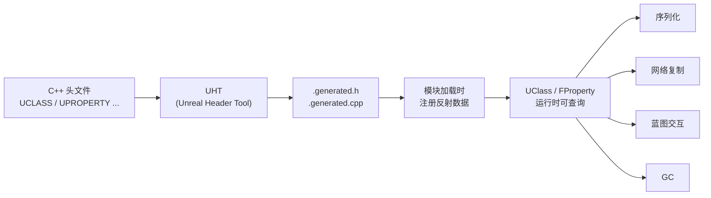

# UE反射系统从入门到实战

> UE 的反射系统是整个引擎的基石——序列化、网络复制、蓝图交互、GC 全都依赖它。本文系列带你从"是什么"到"怎么用"，再到 Lyra 项目中的真实案例。

## 概述

C++ 语言本身**不支持反射**（运行时查询类型信息、访问属性和方法）。UE 为了实现以下核心功能，必须拥有一套自己的反射系统：

| 依赖反射的系统 | 为什么需要反射 |
|--------------|-------------|
| **序列化（SaveGame / Cook / 网络）** | 需要知道 UPROPERTY 标记了哪些属性，才能自动保存/复制 |
| **网络复制（Replication）** | 服务器需要知道哪些属性标记为 `Replicated`，自动同步给客户端 |
| **蓝图交互** | 蓝图需要调用 C++ 函数、读写 C++ 属性，必须通过反射查找 |
| **GC（垃圾回收）** | GC 需要遍历所有 UPROPERTY 引用，防止对象被错误回收 |
| **编辑器（Details 面板）** | 编辑器需要枚举对象的属性，生成可编辑的 UI |

UE 的反射系统由两部分组成：

1. **UHT（Unreal Header Tool）**：编译前运行的代码生成工具，读取头文件中的 `UCLASS` / `UPROPERTY` 等宏，生成 `.generated.h` / `.generated.cpp` 文件
2. **运行时反射数据（`UClass` / `FField` 体系）**：UHT 生成的代码在模块加载时注册类型信息，运行时可通过 `GetClass()` 等 API 查询

## 核心概念速查

| 概念 | 说明 | 关键词 |
|------|------|--------|
| **UHT** | 编译前运行的工具，生成反射代码 | `UCLASS`, `GENERATED_BODY` |
| **UClass** | 存储一个 UObject 派生类的反射数据 | `GetClass()`, `StaticClass()` |
| **FField / FProperty** | 描述一个属性或函数的反射信息 | `FindField()`, `GetPropertyValue()` |
| **UFUNCTION** | 标记函数可被反射系统识别（蓝图调用、RPC 等） | `BlueprintCallable`, `Server` |
| **UPROPERTY** | 标记属性可被反射系统识别（序列化、GC、复制） | `EditAnywhere`, `Replicated` |
| **CDO** | Class Default Object，存储类的默认值 | `GetDefault<Class>()` |

## 系列阅读指南

### 阶段一：基础概念（建议先读）

- **[[30-tutorials/ue-reflection/00-UE反射系统从入门到实战|📖 概览]]**（本课）：系列导航，反射全景图
- **[[30-tutorials/ue-reflection/01-反射是什么从C++到UHT|01 — 反射是什么]]**：C++ 为什么没有反射，UHT 如何解决这个问题，`GENERATED_BODY()` 背后发生了什么

### 阶段二：核心机制（掌握用法）

- **[[30-tutorials/ue-reflection/02-核心宏详解|02 — 核心宏详解]]**：`UCLASS` / `UPROPERTY` / `UFUNCTION` / `USTRUCT` / `UENUM` 逐个拆解
- **[[30-tutorials/ue-reflection/03-反射API实战|03 — 反射 API 实战]]**：`GetClass()` / `FindField()` / `Invoke()` 等运行时 API 的使用方法
- **[[30-tutorials/ue-reflection/04-反射驱动的系统|04 — 反射驱动的系统]]**：序列化、网络复制、CDO 背后的反射机制

### 阶段三：实战应用（Lyra 案例）

- **[[30-tutorials/ue-reflection/05-反射与蓝图交互|05 — 反射与蓝图交互]]**：如何让 C++ 函数暴露给蓝图，以及 C++ 如何调用蓝图函数
- **[[30-tutorials/ue-reflection/06-高级主题与常见陷阱|06 — 高级主题与常见陷阱]]**：性能考量、`TFieldIterator`、常见错误
- **[[30-tutorials/ue-reflection/07-Lyra中的反射实践|07 — Lyra 中的反射实践]]**：Lyra 如何用反射实现数据驱动的 Experience 系统

## 前置知识

本系列假设你已经了解：

- 基本 C++ 语法（类、继承、指针、宏）
- UE 的 `UObject` 体系（如果不了解，请先阅读 [[30-tutorials/ue-framework/40-actor-system/00-AActor架构概述|UE 框架系列：AActor 架构]]）

## 相关页面

- [[30-tutorials/ue-framework/40-actor-system/00-AActor架构概述|AActor 架构概述]] — UObject 体系基础
- [[30-tutorials/garbage-collection/01-UObject基础与内存模型|UObject 基础与内存模型]] — GC 与反射的关系
- [[30-tutorials/resource-management/02-AssetRegistry资产注册表查询|Asset Registry 查询资产]] — 反射在资产系统中的使用

<!-- nav:auto -->

---

**导航**: [[30-tutorials/ue-reflection/01-反射是什么从C++到UHT|01-反射是什么从C++到UHT]] →

<!-- /nav:auto -->
