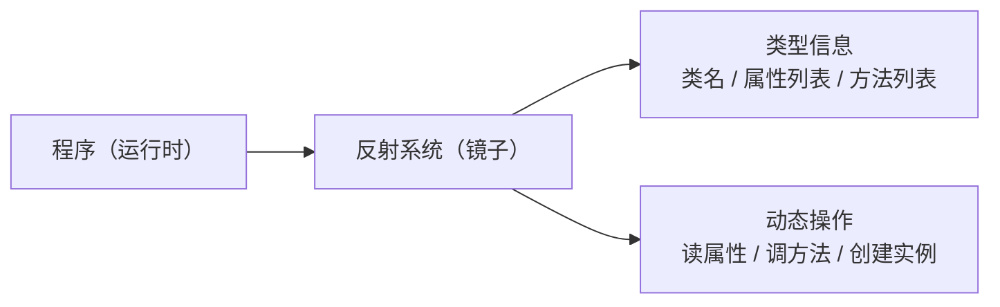
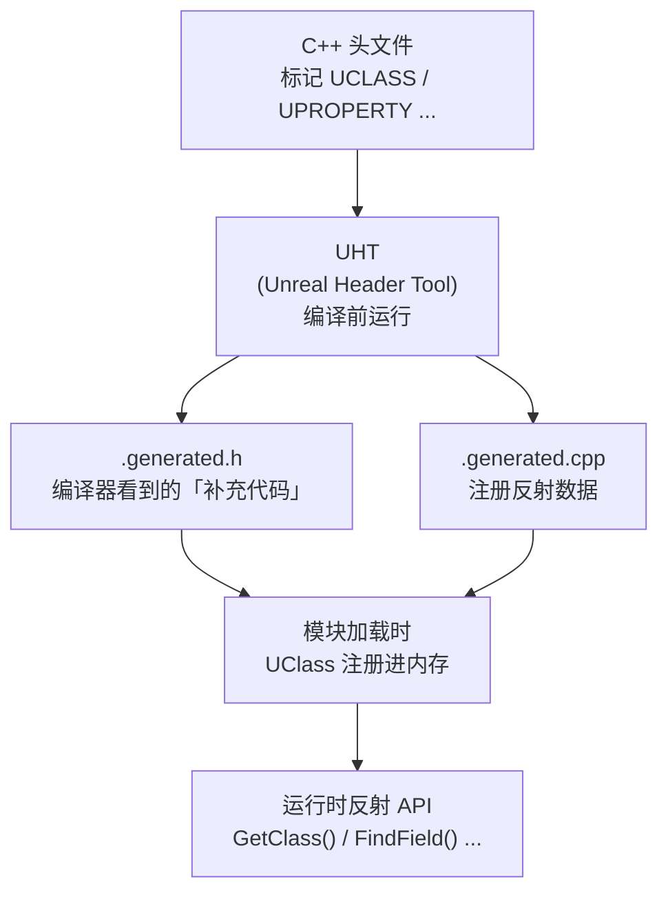
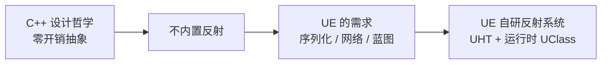

# 反射是什么从C++到UHT

> **本课目标**：理解"反射"是什么、为什么 C++ 没有反射、UE 如何用 UHT（Unreal Header Tool）解决这个问题，以及 `GENERATED_BODY()` 背后到底发生了什么。

## 什么是反射（Reflection）

**一句话定义**：反射是程序在**运行时**查询自身类型信息（类、属性、方法）并动态操作它们的能力。

### 类比：镜子

想象你在照镜子——你能看到自己的样子（有哪些属性）、能做出动作（调用方法）。反射就是程序给自己照镜子：



### 有反射 vs 无反射（C++ 的困境）

| 场景 | 有反射的语言（Java/C#） | C++（无原生反射） |
|------|------------------------|---------------------|
| 知道对象属于哪个类 | `obj.getClass().getName()` | 只能用 `typeid(obj).name()`，信息极有限 |
| 列出对象所有属性 | `cls.getFields()` | **做不到** |
| 按名字调用方法 | `obj.getClass().getMethod("Foo").invoke(obj)` | **做不到** |
| 序列化所有属性 | 反射遍历属性自动写入 | 必须手写每个属性的序列化代码 |

UE 需要这些能力（序列化、网络复制、蓝图交互、编辑器），但 C++ 不给力，所以 UE **自己造了一套反射系统**。

## UE 的反射系统：两层架构

UE 的反射系统由两部分组成：



**关键点**：
1. **UHT 不是运行时工具**——它在你按"编译"之前就运行了，读取你的头文件，生成额外的 C++ 代码
2. 生成的代码里包含了这个类的所有反射信息（属性名、类型、偏移量……）
3. 模块加载时，这些反射信息被注册进内存，运行时就能查询了

## `GENERATED_BODY()` 背后发生了什么

### 第一步：写代码（你做的事）

```cpp
// 文件：Source/LyraGame/AbilitySystem/LyraAbilitySet.h
UCLASS()
class ULyraAbilitySet : public UPrimaryDataAsset
{
    GENERATED_BODY()          // ← 这一行是关键

public:
    UPROPERTY(EditAnywhere)
    TArray<TSubclassOf<ULyraGameplayAbility>> AbilitySetItems;
};
```

### 第二步：UHT 读取头文件

UHT 扫描到 `UCLASS()` 宏和 `GENERATED_BODY()`，知道：
- 这是一个需要反射支持的 UObject 派生类
- 需要收集所有 `UPROPERTY` / `UFUNCTION` 的信息

### 第三步：生成 `.generated.h`（编译器看到的实际代码）

以 `ALyraCharacter` 对应的生成代码为例（路径类似 `Intermediate/Build/Mac/UnrealEditor/Inc/LyraGame/UHT/LyraCharacter.generated.h`），`GENERATED_BODY()` 展开后的核心内容：

```cpp
// GENERATED_BODY() 展开为（简化）：
public:
    // DECLARE_CLASS2 宏展开的核心内容：
    static constexpr EClassFlags StaticClassFlags = ...;
    typedef UPrimaryDataAsset Super;
    typedef ULyraAbilitySet ThisClass;

    // ★ 最重要的函数：获取此类的 UClass 单例
    inline static UClass* StaticClass()
    {
        return Z_Construct_UClass_ULyraAbilitySet_NoRegister();
    }

    // 编译器调用的构造函数（用于 UHT 初始化的内部机制）
    static void StaticRegisterNativesULyraAbilitySet();

    DECLARE_SERIALIZER(ULyraAbilitySet)
```

> **源码依据**：`Engine/Source/Runtime/CoreUObject/Public/UObject/ObjectMacros.h` 第 938-977 行，`DECLARE_CLASS2` 宏定义了 `StaticClass()` 等成员。

### 第四步：生成 `.generated.cpp`（注册反射数据）

```cpp
// 简化示意：.generated.cpp 中的关键函数
UClass* GetPrivateStaticClass()
{
    if (!TheClassSingleton)
    {
        GetPrivateStaticClassBody(
            TEXT("/Script/LyraGame"),   // Package 名
            TEXT("LyraAbilitySet"),    // 类名
            TheClassSingleton,
            StaticRegisterNativesULyraAbilitySet,
            sizeof(ULyraAbilitySet),
            alignof(ULyraAbilitySet),
            // ... 更多参数
        );
    }
    return TheClassSingleton;
}
```

### 第五步：运行时使用

```cpp
// 获取 UClass（反射的入口）
UClass* Class = ULyraAbilitySet::StaticClass();

// 或者从实例获取
ULyraAbilitySet* Asset = ...;
UClass* ClassFromInstance = Asset->GetClass();

// 用 UClass 查询信息
for (TFieldIterator<FProperty> PropIt(Class); PropIt; ++PropIt)
{
    FProperty* Prop = *PropIt;
    UE_LOG(LogTemp, Log, TEXT("属性名：%s，类型：%s"),
        *Prop->GetName(), *Prop->GetClass()->GetName());
}
```

## UHT 到底生成了什么：完整拆解

用 `ALyraCharacter` 的真实生成代码作为例子（`ModularCharacter.generated.h`）：

```cpp
// GENERATED_BODY() 展开后的完整结构（极度简化）：

#define FID_..._GENERATED_BODY   \
public:                               \
    /* === DECLARE_CLASS2 展开 === */ \
    static constexpr EClassFlags StaticClassFlags = ...; \
    typedef ACharacter Super;          \
    typedef AModularCharacter ThisClass; \
    inline static UClass* StaticClass() { return Z_Construct_UClass_AModularCharacter_NoRegister(); } \
    inline const TCHAR* StaticPackage() { return TEXT("/Script/ModularGameplayActors"); } \
    /* === 构造函数 === */ \
    AModularCharacter(const FObjectInitializer& ObjectInitializer); \
    static void StaticRegisterNativesAModularCharacter(); \
private: \

// 然后 GENERATED_BODY() 就是上面这个宏
```

**核心价值**：`StaticClass()` 返回的 `UClass*` 里存储了此类所有的反射信息——属性列表、函数列表、父类指针、标志位等。

## 为什么 C++ 没有反射（技术背景）

C++ 的设计哲学是**零开销抽象**（zero-overhead abstraction）——不应该为用不到的功能付出任何运行时成本。反射需要：

1. 存储所有类型的元数据（增加二进制体积）
2. 运行时查询这些元数据（增加运行时开销）
3. 支持动态调用（需要间接跳转，影响性能）

C++ 标准委员会一直拒绝将反射加入标准（直到 C++26 才在讨论有限的编译期反射）。UE 作为游戏引擎，必须用反射，所以**自己实现了一套**。



## Lyra 实例：`ULyraAbilitySet`

这是 Lyra 中定义"能力套装"的数据资产类，是反射系统的典型使用者：

```cpp
// Source/LyraGame/AbilitySystem/LyraAbilitySet.h（简化）
UCLASS()
class ULyraAbilitySet : public UPrimaryDataAsset
{
    GENERATED_BODY()

public:
    // ★ UPROPERTY 标记的属性，UHT 会收集其反射信息
    // 这意味着：序列化时会自动保存、GC 会识别此引用、编辑器中可见
    UPROPERTY(EditAnywhere, BlueprintReadOnly, Category = "Lyra|AbilitySet")
    TArray<TSubclassOf<ULyraGameplayAbility>> AbilitySetItems;

    UPROPERTY(EditAnywhere, BlueprintReadOnly, Category = "Lyra|AbilitySet")
    TArray<TSubclassOf<ULyraGameplayEffect>> EffectSetItems;
};
```

**如果不用 `UPROPERTY` 会怎样？**

```cpp
// ❌ 错误示范
TArray<TSubclassOf<ULyraGameplayAbility>> AbilitySetItems;  // 没有 UPROPERTY
```

后果：
- 序列化时**不会保存**这个属性（存档/网络同步全丢失）
- GC **不认识**这个引用（对象可能被错误回收）
- 编辑器的 Details 面板中**看不到**这个属性
- 网络复制**不工作**

这就是反射系统的实际价值——**你标记了，引擎就能自动处理**。

## 本篇总结

| 要点 | 说明 |
|------|------|
| 反射是什么 | 运行时查询和操作类型信息的能力 |
| 为什么需要 UHT | C++ 无原生反射，UE 必须自己实现 |
| UHT 做什么 | 编译前读取头文件，生成 `.generated.h/.cpp`，注入反射数据 |
| `GENERATED_BODY()` 展开为什么 | `DECLARE_CLASS2` 宏，声明 `StaticClass()`、`Super`、`ThisClass` 等 |
| `StaticClass()` 返回什么 | 此类的 `UClass*` 单例（懒初始化） |
| `UPROPERTY` 的作用 | 告诉 UHT 收集此属性的反射信息，使其参与序列化/GC/复制/编辑器 |

## 下一步

下一课 [[30-tutorials/ue-reflection/02-核心宏详解|02 — 核心宏详解]] 将逐个拆解 `UCLASS` / `UPROPERTY` / `UFUNCTION` / `USTRUCT` / `UENUM`，让你彻底理解每个宏的作用。

## 相关页面

- [[30-tutorials/ue-reflection/00-UE反射系统从入门到实战|← 系列概览]]
- [[30-tutorials/ue-framework/40-actor-system/00-AActor架构概述|AActor 架构]] — UObject 体系基础
- [[30-tutorials/garbage-collection/01-UObject基础与内存模型|UObject 基础]] — GC 与反射的关系

<!-- nav:auto -->

---

**导航**: ← [[30-tutorials/ue-reflection/00-UE反射系统从入门到实战|00-UE反射系统从入门到实战]] · [[30-tutorials/ue-reflection/02-核心宏详解|02-核心宏详解]] →

<!-- /nav:auto -->
