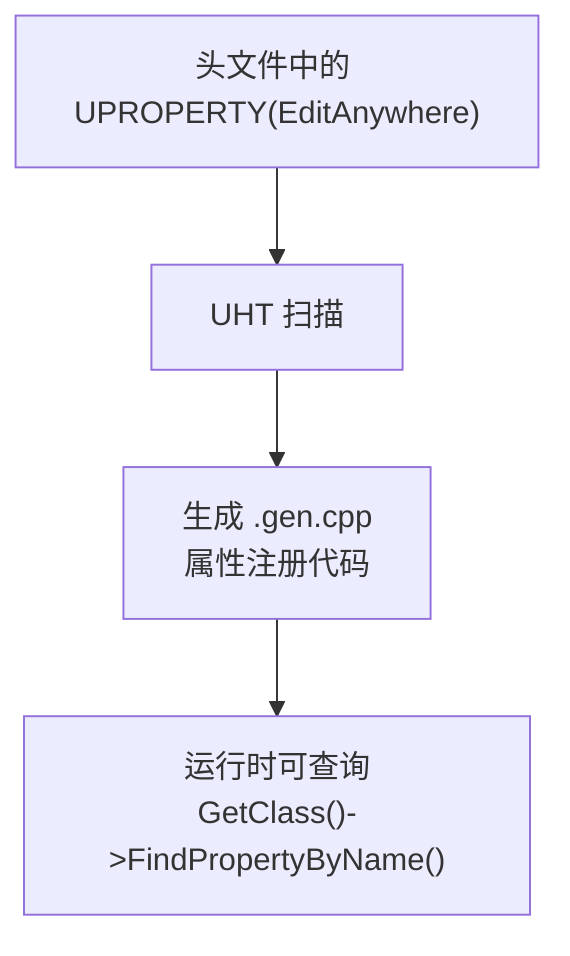

# 核心宏详解

> **本课目标**：逐个拆解 `UCLASS` / `UPROPERTY` / `UFUNCTION` / `USTRUCT` / `UENUM` 每个宏的作用、常用说明符，以及 UHT 为它们生成了什么代码。

## 宏的本质：UHT 标记，不是 C++ 宏

首先要理解一个关键点：

```cpp
// 在 ObjectMacros.h 中的定义（L363-370）：
#define UPROPERTY(...)
#define UFUNCTION(...)
#define USTRUCT(...)
#define UENUM(...)
#define GENERATED_BODY(...)
```

**这些宏在 C++ 编译器眼中展开为空**——它们存在的唯一目的是**被 UHT 扫描解析**。UHT 读取这些标记，生成 `.generated.h` / `.gen.cpp`，真正的反射数据在生成代码里。



---

## `UCLASS()` — 类声明宏

### 语法

```cpp
UCLASS(Specifier1, Specifier2, ...)
class MYGAME_API UMyObject : public UObject
{
    GENERATED_BODY()
};
```

### 常用说明符

| 说明符 | 作用 |
|--------|------|
| `Abstract` | 抽象类，不能实例化 |
| `BlueprintType` | 可暴露给蓝图，蓝图可引用此类型 |
| `Blueprintable` | 可在蓝图中作为父类继承 |
| `NotBlueprintable` | 不可在蓝图中继承 |
| `Config=Engine` | 此类使用 `Engine.ini` 存储配置属性 |
| `DefaultToInstanced` | 默认创建为实例对象（配合 `Instanced` 使用） |
| `EditInlineNew` | 编辑器中可内联创建此类的实例 |
| `Const` | 此类所有函数默认为 `const`（仅蓝图可见性） |

### `GENERATED_BODY()` 必须紧跟 `UCLASS()`

```cpp
// ✅ 正确
UCLASS()
class UMyObject : public UObject
{
    GENERATED_BODY()   // ← 必须在这里
public:
    // ...
};

// ❌ 错误：GENERATED_BODY 前有其它成员
UCLASS()
class UMyObject : public UObject
{
    int32 MyField;      // ← 不能在其他成员之前
    GENERATED_BODY()   // ← 必须第一个出现
};
```

> **原因**：`GENERATED_BODY()` 展开后声明了 `StaticClass()`、`Super`、`ThisClass` 等成员，这些必须在类的最开始声明。

### UHT 为 `UCLASS` 生成的代码

以 `ULyraAbilitySet` 为例（来自 `LyraAbilitySet.generated.h`）：

```cpp
// GENERATED_BODY() 展开（简化）：
public:
    static constexpr EClassFlags StaticClassFlags = ...;
    typedef UPrimaryDataAsset Super;
    typedef ULyraAbilitySet ThisClass;

    inline static UClass* StaticClass()
    { return Z_Construct_UClass_ULyraAbilitySet_NoRegister(); }

    inline const TCHAR* StaticPackage()
    { return TEXT("/Script/LyraGame"); }
```

---

## `UPROPERTY()` — 属性标记宏（最常用）

### 语法

```cpp
UPROPERTY(Specifier1, Specifier2, meta=(Key=Value))
```

### 说明符分类详解

#### 编辑器可见性

| 说明符 | 作用 |
|--------|------|
| `EditAnywhere` | 在编辑器的任何地方都可编辑（实例 + 默认值） |
| `EditDefaultsOnly` | 仅在编辑蓝图/资产默认值时可编辑 |
| `EditInstanceOnly` | 仅在编辑关卡中的实例时可编辑 |
| `VisibleAnywhere` | 可见但不可编辑 |
| `VisibleDefaultsOnly` | 仅在默认值中可见 |
| `VisibleInstanceOnly` | 仅在实例中可见 |

#### 蓝图交互

| 说明符 | 作用 |
|--------|------|
| `BlueprintReadOnly` | 蓝图中可读，不可写 |
| `BlueprintReadWrite` | 蓝图中可读写 |
| `BlueprintGetter=GetterFunc` | 指定蓝图使用的 Getter |
| `BlueprintSetter=SetterFunc` | 指定蓝图使用的 Setter |

#### 网络复制

| 说明符 | 作用 |
|--------|------|
| `Replicated` | 属性参与网络复制 |
| `ReplicatedUsing=OnRepFunc` | 复制发生时调用 `OnRepFunc` |
| `RepRetry` | 复制失败时重试 |
| `ReplicatedUsing` 通常配合 `OnRep` 函数使用 |

#### 序列化

| 说明符 | 作用 |
|--------|------|
| `SaveGame` | 参与 SaveGame 序列化 |
| `Transient` | 不序列化、不复制（运行时临时对象） |
| `DuplicateTransient` | 复制对象时不复制此属性 |
| `NonPIETransient` | PIE 时不序列化此属性 |

#### GC（垃圾回收）

| 说明符 | 作用 |
|--------|------|
| `Instanced` | 对象在实例中被创建，GC 独立管理 |

#### Meta 说明符（补充信息）

```cpp
UPROPERTY(EditAnywhere, meta=(ClampMin="0", ClampMax="100", UIMin="0", UIMax="100"))
int32 Health = 100;
```

常用 `meta` 键：

| Meta 键 | 作用 |
|----------|------|
| `Category="XXX"` | 在 Details 面板中分组 |
| `ClampMin` / `ClampMax` | 编辑器数值限制 |
| `UIMin` / `UIMax` | 编辑器滑动条范围 |
| `TitleProperty=XXX` | 数组元素在编辑器中显示的属性名 |
| `NoElementDuplicate` | 数组中不允许重复元素 |

### Lyra 真实示例（`LyraAbilitySet.h`）

```cpp
UCLASS()
class ULyraAbilitySet : public UPrimaryDataAsset
{
    GENERATED_BODY()

public:
    // EditDefaultsOnly：只在编辑默认值时可见，实例不可编辑
    // Category：在 Details 面板中的分组
    UPROPERTY(EditDefaultsOnly, Category = "Lyra|AbilitySet")
    TArray<TSubclassOf<ULyraGameplayAbility>> AbilitySetItems;

    // meta=(TitleProperty=Ability)：数组中每项显示 Ability 的名字
    UPROPERTY(EditDefaultsOnly, Category = "Gameplay Abilities", meta=(TitleProperty=Ability))
    TArray<FLyraAbilitySet_GameplayAbility> GrantedGameplayAbilities;

    // ReplicatedUsing：属性复制时调用 OnRep 函数
    UPROPERTY(ReplicatedUsing=OnRep_AbilitySetItems)
    TArray<FGameplayAbilitySpecHandle> AbilitySpecHandles;
};
```

---

## `UFUNCTION()` — 函数标记宏

### 语法

```cpp
UFUNCTION(Specifier1, Specifier2, meta=(Key=Value))
ReturnType MyFunction(ParamType Param);
```

### 说明符分类详解

#### 蓝图交互

| 说明符 | 作用 |
|--------|------|
| `BlueprintCallable` | C++ 函数可被蓝图调用 |
| `BlueprintPure` | 纯函数（不修改状态，蓝图可调用） |
| `BlueprintImplementableEvent` | 蓝图可重写此事件（C++ 无实现） |
| `BlueprintNativeEvent` | 蓝图可重写，C++ 有默认实现 |
| `BlueprintSetter` / `BlueprintGetter` | 作为属性的 Setter/Getter 暴露给蓝图 |

#### 网络 RPC

| 说明符 | 作用 |
|--------|------|
| `Server` | 客户端调用，服务器执行 |
| `Client` | 服务器调用，客户端执行 |
| `NetMulticast` | 服务器调用，所有客户端执行 |
| `Reliable` | RPC 可靠传输（保证到达） |
| `Unreliable` | RPC 不可靠传输 |
| `WithValidation` | 带验证函数的 RPC |

#### 编辑器

| 说明符 | 作用 |
|--------|------|
| `CallInEditor` | 在编辑器中可点击按钮调用此函数 |

### Lyra 真实示例

```cpp
// Source/LyraGame/LyraPlayerController.h（简化）
UCLASS()
class ALyraPlayerController : public ACommonPlayerController
{
    GENERATED_BODY()

public:
    // BlueprintCallable：蓝图可调用
    // Category：蓝图节点分组
    UFUNCTION(BlueprintCallable, Category = "Lyra|PlayerController")
    ALyraPlayerState* GetLyraPlayerState() const;

    // Server + Reliable：可靠服务器 RPC
    UFUNCTION(Reliable, Server)
    void ServerCheat(const FString& Msg);

    // BlueprintImplementableEvent：蓝图可重写
    UFUNCTION(BlueprintImplementableEvent, meta=(DisplayName="On AutoRun Started"))
    void K2_OnAutoRunStarted();
};
```

### `UFUNCTION` 的 `meta` 说明符

```cpp
UFUNCTION(BlueprintCallable, meta=(WorldContext="WorldContextObject"))
static void MyGlobalFunction(UObject* WorldContextObject);
```

| Meta 键 | 作用 |
|----------|------|
| `WorldContext="X"` | 指定世界上下文对象（自动获取 World） |
| `Categories="InputTag"` | GameplayTag 过滤分类 |
| `DisplayName="XX"` | 蓝图中显示的名字 |
| `AutoCreateRefTerm` | 自动创建引用参数 |

---

## `USTRUCT()` — 结构体宏

### 语法

```cpp
USTRUCT(BlueprintType)
struct FMyStruct
{
    GENERATED_BODY()

    UPROPERTY(EditAnywhere)
    int32 Score;
};
```

### 说明符

| 说明符 | 作用 |
|--------|------|
| `BlueprintType` | 可暴露给蓝图作为变量类型 |

### `GENERATED_BODY()` 在 `USTRUCT` 中

与 `UCLASS` 类似，`GENERATED_BODY()` 必须在结构体最开始，展开后声明：
- `StaticStruct()` — 获取此结构体的 `UScriptStruct*`
- 友元声明（供 UHT 生成代码访问私有成员）

### Lyra 真实示例（`LyraAbilitySet.h`）

```cpp
// 定义"能力 + 等级"的结构体
USTRUCT(BlueprintType)
struct FLyraAbilitySet_GameplayAbility
{
    GENERATED_BODY()

    // 要授予的 Gameplay Ability
    UPROPERTY(EditDefaultsOnly)
    TSubclassOf<ULyraGameplayAbility> Ability;

    // 能力等级
    UPROPERTY(EditDefaultsOnly)
    int32 AbilityLevel = 1;

    // 触发此能力的 InputTag
    UPROPERTY(EditDefaultsOnly, Meta = (Categories = "InputTag"))
    FGameplayTag InputTag;
};
```

---

## `UENUM()` — 枚举宏

### 语法

```cpp
UENUM(BlueprintType)
enum class EMyEnum : uint8
{
    ValueA,
    ValueB,
    ValueC,
};
```

### 说明符

| 说明符 | 作用 |
|--------|------|
| `BlueprintType` | 可暴露给蓝图作为变量类型 |

### Lyra 真实示例（`LyraGameplayAbility_RangedWeapon.h`）

```cpp
// 瞄准来源枚举
UENUM(BlueprintType)
enum class ELyraAbilityTargetingSource : uint8
{
    CameraTowardsFocus,   // 从相机朝焦点方向
    PawnForward,          // 从 Pawn 中心，Pawn 朝向
    PawnTowardsFocus,     // 从 Pawn 中心，朝相机焦点
    WeaponForward,         // 从武器枪口，Pawn 朝向
    WeaponTowardsFocus,    // 从武器枪口，朝相机焦点
    Custom                 // 自定义蓝图指定来源
};
```

---

## `UINTERFACE()` — 接口宏

> **为什么需要 `UINTERFACE`？** C++ 有原生接口（纯虚类），但 UE 的反射系统需要识别接口——`UINTERFACE` 告诉 UHT "这是一个可被反射识别的接口"。

### 语法

```cpp
// 接口类必须用 UINTERFACE 标记
UINTERFACE(BlueprintType)
class UMyInterface : public UInterface
{
    GENERATED_BODY()
};
```

### 说明符

| 说明符 | 作用 |
|--------|------|
| `BlueprintType` | 可暴露给蓝图作为接口类型 |
| `NotBlueprintable` | 不可在蓝图中实现此接口 |

### 如何正确定义和使用接口

#### 步骤 1：定义接口（`.h`）

```cpp
// 文件：Source/MyGame/Public/IMyInterface.h
#pragma once

#include "IMyInterface.generated.h"

UINTERFACE(BlueprintType)
class UMyInterface : public UInterface
{
    GENERATED_BODY()
public:
    // 接口函数声明（没有实现）
    UFUNCTION(BlueprintCallable, BlueprintImplementableEvent)
    void DoSomething();
};

// 实现此接口的 C++ 类用 IMyInterface
class IMyInterface
{
public:
    virtual void DoSomething() = 0;
};
```

#### 步骤 2：C++ 类实现接口

```cpp
// 文件：Source/MyGame/Public/MyActor.h
UCLASS()
class AMyActor : public AActor, public IMyInterface
{
    GENERATED_BODY()
public:
    // 实现接口函数
    virtual void DoSomething() override;
};
```

#### 步骤 3：通过反射查询接口

```cpp
// 方法 1：Cast（运行时类型检查）
if (IMyInterface* MyInterface = Cast<IMyInterface>(SomeObject))
{
    MyInterface->DoSomething();
}

// 方法 2：反射查询（更通用）
UFunction* Func = FindField<UFunction>(
    SomeObject->GetClass(),
    FName("DoSomething"));
if (Func)
{
    SomeObject->ProcessEvent(Func, nullptr);
}
```

### Lyra 实例：`ULyraContextEffectsInterface`

```cpp
// 文件：Source/LyraGame/ContextEffects/LyraContextEffectsInterface.h
UINTERFACE(BlueprintType)
class ULyraContextEffectsInterface : public UInterface
{
    GENERATED_BODY()
public:
    // 蓝图可调用
    UFUNCTION(BlueprintCallable, BlueprintImplementableEvent)
    void PlayContextEffects();
};
```

在蓝图中，可以创建实现此接口的 Blueprint，并重写 `PlayContextEffects` 事件。

### 常见错误

```cpp
// ❌ 错误 1：忘了加 UINTERFACE
class UMyInterface : public UInterface  // ← 没有 UINTERFACE()，反射不识别

// ❌ 错误 2：GENERATED_BODY() 不在第一位
UINTERFACE()
class UMyInterface : public UInterface
{
    int32 MyField;       // ← 不能在其他成员之前
    GENERATED_BODY()   // ← 必须第一位
};

// ✅ 正确
UINTERFACE(BlueprintType)
class UMyInterface : public UInterface
{
    GENERATED_BODY()
public:
    UFUNCTION(BlueprintCallable, BlueprintImplementableEvent)
    void DoSomething();
};
```

---

## 综合示例：Lyra 的 `ULyraAbilitySet`

这是 Lyra 中最重要的数据资产之一，完整展示了所有宏的配合。

### 结构体定义（`USTRUCT`）

```cpp
// Source/LyraGame/AbilitySystem/LyraAbilitySet.h（大幅简化）
UCLASS()
class ULyraAbilitySet : public UPrimaryDataAsset
{
    GENERATED_BODY()

public:
    // ===== 结构体定义（USTRUCT）=====
    USTRUCT(BlueprintType)
    struct FLyraAbilitySet_GameplayAbility
    {
        GENERATED_BODY()
        UPROPERTY(EditDefaultsOnly) TSubclassOf<ULyraGameplayAbility> Ability;
        UPROPERTY(EditDefaultsOnly) int32 AbilityLevel = 1;
        UPROPERTY(EditDefaultsOnly, Meta=(Categories="InputTag")) FGameplayTag InputTag;
    };

    USTRUCT(BlueprintType)
    struct FLyraAbilitySet_GameplayEffect
    {
        GENERATED_BODY()
        UPROPERTY(EditDefaultsOnly) TSubclassOf<UGameplayEffect> GameplayEffect;
        UPROPERTY(EditDefaultsOnly) float EffectLevel = 1.0f;
    };
```

### 属性定义（`UPROPERTY`）

```cpp
    // ===== 属性定义（UPROPERTY）=====
    // 授予的能力列表
    UPROPERTY(EditDefaultsOnly, Category="Gameplay Abilities", meta=(TitleProperty=Ability))
    TArray<FLyraAbilitySet_GameplayAbility> GrantedGameplayAbilities;

    // 授予的效果列表
    UPROPERTY(EditDefaultsOnly, Category="Gameplay Effects", meta=(TitleProperty=GameplayEffect))
    TArray<FLyraAbilitySet_GameplayEffect> GrantedGameplayEffects;
```

### 函数定义（`UFUNCTION`）

```cpp
    // ===== 函数定义（UFUNCTION）=====
    // 授予此 AbilitySet 到 ASC
    UFUNCTION(BlueprintCallable, Category="Lyra|AbilitySet")
    void GiveToAbilitySystem(UAbilitySystemComponent* ASC, FLyraAbilitySet_GrantedHandles& OutGrantedHandles);

    // 从 ASC 移除
    UFUNCTION(BlueprintCallable, Category="Lyra|AbilitySet")
    void RemoveFromAbilitySystem(UAbilitySystemComponent* ASC, FLyraAbilitySet_GrantedHandles& InOutGrantedHandles);
};
```

---

## 常见错误与陷阱

### 错误 1：`GENERATED_BODY()` 位置错误

```cpp
// ❌ 错误：GENERATED_BODY 不在第一位
UCLASS()
class UMyObject : public UObject
{
    int32 MyField;         // ← 其他成员在 GENERATED_BODY 之前
    GENERATED_BODY()
};

// ✅ 正确
UCLASS()
class UMyObject : public UObject
{
    GENERATED_BODY()
    int32 MyField;         // ← 必须在 GENERATED_BODY 之后
};
```

### 错误 2：`UPROPERTY` 遗漏导致属性"消失"

```cpp
// ❌ 错误：没有 UPROPERTY，GC 不认识，序列化不保存
TObjectPtr<UMyObject> MyField;

// ✅ 正确
UPROPERTY()
TObjectPtr<UMyObject> MyField;
```

### 错误 3：`#include "X.generated.h"` 不是最后一个 include

```cpp
// ❌ 错误
#include "MyObject.h"
#include "MyObject.generated.h"   // ← 必须最后
#include "AnotherHeader.h"         // ← 不能在 .generated.h 之后

// ✅ 正确
#include "MyObject.h"
#include "AnotherHeader.h"
#include "MyObject.generated.h"   // ← 必须最后一个 include
```

### 错误 4：`USTRUCT` 里用了 `UPROPERTY` 但忘了 `GENERATED_BODY()`

```cpp
// ❌ 错误
USTRUCT()
struct FMyStruct
{
    UPROPERTY(EditAnywhere) int32 X;   // ← 不会被 UHT 识别
};

// ✅ 正确
USTRUCT()
struct FMyStruct
{
    GENERATED_BODY()                  // ← 必须有
    UPROPERTY(EditAnywhere) int32 X;
};
```

---

## 本篇总结

| 宏 | 作用 | 关键说明符 |
|------|------|------------|
| `UCLASS()` | 标记类支持反射 | `Abstract`, `BlueprintType`, `Config` |
| `GENERATED_BODY()` | 注入反射代码 | **必须紧跟 UCLASS，必须在类/结构体最开始** |
| `UPROPERTY()` | 标记属性参与反射 | `EditAnywhere`, `Replicated`, `SaveGame`, `BlueprintReadOnly` |
| `UFUNCTION()` | 标记函数参与反射 | `BlueprintCallable`, `Server`, `Client`, `CallInEditor` |
| `USTRUCT()` | 标记结构体支持反射 | `BlueprintType` |
| `UENUM()` | 标记枚举支持反射 | `BlueprintType` |

## 下一步

下一课 [[30-tutorials/ue-reflection/03-反射API实战|03 — 反射 API 实战]] 将学习如何在运行时使用反射：`GetClass()` / `FindField()` / `GetPropertyValue()` / `Invoke()` 等 API 的实际用法。

## 相关页面

- [[30-tutorials/ue-reflection/01-反射是什么从C++到UHT|← 01 — 反射是什么]]
- [[30-tutorials/ue-reflection/03-反射API实战|03 — 反射 API 实战 →]]
- [[30-tutorials/ue-framework/40-actor-system/00-AActor架构概述|AActor 架构]] — UObject 体系

<!-- nav:auto -->

---

**导航**: ← [[30-tutorials/ue-reflection/01-反射是什么从C++到UHT|01-反射是什么从C++到UHT]] · [[30-tutorials/ue-reflection/03-反射API实战|03-反射API实战]] →

<!-- /nav:auto -->
