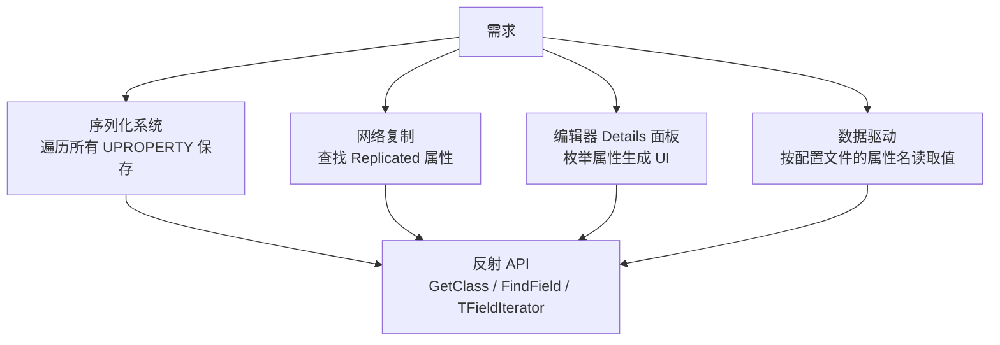

# 反射API实战

> **本课目标**：掌握运行时使用反射的核心 API：`GetClass()` / `FindField()` / `TFieldIterator` / `TObjectIterator`，以及 Lyra 中的真实应用案例。

## 为什么要用反射 API

你已经知道了用 `UPROPERTY()` 标记属性、用 `UFUNCTION()` 标记函数。但有时候需要在**运行时动态**操作这些成员——这就是反射 API 的用武之地：



---

## API 一：`GetClass()` — 从实例获取 UClass*

`GetClass()` 是 `UObject` 的实例方法，返回此对象的 `UClass*`（运行时类型信息）。

### 函数签名

```cpp
// 文件：Engine/Source/Runtime/CoreUObject/Public/UObject/UObjectBase.h
class UObjectBase
{
protected:
    // 返回此对象所属类的 UClass*
    FORCEINLINE UClass* GetClass() const
    {
        return ClassPrivate;
    }
};
```

### 基本用法

```cpp
UObject* Obj = GetSomeObject();
UClass* Cls = Obj->GetClass();

UE_LOG(LogTemp, Log, TEXT("对象类名：%s"), *Cls->GetName());
UE_LOG(LogTemp, Log, TEXT("父类：%s"), *Cls->GetSuperClass()->GetName());
```

### Lyra 实例：`LyraCameraMode_ThirdPerson.cpp`

```cpp
// 文件：Source/LyraGame/Camera/LyraCameraMode_ThirdPerson.cpp L81
void ULyraCameraMode_ThirdPerson::UpdateForTarget(float DeltaTime)
{
    if (const ACharacter* TargetCharacter = Cast<ACharacter>(GetTargetActor()))
    {
        if (TargetCharacter->IsCrouched())
        {
            // ★ GetClass() 获取 UClass*，再取 CDO（Class Default Object）
            // CDO 存储了此类的默认值
            const ACharacter* TargetCharacterCDO =
                TargetCharacter->GetClass()->GetDefaultObject<ACharacter>();

            // 用 CDO 的默认值计算蹲伏时的相机高度偏移
            const float CrouchedHeightAdjustment =
                TargetCharacterCDO->CrouchedEyeHeight - TargetCharacterCDO->BaseEyeHeight;

            SetTargetCrouchOffset(FVector(0.f, 0.f, CrouchedHeightAdjustment));
            return;
        }
    }
    SetTargetCrouchOffset(FVector::ZeroVector);
}
```

> **关键点**：`GetClass()->GetDefaultObject<T>()` 是获取 CDO 的标准写法，比 `GetDefault<ALyraCharacter>()` 更通用（当类型在运行时才能确定时）。

---

## API 二：`StaticClass()` — 静态获取 UClass*

`StaticClass()` 是 UHT 为每个 `UCLASS` 类生成的**静态成员函数**，无需实例即可获取 `UClass*`。

### 基本用法

```cpp
// 无需实例，直接获取 UClass*
UClass* Cls = ULyraAbilitySet::StaticClass();

// 常用于：判断对象类型
void ProcessObject(UObject* Obj)
{
    if (Obj->GetClass() == ULyraAbilitySet::StaticClass())
    {
        // 精确匹配类（不包含子类）
    }

    if (Obj->IsA(ULyraAbilitySet::StaticClass()))
    {
        // 匹配类或其派生类
    }
}
```

### Lyra 实例：`LyraWeaponSpawner.cpp`

```cpp
// 文件：Source/LyraGame/Weapons/LyraWeaponSpawner.cpp L32
void ALyraWeaponSpawner::TryToRestart()
{
    TArray<AActor*> OverlappingActors;

    // ★ StaticClass() 作为 GetOverlappingActors 的 Filter 参数
    // 只获取 APawn 及派生类的实例
    GetOverlappingActors(OverlappingActors, APawn::StaticClass());

    for (AActor* OverlappingActor : OverlappingActors)
    {
        // 处理重叠的 Pawn...
    }
}
```

### Lyra 实例：`LyraReplicationGraph.cpp`

```cpp
// 文件：Source/LyraGame/System/LyraReplicationGraph.cpp L176
void ULyraReplicationGraph::InitGlobalActorClassSettings()
{
    // ★ 设置 ReplicationGraph 使用的类
    if (GraphClass.Get() == nullptr)
    {
        GraphClass = ULyraReplicationGraph::StaticClass();
    }

    // ★ StaticClass() + GetDefaultObject() 获取 CDO 的 NetCullDistance
    CharacterClassRepInfo.SetCullDistanceSquared(
        ALyraCharacter::StaticClass()
            ->GetDefaultObject<ALyraCharacter>()
            ->GetNetCullDistanceSquared()
    );
}
```

---

## API 三：`FindField<T>()` — 按名字查找属性/函数

`FindField<T>()` 是模板函数，在指定的 `UStruct`（类或结构体）中按名字查找字段。

### 函数签名

```cpp
// 文件：Engine/Source/Runtime/CoreUObject/Public/UObject/UnrealType.h
template<typename T>
T* FindField(const UStruct* Scope, FName FieldName);
```

| 参数 | 说明 |
|------|------|
| `Scope` | 查找范围（`UClass*` 或 `UScriptStruct*`） |
| `FieldName` | 字段名（`FName` 类型） |
| 返回 | 找到的 `T*`（`FProperty*` / `UFunction*` 等），未找到返回 `nullptr` |

### 基本用法

```cpp
UClass* Cls = ULyraAbilitySet::StaticClass();

// 查找属性
FProperty* Prop = FindField<FProperty>(Cls, FName("AbilitySetItems"));

if (Prop)
{
    UE_LOG(LogTemp, Log, TEXT("找到属性：%s，类型：%s"),
        *Prop->GetName(), *Prop->GetClass()->GetName());
}

// 查找函数
UFunction* Func = FindField<UFunction>(Cls, FName("GiveToAbilitySystem"));
```

> ⚠️ **性能提醒**：`FindField` 是 **O(n)** 线性搜索。在性能敏感路径中应避免每帧调用，或在启动时缓存结果。

---

## API 四：`TFieldIterator` — 遍历所有属性/函数

当需要**枚举**一个类的所有 `UPROPERTY` 或 `UFUNCTION` 时，用 `TFieldIterator`。

### 基本用法

```cpp
UClass* Cls = MyObject->GetClass();

// 遍历所有属性
UE_LOG(LogTemp, Log, TEXT("=== %s 的属性 ==="), *Cls->GetName());
for (TFieldIterator<FProperty> PropIt(Cls); PropIt; ++PropIt)
{
    FProperty* Prop = *PropIt;
    UE_LOG(LogTemp, Log, TEXT("  属性：%s，偏移：%d，大小：%d"),
        *Prop->GetName(),
        Prop->GetOffset_ForDebug(),     // 属性在对象中的内存偏移
        Prop->GetSize()                 // 属性大小（字节）
    );
}

// 遍历所有函数
for (TFieldIterator<UFunction> FuncIt(Cls); FuncIt; ++FuncIt)
{
    UFunction* Func = *FuncIt;
    UE_LOG(LogTemp, Log, TEXT("  函数：%s，Flags：0x%08x"),
        *Func->GetName(),
        (uint32)Func->FunctionFlags
    );
}
```

### Lyra 实例：`LyraMemoryDebugCommands.cpp`

这个非常实用的调试工具，遍历一个类的所有属性，对比实例与 CDO 的差异（用于分析哪些属性被修改了）：

```cpp
// 文件：Source/LyraGame/Performance/LyraMemoryDebugCommands.cpp L93
void AnalyzeObjectListForDifferences(
    TArrayView<UObject*> ObjectList,
    UClass* CommonClass,
    const TSet<FName>& PropertiesToIgnore,
    bool bLogAllMatchedDefault = false)
{
    check(CommonClass);
    UObject* CommonClassCDO = CommonClass->GetDefaultObject();

    UE_LOG(LogLyra, Log, TEXT("  Field\tDifferentToBase\tNumValues\tValues"));

    // ★ TFieldIterator 遍历 CommonClass 的所有属性
    for (TFieldIterator<FProperty> PropIt(CommonClass); PropIt; ++PropIt)
    {
        FProperty* Prop = *PropIt;

        if (PropertiesToIgnore.Contains(Prop->GetFName()))
        {
            continue;
        }

        // ★ ExportText_InContainer：反射读取属性值并转为字符串
        FString DefaultValueStr;
        Prop->ExportText_InContainer(
            0,              // ArrayIndex
            /*out*/ DefaultValueStr,
            CommonClassCDO,  // 容器对象（CDO）
            CommonClassCDO,  // 默认值对象
            nullptr, 0);

        bool bAnyMatchedDefaultValue = false;
        bool bAllMatchedDefaultValue = true;

        TSet<FString> ValuesObserved;
        for (UObject* Object : ObjectList)
        {
            FString ValueStr;
            if (Prop->ExportText_InContainer(
                0, /*out*/ ValueStr, Object, CommonClassCDO, nullptr, 0))
            {
                ValuesObserved.Add(ValueStr);
                bAllMatchedDefaultValue = false;
            }
            else
            {
                bAnyMatchedDefaultValue = true;
            }
        }

        // 输出分析结果...
    }
}
```

> **这个函数的用途**：当你在优化内存时，可以调用它来分析哪些 UObject 的属性偏离了默认值——偏离的属性越多，说明内存"浪费"越多。

---

## API 五：`TObjectIterator` — 遍历内存中所有指定类的实例

`TObjectIterator` 遍历**内存中所有已加载的**指定类（及其子类）的实例。

### 基本用法

```cpp
// 遍历所有已加载的 AActor 实例
int32 ActorCount = 0;
for (TObjectIterator<AActor> It; It; ++It)
{
    AActor* Actor = *It;
    UE_LOG(LogTemp, Log, TEXT("Actor：%s"), *Actor->GetName());
    ActorCount++;
}
UE_LOG(LogTemp, Log, TEXT("共 %d 个 Actor"), ActorCount);
```

### Lyra 实例：`LyraReplicationGraph.cpp`

在初始化时，遍历所有 `UClass` 找出需要复制的 Actor 类：

```cpp
// 文件：Source/LyraGame/System/LyraReplicationGraph.cpp L218
void ULyraReplicationGraph::InitGlobalActorClassSettings()
{
    TArray<UClass*> AllReplicatedClasses;

    // ★ TObjectIterator<UClass> 遍历所有已加载的 UClass
    for (TObjectIterator<UClass> It; It; ++It)
    {
        UClass* Class = *It;

        // 获取此类的 CDO（Class Default Object）
        AActor* ActorCDO = Cast<AActor>(Class->GetDefaultObject());

        // 检查此 Actor 类是否开启了复制
        if (ActorCDO && ActorCDO->GetIsReplicated())
        {
            AllReplicatedClasses.Add(Class);
        }
    }

    // 用 AllReplicatedClasses 配置 ReplicationGraph...
}
```

### Lyra 实例：`LyraMemoryDebugCommands.cpp`

将内存中所有资产路径导出到文件（用于分析资产内存占用）：

```cpp
// 文件：Source/LyraGame/Performance/LyraMemoryDebugCommands.cpp L59
FAutoConsoleCommandWithWorldAndArgs GObjListToCollectionCmd(
    TEXT("Lyra.ObjListToCollection"),
    TEXT("Spits out a collection that contains the current object list"),
    FConsoleCommandWithWorldAndArgsDelegate::CreateStatic(
        [](const TArray<FString>& Params, UWorld* World)
{
    // ★ TObjectIterator<UObject> 遍历所有 UObject
    TArray<FString> AssetPaths;
    for (TObjectIterator<UObject> It; It; ++It)
    {
        UObject* Obj = *It;

        if (Obj->IsAsset())
        {
            AssetPaths.Add(Obj->GetPathName());
        }
        else if (UBlueprintGeneratedClass* Class = Cast<UBlueprintGeneratedClass>(Obj))
        {
            FString BlueprintName = Class->GetPathName();
            BlueprintName.RemoveFromEnd(TEXT("_C"));
            AssetPaths.Add(BlueprintName);
        }
    }

    AssetPaths.Sort();

    // 写入文件...
}));
```

---

## API 六：读取/写入属性值（动态访问）

当你只有属性名（字符串）时，可以用反射**动态读取/修改**属性值。

### 方法一：`FProperty::GetValue_InContainer()` / `SetValue_InContainer()`

```cpp
UObject* Obj = GetSomeObject();
UClass* Cls = Obj->GetClass();

// 按名字找到属性
FProperty* Prop = FindField<FProperty>(Cls, FName("Health"));

if (Prop)
{
    // ★ 读取属性值（需要知道 C++ 类型）
    if (FNumericProperty* NumProp = CastField<FNumericProperty>(Prop))
    {
        // 读取 int32 / float 等数值类型
        int32 Value;
        NumProp->GetValue_InContainer(Obj, /*ArrayIndex=*/ 0);

        UE_LOG(LogTemp, Log, TEXT("Health = %d"), Value);

        // 修改属性值
        NumProp->SetValue_InContainer(Obj, 999, /*ArrayIndex=*/ 0);
    }
    else if (FStrProperty* StrProp = CastField<FStrProperty>(Prop))
    {
        FString Value;
        StrProp->GetValue_InContainer(Obj);
        // ...
    }
}
```

### 方法二：`ExportText_InContainer()` — 读取为字符串（类型无关）

```cpp
FProperty* Prop = FindField<FProperty>(Cls, FName("Health"));
FString ValueAsText;

// 无论什么类型，都能导出为字符串（用于日志/调试）
Prop->ExportText_InContainer(
    0,              // ArrayIndex
    /*out*/ ValueAsText,
    Obj,            // 容器对象
    Obj,            // 默认值对象（用于比较）
    nullptr, 0);

UE_LOG(LogTemp, Log, TEXT("%s = %s"), *Prop->GetName(), *ValueAsText);
```

> **Lyra 中的实际应用**：上面的 `AnalyzeObjectListForDifferences` 函数就用了这个方法。

---

## API 七：调用函数（动态调用）

用反射按名字调用 `UFUNCTION`：

```cpp
UObject* Obj = GetSomeObject();
UClass* Cls = Obj->GetClass();

// 按名字找到函数
UFunction* Func = FindField<UFunction>(Cls, FName("OnGamephaseChanged"));

if (Func)
{
    // ★ 准备参数（UFUNCTION 的参数通过 FFrame 传递）
    // 简单函数（无参数）可以直接调用：
    Obj->ProcessEvent(Func, nullptr);

    // 有参数的函数需要通过 FProperty 设置参数：
    // 1. 分配参数内存（大小 = Func->ParmsSize）
    // 2. 用 FProperty::SetValue_InContainer() 设置每个参数
    // 3. 调用 Obj->ProcessEvent(Func, Params)
    // 4. 读取返回值（也是通过 FProperty）
}
```

> **更简单的替代方案**：如果知道函数签名，直接用 `UFUNCTION` 的 C++ 指针调用比反射快得多。反射调用主要用于**数据驱动**场景（函数名在配置文件中指定）。

---

## 综合实例：数据驱动的属性修改工具

假设你在做一个调试工具，允许设计师通过控制台命令修改任何 `UPROPERTY` 标记的属性：

```cpp
// 控制台命令：Lyra.SetActorProperty <ActorName> <PropertyName> <Value>
static FAutoConsoleCommandWithWorldAndArgs SetActorPropertyCmd(
    TEXT("Lyra.SetActorProperty"),
    TEXT("Set an actor property by name at runtime"),
    FConsoleCommandWithWorldAndArgsDelegate::CreateStatic(
        [](const TArray<FString>& Args, UWorld* World)
{
    if (Args.Num() < 3) return;

    FString ActorName = Args[0];
    FString PropertyName = Args[1];
    FString ValueStr = Args[2];

    // 1. 找到目标 Actor
    for (TObjectIterator<AActor> It; It; ++It)
    {
        AActor* Actor = *It;
        if (Actor->GetName().Equals(ActorName))
        {
            // 2. 找到属性
            FProperty* Prop = FindField<FProperty>(Actor->GetClass(), FName(*PropertyName));
            if (!Prop)
            {
                UE_LOG(LogTemp, Warning, TEXT("属性 %s 未找到"), *PropertyName);
                return;
            }

            // 3. 将字符串值写入属性
            // （实际项目中应该用 FParse::Value 或 FProperty::ImportText_InContainer）
            UE_LOG(LogTemp, Log, TEXT("将 %s.%s 设置为 %s"),
                *ActorName, *PropertyName, *ValueStr);

            // 这里省略了具体的类型转换和 SetValue_InContainer 调用
            break;
        }
    }
}));
```

---

## 本篇总结

| API | 作用 | Lyra 实例 |
|------|------|-----------|
| `GetClass()` | 从实例获取 `UClass*` | `LyraCameraMode_ThirdPerson`：获取 CDO 读默认值 |
| `StaticClass()` | 静态获取 `UClass*` | `LyraWeaponSpawner`：作为 `GetOverlappingActors` 的 Filter |
| `FindField<T>()` | 按名字查找属性/函数 | 本篇示例；Lyra 中间接使用 |
| `TFieldIterator<T>` | 遍历类的所有属性/函数 | `LyraMemoryDebugCommands`：分析属性差异 |
| `TObjectIterator<T>` | 遍历所有指定类的实例 | `LyraReplicationGraph`：收集可复制 Actor 类 |
| `GetDefaultObject()` | 获取 CDO（默认值对象） | 多个文件：读取类的默认值 |
| `ExportText_InContainer` | 将属性值导出为字符串 | `LyraMemoryDebugCommands` |

## 下一步

下一课 [[30-tutorials/ue-reflection/04-反射驱动的系统|04 — 反射驱动的系统]] 将讲解：序列化、网络复制、CDO 背后是如何依赖反射系统工作的。

## 相关页面

- [[30-tutorials/ue-reflection/02-核心宏详解|← 02 — 核心宏详解]]
- [[30-tutorials/ue-reflection/04-反射驱动的系统|04 — 反射驱动的系统 →]]
- [[30-tutorials/garbage-collection/01-UObject基础与内存模型|UObject 基础]] — GC 与反射的关系

<!-- nav:auto -->

---

**导航**: ← [[30-tutorials/ue-reflection/02-核心宏详解|02-核心宏详解]] · [[30-tutorials/ue-reflection/04-反射驱动的系统|04-反射驱动的系统]] →

<!-- /nav:auto -->
