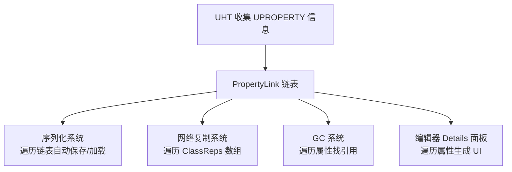
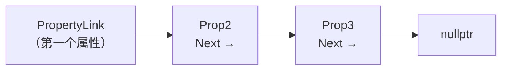
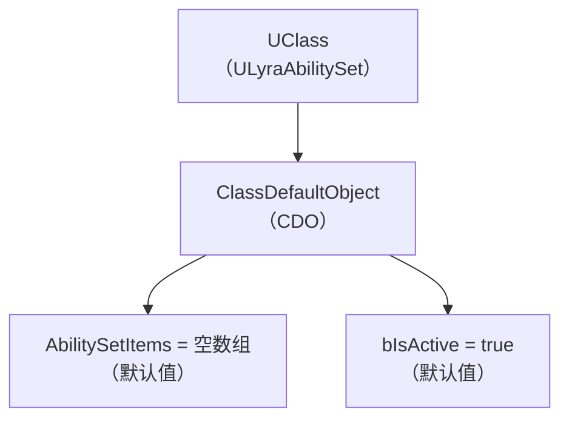
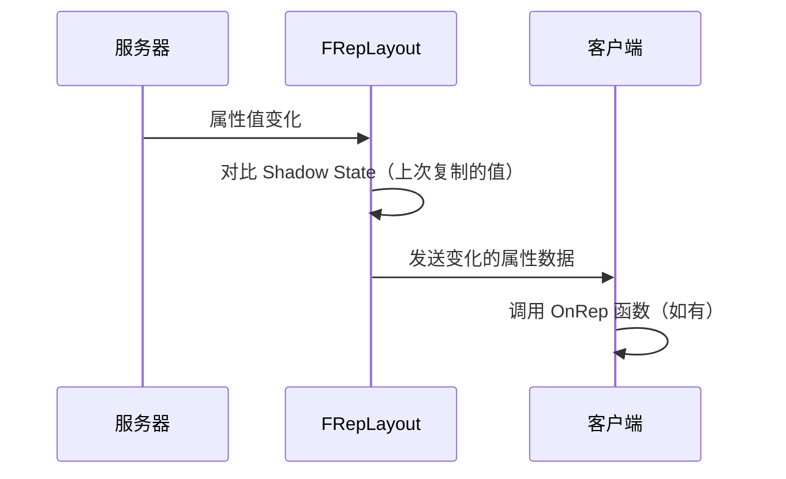

# 反射驱动的系统

> **本课目标**：理解序列化、网络复制、CDO 这些系统，背后是如何依赖反射机制工作的。

## 核心观点：反射是 UE 的"神经系统"

UE 的好几个核心系统都**依赖反射**才能工作。这不是巧合——正因为 UHT 在编译前收集了所有 `UPROPERTY` / `UFUNCTION` 的信息，运行时系统才能"知道"要处理哪些属性。



---

## 系统一：序列化（SaveGame / Cook / 加载）

### 序列化入口：`UObject::Serialize()`

当你保存一个对象（存档、Cook、复制），引擎调用 `Serialize()`：

```cpp
// 文件：Engine/Source/Runtime/CoreUObject/Private/UObject/Obj.cpp L1646
void UObject::Serialize(FStructuredArchive::FRecord Record)
{
    FArchive& UnderlyingArchive = Record.GetUnderlyingArchive();

    // ... 序列化对象元数据（名、Outer、Class）...

    // ★ 关键：序列化"脚本属性"（即 UPROPERTY 标记的）
    if (ObjClass != UClass::StaticClass())
    {
        SerializeScriptProperties(Record.EnterSubField(TEXT("Properties")));
    }
}
```

### 反射派上用场：`SerializeScriptProperties()`

```cpp
// Engine/Source/Runtime/CoreUObject/Private/UObject/Obj.cpp L1958
void UObject::SerializeScriptProperties(FStructuredArchive::FSlot Slot) const
{
    UClass* ObjClass = GetClass();
    UObject* DiffObject = GetArchetype();  // 通常是 CDO

    // ★ 调用 UClass::SerializeTaggedProperties
    // 它会遍历 PropertyLink 链表，找到所有 UPROPERTY 属性
    ObjClass->SerializeTaggedProperties(
        Slot,
        (uint8*)this,          // 当前对象的数据
        DiffClass,              // 父类（用于遍历继承的属性）
        (uint8*)DiffObject      // CDO（用于 Delta 序列化）
    );
}
```

### `UStruct::SerializeTaggedProperties()` — 反射遍历的核心

```cpp
// Engine/Source/Runtime/CoreUObject/Private/UObject/Class.cpp L1514
void UStruct::SerializeTaggedProperties(
    FStructuredArchive::FSlot Slot,
    uint8* Data,
    const UStruct* DefaultsStruct,
    const uint8* Defaults) const
{
    // ★ 遍历 PropertyLink 链表（UHT 生成代码时构建的）
    for (FProperty* Prop = PropertyLink; Prop != nullptr; Prop = Prop->PropertyLinkNext)
    {
        // 创建 PropertyTag（包含属性名、类型、大小等）
        FPropertyTag Tag(Prop, ...);

        // ★ 调用每个属性的 SerializeItem()
        Prop->SerializeItem(Slot, Data + Prop->GetOffset_ForDebug(), Defaults);
    }
}
```

> **`PropertyLink` 是什么？** UHT 在生成代码时，把所有 `UPROPERTY` 属性串成一个**链表**。每个 `UStruct`（包括 `UClass`）都有一个 `PropertyLink` 指针指向第一个属性。



### 单个属性如何序列化：`FProperty::SerializeItem()`

每个属性类型有自己的 `SerializeItem()` 实现：

```cpp
// 示例：FBoolProperty::SerializeItem()
// Engine/Source/Runtime/CoreUObject/Private/UObject/PropertyBool.cpp L423
void FBoolProperty::SerializeItem(FStructuredArchive::FSlot Slot, void* Value, void const* Defaults) const
{
    uint8* ByteValue = (uint8*)Value + ByteOffset;
    uint8 B = (*ByteValue & FieldMask) ? 1 : 0;
    Slot << B;  // ★ 写入/读取归档
    *ByteValue = ((*ByteValue) & ~FieldMask) | (B ? ByteMask : 0);
}
```

### 如果没有反射，会怎样？

```cpp
// ❌ 没有反射，只能手写每个属性的序列化
void MyObject::Serialize(FArchive& Ar)
{
    Ar << Health;   // 手写
    Ar << Mana;      // 手写
    Ar << Speed;     // 手写
    // 每加一个新属性，就要改这里...
}

// ✅ 有反射，UObject::Serialize() 自动处理所有 UPROPERTY
// 你新增属性，不需要改任何序列化代码！
```

---

## 系统二：CDO（Class Default Object）

### CDO 是什么？

**CDO（Class Default Object）** 是每个 `UClass` 拥有的一个**默认值对象**。它存储了这个类的所有 `UPROPERTY` 属性的**默认值**。



### CDO 的创建（懒初始化）

```cpp
// Engine/Source/Runtime/CoreUObject/Private/UObject/Class.cpp L5055
UObject* UClass::CreateDefaultObject()
{
    if (ClassDefaultObject == nullptr)
    {
        // 获取父类的 CDO 作为模板
        UClass* ParentClass = GetSuperClass();
        UObject* ParentDefaultObject = ParentClass ? ParentClass->GetDefaultObject() : nullptr;

        // ★ 分配 CDO（特殊标志位）
        UObject* NewClassDefaultObject = StaticAllocateObject(
            this, GetOuter(), NAME_None,
            RF_Public | RF_ClassDefaultObject | RF_ArchetypeObject);

        ClassDefaultObject = NewClassDefaultObject;

        // ★ 调用构造函数初始化默认值
        (*ClassConstructor)(FObjectInitializer(
            ClassDefaultObject, ParentDefaultObject, InitOptions));
    }
    return ClassDefaultObject;
}
```

### 访问 CDO 的方法

```cpp
// 方法 1：通过 UClass（运行时类型确定）
UClass* Cls = Obj->GetClass();
UObject* CDO = Cls->GetDefaultObject();

// 方法 2：模板函数（编译时类型已知）
const ALyraCharacter* CDO = GetDefault<ALyraCharacter>();

// 方法 3：StaticClass() + GetDefaultObject()（Lyra 常用模式）
const ACharacter* CDO = ACharacter::StaticClass()->GetDefaultObject<ACharacter>();
```

### Lyra 实例：`LyraCameraMode_ThirdPerson.cpp`

```cpp
// 文件：Source/LyraGame/Camera/LyraCameraMode_ThirdPerson.cpp L81
void ULyraCameraMode_ThirdPerson::UpdateForTarget(float DeltaTime)
{
    if (const ACharacter* TargetCharacter = Cast<ACharacter>(GetTargetActor()))
    {
        if (TargetCharacter->IsCrouched())
        {
            // ★ 获取 ACharacter 的 CDO，读取默认值
            const ACharacter* TargetCharacterCDO =
                TargetCharacter->GetClass()->GetDefaultObject<ACharacter>();

            // 用 CDO 的默认值计算机追时的相机高度偏移
            const float CrouchedHeightAdjustment =
                TargetCharacterCDO->CrouchedEyeHeight -
                TargetCharacterCDO->BaseEyeHeight;

            SetTargetCrouchOffset(FVector(0.f, 0.f, CrouchedHeightAdjustment));
            return;
        }
    }
    SetTargetCrouchOffset(FVector::ZeroVector);
}
```

### CDO 在序列化中的作用：Delta 序列化

序列化时，引擎**只保存与 CDO 不同**的属性值（Delta 序列化）：

```cpp
// 示例：
// CDO 中 Health = 100（默认值）
// 实例中 Health = 100（没改过）→ 不保存（与 CDO 相同）
// 实例中 Health = 150（改过了）→ 保存
```

这就是为什么 `UPROPERTY` 的默认值很重要——它直接影响存档大小。

---

## 系统三：网络复制（Replication）

### `UPROPERTY(Replicated)` 的背后

当你写 `UPROPERTY(Replicated)` 时，UHT 会把这个属性加入 `ClassReps` 数组。网络系统运行时遍历这个数组，决定哪些属性需要同步。

### 第一步：注册要复制的属性

```cpp
// 文件：Source/LyraGame/Player/LyraPlayerState.cpp L124
void ALyraPlayerState::GetLifetimeReplicatedProps(TArray<FLifetimeProperty>& OutLifetimeProps) const
{
    Super::GetLifetimeReplicatedProps(OutLifetimeProps);

    FDoRepLifetimeParams SharedParams;
    SharedParams.bIsPushBased = true;  // Lyra 使用 Push-Based 复制

    // ★ DOREPLIFETIME 宏：注册属性到复制系统
    DOREPLIFETIME_WITH_PARAMS_FAST(ThisClass, PawnData, SharedParams);
    DOREPLIFETIME_WITH_PARAMS_FAST(ThisClass, MyPlayerConnectionType, SharedParams);

    // ★ COND_SkipOwner：所有者不需要复制（自己已经是权威）
    SharedParams.Condition = ELifetimeCondition::COND_SkipOwner;
    DOREPLIFETIME_WITH_PARAMS_FAST(ThisClass, ReplicatedViewRotation, SharedParams);
}
```

### 第二步：`FRepLayout::InitFromClass()` 构建复制布局

```cpp
// Engine/Source/Runtime/Engine/Private/RepLayout.cpp L6081
void FRepLayout::InitFromClass(UClass* InObjectClass, ...)
{
    // 遍历 ClassReps（所有 UPROPERTY(Replicated) 属性）
    for (int32 i = 0; i < InObjectClass->ClassReps.Num(); i++)
    {
        FProperty* Property = InObjectClass->ClassReps[i].Property;

        // 构建复制命令（告诉系统如何序列化这个属性）
        const int32 ParentHandle = AddParentProperty(Parents, Property, ArrayIdx);
        // ...
    }

    // 调用用户的 GetLifetimeReplicatedProps()
    TArray<FLifetimeProperty> LifetimeProps;
    UObject* Object = InObjectClass->GetDefaultObject();
    Object->GetLifetimeReplicatedProps(LifetimeProps);
}
```

### Push-Based Replication（Lyra 使用的优化）

从 UE 5.0 开始（UE 5.7 仍适用），网络复制支持 **Push-Based** 模式（与传统的 Pull-Based 相对）：

| 模式 | 工作原理 | 性能 |
|------|---------|---------|
| **Pull-Based**（传统） | 服务器每帧检查所有 Replicated 属性，发送变化的 | O(n) 每帧，n = 属性数 |
| **Push-Based**（UE 5.0+，UE 5.7 仍适用） | 属性值变化时**主动标记**"脏"，只发送脏属性 | O(变化的属性数) 每帧 |

**Lyra 使用 Push-Based**：
```cpp
// 文件：Source/LyraGame/Player/LyraPlayerState.cpp L124
FDoRepLifetimeParams SharedParams;
SharedParams.bIsPushBased = true;  // ★ 启用 Push-Based
```

**与反射的关系**：
- 仍然依赖 `ClassReps` 数组（UHT 生成）
- 仍然需要 `GetLifetimeReplicatedProps()` 注册属性
- **区别**：属性值变化时，系统通过反射标记"脏位"，而不是每帧全量检查

> **性能优势**：如果 100 个 Replicated 属性中只有 1 个变化，Pull-Based 检查 100 个，Push-Based 只发送 1 个。

### 第三步：属性值变化时，自动同步



### Lyra 实例：`LyraHealthComponent.cpp`

```cpp
// 文件：Source/LyraGame/Character/LyraHealthComponent.cpp
ULyraHealthComponent::ULyraHealthComponent(const FObjectInitializer& ObjectInitializer)
    : Super(ObjectInitializer)
{
    // ★ 启用复制（组件本身）
    SetIsReplicatedByDefault(true);
}

void ULyraHealthComponent::GetLifetimeReplicatedProps(TArray<FLifetimeProperty>& OutLifetimeProps) const
{
    Super::GetLifetimeReplicatedProps(OutLifetimeProps);

    // ★ 注册 DeathState 属性复制
    // 当 DeathState 变化时，自动调用 OnRep_DeathState()
    DOREPLIFETIME(ULyraHealthComponent, DeathState);
}
```

---

## 系统四：垃圾回收（GC）

GC 需要遍历所有 `UPROPERTY` 引用，防止对象被错误回收。

### `FReferenceCollector` 遍历属性

```cpp
// Engine 内部机制（简化）：
void UObject::AddReferencedObjects(UObject* InThis, FReferenceCollector& Collector)
{
    UClass* Cls = InThis->GetClass();

    // ★ 遍历所有 UPROPERTY 属性，收集引用
    for (TFieldIterator<FProperty> PropIt(Cls); PropIt; ++PropIt)
    {
        FProperty* Prop = *PropIt;

        // 如果属性是 UObject* 类型（或 TObjectPtr）
        if (FObjectProperty* ObjProp = CastField<FObjectProperty>(Prop))
        {
            // 把这个引用告诉 GC
            UObject* ReferencedObj = ObjProp->GetObjectPropertyValue_InContainer(InThis);
            if (ReferencedObj)
            {
                Collector.AddReferencedObject(ReferencedObj);
            }
        }
    }
}
```

> **如果你的属性没有 `UPROPERTY`**，GC **看不到**这个引用 → 引用的对象可能被错误回收 → 野指针崩溃！

---

## 本篇总结

| 系统 | 如何利用反射 | 关键函数/类 |
|------|----------------|---------------|
| **序列化** | 遍历 `PropertyLink` 链表找到所有 `UPROPERTY` | `SerializeTaggedProperties()`, `FProperty::SerializeItem()` |
| **CDO** | 存储所有 `UPROPERTY` 的默认值，用于 Delta 序列化 | `GetDefaultObject()`, `GetDefault<T>()` |
| **网络复制** | `ClassReps` 数组 + `GetLifetimeReplicatedProps()` | `DOREPLIFETIME*`, `FRepLayout` |
| **GC** | 遍历属性找到所有 `UObject*` 引用 | `AddReferencedObjects()`, `TFieldIterator` |

### 一句话总结

> **`UPROPERTY` 的本质**：告诉 UHT"这个属性要加入反射系统"→ 反射系统让它能被序列化、复制、GC 追踪、编辑器显示。

---

## 下一步

下一课 [[30-tutorials/ue-reflection/05-反射与蓝图交互|05 — 反射与蓝图交互]] 将讲解：`UFUNCTION(BlueprintCallable)` 如何让 C++ 函数暴露给蓝图，以及 C++ 如何反过来调用蓝图函数。

## 相关页面

- [[30-tutorials/ue-reflection/03-反射API实战|← 03 — 反射 API 实战]]
- [[30-tutorials/ue-reflection/05-反射与蓝图交互|05 — 反射与蓝图交互 →]]
- [[30-tutorials/garbage-collection/04-UObject生命周期与GC交互|GC 生命周期]] — GC 与反射的关系
- [[30-tutorials/network-sync/03-LegacyActor复制流程|Legacy Actor 复制流程]] — 网络复制详细机制

<!-- nav:auto -->

---

**导航**: ← [[30-tutorials/ue-reflection/03-反射API实战|03-反射API实战]] · [[30-tutorials/ue-reflection/05-反射与蓝图交互|05-反射与蓝图交互]] →

<!-- /nav:auto -->
