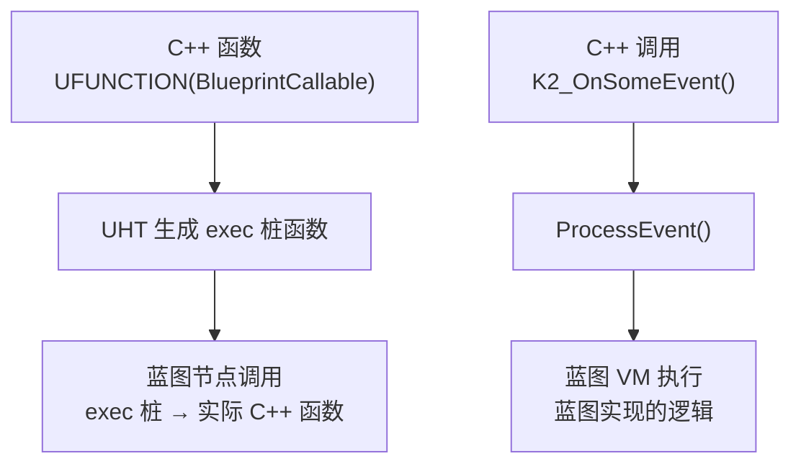

# 反射与蓝图交互

> **本课目标**：理解 `UFUNCTION(BlueprintCallable)` 如何让 C++ 函数暴露给蓝图，`BlueprintImplementableEvent` 如何让蓝图实现 C++ 声明的函数，以及底层 `ProcessEvent()` 的工作原理。

## 蓝图交互的本质：反射是桥梁

C++ 和蓝图是**两种不同语言**，它们之间的调用必须通过**反射系统**中转。



---

## 方向一：C++ → 蓝图（C++ 函数暴露给蓝图）

### `UFUNCTION(BlueprintCallable)` — 蓝图中可调用的 C++ 函数

#### 用法

```cpp
// LyraGameplayAbility.h（简化）
UCLASS()
class ULyraGameplayAbility : public UGameplayAbility
{
    GENERATED_BODY()

public:
    // ★ 蓝图可直接调用此 C++ 函数
    UFUNCTION(BlueprintCallable, Category = "Lyra|Ability")
    ULyraAbilitySystemComponent* GetLyraAbilitySystemComponentFromActorInfo() const;
};
```

#### 底层机制：UHT 生成 `exec` 桩函数

UHT 在 `.gen.cpp` 中为 `BlueprintCallable` 函数生成一个 **`exec` 桩函数**，负责参数转换（C++ ↔ 蓝图 VM）：

```cpp
// 简化后的生成代码（示意）：
DEFINE_FUNCTION(ULyraGameplayAbility::execGetLyraAbilitySystemComponentFromActorInfo)
{
    P_FINISH;              // 结束参数读取
    P_NATIVE_BEGIN;
    // 调用实际 C++ 函数
    *(UObject**)Z_Param__Result =
        P_THIS->GetLyraAbilitySystemComponentFromActorInfo();
    P_NATIVE_END;
}
```

> **关键点**：蓝图节点 → `exec` 桩 → 实际 C++ 函数。反射系统自动处理了整个调用链。

#### Lyra 实例：`LyraPlayerState.h`

```cpp
UCLASS()
class ALyraPlayerState : public AModularPlayerState
{
    GENERATED_BODY()

public:
    // 蓝图中可直接调用
    UFUNCTION(BlueprintCallable, Category = "Lyra|PlayerState")
    ALyraPlayerController* GetLyraPlayerController() const;

    UFUNCTION(BlueprintCallable, Category = "Lyra|PlayerState")
    int32 GetSquadId() const;
};
```

---

### `UFUNCTION(BlueprintPure)` — 纯函数（无副作用）

```cpp
// LyraWeaponInstance.h
UCLASS()
class ULyraWeaponInstance : public ULyraEquipmentInstance
{
    GENERATED_BODY()

public:
    // 纯函数：不修改状态，蓝图可调用，不显示执行引脚
    UFUNCTION(BlueprintCallable, BlueprintPure, Category = "Weapon")
    float GetSpread() const;
};
```

---

## 方向二：蓝图 → C++（蓝图实现 C++ 声明的函数）

### `UFUNCTION(BlueprintImplementableEvent)` — 蓝图必须实现

C++ 声明函数，但**没有 C++ 实现**（或有一个空实现），蓝图提供实际逻辑。

#### 用法

```cpp
// LyraGameplayAbility.h
UCLASS()
class ULyraGameplayAbility : public UGameplayAbility
{
    GENERATED_BODY()

protected:
    // ★ 蓝图实现此事件（C++ 只声明，不实现）
    UFUNCTION(BlueprintImplementableEvent, meta=(DisplayName="On Ability Added"))
    void K2_OnAbilityAdded();
};
```

#### C++ 调用时发生了什么？

```cpp
// C++ 调用：
K2_OnAbilityAdded();  // 看起来像普通函数调用

// 实际执行路径：
// 1. UHT 生成的桩函数被调用
// 2. 桩函数调用 ProcessEvent()
// 3. ProcessEvent() 通知蓝图 VM 执行蓝图实现
```

#### `ProcessEvent()` 底层机制

```cpp
// Engine/Source/Runtime/CoreUObject/Private/UObject/ScriptCore.cpp
void UObject::ProcessEvent(UFunction* Function, void* Parms)
{
    // 查找是否有蓝图实现
    if (UBlueprintGeneratedClass* BPGC = Cast<UBlueprintGeneratedClass>(GetClass()))
    {
        // 调用蓝图 VM 执行蓝图实现
        BPGC->InvokeScriptFunction(this, Parms, Function, nullptr);
    }
    // 如果没有蓝图实现，这个调用就是 no-op（不会崩溃）
}
```

#### Lyra 实例：`LyraCharacter.cpp`

```cpp
// 文件：Source/LyraGame/Character/LyraCharacter.cpp
void ALyraCharacter::OnDeathFinished()
{
    // ★ 通知蓝图：死亡动画已完成
    K2_OnDeathFinished();

    // C++ 侧的后续处理...
    Destroy();
}
```

蓝图里可以 override `OnDeathFinished` 事件，播放额外的特效或音效。

---

### `UFUNCTION(BlueprintNativeEvent)` — C++ 有默认实现，蓝图可重写

```cpp
UCLASS()
class ULyraContextEffectsInterface : public UInterface
{
    GENERATED_BODY()

public:
    // ★ C++ 有默认实现，蓝图可 override
    UFUNCTION(BlueprintCallable, BlueprintNativeEvent)
    void AnimMotionEffect(FName Bone, FGameplayTag MotionEffect);
};
```

**调用约定**：
- C++ 调用 `AnimMotionEffect()` → 如果蓝图 override 了，执行蓝图版本
- 如果蓝图没有 override，执行 C++ 默认实现

**函数名规则**：
- 声明：`AnimMotionEffect`（BlueprintNativeEvent）
- C++ 默认实现：`AnimMotionEffect_Implementation()`
- 蓝图 override：`K2_AnimMotionEffect`（由 UHT 生成桩）

---

## 方向三：属性暴露给蓝图

### `UPROPERTY(BlueprintReadOnly)` — 蓝图只读

```cpp
// LyraReticleWidgetBase.h
UCLASS(Abstract)
class ULyraReticleWidgetBase : public UCommonUserWidget
{
    GENERATED_BODY()

protected:
    // ★ 蓝图中可读，不可写
    UPROPERTY(BlueprintReadOnly)
    TObjectPtr<ULyraWeaponInstance> WeaponInstance;
};
```

### `UPROPERTY(BlueprintReadWrite)` — 蓝图可读写

```cpp
// InteractionOption.h（Lyra 交互系统）
USTRUCT(BlueprintType)
struct FInteractionOption
{
    GENERATED_BODY()

    // ★ 蓝图中可读写
    UPROPERTY(EditAnywhere, BlueprintReadWrite)
    FText Text;

    UPROPERTY(EditAnywhere, BlueprintReadWrite)
    TSoftClassPtr<UUserWidget> InteractionWidgetClass;
};
```

### `UCLASS(BlueprintType)` — 类可作为蓝图变量类型

```cpp
// LyraEquipmentInstance.h
UCLASS(BlueprintType, Blueprintable)   // ★ Blueprintable = 蓝图可继承此类
class ULyraEquipmentInstance : public UObject
{
    GENERATED_BODY()

public:
    // 蓝图可读取此属性
    UPROPERTY(BlueprintPure, Category=Equipment)
    APawn* GetPawn() const;
};
```

在蓝图中，你可以声明一个变量，类型为 `LyraEquipmentInstance`（因为标记了 `BlueprintType`）。

---

## 综合实例：Lyra 的 `LyraButtonBase`

这个 UI 组件展示了 C++ 与蓝图的交互：

```cpp
// 文件：Source/LyraGame/UI/Foundation/LyraButtonBase.h
UCLASS(Abstract, BlueprintType, Blueprintable)
class ULyraButtonBase : public UCommonButtonBase
{
    GENERATED_BODY()

protected:
    // ★ C++ 调用此函数，蓝图提供实现
    UFUNCTION(BlueprintImplementableEvent)
    void UpdateButtonText(const FText& InText);

    UFUNCTION(BlueprintImplementableEvent)
    void UpdateButtonStyle();

public:
    // ★ 蓝图可调用
    UFUNCTION(BlueprintCallable, Category = "Lyra|UI")
    void RefreshButtonText();
};

// 文件：Source/LyraGame/UI/Foundation/LyraButtonBase.cpp
void ULyraButtonBase::RefreshButtonText()
{
    if (InputActionWidget)
    {
        const FText ActionDisplayText = InputActionWidget->GetDisplayText();
        if (!ActionDisplayText.IsEmpty())
        {
            // ★ C++ 调用 → 蓝图实现
            UpdateButtonText(ActionDisplayText);
            return;
        }
    }

    // ★ C++ 调用 → 蓝图实现（使用默认值）
    UpdateButtonText(ButtonText);
}
```

**调用流程图**：

```mermaid
sequenceDiagram
    participant C++ as C++ (RefreshButtonText)
    participant Stub as UHT 生成桩\n(UpdateButtonText)
    participant PE as ProcessEvent()
    participant BP as 蓝图 VM\n(UpdateButtonText 实现)

    C++->>Stub: UpdateButtonText(Text)
    Stub->>PE: ProcessEvent(Function, Parms)
    PE->>BP: 执行蓝图实现
    BP-->>C++: 返回
```

---

## 常见错误

### 错误 1：`BlueprintCallable` 函数没加 `UFUNCTION()`

```cpp
// ❌ 错误：蓝图看不到此函数
void MyFunction();

// ✅ 正确
UFUNCTION(BlueprintCallable, Category = "MyCategory")
void MyFunction();
```

### 错误 2：`BlueprintImplementableEvent` 在 C++ 中提供了实现

```cpp
// ❌ 错误：BlueprintImplementableEvent 不应该有 C++ 实现
UFUNCTION(BlueprintImplementableEvent)
void K2_OnSomeEvent();

void ULyraMyClass::K2_OnSomeEvent()   // ❌ 不应该有实现
{
    // ...
}

// ✅ 正确：只有声明，没有实现（UHT 生成桩）
UFUNCTION(BlueprintImplementableEvent)
void K2_OnSomeEvent();
```

### 错误 3：忘记加 `BlueprintType`，却在蓝图中用这个类作为变量类型

```cpp
// ❌ 错误：蓝图中不能用此类作为变量类型
UCLASS()
class UMyObject : public UObject { ... };

// ✅ 正确
UCLASS(BlueprintType)
class UMyObject : public UObject { ... };
```

---

## 本篇总结

| 说明符 / 机制 | 方向 | 底层机制 |
|------------|--------|-----------|
| `UFUNCTION(BlueprintCallable)` | C++ → 蓝图 | UHT 生成 `exec` 桩函数 |
| `UFUNCTION(BlueprintPure)` | C++ → 蓝图（无副作用） | 同上，但蓝图节点无执行引脚 |
| `UFUNCTION(BlueprintImplementableEvent)` | 蓝图 → C++ | `ProcessEvent()` 调用蓝图 VM |
| `UFUNCTION(BlueprintNativeEvent)` | 蓝图 → C++（C++ 有默认实现） | `ProcessEvent()` + C++ 默认实现 |
| `UPROPERTY(BlueprintReadOnly)` | 蓝图 → C++（只读属性） | 反射系统生成 getter |
| `UPROPERTY(BlueprintReadWrite)` | 蓝图 ↔ C++（读写字属性） | 反射系统生成 getter/setter |
| `UCLASS(BlueprintType)` | 蓝图变量类型 | UHT 注册类到反射系统 |

---

## 下一步

下一课 [[30-tutorials/ue-reflection/06-高级主题与常见陷阱|06 — 高级主题与常见陷阱]] 将讨论反射性能考量、`TFieldIterator` 的正确用法、常见错误模式。

## 相关页面

- [[30-tutorials/ue-reflection/04-反射驱动的系统|← 04 — 反射驱动的系统]]
- [[30-tutorials/ue-reflection/06-高级主题与常见陷阱|06 — 高级主题与常见陷阱 →]]
- [[30-tutorials/ue-framework/60-tick-system/00-Tick系统架构概述|Tick 系统]] — 蓝图与 C++ 的交互性能考量

<!-- nav:auto -->

---

**导航**: ← [[30-tutorials/ue-reflection/04-反射驱动的系统|04-反射驱动的系统]] · [[30-tutorials/ue-reflection/06-高级主题与常见陷阱|06-高级主题与常见陷阱]] →

<!-- /nav:auto -->
