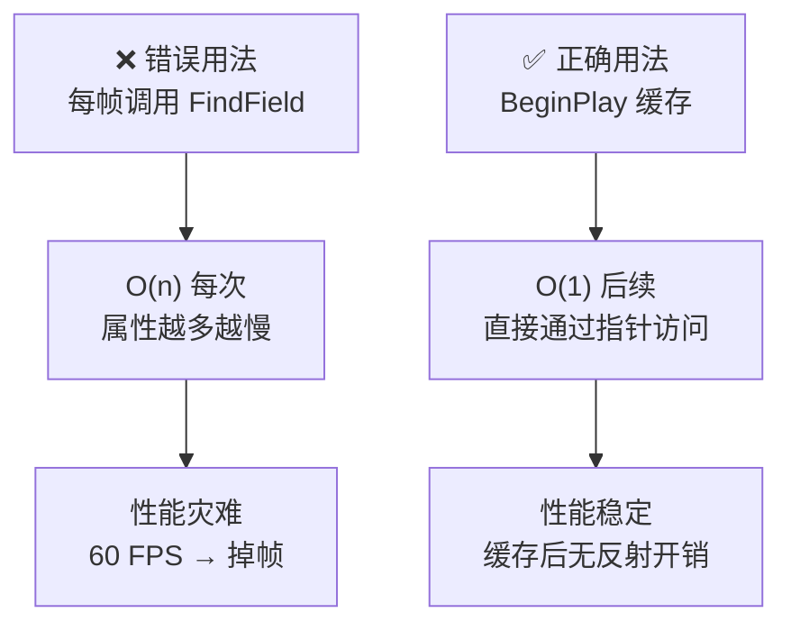

# 高级主题与常见陷阱

> **本课目标**：理解反射的性能代价、常见错误模式，以及在什么场景下应该（或不应该）使用反射。

## 性能考量：反射不是免费的



### `FindField<T>()` 是 O(n) 操作

```cpp
// ❌ 每帧调用 FindField —— 性能灾难
void Tick(float DeltaTime)
{
    // 每次 Tick 都线性搜索属性链表
    FProperty* Prop = FindField<FProperty>(GetClass(), FName("Health")); // O(n)！
    // ...
}
```

**原因**：`FindField` 内部用 `TFieldIterator` 遍历属性链表，直到找到匹配的名字。属性越多，越慢。

### ✅ 正确做法：启动时缓存

```cpp
// ✅ 缓存 FProperty*，后续直接用
class UMyComponent : public UActorComponent
{
    GENERATED_BODY()

public:
    // 启动时缓存一次
    virtual void BeginPlay() override
    {
        Super::BeginPlay();
        HealthProp = FindField<FProperty>(GetClass(), FName("Health"));
    }

    // 每帧用缓存的指针（O(1)）
    void TickComponent(float DeltaTime, ELevelTick TickType, FActorComponentTickFunction* ThisTickFunction) override
    {
        if (HealthProp)
        {
            // 直接通过偏移量读取，不经过 FindField
            float* HealthPtr = HealthProp->ContainerPtrToValuePtr<float>(this);
            // ...
        }
    }

private:
    FProperty* HealthProp = nullptr;  // 缓存的指针
};
```

---

## `TFieldIterator` 的正确用法

### ❌ 错误：每帧遍历属性

```cpp
// ❌ 每帧遍历 —— 非常慢
void Tick(float DeltaTime)
{
    for (TFieldIterator<FProperty> It(GetClass()); It; ++It)
    {
        // 每帧都遍历所有属性！
    }
}
```

### ✅ 正确：初始化时遍历一次

```cpp
// ✅ 初始化时遍历，结果缓存
void UMyComponent::BeginPlay()
{
    Super::BeginPlay();

    // 只遍历一次，结果存入数组
    for (TFieldIterator<FProperty> It(GetClass()); It; ++It)
    {
        FProperty* Prop = *It;
        if (Prop->HasAnyPropertyFlags(CPF_BlueprintCallable))
        {
            BlueprintCallableProps.Add(Prop);
        }
    }
}

// 后续直接用缓存的数组（O(1) 访问）
void UMyComponent::TickComponent(...)
{
    for (FProperty* Prop : BlueprintCallableProps)
    {
        // ...
    }
}
```

### Lyra 实例：`LyraMemoryDebugCommands.cpp`

Lyra 的调试工具在**控制台命令触发时**遍历属性（不是每帧）：

```cpp
// 文件：Source/LyraGame/Performance/LyraMemoryDebugCommands.cpp L93
void AnalyzeObjectListForDifferences(
    TArrayView<UObject*> ObjectList,
    UClass* CommonClass, ...)
{
    // ★ 只遍历一次，用于分析
    for (TFieldIterator<FProperty> PropIt(CommonClass); PropIt; ++PropIt)
    {
        FProperty* Prop = *PropIt;
        // 分析逻辑...
    }
}
```

> **教训**：`TFieldIterator` 用在**低频操作**（加载、控制台命令、初始化）中是 OK 的，但**绝不能每帧调用**。

---

## 常见陷阱一：`UPROPERTY` 遗漏

### 错误模式

```cpp
UCLASS()
class UMyComponent : public UActorComponent
{
    GENERATED_BODY()

    // ❌ 没有 UPROPERTY：GC 不认识这个引用！
    UMyObject* MyRef;

    // ✅ 正确
    UPROPERTY()
    UMyObject* MyRef2;
};
```

### 后果

| 没有 `UPROPERTY` | 有 `UPROPERTY` |
|--------------|---------------|
| GC 不认识引用，对象可能被回收 | GC 追踪引用，防止误回收 |
| 不序列化（存档丢失） | 参与序列化 |
| 编辑器 Details 面板不可见 | 编辑器可见 |
| 网络复制不工作 | 可复制（如标记 `Replicated`） |

### Lyra 中的真实案例

在 Lyra 中，几乎所有成员指针都正确使用了 `UPROPERTY()`：

```cpp
// Source/LyraGame/AbilitySystem/LyraAbilitySet.h（简化）
UCLASS()
class ULyraAbilitySet : public UPrimaryDataAsset
{
    GENERATED_BODY()

protected:
    // ✅ 正确：尽管是 protected，仍然有 UPROPERTY
    // 这样 GC 能追踪这些 Handle
    UPROPERTY()
    TArray<FGameplayAbilitySpecHandle> AbilitySpecHandles;

    UPROPERTY()
    TArray<FActiveGameplayEffectHandle> GameplayEffectHandles;

    UPROPERTY()
    TArray<TObjectPtr<UAttributeSet>> GrantedAttributeSets;
};
```

---

## 常见陷阱二：`GENERATED_BODY()` 位置错误

### 错误模式

```cpp
// ❌ 错误：GENERATED_BODY() 不在第一位
UCLASS()
class UMyObject : public UObject
{
    int32 MyField;           // ❌ 其他成员在 GENERATED_BODY 之前
    GENERATED_BODY()       // ← 必须在第一位
};
```

### 正确模式

```cpp
// ✅ 正确
UCLASS()
class UMyObject : public UObject
{
    GENERATED_BODY()       // ← 必须在第一位

    int32 MyField;           // ← 在 GENERATED_BODY 之后
};
```

**原因**：`GENERATED_BODY()` 展开后声明了 `StaticClass()`、`Super`、`ThisClass` 等**必须在类最开始声明**的成员。

---

## 常见陷阱三：`#include "X.generated.h"` 不是最后一个 include

### 错误模式

```cpp
// MyObject.h
#pragma once

#include "MyObject.generated.h"   // ❌ 不是最后一个 include
#include "AnotherHeader.h"         // ← 不能在 .generated.h 之后
```

### 正确模式

```cpp
// MyObject.h
#pragma once

#include "CoreMinimal.h"
#include "UObject/NoExportTypes.h"
#include "MyParentClass.h"
#include "MyObject.generated.h"   // ← 必须是最后一个 include
```

---

## 常见陷阱四：在 `for` 循环中使用 `FindField`

### 错误模式

```cpp
// ❌ 对每个属性名都调用 FindField（O(n²)！）
TArray<FString> PropNames = { "Health", "Mana", "Speed" };
for (const FString& PropName : PropNames)
{
    FProperty* Prop = FindField<FProperty>(GetClass(), FName(*PropName)); // O(n) 每次
    // ...
}
```

### ✅ 正确做法：一次遍历完成所有查找

```cpp
// ✅ 只遍历一次（O(n) 总复杂度）
TArray<FString> PropNames = { "Health", "Mana", "Speed" };
TMap<FName, FProperty*> PropMap;

// 一次遍历，建立名字 → 属性指针的映射
for (TFieldIterator<FProperty> It(GetClass()); It; ++It)
{
    FProperty* Prop = *It;
    PropMap.Add(Prop->GetFName(), Prop);
}

// 后续 O(1) 查找
for (const FString& PropName : PropNames)
{
    FProperty* Prop = PropMap.FindRef(FName(*PropName));
    // ...
}
```

---

## `FindField` vs `FindFProperty`

UE 提供了两个类似的函数：

| 函数 | 说明 |
|--------|------|
| `FindField<T>(Scope, Name)` | 通用，可查找任意 `FField` 派生类型（`FProperty`、`UFunction` 等） |
| `FindFProperty<T>(Scope, Name)` | 专门针对 `FProperty`，类型更安全 |

### 用法对比

```cpp
UClass* Cls = GetClass();

// 方法 1：FindField（通用）
FProperty* Prop1 = FindField<FProperty>(Cls, FName("Health"));

// 方法 2：FindFProperty（推荐，类型更安全）
FProperty* Prop2 = FindFProperty<FProperty>(Cls, FName("Health"));
```

> **推荐**：优先用 `FindFProperty`，它是 `FindField` 的类型安全封装。

---

## `GetDefault<T>()` vs `GetClass()->GetDefaultObject<T>()`

两种获取 CDO 的方法：

```cpp
// 方法 1：模板函数（编译时类型已知）
const AMyActor* CDO1 = GetDefault<AMyActor>();

// 方法 2：通过 UClass（运行时类型才能确定时用这个）
UClass* Cls = Obj->GetClass();  // 运行时才能确定类型
const AMyActor* CDO2 = Cls->GetDefaultObject<AMyActor>();
```

### 使用场景

| 场景 | 推荐方法 |
|------|-----------|
| 编译时类型已知 | `GetDefault<T>()`（更简洁） |
| 运行时才能确定类型 | `GetClass()->GetDefaultObject<T>()` |
| 需要访问父类的 CDO | `Super::StaticClass()->GetDefaultObject()` |

---

## `BlueprintType` vs `Blueprintable`

这两个说明符容易混淆：

| 说明符 | 用于 | 作用 |
|--------|------|------|
| `BlueprintType` | `UCLASS()` / `USTRUCT()` / `UENUM()` | 此类/结构体/枚举**可作为变量类型**在蓝图中使用 |
| `Blueprintable` | `UCLASS()` | 此类**可被蓝图继承** |
| `NotBlueprintable` | `UCLASS()` | 禁止蓝图继承 |

### 示例

```cpp
// 可被蓝图继承
UCLASS(Blueprintable)
class UMyObject : public UObject { ... };

// 可作为变量类型，但不可被继承
UCLASS(BlueprintType, NotBlueprintable)
class UMyConfig : public UObject { ... };

// 结构体和枚举只用 BlueprintType
USTRUCT(BlueprintType)
struct FMyStruct { GENERATED_BODY() };
```

---

## `TSharedPtr` / `TWeakPtr` 与反射的关系

> **重要**：`TSharedPtr` / `TWeakPtr` 是 UE 的智能指针（类似 `std::shared_ptr` / `std::weak_ptr`），但它们**不参与 UE 的反射系统**。

### 问题：`TSharedPtr` 不会被 GC 追踪

```cpp
UCLASS()
class UMyObject : public UObject
{
    GENERATED_BODY()

    // ❌ 错误：TSharedPtr 不被反射系统识别
    TSharedPtr<FMyNonUObject> MyPtr;  // GC 不追踪！
};
```

### 正确做法：用 `TObjectPtr` 或 `UPROPERTY()`

```cpp
UCLASS()
class UMyObject : public UObject
{
    GENERATED_BODY()

    // ✅ 正确：TObjectPtr 参与反射系统
    TObjectPtr<UMyOtherObject> MyPtr;

    // ✅ 正确：UPROPERTY 标记的 UObject* 被 GC 追踪
    UPROPERTY()
    TObjectPtr<UMyOtherObject> MyPtr2;
};
```

### `TSharedPtr` 的适用场景

| 场景 | 推荐指针类型 |
|------|----------------|
| **UObject 派生类** | `TObjectPtr<>` + `UPROPERTY()` |
| **非 UObject 对象（引擎工具类）** | `TSharedPtr<>`（不参与反射，需手动管理） |
| **避免循环引用** | `TWeakPtr<>`（非 UObject） / `TWeakObjectPtr<>`（UObject） |

### Lyra 中的用法

Lyra 中极少使用 `TSharedPtr`（因为大多数对象都是 UObject 派生类，用 `TObjectPtr` + `UPROPERTY()`）。

典型的 `TSharedPtr` 用法在**非 UObject 的引擎工具类**中（如 `FMessageRouter`）：

```cpp
// 示例：Lyra 可能使用的模式（非 UObject 对象）
class FMyToolClass
{
public:
    TSharedPtr<FMyToolData> DataPtr;  // 不参与反射，纯 C++ 智能指针
};
```

> **记住**：如果你的对象需要参与 UE 的 GC / 序列化 / 网络复制，必须是 UObject 派生类，并用 `UPROPERTY()` 标记。

---

## `WITH_EDITOR` 守卫

有些反射相关代码**只在编辑器有效**，需要加 `WITH_EDITOR` 守卫：

```cpp
UCLASS()
class UMyObject : public UObject
{
    GENERATED_BODY()

public:
#if WITH_EDITOR
    // ★ 只在编辑器编译
    UFUNCTION(BlueprintCallable, Category = "Editor")
    void ValidateAsset();

    virtual EDataValidationResult IsDataValid(FDataValidationContext& Context) const override;
#endif
};
```

> **原因**：`WITH_EDITOR` 在 Shipping 构建中未定义，相关代码会被完全剔除，减小包体。

---

## 性能优化建议总结

| 操作 | 性能代价 | 建议 |
|------|---------|------|
| `FindField()` / `FindFProperty()` | O(n) | 启动时缓存结果 |
| `TFieldIterator` 遍历 | O(n) | 只遍历一次，缓存结果 |
| `GetClass()` | O(1) | 可以频繁调用 |
| `StaticClass()` | O(1) | 可以频繁调用 |
| 通过 `FProperty` 读取值 | O(1)（通过偏移量） | 缓存 `FProperty*` 后很快 |
| `ExportText_InContainer()` | O(n)（序列化） | 只在调试/保存时用 |

---

## 本篇总结

| 主题 | 关键要点 |
|------|----------|
| 性能 | `FindField` 是 O(n)，缓存结果 |
| `TFieldIterator` | 只用于低频操作，禁止每帧调用 |
| `UPROPERTY` 遗漏 | GC 不追踪、不序列化、不复制 |
| `GENERATED_BODY()` 位置 | 必须在类的最开始 |
| `.generated.h` include | 必须是最后一个 include |
| `FindField` vs `FindFProperty` | 推荐用 `FindFProperty`（类型更安全） |
| `WITH_EDITOR` 守卫 | 编辑器专用代码要加守卫 |

---

## 下一步

最后一课 [[30-tutorials/ue-reflection/07-Lyra中的反射实践|07 — Lyra 中的反射实践]] 将深入分析 Lyra 如何用反射实现数据驱动的 Experience 系统、AbilitySet、Inventory 等核心机制。

## 相关页面

- [[30-tutorials/ue-reflection/05-反射与蓝图交互|← 05 — 反射与蓝图交互]]
- [[30-tutorials/ue-reflection/07-Lyra中的反射实践|07 — Lyra 中的反射实践 →]]
- [[30-tutorials/performance-optimization/02-CPU性能优化|CPU 性能优化]] — 反射性能优化

<!-- nav:auto -->

---

**导航**: ← [[30-tutorials/ue-reflection/05-反射与蓝图交互|05-反射与蓝图交互]] · [[30-tutorials/ue-reflection/07-Lyra中的反射实践|07-Lyra中的反射实践]] →

<!-- /nav:auto -->
