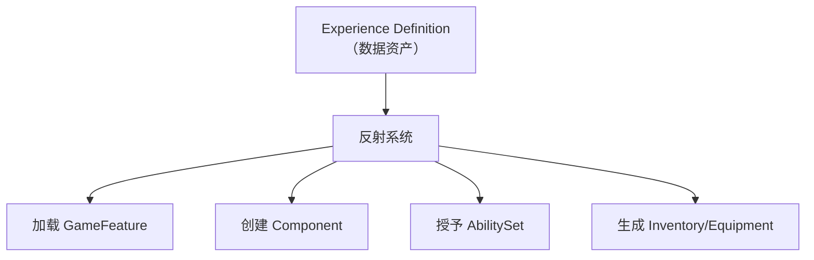

# Lyra中的反射实践

> **本课目标**：综合分析 Lyra 如何用反射实现数据驱动的 Experience 系统、AbilitySet、Inventory、Equipment，以及其中的反射性能模式。

## Lyra 的架构哲学：数据驱动 + 反射

Lyra 的核心设计理念是：**游戏逻辑由数据（资产）驱动，C++ 只提供框架**。反射系统让这个架构成为可能——



---

## 系统一：Experience 系统（数据驱动的核心）

### `ULyraExperienceDefinition` — 一切的起点

```cpp
// 文件：Source/LyraGame/GameModes/LyraExperienceDefinition.h
UCLASS(BlueprintType, Const)
class ULyraExperienceDefinition : public UPrimaryDataAsset
{
    GENERATED_BODY()

public:
    // ★ EditDefaultsOnly：编辑默认值，Item 里可配置
    // ★ BlueprintType：蓝图可使用此类作为变量类型
    UPROPERTY(EditDefaultsOnly, Category="Gameplay")
    TObjectPtr<const ULyraPawnData> DefaultPawnData;

    // ★ Instanced：每个实例有独立的 Action 对象
    UPROPERTY(EditDefaultsOnly, Instanced, Category="Actions")
    TArray<TObjectPtr<UGameFeatureAction>> Actions;

    // 要启用的 GameFeature Plugin 列表
    UPROPERTY(EditDefaultsOnly, Category="Gameplay")
    TArray<FString> GameFeaturesToEnable;
};
```

### 反射在这里的作用

| 机制 | 反射的角色 |
|------|-------------|
| `EditDefaultsOnly` | 编辑器通过反射枚举 `UPROPERTY`，生成 Details 面板 |
| `Instanced` | 反射创建独立的 `UGameFeatureAction` 实例（每个实例有独立内存） |
| `TSubclassOf<>` / `TObjectPtr<>` | 反射系统追踪这些引用，GC 不回收，序列化会保存 |
| 加载 Experience | `FSoftObjectPath::TryLoad()` 底层用反射找到 UClass |

### Lyra 如何加载 Experience（反射路径）

```cpp
// 文件：Source/LyraGame/GameModes/LyraExperienceManagerComponent.cpp（简化）
void ULyraExperienceManagerComponent::SetCurrentExperience(FPrimaryAssetId ExperienceId)
{
    ULyraAssetManager& AssetManager = ULyraAssetManager::Get();

    // ★ 反射加载：通过 PrimaryAssetId 找到资产路径 → TryLoad
    FSoftObjectPath AssetPath = AssetManager.GetPrimaryAssetPath(ExperienceId);
    TSubclassOf<ULyraExperienceDefinition> AssetClass =
        Cast<UClass>(AssetPath.TryLoad());

    const ULyraExperienceDefinition* Experience =
        GetDefault<ULyraExperienceDefinition>(AssetClass);

    // 触发加载流程...
}
```

---

## 系统二：AbilitySet（授予技能/效果/属性集）

### `ULyraAbilitySet` — 数据资产定义"授予什么"

```cpp
// 文件：Source/LyraGame/AbilitySystem/LyraAbilitySet.h
UCLASS(BlueprintType, Const)
class ULyraAbilitySet : public UPrimaryDataAsset
{
    GENERATED_BODY()

protected:
    // ★ 结构体用 USTRUCT(BlueprintType) 标记
    USTRUCT(BlueprintType)
    struct FLyraAbilitySet_GameplayAbility
    {
        GENERATED_BODY()
        UPROPERTY(EditDefaultsOnly) TSubclassOf<ULyraGameplayAbility> Ability;
        UPROPERTY(EditDefaultsOnly) int32 AbilityLevel = 1;
        UPROPERTY(EditDefaultsOnly, Meta=(Categories="InputTag")) FGameplayTag InputTag;
    };

    // ★ meta=(TitleProperty=Ability)：数组元素显示 Ability 名
    UPROPERTY(EditDefaultsOnly, Category="Gameplay Abilities", meta=(TitleProperty=Ability))
    TArray<FLyraAbilitySet_GameplayAbility> GrantedGameplayAbilities;

    // 授予的属性集（同样模式）
    UPROPERTY(EditDefaultsOnly, Category="Attribute Sets", meta=(TitleProperty=AttributeSet))
    TArray<FLyraAbilitySet_AttributeSet> GrantedAttributes;
};
```

### 反射在这里的作用：运行时动态授予

```cpp
// 文件：Source/LyraGame/AbilitySystem/LyraAbilitySet.cpp（简化）
void ULyraAbilitySet::GiveToAbilitySystem(
    ULyraAbilitySystemComponent* LyraASC,
    FLyraAbilitySet_GrantedHandles& OutGrantedHandles,
    UObject* SourceObject) const
{
    // ★ 遍历 GrantedGameplayAbilities（反射枚举）
    for (int32 AbilityIndex = 0; AbilityIndex < GrantedGameplayAbilities.Num(); ++AbilityIndex)
    {
        const FLyraAbilitySet_GameplayAbility& AbilityToGrant = GrantedGameplayAbilities[AbilityIndex];

        // ★ GetDefaultObject<>()：通过 TSubclassOf<> 获取 CDO
        ULyraGameplayAbility* AbilityCDO =
            AbilityToGrant.Ability->GetDefaultObject<ULyraGameplayAbility>();

        // 授予 Ability（底层用反射注册到 ASC）
        FGameplayAbilitySpec AbilitySpec(AbilityCDO, AbilityToGrant.AbilityLevel);
        LyraASC->GiveAbility(AbilitySpec);
    }

    // ★ 同样模式授予 GameplayEffect 和 AttributeSet...
}
```

> **关键点**：`TSubclassOf<>` + `GetDefaultObject<>()` 是 Lyra 中**最常见的反射用法**——从数据资产中读取类引用，再反射创建/初始化实例。

---

## 系统三：Inventory（背包系统，FFastArraySerializer）

### `FLyraInventoryEntry` + `FLyraInventoryList`

Lyra 的 Inventory 使用 `FFastArraySerializer` 实现**高效网络复制**——这完全依赖反射。

```cpp
// 文件：Source/LyraGame/Inventory/LyraInventoryManagerComponent.h

// 背包中的单个条目
USTRUCT(BlueprintType)
struct FLyraInventoryEntry : public FFastArraySerializerItem
{
    GENERATED_BODY()

    UPROPERTY()
    TObjectPtr<ULyraInventoryItemInstance> Instance = nullptr;

    UPROPERTY()
    int32 StackCount = 0;
};

// 背包条目列表（支持网络增量复制）
USTRUCT(BlueprintType)
struct FLyraInventoryList : public FFastArraySerializer
{
    GENERATED_BODY()

    // ★ 关键：UHT 生成的代码会注册这些属性到复制系统
    UPROPERTY()
    TArray<FLyraInventoryEntry> Entries;

    // 网络增量序列化（底层用反射对比前后状态）
    bool NetDeltaSerialize(FNetDeltaSerializeInfo& DeltaParms)
    {
        return FFastArraySerializer::FastArrayDeltaSerialize<
            FLyraInventoryEntry, FLyraInventoryList>(
            Entries, DeltaParms, *this);
    }
};

// 模板特化：告诉复制系统用 NetDeltaSerialize
template<>
struct TStructOpsTypeTraits<FLyraInventoryList>
    : public TStructOpsTypeTraitsBase2<FLyraInventoryList>
{
    enum { WithNetDeltaSerializer = true };
};
```

### 反射在这里的作用

| 机制 | 反射的角色 |
|------|-------------|
| `FFastArraySerializer` | 底层用 `FProperty` 反射读取 `Entires` 数组，对比前后状态差异 |
| `NetDeltaSerialize()` | 调用 `FProperty::NetSerializeItem()` 序列化每个条目的属性 |
| `UPROPERTY()` | 标记 `Entires` 参与网络复制（UHT 将其加入 `ClassReps` 数组） |
| `NewObject<>()` | 创建 `ULyraInventoryItemInstance` 实例（反射构造） |

### Lyra 如何创建 Inventory Item（反射构造）

```cpp
// 文件：Source/LyraGame/Inventory/LyraInventoryManagerComponent.cpp
FLyraInventoryEntry& FLyraInventoryList::AddEntry(
    TSubclassOf<ULyraInventoryItemDefinition> ItemDef, int32 StackCount)
{
    check(ItemDef != nullptr);
    check(OwnerComponent->GetOwner()->HasAuthority());

    // ★ NewObject<>：反射创建实例
    FLyraInventoryEntry& NewEntry = Entries.AddDefaulted_GetRef();
    NewEntry.Instance = NewObject<ULyraInventoryItemInstance>(
        OwnerComponent->GetOwner());

    NewEntry.Instance->SetItemDef(ItemDef);

    // ★ 遍历 ItemDefinition 的 Fragment（反射读取）
    for (ULyraInventoryItemFragment* Fragment
         : GetDefault<ULyraInventoryItemDefinition>(ItemDef)->Fragments)
    {
        if (Fragment != nullptr)
        {
            Fragment->OnInstanceCreated(NewEntry.Instance);
        }
    }

    // 触发网络复制...
}
```

---

## 系统四：Equipment（装备系统）

装备系统复用 Inventory 的 `FFastArraySerializer` 模式，增加了**运行时类型判断**。

```cpp
// 文件：Source/LyraGame/Equipment/LyraEquipmentManagerComponent.h
USTRUCT(BlueprintType)
struct FLyraAppliedEquipmentEntry : public FFastArraySerializerItem
{
    GENERATED_BODY()

    UPROPERTY()
    TSubclassOf<ULyraEquipmentDefinition> EquipmentDefinition;

    UPROPERTY()
    TObjectPtr<ULyraEquipmentInstance> Instance = nullptr;
};

UCLASS(MinimalAPI, BlueprintType, Const)
class ULyraEquipmentManagerComponent : public UPawnComponent
{
    GENERATED_BODY()

public:
    // ★ 蓝图可调用：装备一个 Definition
    UFUNCTION(BlueprintCallable, BlueprintAuthorityOnly)
    ULyraEquipmentInstance* EquipItem(
        TSubclassOf<ULyraEquipmentDefinition> EquipmentDefinition);

    // ★ 运行时类型检查（反射）
    UFUNCTION(BlueprintCallable, BlueprintPure)
    ULyraEquipmentInstance* GetFirstInstanceOfType(
        TSubclassOf<ULyraEquipmentInstance> InstanceType);
};
```

### 运行时反射类型检查

```cpp
// 文件：Source/LyraGame/Equipment/LyraEquipmentManagerComponent.cpp
ULyraEquipmentInstance* ULyraEquipmentManagerComponent::GetFirstInstanceOfType(
    TSubclassOf<ULyraEquipmentInstance> InstanceType)
{
    // ★ 遍历所有装备条目
    for (FLyraAppliedEquipmentEntry& Entry : EquipmentList.Entries)
    {
        if (ULyraEquipmentInstance* Instance = Entry.Instance)
        {
            // ★ IsA()：反射类型检查（底层用 UClass 继承链）
            if (Instance->IsA(InstanceType))
            {
                return Instance;
            }
        }
    }
    return nullptr;
}

// 模板版本（编译时类型已知，更快）
template <typename T>
T* GetFirstInstanceOfType()
{
    return (T*)GetFirstInstanceOfType(T::StaticClass());
}
```

---

## 系统五：`CreateDefaultSubobject`（组件注册）

Lyra 在构造函数中用 `CreateDefaultSubobject()` 注册组件——这**依赖反射**才能工作。

```cpp
// 文件：Source/LyraGame/Player/LyraPlayerState.cpp
ALyraPlayerState::ALyraPlayerState(const FObjectInitializer& ObjectInitializer)
    : Super(ObjectInitializer)
{
    // ★ CreateDefaultSubobject：反射注册组件
    // 底层用 UHT 生成的 StaticClass() 信息来创建和注册组件
    AbilitySystemComponent = ObjectInitializer.CreateDefaultSubobject<ULyraAbilitySystemComponent>(
        this, TEXT("AbilitySystemComponent"));
    AbilitySystemComponent->SetIsReplicated(true);

    // ★ 同样模式创建 AttributeSet
    HealthSet = CreateDefaultSubobject<ULyraHealthSet>(TEXT("HealthSet"));
    CombatSet = CreateDefaultSubobject<ULyraCombatSet>(TEXT("CombatSet"));
}
```

> **为什么需要反射？** `CreateDefaultSubobject()` 需要知道子对象的 `UClass*` 才能正确构造——这个信息来自 UHT 生成的 `StaticClass()`。

---

## Lyra 的反射性能模式

### 模式一：启动时缓存，运行时只用 CDO

```cpp
// ✅ 好模式：GetDefault<>() 只在需要时调用一次（CDO 是懒加载的）
const ULyraCharacter* CDO = GetDefault<ALyraCharacter>();
float DefaultCrouchedHeight = CDO->CrouchedEyeHeight;
// 后续直接用缓存的值，不调用 GetClass()->GetDefaultObject()
```

### 模式二：避免每帧用 `FindField()`

```cpp
// ❌ 坏模式（Lyra 中没有，但值得警惕）
void Tick(float DeltaTime)
{
    FProperty* Prop = FindField<FProperty>(GetClass(), FName("Health")); // O(n) 每帧
}

// ✅ 好模式：初始化时缓存
void BeginPlay()
{
    CachedHealthProp = FindField<FProperty>(GetClass(), FName("Health"));
}
```

### 模式三：用 `IsA()` 做类型检查（反射，但很快）

```cpp
// IsA() 底层用 UClass 继承链检查，是 O(k)（k = 继承深度），通常很快
if (Obj->IsA(ALyraCharacter::StaticClass()))
{
    // ...
}
```

---

## 本篇总结

| Lyra 系统 | 反射用法 | 关键模式 |
|-----------|------------|-----------|
| **Experience** | `UPROPERTY(EditDefaultsOnly)` 暴露数据给编辑器 | 数据驱动：Experience 定义一切 |
| **AbilitySet** | `GetDefault<>()` 获取 CDO 来授予 GA/GE | `TSubclassOf<>` + `GetDefault<>()` |
| **Inventory** | `FFastArraySerializer` 用反射做增量复制 | `FProperty::NetSerializeItem()` |
| **Equipment** | `IsA()` 运行时类型检查 | `IsA(StaticClass())` |
| **组件注册** | `CreateDefaultSubobject<T>()` | UHT 生成的 `StaticClass()` 信息 |

### 一句话总结

> **Lyra 的架构本质**：用 `UPROPERTY` 标记数据 → 编辑器配置 → 运行时用反射（`GetDefault<>()`、`NewObject<>()`、`IsA()`）读取和实例化 → 实现数据驱动。

---

## 系列总结

恭喜！你已经完成了 **UE 反射系统从入门到实战** 系列的所有 7 篇教程。

| 篇 | 标题 | 核心收获 |
|----|------|----------|
| 00 | 概览 | 反射全景图，系列导航 |
| 01 | 反射是什么 | C++ 无反射 → UHT 解决方案，`GENERATED_BODY()` 背后 |
| 02 | 核心宏详解 | `UCLASS`/`UPROPERTY`/`UFUNCTION`/`USTRUCT`/`UENUM` 逐个拆解 |
| 03 | 反射 API 实战 | `GetClass()`/`FindField()`/`TFieldIterator`/`TObjectIterator` 用法 |
| 04 | 反射驱动的系统 | 序列化、网络复制、CDO 背后的反射机制 |
| 05 | 反射与蓝图交互 | `BlueprintCallable`/`BlueprintImplementableEvent` 底层原理 |
| 06 | 高级主题与常见陷阱 | 性能考量、`FindField` O(n) 陷阱 |
| 07 | Lyra 中的反射实践 | Experience/AbilitySet/Inventory/Equipment 的数据驱动架构 |

---

## 相关页面

- [[30-tutorials/ue-reflection/06-高级主题与常见陷阱|← 06 — 高级主题与常见陷阱]]
- [[30-tutorials/game-feature/04-Lyra中的ExperienceSystem实践|GameFeature：Lyra Experience 系统详解]]
- [[30-tutorials/ue-framework/70-lyra-case-study/00-Lyra架构总览|Lyra 架构总览]]

<!-- nav:auto -->

---

**导航**: ← [[30-tutorials/ue-reflection/06-高级主题与常见陷阱|06-高级主题与常见陷阱]]

<!-- /nav:auto -->
