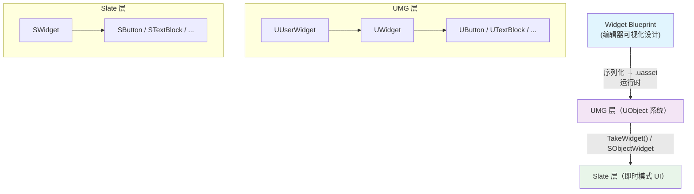
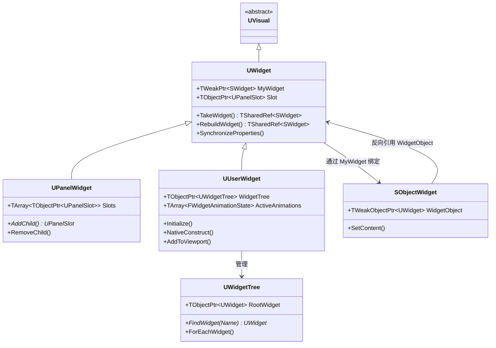
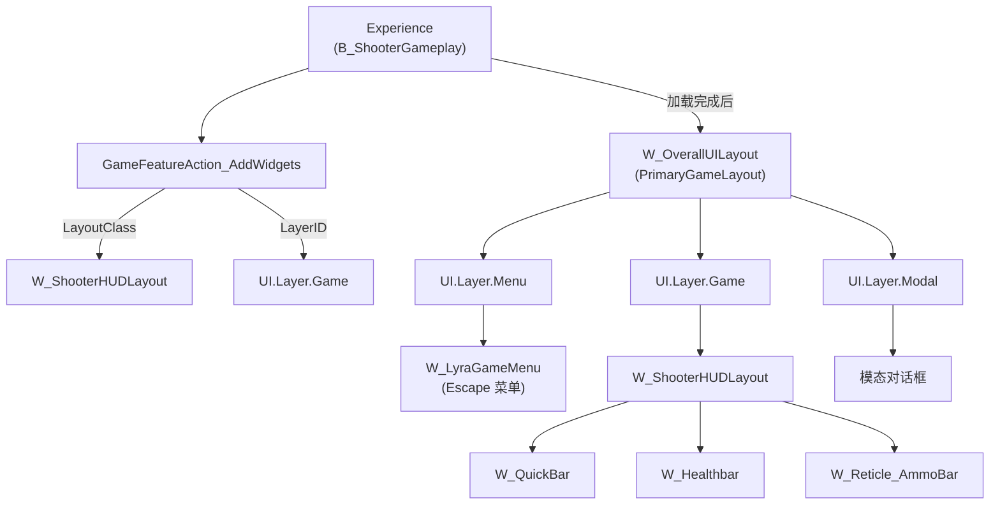

# UMG系列概览

> UMG 是 Unreal Engine 的**可视化 UI 创作系统**，通过 Widget Blueprint 快速构建游戏界面，底层由 Slate 即时模式 UI 框架驱动。

## 概述

### UMG 是什么？

**UMG（Unreal Motion Graphics）** 是 UE 提供的**可视化 UI 设计工具**，允许开发者通过拖拽方式创建游戏界面（HUD、菜单、背包、对话框等）。

UMG 的核心是一个 **Widget Blueprint**，你在可视化编辑器中设计的每个按钮、文本、图片，最终都会：
1. 保存为 `UWidget` 派生类的序列化数据
2. 运行时通过 `UUserWidget::RebuildWidget()` 创建对应的 **Slate 控件**（`SWidget` 派生类）
3. 由 Slate 的渲染管线绘制到屏幕上

### 为什么 UMG 重要？

1. **生产力**：可视化编辑器让 UI 设计迭代速度提升 10x+
2. **蓝图友好**：设计师无需写 C++ 就能创建复杂 UI
3. **Slate 兜底**：需要极致性能或高度自定义时，可以直接写 Slate 控件
4. **CommonUI 扩展**：UE5 提供 CommonUI 插件，解决了 UMG 在多层级 UI、输入管理上的痛点

### UMG vs Slate：你应该用哪个？

| 场景 | 推荐方案 | 理由 |
|------|---------|------|
| 游戏 HUD、菜单、背包等常规 UI | **UMG** | 可视化设计，迭代快 |
| 需要极致性能的图表、大批量 UI 元素 | **Slate 原生** | 直接写 `SLeafWidget::OnPaint()`，跳过 UMG 开销 |
| 编辑器扩展（Custom Detail Panel 等） | **Slate** | 编辑器 UI 只能用 Slate |
| 需要动态创建大量相似控件（如物品列表） | **UMG + 虚拟化** | `UListView` / `U TileView` 已内置虚拟化 |

---

## 核心概念全景图

### 关键概念速查

| 概念 | 说明 | 对应类 |
|------|------|--------|
| **Widget** | UMG 控件的基本单位 | `UWidget` |
| **UserWidget** | 可通过 Widget Blueprint 扩展的控件 | `UUserWidget` |
| **PanelWidget** | 容器控件，管理子控件数组 | `UPanelWidget` |
| **Slot** | 子控件在父容器中的布局参数 | `UPanelSlot` 派生类 |
| **WidgetTree** | 控件层级的管理器 | `UWidgetTree` |
| **Slate Widget** | UMG 控件底层的即时模式控件 | `SWidget` 派生类 |
| **SObjectWidget** | 连接 UWidget 和 SWidget 的桥梁 | `SObjectWidget` |
| **WidgetAnimation** | UMG 动画系统 | `UWidgetAnimation` |
| **NamedSlot** | 允许在父 Widget 中"挖洞"，让外部注入子 Widget | `UNamedSlot` |

---

## 与 Lyra 项目的关系

Lyra 没有直接用"裸 UMG"，而是基于 **CommonUI 插件** 构建了一套现代化的 UI 架构：

| Lyra 类/资产 | 功能 | 对应 UMG 概念 |
|-------------|------|----------------|
| `ULyraActivatableWidget` | 扩展 `UCommonActivatableWidget`，管理输入模式 | `UUserWidget` 派生类 |
| `ULyraHUDLayout` | HUD 布局容器，管理 Escape 菜单和控制器断开界面 | `UUserWidget` 作为 PrimaryGameLayout |
| `W_OverallUILayout` | 整体 UI 布局（CommonUI 的 PrimaryGameLayout） | Root Widget |
| `W_ShooterHUDLayout` | 射击游戏 HUD 布局 | 游戏层 HUD 容器 |
| `GameFeatureAction_AddWidgets` | 通过 Experience 动态加载 UI | 替代手动 `AddToViewport()` |
| `ULyraButtonBase` | 统一按钮样式，响应输入方式变化 | `UCommonButtonBase` 派生类 |

### Lyra UI 架构映射

---

## 系列阅读指南

本系列共 **10 篇**，分为三个阶段：

### 阶段一：入门（01-03）

| 课时 | 标题 | 学习目标 |
|------|------|----------|
| 00 | [系列概览]（当前） | 理解 UMG 是什么、与 Slate 的关系 |
| 01 | [UMG 基础与核心类架构] | 掌握 `UWidget` / `UUserWidget` / `UPanelWidget` 的源码结构 |
| 02 | [常用控件详解] | 熟练使用 Button / TextBlock / Image / ProgressBar 等基础控件 |
| 03 | [容器控件与布局] | 理解 CanvasPanel / Overlay / HBox / VBox 的布局机制 |

**学完阶段一**，你将能够：
- 独立创建 Widget Blueprint 并设计界面
- 理解控件的继承关系和基本 API
- 使用容器控件进行界面布局

---

### 阶段二：核心机制（04-06）

| 课时 | 标题 | 学习目标 |
|------|------|----------|
| 04 | [UMG 与 Slate 绑定机制] | 深度分析 `TakeWidget()` → `SObjectWidget` 的完整绑定链 |
| 05 | [控件树构建与生命周期] | 追踪 `Initialize()` → `Construct()` → `Destruct()` 的完整流程 |
| 06 | [UMG 动画系统] | 理解 `UWidgetAnimation`、`FWidgetAnimationState`、`UUMGSequenceTickManager` |
| 07 | [数据绑定与属性通知] | 掌握 Property Binding、`INotifyFieldValueChanged`、动态更新 UI |

**学完阶段二**，你将能够：
- 解释 UMG 控件的底层实现原理
- 调试 UMG 生命周期相关问题
- 实现复杂的数据驱动 UI

---

### 阶段三：高级主题与实战（08-10）

| 课时 | 标题 | 学习目标 |
|------|------|----------|
| 08 | [UMG 中的输入处理] | 理解 `InputComponent`、输入模式切换、Focus 管理、CommonUI 集成 |
| 09 | [Lyra 项目 UMG 实战] | 分析 Lyra 的 UI 架构、CommonUI 实践、Experience-driven UI 加载 |
| 10 | [UMG 性能优化] | 识别性能陷阱、优化控件数量、Slate 渲染优化、Lyra 性能统计 Widget 分析 |

**学完阶段三**，你将能够：
- 在大型项目中正确架构 UI 系统
- 解决 UMG 输入冲突、层级管理问题
- 优化 UMG 性能，避免常见陷阱

---

## 前置知识

本系列假设你已经了解：
- UE 基本的 Actor / Component 概念（推荐先读 [[30-tutorials/ue-framework/00-UE框架概述]]）
- 基本的 C++ 语法（能读懂 `.h` 文件中的类定义）
- 蓝图的基本使用（知道如何在 Blueprint 中拖拽控件）

如果以上有欠缺，建议先补全后再开始本系列。

---

## 相关页面

- [[30-tutorials/ue-framework/00-UE框架概述]] - UE 框架总览（前置知识）
- [[30-tutorials/input-system/00-UE5输入系统系列概览]] - 输入系统系列（UMG 输入处理的前置知识）
- [[30-tutorials/animation/06-Lyra动画系统实现详解]] - Lyra 动画系统（对比 UMG 动画）
- [UE 官方 UMG 文档](https://dev.epicgames.com/documentation/zh-cn/unreal-engine/getting-started-with-umg-for-unreal-engine)
- [UE 官方 UMG 最佳实践](https://dev.epicgames.com/documentation/zh-cn/unreal-engine/umg-best-practices-in-unreal-engine)

<!-- nav:auto -->

---

**导航**: [[30-tutorials/umg/01-UMG基础与核心类架构|01-UMG基础与核心类架构]] →

<!-- /nav:auto -->
