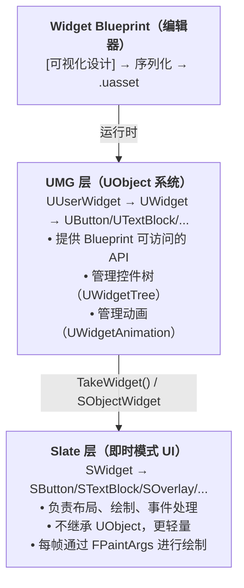
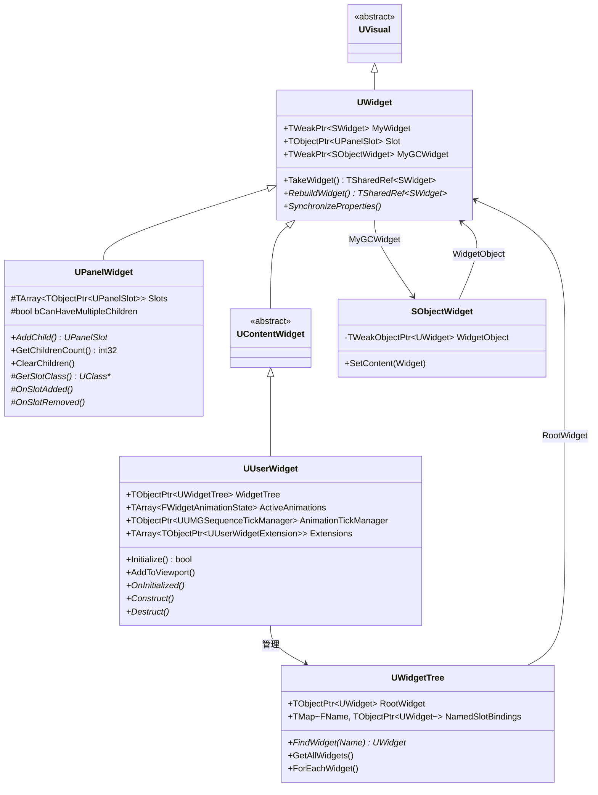

# UMG基础与核心类架构

> UMG 是 Unreal Engine 的**可视化 UI 创作框架**，其核心是一套 UObject 封装层，在运行时将 Widget Blueprint 的设计转换为 Slate 即时模式 UI 控件。

## 概述

本课将带你深入 UMG 的核心类架构，学完你能：

1. 理解 UMG 在 UE UI 系统中的位置（UMG ↔ Slate 关系）
2. 掌握四个核心类的职责：**UWidget**、**UPanelWidget**、**UUserWidget**、**UWidgetTree**
3. 理解关键成员变量（`MyWidget`、`WidgetTree`、`ActiveAnimations` 等）的作用
4. 理解关键函数（`TakeWidget()`、`RebuildWidget()`、`SynchronizeProperties()`）的调用时机
5. 识别 Lyra 项目中哪些类继承自这些基类

---

## 核心概念

### UMG 在 UI 系统中的位置



### UMG vs Slate 分工

| 层级 | 类名前缀 | 职责 | 使用场景 |
|------|---------|------|----------|
| **UMG 层** | `U` | 编辑器可序列化、Blueprint 可访问、管理生命周期 | 游戏 UI、HUD、菜单 |
| **Slate 层** | `S` | 实际渲染、布局计算、事件处理 | 编辑器 UI、高性能需求 |

**关键理解**：每个 `UWidget` 都通过一个 `TWeakPtr<SWidget> MyWidget` 持有对应的 Slate 控件，两者的绑定发生在 `TakeWidget()` → `RebuildWidget()` 调用链中。

---

## 源码深度分析

### 一、UWidget 类分析

**源文件**：`Engine/Source/Runtime/UMG/Public/Components/Widget.h`（约 1246 行）

`UWidget` 是所有 UMG 控件的**抽象基类**，继承自 `UVisual` 和 `INotifyFieldValueChanged`。

#### 关键成员变量

```cpp
// Widget.h 第 216-217 行
class UWidget : public UVisual, public INotifyFieldValueChanged
{
    GENERATED_UCLASS_BODY()
```

**Slot（第 263-264 行）**：
```cpp
// Widget.h 第 263-264 行
UPROPERTY(Instanced, TextExportTransient, EditAnywhere, BlueprintReadOnly, Category=Layout, meta=(ShowOnlyInnerProperties))
TObjectPtr<UPanelSlot> Slot;
```
- 每个 `UWidget` 都有一个 `Slot` 指针
- `Slot` 存储了该控件在**父容器**中的布局参数
- 例如：`UCanvasPanelSlot` 存储 `Anchors`、`Offsets`、`Alignment`

**MyWidget（第 1186-1187 行）**：
```cpp
// Widget.h 第 1186-1187 行
protected:
    /** The underlying SWidget. */
    TWeakPtr<SWidget> MyWidget;
```
- 持有底层 Slate 控件的弱引用
- 使用 `TWeakPtr` 避免循环引用（Slate 控件不继承 UObject）

**MyGCWidget（第 1192-1193 行）**：
```cpp
// Widget.h 第 1192-1193 行
    /** The underlying SWidget contained in a SObjectWidget */
    TWeakPtr<SObjectWidget> MyGCWidget;
```
- 持有 `SObjectWidget` 的引用（`SObjectWidget` 是连接 UWidget 和 SWidget 的桥梁）

**NativeBindings（第 1202-1203 行）**：
```cpp
// Widget.h 第 1202-1203 行
protected:
    /** Native property bindings. */
    UPROPERTY(Transient)
    TArray<TObjectPtr<UPropertyBinding>> NativeBindings;
```
- 存储属性绑定（Property Binding）的数组
- 允许在 Blueprint 中将属性动态绑定到函数

#### 关键函数

**TakeWidget()（第 815 行）**：
```cpp
// Widget.h 第 815 行
UMG_API TSharedRef<SWidget> TakeWidget();
```
- **最重要**的函数之一
- 获取底层的 Slate 控件，如果不存在则调用 `RebuildWidget()` 创建
- 在 `SObjectWidget` 的构造函数中被调用

**RebuildWidget()（第 1140 行）**：
```cpp
// Widget.h 第 1140 行
protected:
    /** Function implemented by all subclasses of UWidget is called when the underlying SWidget needs to be constructed. */
    UMG_API virtual TSharedRef<SWidget> RebuildWidget();
```
- 虚函数，每个子类必须实现
- `UButton::RebuildWidget()` 创建 `SButton`
- `UTextBlock::RebuildWidget()` 创建 `STextBlock`

**SynchronizeProperties()（第 930 行）**：
```cpp
// Widget.h 第 930 行
UMG_API virtual void SynchronizeProperties();
```
- 将 UObject 侧的属性同步到 Slate 控件
- 例如：将 `UButton` 的 `WidgetStyle` 同步到 `SButton`
- 在控件重建后自动调用

**GetCachedWidget()（第 849 行）**：
```cpp
// Widget.h 第 849 行
UMG_API TSharedPtr<SWidget> GetCachedWidget() const;
```
- 获取已创建的 Slate 控件（不触发重建）

#### 重要枚举和委托

**设计标志（第 174-184 行）**：
```cpp
// Widget.h 第 174-184 行
UENUM()
enum class EWidgetDesignFlags : uint8
{
    None                = 0,
    Designing           = 1 << 0,
    ShowOutline         = 1 << 1,
    ExecutePreConstruct  = 1 << 2,
    Previewing         = 1 << 3
};
```

**常用绑定委托（第 236-246 行）**：
```cpp
// Widget.h 第 236-246 行
DECLARE_DYNAMIC_DELEGATE_RetVal(bool, FGetBool);
DECLARE_DYNAMIC_DELEGATE_RetVal(float, FGetFloat);
DECLARE_DYNAMIC_DELEGATE_RetVal(FText, FGetText);
DECLARE_DYNAMIC_DELEGATE_RetVal(FSlateColor, FGetSlateColor);
// ...
```

---

### 二、UPanelWidget 类分析

**源文件**：`Engine/Source/Runtime/UMG/Public/Components/PanelWidget.h`（约 192 行）

`UPanelWidget` 是所有**容器控件**的基类（如 `UCanvasPanel`、`UOverlay`、`UVerticalBox` 等）。

#### 类定义（第 13-16 行）

```cpp
// PanelWidget.h 第 13-16 行
class UPanelWidget : public UWidget
{
    GENERATED_UCLASS_BODY()
```

#### 关键成员变量

**Slots（第 21-22 行）**：
```cpp
// PanelWidget.h 第 21-22 行
protected:
    /** The slots in the widget holding the child widgets of this panel. */
    UPROPERTY(Instanced)
    TArray<TObjectPtr<UPanelSlot>> Slots;
```
- 存储所有子控件的 Slot
- 每个 Slot 对应一个子控件，存储其布局参数

**bCanHaveMultipleChildren（第 190 行）**：
```cpp
// PanelWidget.h 第 190 行
protected:
    /** Can this panel allow for multiple children? */
    bool bCanHaveMultipleChildren;
```
- 标记该容器是否允许多个子控件
- `UOverlay`、`UCanvasPanel` 等为 `true`
- 某些自定义单子容器可能为 `false`

#### 关键函数

**AddChild()（第 59 行）**：
```cpp
// PanelWidget.h 第 58-59 行
UFUNCTION(BlueprintCallable, Category="Widget|Panel")
UMG_API UPanelSlot* AddChild(UWidget* Content);
```
- 添加子控件，返回基础的 `UPanelSlot*`
- 需要转型为具体类型（如 `UCanvasPanelSlot*`）来设置布局

**GetChildrenCount()（第 28 行）**：
```cpp
// PanelWidget.h 第 28 行
UFUNCTION(BlueprintCallable, Category="Widget|Panel")
UMG_API int32 GetChildrenCount() const;
```

**ClearChildren()（第 122 行）**：
```cpp
// PanelWidget.h 第 121-122 行
UFUNCTION(BlueprintCallable, Category="Widget|Panel")
UMG_API virtual void ClearChildren();
```

#### 虚函数（子类可重写）

**GetSlotClass()（第 167-170 行）**：
```cpp
// PanelWidget.h 第 167-170 行
virtual UClass* GetSlotClass() const
{
    return UPanelSlot::StaticClass();
}
```
- 返回该容器使用的 Slot 类
- `UCanvasPanel` 返回 `UCanvasPanelSlot::StaticClass()`

**OnSlotAdded() / OnSlotRemoved()（第 178-186 行）**：
```cpp
// PanelWidget.h 第 178-186 行
virtual void OnSlotAdded(UPanelSlot* InSlot)
{
}

virtual void OnSlotRemoved(UPanelSlot* InSlot)
{
}
```
- 子类可重写以响应 Slot 添加/移除事件

---

### 三、UUserWidget 类分析

**源文件**：`Engine/Source/Runtime/UMG/Public/Blueprint/UserWidget.h`（约 1832 行）

`UUserWidget` 是**可通过 Widget Blueprint 扩展**的控件，是开发者最常打交道的类。

#### 类定义（第 282-285 行）

```cpp
// UserWidget.h 第 282-285 行
class UUserWidget : public UWidget, public INamedSlotInterface
{
    GENERATED_BODY()
```

- 继承自 `UWidget`
- 实现 `INamedSlotInterface`（支持 NamedSlot）

#### 关键成员变量

**WidgetTree（第 1515-1516 行）**：
```cpp
// UserWidget.h 第 1515-1516 行
public:
    /** The widget tree contained inside this user widget initialized by the blueprint */
    UPROPERTY(Transient, DuplicateTransient, TextExportTransient)
    TObjectPtr<UWidgetTree> WidgetTree;
```
- 存储该 UserWidget 的**控件树**
- 每个 UserWidget 都有独立的 WidgetTree
- 通过 `WidgetTree->RootWidget` 可访问根控件

**NamedSlotBindings（第 1506-1507 行）**：
```cpp
// UserWidget.h 第 1506-1507 行
private:
    /** Stores the widgets being assigned to named slots */
    UPROPERTY()
    TArray<FNamedSlotBinding> NamedSlotBindings;
```
- 存储 NamedSlot 的内容绑定
- 允许在父 Widget 中"注入"子 Widget

**AnimationTickManager（第 1488-1489 行）**：
```cpp
// UserWidget.h 第 1488-1489 行
    /** Global tick manager for running widget animations */
    UPROPERTY(Transient)
    TObjectPtr<UUMGSequenceTickManager> AnimationTickManager;
```
- 管理该 Widget 的所有动画播放
- UE 5.6+ 使用 `FWidgetAnimationState` 替代旧的 `UUMGSequencePlayer`

**ActiveAnimations（第 1498 行）**：
```cpp
// UserWidget.h 第 1498 行
private:
    /** All the sequences currently playing */
    TArray<TSharedRef<FWidgetAnimationState>> ActiveAnimations;
```

**Extensions（第 1510-1511 行）**：
```cpp
// UserWidget.h 第 1510-1511 行
    /** The UserWidget extensions */
    UPROPERTY()
    TArray<TObjectPtr<UUserWidgetExtension>> Extensions;
```
- 存储 Widget 扩展（UE 5 新特性）
- CommonUI 的 `UCommonActivatableWidget` 使用扩展机制

#### 关键函数

**Initialize()（第 300 行）**：
```cpp
// UserWidget.h 第 300 行
UMG_API virtual bool Initialize();
```
- 初始化 Widget，调用 Blueprint 的 `OnInitialized` 事件
- 只调用一次

**AddToViewport()（第 345 行）**：
```cpp
// UserWidget.h 第 344-345 行
UFUNCTION(BlueprintCallable, BlueprintCosmetic, Category="User Interface|Viewport", meta=( AdvancedDisplay = "ZOrder" ))
UMG_API void AddToViewport(int32 ZOrder = 0);
```
- 将 Widget 添加到视口
- `ZOrder` 越高，显示越靠前

**生命周期函数（第 510-541 行）**：
```cpp
// UserWidget.h 第 510-541 行
UFUNCTION(BlueprintImplementableEvent, BlueprintCosmetic, Category="User Interface")
UMG_API void OnInitialized();  // 初始化（一次）

UFUNCTION(BlueprintImplementableEvent, BlueprintCosmetic, Category="User Interface")
UMG_API void PreConstruct(bool IsDesignTime);  // 预构造（编辑器/运行时）

UFUNCTION(BlueprintImplementableEvent, BlueprintCosmetic, Category="User Interface", meta=( Keywords="Begin Play" ))
UMG_API void Construct();  // 构造（每次添加到视口）

UFUNCTION(BlueprintImplementableEvent, BlueprintCosmetic, Category="User Interface", meta=( Keywords="End Play, Destroy" ))
UMG_API void Destruct();  // 析构（每次从视口移除）
```

**RebuildWidget()（第 1568 行）**：
```cpp
// UserWidget.h 第 1568 行
UMG_API virtual TSharedRef<SWidget> RebuildWidget() override;
```
- 重写自 `UWidget::RebuildWidget()`
- 创建 `SObjectWidget`，并将 `WidgetTree->RootWidget` 的内容作为其内容

#### Blueprint 可调用事件

`UUserWidget` 提供了大量可重写的 Blueprint 事件（第 549-802 行）：
- `Tick(FGeometry, float)` - 每帧更新
- `OnPaint()` - 自定义绘制
- 输入事件：`OnKeyDown`、`OnMouseButtonDown`、`OnDragDetected` 等
- 焦点事件：`OnFocusReceived`、`OnFocusLost` 等

---

### 四、UWidgetTree 类分析

**源文件**：`Engine/Source/Runtime/UMG/Public/Blueprint/WidgetTree.h`（约 159 行）

`UWidgetTree` 是**控件树的管理器**，存储了 UserWidget 中的所有控件。

#### 类定义（第 19-21 行）

```cpp
// WidgetTree.h 第 19-21 行
class UWidgetTree : public UObject, public INamedSlotInterface
{
    GENERATED_UCLASS_BODY()
```

#### 关键成员变量

**RootWidget（第 141-142 行）**：
```cpp
// WidgetTree.h 第 141-142 行
public:
    /** The root widget of the tree */
    UPROPERTY(Instanced)
    TObjectPtr<UWidget> RootWidget;
```
- 控件树的**根控件**
- 通常是一个 Panel Widget（如 `UCanvasPanel`）

**NamedSlotBindings（第 149-150 行）**：
```cpp
// WidgetTree.h 第 149-150 行
    /** Stores the widgets being assigned to named slots */
    UPROPERTY()
    TMap<FName, TObjectPtr<UWidget>> NamedSlotBindings;
```
- Map 结构，存储 NamedSlot 名称到 Widget 的映射

**AllWidgets（第 155-156 行，仅编辑器）**：
```cpp
// WidgetTree.h 第 155-156 行
#if WITH_EDITORONLY_DATA
    UPROPERTY(Instanced)
    TArray< TObjectPtr<UWidget> > AllWidgets;
#endif
```
- 编辑器模式下，存储所有控件的引用
- 用于编辑器中的控件列表显示

#### 关键函数

**FindWidget()（第 30 行）**：
```cpp
// WidgetTree.h 第 30 行
UMG_API UWidget* FindWidget(const FName& Name) const;
```
- 按名称查找控件
- 在 Blueprint 中通过名称访问控件时内部调用此函数

**GetAllWidgets()（第 61 行）**：
```cpp
// WidgetTree.h 第 61 行
UMG_API void GetAllWidgets(TArray<UWidget*>& Widgets) const;
```
- 递归收集所有控件

**ForEachWidget()（第 74 行）**：
```cpp
// WidgetTree.h 第 74 行
UMG_API void ForEachWidget(TFunctionRef<void(UWidget*)> Predicate) const;
```
- 遍历所有控件（不递归进入子 UserWidget 的 WidgetTree）

**ForEachWidgetAndDescendants()（第 80 行）**：
```cpp
// WidgetTree.h 第 80 行
UMG_API void ForEachWidgetAndDescendants(TFunctionRef<void(UWidget*)> Predicate) const;
```
- 遍历所有控件（递归进入子 UserWidget）

**ConstructWidget()（第 101-118 行）**：
```cpp
// WidgetTree.h 第 101-118 行
template <typename WidgetT>
nodiscard inline WidgetT* ConstructWidget(TSubclassOf<WidgetT> WidgetClass = WidgetT::StaticClass(), FName WidgetName = NAME_None)
```
- 在 WidgetTree 中创建新控件
- 在 C++ 中动态创建控件时使用

---

## 类继承树图



---

## Lyra 实践

Lyra 没有直接使用"裸 UMG"，而是基于 **CommonUI 插件**构建 UI 架构。以下是 Lyra 中继承自 UMG 基类的类：

### LyraActivatableWidget

**文件**：`Source/LyraGame/UI/LyraActivatableWidget.h`

```cpp
// LyraActivatableWidget.h 第 22-47 行
class ULyraActivatableWidget : public UCommonActivatableWidget
{
    GENERATED_BODY()

public:
    //~UCommonActivatableWidget interface
    virtual TOptional<FUIInputConfig> GetDesiredInputConfig() const override;
    //~End of UCommonActivatableWidget interface

protected:
    /** The desired input mode to use while this UI is activated */
    UPROPERTY(EditDefaultsOnly, Category = Input)
    ELyraWidgetInputMode InputConfig = ELyraWidgetInputMode::Default;

    /** The desired mouse behavior when the game gets input. */
    UPROPERTY(EditDefaultsOnly, Category = Input)
    EMouseCaptureMode GameMouseCaptureMode = EMouseCaptureMode::CapturePermanently;
};
```

- 继承自 `UCommonActivatableWidget`（CommonUI 插件）
- `UCommonActivatableWidget` 继承自 `UUserWidget`
- 管理输入模式（Game、Menu、GameAndMenu）

### LyraHUDLayout

**推测位置**：`Source/LyraGame/UI/LyraHUDLayout.h`

- 继承自 `UCommonActivatableWidget`
- 作为 HUD 布局容器
- 管理 Escape 菜单和控制器断开界面

### 常用 Lyra Widget 列表

| Lyra 类 | 继承链 | 功能 |
|---------|--------|------|
| `ULyraActivatableWidget` | UCommonActivatableWidget → UUserWidget | 基础可激活 Widget |
| `ULyraButtonBase` | UCommonButtonBase → UButton | 统一按钮样式 |
| `UlyraHUDLayout` | UCommonActivatableWidget → UUserWidget | HUD 布局容器 |
| `UlyraGameMenu` | UCommonActivatableWidget → UUserWidget | 游戏菜单 |

---

## 总结与要点

1. **UWidget 是所有 UMG 控件的基类**，通过 `MyWidget` 持有底层 Slate 控件，`Slot` 存储布局参数。

2. **UPanelWidget 是容器控件的基类**，通过 `Slots` 数组管理子控件，子类需指定 `GetSlotClass()`。

3. **UUserWidget 是可通过 Blueprint 扩展的控件**，拥有 `WidgetTree` 管理控件树，`NamedSlotBindings` 支持内容注入。

4. **UWidgetTree 是控件树管理器**，`RootWidget` 是树根，`FindWidget()` 按名称查找控件。

5. **UMG 与 Slate 的桥梁是 SObjectWidget**，它持有 `UWidget` 的弱引用，使 Slate 能回调 UMG 层。

<!-- nav:auto -->

---

**导航**: ← [[30-tutorials/umg/00-UMG系列概览|00-UMG系列概览]] · [[30-tutorials/umg/02-常用控件详解|02-常用控件详解]] →

<!-- /nav:auto -->
