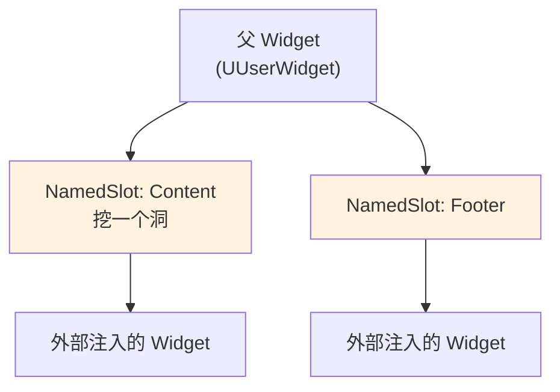
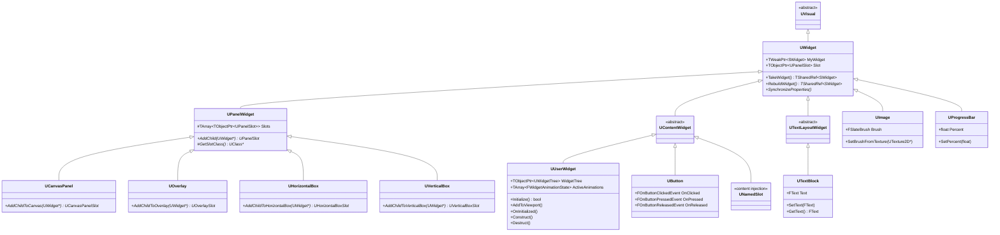
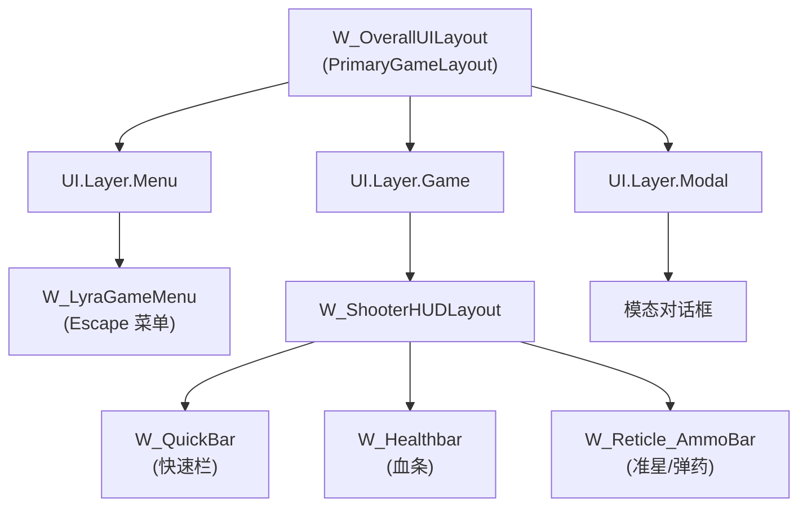

# 常用控件详解

> UMG 提供了丰富的基础控件和容器控件，掌握它们的属性和使用方法是构建游戏 UI 的基础。

## 概述

本课将带你熟悉 UMG 提供的常用控件，学完你能：

1. 理解基础控件（`UButton`、`UTextBlock`、`UImage` 等）的属性和事件
2. 掌握容器控件（`UCanvasPanel`、`UOverlay`、`UHorizontalBox` 等）的布局方式
3. 理解 Slot 系统的作用和自定义方法
4. 了解 Lyra 项目中如何使用这些控件
5. 避免常见的使用陷阱

---

## 基础控件

### UButton - 按钮

**源文件**：`Engine/Source/Runtime/UMG/Public/Components/Button.h`（约 227 行）

按钮是最常用的交互控件，可以包含其他控件作为子项。

#### 类定义（第 31-34 行）

```cpp
// Button.h 第 31-34 行
class UButton : public UContentWidget
{
    GENERATED_UCLASS_BODY()
```

#### 关键属性

**OnClicked 事件（第 75-76 行）**：
```cpp
// Button.h 第 75-76 行
/** Called when the button is clicked */
UPROPERTY(BlueprintAssignable, Category="Button|Event")
FOnButtonClickedEvent OnClicked;
```
- 按钮被点击时触发
- 在 Blueprint 中绑定自定义逻辑

**OnPressed / OnReleased 事件（第 79-84 行）**：
```cpp
// Button.h 第 79-84 行
/** Called when the button is pressed */
UPROPERTY(BlueprintAssignable, Category="Button|Event")
FOnButtonPressedEvent OnPressed;

/** Called when the button is released */
UPROPERTY(BlueprintAssignable, Category="Button|Event")
FOnButtonReleasedEvent OnReleased;
```

**WidgetStyle（第 37-40 行）**：
```cpp
// Button.h 第 37-40 行
UE_DEPRECATED(5.2, "Direct access to WidgetStyle is deprecated. Please use the getter and setter.")
UPROPERTY(EditAnywhere, BlueprintReadWrite, Getter = "GetStyle", Setter = "SetStyle", BlueprintSetter = "SetStyle", Category = "Appearance", meta = (DisplayName = "Style"))
FButtonStyle WidgetStyle;
```
- 控制按钮在不同状态（Normal、Hovered、Pressed、Disabled）的外观
- 使用 `SetStyle()` 和 `GetStyle()` 访问

**IsPressed()（第 138-139 行）**：
```cpp
// Button.h 第 138-139 行
UFUNCTION(BlueprintCallable, Category="Button")
UMG_API bool IsPressed() const;
```
- 返回用户是否正在按压按钮
- **注意**：不要用此检测"点击"，应使用 `OnClicked` 事件

#### 示例代码

```cpp
// 在 C++ 中创建按钮并绑定事件
UButton* MyButton = WidgetTree->ConstructWidget<UButton>();
MyButton->OnClicked.AddDynamic(this, &AMyPlayerController::OnButtonClicked);
```

---

### UTextBlock - 文本

**源文件**：`Engine/Source/Runtime/UMG/Public/Components/TextBlock.h`（约 296 行）

显示静态或动态文本的控件。

#### 类定义（第 22-25 行）

```cpp
// TextBlock.h 第 22-25 行
class UTextBlock : public UTextLayoutWidget
{
    GENERATED_UCLASS_BODY()
```

#### 关键属性

**Text（第 28-31 行）**：
```cpp
// TextBlock.h 第 28-31 行
UE_DEPRECATED(5.1, "Direct access to Text is deprecated. Please use the getter or setter.")
UPROPERTY(EditAnywhere, BlueprintReadWrite, Getter, Setter, BlueprintGetter="GetText", BlueprintSetter="SetText", Category="Content", meta = (MultiLine = "true"))
FText Text;
```
- 显示的文本内容
- 使用 `SetText()` 和 `GetText()` 访问

**ColorAndOpacity（第 37-40 行）**：
```cpp
// TextBlock.h 第 37-40 行
UE_DEPRECATED(5.1, "Direct access to ColorAndOpacity is deprecated. Please use the getter or setter.")
UPROPERTY(EditAnywhere, BlueprintReadWrite, Getter, Setter, BlueprintSetter="SetColorAndOpacity", Category="Appearance")
FSlateColor ColorAndOpacity;
```
- 文本颜色和不透明度

**Font（第 51-54 行）**：
```cpp
// TextBlock.h 第 51-54 行
UE_DEPRECATED(5.1, "Direct access to Font is deprecated. Please use the getter or setter.")
UPROPERTY(EditAnywhere, BlueprintReadWrite, Getter, Setter, BlueprintSetter="SetFont", Category="Appearance")
FSlateFontInfo Font;
```
- 字体设置

**ShadowOffset / ShadowColorAndOpacity（第 61-69 行）**：
```cpp
// TextBlock.h 第 61-69 行
UE_DEPRECATED(5.1, "Direct access to ShadowOffset is deprecated. Please use the getter or setter.")
UPROPERTY(EditAnywhere, BlueprintReadWrite, Getter, Setter, BlueprintSetter="SetShadowOffset", Category="Appearance")
FVector2D ShadowOffset;

UE_DEPRECATED(5.1, "Direct access to ShadowColorAndOpacity is deprecated. Please use the getter or setter.")
UPROPERTY(EditAnywhere, BlueprintReadWrite, Getter, Setter, BlueprintSetter="SetShadowColorAndOpacity", Category="Appearance", meta=( DisplayName="Shadow Color" ))
FLinearColor ShadowColorAndOpacity;
```
- 文本阴影设置

#### 重要方法

```cpp
// TextBlock.h 第 94-103 行
UFUNCTION(BlueprintCallable, Category="Widget", meta=(DisplayName="GetText (Text)"))
UMG_API FText GetText() const;

UFUNCTION(BlueprintCallable, Category="Widget", meta=(DisplayName="SetText (Text)"))
UMG_API virtual void SetText(FText InText);
```

---

### UImage - 图片

**源文件**：`Engine/Source/Runtime/UMG/Public/Components/Image.h`（约 207 行）

显示图片、纹理或材质的控件。

#### 类定义（第 29-32 行）

```cpp
// Image.h 第 29-32 行
class UImage : public UWidget
{
    GENERATED_UCLASS_BODY()
```

#### 关键属性

**Brush（第 36-39 行）**：
```cpp
// Image.h 第 36-39 行
UE_DEPRECATED(5.2, "Direct access to Brush is deprecated. Please use the getter or setter.")
UPROPERTY(EditAnywhere, BlueprintReadWrite, Getter, Setter, BlueprintSetter = "SetBrush", FieldNotify, Category=Appearance)
FSlateBrush Brush;
```
- 图片画笔，可设置为纹理、材质或 Slate Brush Asset

#### 重要方法

```cpp
// Image.h 第 93-139 行
UFUNCTION(BlueprintCallable, Category="Appearance")
UMG_API virtual void SetBrush(const FSlateBrush& InBrush);

UFUNCTION(BlueprintCallable, Category="Appearance")
UMG_API virtual void SetBrushFromTexture(UTexture2D* Texture, bool bMatchSize = false);

UFUNCTION(BlueprintCallable, Category="Appearance")
UMG_API virtual void SetBrushFromMaterial(UMaterialInterface* Material);

UFUNCTION(BlueprintCallable, Category="Appearance")
UMG_API UMaterialInstanceDynamic* GetDynamicMaterial();
```

#### 使用示例

```cpp
// 从纹理设置图片
UImage* MyImage = WidgetTree->ConstructWidget<UImage>();
MyImage->SetBrushFromTexture(LoadObject<UTexture2D>(nullptr, TEXT("/Game/Textures/MyTexture")));

// 从材质设置图片
MyImage->SetBrushFromMaterial(MyMaterial);

// 动态修改材质参数
UMaterialInstanceDynamic* DynMat = MyImage->GetDynamicMaterial();
DynMat->SetScalarParameterValue(FName("Opacity"), 0.5f);
```

---

### UProgressBar - 进度条

**源文件**：`Engine/Source/Runtime/UMG/Public/Components/ProgressBar.h`（约 143 行）

显示进度或填充比例的控件。

#### 类定义（第 20-23 行）

```cpp
// ProgressBar.h 第 20-23 行
class UProgressBar : public UWidget
{
    GENERATED_UCLASS_BODY()
```

#### 关键属性

**Percent（第 31-34 行）**：
```cpp
// ProgressBar.h 第 31-34 行
UE_DEPRECATED(5.1, "Direct access to Percent is deprecated. Please use the getter or setter.")
UPROPERTY(EditAnywhere, BlueprintReadWrite, FieldNotify, Getter, Setter, BlueprintSetter="SetPercent", Category="Progress", meta = (UIMin = "0", UIMax = "1"))
float Percent;
```
- 进度值，范围 0.0 ~ 1.0

**BarFillType（第 36-39 行）**：
```cpp
// ProgressBar.h 第 36-39 行
UE_DEPRECATED(5.1, "Direct access to BarFillType is deprecated. Please use the getter or setter.")
UPROPERTY(EditAnywhere, BlueprintReadWrite, Getter, Setter, Category="Progress")
TEnumAsByte<EProgressBarFillType::Type> BarFillType;
```
- 填充方向：从左到右、从右到左、从下到上、从上到下

**bIsMarquee（第 46-49 行）**：
```cpp
// ProgressBar.h 第 46-49 行
UE_DEPRECATED(5.1, "Direct access to bIsMarquee is deprecated. Please use the getter or setter.")
UPROPERTY(EditAnywhere, BlueprintReadWrite, FieldNotify, Getter="UseMarquee", Setter="SetIsMarquee", BlueprintSetter="SetIsMarquee", Category="Progress")
bool bIsMarquee;
```
- 是否使用跑马灯模式（不确定进度时使用）

#### 重要方法

```cpp
// ProgressBar.h 第 78-101 行
UMG_API float GetPercent() const;

UFUNCTION(BlueprintCallable, Category="Progress")
UMG_API void SetPercent(float InPercent);

UFUNCTION(BlueprintCallable, Category="Progress")
UMG_API void SetIsMarquee(bool InbIsMarquee);
```

---

### UCheckBox - 复选框

**源文件**：`Engine/Source/Runtime/UMG/Public/Components/CheckBox.h`（未读取，此处提供常用接口）

复选框允许用户在选中和未选中状态之间切换。

#### 关键属性

- `CheckedState`：当前状态（Unchecked、Checked、Undetermined）
- `IsChecked`：是否选中

#### 关键事件

- `OnCheckStateChanged`：状态改变时触发

---

### USlider - 滑块

**源文件**：`Engine/Source/Runtime/UMG/Public/Components/Slider.h`（未读取，此处提供常用接口）

滑块允许用户在最小值和最大值之间选择。

#### 关键属性

- `Value`：当前值
- `MinValue` / `MaxValue`：最小值/最大值
- `StepSize`：步长

#### 关键事件

- `OnValueChanged`：值改变时触发

---

### UNamedSlot - 命名槽（重要！）

**源文件**：`Engine/Source/Runtime/UMG/Public/Components/NamedSlot.h`（约 69 行）

NamedSlot 允许在父 Widget 中"挖洞"，让外部注入子 Widget。**Lyra 大量使用此控件**。

#### 类定义（第 17-21 行）

```cpp
// NamedSlot.h 第 17-21 行
class UNamedSlot : public UContentWidget
{
    GENERATED_UCLASS_BODY()
```

#### 核心概念



#### 在 Lyra 中的使用

Lyra 的 `UCommonActivatableWidget` 使用 NamedSlot 实现灵活的 UI 组合：

```cpp
// 在父 Widget 的 Widget Blueprint 中：
// 1. 添加一个 NamedSlot 控件，命名为 "ContentSlot"
// 2. 在子类或实例化时，可以设置该 NamedSlot 的内容

// 在 C++ 中设置 NamedSlot 内容：
UUserWidget* MyWidget = CreateWidget<UUserWidget>(this, MyWidgetClass);
MyWidget->SetContentForSlot(FName("ContentSlot"), NewContentWidget);
```

#### bExposeOnInstanceOnly（第 46-48 行）

```cpp
// NamedSlot.h 第 46-48 行
#if WITH_EDITORONLY_DATA
UPROPERTY(EditAnywhere, Category="Exposing")
bool bExposeOnInstanceOnly = false;
#endif
```
- 如果为 `true`，此 NamedSlot 仅在实例化时可见，子类不能覆盖

---

## 容器控件

### UCanvasPanel - 画布面板（最常用）

**源文件**：`Engine/Source/Runtime/UMG/Public/Components/CanvasPanel.h`（约 76 行）

CanvasPanel 是最灵活的容器，允许子控件在任意位置布局（绝对定位）。

#### 类定义（第 24-27 行）

```cpp
// CanvasPanel.h 第 24-27 行
class UCanvasPanel : public UPanelWidget
{
    GENERATED_UCLASS_BODY()
```

#### 特点

- **绝对定位**：每个子控件通过 `UCanvasPanelSlot` 设置位置和大小
- **锚点系统**：支持 Anchors，实现自适应布局
- **Z-order**：子控件按添加顺序绘制，后添加的在上层

#### 添加子控件

```cpp
// CanvasPanel.h 第 32-33 行
UFUNCTION(BlueprintCallable, Category="Canvas Panel")
UMG_API UCanvasPanelSlot* AddChildToCanvas(UWidget* Content);
```
- 返回 `UCanvasPanelSlot*`，可设置布局参数

---

### UOverlay - 叠加面板

**源文件**：`Engine/Source/Runtime/UMG/Public/Components/Overlay.h`（约 53 行）

Overlay 将子控件层叠绘制，后添加的在上层。

#### 类定义（第 17-20 行）

```cpp
// Overlay.h 第 17-20 行
class UOverlay : public UPanelWidget
{
    GENERATED_UCLASS_BODY()
```

#### 特点

- **层叠布局**：所有子控件都占据整个可用空间
- **Z-order**：按添加顺序层叠
- 常用于：背景层、内容层、HUD 层叠加

#### 添加子控件

```cpp
// Overlay.h 第 25-26 行
UFUNCTION(BlueprintCallable, Category="Widget")
UMG_API UOverlaySlot* AddChildToOverlay(UWidget* Content);
```

---

### UHorizontalBox - 水平盒

**源文件**：`Engine/Source/Runtime/UMG/Public/Components/HorizontalBox.h`（约 54 行）

水平排列子控件。

#### 类定义（第 20-23 行）

```cpp
// HorizontalBox.h 第 20-23 行
class UHorizontalBox : public UPanelWidget
{
    GENERATED_UCLASS_BODY()
```

#### 添加子控件

```cpp
// HorizontalBox.h 第 26-27 行
UFUNCTION(BlueprintCallable, Category="Widget")
UMG_API UHorizontalBoxSlot* AddChildToHorizontalBox(UWidget* Content);
```

---

### UVerticalBox - 垂直盒

**源文件**：`Engine/Source/Runtime/UMG/Public/Components/VerticalBox.h`（未读取）

垂直排列子控件，接口与 `UHorizontalBox` 类似。

---

### UWrapBox - 自动换行盒

**源文件**：`Engine/Source/Runtime/UMG/Public/Components/WrapBox.h`（未读取）

当子控件超出宽度时自动换行，类似 CSS 的 `flex-wrap: wrap`。

---

### UGridPanel - 网格面板

**源文件**：`Engine/Source/Runtime/UMG/Public/Components/GridPanel.h`（未读取）

将子控件排列为网格，可指定列数和行数。

---

## Slot 系统详解

### 什么是 Slot？

Slot 是**子控件在父容器中的布局参数载体**。每个容器控件都有对应的 Slot 类：

| 容器控件 | Slot 类 | 主要布局参数 |
|----------|--------|--------------|
| `UCanvasPanel` | `UCanvasPanelSlot` | `Anchors`、`Offsets`、`Alignment`、`Size` |
| `UOverlay` | `UOverlaySlot` | `Padding`、`HorizontalAlignment`、`VerticalAlignment` |
| `UHorizontalBox` | `UHorizontalBoxSlot` | `Size`、`HorizontalAlignment`、`Padding` |
| `UVerticalBox` | `UVerticalBoxSlot` | `Size`、`VerticalAlignment`、`Padding` |

### UCanvasPanelSlot 详解

`UCanvasPanelSlot` 是最复杂的 Slot，提供了完整的锚点布局系统。

#### 关键属性

**Anchors（锚点）**：
```cpp
// 锚点定义在 FAnchors 结构中
FAnchors Anchors;  // 取值范围 0.0 ~ 1.0
```
- `Min`：左/下锚点（如 (0, 0) 表示左上角）
- `Max`：右/上锚点（如 (1, 1) 表示右下角）
- 常用组合：
  - `(0,0)-(0,0)`：锚定到左上角
  - `(1,1)-(1,1)`：锚定到右下角
  - `(0,0)-(1,1)`：拉伸填充

**Offsets（偏移）**：
```cpp
FMargin Offsets;  // Left, Top, Right, Bottom
```
- 当锚点重合时（如 `(0,0)-(0,0)`），Offset 表示距离锚点的像素偏移
- 当锚点分离时（如 `(0,0)-(1,1)`），Offset 表示边缘距离

**Alignment（对齐）**：
```cpp
FVector2D Alignment;  // (0,0) = 左上, (0.5,0.5) = 中心, (1,1) = 右下
```
- 控制控件在可用空间内的对齐方式

### 在 C++ 中操作 Slot

```cpp
// 创建一个 Canvas Panel
UCanvasPanel* Canvas = WidgetTree->ConstructWidget<UCanvasPanel>();

// 添加一个按钮到 Canvas
UButton* Button = WidgetTree->ConstructWidget<UButton>();
UCanvasPanelSlot* Slot = Canvas->AddChildToCanvas(Button);

// 设置 Slot 参数
Slot->SetAnchors(FAnchors(0.5f, 0.5f, 0.5f, 0.5f));  // 中心锚点
Slot->SetOffsets(FMargin(-50, -25, 50, 25));           // 100x50 大小，中心对齐
Slot->SetAlignment(FVector2D(0.5f, 0.5f));          // 居中对齐
```

---

## 控件继承关系图



---

## Lyra 实践

### Lyra 使用的常用控件

通过搜索 `Content/UI/` 目录，Lyra 使用了以下 UMG 控件：

| 控件类型 | Lyra 使用示例 |
|----------|----------------|
| `UCanvasPanel` | 大多数 Widget Blueprint 的根容器 |
| `UOverlay` | `W_OverallUILayout`、`W_ShooterHUDLayout` |
| `UButton` / `UCommonButtonBase` | `W_LyraButton`、`W_LyraButtonTab` |
| `UTextBlock` | 所有显示文本的控件 |
| `UImage` | 图标、背景等 |
| `UProgressBar` | `W_Healthbar` 的血条 |
| `UNamedSlot` | `UCommonActivatableWidget` 的内容注入 |

### Lyra 的 Button 样式

Lyra 在 `Content/UI/Foundation/Buttons/` 下定义了统一的按钮样式：

- `ButtonStyle-Primary-M`：主要按钮样式
- `ButtonStyle-Clear`：透明按钮样式
- `W_LyraButton`：Lyra 按钮 Widget Blueprint
- `W_LyraButtonTab`：Tab 按钮 Widget Blueprint

### Lyra 的 HUD 布局



---

## 常见问题与陷阱

### 1. 不要每帧调用 `AddToViewport()`

**错误做法**：
```cpp
// Tick 中每帧调用
void UMyWidget::NativeTick(const FGeometry& MyGeometry, float InDeltaTime)
{
    if (!IsInViewport())
    {
        AddToViewport();  // 错误！每帧调用会造成性能问题
    }
}
```

**正确做法**：在 `Initialize()` 或 `Construct()` 中调用一次即可。

---

### 2. 理解 `IsDesignTime()` 判断

在 C++ 代码中，需要区分编辑器和运行时：

```cpp
void UMyWidget::SynchronizeProperties()
{
    Super::SynchronizeProperties();
    
    if (!IsDesignTime())
    {
        // 仅运行时执行的逻辑
    }
}
```

---

### 3. `RemoveFromParent()` vs `RemoveFromViewport()`

- `RemoveFromParent()`（推荐）：从父控件中移除，如果添加到 Viewport 也会从 Viewport 移除
- `RemoveFromViewport()`（已废弃）：仅从 Viewport 移除

---

### 4. 动态创建控件使用 `CreateWidget()`

**错误做法**：
```cpp
UMyUserWidget* Widget = NewObject<UMyUserWidget>();  // 错误！不会创建 Slate 控件
```

**正确做法**：
```cpp
UMyUserWidget* Widget = CreateWidget<UMyUserWidget>(this, UMyUserWidget::StaticClass());
```

---

### 5. 注意 `bIsVariable` 标记

只有标记为 `bIsVariable = true` 的控件才能在 Blueprint 中作为变量访问。

在 Widget Blueprint 编辑器中，右键点击控件 → "Create Variable"。

---

## 总结与要点

1. **基础控件**（`UButton`、`UTextBlock`、`UImage`、`UProgressBar`）是最常用的 UI 元素，理解其属性和事件是基础。

2. **容器控件**（`UCanvasPanel`、`UOverlay`、`UHorizontalBox` 等）决定子控件的布局方式，选择合适的容器可以简化布局工作。

3. **Slot 系统**是布局的核心，每个容器都有对应的 Slot 类存储布局参数。

4. **UNamedSlot** 是 Lyra 大量使用的控件，它允许在父 Widget 中"挖洞"，实现灵活的 UI 组合。

5. **常见陷阱**包括：不要每帧调用 `AddToViewport()`、使用 `CreateWidget()` 动态创建控件、注意 `bIsVariable` 标记等。

<!-- nav:auto -->

---

**导航**: ← [[30-tutorials/umg/01-UMG基础与核心类架构|01-UMG基础与核心类架构]] · [[30-tutorials/umg/03-UMG与Slate绑定机制深度分析|03-UMG与Slate绑定机制深度分析]] →

<!-- /nav:auto -->
