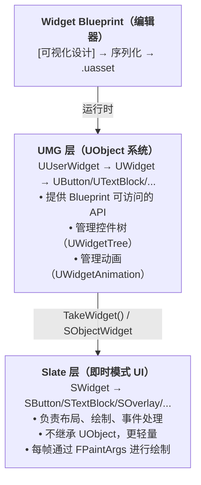
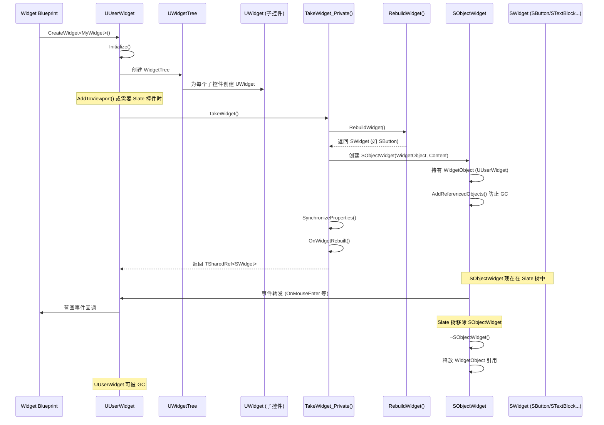
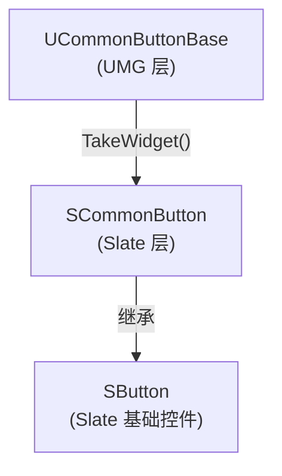

# UMG与Slate绑定机制深度分析

> **难度**：中级 | **预计时间**：45 分钟
>
> **前置知识**：UMG 基础与核心类架构（01）、常用控件详解（02）

---

## 概述

UMG 是 Unreal Engine 的**可视化 UI 创作系统**，而 Slate 是底层的**即时模式 UI 框架**。理解它们之间的绑定机制，是深入掌握 UE UI 系统的关键。

### UMG 与 Slate 的关系



**为什么要分层？**

| 层级 | 职责 | 为什么不合并 |
|------|------|--------------|
| **UMG (UWidget)** | 可视化编辑、蓝图交互、UObject 系统集成 | 需要序列化、GC、反射等 UObject 特性 |
| **Slate (SWidget)** | 高性能渲染、事件处理、布局计算 | 需要极高的渲染性能，不能承受 UObject 开销 |

---

## 核心概念

### Slate 是什么？

**Slate** 是 UE 的**即时模式（Immediate Mode）UI 框架**：

- **不继承 UObject**：Slate 控件（`SWidget` 及其派生类）是纯 C++ 对象，不受 UObject 系统管理
- **轻量高效**：没有 GC 开销，直接通过智能指针管理生命周期
- **即时模式**：每帧重新计算布局和绘制，而不是保留模式（Retained Mode）那样缓存绘制指令

```cpp
// Slate 控件示例
TSharedRef<SButton> Button = SNew(SButton)
    .OnClicked(this, &MyClass::OnButtonClicked)
    .Content()
    [
        SNew(STextBlock)
            .Text(FText::FromString("Click Me"))
    ];
```

### 为什么 UMG 不直接渲染？

UMG 的存在是为了解决 Slate 的两个痛点：

1. **可视化编辑**：Slate 只能用 C++ 写，无法提供可视化编辑器
2. **蓝图集成**：游戏设计师需要能在 Blueprint 中拖拽、设置属性的工具

UMG 通过 `UWidget` 包装 `SWidget`，在**易用性**和**性能**之间取得平衡。

### 绑定关系的建立时机

**关键结论**：UMG 与 Slate 的绑定发生在 `TakeWidget()` 被调用时。

- 不是在 `UUserWidget` 构造时
- 不是在设计时
- 而是在**首次需要 Slate 控件**时（如 `AddToViewport()`、`GetCachedWidget()` 等）

---

## 源码深度分析

### 1. UWidget::TakeWidget() 分析

`TakeWidget()` 是 UMG-Slate 绑定的**核心入口**。让我们逐行分析其实现。

**源码位置**：`Engine/Source/Runtime/UMG/Private/Components/Widget.cpp` L976-L1114

```cpp
// [1] TakeWidget() 公共接口
TSharedRef<SWidget> UWidget::TakeWidget()
{
    LLM_SCOPE_BYTAG(UI_UMG);

#if WITH_EDITORONLY_DATA
    // [2] 编辑器模式下添加反射元数据
    UObject* SourceAsset = GetSourceAssetOrClass();
    UClass* WidgetClass = GetClass();
    if(SourceAsset && WidgetClass)
    {
        LLM_SCOPE_DYNAMIC_STAT_OBJECTPATH(SourceAsset->GetPackage(), ELLMTagSet::Assets);
        LLM_SCOPE_DYNAMIC_STAT_OBJECTPATH(WidgetClass, ELLMTagSet::AssetClasses);
        UE_TRACE_METADATA_SCOPE_ASSET(SourceAsset, WidgetClass);

        return TakeWidget_Private([](UUserWidget* Widget, TSharedRef<SWidget> Content) -> TSharedPtr<SObjectWidget> {
            return SNew(SObjectWidget, Widget)[Content];  // [3] 创建 SObjectWidget 包装
        });
    }
#endif
    return TakeWidget_Private([](UUserWidget* Widget, TSharedRef<SWidget> Content) -> TSharedPtr<SObjectWidget> {
        return SNew(SObjectWidget, Widget)[Content];      // [3] 创建 SObjectWidget 包装
    });
}
```

**关键逻辑解读**：

- **[1]** `TakeWidget()` 是对外接口，返回 `TSharedRef<SWidget>`
- **[2]** 编辑器模式下会添加元数据（用于 Widget Reflector 追踪来源）
- **[3]** 核心操作：创建 `SObjectWidget`，将 UMG 控件包装成 Slate 控件

#### TakeWidget_Private() 深度分析

```cpp
// [4] TakeWidget_Private() 实际实现
TSharedRef<SWidget> UWidget::TakeWidget_Private(ConstructMethodType ConstructMethod)
{
    bool bNewlyCreated = false;
    TSharedPtr<SWidget> PublicWidget;

    // [5] 如果底层 Slate 控件不存在，需要构造
    if (!MyWidget.IsValid())
    {
        PublicWidget = RebuildWidget();  // [6] 调用虚函数，由子类实现
        
        // [7] 安全检查：不要返回 SNullWidget
#if !(UE_BUILD_SHIPPING || UE_BUILD_TEST)
        ensureMsgf(PublicWidget.Get() != &SNullWidget::NullWidget.Get(), 
            TEXT("Don't return SNullWidget from RebuildWidget..."));
#endif

        MyWidget = PublicWidget;  // [8] 缓存到 MyWidget（TWeakPtr<SWidget>）
        bNewlyCreated = true;
    }
    else
    {
        PublicWidget = MyWidget.Pin();  // [9] 已存在，直接获取
    }

    // [10] 关键：如果是 UUserWidget，需要包装成 SObjectWidget
    if (IsA(UUserWidget::StaticClass()))
    {
        TSharedPtr<SObjectWidget> SafeGCWidget = MyGCWidget.Pin();

        // [11] 如果 SObjectWidget 仍然有效，说明还在 Slate 树中
        if (SafeGCWidget.IsValid())
        {
            ensure(bNewlyCreated == false);
            PublicWidget = SafeGCWidget;
        }
        else  // [12] 需要重新创建 SObjectWidget 包装
        {
            SafeGCWidget = ConstructMethod(Cast<UUserWidget>(this), PublicWidget.ToSharedRef());
            MyGCWidget = SafeGCWidget;  // [13] 缓存到 MyGCWidget（TWeakPtr<SObjectWidget>）
            PublicWidget = SafeGCWidget;
        }
    }

    // [14] 首次创建时，同步属性并触发 OnWidgetRebuilt
    if (bNewlyCreated)
    {
#if !(UE_BUILD_SHIPPING || UE_BUILD_TEST)
        bRoutedSynchronizeProperties = false;
#endif

#if WITH_EDITOR
        // [15] 编辑器模式下添加反射元数据
        UObject* SourceAsset = GetSourceAssetOrClass();
        UClass* WidgetClass = GetClass();
        PublicWidget->AddMetaData<FReflectionMetaData>(MakeShared<FReflectionMetaData>(GetFName(), WidgetClass, this, SourceAsset));
#endif

        SynchronizeProperties();           // [16] 同步 UMG 属性到 Slate
        VerifySynchronizeProperties();     // [17] 验证子类正确调用了 Super::SynchronizeProperties()
        OnWidgetRebuilt();               // [18] 触发重建回调（UUserWidget 在这里调用 NativePreConstruct/NativeConstruct）
    }

    return PublicWidget.ToSharedRef();
}
```

**核心要点总结**：

| 步骤 | 操作 | 目的 |
|------|------|------|
| [5]-[8] | 检查 `MyWidget`，若不存在则调用 `RebuildWidget()` | 惰性创建 Slate 控件 |
| [10]-[13] | 如果是 `UUserWidget`，包装成 `SObjectWidget` | 防止 UObject 被 GC |
| [14]-[18] | 首次创建时同步属性并触发回调 | 确保 UMG 属性生效 |

---

### 2. SObjectWidget 分析

`SObjectWidget` 是连接 UMG 和 Slate 的**桥梁**。

**源码位置**：`Engine/Source/Runtime/UMG/Public/Slate/SObjectWidget.h`

```cpp
/**
 * SObjectWidget 允许 UMG 将一个 SWidget 插入到 Slate 层级中，
 * 并管理创建它的 UMG UWidget 的生命周期。
 * 一旦 SObjectWidget 被销毁，它释放对 UWidget 的引用，允许其被垃圾回收。
 * 它还将 Slate 事件转发给 UUserWidget，以便转发给监听器。
 */
class SObjectWidget : public SCompoundWidget, public FGCObject
{
    SLATE_DECLARE_WIDGET_API(SObjectWidget, SCompoundWidget, UMG_API)
    SLATE_BEGIN_ARGS(SObjectWidget)
    {
        _Visibility = EVisibility::SelfHitTestInvisible;
    }

    SLATE_DEFAULT_SLOT(FArguments, Content)
    SLATE_END_ARGS()

    UMG_API SObjectWidget();
    UMG_API virtual ~SObjectWidget();

    UMG_API void Construct(const FArguments& InArgs, UUserWidget* InWidgetObject);

    UMG_API void ResetWidget();

    // FGCObject interface - 防止 UWidget 被垃圾回收
    UMG_API virtual FString GetReferencerName() const override;
    UMG_API virtual void AddReferencedObjects(FReferenceCollector& Collector) override;
    // End of FGCObject interface

    UUserWidget* GetWidgetObject() const { return WidgetObject; }  // [19] 反向引用 UWidget

    // ... 大量事件转发函数 ...
    
protected:
    /** 创建此 SObjectWidget 的 UWidget，需要保持存活 */
    TObjectPtr<UUserWidget> WidgetObject;  // [20] 持有 UUserWidget 引用

private:
    inline bool CanRouteEvent() const
    {
        return WidgetObject && WidgetObject->CanSafelyRouteEvent();
    }
};
```

**SObjectWidget 的核心作用**：

1. **生命周期管理**（防止 GC）：
   - 继承 `FGCObject`，通过 `AddReferencedObjects()` 保持 `WidgetObject` 存活
   - 当 `SObjectWidget` 被 Slate 树移除并销毁时，`WidgetObject` 引用计数减少，允许 UWidget 被 GC

2. **事件转发**：
   - 重写所有 `SWidget` 事件处理函数（`OnMouseEnter`、`OnKeyDown` 等）
   - 转发给 `WidgetObject`（即 `UUserWidget`），再由 UUserWidget 转发给蓝图监听器

3. **内容包装**：
   - `SObjectWidget` 是 `SCompoundWidget`，可以包含一个子控件
   - 子控件就是 `UWidget::RebuildWidget()` 返回的 `SWidget`

#### 为什么需要 SObjectWidget？

**问题**：为什么不让 `SWidget` 直接持有 `UWidget*`？

**答案**：

| 方案 | 优点 | 缺点 |
|------|------|------|
| **SWidget 直接持有 UWidget*** | 简单直接 | 破坏 Slate 的纯 C++ 设计；每个 SWidget 都要加 UObject 引用逻辑 |
| **SObjectWidget 包装** | 关注点分离；Slate 层保持纯净；GC 管理集中 | 多了一层间接性 |

**设计决策**：Epic 选择 `SObjectWidget` 方案，因为：

1. **Slate 不应该依赖 UObject**：Slate 是独立的 UI 框架，可用于编辑器（不依赖游戏模块）
2. **GC 安全性**：通过 `FGCObject` 统一管理 UObject 引用
3. **事件路由**：集中处理事件转发逻辑

---

### 3. 属性同步机制

`SynchronizeProperties()` 负责将 UMG 层的属性同步到 Slate 层。

**源码位置**：`Engine/Source/Runtime/UMG/Private/Components/Widget.cpp` L1458-L1555

```cpp
void UWidget::SynchronizeProperties()
{
#if !(UE_BUILD_SHIPPING || UE_BUILD_TEST)
    bRoutedSynchronizeProperties = true;  // [21] 标记已调用，用于验证
#endif

    // [22] 始终同步可访问性数据
    SynchronizeAccessibleData();

    // [23] 获取缓存的 Slate 控件（优先返回 SObjectWidget）
    TSharedPtr<SWidget> SafeWidget = GetCachedWidget();
    if (!SafeWidget.IsValid())
    {
        return;
    }

#if WITH_EDITOR
    TSharedPtr<SWidget> SafeContentWidget = MyGCWidget.IsValid() ? MyGCWidget.Pin() : MyWidget.Pin();
#endif

    // [24] 同步核心属性到 Slate
    SafeWidget->SetEnabled(BITFIELD_PROPERTY_BINDING(bIsEnabled));
    SafeWidget->SetVisibility(OPTIONAL_BINDING_CONVERT(ESlateVisibility, Visibility, EVisibility, ConvertVisibility));
    
    SafeWidget->SetClipping(Clipping);
    SafeWidget->SetPixelSnapping(PixelSnapping);
    SafeWidget->SetFlowDirectionPreference(FlowDirectionPreference);
    SafeWidget->ForceVolatile(bIsVolatile);
    SafeWidget->SetRenderOpacity(RenderOpacity);
    
    // [25] 同步 ToolTip
    if (ToolTipWidgetDelegate.IsBound() && !IsDesignTime())
    {
        TSharedRef<FDelegateToolTip> ToolTip = MakeShareable(new FDelegateToolTip());
        ToolTip->ToolTipWidgetDelegate = ToolTipWidgetDelegate;
        SafeWidget->SetToolTip(ToolTip);
    }
    else if (ToolTipWidget != nullptr)
    {
        TSharedRef<SToolTip> ToolTip = SNew(SToolTip)
                .TextMargin(FMargin(0))
                .BorderImage(nullptr)
                [
                    ToolTipWidget->TakeWidget()  // [26] 递归调用 TakeWidget()
                ];

        SafeWidget->SetToolTip(ToolTip);
    }
    else if (!ToolTipText.IsEmpty() || ToolTipTextDelegate.IsBound())
    {
        SafeWidget->SetToolTipText(PROPERTY_BINDING(FText, ToolTipText));
    }

    // ... 无障碍支持 ...
}
```

**属性同步触发时机**：

1. **首次创建**：`TakeWidget_Private()` 中调用 [16]
2. **属性变化**：如 `SetVisibility()`、`SetRenderOpacity()` 等函数中调用 `SynchronizeProperties()`
3. **编辑器修改**：`PostEditChangeProperty()` 中调用

---

### 4. 完整绑定链图示



---

## 设计决策分析

### 为什么 MyWidget 是 TWeakPtr<SWidget>？

```cpp
// UWidget 中的定义
TWeakPtr<SWidget> MyWidget;
TWeakPtr<SObjectWidget> MyGCWidget;
```

**原因**：**生命周期管理**

1. **Slate 拥有控件所有权**：当 Slate 树销毁时，`SObjectWidget` 会被销毁
2. **UWidget 不应该阻止 Slate 控件销毁**：使用 `TWeakPtr` 避免循环引用
3. **安全检查**：通过 `MyWidget.IsValid()` 检查 Slate 控件是否还存在

### 为什么需要双缓存（MyWidget + MyGCWidget）？

| 缓存 | 类型 | 用途 |
|------|------|------|
| `MyWidget` | `TWeakPtr<SWidget>` | 缓存底层的 Slate 控件（如 SButton） |
| `MyGCWidget` | `TWeakPtr<SObjectWidget>` | 缓存 SObjectWidget 包装（仅 UUserWidget 使用） |

**读取优先级**：`GetCachedWidget()` 优先返回 `MyGCWidget`（如果存在），否则返回 `MyWidget`。

---

## Lyra 实践

### Lyra 是否直接操作过 TakeWidget()？

搜索 Lyra 源码：

```bash
rg "TakeWidget" /LyraStarterGame/Source/LyraGame/ --include='*.cpp' --include='*.h'
```

**结果**：Lyra 通常**不直接调用** `TakeWidget()`，而是通过以下间接方式：

1. **`AddToViewport()`** → 内部调用 `TakeWidget()`
2. **`CommonUI` 的 `PushContentToLayer_...()`** → 内部调用 `TakeWidget()`
3. **`GetCachedWidget()`** → 获取已创建的 Slate 控件

### CommonUI 的绑定关系

Lyra 使用 **CommonUI** 插件，扩展了 UMG- Slate 绑定：



**关键文件**：
- `Engine/Plugins/CommonUI/Source/CommonUI/Public/CommonButtonBase.h`
- `Engine/Plugins/CommonUI/Source/CommonUI/Private/CommonButtonBase.cpp`

CommonUI 在 `UCommonButtonBase::RebuildWidget()` 中创建 `SCommonButton`，并建立了更复杂的事件绑定（如 OnHovered、OnClicked 的蓝图委托）。

---

## 常见问题

### 1. TakeWidget() 返回空指针？

**症状**：
```cpp
TSharedRef<SWidget> Widget = MyWidget->TakeWidget();  // 崩溃！
```

**原因**：
- `RebuildWidget()` 返回了 `SNullWidget::NullWidget`
- 子类没有正确实现 `RebuildWidget()`

**解决**：
```cpp
// 错误的实现
TSharedRef<SWidget> UMyWidget::RebuildWidget()
{
    return SNew(SSpacer);  // 虽然不崩溃，但可能不符合预期
}

// 正确的实现
TSharedRef<SWidget> UMyButton::RebuildWidget()
{
    return SNew(SButton)
        .OnClicked(this, &UMyButton::OnButtonClicked);
}
```

### 2. MyWidget.IsValid() 为 false？

**症状**：
```cpp
// 之前能获取到的控件，现在 MyWidget.IsValid() 返回 false
TSharedPtr<SWidget> Cached = MyWidget->GetCachedWidget();  // 返回 null
```

**原因**：
- Slate 控件已从 Slate 树中移除并销毁
- `SObjectWidget` 已被销毁，释放了对 UWidget 的引用

**解决**：
```cpp
// 不要缓存 TSharedPtr<SWidget>，每次需要时调用 TakeWidget()
TSharedRef<SWidget> GetSafeWidget()
{
    if (MyWidget)  // MyWidget 是 UWidget*
    {
        return MyWidget->TakeWidget();  // 会重新创建（如果需要）
    }
    return SNullWidget::NullWidget;
}
```

### 3. 为什么修改了 UMG 属性，Slate 没反应？

**原因**：`SynchronizeProperties()` 没有在属性变化时调用。

**解决**：在属性的 Setter 函数中调用 `SynchronizeProperties()`：

```cpp
void UMyWidget::SetMyProperty(float NewValue)
{
    MyProperty = NewValue;
    SynchronizeProperties();  // 关键：同步到 Slate
}
```

---

## 总结与要点

### 核心要点

1. **绑定是惰性的**：`TakeWidget()` 首次被调用时才创建 Slate 控件
2. **SObjectWidget 是桥梁**：管理 UWidget 生命周期，转发 Slate 事件
3. **双缓存机制**：`MyWidget` 和 `MyGCWidget` 分别缓存不同层级的 Slate 控件
4. **属性同步**：`SynchronizeProperties()` 是 UMG → Slate 的属性同步入口

### 最佳实践

| 实践 | 原因 |
|------|------|
| 不要缓存 `TSharedPtr<SWidget>` | Slate 控件可能被销毁，应使用 `TakeWidget()` 获取 |
| 在 `RebuildWidget()` 中创建 Slate 控件 | 这是 UMG-Slate 绑定的扩展点 |
| 在 `SynchronizeProperties()` 中同步属性 | 确保 UMG 属性变化反映到 Slate |
| 调用 `Super::SynchronizeProperties()` | 避免破坏父类的属性同步逻辑 |

### 下一步

- 下一课：[[30-tutorials/umg/04-控件树构建与Widget生命周期]] - 控件树构建与 Widget 生命周期
- 相关源码：`Engine/Source/Runtime/UMG/Private/Components/Widget.cpp`

---

<!-- nav:auto -->

---

**导航**: ← [[30-tutorials/umg/02-常用控件详解|02-常用控件详解]] · [[30-tutorials/umg/04-控件树构建与Widget生命周期|04-控件树构建与Widget生命周期]] →

<!-- /nav:auto -->
