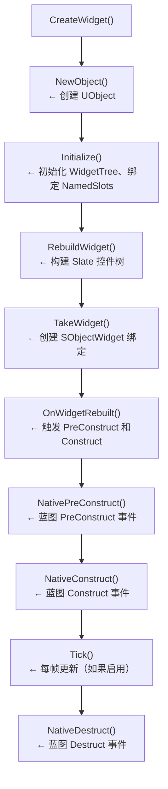
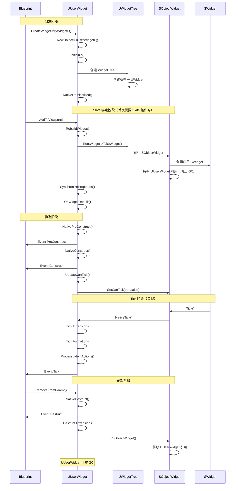

# 控件树构建与Widget生命周期

> **难度**：中级 | **预计时间**：50 分钟
>
> **前置知识**：UMG 基础与核心类架构（01）、UMG 与 Slate 绑定机制（03）

---

## 概述

理解 UMG Widget 的**生命周期**，是掌握 UE UI 系统的关键。从 `CreateWidget<T>()` 到界面显示，再到最终销毁，每个阶段都有特定的函数和时机。

本教程将深入剖析：

1. `CreateWidget<T>()` 的完整创建流程
2. `Initialize()` → `PreConstruct()` → `Construct()` → `Tick()` → `Destruct()` 的调用顺序
3. Widget 树的构建过程
4. Lyra 项目中的生命周期实践

---

## 核心概念

### Widget 生命周期阶段

UMG Widget 的生命周期分为两个主要阶段：

| 阶段 | 说明 | 关键函数 |
|------|------|----------|
| **Design Time** | 在 Widget Blueprint 编辑器中 | `PostEditChangeProperty()` |
| **Runtime** | 在游戏运行时 | `Initialize()` → `NativePreConstruct()` → `NativeConstruct()` → `Tick()` → `NativeDestruct()` |

### 关键函数调用顺序



---

## 源码深度分析

### 1. CreateWidget<T>() 流程

`CreateWidget<T>()` 是创建 UMG Widget 的**标准入口**。

**源码位置**：`Engine/Source/Runtime/UMG/Public/Blueprint/UserWidget.h` L1811-L1829

#### 模板函数声明

```cpp
// [1] CreateWidget 模板函数
template <typename WidgetT = UUserWidget, typename OwnerType = UObject>
WidgetT* CreateWidget(
    OwnerType OwningObject, 
    TSubclassOf<UUserWidget> UserWidgetClass = WidgetT::StaticClass(), 
    FName WidgetName = NAME_None)
{
    // [2] 静态断言：WidgetT 必须派生自 UUserWidget
    static_assert(TIsDerivedFrom<WidgetT, UUserWidget>::IsDerived, 
        "CreateWidget can only be used to create UserWidget instances...");

    // [3] 静态断言：OwningObject 必须是支持的类型
    static_assert(TIsDerivedFrom<TPointedToType<OwnerType>, UWidget>::IsDerived
        || TIsDerivedFrom<TPointedToType<OwnerType>, UWidgetTree>::IsDerived
        || TIsDerivedFrom<TPointedToType<OwnerType>, APlayerController>::IsDerived
        || TIsDerivedFrom<TPointedToType<OwnerType>, UGameInstance>::IsDerived
        || TIsDerivedFrom<TPointedToType<OwnerType>, UWorld>::IsDerived, 
        "The given OwningObject is not of a supported type for use with CreateWidget.");

    // [4] 性能追踪
    SCOPE_CYCLE_COUNTER(STAT_CreateWidget);
    FScopeCycleCounterUObject WidgetObjectCycleCounter(UserWidgetClass, GET_STATID(STAT_CreateWidget));

    if (OwningObject)
    {
        // [5] 调用静态的 CreateWidgetInstance()
        return Cast<WidgetT>(UUserWidget::CreateWidgetInstance(*OwningObject, UserWidgetClass, WidgetName));
    }
    return nullptr;
}
```

#### CreateInstanceInternal() 深度分析

**源码位置**：`Engine/Source/Runtime/UMG/Private/UserWidget.cpp` L2746-L2792

```cpp
// [6] 实际的 Widget 创建逻辑
UUserWidget* UUserWidget::CreateInstanceInternal(
    UObject* Outer, 
    TSubclassOf<UUserWidget> UserWidgetClass, 
    FName InstanceName, 
    UWorld* World, 
    ULocalPlayer* LocalPlayer)
{
    LLM_SCOPE_BYTAG(UI_UMG);

    // [7] 验证 UserWidgetClass 有效性
#if !(UE_BUILD_SHIPPING || UE_BUILD_TEST)
    if (!CreateWidgetHelpers::ValidateUserWidgetClass(UserWidgetClass))
    {
        return nullptr;
    }
#else
    if (!UserWidgetClass)
    {
        UE_LOG(LogUMG, Error, TEXT("CreateWidget called with a null class."));
        return nullptr;
    }
#endif

    // [8] 检查 Outer 有效性
    if (!Outer)
    {
        FMessageLog("PIE").Error(FText::Format(LOCTEXT("OuterNull", "Unable to create the widget {0}, no outer provided."), 
            FText::FromString(UserWidgetClass->GetName())));
        return nullptr;
    }

    // [9] 创建 UUserWidget 实例（NewObject）
    UUserWidget* NewWidget = NewObject<UUserWidget>(Outer, UserWidgetClass, InstanceName, RF_Transactional);
    
    // [10] 设置 Player Context（如果有）
    if (LocalPlayer)
    {
        NewWidget->SetPlayerContext(FLocalPlayerContext(LocalPlayer, World));
    }

    // [11] 初始化 Widget
    NewWidget->Initialize();

    return NewWidget;
}
```

**创建流程总结**：

| 步骤 | 操作 | 目的 |
|------|------|------|
| [1]-[5] | 模板函数参数验证 | 编译期保证类型安全 |
| [7]-[8] | 运行时验证 | 防止创建无效 Widget |
| [9] | `NewObject<UUserWidget>()` | 创建 UObject 实例 |
| [10] | `SetPlayerContext()` | 设置输入和本地玩家 |
| [11] | `Initialize()` | 初始化 WidgetTree 和扩展 |

---

### 2. Initialize() 深度分析

`Initialize()` 是 Widget 生命周期的**第一个重要函数**。

**源码位置**：`Engine/Source/Runtime/UMG/Private/UserWidget.cpp` L135-L202

```cpp
// [12] Initialize() 实现
bool UUserWidget::Initialize()
{
    // [13] 防止重复初始化（CDO 不初始化）
    if (!bInitialized && !HasAnyFlags(RF_ClassDefaultObject))
    {
        // [14] 如果是子 Widget，继承父 Widget 的设计时标志和 Player Context
        if (UUserWidget* OwningUserWidget = GetTypedOuter<UUserWidget>())
        {
#if WITH_EDITOR
            SetDesignerFlags(OwningUserWidget->GetDesignerFlags());
#endif
            SetPlayerContext(OwningUserWidget->GetPlayerContext());
        }

        UWidgetBlueprintGeneratedClass* BGClass = Cast<UWidgetBlueprintGeneratedClass>(GetClass());
        
        // [15] 如果是 Blueprint 类，调用 BPGClass->InitializeWidget()
        if (BGClass)
        {
            BGClass->InitializeWidget(this);
        }
        else
        {
            InitializeNativeClassData();  // [16] 原生类初始化
        }

        // [17] 创建或获取 WidgetTree
        if (WidgetTree == nullptr)
        {
            WidgetTree = NewObject<UWidgetTree>(this, TEXT("WidgetTree"), RF_Transient);
        }
        else
        {
            WidgetTree->SetFlags(RF_Transient);
            InitializeNamedSlots();  // [18] 初始化 NamedSlot 绑定
        }

        // [19] 运行时调用 NativeOnInitialized()
        if (!IsDesignTime() && (PlayerContext.IsValid() || bClassWantsToRunInitialized))
        {
            NativeOnInitialized();
        }

        bInitialized = true;  // [20] 标记已初始化
        return true;
    }

    return false;
}
```

**Initialize() 的核心工作**：

1. **继承上下文**（如果是子 Widget）：设计时标志、Player Context
2. **初始化 WidgetTree**：创建 `UWidgetTree` 对象
3. **调用 Blueprint 初始化**：`BGClass->InitializeWidget()` 会创建所有子 Widget
4. **触发 `NativeOnInitialized()`**：蓝图的 `Event Initialize` 事件

---

### 3. RebuildWidget() 深度分析

`RebuildWidget()` 在**首次需要 Slate 控件**时调用（通过 `TakeWidget()`）。

**源码位置**：`Engine/Source/Runtime/UMG/Private/UserWidget.cpp` L1179-L1206

```cpp
// [21] RebuildWidget() 实现
TSharedRef<SWidget> UUserWidget::RebuildWidget()
{
    check(!HasAnyFlags(RF_ClassDefaultObject | RF_ArchetypeObject));
    
    // [22] 如果未初始化，先初始化
    if (!bInitialized)
    {
        Initialize();
    }

    // [23] 设置子 Widget 的 Player Context
    if (PlayerContext.IsValid())
    {
        WidgetTree->ForEachWidget([&](UWidget* Widget) {
            if (UUserWidget* UserWidget = Cast<UUserWidget>(Widget))
            {
                UserWidget->UpdatePlayerContextIfInvalid(PlayerContext);
            }
        });
    }

    // [24] 获取根 Widget 并调用 TakeWidget()
    TSharedRef<SWidget> UserRootWidget = 
        WidgetTree->RootWidget ? WidgetTree->RootWidget->TakeWidget() : TSharedRef<SWidget>(SNew(SSpacer));
    
    return UserRootWidget;  // [25] 返回根 Slate 控件
}
```

**关键要点**：

- `RebuildWidget()` **不会立即创建所有子 Widget 的 Slate 控件**
- 它只创建**根 Widget** 的 Slate 控件
- 子 Widget 的 Slate 控件在**首次需要时**（递归调用 `TakeWidget()`）才创建

---

### 4. OnWidgetRebuilt() 分析

`OnWidgetRebuilt()` 在 `TakeWidget_Private()` 中**首次创建 Slate 控件后**调用。

**源码位置**：`Engine/Source/Runtime/UMG/Private/UserWidget.cpp` L1208-L1240

```cpp
// [26] OnWidgetRebuilt() 实现
void UUserWidget::OnWidgetRebuilt()
{
    // [27] 构建导航数据
    BuildNavigation();
    WidgetTree->ForEachWidget([&](UWidget* Widget) {
        Widget->BuildNavigation();
    });

    if (!IsDesignTime())
    {
        // [28] 通知 Widget 执行 PreConstruct
        NativePreConstruct();

        // [29] 通知 Widget 已构造
        NativeConstruct();
    }
#if WITH_EDITOR
    else if (HasAnyDesignerFlags(EWidgetDesignFlags::ExecutePreConstruct))
    {
        // [30] 编辑器模式下可能也调用 PreConstruct
        bool bCanCallPreConstruct = true;
        if (UWidgetBlueprintGeneratedClass* GeneratedBPClass = Cast<UWidgetBlueprintGeneratedClass>(GetClass()))
        {
            bCanCallPreConstruct = GeneratedBPClass->bCanCallPreConstruct;
        }

        if (bCanCallPreConstruct)
        {
            NativePreConstruct();
        }
    }
#endif
}
```

**OnWidgetRebuilt() 的核心工作**：

1. **构建导航数据**：`BuildNavigation()`
2. **触发 `NativePreConstruct()`**：蓝图的 `PreConstruct` 事件
3. **触发 `NativeConstruct()`**：蓝图的 `Construct` 事件

---

### 5. NativeConstruct() 深度分析

`NativeConstruct()` 是 Widget **显示前的最后一个重要函数**。

**源码位置**：`Engine/Source/Runtime/UMG/Private/UserWidget.cpp` L1874-L1906

```cpp
// [31] NativeConstruct() 实现
void UUserWidget::NativeConstruct()
{
    LLM_SCOPE_BYTAG(UI_UMG);

    // [32] 开始处理输入委托
    StartProcessingInputScriptDelegates();
    StartListeningForPlayerControllerChanges();
    
    // [33] 初始化 Blueprint Extensions
    if (UWidgetBlueprintGeneratedClass* BPClass = Cast<UWidgetBlueprintGeneratedClass>(GetClass()))
    {
        BPClass->ForEachExtension([this](UWidgetBlueprintGeneratedClassExtension* Extension) {
            Extension->Construct(this);
        });
    }

    // [34] 初始化 UUserWidgetExtensions
    bAreExtensionsConstructed = true;
    if (Extensions.Num() > 0)
    {
        TArray<UUserWidgetExtension*, TInlineAllocator<32>> LocalExtensions;
        LocalExtensions.Append(Extensions);
        for (UUserWidgetExtension* Extension : LocalExtensions)
        {
            check(Extension);
            Extension->Construct();
        }
    }

    // [35] 调用蓝图 Construct 事件
    Construct();

    // [36] 更新 Tick 状态
    UpdateCanTick();
}
```

**NativeConstruct() 的核心工作**：

| 步骤 | 操作 | 目的 |
|------|------|------|
| [32] | `StartProcessingInputScriptDelegates()` | 允许输入事件触发蓝图委托 |
| [33]-[34] | 初始化 Extensions | CommonUI 等插件扩展点 |
| [35] | `Construct()` | 触发蓝图 `Event Construct` |
| [36] | `UpdateCanTick()` | 根据条件决定是否启用 Tick |

---

### 6. NativeDestruct() 分析

`NativeDestruct()` 是 Widget **销毁前的清理函数**。

**源码位置**：`Engine/Source/Runtime/UMG/Private/UserWidget.cpp` L1908-L1941

```cpp
// [37] NativeDestruct() 实现
void UUserWidget::NativeDestruct()
{
    // [38] 停止处理输入委托（但保留绑定，以便重新添加到视口）
    StopProcessingInputScriptDelegates();
    StopListeningForPlayerControllerChanges();
    
    // [39] 广播销毁事件
    OnNativeDestruct.Broadcast(this);

    // [40] 调用蓝图 Destruct 事件
    Destruct();

    // [41] 销毁 Extensions
    bAreExtensionsConstructed = false;
    bAreExtensionsPreConstructed = false;
    if (Extensions.Num() > 0)
    {
        TArray<UUserWidgetExtension*, TInlineAllocator<32>> LocalExtensions;
        LocalExtensions.Append(Extensions);
        for (UUserWidgetExtension* Extension : LocalExtensions)
        {
            check(Extension);
            Extension->Destruct();
        }
    }

    // [42] 销毁 Blueprint Extensions
    if (UWidgetBlueprintGeneratedClass* BPClass = Cast<UWidgetBlueprintGeneratedClass>(GetClass()))
    {
        BPClass->ForEachExtension([this](UWidgetBlueprintGeneratedClassExtension* Extension) {
            Extension->Destruct(this);
        });
    }
}
```

**NativeDestruct() 的核心工作**：

1. **停止输入处理**：`StopProcessingInputScriptDelegates()`
2. **广播销毁事件**：`OnNativeDestruct` 多播委托
3. **调用蓝图 Destruct 事件**：`Destruct()`
4. **销毁 Extensions**：按正确顺序销毁所有扩展

---

### 7. Tick 机制

`NativeTick()` 在 **SObjectWidget::Tick()** 中被调用。

**源码位置**：`Engine/Source/Runtime/UMG/Private/UserWidget.cpp` L2086-L2126

```cpp
// [43] NativeTick() 实现
void UUserWidget::NativeTick(const FGeometry& MyGeometry, float InDeltaTime)
{ 
    // [44] 确保 TickFrequency != Never
    if(ensureMsgf(TickFrequency != EWidgetTickFrequency::Never, 
        TEXT("SObjectWidget and UUserWidget have mismatching tick states...")))
    {
        // [45] Tick Extensions
        for (int32 Index = 0; Index < Extensions.Num(); ++Index)
        {
            Extensions[Index]->Tick(MyGeometry, InDeltaTime);
        }

        const bool bTickAnimations = !IsDesignTime();

        if (bTickAnimations)
        {
            // [46] Tick 动画
            if (AnimationTickManager)
            {
                AnimationTickManager->OnWidgetTicked(this);
            }

            UWorld* World = GetWorld();
            if (World)
            {
                // [47] 处理 Latent Actions
                World->GetLatentActionManager().ProcessLatentActions(this, InDeltaTime);
            }
        }

        // [48] 调用蓝图 Tick 事件
        if (bHasScriptImplementedTick)
        {
            Tick(MyGeometry, InDeltaTime);
        }
    }
}
```

**Tick 机制的关键点**：

| 要点 | 说明 |
|------|------|
| **bCanTick** | `SObjectWidget` 的 Tick 开关，由 `UpdateCanTick()` 更新 |
| **bHasScriptImplementedTick** | 蓝图是否实现了 Tick 事件 |
| **AnimationTickManager** | 管理所有 `UWidgetAnimation` 的 Tick |
| **LatentActions** | 支持 `Delay`、`Timeline` 等延迟动作 |

#### UpdateCanTick() 逻辑

```cpp
void UUserWidget::UpdateCanTick()
{
    bool bCanTick = false;

    // [49] 根据 TickFrequency 判断
    if (TickFrequency == EWidgetTickFrequency::Auto)
    {
        // Auto 模式：如果蓝图实现了 Tick、有 Latent Actions、或有动画，则启用 Tick
        bCanTick = bHasScriptImplementedTick 
                || GetLatentActionManager().GetLatentActionManager().HasActionsForObject(this)
                || (AnimationTickManager && AnimationTickManager->HasAnyAnimations(this));
    }
    else if (TickFrequency == EWidgetTickFrequency::Never)
    {
        bCanTick = false;
    }

    // [50] 通知 SObjectWidget 更新 Tick 状态
    if (TSharedPtr<SObjectWidget> SafeGCWidget = MyGCWidget.Pin())
    {
        SafeGCWidget->SetCanTick(bCanTick);
    }
}
```

---

## 完整生命周期时序图



---

## Lyra 实践

### Lyra 的 ULyraActivatableWidget 重写了哪些函数？

**源码位置**：`Source/LyraGame/UI/LyraActivatableWidget.cpp`

```cpp
// [51] LyraActivatableWidget 构造函数
ULyraActivatableWidget::ULyraActivatableWidget(const FObjectInitializer& ObjectInitializer)
    : Super(ObjectInitializer)
{
    // 不做什么特别的，依赖 CommonUI 的默认行为
}

// [52] 获取期望的输入配置（重写自 UCommonActivatableWidget）
TOptional<FUIInputConfig> ULyraActivatableWidget::GetDesiredInputConfig() const
{
    switch (InputConfig)
    {
    case ELyraWidgetInputMode::GameAndMenu:
        return FUIInputConfig(ECommonInputMode::All, GameMouseCaptureMode);
    case ELyraWidgetInputMode::Game:
        return FUIInputConfig(ECommonInputMode::Game, GameMouseCaptureMode);
    case ELyraWidgetInputMode::Menu:
        return FUIInputConfig(ECommonInputMode::Menu, EMouseCaptureMode::NoCapture);
    case ELyraWidgetInputMode::Default:
    default:
        return TOptional<FUIInputConfig>();
    }
}
```

**Lyra 重写的生命周期函数**：

| 函数 | 重写目的 |
|------|----------|
| `GetDesiredInputConfig()` | 控制 Widget 显示时的输入模式（游戏/菜单/两者） |
| `BP_GetDesiredFocusTarget()` | 指定 Widget 显示时哪个控件获得焦点 |

**Lyra 不直接重写的生命周期函数**：

- `NativeConstruct()`：依赖 CommonUI 的 `UCommonActivatableWidget` 实现
- `NativeDestruct()`：依赖 CommonUI 的销毁逻辑

---

## 常见问题

### 1. 为什么 Construct() 被调用两次？

**症状**：
```
Event Construct 被触发了两次！
```

**原因**：

1. **`AddToViewport()` 调用了两次**：检查代码是否重复调用
2. **Widget Blueprint 中调用了 `Construct()`**：不要在蓝图中手动调用 `Construct`

**解决**：

```cpp
// 错误：重复添加
void AMyPlayerController::BeginPlay()
{
    Super::BeginPlay();
    
    MyWidget = CreateWidget<UMyWidget>(this);
    MyWidget->AddToViewport();  // 第一次
}

void AMyPlayerController::SomeOtherFunction()
{
    if (MyWidget)
    {
        MyWidget->AddToViewport();  // 第二次！Construct 会再次触发
    }
}
```

### 2. 为什么 Tick 不执行？

**症状**：

```cpp
// 蓝图中实现了 Event Tick，但没有被调用
```

**原因**：

1. **`bCanTick` 为 false**：`TickFrequency` 设置为 `Never`
2. **`bHasScriptImplementedTick` 为 false**：UE 没有检测到蓝图 Tick 实现

**解决**：

```cpp
// 方法 1：在构造函数中设置 TickFrequency
UMyWidget::UMyWidget(const FObjectInitializer& ObjectInitializer)
    : Super(ObjectInitializer)
{
    TickFrequency = EWidgetTickFrequency::Auto;  // 自动检测是否需要 Tick
}

// 方法 2：强制启用 Tick（meta 标签）
// 在 UCLASS 宏中添加 meta=(bHasScriptImplementedTick)
```

### 3. 为什么 Widget 显示后立即消失了？

**症状**：

```
Widget 调用 AddToViewport() 后，闪一下就消失了
```

**原因**：

1. **被 GC 回收**：没有持有 `UUserWidget*` 的强引用
2. **被其他 Widget 覆盖**：ZOrder 设置不正确

**解决**：

```cpp
// 错误：没有持有强引用
void AMyPlayerController::ShowWidget()
{
    UMyWidget* Widget = CreateWidget<UMyWidget>(this);
    Widget->AddToViewport();
    // Widget 是局部变量，函数结束后可能被 GC
}

// 正确：持有强引用
class AMyPlayerController : public APlayerController
{
    UPROPERTY()
    UMyWidget* MyWidget;  // 持有强引用
};

void AMyPlayerController::ShowWidget()
{
    if (!MyWidget)
    {
        MyWidget = CreateWidget<UMyWidget>(this);
    }
    MyWidget->AddToViewport();
}
```

---

## 总结与要点

### 核心要点

1. **创建流程**：`CreateWidget<T>()` → `NewObject()` → `Initialize()` → `WidgetTree` 创建
2. **Slate 绑定**：`RebuildWidget()` → `TakeWidget()` → `SObjectWidget` 创建
3. **构造流程**：`OnWidgetRebuilt()` → `NativePreConstruct()` → `NativeConstruct()`
4. **Tick 机制**：`NativeTick()` → Extensions Tick → Animations Tick → Blueprint Tick
5. **销毁流程**：`NativeDestruct()` → `Destruct` Extensions → 释放 SObjectWidget

### 最佳实践

| 实践 | 原因 |
|------|------|
| **持有 `UUserWidget*` 强引用** | 防止被 GC 回收 |
| **在 `NativeConstruct()` 中绑定事件** | 确保 Widget 完全构造 |
| **在 `NativeDestruct()` 中解绑事件** | 防止野指针 |
| **使用 `TickFrequency::Auto`** | 自动管理 Tick 性能 |
| **不要手动调用 `Construct()`** | 由引擎自动调用 |

### 下一步

- 下一课：[[30-tutorials/umg/05-UMG动画系统详解]] - UMG 动画系统
- 相关源码：
  - `Engine/Source/Runtime/UMG/Private/UserWidget.cpp`
  - `Engine/Source/Runtime/UMG/Public/Slate/SObjectWidget.h`
> 最后更新：2026-05-19

<!-- nav:auto -->

---

**导航**: ← [[30-tutorials/umg/03-UMG与Slate绑定机制深度分析|03-UMG与Slate绑定机制深度分析]] · [[30-tutorials/umg/05-UMG动画系统详解|05-UMG动画系统详解]] →

<!-- /nav:auto -->
