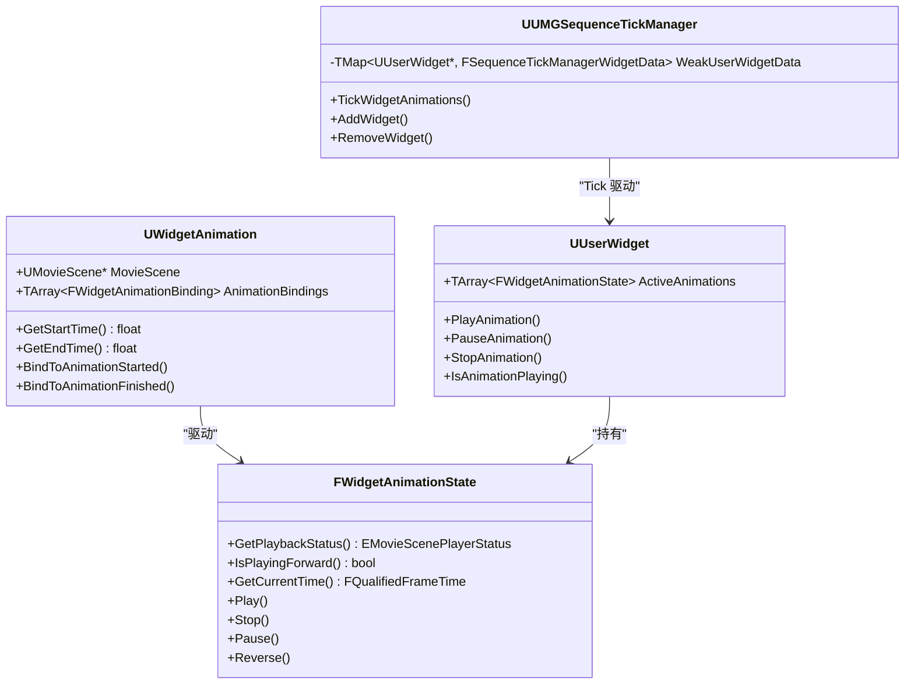
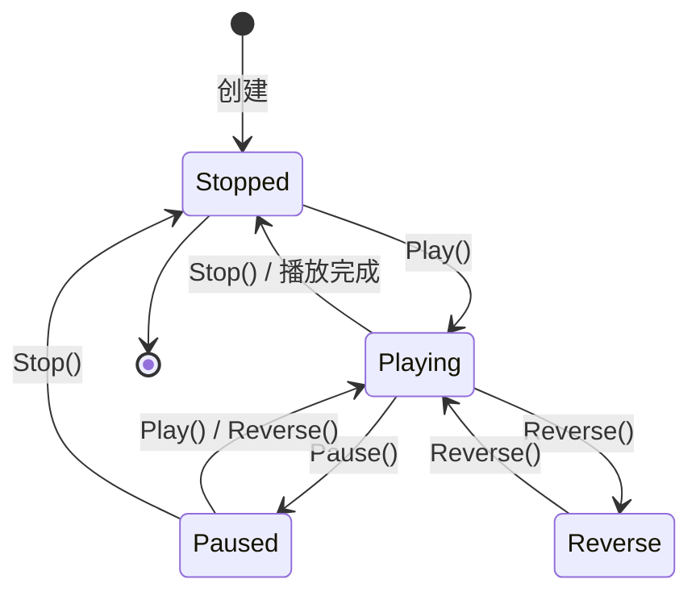
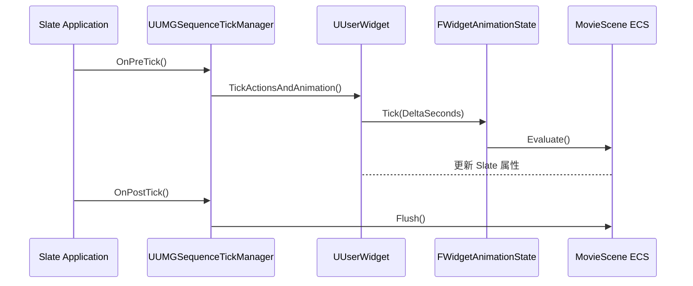
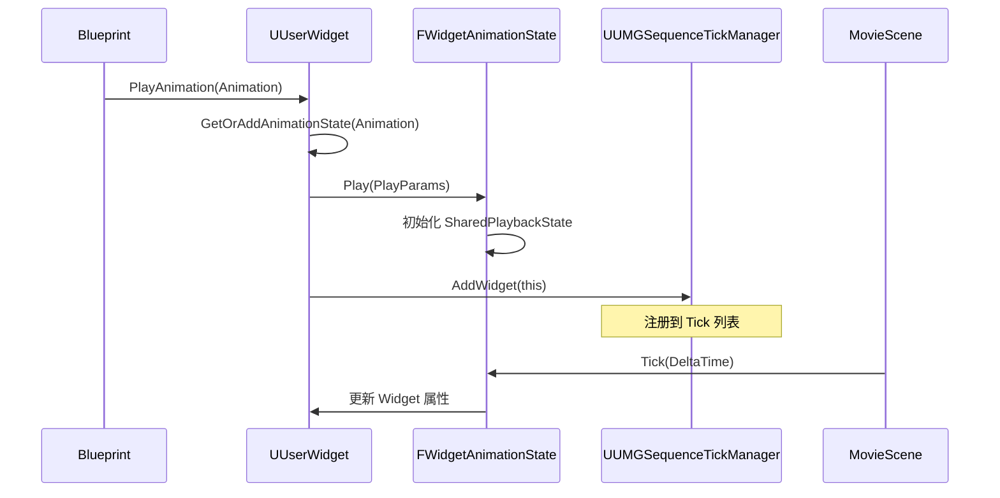

# UMG动画系统详解

> UMG 动画系统基于 MovieScene 框架，提供在 UI 中实现属性动画的能力。本文将深入分析其实现原理、使用方法及常见陷阱。

---

## 一、概述

### 1.1 UMG 动画是什么？

**UMG 动画（Widget Animation）** 是 UMG 内置的动画系统，允许你在 Widget Blueprint 中对控件的属性（位置、颜色、透明度等）进行关键帧动画。

UMG 动画与 Blueprint 中的 **Timeline** 有以下区别：

| 特性 | UMG 动画 | Blueprint Timeline |
|------|-----------|-------------------|
| **使用场景** | UI 控件属性动画 | 通用时间轴动画 |
| **编辑方式** | Widget Blueprint 动画编辑器 | Blueprint 内部 Timeline 节点 |
| **支持属性** | Transform、Color、Opacity、Angle 等 | 任意变量 |
| **播放控制** | `PlayAnimation()` 等 API | Timeline 节点控制 |
| **底层框架** | MovieScene | 独立系统 |

### 1.2 核心概念速览



---

## 二、核心概念详解

### 2.1 UWidgetAnimation 类

`UWidgetAnimation` 继承自 `UMovieSceneSequence`，是 UMG 动画的资源类。

**源码位置**：`Engine/Source/Runtime/UMG/Public/Animation/WidgetAnimation.h`

```cpp
// 【代码清单 1】UWidgetAnimation 类定义（简化）
UCLASS(BlueprintType, MinimalAPI)
class UMG_API UWidgetAnimation : public UMovieSceneSequence
{
    GENERATED_UCLASS_BODY()

public:
    // 获取动画开始时间（秒）
    UFUNCTION(BlueprintCallable, Category="Animation")
    float GetStartTime() const;

    // 获取动画结束时间（秒）
    UFUNCTION(BlueprintCallable, Category="Animation")
    float GetEndTime() const;

    // 绑定动画开始事件
    UFUNCTION(BlueprintCallable, Category = Animation)
    void BindToAnimationStarted(UUserWidget* Widget, FWidgetAnimationDynamicEvent Delegate);

    // 绑定动画结束事件
    UFUNCTION(BlueprintCallable, Category = Animation)
    void BindToAnimationFinished(UUserWidget* Widget, FWidgetAnimationDynamicEvent Delegate);

public:
    // 【关键】MovieScene 指针 - 存储关键帧数据
    UPROPERTY()
    TObjectPtr<UMovieScene> MovieScene;

    // 【关键】动画绑定数组 - 将动画关联到 Widget
    UPROPERTY()
    TArray<FWidgetAnimationBinding> AnimationBindings;
};
```

**核心要点**：
1. `MovieScene` 存储了所有关键帧序列数据
2. `AnimationBindings` 定义了动画绑定到哪些 Widget
3. 动画资源可以被多个 Widget Blueprint 共享

### 2.2 FWidgetAnimationState 结构体

`FWidgetAnimationState` 是动画的播放状态结构体，负责管理动画的播放、暂停、停止等状态。

**源码位置**：`Engine/Source/Runtime/UMG/Public/Animation/WidgetAnimationState.h`

```cpp
// 【代码清单 2】FWidgetAnimationState 结构体（简化）
struct FWidgetAnimationState : public TSharedFromThis<FWidgetAnimationState>
{
public:
    // 初始化动画状态
    void Initialize(UWidgetAnimation* InAnimation, UUserWidget* InUserWidget);

    // 获取播放状态
    EMovieScenePlayerStatus::Type GetPlaybackStatus() const;

    // 是否正向播放
    bool IsPlayingForward() const;

    // 获取当前时间
    FQualifiedFrameTime GetCurrentTime() const;

    // === 播放控制 ===
    void Play(const FWidgetAnimationStatePlayParams& PlayParams);
    void Stop();
    void Pause();
    void Reverse();

    // 设置播放速度
    void SetPlaybackSpeed(float PlaybackSpeed);

    // 设置循环次数
    void SetNumLoopsToPlay(int32 InNumLoopsToPlay);

private:
    // 【关键】动画资源
    TObjectPtr<UWidgetAnimation> Animation;

    // 【关键】所属 UserWidget
    TWeakObjectPtr<UUserWidget> WeakUserWidget;

    // 【关键】共享播放状态（MovieScene 框架）
    TWeakPtr<UE::MovieScene::FSharedPlaybackState> WeakPlaybackState;

    // 播放模式
    EUMGSequencePlayMode::Type PlayMode;

    // 是否正在停止
    bool bIsStopping : 1;

    // 是否等待删除
    bool bIsPendingDelete : 1;

    // 动画完成回调
    FOnWidgetAnimationEvent OnWidgetAnimationFinishedEvent;
};
```

**动画状态转换图**：



### 2.3 UUMGSequenceTickManager 类

**这是理解 UMG 动画系统的关键！** `UUMGSequenceTickManager` 负责管理所有 Widget 动画的 Tick。

**重要发现**：UMG 动画**不是靠 Widget Tick 驱动**的！

**源码位置**：`Engine/Source/Runtime/UMG/Private/Animation/UMGSequenceTickManager.cpp`

```cpp
// 【代码清单 3】UUMGSequenceTickManager::Initialize - 注册 Slate Tick
void UUMGSequenceTickManager::Initialize(UObject* Owner)
{
    // 【关键】获取 MovieScene Entity System Linker
    Linker = UMovieSceneEntitySystemLinker::FindOrCreateLinker(
        Owner, 
        UE::MovieScene::EEntitySystemLinkerRole::UMG, 
        TEXT("UMGAnimationEntitySystemLinker"));
    
    // 【关键】注册到 Slate 的 PreTick 和 PostTick
    FSlateApplication& SlateApp = FSlateApplication::Get();
    
    // 在 Slate 渲染前 Tick 动画
    SlateApp.OnPreTick().AddUObject(this, &UUMGSequenceTickManager::TickWidgetAnimations);
    
    // 在 Slate 渲染后处理延迟操作
    SlateApp.OnPostTick().AddUObject(this, &UUMGSequenceTickManager::HandleSlatePostTick);
}
```

```cpp
// 【代码清单 4】UUMGSequenceTickManager::TickWidgetAnimations - 动画 Tick 驱动
void UUMGSequenceTickManager::TickWidgetAnimations(float DeltaSeconds)
{
    // 【关键】遍历所有有动画的 Widget
    for (auto WidgetIter = WeakUserWidgetData.CreateIterator(); WidgetIter; ++WidgetIter)
    {
        UUserWidget* UserWidget = WidgetIter.Key().Get();
        
        if (UserWidget && UserWidget->IsVisible())
        {
            // 【关键】调用 UserWidget 的 TickActionsAndAnimation
            UserWidget->TickActionsAndAnimation(DeltaSeconds);
        }
    }

    // 【关键】强制刷新 MovieScene 评估
    ForceFlush();
}
```

**动画 Tick 驱动方式总结**：



### 2.4 动画支持的属性

UMG 动画可以驱动以下 Widget 属性：

| 属性 | 说明 | 对应 Slate 属性 |
|------|------|----------------|
| **Transform** | 位置、旋转、缩放 | `RenderTransform` |
| **Color** | 颜色 | `ColorAndOpacity` |
| **Opacity** | 透明度 | `RenderOpacity` |
| **Angle** | 旋转角度 | `RenderTransform.Angle` |
| **Visibility** | 可见性 | `Visibility` |

---

## 三、源码深度分析：动画播放流程

### 3.1 UUserWidget::PlayAnimation 实现

`PlayAnimation()` 是播放动画的入口函数。

**源码位置**：`Engine/Source/Runtime/UMG/Public/Blueprint/UserWidget.h`

```cpp
// 【代码清单 5】PlayAnimation 函数声明
UFUNCTION(BlueprintCallable, BlueprintCosmetic, Category = "User Interface|Animation")
FWidgetAnimationHandle PlayAnimation(
    UWidgetAnimation* InAnimation, 
    float StartAtTime = 0.0f, 
    int32 NumLoopsToPlay = 1, 
    EUMGSequencePlayMode::Type PlayMode = EUMGSequencePlayMode::Forward, 
    float PlaybackSpeed = 1.0f, 
    bool bRestoreState = false);
```

**播放流程**：



### 3.2 动画如何驱动 Slate 属性变化

动画通过 MovieScene 的 **Entity Component System (ECS)** 来驱动属性变化：

1. **关键帧数据** 存储在 `UMovieScene` 中
2. **ECS Linker** (`UMovieSceneEntitySystemLinker`) 负责评估动画
3. **评估结果** 通过 `TAttribute` 系统应用到 Slate 控件

```cpp
// 【代码清单 6】属性应用的简化流程
// 在 FWidgetAnimationState::Tick 中：
void FWidgetAnimationState::Tick(float InDeltaSeconds)
{
    // 通过 MovieScene ECS 评估动画
    PlaybackManager.Update(InDeltaSeconds, *WeakPlaybackState.Pin());
    
    // ECS 系统会自动更新绑定的 Slate 控件属性
    // 无需手动应用！
}
```

---

## 四、使用方法

### 4.1 在 Widget Blueprint 中创建动画

1. 打开 Widget Blueprint
2. 在 **Animations** 面板中点击 **+ Animation**
3. 选中动画，在 **Timeline** 中添加关键帧
4. 支持的属性：Transform、Color、Opacity、Angle

### 4.2 关键帧设置

| 操作 | 方法 |
|------|------|
| 添加关键帧 | 在 Timeline 中右键 → **Add Key** |
| 设置 Transform | 选中控件 → 在 Timeline 中添加 **Transform** 轨道 |
| 设置 Color | 添加 **ColorAndOpacity** 轨道 |
| 设置 Opacity | 添加 **RenderOpacity** 轨道 |

### 4.3 播放控制（Blueprint）

```blueprint
// 【代码清单 7】Blueprint 中的动画播放控制

// 播放动画（正向）
PlayAnimation(MyAnimation, 0.0f, 1, Forward, 1.0f, false);

// 暂停动画
PauseAnimation(MyAnimation);

// 停止动画（重置到起始状态）
StopAnimation(MyAnimation);

// 反向播放
PlayAnimationReverse(MyAnimation);

// 继续正向播放
PlayAnimationForward(MyAnimation);
```

### 4.4 动画事件绑定

```cpp
// 【代码清单 8】C++ 中绑定动画事件
void UMyUserWidget::NativeConstruct()
{
    Super::NativeConstruct();

    // 绑定动画开始事件
    BindToAnimationStarted(MyAnimation, FWidgetAnimationDynamicEvent::CreateUObject(this, &UMyUserWidget::OnAnimationStarted));

    // 绑定动画结束事件
    BindToAnimationFinished(MyAnimation, FWidgetAnimationDynamicEvent::CreateUObject(this, &UMyUserWidget::OnAnimationFinished));
}

void UMyUserWidget::OnAnimationStarted()
{
    // 动画开始逻辑
}

void UMyUserWidget::OnAnimationFinished()
{
    // 动画结束逻辑
}
```

---

## 五、Lyra 实践

### 5.1 Lyra 是否使用 UMG 动画？

通过搜索 Lyra 的 `Content/UI/` 目录，**未发现使用 UMG 动画的痕迹**。Lyra 的 UI 主要采用以下方式实现动态效果：

1. **CommonUI 内置效果**：按钮悬停、点击效果由 CommonUI 的样式系统处理
2. **材质动画**：使用 Material 驱动动态效果
3. **Slate 渲染**：直接操作 Slate 属性

### 5.2 Lyra 按钮悬停效果实现

Lyra 的按钮效果主要通过 `UCommonButtonBase` 的样式系统实现：

```cpp
// 【代码清单 9】Lyra 按钮样式（推测实现）
// 在 W_LyraButton 的 Widget Blueprint 中：
// 1. 使用 CommonButton 的 Style Set
// 2. 定义不同状态（Normal、Hovered、Pressed、Disabled）的样式
// 3. 样式变化是即时切换，而非动画过渡
```

**结论**：Lyra **未使用** UMG 动画系统，而是依赖 CommonUI 的即时样式切换。

---

## 六、常见问题

### 6.1 动画播放没有效果？

**可能原因**：
1. Widget 未添加到视口（`AddToViewport` 未调用）
2. 动画未绑定到任何控件（Animation Bindings 为空）
3. Widget 不可见（`Visibility = Collapsed`）

**解决方法**：
```cpp
// 检查 Widget 是否可见
if (IsVisible())
{
    PlayAnimation(MyAnimation);
}
```

### 6.2 动画不循环？

**检查项**：
1. `NumLoopsToPlay` 参数是否设置为 `0`（0 = 无限循环）
2. 动画时长是否正确（`GetEndTime()`）

```cpp
// 【代码清单 10】正确设置循环
PlayAnimation(MyAnimation, 0.0f, 0, EUMGSequencePlayMode::Forward); // 0 = 无限循环
```

### 6.3 动画回调不触发？

**可能原因**：
1. 回调绑定在 `PlayAnimation` **之后**（应该在播放前绑定）
2. 动画被 `StopAnimation` 立即停止
3. `bRestoreState` 参数导致动画结束时不触发回调

**正确做法**：
```cpp
// 【代码清单 11】正确绑定回调
void UMyWidget::NativeConstruct()
{
    Super::NativeConstruct();
    
    // 【正确】在 Construct 时绑定
    BindToAnimationFinished(MyAnimation, FWidgetAnimationDynamicEvent::CreateUObject(this, &UMyWidget::OnFinished));
    
    // 然后播放
    PlayAnimation(MyAnimation);
}
```

---

## 七、总结与要点

### 7.1 核心要点

1. **UMG 动画基于 MovieScene 框架**
   - 使用 ECS (Entity Component System) 评估动画
   - 关键帧数据存储在 `UMovieScene` 中

2. **动画 Tick 不依赖 Widget Tick**
   - 由 `UUMGSequenceTickManager` 通过 Slate 的 PreTick 驱动
   - 即使 Widget 的 Tick 被禁用，动画依然可以播放

3. **播放控制**
   - `PlayAnimation()`：播放动画
   - `PauseAnimation()`：暂停
   - `StopAnimation()`：停止并重置
   - `PlayAnimationForward()` / `PlayAnimationReverse()`：方向控制

4. **事件绑定**
   - `BindToAnimationStarted()`：绑定开始事件
   - `BindToAnimationFinished()`：绑定结束事件

### 7.2 性能建议

1. **避免过度使用动画**：每个动画都会增加 Tick 开销
2. **使用 `bRestoreState` 谨慎**：结束时会额外评估以恢复初始状态
3. **及时停止不需要的动画**：调用 `StopAllAnimations()` 清理

### 7.3 相关页面

- [[30-tutorials/umg/06-UMG数据绑定与属性通知]] - 数据绑定与属性通知
- [[30-tutorials/umg/03-UMG与Slate绑定机制深度分析]] - UMG 与 Slate 绑定机制
- [UE 官方 UMG 动画文档](https://dev.epicgames.com/documentation/zh-cn/unreal-engine/animation-in-umg-for-unreal-engine)

<!-- nav:auto -->

---

**导航**: ← [[30-tutorials/umg/04-控件树构建与Widget生命周期|04-控件树构建与Widget生命周期]] · [[30-tutorials/umg/06-UMG数据绑定与属性通知|06-UMG数据绑定与属性通知]] →

<!-- /nav:auto -->
