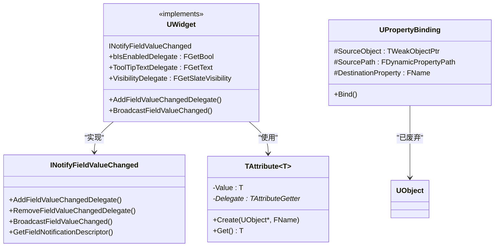
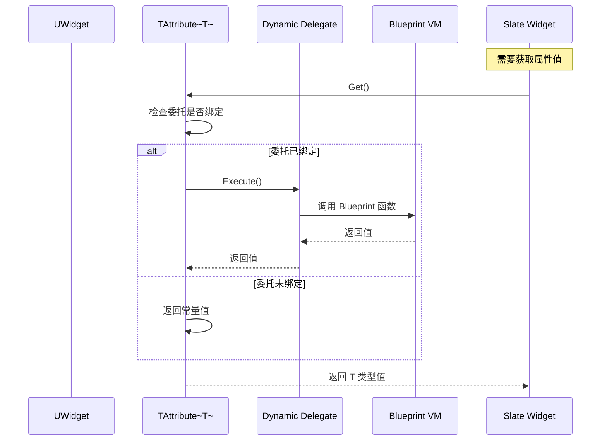
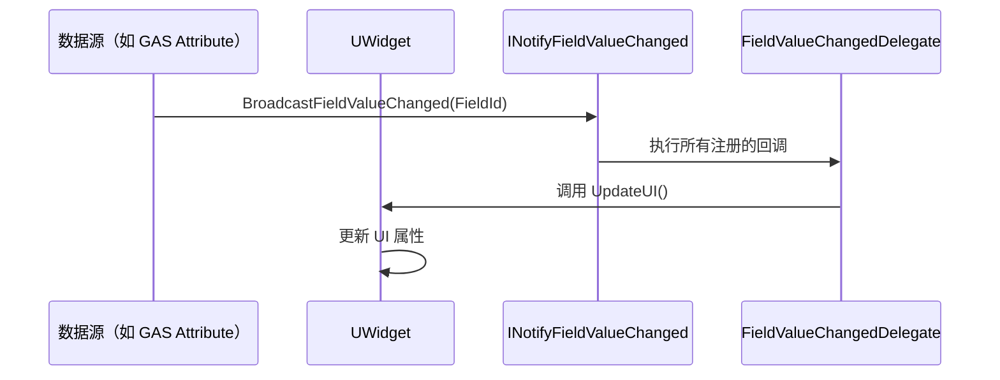
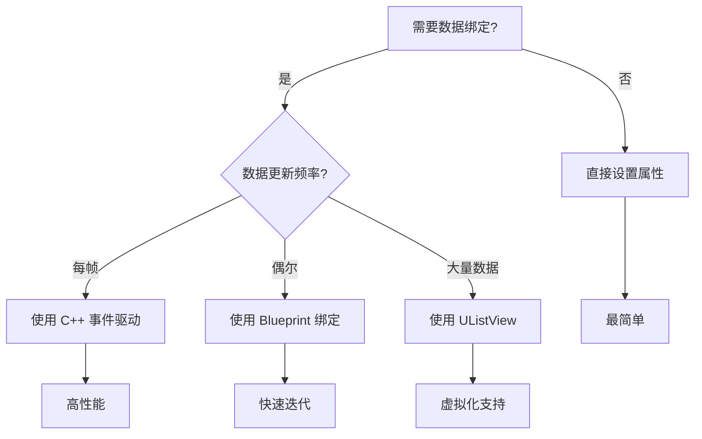

# UMG数据绑定与属性通知

> UMG 提供多种数据绑定方式，从简单的属性绑定到复杂的 Field Notification 系统。本文将深入分析其实现原理、使用方法及 Lyra 中的最佳实践。

---

## 一、概述

### 1.1 数据绑定的作用

**数据绑定（Data Binding）** 是 UMG 实现数据驱动 UI 更新的核心机制：
- 让 Widget 属性自动响应数据变化
- 避免手动调用 `UpdateUI()` 之类的函数
- 支持 Blueprint 和 C++ 两种绑定方式

### 1.2 UMG 支持的绑定方式

| 绑定方式 | 说明 | 使用场景 |
|------|------|----------|
| **属性绑定（Property Binding）** | 将 Widget 属性绑定到函数 | 简单数据展示（文本、颜色等） |
| **事件驱动更新** | 监听 `OnXChanged` 事件 | 复杂逻辑、多属性联动 |
| **INotifyFieldValueChanged** | C++ 属性通知接口 | 高性能、类型安全的绑定 |
| **Native Binding** | C++ 中直接绑定 TAttribute | 性能最优，但不够灵活 |



---

## 二、核心概念详解

### 2.1 属性绑定（Property Binding）

**属性绑定**是最常用的绑定方式，允许你将 Widget 的属性（如 Text、Color）绑定到一个 Blueprint 函数。

#### 2.1.1 Blueprint 中的属性绑定

在 Widget Blueprint 编辑器中：
1. 选中一个控件（如 TextBlock）
2. 在 **Details 面板** 中找到要绑定的属性（如 `Text`）
3. 点击 **Bind** → 选择 **Create Binding**
4. 生成一个新的函数，返回对应类型的值

#### 2.1.2 支持的绑定类型

**源码位置**：`Engine/Source/Runtime/UMG/Public/Components/Widget.h`

```cpp
// 【代码清单 1】UMG 支持的绑定委托类型
DECLARE_DYNAMIC_DELEGATE_RetVal(bool, FGetBool);
DECLARE_DYNAMIC_DELEGATE_RetVal(float, FGetFloat);
DECLARE_DYNAMIC_DELEGATE_RetVal(int32, FGetInt32);
DECLARE_DYNAMIC_DELEGATE_RetVal(FText, FGetText);
DECLARE_DYNAMIC_DELEGATE_RetVal(FSlateColor, FGetSlateColor);
DECLARE_DYNAMIC_DELEGATE_RetVal(FLinearColor, FGetLinearColor);
DECLARE_DYNAMIC_DELEGATE_RetVal(FSlateBrush, FGetSlateBrush);
DECLARE_DYNAMIC_DELEGATE_RetVal(ESlateVisibility, FGetSlateVisibility);
```

**对应关系**：

| Widget 属性 | 绑定委托类型 | 示例 |
|-----------|----------------|------|
| `Visibility` | `FGetSlateVisibility` | 返回 `ESlateVisibility` |
| `Is Enabled` | `FGetBool` | 返回 `bool` |
| `Render Opacity` | `FGetFloat` | 返回 `float` |
| `Color And Opacity` | `FGetLinearColor` | 返回 `FLinearColor` |
| `Tool Tip Text` | `FGetText` | 返回 `FText` |

### 2.2 UPropertyBinding 类分析（已废弃）

`UPropertyBinding` 是早期的绑定实现，**已被新的 Field Notification 系统替代**。

**源码位置**：`Engine/Source/Runtime/UMG/Public/Binding/PropertyBinding.h`

```cpp
// 【代码清单 2】UPropertyBinding 类定义（已废弃）
UCLASS(MinimalAPI)
class UPropertyBinding : public UObject
{
    GENERATED_BODY()

public:
    // 检查源属性是否支持
    virtual bool IsSupportedSource(FProperty* Property) const;
    
    // 检查目标属性是否支持
    virtual bool IsSupportedDestination(FProperty* Property) const;
    
    // 绑定属性
    virtual void Bind(FProperty* Property, FScriptDelegate* Delegate);

public:
    // 【关键】源对象（绑定数据的来源）
    UPROPERTY(Transient)
    TWeakObjectPtr<UObject> SourceObject;

    // 【关键】属性路径（用于解析绑定）
    UPROPERTY()
    FDynamicPropertyPath SourcePath;

    // 【关键】目标属性名（Widget 的属性）
    UPROPERTY()
    FName DestinationProperty;
};
```

**为什么被废弃？**
1. 性能开销大：每次更新都要通过反射解析属性路径
2. 类型不安全：运行时才能发现类型错误
3. 不支持批量通知：每个绑定独立更新

### 2.3 INotifyFieldValueChanged 接口

**这是 UE5 推荐的属性通知方式**，提供了类型安全、高性能的属性变化通知。

**源码位置**：`Engine/Source/Runtime/FieldNotification/Public/INotifyFieldValueChanged.h`

```cpp
// 【代码清单 3】INotifyFieldValueChanged 接口定义
UINTERFACE(MinimalAPI, NotBlueprintable)
class UNotifyFieldValueChanged : public UInterface
{
    GENERATED_BODY()
};

class INotifyFieldValueChanged : public IInterface
{
    GENERATED_BODY()

public:
    // 【关键】添加属性变化回调
    virtual FDelegateHandle AddFieldValueChangedDelegate(
        UE::FieldNotification::FFieldId InFieldId, 
        FFieldValueChangedDelegate InNewDelegate) = 0;

    // 【关键】移除属性变化回调
    virtual bool RemoveFieldValueChangedDelegate(
        UE::FieldNotification::FFieldId InFieldId, 
        FDelegateHandle InHandle) = 0;

    // 【关键】广播属性变化
    virtual void BroadcastFieldValueChanged(
        UE::FieldNotification::FFieldId InFieldId) = 0;

    // 获取字段通知描述符
    virtual const UE::FieldNotification::IClassDescriptor& GetFieldNotificationDescriptor() const = 0;
};
```

**UWidget 对 INotifyFieldValueChanged 的实现**：

**源码位置**：`Engine/Source/Runtime/UMG/Public/Components/Widget.h` (第 788-805 行)

```cpp
// 【代码清单 4】UWidget 实现的 Field Notification 接口
// ~ Begin INotifyFieldValueChanged Interface
UMG_API virtual FDelegateHandle AddFieldValueChangedDelegate(
    UE::FieldNotification::FFieldId InFieldId, 
    FFieldValueChangedDelegate InNewDelegate) override final;

UMG_API virtual bool RemoveFieldValueChangedDelegate(
    UE::FieldNotification::FFieldId InFieldId, 
    FDelegateHandle InHandle) override final;

UMG_API virtual void BroadcastFieldValueChanged(
    UE::FieldNotification::FFieldId InFieldId) override final;
// ~ End INotifyFieldValueChanged Interface

// Blueprint 包装函数
UFUNCTION(BlueprintCallable, Category = "FieldNotify")
void K2_AddFieldValueChangedDelegate(
    FFieldNotificationId FieldId, 
    FFieldValueChangedDynamicDelegate Delegate);

UFUNCTION(BlueprintCallable, Category = "FieldNotify")
void K2_BroadcastFieldValueChanged(FFieldNotificationId FieldId);
```

### 2.4 Native Binding vs Blueprint Binding

#### 2.4.1 Blueprint 绑定

```cpp
// 【代码清单 5】Blueprint 绑定的底层实现（简化）
// 在 Widget Blueprint 中绑定 Text 属性到函数 GetHealthText()：
// 1. 编译器生成委托绑定代码
// 2. 运行时通过 TAttribute::Create() 创建绑定

// 等效的 C++ 代码：
TextBlock->TextDelegate.BindDynamic(this, &UMyWidget::GetHealthText);
```

#### 2.4.2 Native C++ 绑定

```cpp
// 【代码清单 6】C++ 中的 Native 绑定
UCLASS()
class UMyUserWidget : public UUserWidget
{
    GENERATED_BODY()

public:
    UPROPERTY(meta=(BindWidget))
    TObjectPtr<UTextBlock> HealthText;

    // 【推荐】在 Native 中直接绑定 TAttribute
    UFUNCTION()
    FText GetHealthText() const;
};

void UMyUserWidget::NativeConstruct()
{
    Super::NativeConstruct();

    // 方式 1：绑定到函数（推荐）
    HealthText->SetText(FText::FromString("100"));
    
    // 方式 2：使用 TAttribute 绑定（高性能）
    // 需要在 UTextBlock 的 Text 属性上设置绑定
    // 这通常在 Widget Blueprint 中完成
}
```

#### 2.4.3 PROPERTY_BINDING 宏

**源码位置**：`Engine/Source/Runtime/UMG/Public/Components/Widget.h` (第 109-153 行)

```cpp
// 【代码清单 7】PROPERTY_BINDING 宏定义
#define PROPERTY_BINDING(ReturnType, MemberName)                    \
    (MemberName##Delegate.IsBound() && !IsDesignTime())            \
    ? TAttribute<ReturnType>::Create(                             \
        MemberName##Delegate.GetUObject(),                        \
        MemberName##Delegate.GetFunctionName())                   \
    : TAttribute<ReturnType>(MemberName)
```

**使用方式**：

```cpp
// 【代码清单 8】在 UWidget 派生类中使用属性绑定
UCLASS()
class UMyWidget : public UWidget
{
    GENERATED_BODY()

    // 声明委托
    UPROPERTY()
    FGetText TextDelegate;

    // 声明属性
    UPROPERTY(EditAnywhere, BlueprintReadWrite)
    FText Text;
};

// 在 RebuildWidget 中使用绑定
TSharedRef<SWidget> UMyWidget::RebuildWidget()
{
    // 如果绑定了委托，使用委托返回值；否则使用常量
    return SNew(STextBlock)
        .Text(PROPERTY_BINDING(FText, Text));
}
```

---

## 三、源码深度分析：绑定系统工作流程

### 3.1 属性绑定的调用链



### 3.2 TAttribute 系统

`TAttribute<T>` 是 UE 的属性绑定核心：

```cpp
// 【代码清单 9】TAttribute 简化实现
template<typename T>
class TAttribute
{
public:
    // 创建从委托的绑定
    static TAttribute<T> Create(UObject* Object, FName FunctionName)
    {
        TAttribute<T> Attribute;
        Attribute.Getter.BindUFunction(Object, FunctionName);
        return Attribute;
    }

    // 获取值
    T Get() const
    {
        if (Getter.IsBound())
        {
            return Getter.Execute();  // 调用委托
        }
        return Value;  // 返回常量
    }

private:
    T Value;           // 常量值
    TDelegate<T> Getter;  // 委托
};
```

### 3.3 Field Notification 工作流程



---

## 四、使用方法

### 4.1 Blueprint 中的属性绑定

#### 4.1.1 绑定 Text 属性到函数

1. 打开 Widget Blueprint
2. 选中 **TextBlock** 控件
3. 在 **Details 面板** → **Content** → **Text**
4. 点击 **Bind** → **Create Binding**
5. 生成函数，返回 `FText`：

```blueprint
# 【代码清单 10】Blueprint 中的属性绑定函数
# 函数名：GetText_0（自动生成）
# 返回类型：Text

# Blueprint 节点：
# [Get Player Character] → [Cast to LyraCharacter] 
# → [Get Health] → [Conv Float to Text] → [Return Node]
```

#### 4.1.2 绑定 Visibility 属性

```blueprint
# 【代码清单 11】绑定 Visibility 属性
# 函数名：GetVisibility_0
# 返回类型：Slate Visibility

# Blueprint 节点：
# [Get Has Ammo] → [Branch]
# True → [Return: Visible]
# False → [Return: Collapsed]
```

### 4.2 C++ 中的动态更新

#### 4.2.1 直接设置属性

```cpp
// 【代码清单 12】C++ 中直接更新 UI
void UMyUserWidget::UpdateHealth(float NewHealth)
{
    // 方式 1：直接设置属性（推荐）
    HealthText->SetText(FText::AsNumber(NewHealth));
    
    // 方式 2：通过 Broadcast 通知绑定更新
    BroadcastFieldValueChanged(GET_FIELD_NOTIFICATION_ID(Health));
}
```

#### 4.2.2 使用 Invalidate()

```cpp
// 【代码清单 13】使用 Invalidate 强制重新计算布局
void UMyUserWidget::OnHealthChanged(float NewHealth)
{
    // 更新数据
    CurrentHealth = NewHealth;
    
    // 标记需要重新计算布局
    Invalidate(EInvalidateWidget::Layout);
    
    // 如果需要立即更新绑定，调用：
    HealthText->SynchronizeProperties();
}
```

### 4.3 事件驱动更新

#### 4.3.1 监听 GameplayTag 变化

```cpp
// 【代码清单 14】事件驱动 UI 更新
void UMyUserWidget::NativeConstruct()
{
    Super::NativeConstruct();

    // 监听 Ability System 的 Attribute 变化
    if (ULyraAbilitySystemComponent* ASC = GetOwnerASC())
    {
        ASC->GetGameplayAttributeValueChangeDelegate(
            ULyraAttributeSet::GetHealthAttribute()
        ).AddUObject(this, &UMyUserWidget::OnHealthChanged);
    }
}

void UMyUserWidget::OnHealthChanged(const FOnAttributeChangeData& Data)
{
    // 更新 UI
    HealthText->SetText(FText::AsNumber(Data.NewValue));
}
```

---

## 五、Lyra 实践

### 5.1 Lyra 如何更新 HUD 数据？

通过阅读 Lyra 源码，发现 Lyra **并未使用复杂的 UMG 数据绑定**，而是采用以下方式：

| 数据类型 | 更新方式 | 源码位置 |
|-----------|----------|------------|
| **生命值** | GAS Attribute 回调 | `ULyraHUD` |
| **弹药数** | Weapon Instance 通知 | `ULyraReticleWidgetBase` |
| **UI 状态** | Blueprint Event | `W_ShooterHUDLayout` |

### 5.2 LyraReticleWidgetBase 分析

**源码位置**：`Source/LyraGame/UI/Weapons/LyraReticleWidgetBase.h`

```cpp
// 【代码清单 15】LyraReticleWidgetBase - 简单直接的数据访问
UCLASS(Abstract)
class ULyraReticleWidgetBase : public UCommonUserWidget
{
    GENERATED_BODY()

public:
    // 【关键】初始化时传入武器实例
    UFUNCTION(BlueprintCallable)
    void InitializeFromWeapon(ULyraWeaponInstance* InWeapon);

    // 【关键】Blueprint 可重写事件
    UFUNCTION(BlueprintImplementableEvent)
    void OnWeaponInitialized();

protected:
    // 【关键】直接持有武器数据引用
    UPROPERTY(BlueprintReadOnly)
    TObjectPtr<ULyraWeaponInstance> WeaponInstance;

    UPROPERTY(BlueprintReadOnly)
    TObjectPtr<ULyraInventoryItemInstance> InventoryInstance;

public:
    // 【关键】计算结果通过函数实时获取（非绑定）
    UFUNCTION(BlueprintCallable, BlueprintPure)
    float ComputeSpreadAngle() const;

    UFUNCTION(BlueprintCallable, BlueprintPure)
    float ComputeMaxScreenspaceSpreadRadius() const;
};
```

**Lyra 的设计哲学**：
1. **不使用属性绑定**：性能考虑，避免每帧调用 Blueprint 函数
2. **直接函数调用**：在需要时主动调用更新函数
3. **BlueprintImplementableEvent**：让 Blueprint 处理 UI 更新细节

### 5.3 Lyra 是否使用了 INotifyFieldValueChanged？

**答案**：**是**，但不直接用于 UI 数据绑定。

`UWidget` 实现了 `INotifyFieldValueChanged` 接口，主要用于：
1. **Editor 支持**：在 Widget Blueprint 编辑器中实时预览属性变化
2. **辅助功能（Accessibility）**：通知屏幕阅读器属性变化

---

## 六、高级主题

### 6.1 大量数据绑定时的性能问题

#### 问题描述

每个属性绑定都会在每帧检查时调用委托：
- 100 个绑定 = 100 次委托调用/帧
- Blueprint 委托调用开销更大（跨 VM 调用）

#### 优化方案

```cpp
// 【代码清单 16】优化绑定性能
// 方案 1：减少绑定数量
// 使用 Native 事件驱动，而非属性绑定

// 方案 2：使用 Invalidation Panel
// 只在实际需要更新时重新计算布局

// 方案 3：批量更新
void UMyUserWidget::BatchUpdateUI()
{
    // 暂停布局更新
    WidgetTree->SetFlags(RF_Transient);
    
    // 批量更新属性
    UpdateHealth();
    UpdateAmmo();
    UpdateWeaponIcon();
    
    // 恢复布局更新
    WidgetTree->ClearFlags(RF_Transient);
    ForceLayoutPrepass();
}
```

### 6.2 使用 UListView 的 OnGenerateRow

`UListView` 是处理大量数据的正确方式：

```cpp
// 【代码清单 17】UListView 虚拟化示例
UCLASS()
class UMyListView : public UListView
{
    GENERATED_BODY()

    // 【关键】只在行需要显示时生成
    UFUNCTION()
    UWidget* OnGenerateRow(UObject* Item)
    {
        UMyItemWidget* Widget = CreateWidget<UMyItemWidget>(this, ItemWidgetClass);
        Widget->InitializeFromItem(Cast<UMyItem>(Item));
        return Widget;
    }
};
```

**虚拟化原理**：
- 只生成可见区域的行
- 滚动时回收不可见行的 Widget
- 大幅减少同时存在的 Widget 数量

---

## 七、常见问题

### 7.1 绑定函数每帧调用？

**是的**！这是属性绑定的默认行为。

**解决方法**：
1. 使用 **事件驱动** 替代绑定
2. 在绑定函数中添加 **缓存检查**：

```cpp
// 【代码清单 18】优化绑定函数
FText UMyWidget::GetHealthText()
{
    // 缓存上次的值
    static float CachedHealth = -1.0f;
    float CurrentHealth = GetHealth();
    
    if (FMath::IsNearlyEqual(CachedHealth, CurrentHealth))
    {
        return CachedText;  // 返回缓存结果
    }
    
    CachedHealth = CurrentHealth;
    CachedText = FText::AsNumber(CurrentHealth);
    return CachedText;
}
```

### 7.2 如何优化绑定性能？

| 优化方法 | 说明 |
|-----------|------|
| **减少绑定数量** | 只对真正需要动态更新的属性使用绑定 |
| **使用 Native 事件** | C++ 中直接监听数据变化，手动更新 UI |
| **批量更新** | 在帧末批量更新 UI，避免多次重绘 |
| **使用 Invalidation** | 只在实际需要更新时调用 `Invalidate()` |

### 7.3 Blueprint 绑定 vs C++ 绑定：如何选择？

| 方式 | 优点 | 缺点 | 适用场景 |
|------|------|------|------------|
| **Blueprint 绑定** | 简单、可视化 | 性能较差 | 简单 UI、原型开发 |
| **C++ 事件驱动** | 高性能、类型安全 | 需要更多代码 | 复杂 UI、性能敏感场景 |
| **INotifyFieldValueChanged** | 标准化、支持编辑器 | 学习曲线陡 | 可复用 UI 组件 |

---

## 八、总结与要点

### 8.1 核心要点

1. **属性绑定有两种方式**
   - Blueprint 绑定：简单直观，性能较差
   - C++ Native 绑定：高性能，代码量大

2. **INotifyFieldValueChanged 是未来方向**
   - 类型安全
   - 支持批量通知
   - 与 UE5 的 Field Notification 系统集成

3. **Lyra 的实践经验**
   - 不使用复杂绑定，采用直接函数调用
   - 通过 `BlueprintImplementableEvent` 让 Blueprint 处理 UI 细节
   - 性能优先于便利性

4. **性能优化建议**
   - 减少绑定数量
   - 使用事件驱动替代绑定
   - 利用 `UListView` 的虚拟化

### 8.2 绑定系统选择指南



### 8.3 相关页面

- [[30-tutorials/umg/05-UMG动画系统详解]] - UMG 动画系统
- [[30-tutorials/umg/03-UMG与Slate绑定机制深度分析]] - UMG 与 Slate 绑定机制
- [[30-tutorials/gas/25-Attribute属性详解]] - GAS 属性系统（与 UI 绑定相关）
- [UE 官方 UMG 数据绑定文档](https://dev.epicgames.com/documentation/zh-cn/unreal-engine/umg-and-slate-in-unreal-engine)

<!-- nav:auto -->

---

**导航**: ← [[30-tutorials/umg/05-UMG动画系统详解|05-UMG动画系统详解]] · [[30-tutorials/umg/07-UMG中的输入处理|07-UMG中的输入处理]] →

<!-- /nav:auto -->
