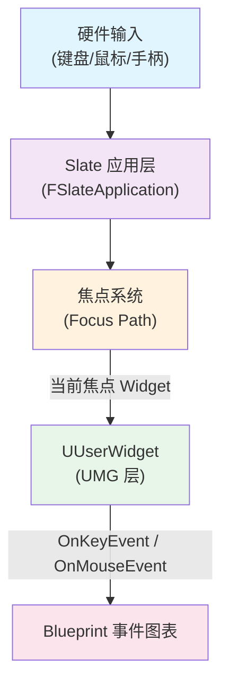
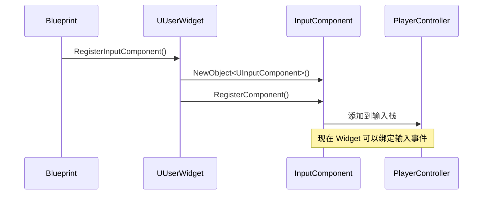
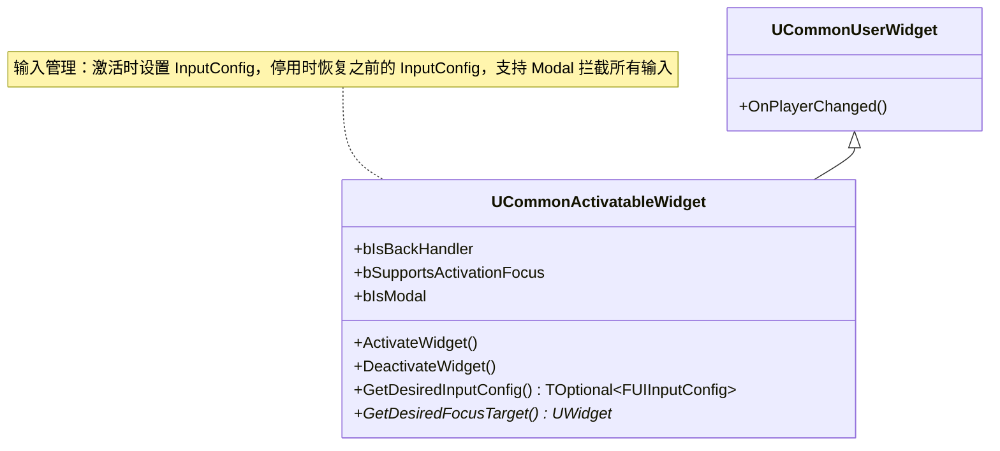
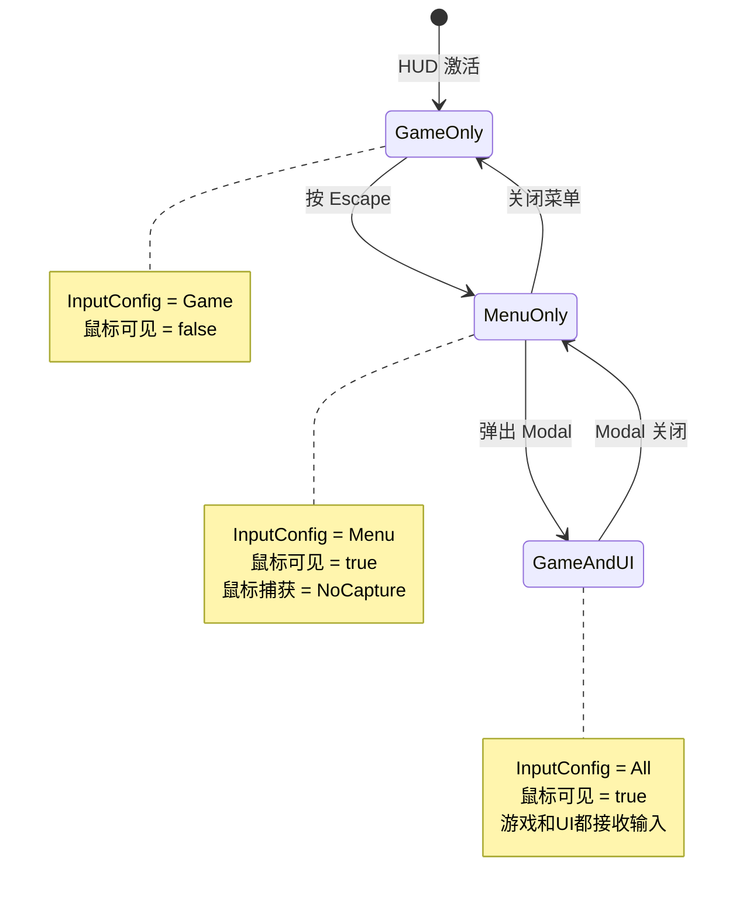

# UMG中的输入处理

> **难度**：Advanced  
> **前置知识**：[[30-tutorials/umg/01-UMG基础与核心类架构|UMG 基础]]、[[30-tutorials/input-system/00-UE5输入系统系列概览|输入系统概述]]

## 1. 概述

UMG 的输入处理是 UI 交互的核心。与 PlayerController 的输入处理不同，UMG 的输入处理发生在 Slate 层，涉及：

- **焦点（Focus）系统**：哪个 Widget 接收键盘/手柄输入
- **输入模式（Input Mode）**：UI Only / Game Only / Game and UI
- **事件路由**：输入事件如何从 Slate 传递到 UMG Blueprint



### UMG 输入 vs PlayerController 输入

| 特性 | UMG 输入 | PlayerController 输入 |
|------|-----------|----------------------|
| **处理层** | Slate → UMG | PlayerController → Actor |
| **适用场景** | UI 交互（按钮、输入框） | 游戏逻辑（移动、射击） |
| **输入模式** | 由 `FUIInputConfig` 控制 | 始终接收游戏输入 |
| **焦点依赖** | 需要焦点（Focusable） | 不需要焦点 |

---

## 2. 核心概念

### 2.1 `bIsFocusable` — 是否可获取焦点

`UWidget::bIsFocusable` 决定一个 Widget 是否可以接收焦点。

```cpp
// Engine/Source/Runtime/UMG/Public/Blueprint/UserWidget.h (L89-94)
PRAGMA_DISABLE_DEPRECATION_WARNINGS
    bIsFocusable = false;  // 默认不可获取焦点
    ColorAndOpacity = FLinearColor::White;
    ForegroundColor = FSlateColor::UseForeground();
PRAGMA_ENABLE_DEPRECATION_WARNINGS
```

**关键点**：
- 默认值为 `false`（安全第一）
- 只有在构造函数中设置才有效（运行时不可修改）
- `UButton`、`UComboBox` 等交互控件默认设为 `true`

```cpp
// Engine/Source/Runtime/UMG/Private/Components/ComboBox.cpp (L26)
bIsFocusable = true;  // ComboBox 默认可获取焦点
```

### 2.2 `UUserWidget::InputComponent` — 输入组件

`InputComponent` 允许 Widget 像 PlayerController 一样绑定输入事件。

**初始化时机**（`UUserWidget::NativeConstruct`）：

```cpp
// Engine/Source/Runtime/UMG/Private/Components/UserWidget.cpp
void UUserWidget::NativeConstruct()
{
    Super::NativeConstruct();
    
    // 如果设置了 bAutomaticallyRegisterInputOnConstruction，
    // 会在 Construct 时创建 InputComponent
    if (bAutomaticallyRegisterInputOnConstruction)
    {
        RegisterInputComponent();
    }
}
```

**创建 InputComponent**：

```cpp
void UUserWidget::RegisterInputComponent()
{
    if (!InputComponent && GetOwningPlayer())
    {
        InputComponent = NewObject<UInputComponent>(
            this, 
            UInputSettings::GetDefaultInputComponentClass()
        );
        InputComponent->RegisterComponent();
        InputComponent->bBlockInput = bBlockInput;
    }
}
```

### 2.3 输入模式（Input Mode）

UE 提供三种输入模式，控制输入事件路由到 UI 还是游戏：

| 枚举值 | 说明 |
|--------|------|
| `ECommonInputMode::Menu` | 仅 UI 接收输入（全屏菜单） |
| `ECommonInputMode::Game` | 仅游戏接收输入（HUD 模式） |
| `ECommonInputMode::All` | UI 和游戏都接收输入（混合模式） |

**CommonUI 的 `FUIInputConfig`**：

```cpp
// Engine/Plugins/Runtime/CommonUI/Source/CommonUI/Public/CommonInputMode.h
struct FUIInputConfig
{
    ECommonInputMode::Type InputMode = ECommonInputMode::Menu;
    EMouseCaptureMode MouseCaptureMode = EMouseCaptureMode::NoCapture;
    
    FUIInputConfig() = default;
    FUIInputConfig(ECommonInputMode::Type InMode, EMouseCaptureMode InMouse)
        : InputMode(InMode), MouseCaptureMode(InMouse) {}
};
```

---

## 3. 源码深度分析

### 3.1 InputComponent 初始化

`UUserWidget` 的 `InputComponent` 在以下时机创建：

1. **Construction**：如果 `bAutomaticallyRegisterInputOnConstruction = true`
2. **手动调用**：`RegisterInputComponent()`

```cpp
// Engine/Source/Runtime/UMG/Private/Components/UserWidget.cpp
void UUserWidget::RegisterInputComponent()
{
    if (!InputComponent && GetOwningPlayer())
    {
        // ① 创建 InputComponent 对象
        InputComponent = NewObject<UInputComponent>(
            this, 
            UInputSettings::GetDefaultInputComponentClass()
        );
        
        // ② 注册到 PlayerController
        InputComponent->RegisterComponent();
        
        // ③ 设置是否阻止游戏输入
        InputComponent->bBlockInput = bBlockInput;
    }
}
```

**调用链**：



### 3.2 焦点（Focus）管理

**Slate 层的焦点系统**：

```cpp
// Engine/Source/Runtime/UMG/Private/Components/Widget.cpp
void UWidget::SetFocus()
{
    // ① 检查是否支持焦点
    if (!SupportsKeyboardFocus())
    {
        // 警告：此 Widget 不支持焦点
        return;
    }
    
    // ② 获取 Slate 对应物
    TSharedPtr<SWidget> SafeWidget = GetCachedWidget();
    if (SafeWidget.IsValid())
    {
        // ③ 调用 Slate 的 SetKeyboardFocus
        FSlateApplication::Get().SetKeyboardFocus(
            SafeWidget, 
            EKeyboardFocusCause::SetDirectly
        );
    }
}
```

**`UUserWidget` 的焦点支持**：

```cpp
// Engine/Source/Runtime/UMG/Private/Components/UserWidget.cpp (L460+)
bool UUserWidget::NativeSupportsKeyboardFocus() const
{
    // 检查 bIsFocusable 标志
    return bIsFocusable;
}

FReply UUserWidget::NativeOnFocusReceived(
    const FGeometry& InGeometry, 
    const FFocusEvent& InFocusEvent)
{
    // ① 调用 Blueprint 事件
    FReply Reply = OnFocusReceived(InGeometry, InFocusEvent).NativeReply;
    
    // ② 如果没有处理，使用默认 Reply
    if (!Reply.IsEventHandled())
    {
        Reply = FReply::Handled();
    }
    
    return Reply;
}
```

### 3.3 输入模式设置（CommonUI）

CommonUI 通过 `UCommonActivatableWidget::GetDesiredInputConfig()` 管理输入模式：

```cpp
// Engine/Plugins/Runtime/CommonUI/Source/CommonUI/Public/CommonActivatableWidget.h (L104-108)
/**
 * Gets the desired input configuration to establish when this widget activates.
 * This configuration will override the existing one established by any previous 
 * activatable widget and restore it upon deactivation.
 */
virtual TOptional<FUIInputConfig> GetDesiredInputConfig() const;
```

**激活时设置输入模式**：

```cpp
// Engine/Plugins/Runtime/CommonUI/Source/CommonUI/Private/CommonActivatableWidget.cpp
void UCommonActivatableWidget::InternalProcessActivation()
{
    // ① 获取期望的输入配置
    TOptional<FUIInputConfig> DesiredInputConfig = GetDesiredInputConfig();
    
    if (DesiredInputConfig.IsSet())
    {
        // ② 设置输入模式
        UCommonUIActionRouter& ActionRouter = UCommonUIActionRouter::Get(*GetOwningPlayer());
        ActionRouter.SetActiveUIInputConfig(DesiredInputConfig.GetValue());
    }
    
    // ③ 激活 Mapping Context（如果设置了）
    ActivateMappingContext();
}
```

---

## 4. CommonUI 输入系统集成

### 4.1 `UCommonActivatableWidget` 架构

`UCommonActivatableWidget` 是 CommonUI 的核心基类，管理：

- **激活/停用**：`ActivateWidget()` / `DeactivateWidget()`
- **输入配置**：`GetDesiredInputConfig()`
- **焦点管理**：`GetDesiredFocusTarget()`
- **Action Domain**：输入动作的可用域



### 4.2 `GetDesiredInputConfig()` 虚函数

此虚函数允许子类定制激活时的输入模式：

```cpp
// Engine/Plugins/Runtime/CommonUI/Source/CommonUI/Public/CommonActivatableWidget.h (L156-165)
/**
 * Implement to provide the input config to use when this widget is activated.
 * Note: This is a fallback used only if the native class parentage 
 * does not provide an input config.
 */
UFUNCTION(BlueprintImplementableEvent, Category = ActivatableWidget, 
          meta = (DisplayName = "Get Desired Input Config"))
FUIInputConfig BP_GetDesiredInputConfig() const;
```

**默认实现（C++）**：

```cpp
TOptional<FUIInputConfig> UCommonActivatableWidget::GetDesiredInputConfig() const
{
    // 默认返回空，表示不修改输入模式
    return TOptional<FUIInputConfig>();
}
```

---

## 5. Lyra 实践

### 5.1 `ULyraActivatableWidget` 实现

Lyra 扩展了 `UCommonActivatableWidget`，添加了输入模式枚举：

```cpp
// Source/LyraGame/UI/LyraActivatableWidget.h (L11-18)
UENUM(BlueprintType)
enum class ELyraWidgetInputMode : uint8
{
    Default,     // 不修改输入模式
    GameAndMenu, // ECommonInputMode::All
    Game,        // ECommonInputMode::Game
    Menu         // ECommonInputMode::Menu
};
```

**`GetDesiredInputConfig()` 实现**：

```cpp
// Source/LyraGame/UI/LyraActivatableWidget.cpp (L16-30)
TOptional<FUIInputConfig> ULyraActivatableWidget::GetDesiredInputConfig() const
{
    switch (InputConfig)
    {
    case ELyraWidgetInputMode::GameAndMenu:
        // 游戏和菜单输入都接收
        return FUIInputConfig(ECommonInputMode::All, GameMouseCaptureMode);
        
    case ELyraWidgetInputMode::Game:
        // 仅游戏输入
        return FUIInputConfig(ECommonInputMode::Game, GameMouseCaptureMode);
        
    case ELyraWidgetInputMode::Menu:
        // 仅菜单输入，鼠标不捕获
        return FUIInputConfig(ECommonInputMode::Menu, EMouseCaptureMode::NoCapture);
        
    case ELyraWidgetInputMode::Default:
    default:
        // 不修改输入模式
        return TOptional<FUIInputConfig>();
    }
}
```

### 5.2 Lyra 的 UI 状态切换

Lyra 通过 `ULyraHUDLayout` 管理不同 UI 状态的输入模式：

```cpp
// Source/LyraGame/UI/LyraHUDLayout.h (L82-83)
/** The menu to be displayed when the user presses "Escape" */
UPROPERTY(EditDefaultsOnly)
TSoftClassPtr<UCommonActivatableWidget> EscapeMenuClass;
```

**Escape 菜单的触发**：

```cpp
// Source/LyraGame/UI/LyraHUDLayout.cpp
void ULyraHUDLayout::HandleEscapeAction()
{
    if (EscapeMenuClass)
    {
        // 推入 Escape 菜单到 Menu 层
        // 这会触发 GetDesiredInputConfig()，设置输入模式为 Menu
        PushContentToLayer(FGameplayTag::RequestGameplayTag(TAG_UI_LAYER_MENU), 
                          EscapeMenuClass);
    }
}
```

**输入模式切换流程图**：



---

## 6. 使用方法

### 6.1 在 Widget Blueprint 中处理按键事件

**方法 1：Override 函数**

在 Widget Blueprint 的事件图表中，右键搜索 "On Key Down" 或 "On Key Up"：

```
Widget Event Graph:
    [OnKeyDown] --> [Custom Event: HandleKeyDown]
```

**方法 2：InputComponent 绑定**

```cpp
// 在 NativeConstruct 中
void UMyWidget::NativeConstruct()
{
    Super::NativeConstruct();
    
    // ① 注册 InputComponent
    RegisterInputComponent();
    
    // ② 绑定按键事件
    if (InputComponent)
    {
        InputComponent->BindAction("Jump", IE_Pressed, this, &UMyWidget::OnJumpPressed);
    }
}
```

### 6.2 设置 InputMode

**使用 CommonUI（推荐）**：

在 Widget Blueprint 中设置 `InputConfig` 属性：

```
ULyraActivatableWidget:
    InputConfig = ELyraWidgetInputMode::Menu
    GameMouseCaptureMode = CapturePermanently
```

**手动设置（不使用 CommonUI）**：

```cpp
void UMyWidget::SetInputModeToUIOnly()
{
    if (APlayerController* PC = GetOwningPlayer())
    {
        FInputModeUIOnly InputMode;
        InputMode.SetWidgetToFocus(GetCachedWidget());
        PC->SetInputMode(InputMode);
        PC->bShowMouseCursor = true;
    }
}
```

### 6.3 管理 Focus

**设置焦点到指定 Widget**：

```cpp
// Blueprint: "Set Focus" 节点
// C++:
void UMyWidget::NativeOnActivated()
{
    Super::NativeOnActivated();
    
    if (DefaultFocusWidget)
    {
        DefaultFocusWidget->SetFocus();
    }
}
```

**获取当前焦点 Widget**：

```cpp
UWidget* UMyWidget::GetCurrentFocusedWidget()
{
    TSharedPtr<SWidget> FocusedSlateWidget = 
        FSlateApplication::Get().GetKeyboardFocusedWidget();
    
    // 转换为 UWidget...
    return WidgetObject;
}
```

---

## 7. 常见问题

### 问题 1：输入不响应？

**可能原因**：

1. **Widget 不可聚焦**：检查 `bIsFocusable` 是否为 `true`
2. **输入模式错误**：检查当前 `InputMode` 是否允许 UI 接收输入
3. **Widget 不可见或被折叠**：`Visibility = Collapsed` 的 Widget 不接收输入
4. **被其他 Widget 遮挡**：检查 Hit Test 可见性

**调试方法**：

```cpp
// 打印当前输入模式
void DebugInputMode()
{
    if (APlayerController* PC = GetOwningPlayer())
    {
        UE_LOG(LogTemp, Warning, TEXT("Input Mode: %d"), 
               (int32)PC->GetInputMode());
        UE_LOG(LogTemp, Warning, TEXT("Mouse Cursor: %d"), 
               PC->bShowMouseCursor);
    }
}
```

### 问题 2：按钮无法点击？

**检查清单**：

- [ ] `Button` 的 `Is Enabled` 是否为 `true`
- [ ] `Button` 的 `Visibility` 不是 `Collapsed`
- [ ] `Button` 的 `Is Focusable` 是否为 `true`
- [ ] 没有其他 Widget 遮挡（检查 Z-Order）
- [ ] 没有设置 `SetAllKeyboardFocusTo(this)` 导致焦点被抢

### 问题 3：Escape 菜单无法打开？

**Lyra 特定检查**：

1. 检查 `ULyraHUDLayout` 的 `EscapeMenuClass` 是否设置
2. 检查 `CommonActivatableWidget` 的 `bIsBackHandler` 是否为 `true`
3. 检查输入映射中是否有 "UI_Menu" Action
4. 检查 `GetDesiredInputConfig()` 是否正确返回 `Menu` 模式

---

## 8. 总结与要点

### 核心要点

1. **焦点系统**：`bIsFocusable` 控制 Widget 是否可获取焦点，默认 `false`
2. **输入模式**：CommonUI 通过 `FUIInputConfig` 管理（Menu / Game / All）
3. **Activatable Widget**：`GetDesiredInputConfig()` 虚函数定制输入模式
4. **Lyra 实践**：`ULyraActivatableWidget` 提供 `ELyraWidgetInputMode` 枚举

### 最佳实践

- 使用 CommonUI 的 `UCommonActivatableWidget` 管理输入模式
- 在 Widget 激活时设置输入模式，停用时自动恢复
- 避免在 Tick 中检查输入，使用事件驱动
- 使用 `SetFocus()` 明确指定焦点 Widget

### 相关页面

- [[30-tutorials/input-system/05-Lyra实践InputTag与GAS联动详解|Lyra 输入实践]]
- [[30-tutorials/umg/08-Lyra项目UMG实战|Lyra 项目 UMG 实战]]
- [[30-tutorials/umg/01-UMG基础与核心类架构|UMG 基础]]

---

**导航**: ← [[30-tutorials/umg/06-UMG数据绑定与属性通知|上一课：UMG 数据绑定与属性通知]] · [[index|↑ index]] · [[30-tutorials/umg/08-Lyra项目UMG实战|下一课：Lyra 项目 UMG 实战]] →

<!-- /nav:auto -->

> **源码验证**：
> - `Engine/Source/Runtime/UMG/Public/Components/Widget.h` — `bIsFocusable`, `SetFocus()`
> - `Engine/Source/Runtime/UMG/Private/Components/UserWidget.cpp` — `NativeOnFocusReceived()`
> - `Engine/Plugins/Runtime/CommonUI/Source/CommonUI/Public/CommonActivatableWidget.h` — `GetDesiredInputConfig()`
> - `Source/LyraGame/UI/LyraActivatableWidget.cpp` — Lyra 输入配置实现

*最后更新：2026-05-19*

<!-- nav:auto -->

---

**导航**: ← [[30-tutorials/umg/06-UMG数据绑定与属性通知|06-UMG数据绑定与属性通知]] · [[30-tutorials/umg/08-Lyra项目UMG实战|08-Lyra项目UMG实战]] →

<!-- /nav:auto -->
