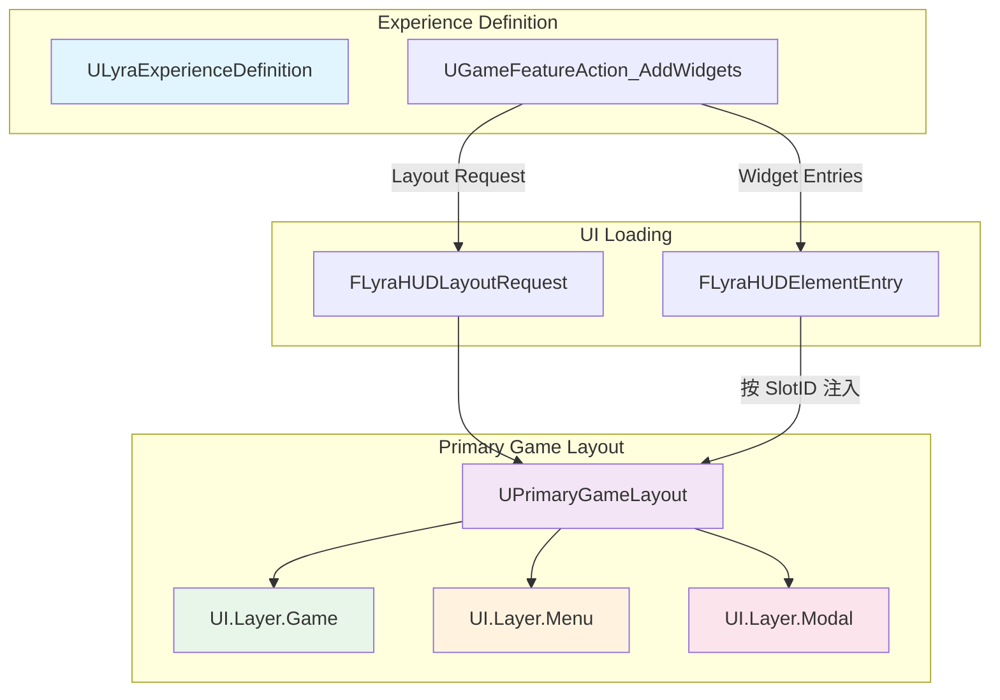
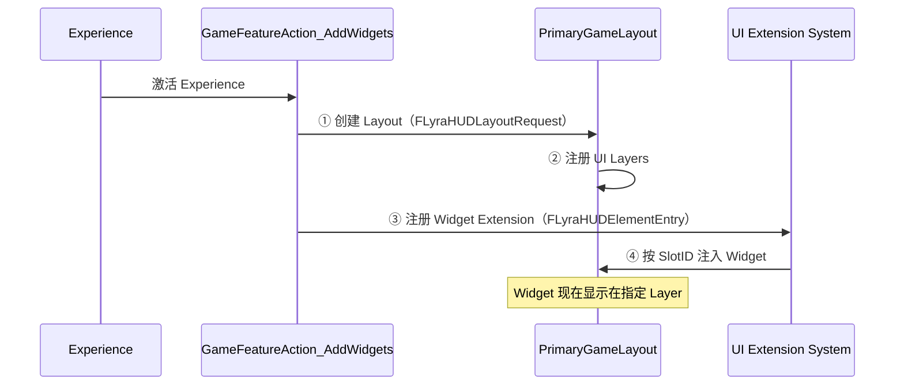
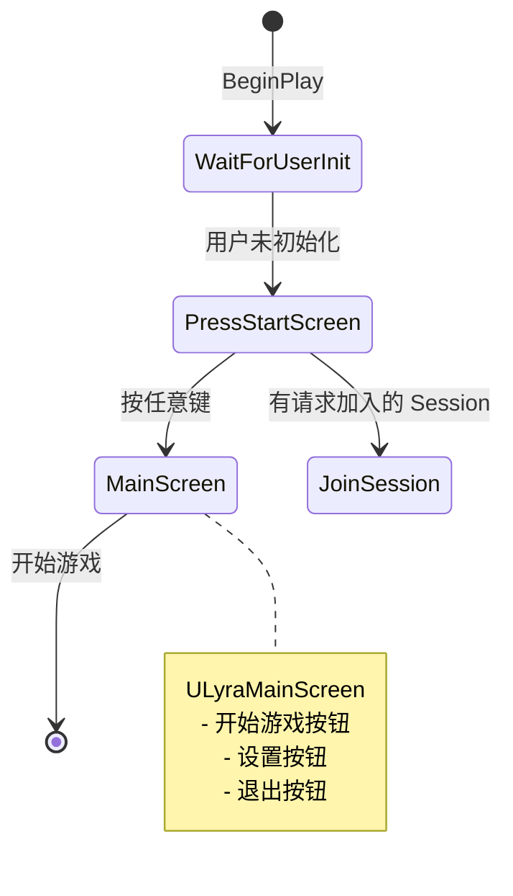
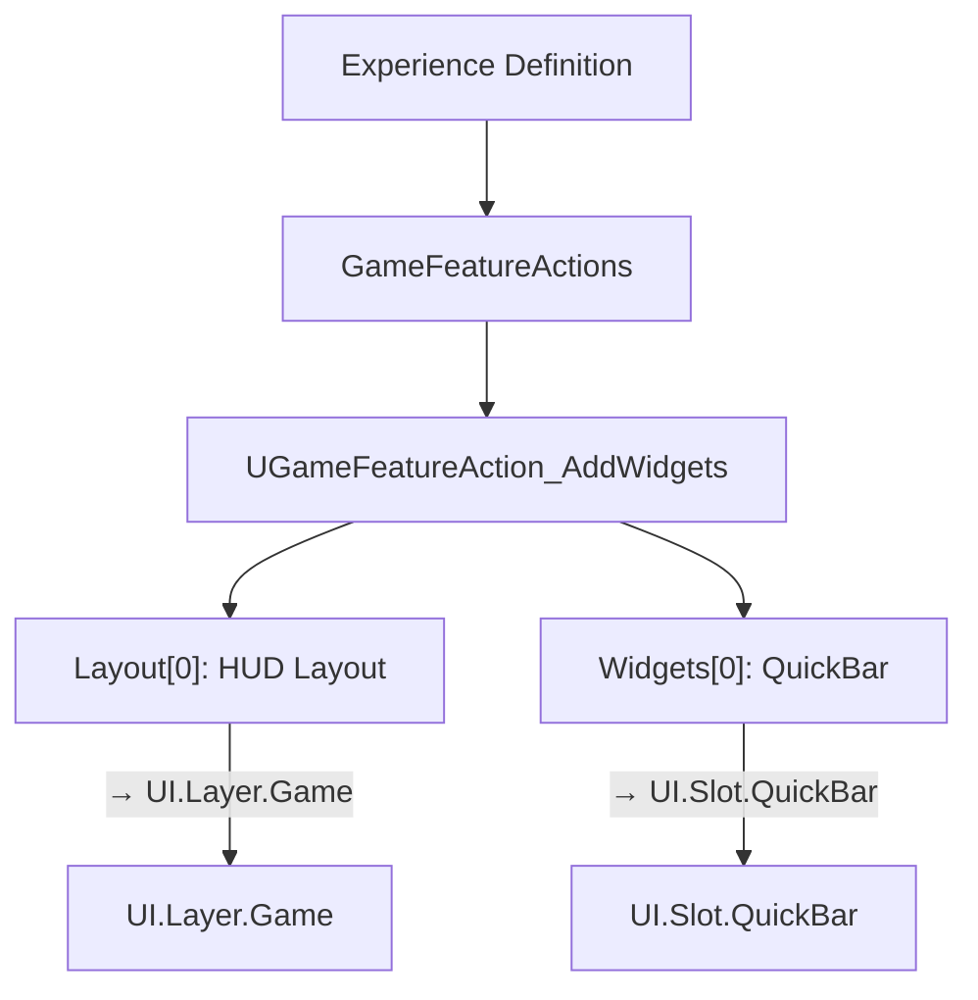
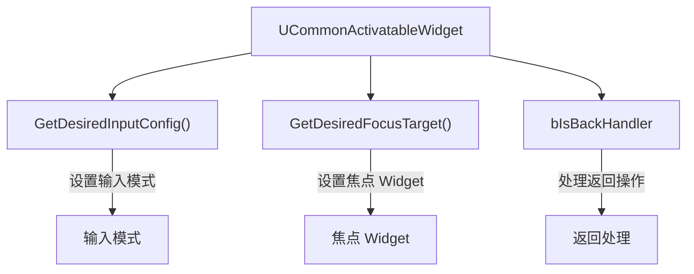
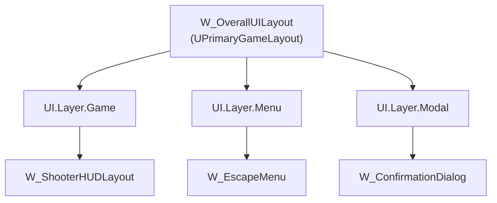

# Lyra项目UMG实战

> **难度**：Advanced  
> **前置知识**：[[30-tutorials/umg/07-UMG中的输入处理|UMG 输入处理]]、[[30-tutorials/game-feature/04-Lyra中的ExperienceSystem实践|Lyra Experience 系统]]

## 1. 概述

Lyra 的 UI 架构与默认 UMG 用法有显著区别：

- **CommonUI 集成**：使用 `UCommonActivatableWidget` 替代原生 `UUserWidget`
- **Experience-driven UI 加载**：通过 `UGameFeatureAction_AddWidgets` 在 Experience 中声明 UI
- **UI Layer 系统**：使用 `UPrimaryGameLayout` 和 GameplayTag 管理 UI 层级
- **ControlFlow 前端**：使用 `FControlFlow` 管理前端 UI 流程



---

## 2. Lyra UI 架构分析

### 2.1 Experience-driven UI 加载

Lyra 通过 `UGameFeatureAction_AddWidgets` 在 Experience 中声明需要加载的 UI 元素。

**`FLyraHUDLayoutRequest` 结构体**：

```cpp
// Source/LyraGame/GameFeatures/GameFeatureAction_AddWidget.h (L14-26)
struct FLyraHUDLayoutRequest
{
    // 要生成的 Layout Widget（通常是 UPrimaryGameLayout 子类）
    TSoftClassPtr<UCommonActivatableWidget> LayoutClass;
    
    // 注入的 Layer ID（使用 GameplayTag 标识）
    FGameplayTag LayerID;
};
```

**`FLyraHUDElementEntry` 结构体**：

```cpp
// Source/LyraGame/GameFeatures/GameFeatureAction_AddWidget.h (L29-41)
struct FLyraHUDElementEntry
{
    // 要生成的 Widget
    TSoftClassPtr<UUserWidget> WidgetClass;
    
    // 注入的 Slot ID（决定 Widget 在 Layout 中的位置）
    FGameplayTag SlotID;
};
```

**加载流程**：



### 2.2 UI Layer 系统

Lyra 使用 GameplayTag 标识 UI 层：

| GameplayTag | 用途 | 示例 Widget |
|-------------|------|--------------|
| `UI.Layer.Game` | HUD 层（游戏中进行时） | `W_ShooterHUDLayout` |
| `UI.Layer.Menu` | 菜单层（暂停、设置） | `W_EscapeMenu` |
| `UI.Layer.Modal` | 模态层（弹出框） | `W_ConfirmationDialog` |

**`UPrimaryGameLayout` 管理 Layer Stack**：

```cpp
// Engine/Plugins/Runtime/CommonUI/Source/CommonUI/Public/PrimaryGameLayout.h
UCLASS()
class UPrimaryGameLayout : public UCommonActivatableWidget
{
    GENERATED_BODY()
    
public:
    // 将 Widget 推入指定 Layer
    UFUNCTION(BlueprintCallable, Category="Layout")
    UCommonActivatableWidget* PushContentToLayer(
        FGameplayTag LayerTag,
        TSubclassOf<UCommonActivatableWidget> WidgetClass
    );
    
    // 注册 Layer（在 Widget Blueprint 中调用）
    UFUNCTION(BlueprintCallable, Category="Layout")
    void RegisterLayer(FGameplayTag LayerTag);
};
```

### 2.3 `ULyraHUDLayout` — HUD 布局

`ULyraHUDLayout` 是 Lyra 的 HUD 布局基类，管理：

- **Escape 菜单触发**：监听 "UI_Menu" 输入动作
- **Controller 断连检测**：处理控制器断开时的 UI 显示

```cpp
// Source/LyraGame/UI/LyraHUDLayout.h (L82-83)
/** The menu to be displayed when the user presses "Escape" */
UPROPERTY(EditDefaultsOnly)
TSoftClassPtr<UCommonActivatableWidget> EscapeMenuClass;
```

**Escape 菜单触发流程**：

```cpp
// Source/LyraGame/UI/LyraHUDLayout.cpp
void ULyraHUDLayout::HandleEscapeAction()
{
    if (EscapeMenuClass)
    {
        // 将 Escape 菜单推入 Menu 层
        UPrimaryGameLayout* RootLayout = UPrimaryGameLayout::GetPrimaryGameLayoutForPlayer(GetOwningLocalPlayer());
        if (RootLayout)
        {
            RootLayout->PushContentToLayer(
                TAG_UI_LAYER_MENU,  // GameplayTag: "UI.Layer.Menu"
                EscapeMenuClass
            );
        }
    }
}
```

**Controller 断连处理**：

```cpp
// Source/LyraGame/UI/LyraHUDLayout.h (L41)
void HandleInputDeviceConnectionChanged(
    EInputDeviceConnectionState NewConnectionState,
    FPlatformUserId PlatformUserId,
    FInputDeviceId InputDeviceId
);
```

当所有控制器断开时，显示 `ControllerDisconnectedScreen`：

```cpp
// Source/LyraGame/UI/LyraHUDLayout.h (L88-89)
/** The widget displayed when all controllers are disconnected */
UPROPERTY(EditDefaultsOnly, Category="Controller Disconnect Menu")
TSubclassOf<ULyraControllerDisconnectedScreen> ControllerDisconnectedScreen;
```

---

## 3. CommonUI 集成实践

### 3.1 `ULyraActivatableWidget` — 输入模式管理

Lyra 所有可激活 Widget 的基类，核心功能是管理输入模式。

**输入模式枚举**：

```cpp
// Source/LyraGame/UI/LyraActivatableWidget.h (L11-18)
UENUM(BlueprintType)
enum class ELyraWidgetInputMode : uint8
{
    Default,      // 不修改输入模式
    GameAndMenu,  // 游戏和菜单输入都接收
    Game,         // 仅游戏输入
    Menu          // 仅菜单输入
};
```

**配置属性**：

```cpp
// Source/LyraGame/UI/LyraActivatableWidget.h (L40-46)
/** The desired input mode to use while this UI is activated */
UPROPERTY(EditDefaultsOnly, Category = Input)
ELyraWidgetInputMode InputConfig = ELyraWidgetInputMode::Default;

/** The desired mouse behavior when the game gets input */
UPROPERTY(EditDefaultsOnly, Category = Input)
EMouseCaptureMode GameMouseCaptureMode = EMouseCaptureMode::CapturePermanently;
```

### 3.2 `ULyraButtonBase` — 统一按钮样式

Lyra 使用 `ULyraButtonBase` 统一所有按钮的视觉样式。

**核心特性**：

- 支持多种按钮样式（Primary、Secondary、Destructive 等）
- 集成 `UCommonButton` 的交互特性
- 支持 Icon + Text 组合

```cpp
// Source/LyraGame/UI/LyraButtonBase.h
UCLASS()
class ULyraButtonBase : public UCommonButton
{
    GENERATED_BODY()
    
public:
    // 设置按钮样式（从 DataTable 读取）
    UFUNCTION(BlueprintCallable, Category="Lyra|UI")
    void SetButtonStyle(FName StyleRowName);
    
protected:
    // 按钮图标
    UPROPERTY(BlueprintReadOnly, meta=(BindWidget))
    TObjectPtr<UImage> IconImage;
    
    // 按钮文本
    UPROPERTY(BlueprintReadOnly, meta=(BindWidget))
    TObjectPtr<UCommonTextBlock> LabelText;
};
```

### 3.3 `ULyraTabListWidgetBase` — 标签页容器

管理标签页切换的通用组件。

**功能**：

- 动态生成标签页按钮
- 管理标签页激活状态
- 支持预定义 Tab 列表

### 3.4 `ULyraActionWidget` — Enhanced Input Action 图标

显示 Enhanced Input Action 的按键图标。

```cpp
// Source/LyraGame/UI/LyraActionWidget.h
UCLASS()
class ULyraActionWidget : public UCommonUserWidget
{
    GENERATED_BODY()
    
public:
    // 要显示的 Input Action
    UPROPERTY(EditAnywhere, BlueprintReadOnly, Category="Input")
    TObjectPtr<const UInputAction> InputAction;
    
    // 当 Input Action 变化时更新图标
    UFUNCTION(BlueprintCallable, Category="Lyra|UI")
    void UpdateActionIcon();
};
```

---

## 4. 前端流程

### 4.1 `ULyraFrontendStateComponent` — 前端状态管理

Lyra 使用 `UGameStateComponent` 管理前端流程。

```cpp
// Source/LyraGame/UI/Frontend/LyraFrontendStateComponent.h (L23-25)
UCLASS(Abstract)
class ULyraFrontendStateComponent : public UGameStateComponent, public ILoadingProcessInterface
{
    GENERATED_BODY()
```

**ControlFlow 驱动**：

```cpp
// Source/LyraGame/UI/Frontend/LyraFrontendStateComponent.h (L47-50)
void FlowStep_WaitForUserInitialization(FControlFlowNodeRef SubFlow);
void FlowStep_TryShowPressStartScreen(FControlFlowNodeRef SubFlow);
void FlowStep_TryJoinRequestedSession(FControlFlowNodeRef SubFlow);
void FlowStep_TryShowMainScreen(FControlFlowNodeRef SubFlow);
```

**前端流程**：



**关键属性**：

```cpp
// Source/LyraGame/UI/Frontend/LyraFrontendStateComponent.h (L54-58)
/** Press Start 屏幕 Widget Class */
UPROPERTY(EditAnywhere, Category = UI)
TSoftClassPtr<UCommonActivatableWidget> PressStartScreenClass;

/** 主屏幕 Widget Class */
UPROPERTY(EditAnywhere, Category = UI)
TSoftClassPtr<UCommonActivatableWidget> MainScreenClass;
```

---

## 5. 移动端触控支持

Lyra 在 `Content/UI/Hud/` 中提供了移动端触控按钮和摇杆。

**移动端控件**：

| Widget | 功能 |
|--------|------|
| `W_TouchJoystick` | 虚拟摇杆 |
| `W_TouchButton` | 触控按钮 |
| `W_MobileHUD` | 移动端 HUD 布局 |

**触控按钮实现**：

```cpp
// 使用 UCommonButton 作为基类
// 监听 Touch 事件而非 Mouse 事件
// 支持多点触控（多个按钮同时按下）
```

---

## 6. Lyra UI 架构设计优势

### 6.1 设计优势

1. **Experience-driven**：UI 加载与 Experience 绑定，支持动态切换
2. **Layer 系统**：清晰的 UI 层级管理，避免 Z-Order 混乱
3. **CommonUI 集成**：统一的输入模式管理、焦点管理
4. **ControlFlow 前端**：可预测的前端流程，易于扩展

### 6.2 可复用设计模式

**模式 1：Experience + GameFeatureAction 加载 UI**



**模式 2：Activatable Widget + InputConfig**



**模式 3：PrimaryGameLayout + Layer Tag**



---

## 7. 总结与要点

### 核心要点

1. **Experience-driven UI 加载**：通过 `UGameFeatureAction_AddWidgets` 声明式加载 UI
2. **UI Layer 系统**：使用 `UPrimaryGameLayout` 和 GameplayTag 管理层级
3. **CommonUI 集成**：`UCommonActivatableWidget` 管理输入模式和焦点
4. **ControlFlow 前端**：`ULyraFrontendStateComponent` 驱动前端流程

### 最佳实践

- 使用 `UCommonActivatableWidget` 替代原生 `UUserWidget`
- 在 Experience 中声明 UI 加载，而非硬编码
- 使用 GameplayTag 标识 UI Layer，便于扩展
- 移动端使用 `UCommonButton` 并处理 Touch 事件

### 相关页面

- [[30-tutorials/game-feature/04-Lyra中的ExperienceSystem实践|Lyra Experience 系统]]
- [[30-tutorials/umg/07-UMG中的输入处理|UMG 输入处理]]
- [[30-tutorials/input-system/05-Lyra实践InputTag与GAS联动详解|Lyra 输入实践]]

---

**导航**: ← [[30-tutorials/umg/07-UMG中的输入处理|上一课：UMG 中的输入处理]] · [[index|↑ index]] · [[30-tutorials/umg/09-UMG性能优化|下一课：UMG 性能优化]] →

<!-- /nav:auto -->

> **源码验证**：
> - `Source/LyraGame/GameFeatures/GameFeatureAction_AddWidget.h` — Experience-driven UI 加载
> - `Source/LyraGame/UI/LyraHUDLayout.h` — HUD 布局管理
> - `Source/LyraGame/UI/Frontend/LyraFrontendStateComponent.h` — 前端流程
> - `Source/LyraGame/UI/LyraActivatableWidget.cpp` — 输入模式管理

*最后更新：2026-05-19*

<!-- nav:auto -->

---

**导航**: ← [[30-tutorials/umg/07-UMG中的输入处理|07-UMG中的输入处理]] · [[30-tutorials/umg/09-UMG性能优化|09-UMG性能优化]] →

<!-- /nav:auto -->
