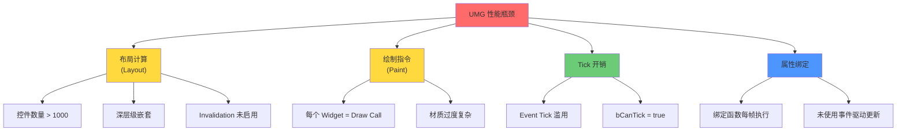
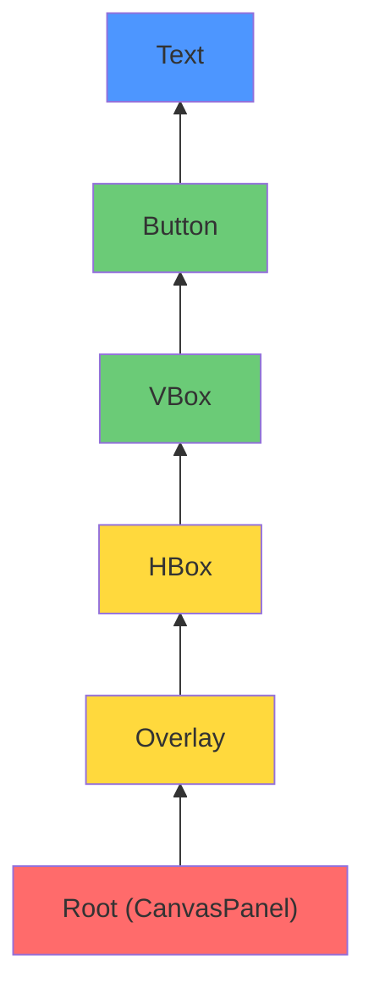
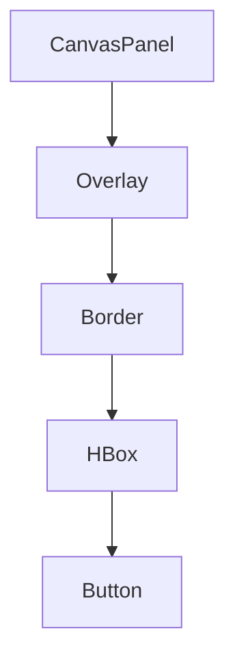
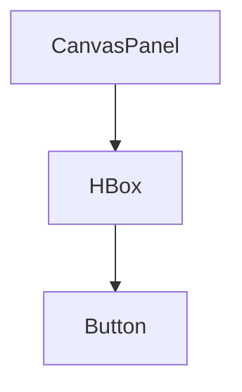
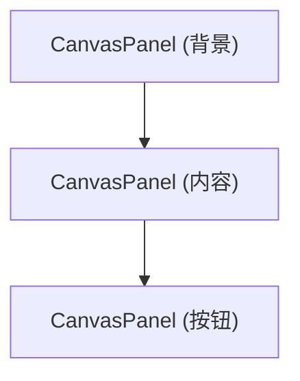
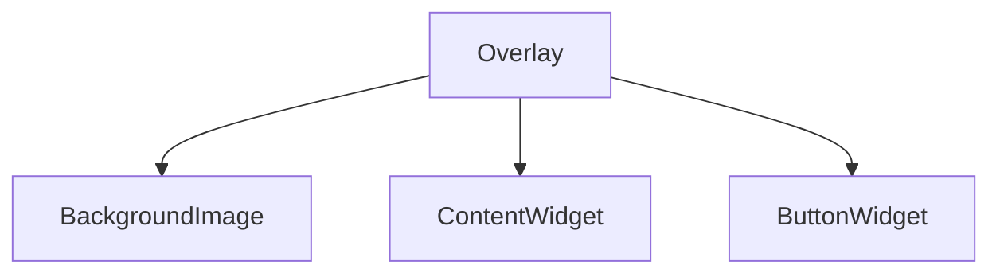
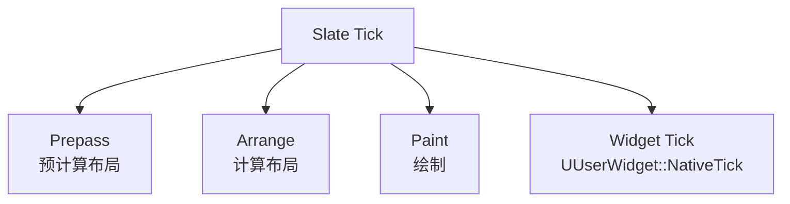

# UMG性能优化

> **难度**：Advanced  
> **前置知识**：[[30-tutorials/umg/01-UMG基础与核心类架构|UMG 基础]]、[[30-tutorials/performance-optimization/01-性能分析工具|性能分析工具]]

## 1. 概述

UMG 可能成为性能瓶颈的原因：

- **每一帧布局计算**：Slate 需要重新计算 Widget 位置和大小
- **属性绑定每帧执行**：Blueprint 绑定函数每帧都被调用
- **Tick 开销**：每个 Widget 的 Tick 都会被执行
- **Draw Call 开销**：每个 UMG Widget 都对应 Slate 绘制指令



---

## 2. 性能陷阱

### 2.1 过多控件数量

**问题**：每个 UWidget 都有 Slate 对应物，控件数量 > 1000 时性能下降明显。

**影响**：
- 布局计算复杂度：O(N × depth)
- 内存占用：每个 Widget 对象 ~100-500 字节
- Draw Call 数量：每个 Widget 可能产生多个 Draw Call

**典型场景**：
```
❌ 错误：在一个 Widget Blueprint 中放置 2000 个 Image
✅ 正确：使用 UListView / UTileView 虚拟化列表
```

### 2.2 深层级嵌套

**问题**：CanvasPanel 嵌套 Overlay 嵌套 HBox... 布局计算复杂度随深度线性增长。

**布局计算流程**：



**深度 5 的布局计算成本**：每个 Tick 需要遍历 5 层，每层都可能触发子 Widget 重新布局。

### 2.3 Tick 滥用

**问题**：每个 Widget 的 Tick 都会被执行，即使内容没有变化。

**`UUserWidget` 的 Tick 控制**：

```cpp
// Engine/Source/Runtime/UMG/Public/Blueprint/UserWidget.h
/** Controls whether ticking is enabled or disabled for this widget. */
UPROPERTY(EditAnywhere, Category = "Behavior")
bool bCanTick = false;
```

**默认值**：`bCanTick = false`（UE 5.1+）

**Blueprint 中的 Tick**：

```
❌ 错误：在 Widget Blueprint 的 Event Tick 中写逻辑
✅ 正确：使用事件驱动（OnClicked、OnValueChanged）
```

### 2.4 材质过度复杂

**问题**：UMG 材质（Material）在每一帧都重新计算。

**影响**：
- 每个使用复杂材质的 Widget 增加 GPU 开销
- 半透明材质增加 Overdraw

**优化方向**：
- 使用简单的 Material Instance 而非复杂 Material
- 避免 Runtime 动态修改 Material 参数

### 2.5 属性绑定每帧执行

**问题**：Blueprint 中的属性绑定函数每帧都被调用。

**示例**：

```
❌ 错误：
    ProgressBar.Visibility = GetVisibilityBinding()
    （每帧调用 GetVisibilityBinding）

✅ 正确：
    // 在状态变化时手动更新
    void OnHealthChanged()
    {
        ProgressBar->SetVisibility(ESlateVisibility::Visible);
    }
```

### 2.6 Event Tick 滥用

**问题**：在 Widget Blueprint 的 Event Tick 中写逻辑。

**Tick 成本**：
- 100 个 Widget 每帧 Tick = 100 次 Blueprint 虚拟机调用
- 每个 Tick 事件 ~0.01-0.05ms，100 个 = 1-5ms

---

## 3. 优化策略

### 3.1 减少控件数量

**策略 1：使用虚拟化列表**

`UListView` / `UTileView` 只生成可见区域的控件。

```cpp
// 10000 个数据项，但只生成 ~20 个 Widget
ListView->SetListItems(MyDataArray);  // 10000 个
// 实际 Widget 数量 = 可见区域 / 每项高度 ≈ 20
```

**策略 2：使用 Slate 原生控件绘制**

参考 Lyra 的 `SLyraLatencyGraph`：

```cpp
// Source/LyraGame/UI/PerformanceStats/LyraPerfStatWidgetBase.h (L17-103)
class SLyraLatencyGraph : public SLeafWidget
{
public:
    SLATE_BEGIN_ARGS(SLyraLatencyGraph)
        : _DesiredSize(150, 50),
          _MaxLatencyToGraph(33.0),
          _LineColor(255, 255, 255, 255),
          _BackgroundColor(0, 0, 0, 128)
    {
        _Clipping = EWidgetClipping::ClipToBounds;
    }
    // ...
};
```

**优势**：
- 单个 Slate 控件绘制整个图表
- 无需创建多个 UMG Image 控件
- 直接操作 FSlateWindowElementList，性能最优

### 3.2 简化层级

**策略 1：避免不必要的 Container 嵌套**

**❌ 错误**：


**✅ 正确**：


**策略 2：使用 Overlay 代替多个 CanvasPanel**

**❌ 错误**：


**✅ 正确**：


### 3.3 禁用不需要的 Tick

**Blueprint 中**：
1. 取消勾选 "Is Variable"（减少 UPROPERTY 开销）
2. 取消勾选 "Tick in Editor"（编辑器性能）
3. 设置 `bCanTick = false`

**C++ 中**：

```cpp
// 禁用 Tick
MyWidget->SetCanTick(false);

// 或者重载
virtual bool NativeCanTick() const override
{
    return false;  // 禁用 Tick
}
```

### 3.4 优化材质

**策略 1：使用简单的 Material Instance**

```
❌ 错误：每个 Image 使用动态 Material 并每帧修改参数
✅ 正确：使用 Material Instance，参数在构造函数中设置
```

**策略 2：避免 Runtime 动态修改 Material 参数**

```cpp
// ❌ 错误：每帧修改
void UMyWidget::NativeTick(const FGeometry& MyGeometry, float InDeltaTime)
{
    MID->SetScalarParameterValue("Opacity", Opacity);  // 每帧！
}

// ✅ 正确：只在值变化时修改
void UMyWidget::OnOpacityChanged(float NewOpacity)
{
    if (CachedOpacity != NewOpacity)
    {
        CachedOpacity = NewOpacity;
        MID->SetScalarParameterValue("Opacity", NewOpacity);
    }
}
```

### 3.5 优化属性绑定

**策略 1：使用事件驱动更新**

```
❌ 错误：使用属性绑定
    Button.Visibility = GetButtonVisibility()  // 每帧调用

✅ 正确：使用事件
    void OnGameStateChanged()
    {
        Button->SetVisibility(ShouldShowButton() ? 
            ESlateVisibility::Visible : 
            ESlateVisibility::Collapsed);
    }
```

**策略 2：使用 `INotifyFieldValueChanged`**

```cpp
// UWidget 已实现 INotifyFieldValueChanged
// 可以在属性变化时触发更新，而非每帧检查

UCLASS()
class UMyWidget : public UUserWidget, public INotifyFieldValueChanged
{
    // 当绑定的属性变化时自动通知
    // 无需每帧检查
};
```

---

## 4. Lyra 性能实践

### 4.1 `SLyraLatencyGraph` — Slate 原生绘制

Lyra 使用 `Slate` 原生控件绘制延迟图表，绕过 UMG。

**`SLyraLatencyGraph` 实现**：

```cpp
// Source/LyraGame/UI/PerformanceStats/LyraPerfStatWidgetBase.h (L40-46)
/** Called with the elements to be drawn */
virtual int32 OnPaint(
    const FPaintArgs& Args,
    const FGeometry& AllottedGeometry,
    const FSlateRect& MyClippingRect,
    FSlateWindowElementList& OutDrawElements,
    int32 LayerId,
    const FWidgetStyle& InWidgetStyle,
    bool bParentEnabled) const override;
```

**`OnPaint` 直接绘制图表**：

```cpp
// Source/LyraGame/UI/PerformanceStats/LyraPerfStatWidgetBase.cpp
int32 SLyraLatencyGraph::OnPaint(
    const FPaintArgs& Args,
    const FGeometry& AllottedGeometry,
    const FSlateRect& MyClippingRect,
    FSlateWindowElementList& OutDrawElements,
    int32 LayerId,
    const FWidgetStyle& InWidgetStyle,
    bool bParentEnabled) const
{
    // 直接操作 OutDrawElements，绘制线段和背景
    // 无需创建多个 UMG Widget
    
    DrawTotalLatency(AllottedGeometry, OutDrawElements, LayerId);
    
    return LayerId;
}
```

**性能对比**：

| 方案 | Widget 数量 | Draw Call | CPU 开销 |
|------|-------------|-----------|----------|
| UMG Image × 100 | 100 | 100+ | ~2-5ms |
| `SLyraLatencyGraph` | 1 | 1 | ~0.1ms |

### 4.2 `ULyraPerfStatGraph` — UMG 包装 Slate

Lyra 提供 `ULyraPerfStatGraph` 作为 UMG Widget，内部使用 `SLyraLatencyGraph`。

```cpp
// Source/LyraGame/UI/PerformanceStats/LyraPerfStatWidgetBase.h (L110-135)
UCLASS(meta = (DisableNativeTick))
class ULyraPerfStatGraph : public UUserWidget
{
    GENERATED_BODY()
    
protected:
    // 重写 RebuildWidget 创建 Slate 控件
    virtual TSharedRef<SWidget> RebuildWidget() override
    {
        SlateLatencyGraph = SNew(SLyraLatencyGraph);
        return SlateLatencyGraph.ToSharedRef();
    }
    
    TSharedPtr<SLyraLatencyGraph> SlateLatencyGraph;
};
```

**关键点**：
- `meta = (DisableNativeTick)` — 禁用 Tick
- `RebuildWidget()` — 创建 Slate 原生控件
- 在 UMG 中使用，但性能接近原生 Slate

### 4.3 Lyra 的 HUD 控件数量策略

**Lyra HUD 设计原则**：

1. **最小化 Widget 数量**：
   - `W_ShooterHUDLayout` 只包含核心控件
   - 使用 `UCommonActivatableWidget` 动态加载/卸载

2. **使用 GameFeatureAction 按需加载**：

```cpp
// Experience 中声明需要加载的 Widget
FLyraHUDElementEntry
{
    WidgetClass = W_QuickBar::StaticClass();
    SlotID = "UI.Slot.QuickBar";
}
// 只在需要时加载，而非始终存在
```

---

## 5. 性能分析工具

### 5.1 `stat ui` — UI 开销统计

**使用方法**：在控制台输入 `stat ui`

**输出示例**：

```
UI Stat
    Slate Tick Time: 2.45 ms
    Slate Draw Time: 1.23 ms
    Num Widgets: 342
    Num Draw Elements: 1024
```

**关键指标**：

| 指标 | 说明 | 正常值 |
|------|------|---------|
| `Slate Tick Time` | Slate 每帧处理逻辑时间 | < 2ms |
| `Slate Draw Time` | Slate 绘制时间 | < 3ms |
| `Num Widgets` | 当前 Widget 数量 | < 500 |
| `Num Draw Elements` | 绘制元素数量 | < 2000 |

### 5.2 Unreal Insights — Widget Tick 分析

**使用方法**：

1. 启动 Unreal Insights：`-trace=cpu,gpu,loadtime -statnamedevents`
2. 记录游戏会话
3. 在 Unreal Insights 中查看 `Slate` 和 `UMG` 相关 Track

**关键 Track**：



### 5.3 Widget Reflector — 调试工具

**打开方法**：`Window` → `Developer Tools` → `Widget Reflector`

**功能**：
- 查看当前所有 Widget 的层级结构
- 查看每个 Widget 的绘制开销
- 查看 Widget 的 Invalidtion 状态

---

## 6. 性能优化清单（Checklist）

### 6.1 设计阶段

- [ ] 控件数量 < 500（复杂界面可分屏）
- [ ] 层级深度 < 5
- [ ] 使用 `UPrimaryGameLayout` 管理层级（避免手动 Z-Order）
- [ ] 列表使用 `UListView` / `UTileView`

### 6.2 实现阶段

- [ ] 禁用不需要的 Tick（`bCanTick = false`）
- [ ] 不使用属性绑定，使用事件驱动更新
- [ ] 不在 Event Tick 中写逻辑
- [ ] 使用简单的 Material Instance

### 6.3 高级优化

- [ ] 复杂图表使用 Slate 原生绘制（`SLeafWidget` + `OnPaint`）
- [ ] 使用 `InvalidationBox` 减少布局重新计算
- [ ] 使用 `RetainerBox` 降低绘制频率（静态内容）

### 6.4 验证阶段

- [ ] `stat ui` 确认 Slate Tick Time < 2ms
- [ ] Unreal Insights 确认无异常 Tick 开销
- [ ] Widget Reflector 确认无异常重绘

---

## 7. 总结与要点

### 核心要点

1. **减少控件数量**：使用虚拟化列表、Slate 原生绘制
2. **简化层级**：避免不必要的 Container 嵌套
3. **禁用 Tick**：`bCanTick = false`，使用事件驱动
4. **优化属性绑定**：使用事件驱动更新，而非每帧绑定

### 最佳实践

- 复杂图表使用 `SLeafWidget` + `OnPaint()` 直接绘制
- 使用 `UListView` / `UTileView` 虚拟化列表
- 使用 `InvalidationBox` 优化布局重新计算
- 使用 `stat ui` 和 Unreal Insights 定期分析性能

### 相关页面

- [[30-tutorials/performance-optimization/01-性能分析工具|性能分析工具]]
- [[30-tutorials/performance-optimization/02-CPU性能优化|CPU 性能优化]]
- [[30-tutorials/umg/03-UMG与Slate绑定机制深度分析|UMG 与 Slate 绑定机制]]

---

**导航**: ← [[30-tutorials/umg/08-Lyra项目UMG实战|上一课：Lyra 项目 UMG 实战]] · [[index|↑ index]] →

<!-- /nav:auto -->

> **源码验证**：
> - `Source/LyraGame/UI/PerformanceStats/LyraPerfStatWidgetBase.h` — `SLyraLatencyGraph` Slate 原生绘制
> - `Source/LyraGame/UI/PerformanceStats/LyraPerfStatWidgetBase.cpp` — `OnPaint()` 实现
> - `Engine/Source/Runtime/UMG/Public/Blueprint/UserWidget.h` — `bCanTick` 控制 Tick

*最后更新：2026-05-19*

<!-- nav:auto -->

---

**导航**: ← [[30-tutorials/umg/08-Lyra项目UMG实战|08-Lyra项目UMG实战]]

<!-- /nav:auto -->
