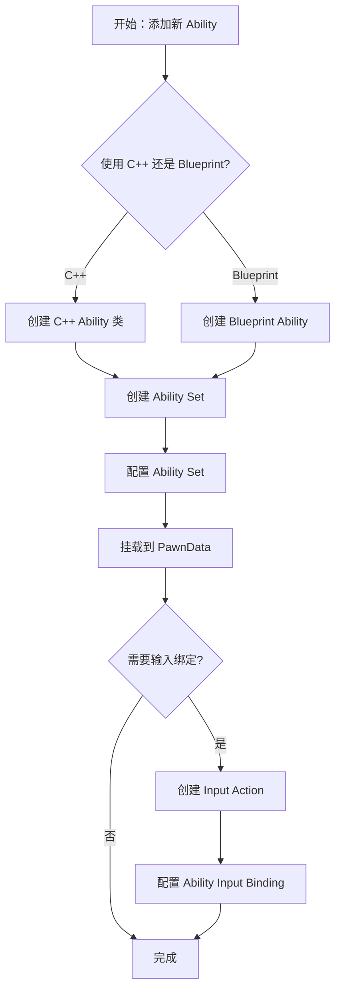
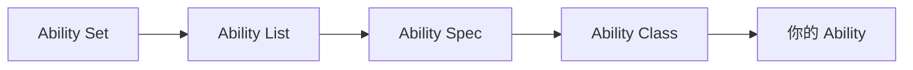
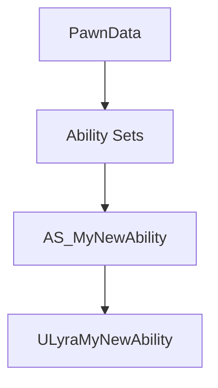

# 如何添加新的 Gameplay Ability

> **目标读者**：需要在 Lyra 项目中添加新技能的开发者
> **预计时间**：30-45 分钟
> **前置条件**：了解 UE5 GAS 基础概念

## 概述

在 Lyra 中添加新的 Gameplay Ability 需要完成以下步骤：
1. 创建 Ability 类（C++ 或 Blueprint）
2. 创建 Ability Set 包装 Ability
3. 将 Ability Set 挂载到 PawnData
4. 绑定输入动作（Optional）



## 步骤 1：创建 Ability 类

### 选项 A：使用 C++（推荐用于复杂逻辑）

在 `Source/LyraGame/AbilitySystem/` 目录下创建新的 Ability 类：

**头文件示例** (`LyraGame/AbilitySystem/MyNewAbility.h`)：

```cpp
// Copyright Epic Games, Inc. All Rights Reserved.

#pragma once

#include "LyraGameplayAbility.h"
#include "MyNewAbility.generated.h"

/**
 * 我的新技能
 */
UCLASS()
class ULyraMyNewAbility : public ULyraGameplayAbility
{
    GENERATED_BODY()

public:
    ULyraMyNewAbility();

protected:
    virtual bool CanActivateAbility(
        const FGameplayAbilitySpecHandle Handle,
        const FGameplayAbilityActorInfo* ActorInfo,
        const FGameplayTagContainer* SourceTags = nullptr,
        const FGameplayTagContainer* TargetTags = nullptr,
        FGameplayTagContainer* OptionalRelevantTags = nullptr
    ) const override;

    virtual void ActivateAbility(
        const FGameplayAbilitySpecHandle Handle,
        const FGameplayAbilityActorInfo* ActorInfo,
        const FGameplayAbilityActivationInfo ActivationInfo,
        const FGameplayEventData& TriggerEventData
    ) override;

    virtual void EndAbility(
        const FGameplayAbilitySpecHandle Handle,
        const FGameplayAbilityActorInfo* ActorInfo,
        const FGameplayAbilityActivationInfo ActivationInfo,
        bool bReplicateEndAbility,
        bool bWasCancelled
    ) override;
};
```

**源文件示例** (`LyraGame/AbilitySystem/MyNewAbility.cpp`)：

```cpp
// Copyright Epic Games, Inc. All Rights Reserved.

#include "MyNewAbility.h"
#include "AbilitySystem/LyraAbilitySystemComponent.h"

ULyraMyNewAbility::ULyraMyNewAbility()
{
    // 设置技能实例化策略
    InstancingPolicy = EGameplayAbilityInstancingPolicy::InstancedPerActor;
    
    // 设置网络执行策略
    NetExecutionPolicy = EGameplayAbilityNetExecutionPolicy::LocalPredicted;
    
    // 设置网络同步选项
    NetSecurityPolicy = EGameplayAbilityNetSecurityPolicy::ClientOrServer;
}

bool ULyraMyNewAbility::CanActivateAbility(
    const FGameplayAbilitySpecHandle Handle,
    const FGameplayAbilityActorInfo* ActorInfo,
    const FGameplayTagContainer* SourceTags,
    const FGameplayTagContainer* TargetTags,
    FGameplayTagContainer* OptionalRelevantTags
) const
{
    // 添加自定义激活条件检查
    if (!Super::CanActivateAbility(Handle, ActorInfo, SourceTags, TargetTags, OptionalRelevantTags))
    {
        return false;
    }
    
    // 例如：检查角色是否处于特定状态
    // return ActorInfo->AvatarActor->Implements<ULyraCharacterInterface>();
    
    return true;
}

void ULyraMyNewAbility::ActivateAbility(
    const FGameplayAbilitySpecHandle Handle,
    const FGameplayAbilityActorInfo* ActorInfo,
    const FGameplayAbilityActivationInfo ActivationInfo,
    const FGameplayEventData& TriggerEventData)
{
    // 激活技能逻辑
    // 例如：播放蒙太奇、施加 GameplayEffect、生成 Projectile 等
    
    // 示例：结束技能（如果是即时技能）
    EndAbility(Handle, ActorInfo, ActivationInfo, true, false);
}

void ULyraMyNewAbility::EndAbility(
    const FGameplayAbilitySpecHandle Handle,
    const FGameplayAbilityActorInfo* ActorInfo,
    const FGameplayAbilityActivationInfo ActivationInfo,
    bool bReplicateEndAbility,
    bool bWasCancelled
)
{
    // 清理资源
    
    Super::EndAbility(Handle, ActorInfo, ActivationInfo, bReplicateEndAbility, bWasCancelled);
}
```

### 选项 B：使用 Blueprint（推荐用于简单逻辑）

1. 在 Content Browser 中右键 → **Blueprints** → **Gameplay Ability**
2. 选择父类为 `LyraGameplayAbility` (或 `ULyraGameplayAbility`)
3. 命名并打开 Blueprint
4. 在 Event Graph 中实现技能逻辑

## 步骤 2：创建 Ability Set

Ability Set 是 Lyra 中授予 Ability 的推荐方式。

### 2.1 创建 Ability Set 资产

1. 在 Content Browser 中右键 → **Miscellaneous** → **Data Asset**
2. 选择父类为 `LyraAbilitySet` (或 `ULyraAbilitySet`)
3. 命名（例如：`AS_MyNewAbility`）

### 2.2 配置 Ability Set

打开刚创建的 Ability Set 资产，添加 Ability：



**配置项说明**：

| 属性 | 说明 | 示例值 |
|------|------|--------|
| **Ability** | 要授予的 Ability 类 | `ULyraMyNewAbility` |
| **Ability Level** | 技能等级 | `1` |
| **Input Tag** | 触发技能的输入标签 | `InputTag.Ability.MyNewAbility` |
| **Activation Policy** | 激活策略 | `OnInputTriggered` |

**示例配置**：

```
Ability List:
  [0]:
    Ability: ULyraMyNewAbility
    Ability Level: 1
    Input Tag: InputTag.Ability.MyNewAbility
    Activation Policy: OnInputTriggered
```

## 步骤 3：挂载到 PawnData

PawnData 是 Lyra 中定义角色能力的核心资产。

### 3.1 定位 PawnData

PawnData 通常位于：
- `Content/Lyra/Characters/Data/PawnData_Hero_[ClassName].uasset`

### 3.2 添加 Ability Set

1. 打开目标 PawnData 资产
2. 找到 **Ability Sets** 数组
3. 点击 **+** 添加元素
4. 选择刚创建的 Ability Set (`AS_MyNewAbility`)



## 步骤 4：绑定输入动作（Optional）

如果需要通过输入触发 Ability，需要配置 Input Action。

### 4.1 创建 Input Action（如果不存在）

1. 在 Content Browser 中右键 → **Input** → **Input Action**
2. 命名（例如：`IA_MyNewAbility`）
3. 配置 Trigger（例如：`Triggered`）

### 4.2 配置 Ability Input Binding

在 Ability Set 中配置 Input Tag：
- **Input Tag**：`InputTag.Ability.MyNewAbility`

确保在 Input Config（`LyraInputConfig`）中配置了对应的 Tag 映射。

## 验证步骤

完成上述步骤后，进行以下验证：

1. **编译项目**（如果使用 C++）
   ```bash
   # 编译 C++ 代码
   ./GenerateProjectFiles.sh
   # 在 IDE 中编译
   ```

2. **启动编辑器**，打开地图
3. **测试技能**：
   - 如果绑定了输入，按下对应按键
   - 如果没有绑定输入，通过 Console Command 测试：
     ```
     GiveAbility [AbilityClassName]
     ```

4. **检查 Log**：
   ```
   LogLyraAbilitySystem: Display: Granted ability: ULyraMyNewAbility
   ```

## 常见问题

### Q1: 技能无法激活

**可能原因**：
- `CanActivateAbility()` 返回 `false`
- 缺少必要的 GameplayTag
- Ability 的 `InstancingPolicy` 配置错误

**解决方法**：
- 在 `CanActivateAbility()` 中添加日志，检查返回条件
- 检查角色的 GameplayTag 是否符合要求
- 确认 `InstancingPolicy` 设置为 `InstancedPerActor` 或 `InstancedPerExecution`

### Q2: 技能激活但没有效果

**可能原因**：
- `ActivateAbility()` 中没有调用 `EndAbility()`
- 网络同步策略配置错误

**解决方法**：
- 确保在适当时机调用 `EndAbility()`
- 检查 `NetExecutionPolicy` 是否适合你的技能类型

### Q3: 输入绑定不生效

**可能原因**：
- Input Tag 未正确配置
- Input Config 中未映射对应 Tag

**解决方法**：
- 检查 Ability Set 中的 Input Tag 是否正确
- 在 `LyraInputConfig` 中确认 Tag 映射

## 最佳实践

1. **使用 Ability Set**：不要直接授予 Ability，通过 Ability Set 管理
2. **遵循命名规范**：`ULyra[AbilityName]Ability`、`AS_[AbilityName]`
3. **添加日志**：在关键路径添加 `UE_LOG` 便于调试
4. **支持网络同步**：正确配置 `NetExecutionPolicy` 和 `NetSecurityPolicy`
5. **使用 GameplayTags**：通过 Tag 控制 Ability 的激活和阻塞

## 相关页面

- [[10-architecture/subsystems/ability-system]] - 能力系统架构详解
- [[20-modules/cpp/ULyraAbilitySet]] - AbilitySet 类详解
- [[00-meta/conventions]] - 项目约定和命名规范

---
> 最后更新：2026-05-16

<!-- nav:auto -->

---

**导航**: [[40-runbooks/how-to-create-new-experience|how-to-create-new-experience]] →

<!-- /nav:auto -->
