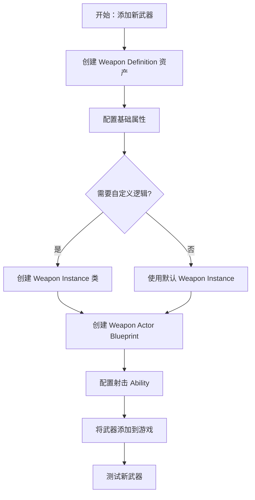
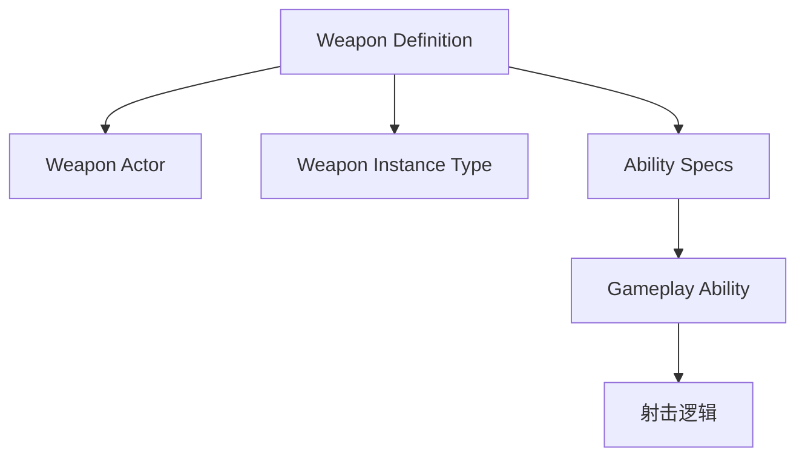
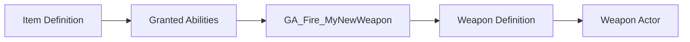

# 如何添加新的武器

> **目标读者**：需要在 Lyra 项目中添加新武器的开发者
> **预计时间**：45-60 分钟
> **前置条件**：了解 Lyra 的武器系统和 Gameplay Ability System

## 概述

在 Lyra 中添加新武器需要完成以下步骤：
1. 创建 Weapon Definition 资产
2. 配置 Weapon Instance 类（可选）
3. 创建 Weapon Actor Blueprint
4. 配置射击逻辑（Gameplay Ability）
5. 将武器添加到 Pawn Data 或 Item Definition



## 步骤 1：创建 Weapon Definition 资产

Weapon Definition 是 Lyra 中定义武器属性的核心资产。

### 1.1 创建资产

1. 在 Content Browser 中右键 → **Miscellaneous** → **Data Asset**
2. 选择父类为 `LyraWeaponDefinition`
3. 命名（例如：`WeaponDef_AssaultRifle`）
4. 保存到合适目录（例如：`Content/Lyra/Weapons/`）

### 1.2 配置基础属性

打开刚创建的 Weapon Definition 资产，配置以下属性：

| 属性 | 说明 | 示例值 |
|------|------|--------|
| **Weapon Actor** | 武器 Actor 类 | `BP_Weapon_AssaultRifle` |
| **Weapon Instance Type** | Weapon Instance 类 | `ULyraRangedWeaponInstance` |
| **Pickup Actor** | 拾取时的 Actor | `BP_Pickup_AssaultRifle` |
| **Inventory Item** | 库存物品定义 | `ItemDef_AssaultRifle` |
| **Ability Specs** | 武器关联的 Ability | `GA_Fire_AssaultRifle` |



## 步骤 2：配置 Weapon Instance 类（可选）

Weapon Instance 是武器的运行时实例，存储武器状态。

### 2.1 使用默认 Weapon Instance

对于简单武器，可以直接使用 `ULyraRangedWeaponInstance`。

### 2.2 创建自定义 Weapon Instance

如果需要自定义武器逻辑（如特殊射击模式、热量系统等）：

**C++ 头文件示例** (`LyraGame/Weapons/MyNewWeaponInstance.h`)：

```cpp
// Copyright Epic Games, Inc. All Rights Reserved.

#pragma once

#include "LyraRangedWeaponInstance.h"
#include "MyNewWeaponInstance.generated.h"

/**
 * 我的新武器实例
 */
UCLASS()
class ULyraMyNewWeaponInstance : public ULyraRangedWeaponInstance
{
    GENERATED_BODY()

public:
    ULyraMyNewWeaponInstance();

    // 自定义武器状态
    UFUNCTION(BlueprintCallable, Category="Weapon")
    float GetCustomHeat() const { return CustomHeat; }

    UFUNCTION(BlueprintCallable, Category="Weapon")
    void AddCustomHeat(float Amount);

protected:
    // 自定义热量系统
    UPROPERTY(BlueprintReadOnly, Category="Weapon")
    float CustomHeat;

    UPROPERTY(EditDefaultsOnly, Category="Weapon")
    float MaxHeat;

    UPROPERTY(EditDefaultsOnly, Category="Weapon")
    float HeatDecayRate;
};
```

**C++ 源文件示例** (`LyraGame/Weapons/MyNewWeaponInstance.cpp`)：

```cpp
// Copyright Epic Games, Inc. All Rights Reserved.

#include "MyNewWeaponInstance.h"

ULyraMyNewWeaponInstance::ULyraMyNewWeaponInstance()
    : CustomHeat(0.0f)
    , MaxHeat(100.0f)
    , HeatDecayRate(10.0f)
{
}

void ULyraMyNewWeaponInstance::AddCustomHeat(float Amount)
{
    CustomHeat = FMath::Clamp(CustomHeat + Amount, 0.0f, MaxHeat);
    
    // 检查是否过热
    if (CustomHeat >= MaxHeat)
    {
        // 触发过热逻辑
        // OnWeaponOverheated();
    }
}
```

## 步骤 3：创建 Weapon Actor Blueprint

Weapon Actor 是武器的视觉表现和物理表示。

### 3.1 创建 Blueprint

1. 在 Content Browser 中右键 → **Blueprint Class**
2. 选择父类为 `LyraWeaponInstance` (或 `ALyraWeaponInstance`)
3. 命名（例如：`BP_Weapon_MyNewWeapon`）
4. 打开 Blueprint

### 3.2 配置 Weapon Actor

在 Blueprint 中配置以下属性：

| 属性 | 说明 | 示例值 |
|------|------|--------|
| **Mesh** | 武器网格体 | `SK_AssaultRifle` |
| **Muzzle Flash** | 枪口火焰特效 | `NS_MuzzleFlash` |
| **Fire Sound** | 射击音效 | `SFX_Fire` |
| **Weapon Instance** | Weapon Instance 组件 | `ULyraMyNewWeaponInstance` |

### 3.3 添加视觉效果

1. **导入网格体**：将武器 FBX 导入到 `Content/Lyra/Weapons/Meshes/`
2. **配置材质**：应用合适的材质
3. **添加特效**：在枪口位置添加 `NS_MuzzleFlash` Particle System
4. **配置动画**：设置武器动画 Blueprint

## 步骤 4：配置射击逻辑（Gameplay Ability）

武器的射击逻辑通过 Gameplay Ability 实现。

### 4.1 创建射击 Ability

创建新的 Gameplay Ability（参见 [[40-runbooks/how-to-add-gameplay-ability]]）：

**Ability 类示例** (`LyraGame/Abilities/GA_Fire_MyNewWeapon.cpp`)：

```cpp
void ULyraGA_Fire_MyNewWeapon::ActivateAbility(
    const FGameplayAbilitySpecHandle Handle,
    const FGameplayAbilityActorInfo* ActorInfo,
    const FGameplayAbilityActivationInfo ActivationInfo,
    const FGameplayEventData& TriggerEventData)
{
    // 1. 播放射击蒙太奇
    PlayMontage(ShootMontage);
    
    // 2. 生成 Projectile
    SpawnProjectile(ProjectileClass);
    
    // 3. 应用后坐力
    ApplyRecoil();
    
    // 4. 消耗弹药
    ConsumeAmmo(1);
    
    // 5. 结束 Ability
    EndAbility(Handle, ActorInfo, ActivationInfo, true, false);
}
```

### 4.2 在 Weapon Definition 中引用 Ability

1. 打开 Weapon Definition 资产
2. 找到 **Ability Specs** 数组
3. 点击 **+** 添加元素
4. 选择刚创建的射击 Ability

## 步骤 5：将武器添加到游戏

有两种方式将武器添加到游戏中：

### 5.1 方式 A：通过 Pawn Data 授予

1. 打开 Pawn Data 资产（例如：`PawnData_Hero_Shooter`）
2. 找到 **Ability Sets** 数组
3. 添加包含武器射击 Ability 的 Ability Set

### 5.2 方式 B：通过 Item Definition 授予（推荐）

1. 创建 Item Definition 资产（右键 → **Miscellaneous** → **Data Asset** → 选择 `LyraInventoryItemDefinition`）
2. 配置 **Granted Abilities** 数组，添加武器射击 Ability
3. 在游戏中通过 Inventory 系统授予物品



## 验证步骤

完成上述步骤后，进行以下验证：

1. **编译项目**（如果使用 C++）
   ```bash
   # 编译 C++ 代码
   ./GenerateProjectFiles.sh
   # 在 IDE 中编译
   ```

2. **启动编辑器**，打开地图
3. **测试武器**：
   - 给予玩家武器（通过 Console Command 或 Inventory 系统）
   - 按下射击键，检查是否生成 Projectile
   - 检查枪口火焰和音效是否播放
   - 检查后坐力和弹药消耗

4. **检查 Log**：
   ```
   LogLyraWeapon: Display: Weapon fired: WeaponDef_AssaultRifle
   ```

## 常见问题

### Q1: 武器无法射击

**可能原因**：
- 射击 Ability 未正确授予
- 输入绑定未配置
- Ability 的 `CanActivateAbility()` 返回 `false`

**解决方法**：
- 检查 Pawn Data 或 Item Definition 中是否添加了 Ability Set
- 检查 Input Action 和 Input Tag 是否正确配置
- 在 Ability 中添加日志，检查 `CanActivateAbility()` 的返回值

### Q2: Projectile 未生成

**可能原因**：
- Projectile Class 未配置
- 生成位置或方向错误
- Projectile 蓝图未正确实现

**解决方法**：
- 检查 Weapon Definition 中的 Projectile Class 是否正确
- 在 Ability 中添加日志，检查生成参数
- 检查 Projectile Blueprint 的 `OnProjectileBounce` 或 `OnProjectileStop` 事件

### Q3: 弹药不消耗

**可能原因**：
- 弹药 Attribute 未配置
- `ConsumeAmmo()` 未调用或调用错误

**解决方法**：
- 检查 Weapon Instance 中的弹药 AttributeSet
- 在 Ability 中确保调用了 `ConsumeAmmo()`
- 检查 GameplayEffect 是否正确配置了弹药消耗

## 最佳实践

1. **使用 Weapon Instance**：存储武器状态，不要直接存储在 Weapon Actor 中
2. **通过 Ability 实现射击逻辑**：不要在 Weapon Actor 中直接实现射击
3. **支持网络同步**：正确配置 Ability 的 `NetExecutionPolicy`
4. **使用 Object Pooling**：对于频繁生成的 Projectile，使用对象池优化性能
5. **添加日志**：在关键路径添加 `UE_LOG` 便于调试

## 相关页面

- [[40-runbooks/how-to-add-gameplay-ability]] - 如何添加新的 Gameplay Ability
- [[10-architecture/subsystems/ability-system]] - 能力系统架构详解
- [[20-modules/cpp/ULyraWeaponInstance]] - Weapon Instance 类详解

---
> 最后更新：2026-05-16

<!-- nav:auto -->

---

**导航**: ← [[40-runbooks/how-to-create-new-experience|how-to-create-new-experience]] · [[40-runbooks/how-to-verify-network-replication-runtime|how-to-verify-network-replication-runtime]] →

<!-- /nav:auto -->
