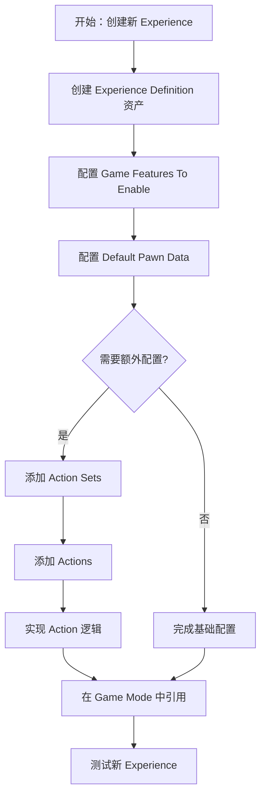
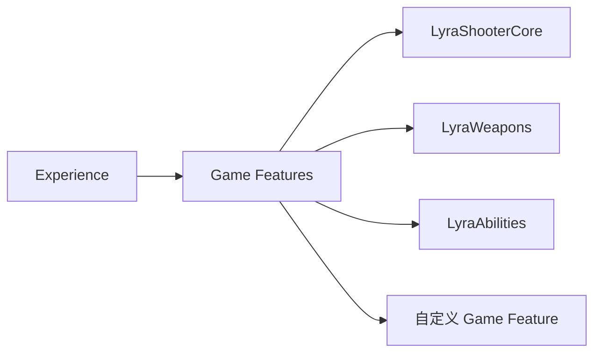
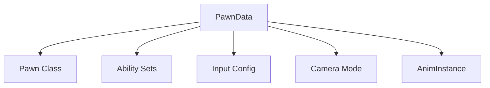
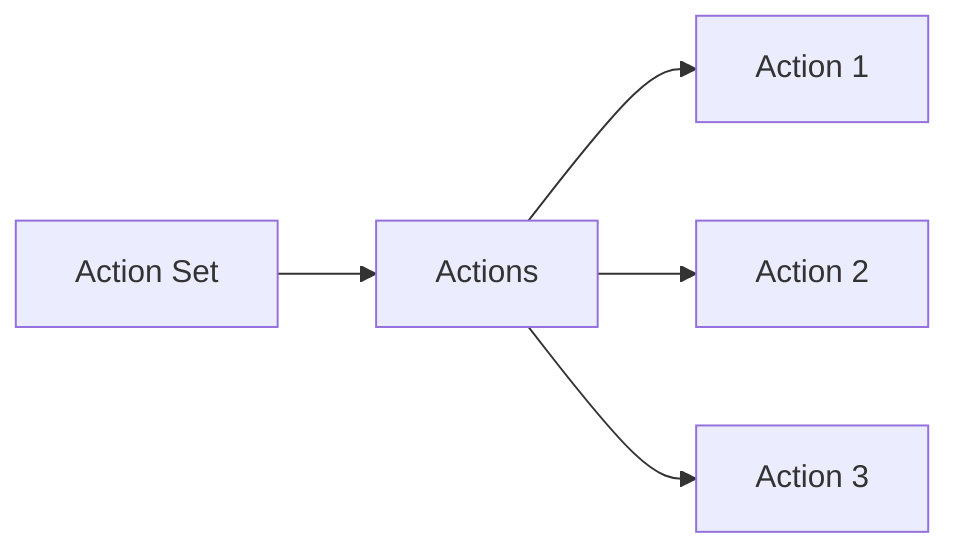

# 如何创建新的 Experience

> **目标读者**：需要在 Lyra 项目中添加新游戏模式/体验的开发者
> **预计时间**：45-60 分钟
> **前置条件**：了解 Lyra 的 Experience 系统（参见 [[10-architecture/subsystems/experience-system]]）

## 概述

Experience 是 Lyra 中定义游戏模式的核心资产。创建新的 Experience 需要完成以下步骤：
1. 创建 Experience Definition 资产
2. 配置 Game Features
3. 配置 Default Pawn Data
4. 添加 Action Sets（可选）
5. 添加 Actions（可选）
6. 在 Game Mode 中引用新的 Experience



## 步骤 1：创建 Experience Definition 资产

### 1.1 创建资产

1. 在 Content Browser 中右键 → **Miscellaneous** → **Data Asset**
2. 选择父类为 `LyraExperienceDefinition` (或 `ULyraExperienceDefinition`)
3. 命名（例如：`Experience_MyNewGameMode`）
4. 保存到合适目录（例如：`Content/Lyra/Experiences/`）

### 1.2 基础配置

打开刚创建的 Experience Definition 资产，配置以下基础属性：

| 属性 | 说明 | 示例值 |
|------|------|--------|
| **Default Gameplay Experience ID** | Experience 的唯一标识 | `MyNewGameMode` |
| **Game Features To Enable** | 需要加载的 Game Feature 插件 | `LyraShooterCore` |
| **Default Pawn Data** | 默认 Pawn 数据资产 | `PawnData_Hero_Standard` |
| **Actions** | 初始化时执行的 Action | `ULyraExperienceActionSet` |
| **Action Sets** | 批量 Action 集合 | `ActionSet_WeaponSystem` |

## 步骤 2：配置 Game Features

Game Features 是 Lyra 中模块化功能的核心机制。

### 2.1 添加新的 Game Feature

1. 在 **Game Features To Enable** 数组中点击 **+** 添加元素
2. 选择要启用的 Game Feature 插件

**常用 Game Feature 列表**：



| Game Feature | 说明 |
|--------------|------|
| `LyraShooterCore` | 射击核心功能（武器、弹药物理等） |
| `LyraWeapons` | 武器系统 |
| `LyraAbilities` | 技能系统 |
| `LyraItems` | 物品系统 |

### 2.2 创建自定义 Game Feature（可选）

如果需要创建新的 Game Feature：

1. **创建插件**：
   ```
   Edit → Plugins → New Plugin → Game Feature Plugin
   ```

2. **配置 `.uplugin` 文件**：
   ```json
   {
     "FileVersion": 3,
     "Version": 1,
     "VersionName": "1.0",
     "FriendlyName": "My New Feature",
     "Description": "My custom game feature",
     "Category": "Game Features",
     "CreatedBy": "Your Name",
     "EnabledByDefault": false,
     "CanContainContent": true,
     "IsBetaVersion": false,
     "Installed": false
   }
   ```

3. **添加内容**：在插件目录的 `Content/` 中添加资产

4. **在 Experience 中启用**：将插件名称添加到 `Game Features To Enable`

## 步骤 3：配置 Default Pawn Data

Pawn Data 定义了角色的能力、属性和外观。

### 3.1 选择现有 Pawn Data

从以下常用 Pawn Data 中选择：

| Pawn Data | 说明 |
|-----------|------|
| `PawnData_Hero_Standard` | 标准英雄角色 |
| `PawnData_Hero_Shooter` | 射击类英雄角色 |
| `PawnData_Hero_Stealth` | 潜行类英雄角色 |

### 3.2 创建自定义 Pawn Data（可选）

1. 在 Content Browser 中右键 → **Miscellaneous** → **Data Asset**
2. 选择父类为 `LyraPawnData`
3. 配置以下属性：



| 属性 | 说明 | 示例值 |
|------|------|--------|
| **Pawn Class** | Pawn 的 C++ 类 | `BP_LyraCharacter` |
| **Ability Sets** | 授予的 Ability Set | `AS_WeaponAbilities` |
| **Input Config** | 输入配置 | `InputData_Hero` |
| **Camera Mode** | 默认相机模式 | `LyraCameraMode_ThirdPerson` |
| **AnimInstance** | 动画实例类 | `ULyraAnimInstance` |

### 3.3 在 Experience 中引用 Pawn Data

1. 打开 Experience Definition 资产
2. 找到 **Default Pawn Data** 属性
3. 选择刚创建/选择的 Pawn Data 资产

## 步骤 4：添加 Action Sets（可选）

Action Sets 是批量 Action 的集合，用于组织复杂的初始化逻辑。

### 4.1 创建 Action Set

1. 在 Content Browser 中右键 → **Miscellaneous** → **Data Asset**
2. 选择父类为 `LyraExperienceActionSet`
3. 命名（例如：`ActionSet_MyNewGameMode`）

### 4.2 配置 Action Set

打开 Action Set 资产，添加 Actions：



**常用 Action 类型**：

| Action 类型 | 说明 |
|-------------|------|
| `ULyraExperienceAction_AddWidgets` | 添加 UI Widget |
| `ULyraExperienceAction_SpawnActors` | 生成 Actor |
| `ULyraExperienceAction_ApplyGameplayEffect` | 应用 GameplayEffect |

### 4.3 在 Experience 中引用 Action Set

1. 打开 Experience Definition 资产
2. 找到 **Action Sets** 数组
3. 点击 **+** 添加元素
4. 选择刚创建的 Action Set

## 步骤 5：添加 Actions（可选）

Actions 是 Experience 加载时执行的原子操作。

### 5.1 内置 Action 类型

Lyra 提供了以下内置 Action：

| Action 类 | 功能 |
|-----------|------|
| `ULyraExperienceAction_AddWidgets` | 向 HUD 添加 Widget |
| `ULyraExperienceAction_SpawnActors` | 在世界中生成 Actor |
| `ULyraExperienceAction_ApplyGameplayEffect` | 对角色应用 GameplayEffect |
| `ULyraExperienceAction_LoadMap` | 加载地图（通常用于过渡） |

### 5.2 创建自定义 Action（高级）

如果需要自定义初始化逻辑：

1. **创建 C++ 类**：

```cpp
// MyExperienceAction.h
UCLASS()
class ULyraMyExperienceAction : public ULyraExperienceAction
{
    GENERATED_BODY()

public:
    virtual void OnActionActivated() override;
};
```

```cpp
// MyExperienceAction.cpp
void ULyraMyExperienceAction::OnActionActivated()
{
    Super::OnActionActivated();
    
    // 自定义初始化逻辑
    // 例如：设置游戏参数、生成特定 Actor、初始化分数等
}
```

2. **在 Experience 或 Action Set 中引用**

## 步骤 6：在 Game Mode 中引用新的 Experience

### 6.1 定位 Game Mode

Lyra 的 Game Mode 通常位于：
- `Content/Lyra/GameModes/B_LyraGameMode.uasset`

### 6.2 配置 Default Experience

1. 打开 Game Mode 蓝图
2. 找到 **Default Experience** 属性
3. 选择刚创建的 Experience Definition 资产

**注意**：通常在生产环境中，Experience 是通过 `ULyraExperienceManagerComponent` 动态加载的，而不是硬编码在 Game Mode 中。

### 6.3 动态加载 Experience（推荐）

在 C++ 或 Blueprint 中动态加载 Experience：

```cpp
// C++ 示例
ULyraExperienceManagerComponent* ExperienceManager = ...;
ExperienceManager->LoadExperience(ExperienceDefinition);
```

```blueprint
// Blueprint 示例
// 调用 Load Experience 节点，传入 Experience Definition 资产
```

## 验证步骤

完成上述步骤后，进行以下验证：

1. **启动编辑器**，打开地图
2. **检查 Game Feature 加载**：
   - 打开 **Output Log**
   - 搜索：`LogGameFeatures: Display: Loaded Game Feature Plugin: MyFeature`
3. **检查 Pawn 生成**：
   - PIE（Play In Editor）
   - 确认 Pawn 使用正确的 Pawn Data
   - 检查 Ability 是否正确授予
4. **测试功能**：
   - 测试所有 Action 是否按预期执行
   - 验证 UI Widget 是否正确显示
   - 检查网络连接（如果支持多人）

## 常见问题

### Q1: Experience 加载失败

**可能原因**：
- Game Feature 插件未正确安装
- Experience Definition 资产路径错误
- 依赖的 Game Feature 缺失

**解决方法**：
- 检查 **Output Log** 中的错误信息
- 确认所有 `Game Features To Enable` 中的插件已安装
- 验证 Experience Definition 资产的引用是否正确

### Q2: Pawn Data 不生效

**可能原因**：
- Experience 未正确加载
- Pawn Data 资产配置错误
- Pawn Class 与 Pawn Data 不匹配

**解决方法**：
- 检查 Experience 是否成功加载
- 验证 Pawn Data 中的 Pawn Class 是否正确
- 在 PIE 中检查 Pawn 的 Ability System Component 是否授予了正确的 Ability

### Q3: Action 未执行

**可能原因**：
- Action 未正确添加到 Experience 或 Action Set
- Action 的激活条件未满足
- Action 执行过程中出错

**解决方法**：
- 在 **Output Log** 中搜索 Action 相关的日志
- 在 Action 的 `OnActionActivated()` 中添加日志
- 检查 Action 的依赖项是否满足

## 最佳实践

1. **模块化设计**：将功能拆分为独立的 Game Feature
2. **使用 Action Sets**：组织相关的 Actions，提高可维护性
3. **验证依赖**：确保所有 Game Feature 和 Asset 引用正确
4. **支持动态加载**：避免硬编码 Experience，使用 `ULyraExperienceManagerComponent` 动态加载
5. **添加日志**：在关键路径添加 `UE_LOG` 便于调试

## 相关页面

- [[10-architecture/subsystems/experience-system]] - 体验系统架构详解
- [[20-modules/cpp/ULyraExperienceDefinition]] - Experience Definition 类详解
- [[20-modules/cpp/ULyraExperienceManagerComponent]] - Experience Manager Component 详解
- [[40-runbooks/how-to-add-gameplay-ability]] - 如何添加新的 Gameplay Ability

---
> 最后更新：2026-05-16

<!-- nav:auto -->

---

**导航**: ← [[40-runbooks/how-to-add-gameplay-ability|how-to-add-gameplay-ability]] · [[40-runbooks/how-to-add-new-weapon|how-to-add-new-weapon]] →

<!-- /nav:auto -->
