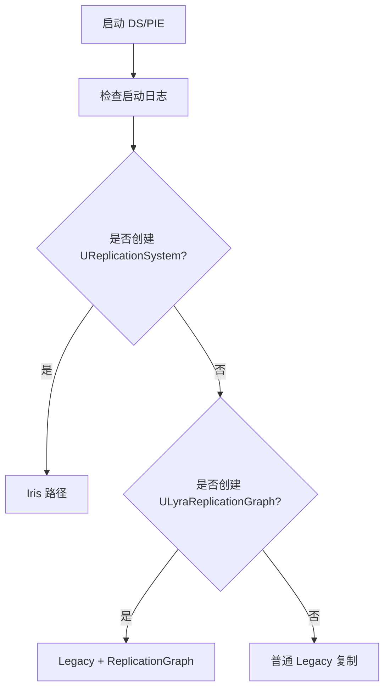
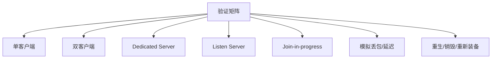

# 如何验证当前运行时网络复制路径

> 目标：确认 Lyra 当前运行时到底走 Legacy、ReplicationGraph 还是 Iris，避免只凭配置文件误判。

## 背景结论

当前仓库事实：

- `LyraStarterGame.uproject` 启用了 `Iris` 插件。
- `Source/LyraGame/LyraGame.Build.cs` 调用 `SetupIrisSupport(Target)`。
- `DefaultEngine.ini` 配置了 Iris descriptor / bridge。
- `DefaultGame.ini` 中 `bDisableReplicationGraph=True`，RepGraph 默认禁用。
- 当前项目 `Config/` 中未发现显式 `net.Iris.UseIrisReplication=1`、Iris NetDriver 或 `NetDriverDefinitions` 覆盖。

UE5.7 源码事实：

- `net.Iris.UseIrisReplication` 默认值是 `0`。
- `BaseEngine.ini` 允许 `GameNetDriver` 使用 Iris：`+IrisNetDriverConfigs=(NetDriverDefinition=GameNetDriver, bCanUseIris=true)`。
- “允许使用 Iris”不等于“实际启用 Iris”。最终由 `UEngine::WillNetDriverUseIris`、CVar、命令行、GameInstance/GameMode 共同决定。

## 验证路径总览



## 步骤 1：确认配置文件

检查：

- `LyraStarterGame.uproject` 是否启用 `Iris` 插件。
- `LyraGame.Build.cs` 是否调用 `SetupIrisSupport(Target)`。
- `DefaultEngine.ini` 是否有：
  - `[/Script/IrisCore.ReplicationStateDescriptorConfig]`
  - `[/Script/IrisCore.ObjectReplicationBridgeConfig]`
  - `net.SubObjects.DefaultUseSubObjectReplicationList=1`
- `DefaultGame.ini` 是否有：
  - `[/Script/LyraGame.LyraReplicationGraphSettings]`
  - `bDisableReplicationGraph=True/False`

## 步骤 2：用启动参数强制验证 Iris

用于测试时可用命令行强制。以下命令需按本机 UE 安装路径和目标平台调整；macOS 示例：

```bash
"/Users/Shared/Epic Games/UE_5.7/Engine/Binaries/Mac/UnrealEditor.app/Contents/MacOS/UnrealEditor" \
  "/Users/robert/Documents/UECode/LyraStarterGame/LyraStarterGame.uproject" \
  -game -log -UseIrisReplication=1
```

禁用 Iris 对照：

```bash
"/Users/Shared/Epic Games/UE_5.7/Engine/Binaries/Mac/UnrealEditor.app/Contents/MacOS/UnrealEditor" \
  "/Users/robert/Documents/UECode/LyraStarterGame/LyraStarterGame.uproject" \
  -game -log -UseIrisReplication=0
```

Dedicated Server / Client 对照可按项目构建产物调整：

```bash
# Server 示例：按实际 map/target 调整
UnrealEditor LyraStarterGame.uproject /Game/System/DefaultEditorMap/L_DefaultEditorOverview -server -log -UseIrisReplication=1

# Client 示例：连接本地 server
UnrealEditor LyraStarterGame.uproject 127.0.0.1 -game -log -UseIrisReplication=1
```

注意：命令行强制启用仍需要 NetDriver 在 `IrisNetDriverConfigs` 中 `bCanUseIris=true`。UE5.7 `BaseEngine.ini` 已允许 `GameNetDriver` 使用 Iris，但 demo net driver 默认禁用。

## 步骤 3：检查日志关键字

macOS 常见日志位置：

- Editor/game 日志：`Saved/Logs/`
- 若用 `-log` 启动，也可直接在控制台窗口观察。

建议搜索：

```bash
cd /Users/robert/Documents/UECode/LyraStarterGame
rg "Iris|ReplicationSystem|CreateReplicationSystem|UseIrisReplication|Replication graph is enabled|Replication graph is disabled|LogLyraRepGraph" Saved/Logs
```

关键字：

- `Iris`
- `ReplicationSystem`
- `CreateReplicationSystem`
- `UseIrisReplication`
- `Replication graph is enabled`
- `Replication graph is disabled via LyraReplicationGraphSettings`
- `LogLyraRepGraph`

判断：

| 日志现象 | 结论 |
|---|---|
| 创建了 `UReplicationSystem` | 当前 NetDriver 使用 Iris |
| 出现 `Replication graph is enabled` | 当前使用 Lyra RepGraph |
| 出现 `Replication graph is disabled via LyraReplicationGraphSettings` | Lyra RepGraph 被配置禁用 |
| 既无 Iris 也无 RepGraph | 普通 Legacy 路径 |

## 步骤 4：验证 RepGraph

如果要验证 RepGraph：

1. 将 `DefaultGame.ini` 中 `bDisableReplicationGraph=False`。
2. 启动服务端。
3. 检查日志是否创建 `ULyraReplicationGraph`。
4. 控制台执行：

```text
Net.RepGraph.PrintGraph
Lyra.RepGraph.PrintRouting
Net.RepGraph.PrintAllActorInfo <ActorMatchString>
```

注意：Iris NetDriver 不能再挂 Legacy `ReplicationDriver`，因此不要把 RepGraph 和 Iris 当作可在同一个 NetDriver 上叠加的机制。

## 步骤 5：验证关键业务链路

至少测试：

| 链路 | 验证点 |
|---|---|
| Character movement | `ReplicatedAcceleration`、`FastSharedReplication`、模拟代理移动表现 |
| Inventory | FastArray add/change/remove、ItemInstance SubObject 状态 |
| Equipment | Equip/Unequip、AbilitySet 授予/移除、EquipmentInstance SubObject |
| Weapon TargetData | 客户端预测、`CallServerSetReplicatedTargetData`、`ClientConfirmTargetData` |
| GAS | ASC Mixed replication、PredictionKey 消费、GameplayCue/Tag 表现 |
| Join-in-progress | 已有 Inventory/Equipment/SubObject 初始状态是否完整 |

## 步骤 6：最小网络条件矩阵



通过标准：

- 能明确判定当前运行时路径。
- 关键复制链路在 owner / simulated proxy 上表现正确。
- 无 unresolved SubObject、无重复 UI 消息、无旧 TargetData 回调。
- 切换 Legacy / Iris / RepGraph 实验配置时，差异可解释。

## 证据记录模板

建议每次验证后在会话或 wiki 中记录：

| 项 | 记录 |
|---|---|
| UE 版本 | 例如 UE 5.7 本机安装路径 |
| 启动方式 | PIE / Standalone / Dedicated Server / Client |
| 启动参数 | `-UseIrisReplication=1/0`、map、server/client 参数 |
| Replication 路径结论 | Legacy / Legacy+RepGraph / Iris |
| 日志证据 | 关键日志行原文或截图 |
| 业务链路 | Character / Inventory / Equipment / TargetData / GAS 验证结果 |
| 异常 | unresolved object、RPC 丢失、FastArray 未回调、预测失败等 |

## 相关页面

- [[10-architecture/subsystems/networking-system]]
- [[30-tutorials/network-sync/07-LegacyReplicationvsIris]]
- [[30-tutorials/network-sync/iris/00-Iris总览]]
- [[30-tutorials/network-sync/06-ReplicationGraph与Lyra实践]]
- [[70-topics/gas-feature-quality-framework]] - GAS 功能质量框架（网络测试、诊断归因）

<!-- nav:auto -->

---

**导航**: ← [[40-runbooks/how-to-add-new-weapon|how-to-add-new-weapon]]

<!-- /nav:auto -->
