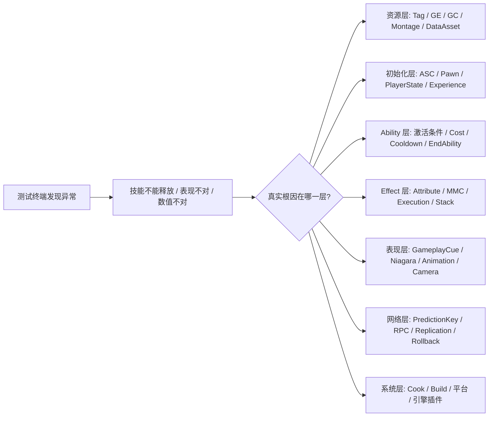
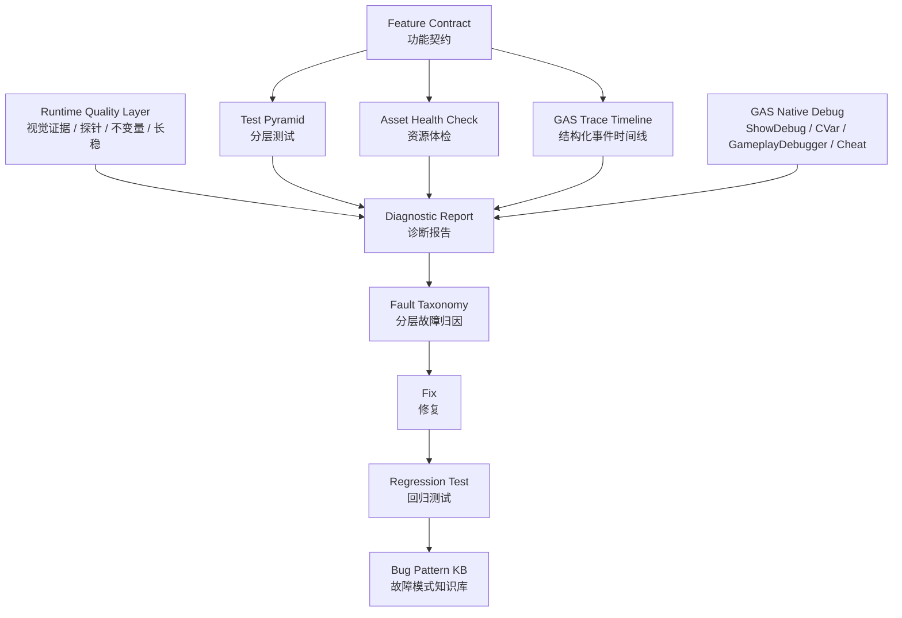
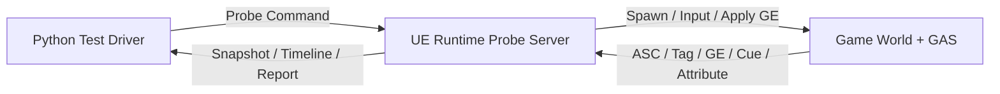
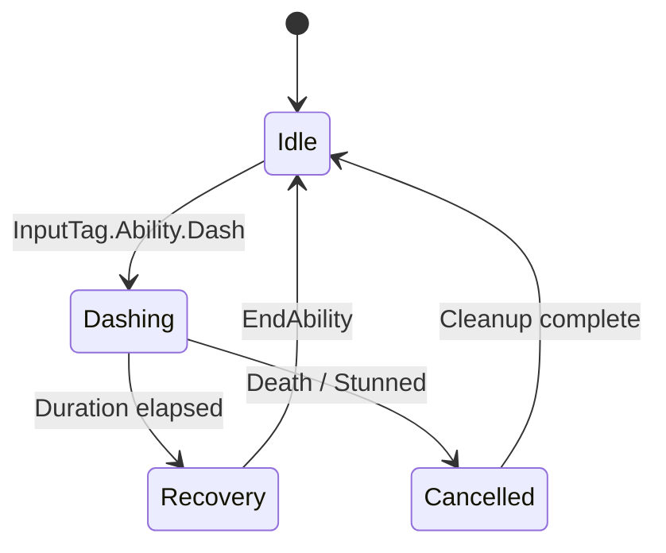

# GAS 功能质量框架

> 面向重度使用 GAS 的 Unreal / Lyra 项目。目标不是“多写测试”，而是建立一套以测试驱动为主体、以诊断可观测为骨架、以契约化和资源治理为护栏的复杂玩法质量体系。
>
> 本文档为综合分析产出，非单一 raw 素材 ingest。

## 目录

- [一、测试驱动作为主体](#一测试驱动作为主体)
- [二、辅助思想与护栏](#二辅助思想与护栏)
- [三、接入 Lyra 当前项目](#三接入-lyra-当前项目)
- [四、案例：武器开火能力的诊断链](#四案例武器开火能力的诊断链)
- [五、案例：新增 Dash 技能的完整落地流程](#五案例新增-dash-技能的完整落地流程)
- [六、资源与数据治理](#六资源与数据治理)
- [七、自动化测试接入建议](#七自动化测试接入建议)
- [八、Bug 复盘模板](#八bug-复盘模板)
- [九、运行时质量增强层](#九运行时质量增强层)
- [十、质量体系外围支柱](#十质量体系外围支柱)
- [十一、上下游质量链路](#十一上下游质量链路)
- [十二、落地路线图](#十二落地路线图)
- [十三、团队执行原则](#十三团队执行原则)

## 一句话定义

**GAS Feature Quality Framework** 是一套围绕 Gameplay Ability 功能切片建立的工程体系：

```text
功能契约
+ 分层测试
+ 资源体检
+ 结构化 Trace
+ GAS 原生 Debug 接入
+ 运行时质量增强层
+ 质量体系外围支柱
+ 上下游质量链路
+ 自动诊断报告
+ 分层故障归因
+ 回归知识库
```

它要解决的核心痛点是：测试终端发现“技能表现不对”时，问题可能来自 Ability、GE、Attribute、GameplayTag、GameplayCue、输入、动画、资源、GameFeature、网络预测、ASC 生命周期甚至引擎层。传统排查只能一层层猜，成本很高。

本框架的目标是让每个功能从设计阶段就带着可测试性和可诊断性，并在失败时自动缩小根因范围。

### 状态图例

文中使用以下标记区分 Lyra 项目中的**现有能力**与**待建提案**，避免把设计草案误读为已实现：

| 标记 | 含义 |
|---|---|
| **现有** | Lyra 源码或知识库中已存在，可直接参考或调用 |
| **待建** | 本框架建议新增，当前代码库中尚未实现 |

## 设计目标

| 目标 | 解释 | 典型产物 |
|---|---|---|
| 功能可测 | 功能设计时就明确前置、输入、期望状态、失败条件 | Feature Contract、Given/When/Then 用例 |
| 链路可观测 | Ability、GE、Tag、Cue、Attribute、网络事件都能进入时间线 | GAS Trace、事件记录器 |
| 失败可归因 | 失败不是只报 false，而是报告 Cost、Cooldown、Tag、资源、生命周期等诊断信息 | Diagnostic Assertion、故障归因报告 |
| 资源可治理 | DataAsset、GameplayCue、Montage、Tag、软引用等资源配置能被静态扫描 | Content Validation、Asset Health Check |
| 经验可沉淀 | 每个疑难 bug 最后沉淀为测试、诊断规则和知识库条目 | Regression Test、Gotcha、Runbook |

## 核心问题模型

重度 GAS 项目的失败表现通常离根因很远：



框架不是让端到端测试承担全部定位工作，而是把复杂链路拆成多层验证和多层诊断。

## 总体架构



## 一、测试驱动作为主体

### 1.1 从“功能完成后测试”改为“功能定义时测试”

每个复杂 Ability 先写一个功能契约，再写实现。契约不一定一开始就是机器可读文件，但至少要固定以下内容：

```text
Feature: Dash
Owner: Combat / Movement
Ability: GA_Dash

Given:
- 角色已完成 ASC InitAbilityActorInfo
- 已通过 AbilitySet 授予 GA_Dash
- 拥有 InputTag.Ability.Dash
- Stamina >= 20
- 不拥有 State.Stunned
- Experience 和 GameFeature 已加载

When:
- 主控客户端触发 InputTag.Ability.Dash

Then:
- Ability 激活成功
- 扣除 Stamina 20
- 添加 Cooldown.Dash
- 添加 State.Dashing，0.35s 后移除
- 播放 AM_Dash
- 触发 GameplayCue.Dash
- Server 与 Owning Client 的关键状态一致

Diagnose:
- 激活失败时输出 ASC 状态、Spec、InputTag、RequiredTags、BlockedTags、Cost、Cooldown、PredictionKey、资源加载结果
```

这份契约之后可以同时驱动：

- 编辑器资源校验
- 自动化测试用例
- 运行时诊断报告
- CI 合并门禁
- bug 复盘模板

### 1.2 分层测试金字塔

端到端测试最接近真实用户，但定位能力最差。GAS 功能应该拆成以下层级：

| 层级 | 目标 | 示例 |
|---|---|---|
| 资源静态校验 | 不进 PIE 就发现配置错误 | Tag 未注册、GE 缺 Modifier、GC 路径未加入、Montage 缺 Notify |
| 单元测试 | 验证纯逻辑和计算规则 | 伤害公式、TagQuery、Attribute Clamp、随机散布算法 |
| 组件测试 | 单独验证 ASC / Ability / GE 行为 | GiveAbility 后 Spec 存在、Cost 扣除、Cooldown 添加 |
| 功能切片测试 | 在最小地图中验证一个完整 Ability | 输入触发、激活、GE、GC、动画、结束 |
| 网络测试 | 验证 Client / Server / Prediction / Replication | LocalPredicted、TargetData RPC、回滚、模拟端表现 |
| 端到端测试 | 验证真实地图和真实流程 | 进房间、拾取武器、开火击杀、结算 |
| 回归测试 | 锁住已修复 bug | 每个线上 bug 至少补一个复现用例或资源校验 |

### 1.3 诊断型断言

普通断言只告诉你失败：

```text
Expected Ability to activate.
```

诊断型断言要告诉你为什么失败：

```text
Ability activation failed: GA_Dash
Actor: BP_PlayerCharacter_C_0
ASC: valid
OwnerActor: LyraPlayerState_0
AvatarActor: BP_PlayerCharacter_C_0
AbilitySpec: found
InputTag: InputTag.Ability.Dash matched
ActivationPolicy: OnInputTriggered
ActivationGroup: Independent
RequiredTags: missing Weapon.MobilityBoots.Equipped
BlockedTags: hit State.Stunned
Cost: pass
Cooldown: pass
PredictionKey: valid local key 42
GameplayCue: GameplayCue.Dash not loaded
Likely layer: L1 Resource + L3 Ability activation condition
```

> **待建**：以下专用断言 API 为本框架建议新增，当前 Lyra 代码库中尚无对应实现。

```cpp
AssertASCInitialized(Actor);
AssertAbilityGranted(ASC, GA_Dash, InputTag_Ability_Dash);
AssertAbilityCanActivate(ASC, GA_Dash);
AssertAbilityActivationFailureReason(ASC, GA_Dash, ExpectedFailureTags);
AssertGameplayEffectApplied(ASC, GE_DashCooldown);
AssertAttributeChanged(ASC, Stamina, -20.0f);
AssertGameplayTagAdded(ASC, State_Dashing);
AssertGameplayCueTriggered(Actor, GameplayCue_Dash);
AssertPredictionKeyValid(ASC, GA_Dash);
AssertServerClientAttributeEqual(ServerASC, ClientASC, Stamina);
```

这些断言的价值不是语法糖，而是把 GAS 常见排查经验固化为机器可重复执行的诊断规则。

## 二、辅助思想与护栏

### 2.1 可观测性优先

测试负责判断“对不对”，可观测性负责解释“为什么”。GAS 功能应把关键行为记录成结构化事件：

| 事件 | 推荐字段 |
|---|---|
| ASC 初始化 | OwnerActor、AvatarActor、Controller、PawnData、Experience |
| Ability 授予 | AbilityClass、SpecHandle、InputTag、SourceObject、Level |
| 输入触发 | InputTag、Pressed/Released/Held、匹配到的 SpecHandle |
| Ability 激活尝试 | AbilityClass、ActivationPolicy、ActivationGroup、PredictionKey |
| 激活失败 | FailureTags、RequiredTags、BlockedTags、Cost、Cooldown |
| GE 应用/移除 | GEClass、Handle、Duration、Stack、GrantedTags、SetByCaller |
| Attribute 变化 | Attribute、OldValue、NewValue、SourceGE、Instigator |
| Tag 变化 | Tag、CountBefore、CountAfter、Source |
| GameplayCue | CueTag、EventType、Parameters、LoadedCueClass |
| 网络预测 | PredictionKey、Client/Server、Accept/Reject/CaughtUp |
| 资源加载 | SoftPath、PrimaryAssetId、LoadResult、Cook 状态 |

最终输出的是时间线，而不是散落日志：

```text
[00.000][Server] Experience Loaded: B_LyraFrontEnd_Experience
[00.045][Server] Pawn Spawned: BP_PlayerCharacter_C_0
[00.051][Server] ASC InitAbilityActorInfo Owner=LyraPlayerState_0 Avatar=BP_PlayerCharacter_C_0
[00.066][Server] Ability Granted: GA_Dash Spec=7 InputTag=InputTag.Ability.Dash
[01.104][Client] Input Pressed: InputTag.Ability.Dash
[01.106][Client] TryActivateAbility Spec=7 PredictionKey=42
[01.108][Client] CanActivate failed: Missing Weapon.MobilityBoots.Equipped
[01.109][Client] GameplayCue check failed: GameplayCue.Dash not loaded
```

### 2.2 契约化开发

复杂问题常常不是代码写错，而是模块间的隐式依赖没有被声明。Feature Contract 应显式描述依赖和保证：

```yaml
feature: Dash
ability: GA_Dash
requires:
  attributes:
    - MovementAttributeSet.Stamina
  tags:
    - InputTag.Ability.Dash
    - Cooldown.Dash
    - State.Dashing
  assets:
    - AM_Dash
    - GameplayCue.Dash
    - GE_DashCost
    - GE_DashCooldown
  systems:
    - ASC initialized
    - Lyra Experience loaded
    - GameFeature activated
  network:
    execution: LocalPredicted
    authority: Server authoritative
guarantees:
  - Cost is committed before dash movement
  - Cooldown is applied after activation
  - State.Dashing is removed on ability end
  - Owning client and server converge within timeout
```

### 2.3 分层故障模型

所有测试报告、日志和 bug 单都使用同一套归因层级：

| 层级 | 名称 | 典型信号 |
|---|---|---|
| L0 | 环境问题 | 服务器、账号、Build、Cook、平台配置、PIE 设置 |
| L1 | 资源问题 | Tag 未注册、资产软引用失效、GC 未加载、DataAsset 缺字段 |
| L2 | 初始化问题 | Experience 未完成、GameFeature 未激活、ASC ActorInfo 错误 |
| L3 | Ability 问题 | Spec 不存在、输入未绑定、激活条件、Cost、Cooldown、EndAbility |
| L4 | Effect / Attribute 问题 | GE 未应用、MMC/Execution 错误、AttributeSet 未注册、Stack 错误 |
| L5 | 表现问题 | GameplayCue、Montage、Notify、Niagara、Camera |
| L6 | 网络问题 | PredictionKey、TargetData、RPC、复制模式、模拟端表现 |
| L7 | 引擎 / 插件问题 | GAS 引擎 bug、GameFeature 插件行为、版本迁移差异 |

这样团队讨论问题时，不再说“技能坏了”，而是说“L2 ASC 初始化失败”或“L6 PredictionKey 拒绝导致客户端回滚”。

### 2.4 Feature Slice 功能切片

推荐按玩法功能组织契约、资源、测试和诊断，而不是按技术层散落：

```text
Features/Dash/
  Contract/Dash.contract.yaml
  Ability/GA_Dash
  Effects/GE_DashCost
  Effects/GE_DashCooldown
  Cues/GCN_Dash
  Animations/AM_Dash
  Tests/Dash_AbilitySpecTest
  Tests/Dash_NetworkPredictionTest
  Diagnostics/Dash_DiagnosticRules
```

Lyra 的 GameFeature / Experience 架构天然适合这个方向：一个 GameFeature 不只包含功能代码，也应该包含它的测试地图、资源校验规则、诊断入口和回归用例。

## 三、接入 Lyra 当前项目

### 3.1 已有天然接入点

> **现有**：以下接入点已在 Lyra 源码中存在，可直接参考。

| 接入点 | 文件 | 用途 |
|---|---|---|
| Ability 激活 / 失败 / 结束钩子 | `Source/LyraGame/AbilitySystem/LyraAbilitySystemComponent.cpp` | 记录 Ability 生命周期、FailureTags、ActivationGroup |
| Lyra Ability 基类 | `Source/LyraGame/AbilitySystem/Abilities/LyraGameplayAbility.cpp` | 记录 Cost、AdditionalCosts、FailureTag 用户提示 |
| AbilitySet 授予 | `Source/LyraGame/AbilitySystem/LyraAbilitySet.cpp` | 记录 AttributeSet、AbilitySpec、GE 初始授予 |
| GameplayCue 管理 | `Source/LyraGame/AbilitySystem/LyraGameplayCueManager.cpp` | 接入 Cue 加载、预加载、Dump、缺失 Cue 诊断 |
| Cheat / Debug 命令 | `Source/LyraGame/Player/LyraCheatManager.cpp` | 接入 `ShowDebug AbilitySystem` 和调试分类切换 |
| 武器能力链 | `Source/LyraGame/Weapons/LyraGameplayAbility_RangedWeapon.cpp` | 作为复杂 Ability + TargetData + 命中表现案例 |
| 网络自动化测试样板 | `Plugins/GameFeatures/ShooterTests/...` | 复用 Server / Client PIE、输入注入、Until 断言 |

### 3.2 ULyraAbilitySystemComponent 适合扩展的观测点

`ULyraAbilitySystemComponent` 已经覆盖了很多关键生命周期：

- `InitAbilityActorInfo`：ASC 与 Owner / Avatar 绑定，适合记录 L2 初始化事件。
- `AbilityInputTagPressed` / `AbilityInputTagReleased` / `ProcessAbilityInput`：输入标签到 AbilitySpec 的映射，适合定位输入绑定问题。
- `NotifyAbilityActivated`：Ability 激活成功，适合记录 ActivationGroup 与 SpecHandle。
- `NotifyAbilityFailed` / `HandleAbilityFailed`：激活失败，适合输出 FailureTags 和扩展诊断。
- `NotifyAbilityEnded`：Ability 结束，适合检查 Tag / Cue / GE 是否清理。
- `GetAdditionalActivationTagRequirements`：Lyra TagRelationshipMapping 的 Required / Blocked Tag 来源。
- `GetAbilityTargetData`：服务端 Cost 或命中确认依赖 TargetData 时的重要诊断点。

> **待建**：建议新增轻量诊断接口，而不是把所有日志直接写进 ASC。

```cpp
struct FLyraGASDiagnosticEvent
{
    double TimeSeconds;
    FString NetRole;
    FString ActorName;
    FString EventName;
    FString AbilityName;
    FGameplayAbilitySpecHandle SpecHandle;
    FPredictionKey PredictionKey;
    FGameplayTagContainer Tags;
    FString Details;
};

class ILyraGASDiagnosticSink
{
public:
    virtual void RecordEvent(const FLyraGASDiagnosticEvent& Event) = 0;
};
```

ASC 只负责在关键点发事件，具体落盘、屏幕显示、测试报告由 Sink 实现。

### 3.3 Lyra Cheat 和 GAS 原生 Debug 的接入

> **现有**：以下 Cheat 入口与调试命令已在 Lyra 源码或引擎中可用。

Lyra 已经提供了 `ULyraCheatManager::CycleAbilitySystemDebug()`：

```cpp
PC->MyHUD->ShowDebug(TEXT("AbilitySystem"));
PC->ConsoleCommand(TEXT("AbilitySystem.Debug.NextCategory"));
```

这说明项目内已经承认 `ShowDebug AbilitySystem` 是 GAS 调试入口。框架应该把它纳入自动诊断，而不是只让人手动打开。

推荐的调试命令分组：

| 命令 / CVar | 来源 | 用法 |
|---|---|---|
| `ShowDebug AbilitySystem` | GAS / HUD Debug | 查看 ASC、Ability、GE、Tag 等运行时状态 |
| `AbilitySystem.Debug.NextCategory` | GAS Debug | 切换 AbilitySystem debug 分类，Lyra Cheat 已调用 |
| `AbilitySystem.Effect.Apply` | GAS 调试命令，知识库已有记录 | 客户端本地测试 GE，不代表服务端权威结果 |
| `AbilitySystem.DisplayGameplayCues` | GAS GameplayCue 调试，知识库已有记录 | 显示 GameplayCue 调试信息 |
| `AbilitySystem.DisableGameplayCues` | GAS GameplayCue 调试，知识库已有记录 | 临时关闭 Cue 以区分逻辑问题和表现问题 |
| `AbilitySystem.GameplayCue.DisplayDuration` | GAS GameplayCue 调试，知识库已有记录 | 控制 GameplayCue 屏幕显示时长 |
| `AbilitySystem.GameplayCueActorRecycle` | GAS GameplayCue CVar，知识库已有记录 | 检查 Cue Actor 池化导致的复用问题 |
| `Lyra.DumpGameplayCues` | Lyra 自定义命令 | Dump 已加载、预加载、按需加载的 GameplayCue Notify |
| `Lyra.DumpGameplayCues Refs` | Lyra 自定义命令 | 同时输出 Preloaded Cue 的引用者 |
| `lyra.Weapon.DrawBulletTraceDuration` | Lyra 武器 CVar | 绘制武器射线持续时间 |
| `lyra.Weapon.DrawBulletHitDuration` | Lyra 武器 CVar | 绘制命中点持续时间 |
| `lyra.Weapon.DrawBulletHitRadius` | Lyra 武器 CVar | 控制命中调试球半径 |

自动化报告可以在失败时执行一组“诊断快照”：

```text
OnFailure Diagnostics:
1. Dump current ASC summary
2. Dump active abilities / active effects / owned tags
3. Run Lyra.DumpGameplayCues Refs
4. Capture ShowDebug AbilitySystem text or screenshot
5. If weapon ability: enable lyra.Weapon.DrawBulletTraceDuration for reproduction
6. Attach GAS Trace Timeline to test report
```

### 3.4 GameplayDebugger 的位置

GameplayDebugger 适合做运行时可视化诊断层，尤其适合多人 PIE 或专用服务器调试。Lyra 的 ReplicationGraph 中已经把 `AGameplayDebuggerCategoryReplicator` 作为特殊复制对象处理，说明项目并不排斥 GameplayDebugger。

> **待建**：建议增加自定义 GameplayDebugger 类别。

```text
GameplayDebugger Category: LyraGAS

Panels:
- ASC ActorInfo: Owner / Avatar / Controller / NetRole
- Abilities: Granted / Active / Failed Last Frame
- Effects: Active GE / Stack / Duration
- Tags: Owned / Blocked / Required Missing
- Prediction: Current PredictionKey / rejected keys
- Cues: Active / last triggered / missing
- Contract: 当前 Feature Contract 的通过/失败项
```

它与自动化测试的关系是：

- 自动化测试负责稳定复现和断言。
- GameplayDebugger 负责人类现场观察。
- 两者读取同一份诊断事件和契约数据，避免两套口径。

## 四、案例：武器开火能力的诊断链

Lyra 的 `ULyraGameplayAbility_RangedWeapon` 是非常适合做第一批样板的复杂能力：

- 它是 `ULyraGameplayAbility` 的派生类。
- 构造函数里通过 `SourceBlockedTags` 添加 `Ability.Weapon.NoFiring`。
- `CanActivateAbility` 额外检查 `GetWeaponInstance()` 是否是 `ULyraRangedWeaponInstance`。
- 它涉及 TargetingSource、Trace、命中结果过滤、TargetData、物理材质、调试绘制。
- 它已经有武器相关 CVar：弹道线、命中点、命中半径。

### 4.1 功能契约示例

```yaml
feature: RangedWeaponFire
ability: ULyraGameplayAbility_RangedWeapon
requires:
  asc:
    - initialized
    - ability_granted
  tags:
    blocked_absent:
      - Ability.Weapon.NoFiring
  equipment:
    - associated_equipment_is_ULyraRangedWeaponInstance
  input:
    - InputTag.Weapon.Fire
  assets:
    - weapon_instance
    - fire_montage_or_cue
    - hit_gameplay_effect
  network:
    - owning_client_can_predict
    - server_receives_target_data
guarantees:
  - CanActivate fails with diagnostic if weapon instance is missing
  - Trace produces target data or explicit miss data
  - Server validates target data
  - Damage GE applies only after valid hit
  - Cue or hit marker follows confirmed or predicted hit policy
```

### 4.2 分层测试矩阵

| 测试 | 层级 | 断言 |
|---|---|---|
| AbilitySet 授予武器 Ability | 组件测试 | Spec 存在，InputTag 匹配，SourceObject 指向装备 |
| 无武器实例时激活 | 组件测试 | `CanActivateAbility` 失败，归因为 L3 Ability / Equipment |
| 拥有 `Ability.Weapon.NoFiring` | 组件测试 | 激活失败，FailureTags 命中阻塞状态 |
| 武器 Trace 命中 Pawn | 单元 / 组件测试 | `FindFirstPawnHitResult` 返回正确索引 |
| 客户端开火 | 网络测试 | Client 产生 TargetData，Server 收到并确认 |
| GameplayCue 表现 | 表现测试 | 触发指定 Cue，`Lyra.DumpGameplayCues` 能看到相关 Notify |
| 射线调试复现 | 手动 / 自动辅助 | 失败报告建议打开 `lyra.Weapon.DrawBulletTraceDuration` |

### 4.3 失败报告示例

```text
Test: RangedWeaponFire_ClientPredicted_ServerConfirmed
Result: Failed
Fault Layer: L3 Ability + L6 Network

Timeline:
[00.000][Server] ASC initialized Owner=LyraPlayerState_0 Avatar=B_Hero_ShooterMannequin_C_0
[00.022][Server] Ability granted ULyraGameplayAbility_RangedWeapon Spec=12 InputTag=InputTag.Weapon.Fire
[01.104][Client] Input pressed InputTag.Weapon.Fire
[01.106][Client] TryActivateAbility Spec=12 PredictionKey=88
[01.107][Client] CanActivate pass
[01.112][Client] TargetData generated HitActor=BP_TargetDummy_C_2
[01.180][Server] TargetData missing for Spec=12 PredictionKey=88
[01.181][Server] Cost skipped because hit confirmation missing

Diagnostics:
- AbilitySpec exists on Server and Owning Client
- SourceBlockedTags absent: Ability.Weapon.NoFiring
- WeaponInstance valid: WID_Rifle
- PredictionKey exists on Client, not found in Server AbilityTargetDataMap
- Suggested focus: TargetData RPC / PredictionKey pairing / network test setup

Suggested debug:
- ShowDebug AbilitySystem
- AbilitySystem.Debug.NextCategory
- lyra.Weapon.DrawBulletTraceDuration 5
- Lyra.DumpGameplayCues Refs
```

## 五、案例：新增 Dash 技能的完整落地流程

### 5.1 编写契约

先写 `Dash.contract.yaml`，至少包含依赖、输入、期望、诊断项。

### 5.2 写资源体检规则

在编辑器校验或命令行 Content Validation 中检查：

- `InputTag.Ability.Dash` 是否注册。
- `GE_DashCost` 是否存在，并且 Modifier 指向 Stamina。
- `GE_DashCooldown` 是否授予 `Cooldown.Dash`。
- `GameplayCue.Dash` 是否存在对应 Cue Notify。
- `AM_Dash` 是否存在，是否包含期望 Notify。
- Dash 所属 GameFeature 是否包含 GameplayCue 路径。

### 5.3 写组件测试

测试不需要真实地图即可验证：

```text
Given ASC initialized
And AbilitySet grants GA_Dash with InputTag.Ability.Dash
When AbilityInputTagPressed(InputTag.Ability.Dash)
And ProcessAbilityInput()
Then GA_Dash attempts activation
And if Stamina < 20, failure reason includes Cost
And if State.Stunned exists, failure reason includes BlockedTag
```

### 5.4 写功能切片测试

用最小测试地图验证完整链路：

```text
Given test map L_GAS_DashTest
And local player spawned
And Experience loaded
When press Dash input
Then State.Dashing appears within 0.1s
And Stamina decreases by 20
And Cooldown.Dash appears
And GameplayCue.Dash is triggered
And State.Dashing is removed within 0.5s
```

### 5.5 写网络测试

参考 `ShooterTests` 的 Server / Client PIE 模式，复用 `ThenServer`、`ThenClient`、`UntilServer`、`UntilClient` 思路：

```text
ThenClient: press InputTag.Ability.Dash
UntilClient: predicted State.Dashing exists
UntilServer: authoritative State.Dashing exists
UntilClient: server correction converges
ThenServer: Stamina decreased exactly once
ThenClient: Cooldown visible
```

### 5.6 失败后自动采集

测试失败时统一附加：

- GAS Trace Timeline
- ASC ActorInfo 快照
- Active GameplayEffects
- Owned GameplayTags
- 最近 N 条 Ability 事件
- 最近 N 条 GameplayCue 事件
- `ShowDebug AbilitySystem` 文本或截图
- `Lyra.DumpGameplayCues Refs` 输出
- Feature Contract 未满足项

## 六、资源与数据治理

GAS 的很多“运行时 bug”本质是资源配置 bug。建议建设一套 GAS Asset Health Check。

### 6.1 AbilitySet 检查

基于 `ULyraAbilitySet::GiveToAbilitySystem` 的真实授予逻辑，检查：

- `GrantedAttributes` 中 AttributeSet 类有效。
- `GrantedGameplayAbilities` 中 Ability 类有效。
- Ability 的 `InputTag` 已注册。
- `GrantedGameplayEffects` 中 GE 类有效。
- AbilityLevel / EffectLevel 合理。
- 同一 AbilitySet 内是否重复授予同一个 InputTag。

### 6.2 Ability 检查

检查：

- InstancingPolicy 是否符合团队约定，Lyra 默认使用 `InstancedPerActor`。
- NetExecutionPolicy 是否与契约一致。
- LocalPredicted Ability 是否有 PredictionKey 相关测试。
- Ability 是否声明 Cost / Cooldown 策略。
- SourceBlockedTags / ActivationRequiredTags / ActivationBlockedTags 是否在契约中记录。
- FailureTag 是否有用户提示或诊断映射。

### 6.3 GameplayEffect 检查

检查：

- Modifier Attribute 是否存在。
- SetByCaller Tag 是否注册。
- Duration / Period / Stack 策略是否符合预期。
- GrantedTags / OngoingTagRequirements / ApplicationTagRequirements 是否与契约一致。
- ExecutionCalculation / MMC 是否存在单元测试。
- Cooldown GE 是否授予对应 Cooldown Tag。

### 6.4 GameplayCue 检查

结合 `ULyraGameplayCueManager`：

- Cue Tag 必须以 `GameplayCue` 层级组织。
- Cue Notify 类可加载。
- GameFeature 是否添加 GameplayCue 路径。
- `Lyra.DumpGameplayCues` 中能看到预期 Cue。
- 需要区分逻辑失败和表现失败：可临时使用 `AbilitySystem.DisableGameplayCues` 验证。

### 6.5 动画和表现检查

检查：

- Montage 是否存在。
- AnimNotify / NotifyState 是否存在。
- GameplayCue 是否只负责表现，不隐式承担关键逻辑。
- CameraMode 是否在 Ability End 时清理。**现有**：Lyra 的 `ULyraGameplayAbility::EndAbility` 已调用 `ClearCameraMode()`，这是一个可测试点。

## 七、自动化测试接入建议

### 7.1 复用 ShooterTests 思路

> **现有**：`ShooterTests` 插件已提供以下测试基础设施。

`ShooterTests` 插件已经提供了很好的样板：

- 使用 CQTest 风格的 `TEST_METHOD`。
- 使用 `TestCommandBuilder` 组织 latent command。
- 通过 Network Component 区分 Server / Client PIE。
- 提供 `ThenServer`、`ThenClient`、`UntilServer`、`UntilClient`。
- 使用输入测试辅助类模拟 `IA_Jump`、`IA_Move`、`IA_Crouch` 等 Enhanced Input。

> **待建**：GAS 测试可借鉴上述结构，扩展出以下辅助类（当前尚未实现）。

```cpp
struct LyraGASAbilityNetworkTest
{
    void FetchASCForServerPlayer();
    void FetchASCForClientPlayer();
    void GrantAbilitySet();
    void PerformInputTag(FGameplayTag InputTag);
    void AssertAbilityActivatedOnClient(TSubclassOf<UGameplayAbility> Ability);
    void AssertAbilityActivatedOnServer(TSubclassOf<UGameplayAbility> Ability);
    void AssertGameplayEffectApplied(FGameplayTag EffectTag);
    void AssertTagConverged(FGameplayTag Tag);
    void DumpGASDiagnosticsOnFailure();
};
```

### 7.2 推荐测试命名

```text
Project.GAS.Ability.Dash.CanActivate_WhenStaminaEnough
Project.GAS.Ability.Dash.Fails_WhenStunned
Project.GAS.Ability.Dash.AppliesCostAndCooldown
Project.GAS.Ability.Dash.Network.LocalPredictedConverges
Project.GAS.Ability.RangedWeapon.Fails_WhenNoWeaponInstance
Project.GAS.Ability.RangedWeapon.ServerReceivesTargetData
Project.GAS.Cue.Dash.CueLoadsAndTriggers
Project.GAS.Content.AbilitySet.AllInputTagsRegistered
```

### 7.3 CI 分层执行

| 时机 | 执行内容 | 目标 |
|---|---|---|
| 本地提交前 | 资源静态校验、快速单元测试 | 秒级到分钟级反馈 |
| PR / 合并前 | 组件测试、关键功能切片测试 | 阻止明显回归 |
| 每日构建 | 网络测试、端到端 Smoke、Cook 资源校验 | 捕获环境和平台问题 |
| 版本候选 | 全量回归、性能与长稳 | 版本质量 |

## 八、Bug 复盘模板

每个复杂问题修复后，沉淀为以下结构：

```text
标题：
症状：
影响范围：
故障层级：L0-L7
触发条件：
最短复现路径：
时间线：
关键诊断信号：
根因：
修复方式：
新增测试：
新增资源校验：
新增诊断规则：
相关文档：
```

示例：

```text
标题：Dash 在客户端表现成功但服务端未扣 Stamina
故障层级：L6 网络 + L4 Effect
触发条件：LocalPredicted 激活，Server 未收到 TargetData
关键诊断信号：Client PredictionKey=42，Server AbilityTargetDataMap 无对应 key
修复方式：修正 TargetData RPC 发送时机
新增测试：Dash.Network.LocalPredictedCostCommittedOnce
新增诊断规则：当客户端预测成功但服务端未找到 PredictionKey 时归因为 L6
```

### 8.1 已沉淀案例

以下知识库条目是本框架"回归知识库"环节的活样本，可作为 Bug 复盘模板的参考：

- [[80-gotchas/gas-predicted-add-cue-on-full-replication]] — 预测 Add Cue 与全量复制的交互问题
- [[80-gotchas/gas-cue-cleanup-on-asc-destroy]] — ASC 销毁时 GameplayCue 清理
- [[80-gotchas/networking-ue57-review-checklist]] — UE 5.7 网络复制审查清单（含 GAS 相关项）

## 九、运行时质量增强层

前面的测试、资源体检、诊断断言更偏“开发期和自动化测试期”。但 GAS 的很多问题只会在真实运行中暴露：表现层错位、长时间战斗残留、预测回滚不干净、GameplayCue 池化复用异常、资源异步加载时序问题、多个 Buff 组合后的数值漂移。

因此需要在框架中增加一层**运行时质量增强层**。它不替代测试，而是在游戏运行过程中提供旁路观察、证据采集、主动扰动和持续守护。

```text
Runtime Quality Layer
├── Visual Evidence Testing        视觉证据
├── Runtime Combat Probe           运行时探针 / Python 驱动
├── Observability / Telemetry      结构化遥测
├── Runtime Invariant Check        运行时不变量检查
├── Fault Injection                故障注入
├── Soak / Stability Test          长稳测试
├── Deterministic Replay           确定性复盘
├── Synthetic Player / Bot QA      机器人玩家
├── Shadow Validation              影子校验
├── Runtime Contract Monitor       运行时契约监控
└── Perf / Memory / Leak Monitor   性能、内存与残留监控
```

### 9.1 视觉证据测试

视觉测试不要一开始追求像素级完全一致。游戏画面受分辨率、特效随机、时间步、后处理、平台差异影响很大，纯截图 diff 很容易脆弱。

更推荐做**证据型视觉测试**：

| 类型 | 目的 | 示例 |
|---|---|---|
| 截图快照 | 捕获失败瞬间画面 | 技能释放后角色是否卡姿势、HUD 是否缺失 |
| 短视频录制 | 捕获起手、命中、受击、结束的连续过程 | 失败前后 5 秒视频 |
| Debug Overlay 截图 | 将逻辑状态和视觉状态放在同一张证据里 | 屏幕显示 ASC、Tag、GE、Cue |
| GameplayCue 可视化标记 | 证明 Cue 逻辑触发过 | CueTag、Actor、时间戳短暂浮层 |
| 局部像素检测 | 检查某区域是否出现明显反馈 | 命中特效、血条变化、准星反馈 |
| OCR / 文本读取 | 读取 Debug HUD 或伤害数字 | `ShowDebug AbilitySystem` 截图辅助 |

理想失败报告不是“图片不同”，而是把逻辑和画面证据合并：

```text
Test: Fireball_Impact_VisualFeedback
Result: Failed

Logic:
- GE_Damage applied: true
- Enemy Health: 100 -> 70
- GameplayCue.Fireball.Impact triggered: true

Visual:
- Impact VFX detected: false
- Screenshot: Fireball_Impact_Failed.png
- Video: Fireball_Impact_Failed.mp4

Likely Layer:
- L5 Visual / GameplayCueNotify / Niagara / resource visibility
```

这类测试覆盖的是当前分层测试不擅长的区域：GameplayCue 已触发但表现没出现、动画播了但 Notify 不触发、命中逻辑正确但受击反馈错、HUD 状态和 ASC 状态不一致。

### 9.2 Runtime Combat Probe / Python 驱动

运行时探针的核心是让外部脚本像测试机器人一样驱动游戏，同时从游戏内部采集结构化状态。



Python 不需要直接理解所有 UE 对象，而是通过稳定 Probe API 操作：

```text
spawn_player()
spawn_enemy()
grant_ability(actor, ability)
grant_ability_set(actor, ability_set)
press_input_tag(actor, input_tag)
apply_gameplay_effect(actor, ge)
add_tag(actor, tag)
remove_tag(actor, tag)
get_attribute(actor, attribute)
get_owned_tags(actor)
get_active_effects(actor)
get_granted_abilities(actor)
get_gameplay_cue_history(actor)
dump_gas_timeline(actor)
```

Python 测试可以长这样：

```python
def test_fireball_damage(probe):
    player = probe.spawn_player()
    enemy = probe.spawn_enemy(distance=800)

    probe.grant_ability(player, "GA_Fireball")
    probe.press_input_tag(player, "InputTag.Ability.Fire")

    probe.wait_until(lambda: probe.has_tag(enemy, "State.HitReact"), timeout=2.0)

    assert probe.get_attribute(enemy, "Health") == 70
    assert probe.was_cue_triggered(enemy, "GameplayCue.Fireball.Impact")
```

推荐分三阶段落地：

| 阶段 | 能力 | 风险 |
|---|---|---|
| Probe L1 只读状态 | Dump ASC、Attribute、Tag、GE、Ability、Cue 历史 | 低，最适合先做 |
| Probe L2 控制型 | Spawn、GrantAbility、PressInput、ApplyGE、Teleport、DamageActor | 中，需要测试环境限制 |
| Probe L3 场景编排 | LoadMap、SpawnWave、RunCombat、InjectLag、RecordVideo | 高，适合自动化实验室 |

### 9.3 Combat Scenario Harness 战斗场景编排器

Runtime Probe 解决“外部怎么控制和观察游戏”，但复杂战斗验证还需要更上层的**战斗场景编排器**。它的目标是把“两个角色按顺序对同一个敌人释放不同技能，并在精确时间窗内触发 Combo”这类测试，从不可控的真实战斗环境中抽离出来。

这类体系在业界常见叫法包括：

```text
Scenario Testing
Combat Test Harness
Gameplay Test Framework
Deterministic Test Arena
Scripted Encounter Test
Bot-driven QA
Golden Path Scenario
Test Fixture / Test Bed
```

在 Unreal / GAS 项目中，它可以结合 Functional Testing Framework、Automation Test、Gauntlet、GameplayDebugger、Automation Driver、自定义 Test Actor / Test Controller 和前面的 Runtime Probe。

#### 核心定义

**Combat Scenario Director** 只负责编排，不负责真实战斗逻辑：

```text
SpawnActors
SetAttributes
GrantAbilities
SetCooldownReady
PlaceActors
FaceTarget
ApplyInitialTags
RunStep
WaitForCondition
AssertState
CaptureEvidence
Cleanup
```

它服务两种模式：

| 模式 | 说明 | 适合场景 |
|---|---|---|
| Manual Mode | Director 摆场、给资源、禁用干扰；人手动按键；系统自动提示和断言 | QA 复测、设计师调手感、程序现场调试 |
| Probe Mode | Director 摆场；Probe 自动释放技能、等待条件、断言和导出报告 | CI、回归测试、长稳、批量组合测试 |

人工模式不是“随便玩”，而是“带护栏的人工测试”。屏幕可以显示：

```text
Scenario: FreezeThenShatter
Step 1/3: 使用 CasterA 释放 FreezeBolt
Waiting for: Target has State.Frozen
Step 2/3: 在 1.5s 内使用 StrikerB 释放 HeavyStrike
Current Window: 1.12s remaining
```

#### 冰冻后重击敲碎示例

这个场景要验证的不是单个技能，而是一个精确战斗剧本：

```text
Actor A 对 Enemy 施加冰冻
Actor B 在冰冻窗口内使用重击
Enemy 被敲碎
期间不能被其他攻击干扰
不能因为血量太低提前死亡
不能因为资源不足放不出技能
不能因为寻路、朝向、距离、AI 行为导致节奏漂移
```

场景定义示例：

```yaml
scenario: FreezeThenShatter
map: L_CombatScenario_EmptyArena
mode:
  manual: true
  probe: true
  network: standalone

actors:
  caster_a:
    type: CombatTestPawn
    team: Ally
    position: [0, 0, 0]
    rotation: [0, 0, 0]
    abilities:
      - GA_FreezeBolt
    attributes:
      Health: 999
      Mana: 999
    controls:
      ai: disabled
      lock_position: true

  striker_b:
    type: CombatTestPawn
    team: Ally
    position: [200, 0, 0]
    rotation: [0, 0, 0]
    abilities:
      - GA_HeavyStrike
    attributes:
      Health: 999
      Stamina: 999
    controls:
      ai: disabled
      lock_position: true

  target:
    type: CombatDummyEnemy
    team: Enemy
    position: [800, 0, 0]
    attributes:
      Health: 99999
      Poise: 999
    controls:
      ai: disabled
      auto_attack: disabled
      death: disabled_until_final_assert
      lock_position: true
      ignore_unrelated_damage: true

steps:
  - name: ApplyFreeze
    action: cast
    actor: caster_a
    ability: GA_FreezeBolt
    target: target

  - name: WaitFrozen
    wait_for_tag:
      actor: target
      tag: State.Frozen
      timeout: 2.0

  - name: HeavyStrikeDuringFrozen
    action: cast
    actor: striker_b
    ability: GA_HeavyStrike
    target: target
    within: 1.5

  - name: AssertShatter
    expect:
      actor: target
      has_tag: State.Shattered
      cue_triggered: GameplayCue.Ice.Shatter
      not_dead_before_step: HeavyStrikeDuringFrozen
```

#### Test Map / Combat Lab

精确战斗剧本不要用真实关卡和普通 AI 直接跑。推荐专门的 Combat Lab：

```text
L_CombatScenario_EmptyArena
- 空场地
- 固定 Spawn 点
- 距离标尺
- 可选碰撞墙
- 可选网络 PIE 模式
- 可选 Debug Camera
- 可选截图 / 视频录制点
- 可选 GameplayDebugger 默认开启类别
```

真实关卡适合 E2E，Combat Lab 适合验证技能组合、时间窗、状态转换和表现证据。

#### Test Actor 类型

不要依赖完整玩家 AI 和完整敌人 AI。建议建立测试专用 Actor：

| Actor | 作用 |
|---|---|
| `CombatTestPawn` | 有 ASC，可授予 Ability，可被人工输入或 Probe 控制，不自动移动和攻击 |
| `CombatDummyEnemy` | 有 ASC 和 AttributeSet，可配置免死、不移动、不反击、固定抗性 |
| `CombatScenarioDirector` | 读取场景脚本，编排步骤，采集证据，导出报告 |
| `CombatScenarioCamera` | 固定镜头或跟随镜头，服务视觉证据 |

Dummy 开关：

```text
DisableAI
DisableAutoAttack
DisableDeath
InfiniteHealth
InfiniteMana
IgnoreUnrelatedDamage
LockPosition
LockRotation
FreezeCooldowns
ClearStateBeforeScenario
ClampMinHealth
```

#### 干扰隔离矩阵

| 干扰 | 解决方式 |
|---|---|
| 其他攻击干扰 | 只 Spawn 必要 Actor；禁用环境伤害；过滤非场景来源伤害 |
| 敌人提前死亡 | Dummy 开启 `DisableDeath`、`ClampMinHealth` 或 `death: disabled_until_final_assert` |
| 魔法 / 体力不足 | 初始化属性为固定值或无限资源 |
| 冷却没好 | 每步前清 Cooldown 或设置 Ability ready |
| Combo 时间漂移 | Director 使用 `wait_for_tag` + `within` 时间窗 |
| 距离不对 | 每步前 `PlaceActor`、`FaceTarget`、`LockPosition` |
| AI 干扰 | 使用 Dummy AI，或暂停 BehaviorTree / Controller |
| 随机数干扰 | 固定随机种子，禁用暴击或固定暴击结果 |
| 网络差异 | 场景声明 `standalone`、`listen`、`dedicated` 模式 |
| 动画 root motion 漂移 | 场景允许锁位或每步前校正位置 |

#### GAS 断言链

冰冻重击敲碎不要只断言“敌人死了没”。应断言完整链路：

```text
GA_FreezeBolt 激活成功
Freeze GE 应用到 Enemy
Enemy 获得 State.Frozen
Frozen 持续时间覆盖 Combo 窗口
GA_HeavyStrike 激活成功
HeavyStrike 命中 Enemy
命中时 Enemy 仍有 State.Frozen
Shatter GE / Event / Cue 被触发
State.Frozen 被移除或转化
State.Shattered 被添加
伤害数值符合预期
Enemy 没有在 Shatter 前死亡
```

失败归因示例：

```text
Scenario: FreezeThenShatter
Result: Failed
Fault Layer: L3 Ability + L4 Effect

Signals:
- GA_FreezeBolt activated: true
- GE_Freeze applied: true
- State.Frozen added: true
- State.Frozen removed at 0.82s
- HeavyStrike hit at 1.10s
- Shatter condition failed because target no longer had State.Frozen

Likely Cause:
- Frozen duration too short for combo window
- HeavyStrike step delayed by montage windup
```

#### 与 Probe、视觉证据和人工测试的关系

Combat Scenario Harness 是上层编排，底层复用已有质量能力：

```text
Scenario Director
├── Runtime Probe: 控制 Actor、输入、状态读取
├── GAS Trace: 记录 Ability / GE / Tag / Cue 时间线
├── Visual Evidence: 截图、短视频、Debug Overlay
├── Runtime Contract Monitor: 验证场景契约
└── GameplayDebugger: 给人工测试现场观察
```

推荐优先落地顺序：

1. `L_CombatScenario_EmptyArena` 空场地。
2. `CombatTestPawn` 和 `CombatDummyEnemy`。
3. `CombatScenarioDirector` 支持 Spawn、Place、GrantAbility、SetAttribute、WaitForTag、AssertTag。
4. Manual Mode UI：显示当前步骤、等待条件、剩余时间窗、失败原因。
5. Probe Mode：同一份场景脚本由 Python 或自动化测试执行。
6. 视觉证据：失败截图、短视频和 GAS Trace 一起导出。

### 9.4 结构化遥测

结构化遥测是运行时质量层的底座。它和普通 `UE_LOG` 的区别是字段稳定、可查询、可聚合。

建议每条运行时质量事件至少带：

```text
TimeSeconds
WorldName
NetMode
NetRole
Actor
ASC
FeatureId
Ability
SpecHandle
PredictionKey
EventType
Tags
Attributes
SourceObject
Result
FaultLayer
```

运行时遥测可以同时服务：

- 自动化测试报告
- Python Probe 返回值
- GameplayDebugger 面板
- 失败视频上的 Debug Overlay
- 长稳测试统计
- 线上采样上报

### 9.5 运行时不变量检查

不变量是运行时永远不应该被破坏的规则。它比具体测试更通用，适合持续守护复杂系统。

GAS 常见不变量：

```text
Health 不应小于 0，除非处于死亡处理窗口
死亡后不能仍拥有 State.Alive
Cooldown Tag Count 不能为负
Ability 结束后 ActivationOwnedTags 必须清理
同一角色不能同时拥有互斥状态，如 State.Stunned 和 State.Dashing
本地预测 GE 最终必须被服务器确认或回滚
GameFeature 停用后不能残留它授予的 Ability
Pawn 销毁后不能残留 active GameplayCue
```

不变量结果必须分级，避免干扰当前运行时：

| 等级 | 行为 | 环境 |
|---|---|---|
| Fatal | 立即中断或触发断点 | Editor / 自动化 |
| Error | 记录报告并标红测试 | QA / CI |
| Warn | 采样上报，不影响流程 | 内部测试 / 线上灰度 |
| Silent | 只进入统计 | 性能敏感场景 |

不要在 Shipping 环境使用高成本全量检查，也不要用 `check()` 处理可恢复的玩法异常。

### 9.6 故障注入

故障注入用于主动制造异常，验证系统是否能明确诊断和降级。

适合 GAS / Lyra 的注入点：

| 注入点 | 目的 |
|---|---|
| GameplayCue 资源加载失败 | 区分逻辑触发和表现资源问题 |
| GameFeature 延迟激活 | 验证 Experience / Feature 生命周期诊断 |
| TargetData RPC 延迟或丢失 | 验证 PredictionKey 和服务端确认链路 |
| 网络高延迟 / 丢包 / 抖动 | 验证 LocalPredicted 收敛和回滚 |
| AttributeSet 未注册 | 验证 AbilitySet 和 ASC 初始化校验 |
| AbilitySet 缺 GE / 缺 Ability | 验证资源体检和契约失败报告 |
| AnimNotify 不触发 | 验证动画与 GameplayCue / GE 的边界 |

故障注入必须满足：

- 只在 Editor、自动化测试、专用 QA Build 开启。
- 必须有白名单，按 Feature / Actor / Ability 定向注入。
- 必须能一键关闭和恢复。
- 注入记录要进入诊断报告，否则排查时会误判为真实 bug。

### 9.7 长稳测试

长稳测试用于发现短测试看不到的问题：

```text
GE 没清理
GameplayCue Actor 池复用异常
Tag Count 残留
AbilityTask 没 End
Actor / UObject 泄漏
预测失败后状态没回滚干净
战斗 20 分钟后性能下降
```

典型长稳场景：

```text
10 分钟快速冒烟：玩家和假人循环释放 Dash / Fire / Heal
30 分钟战斗房间：机器人对战，随机技能、随机 Buff、随机装备
2 小时压力长稳：多人、AI、掉线重连、GameFeature 切换、地图重载
```

每个周期采样：

```text
ASC count
ActiveGE count
OwnedTag total count
Active GameplayCue count
AbilityTask count
Spawned Actor count
UObject count
Memory
Frame time
GE Apply per minute
Cue Trigger per minute
```

如果某个计数只增不降，优先归为残留或泄漏问题。

### 9.8 确定性复盘

很多运行时问题最难的是复现。确定性复盘不一定要做到物理帧级完全确定，先做到**玩法事件级复盘**就很有价值。

建议记录：

```text
ScenarioId
Map / Experience / GameFeature versions
Random seed
Input sequence
Ability activation sequence
TargetData
PredictionKey
关键 Attribute / Tag 快照
网络延迟和丢包参数
资源版本
```

复盘入口：

```text
Lyra.Quality.ReplayScenario Fireball_Bug_20260609
```

它和 UE Replay 的关系是互补的：UE Replay 更偏网络和画面回放，玩法事件复盘更适合快速重跑同一条 GAS 行为链。

### 9.9 Synthetic Player / Bot QA

Bot QA 不是正式 AI，而是测试机器人。它负责稳定重复人类不愿意反复测的操作：

```text
连续释放技能
跑固定战斗路线
拾取装备
切换武器
触发交互
死亡复活循环
多人进出房间
断线重连
```

Lyra 的 `ShooterTests` 已经有输入注入和 Server / Client PIE 测试样板，Bot QA 可以沿这个方向扩展。它最好使用正常输入系统或 Ability 输入标签，不要直接调用 Ability 内部实现，这样才能覆盖真实输入链路。

### 9.10 Shadow Validation 影子校验

影子校验是在真实运行逻辑旁边跑一个只读的期望模型，用于发现数值或规则偏差。

适合校验：

```text
伤害公式
治疗公式
护盾吸收
暴击
抗性
词条叠加
Buff 层数
冷却缩减
经验 / 掉落规则
```

示例：

```text
Runtime Damage: 37
Shadow Damage Model: 37
Result: pass

Runtime Damage: 0
Shadow Damage Model: 37
Result: fail
Fault Layer: L4 Effect / Attribute
```

影子模型不能影响真实运行结果，只能旁路记录。否则它会变成第二套玩法逻辑，反而制造冲突。

### 9.11 Runtime Contract Monitor

Feature Contract 不只用于测试，也可以在运行时监控。

例如 Dash 契约声明：

```text
GA_Dash 激活成功后 0.1s 内必须添加 State.Dashing
0.5s 后必须移除 State.Dashing
激活成功后必须应用 Cooldown.Dash
激活成功后必须扣除 Stamina
```

运行时契约监控器观察事件流：

```text
[00.000] GA_Dash Activated
[00.020] State.Dashing Added
[00.030] GE_DashCost Applied
[00.031] Cooldown.Dash Added
[00.510] State.Dashing Removed
Contract Result: pass
```

失败时：

```text
[00.000] GA_Dash Activated
[00.500] State.Dashing still present
Contract Result: fail
Fault Layer: L3 Ability cleanup / L4 GE duration
```

### 9.12 性能预算与残留监控

运行时质量也包括性能和资源预算。GAS 常见预算项：

```text
单帧 Ability 激活数
单帧 GE Apply 次数
单帧 Attribute 重算次数
单帧 GameplayCue Spawn 次数
单 Actor ActiveGE 数量
单 Actor Tag Count 数量
AbilityTask 数量
ASC 数量
GameplayCue Actor 池大小
```

超过预算时记录上下文：

```text
Frame 123456:
GE Apply: 480
Top Source: AuraDamageTick
Affected Actors: 120
Likely issue: AoE tick frequency too high
Fault Layer: L4 Effect + performance budget
```

残留监控重点放在生命周期边界：

```text
Pawn destroyed
ASC EndPlay
Ability EndAbility
GameFeature Deactivate
Map unload
Player logout
```

典型报告：

```text
ASC destroyed with 3 active cues
Ability ended but State.Dashing still owned
GameFeature deactivated but granted ability still exists
Pawn destroyed but AbilityTask delegate remains bound
```

### 9.13 Canary / Smoke Runtime Scenario

每个版本或每日构建应该跑一个极小的运行时金丝雀场景：

```text
Load Experience
Spawn Player
Grant AbilitySet
Activate Dash
Activate Fire
Apply Damage GE
Trigger GameplayCue
Destroy Pawn
Assert no residue
Export report
```

它不追求覆盖多，只追求快速证明核心 GAS 链路没有整体断裂。

### 9.14 中段稳定性和可复现性补强

Probe、Combat Scenario、视觉证据和运行时诊断解决了“能跑、能观察、能采证”。但复杂运行时测试还需要一组中段基础设施，保证它们稳定、可复现、可定位、可维护。

这些模块不是新的测试类型，而是让运行时测试变可靠的支撑层：

```text
Runtime Midstream Reliability Layer
├── Time Control / Clock Control
├── Determinism Control
├── State Snapshot / Restore
├── Test Data Builder
├── Oracle / Expected Model
├── Flake Management
├── Gameplay Coverage Map
├── Failure Triage Router
├── Artifact Management
└── Human-in-the-loop Review
```

#### Time Control / Clock Control

复杂 Combo 高度依赖时间窗。比如 Frozen 只剩 1.5 秒，HeavyStrike 前摇 0.4 秒，网络延迟 80ms。没有时间控制，测试容易被帧率、动画、异步加载、网络波动影响。

建议支持：

```text
Pause / Resume World
Step Tick
Fixed DeltaTime
Slow Motion / Fast Forward
Freeze AI but allow GAS Tick
Freeze Animation but allow Ability Tick
Record event timestamps
```

适用场景：

- Combo 时间窗
- Duration GE
- Cooldown
- DOT / HOT
- AnimNotify
- Prediction rollback
- GameplayCue OnActive / Removed 时序

#### Determinism Control

Replay 和场景编排的基础是确定性控制。否则同一个场景今天通过、明天失败，很难判断是 bug 还是随机性。

建议控制：

```text
Random seed
Hit result
Critical hit result
Weapon spread
AI decision
Spawn order
Network lag profile
Async load warmup
```

场景脚本可以声明：

```yaml
determinism:
  random_seed: 12345
  critical_hit: disabled
  weapon_spread: fixed_center
  network_lag_ms: 80
  async_load: prewarmed
```

#### State Snapshot / Restore

状态快照能让测试从“每次重新搭场”升级为“从关键状态继续试验”。

示例：

```text
Snapshot: EnemyFrozen_1SecondRemaining
Restore
Run HeavyStrike timing variants:
- hit at 0.2s
- hit at 0.8s
- hit at 1.2s
```

快照范围：

```text
Actor transform
ASC ActorInfo
Attributes
Owned Tags
Active GameplayEffects
Cooldowns
Granted AbilitySpecs
Prediction state
Scenario step state
Random seed
```

注意：不是所有 UE 对象都容易完整恢复。第一阶段可以只支持 Combat Lab 中的 TestPawn / DummyEnemy，而不是任意真实关卡。

#### Test Data Builder

场景脚本不应该重复写大量初始化细节。Test Data Builder 用于创建标准测试夹具：

```text
FullManaPlayer()
InvincibleDummy()
FrozenTarget(remaining=1.0)
ShieldedBoss(stacks=3)
AbilityReady(actor, GA_HeavyStrike)
CooldownAlmostDone(actor, Cooldown.Dash, remaining=0.1)
```

这样场景定义可以更聚焦：

```yaml
given:
  - builder: FullManaPlayer
    as: caster_a
  - builder: FrozenTarget
    as: target
    remaining: 1.0
```

#### Oracle / Expected Model

Oracle 是“这个场景怎么算通过”的判定模型。没有 Oracle，测试容易退化成“看起来对”。

建议拆成多类：

| Oracle | 判断内容 |
|---|---|
| State Oracle | Tag、GE、Ability 状态转换是否正确 |
| Damage Oracle | 伤害、治疗、护盾、抗性是否符合模型 |
| Timeline Oracle | 事件顺序和时间窗是否正确 |
| Network Oracle | Server / Client 状态是否在超时内收敛 |
| Visual Oracle | 关键视觉反馈是否出现 |
| Cleanup Oracle | Ability 结束、Pawn 销毁、GameFeature 停用后是否无残留 |

冰冻重击示例：

```text
Expected Timeline:
T0: GA_FreezeBolt Activated
T0+<=0.3s: State.Frozen Added
T1: GA_HeavyStrike Activated
T1+<=0.6s: Hit Confirmed while State.Frozen exists
T1+<=0.7s: State.Shattered Added
T1+<=0.8s: GameplayCue.Ice.Shatter Triggered
```

#### Flake Management

运行时测试一定会出现 flaky。必须治理，否则团队会不信自动化。

建议记录：

```text
Recent N pass rate
Failure signature
Retry count
Timeout margin
Frame time
Async load state
Network profile
Machine / platform
```

Flake 分类：

| 类型 | 信号 |
|---|---|
| Time-window flaky | 失败集中在等待超时边缘 |
| Async-load flaky | 首次运行失败，重跑通过 |
| Network-order flaky | Server / Client 事件顺序偶发变化 |
| Visual flaky | 截图检测不稳定，逻辑状态正常 |
| Environment flaky | 只在某机器、平台或负载下失败 |

Flaky 测试不能简单忽略，而要进入治理队列：扩大时间余量、预热资源、固定随机、调整 Oracle 或拆分测试。

#### Gameplay Coverage Map

这里的覆盖率不是代码覆盖率，而是玩法覆盖地图：

```text
Ability 激活路径覆盖
Ability 失败路径覆盖
GE Modifier / Execution 覆盖
Tag 状态组合覆盖
GameplayCue 覆盖
Combo 顺序覆盖
网络模式覆盖
视觉反馈覆盖
运行时不变量覆盖
```

示例：

```text
GA_HeavyStrike
- Activation success: covered
- Cost failure: missing
- Cooldown failure: covered
- Hit normal target: covered
- Hit frozen target: covered
- Hit boss immune target: missing
- Network LocalPredicted: missing
- Visual impact cue: covered
```

它回答的是：“我们到底测到了什么，还没测什么？”

#### Failure Triage Router

故障层级可以进一步自动分流到责任团队：

| Fault Layer | 默认分流 |
|---|---|
| L0 环境 / Cook | Build / Release |
| L1 资源 | Content Owner / TA |
| L2 初始化 | Gameplay Framework / GameFeature Owner |
| L3 Ability | Gameplay Programmer |
| L4 GE / Attribute | Combat Systems / Numeric Designer |
| L5 表现 | VFX / Animation / Audio |
| L6 网络 | Network Programmer |
| L7 引擎 / 插件 | Engine / Platform Owner |

失败报告应包含：

```text
FaultLayer
OwnerSuggestion
Confidence
DiagnosticSignals
RelatedFailurePatterns
RequiredArtifacts
```

#### Artifact Management

运行时质量系统会生成大量产物：

```text
Screenshots
Videos
Trace JSON
Probe JSON
Logs
Performance samples
Replay files
Crash dumps
Scenario definitions
Coverage reports
```

需要统一规则：

```text
命名：Scenario_TestName_Platform_Timestamp_Result
索引：ScenarioId、FeatureId、FaultLayer、Commit、BuildId
保留：失败产物保留更久，通过产物可压缩或采样保留
压缩：视频、Trace、日志分级压缩
隐私：线上数据脱敏
引用：报告中使用稳定链接引用产物
```

#### Human-in-the-loop Review

自动化不应试图替代所有人工判断。视觉、手感、可理解性、平衡性需要人工复核入口。

建议流程：

```text
Automation Failed / Needs Review
→ Attach artifacts
→ QA / Designer / TA review
→ Mark: Valid Bug / Expected Change / Flaky / Needs Oracle Update
→ Update Scenario / Oracle / Failure Pattern
```

人工复核应回写：

```text
reviewer
decision
reason
linked artifact
follow-up action
updated contract or oracle
```

这样人工测试和自动测试不是两套孤岛，而是同一套场景、证据和 Oracle 的不同执行模式。

### 9.15 防止与当前运行时冲突

运行时质量层必须是旁路能力，不能污染正式玩法。建议遵守以下原则：

1. 旁路观测，不改变真实玩法结果。
2. 默认关闭，通过 BuildConfig、CVar 或命令显式开启。
3. 分级采样，避免每帧全量记录。
4. Probe Actor、Test Scenario、Fault Injection 与正式玩法 Actor 隔离。
5. Shipping 环境不执行高成本逻辑。
6. 不持有强引用导致资源无法释放。
7. 不在 GAS 关键路径做阻塞 IO。
8. Debug 代码不能改变网络时序。
9. 故障注入必须有白名单和环境限制。
10. 报告系统失败不能影响游戏主流程。

推荐 CVar 分组：

```text
Lyra.Quality.Enabled
Lyra.Quality.Trace.Enabled
Lyra.Quality.Invariant.Enabled
Lyra.Quality.VisualEvidence.Enabled
Lyra.Quality.Probe.Enabled
Lyra.Quality.FaultInjection.Enabled
Lyra.Quality.ContractMonitor.Enabled
Lyra.Quality.PerfBudget.Enabled
Lyra.Quality.SamplingRate
```

优先级建议：

| 优先级 | 模块 | 原因 |
|---|---|---|
| P0 | Runtime Invariant Check | 收益高、侵入低、能持续发现脏状态 |
| P0 | GAS Trace / Telemetry | 所有报告和可视化的底座 |
| P0 | Leak / Residue Monitor | GAS / Cue / Task 残留很常见 |
| P1 | Runtime Combat Probe | 自动化战斗和 Python 驱动的基础 |
| P1 | Visual Evidence | 补上表现层证据 |
| P1 | Soak Test | 暴露长时间运行问题 |
| P2 | Fault Injection | 验证坏路径和诊断质量 |
| P2 | Deterministic Replay | 提升疑难问题复现能力 |
| P2 | Shadow Validation | 适合数值和战斗公式 |
| P2 | Performance Budget Monitor | 防止高频 GAS 链路拖垮帧 |

## 十、质量体系外围支柱

测试框架和运行时质量层解决“怎么发现问题、怎么定位问题”。但复杂 GAS 项目长期稳定，还需要一组外围支柱，覆盖设计期、变更期、发布期、团队协作和质量度量。

这些支柱不是更多测试，而是让测试和诊断不会被无序设计、资源变更、发布链路、配置漂移和团队流程抵消。

```text
Quality Pillars Outside Testing
├── Design-Time State Model        设计期状态模型
├── Change Impact Analysis         变更影响分析
├── Build / Cook Quality Gate      构建与发布门禁
├── Data & Config Governance       数据和配置治理
├── Testable Architecture          可调试、可测试架构约束
├── Team Workflow Gate             团队流程与 PR 门禁
├── Quality Metrics Dashboard      质量指标与仪表盘
├── Failure Pattern Knowledge Base 故障模式知识库
├── Security / Anti-Cheat Boundary 安全和反作弊边界
└── Performance Budget Design      性能预算设计
```

### 10.1 设计期状态模型

Feature Contract 已经描述“功能承诺什么”，但还应该进一步描述 Ability 的状态流、Tag 生命周期和互斥关系。否则很多问题会在设计阶段就埋下：

```text
Idle -> Dashing -> Recovery -> Idle
Blocked by: State.Stunned, State.Rooted
Cancels: Ability.Aim, Ability.Reload
Adds: State.Dashing
Removes: State.Dashing on EndAbility / Cancel / Death
```

建议每个复杂 Ability 都补三张设计图：

| 图 | 作用 |
|---|---|
| Ability 状态图 | 描述起手、执行、恢复、取消、失败路径 |
| GameplayTag 生命周期图 | 描述 Tag 由谁添加、何时移除、是否复制 |
| Ability 关系图 | 描述阻塞、取消、互斥、可并行关系 |

示例：



设计评审 checklist：

- 这个 Ability 是否有明确的状态结束条件？
- 激活失败时是否有明确 FailureTag？
- 添加的所有 GameplayTag 是否都有清理路径？
- 取消路径是否和自然结束路径一样清理资源？
- 它会阻塞或取消哪些 Ability？
- 它是否依赖动画 Notify、GameplayCue 或异步资源？
- LocalPredicted 下客户端成功、服务端失败如何回滚？

### 10.2 变更影响分析

GAS 项目里一个 Tag、GE、Attribute 或 AbilitySet 改动可能影响很多功能。测试能发现一部分问题，但更好的方式是在改动前就知道影响面。

建议建设 `Change Impact Analyzer`，能回答：

```text
谁使用了这个 GameplayTag？
哪些 Ability 依赖这个 GE？
这个 Attribute 被哪些 MMC / Execution / UI / Ability 使用？
删除一个 GameplayCue 会影响哪些功能？
修改 AbilitySet 会影响哪些 PawnData / Experience / GameFeature？
这个 GameFeature 停用会撤掉哪些组件、Ability 和 CuePath？
```

影响分析可以基于：

- C++ / Blueprint 引用扫描
- AssetRegistry 依赖关系
- GameplayTag 使用扫描
- AbilitySet / PawnData / Experience 资产解析
- Feature Contract 中的 `requires` 和 `guarantees`
- 知识库 anchors 和 wikilink 反向引用

输出示例：

```text
Change: Remove GameplayTag State.Dashing

Impacted:
- GA_Dash: ActivationOwnedTags
- GE_DashState: GrantedTags
- UI_StatusBar: listens State.Dashing
- Contract Dash: requires State.Dashing
- Tests: Dash.AppliesAndRemovesState

Required Gates:
- GAS asset health check
- Dash component tests
- Dash network prediction test
- Runtime contract monitor sample
```

### 10.3 Build / Cook / 发布质量门禁

编辑器中能运行不代表 Cook 后、Dedicated Server、目标平台和 GameFeature 包都正确。资源层和系统层问题必须进入发布门禁。

常见风险：

```text
软引用在 Editor 可加载，Cook 后丢失
GameFeature 插件资源没进包
GameplayCue 路径没有被 AssetManager 收集
PrimaryAssetId 配置错误
Dedicated Server 缺必要逻辑资源
Client 包含了不该包含的测试资源或 Probe 能力
平台差异导致 Niagara / Animation / Cue Notify 不可用
```

建议门禁：

| Gate | 检查内容 |
|---|---|
| AssetManager Gate | PrimaryAssetType、PrimaryAssetId、GameFeatureData 可解析 |
| GameplayCue Cook Gate | CueTag 到 CueNotify 的路径可收集、可加载 |
| Soft Reference Gate | Ability / GE / DataAsset 的软引用 Cook 后存在 |
| Server Package Gate | DS 包含逻辑资源，排除纯客户端表现资源 |
| Client Package Gate | 客户端包含需要表现资源，排除测试控制能力 |
| Platform Gate | 平台特有资源、插件、CVar、Scalability 配置可用 |
| GameFeature Gate | 插件激活、停用、依赖、资源路径完整 |

发布报告应包含：

```text
Cooked Ability count
Cooked GameplayEffect count
Cooked GameplayCue Notify count
Missing soft references
GameFeature activation dry-run result
Dedicated Server resource diff
Client-only / Server-only asset violations
```

### 10.4 数据和配置治理

GAS 高度数据驱动，后期很多事故来自配置变化，而不是代码变化。

需要治理：

- GameplayTag 命名、归属、废弃策略。
- GA / GE / Attribute / DataAsset schema 版本。
- 数值表 diff 和风险标记。
- LiveOps / 热更新配置校验。
- 配置变更审计和回滚。
- 跨分支合并时 Tag 和 DataAsset 冲突处理。

建议给数据资产增加版本概念：

```yaml
schema_version: 3
owner: Combat
risk_level: high
requires_review:
  - gameplay
  - engineering
  - qa
deprecated_tags:
  - old: State.Dash
    new: State.Dashing
    remove_after: 2026-08-01
```

数值变更要能生成 diff：

```text
GE_FireballDamage
- Damage.SetByCaller default: 30 -> 45
- Cooldown: 1.5 -> 1.0
Risk: high
Required Tests:
- Fireball_DamageFormula
- Fireball_DPS_Budget
- CombatProbe_10Min
```

### 10.5 可调试、可测试架构约束

测试系统再强，也救不了不可测试的实现。复杂 Ability 应该遵守“可调试设计”原则：

| 约束 | 原因 |
|---|---|
| Ability 不堆所有逻辑 | 便于单独测试目标选择、数值、表现 |
| GameplayCue 不承载核心逻辑 | Cue 是表现层，可能被禁用、延迟、丢失 |
| 数值计算可独立调用 | 支持 Shadow Validation 和单元测试 |
| 目标选择可独立调用 | 支持 TargetData 和命中测试 |
| AbilityTask 生命周期明确 | 防止 Task 残留和 Delegate 泄漏 |
| UI 不直接推断 GAS 内部状态 | 统一订阅消息、ViewModel 或状态快照 |
| GameFeature 激活和停用对称 | 防止组件、Ability、CuePath 残留 |

推荐拆分复杂 Ability：

```text
CanPayCost()
BuildTargetData()
ResolveDamageSpec()
SelectMontage()
ApplyHitResult()
BuildCueParameters()
CommitAbilityState()
CleanupAbilityState()
```

这些函数不是为了抽象好看，而是为了测试、诊断和复盘。

### 10.6 团队流程和 PR 门禁

质量体系要进入日常流程，否则会变成文档愿景。

建议 PR 门禁：

| 改动类型 | 必须附带 |
|---|---|
| 新 Ability | Feature Contract、资源体检、组件测试、失败诊断项 |
| LocalPredicted Ability | Server / Client 网络测试、PredictionKey 诊断 |
| 新 GameplayCue | CueTag、CueNotify、Cook Gate、视觉证据样例 |
| 改 GameplayTag | 影响分析、废弃策略、Tag redirect 或迁移说明 |
| 改 GE / Attribute | 数值 diff、公式测试、Shadow Validation 评估 |
| 改 GameFeature | 激活/停用测试、资源路径检查、残留监控 |
| 修疑难 bug | Regression Test 或 Diagnostic Rule，以及 gotcha / 复盘条目 |

PR 模板可以包含：

```text
Feature Contract updated: yes/no
Impact Analysis attached: yes/no
Asset Health Check passed: yes/no
Network test required: yes/no
Cook gate required: yes/no
Runtime invariant added: yes/no
Bug pattern documented: yes/no
```

### 10.7 质量指标与仪表盘

没有指标，质量体系很难证明价值。建议持续统计：

```text
Ability 有契约比例
Ability 有组件测试比例
LocalPredicted Ability 网络测试覆盖率
GameplayCue Cook Gate 通过率
资源体检失败数
运行时不变量违规数
长稳残留趋势
Top 失败故障层级
平均发现时间 MTTD
平均修复时间 MTTR
同类 bug 复发率
```

仪表盘应该按故障层级聚合：

| 指标 | 用途 |
|---|---|
| L1 资源问题占比 | 判断资源治理是否有效 |
| L2 初始化问题占比 | 判断 Experience / GameFeature 生命周期是否清晰 |
| L6 网络问题占比 | 判断预测和复制测试是否不足 |
| MTTD / MTTR | 判断定位框架是否真的降低成本 |
| Regression escape count | 判断回归测试是否有效 |

### 10.8 故障模式知识库

Bug 复盘不应该只是文字归档，而应该结构化成可检索、可匹配的故障模式：

```text
Symptom -> Fault Layer -> Diagnostic Signal -> Root Cause -> Fix -> Regression
```

示例：

```yaml
symptom: Client predicted cue appears, server confirmation missing
fault_layer: L6 Network
signals:
  - Client has local PredictionKey
  - Server AbilityTargetDataMap missing key
  - Cue triggered only on owning client
likely_causes:
  - TargetData RPC not sent
  - PredictionKey pairing mismatch
  - ReplicationMode interaction
references:
  - 80-gotchas/gas-predicted-add-cue-on-full-replication
```

当测试失败报告出现类似信号时，可以自动提示历史案例：

```text
Matched Failure Pattern:
- gas-predicted-add-cue-on-full-replication
- TargetData RPC missing
Suggested Checks:
- PredictionKey generation side
- RPC send timing
- ReplicationMode
```

### 10.9 安全和反作弊边界

GAS 多人项目常用客户端预测，但预测不等于信任客户端。安全边界必须写清楚。

需要验证：

```text
客户端不能伪造 TargetData 获得非法命中
客户端不能绕过 Cost / Cooldown
客户端不能伪造 GameplayEvent 激活 ServerOnly Ability
服务端必须重新验证距离、视线、武器状态、弹药、射速
Debug / Probe / Cheat 命令只能在允许环境启用
故障注入不能进入 Shipping
```

建议安全检查表：

| 项 | 服务端要求 |
|---|---|
| TargetData | 验证距离、角度、视线、时间戳、武器状态 |
| Cost | 服务端最终扣除和确认 |
| Cooldown | 服务端权威应用 |
| Damage | 服务端计算或校验关键参数 |
| GameplayEvent | 白名单 Tag 和来源 |
| Probe / Cheat | BuildConfig、权限、CVar、网络隔离 |

### 10.10 性能预算设计

运行时性能监控能发现超预算，但预算本身要在设计期定义。

建议为 GAS 关键路径设预算：

```text
每个角色最多 ActiveGE 数量
每帧最多 GE Apply 数量
每帧最多 Attribute 重算次数
Aura 类 GE 最小 Tick 周期
GameplayCue Actor 池大小
多人房间 ASC 数量上限
每个 Ability 最大 AbilityTask 数量
每次 GameFeature 激活最大组件添加数量
```

示例：

```yaml
budget:
  active_ge_per_actor: 32
  ge_apply_per_frame_warning: 100
  attribute_recalc_per_frame_warning: 200
  gameplaycue_spawn_per_frame_warning: 30
  aura_period_min_seconds: 0.25
  ability_tasks_per_ability: 8
```

预算超限不是一定失败，但必须进入报告并提供上下文：

```text
Budget Warning:
GE Apply per frame = 480, budget = 100
Top Source: GE_AuraDamageTick
Affected Actors: 120
Suggested Fix: increase period, batch query, reduce affected actors
```

## 十一、上下游质量链路

如果把 GAS 功能质量体系放到完整生产链路里看，它不只发生在“写代码、跑测试、运行时诊断”这一段。更上游有需求、设计、资产生产、协作和工具；更下游有发布、线上遥测、平衡性、玩家体验、热更新和团队知识沉淀。

这部分关注的是从需求到上线再回流的闭环：

```text
需求 / 玩法意图
→ 可验证规格
→ 功能契约
→ 资产生产
→ 开发实现
→ 测试 / 运行时质量
→ 构建发布
→ 线上遥测
→ 平衡性和体验分析
→ 故障模式 / 回归场景
→ 需求和契约更新
```

### 11.1 需求到可验证规格

Feature Contract 解决工程规格，但还需要从策划需求转成可验证规格的机制。

例如需求：

```text
冰冻状态下被重击会碎裂，并造成额外伤害。
```

工程规格应拆成：

```text
状态：State.Frozen
触发：GA_HeavyStrike 命中 Frozen 目标
窗口：Frozen 持续期间
效果：Remove State.Frozen、Add State.Shattered、Apply BonusDamage、Trigger GameplayCue.Ice.Shatter
例外：Boss 免疫、护盾目标不碎裂、死亡目标不触发
失败反馈：目标免疫时显示 Immune Cue 或 UI 提示
```

建议需求模板：

```text
玩法意图：
触发条件：
前置状态：
目标选择：
效果：
时间窗：
例外规则：
失败反馈：
网络预期：
表现预期：
可验证断言：
需要的测试场景：
```

这能避免测试验证的是“程序理解”，而不是“设计真实意图”。

### 11.2 资产生产链路

GAS 功能不只是代码和 DataAsset，还依赖动画、特效、音频、UI、图标、文本和命名路径。

冰冻重击敲碎可能需要：

```text
Freeze VFX
Frozen 材质
Shatter VFX
Shatter SFX
HeavyStrike Montage
HitReact Montage
GameplayCue Notify
状态图标
UI 状态描述
本地化文本
```

资产生产链路需要：

| 环节 | 要求 |
|---|---|
| 命名规范 | Ability、GE、Cue、Montage、VFX、SFX 使用一致前缀 |
| 依赖声明 | 资产声明属于哪个 Feature Contract |
| 交付 checklist | 动画、特效、音频、UI、文本是否齐备 |
| 临时资产标记 | Prototype 资产不能进入发布包 |
| Cue 绑定验收 | GameplayCueTag 到 CueNotify、Niagara、SFX 绑定可验证 |
| 视觉标准 | 哪些表现必须可见、可听、可读 |

资产交付也应触发测试：

```text
New GameplayCue Notify submitted
→ GameplayCue Cook Gate
→ Visual Evidence sample
→ Combat Scenario screenshot/video refresh
```

### 11.3 编辑器工具和作者体验

如果契约、场景和资源检查都靠程序手写 YAML，设计师、TA、QA 很难长期参与。需要把质量体系做成可使用的编辑器工具。

推荐工具：

| 工具 | 用户 | 功能 |
|---|---|---|
| Scenario Editor | QA / 程序 / 设计 | 配置 Combat Scenario、步骤、断言、证据采集 |
| Feature Contract Editor | 设计 / 程序 | 编辑前置、输入、状态、例外、表现预期 |
| GameplayCue Health Panel | TA / VFX | 查看 CueTag、CueNotify、加载状态、Cook 状态 |
| Ability Dependency Viewer | 程序 | 查看 Ability、GE、Tag、Attribute、Cue 依赖图 |
| Tag Usage Viewer | 全团队 | 查 Tag 被谁使用、是否废弃、是否冲突 |
| Combat Lab Launcher | QA / 设计 | 一键启动人工模式或 Probe 模式场景 |

工具目标不是替代文档，而是降低参与门槛。

### 11.4 Ownership 和多人协作模型

多人同时改 Tag、GE、AbilitySet、GameFeature，很容易互相踩。

需要明确：

```text
谁拥有某个 GameplayTag 命名空间？
谁能修改通用 Attribute？
AbilitySet 是否允许跨团队修改？
GameFeature 之间依赖如何声明？
两个功能同时改同一个 GameplayCue 或 GE 时如何 review？
DataAsset 冲突如何合并？
```

建议 Ownership 表：

| 资源类型 | Owner | Review 要求 |
|---|---|---|
| `State.*` Tag | Gameplay Systems | 需要影响分析 |
| `InputTag.*` | Input / Gameplay | 需要输入映射检查 |
| 通用 AttributeSet | Combat Systems | 需要数值和 UI 影响评估 |
| 共享 GameplayCue | VFX / Gameplay | 需要视觉和 Cook Gate |
| GameFeature 插件 | Feature Team | 需要激活/停用和依赖检查 |

### 11.5 版本矩阵和兼容性覆盖

不同运行形态会暴露不同问题。不要假设 PIE 通过就代表其他形态通过。

常见矩阵：

```text
Editor
PIE
Standalone
Listen Server
Dedicated Server
Client
Cooked Build
PC / Console / Mobile
Iris on/off
ReplicationGraph on/off
GameFeature A/B
```

建议采用风险驱动矩阵：

| 矩阵 | 执行频率 |
|---|---|
| Editor / PIE / Standalone | 本地和 PR 高频 |
| Listen Server / Dedicated Server | 网络 Ability 改动触发 |
| Cooked Client / Cooked Server | 每日构建和版本前 |
| 平台专项 | 版本前或平台相关改动 |
| Iris / RepGraph 配置 | 网络层改动或版本迁移 |
| GameFeature 组合 | 改插件依赖、Experience、资源路径时触发 |

### 11.6 线上遥测和真实玩家反馈闭环

测试环境再完整，也替代不了真实玩家行为。上线后需要把异常回流到质量体系。

线上信号：

```text
某技能激活失败率异常高
某 GE 堆叠数量异常
某 GameplayCue 触发后崩溃
某 Combo 成功率过低
玩家在某状态下死亡率异常
某 Ability 平均耗时或失败原因异常
```

闭环：

```text
Online Telemetry
→ Anomaly Detection
→ Failure Pattern Match
→ Generate Combat Scenario
→ Add Regression Test
→ Update Feature Contract / Gotcha
```

示例：

```text
Signal:
- FreezeThenShatter combo success rate dropped from 42% to 8%

Auto Suggested Scenario:
- FreezeThenShatter_LiveRegression_20260609
- Use top failing enemy type
- Use observed distance and timing distribution
```

### 11.7 平衡性和战斗数据分析

Combo 正确不代表平衡。冰冻重击敲碎还需要回答：

```text
成功率是多少？
平均触发时间是多少？
额外伤害占比是多少？
PVP 是否过强？
PVE 是否太弱？
Boss 免疫是否让玩家困惑？
资源消耗是否合理？
```

推荐指标：

```text
DPS
TTK
CC uptime
Combo success rate
Combo fail reason
Damage source distribution
Ability usage rate
Resource starvation rate
Cooldown blocked rate
Enemy type effectiveness
```

这些指标可以来自 Combat Probe 自动对局、Bot QA、线上遥测和长稳测试。

### 11.8 玩家体验和可理解性验证

有些功能逻辑正确、数值平衡，但玩家看不懂。

冰冻重击敲碎的 UX 风险：

```text
冰冻状态不明显
可敲碎窗口没有提示
重击命中但碎裂反馈不够强
失败原因没有 UI 提示
Boss 免疫但没有反馈
音画不同步
状态图标和角色表现不一致
```

需要验证：

| 维度 | 验证问题 |
|---|---|
| 状态可读性 | 玩家能否看出目标已 Frozen |
| 时间窗提示 | 玩家能否理解何时能 Shatter |
| 反馈强度 | Shatter 是否有足够视觉、音频、镜头反馈 |
| 失败提示 | 免疫、超时、未命中是否有明确反馈 |
| 可访问性 | 色弱、低画质、低音量下是否仍可理解 |

视觉证据测试看“有没有”，UX 验证看“玩家能不能理解”。

### 11.9 运营配置和热更新安全

如果技能数值、GE、Tag、掉落、敌人配置会热更，就必须加入 LiveOps 安全链路。

需要：

```text
热更前校验
热更灰度
热更回滚
配置版本锁
客户端 / 服务端配置一致性
热更后自动 Canary
配置变化导致场景失效的检测
```

热更 Gate 示例：

```text
Config Patch:
- GE_Freeze.Duration: 2.0 -> 0.8

Impact:
- FreezeThenShatter combo window may fail

Required:
- Run FreezeThenShatter scenario
- Run combo success simulation
- Validate server/client config version
- Prepare rollback
```

### 11.10 文档、培训和组织记忆

知识库不只是查资料，还应该承接团队培训和组织记忆。

需要沉淀：

```text
策划如何写可验证技能需求
程序如何添加一个可测试 Ability
TA 如何交付 GameplayCue
QA 如何运行 Combat Scenario
程序如何读诊断报告
线上事故如何沉淀成故障模式
新人如何理解 GAS 质量框架
```

建议增加角色化入口：

| 角色 | 入口 |
|---|---|
| Gameplay Programmer | 添加 Ability、写 Contract、写诊断断言 |
| Designer | 写需求规格、定义例外条件、运行 Manual Scenario |
| TA / VFX | 交付 GameplayCue、视觉证据、Cook Gate |
| QA | Combat Lab、Probe Mode、失败报告归因 |
| Build / Release | Cook Gate、版本矩阵、热更校验 |

## 十二、落地路线图

### Phase 0：约定先行

- 统一故障层级 L0-L7。
- 新功能必须写 Feature Contract。
- 复杂 bug 修复必须补回归测试或资源校验。
- 统一测试报告格式。
- PR 模板加入 Contract、Impact Analysis、Cook Gate、Runtime Quality 勾选项。

### Phase 1：最小可用诊断

- 在 `ULyraAbilitySystemComponent` 的激活、失败、结束、输入处理处发诊断事件。
- 接入 `Lyra.DumpGameplayCues`。
- 失败时输出 ASC 快照、ActiveGE、OwnedTags、最近 Ability 事件。
- 为一个能力建立完整样板，建议先选 `ULyraGameplayAbility_RangedWeapon` 或 Dash。

### Phase 2：资源体检

- AbilitySet 校验。
- GameplayTag 校验。
- GameplayCue 加载校验。
- GE / Attribute / SetByCaller 校验。
- GameFeature GameplayCuePath 校验。

### Phase 3：网络测试

- 复用 ShooterTests 的 Server / Client PIE 测试基础设施。
- 建立 LocalPredicted Ability 样板。
- 建立 TargetData / PredictionKey / 回滚测试。

### Phase 4：工具化与知识库闭环

- **待建** 自定义 GameplayDebugger Category：LyraGAS。
- **待建** 编辑器窗口或命令：`Lyra.GAS.DiagnoseActor`、`Lyra.GAS.DiagnoseAbility`。
- 自动把疑难 bug 复盘写入 `80-gotchas` 或项目 bug pattern 文档。
- 将测试失败报告与 Feature Contract 关联。

### Phase 5：运行时质量增强

- **待建** Runtime Invariant Check：先覆盖 Health、Tag Count、ActivationOwnedTags、ActiveCue、GameFeature 授予残留。
- **待建** Runtime Combat Probe L1：只读 Dump ASC / Attribute / Tag / GE / Ability / Cue。
- **待建** Combat Scenario Harness：空场地、TestPawn、DummyEnemy、ScenarioDirector、Manual / Probe 双模式。
- **待建** Visual Evidence：失败截图、短视频、Debug Overlay、Cue 可视化标记。
- **待建** Midstream Reliability Layer：时间控制、确定性控制、快照恢复、测试数据构建器、Oracle、Flake、覆盖地图、失败分流、产物管理、人工复核。
- **待建** Soak Test：10 分钟 GAS 冒烟长稳和 30 分钟战斗房间长稳。
- **待建** Fault Injection 白名单：Cue 缺失、TargetData 延迟、GameFeature 延迟、网络延迟。
- **待建** Performance / Residue Monitor：生命周期边界检查和预算超限报告。

### Phase 6：外围支柱治理

- **待建** Design-Time State Model：为复杂 Ability 建状态图、Tag 生命周期图、阻塞/取消关系图。
- **待建** Change Impact Analyzer：扫描 Tag、GE、Attribute、AbilitySet、PawnData、Experience、GameFeature 影响面。
- **待建** Build / Cook Quality Gate：验证 GameplayCue、软引用、PrimaryAsset、GameFeature 包资源。
- **待建** Data Governance：Tag 废弃策略、DataAsset schema 版本、数值 diff 风险标记。
- **待建** Quality Dashboard：覆盖率、故障层级、MTTD / MTTR、长稳残留趋势。
- **待建** Security Boundary Check：TargetData、Cost、Cooldown、Damage、Probe / Cheat 权限检查。

### Phase 7：上下游闭环

- **待建** 需求到可验证规格模板：玩法意图、触发条件、例外规则、失败反馈、可验证断言。
- **待建** 资产生产 checklist：动画、特效、音频、UI、文本、Cue 绑定和视觉标准。
- **待建** Scenario Editor / Combat Lab Launcher：让 QA、设计和 TA 能运行 Manual / Probe 场景。
- **待建** Ownership 表：Tag、Attribute、AbilitySet、GameplayCue、GameFeature 的 Owner 和 review 规则。
- **待建** 版本矩阵策略：PIE、Standalone、Listen、Dedicated、Cooked、平台、Iris / RepGraph、GameFeature 组合。
- **待建** 线上遥测回流：异常聚合、故障模式匹配、自动生成回归场景。
- **待建** 平衡性和 UX 指标：Combo 成功率、TTK、CC uptime、失败原因、可读性反馈。
- **待建** 热更新安全 Gate：配置一致性、灰度、回滚、热更后 Canary。

## 十三、团队执行原则

1. 端到端测试负责发现系统异常，不负责独自定位根因。
2. 新增复杂 Ability 时，契约、资源校验、组件测试至少三者齐备。
3. 所有激活失败都必须能解释：Spec、Input、Tag、Cost、Cooldown、ASC、资源。
4. GameplayCue 问题要能区分“逻辑没有触发”和“表现资源没加载”。
5. LocalPredicted Ability 必须有网络收敛测试。
6. 线上或 QA 疑难问题修复后，至少沉淀一个回归测试、一个资源规则或一个诊断规则。
7. Debug 工具、自动化测试和知识库使用同一套故障层级语言。
8. 运行时质量层必须旁路、可开关、可采样，不能改变正式玩法结果。
9. 故障注入和 Probe 控制能力只允许在 Editor、自动化或 QA 白名单环境启用。
10. 视觉证据、Probe、Trace、GameplayDebugger 应复用同一套事件结构和故障层级。
11. 改 Tag、GE、Attribute、AbilitySet、GameFeature 前必须做影响分析。
12. 发布前必须有 Cook / GameFeature / GameplayCue / SoftReference 门禁。
13. 客户端预测只用于体验，服务端仍必须验证 Cost、Cooldown、TargetData 和伤害关键参数。
14. 性能预算在设计期定义，运行时只负责监控和报警。
15. 需求、资产、热更和线上反馈都必须能回流到 Feature Contract、Combat Scenario 和故障模式库。

## 相关页面

- [[10-architecture/subsystems/ability-system]]
- [[70-topics/networking-and-synchronization]]
- [[70-topics/game-feature-system]]
- [[70-topics/ui-framework-selection-and-integration]]
- [[40-runbooks/how-to-add-gameplay-ability]]
- [[40-runbooks/how-to-verify-network-replication-runtime]]
- [[30-tutorials/gas/00-GAS系统总览]]
- [[30-tutorials/gas/02-GA执行流程详解]]
- [[30-tutorials/gas/03-GA输入绑定]]
- [[30-tutorials/gas/14-GE网络复制]]
- [[30-tutorials/gas/20-GC简介与配置]]
- [[30-tutorials/gas/21-GC运行时详解]]
- [[30-tutorials/gas/23-PredictionKey预判机制]]
- [[30-tutorials/gas/26-Lyra综合案例死亡能力链]]
- [[80-gotchas/gas-predicted-add-cue-on-full-replication]]
- [[80-gotchas/gas-cue-cleanup-on-asc-destroy]]
- [[80-gotchas/networking-ue57-review-checklist]]
