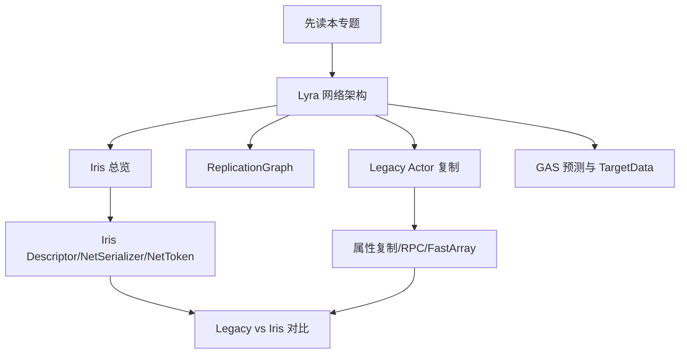

# 网络通信与同步专题

> Lyra 项目网络同步知识入口。本文负责串联 UE5.7 的传统复制、ReplicationGraph、Iris、GAS 预测与 Lyra 项目源码实践。

## 阅读路径

推荐顺序：

1. `[[10-architecture/subsystems/networking-system]]`：先确认 Lyra 当前项目事实。
2. `[[10-architecture/data-flow/network-replication-flow]]`：看典型同步链路。
3. `[[30-tutorials/network-sync/00-UE网络通信总览]]`：理解 UE 网络栈总览。
4. `[[30-tutorials/network-sync/03-LegacyActor复制流程]]`、`[[30-tutorials/network-sync/04-Legacy属性复制与RPC流程]]`：理解传统复制路径。
5. `[[30-tutorials/network-sync/iris/00-Iris总览]]`：理解 Iris 新复制系统。
6. `[[30-tutorials/network-sync/07-LegacyReplicationvsIris]]`：做横向方案判断。
7. `[[80-gotchas/networking-ue57-review-checklist]]`：实现或迁移前检查风险。

## Lyra 当前网络同步现状

Lyra 不是“纯 Legacy”或“纯 Iris”的简单样例，而是一个混合状态项目：

- `LyraStarterGame.uproject` 中 `Iris` 插件已启用。
- `Source/LyraGame/LyraGame.Build.cs` 调用了 `SetupIrisSupport(Target)`。
- `Config/DefaultEngine.ini` 配置了 Iris 的 `ReplicationStateDescriptorConfig` 与 `ObjectReplicationBridgeConfig`。
- `Config/DefaultGame.ini` 配置了 `LyraReplicationGraphSettings`，但当前 `bDisableReplicationGraph=True`，即 ReplicationGraph 代码存在但默认禁用。
- 业务层仍大量使用 UE 高层网络 API：`UPROPERTY(Replicated)`、`ReplicatedUsing`、`DOREPLIFETIME`、RPC、`FFastArraySerializer`、`NetSerialize`、`ReplicateSubobjects`、`AddReplicatedSubObject`。

因此本知识库采用“以 Lyra 事实为准，UE5.7 源码校验”的写法，避免把旧教程中的旧版引擎结论直接搬到 UE5.7。

## 三套相关方案的定位

| 方案 | 定位 | Lyra 状态 | 适合阅读页面 |
|---|---|---|---|
| Legacy Replication | 传统 ActorChannel / RepLayout / ObjectReplicator 路径 | 高层 API 仍大量使用 | `[[30-tutorials/network-sync/03-LegacyActor复制流程]]` |
| ReplicationGraph | Legacy 路径上的 Actor 相关性与频率优化框架 | 有实现，默认禁用 | `[[30-tutorials/network-sync/06-ReplicationGraph与Lyra实践]]` |
| Iris | UE5 新一代复制系统，重构底层状态描述、序列化、过滤与 DataStream | 插件与构建支持已启用，具体运行路径需结合 NetDriver/CVar 验证 | `[[30-tutorials/network-sync/iris/00-Iris总览]]` |

## Lyra 源码中的核心同步点

| 领域 | 文件 | 关注点 |
|---|---|---|
| Character movement | `Source/LyraGame/Character/LyraCharacter.*` | `ReplicatedAcceleration`、`PreReplication`、`FastSharedReplication`、`FSharedRepMovement::NetSerialize` |
| PlayerState / GAS | `Source/LyraGame/Player/LyraPlayerState.cpp` | ASC `Mixed` 复制、PushModel、`ForceNetUpdate` |
| Inventory | `Source/LyraGame/Inventory/LyraInventoryManagerComponent.*` | `FFastArraySerializer`、SubObject 注册/传统复制双路径 |
| Equipment | `Source/LyraGame/Equipment/LyraEquipmentManagerComponent.*` | 装备 FastArray、AbilitySet 授予、SubObject 生命周期 |
| Verb message | `Source/LyraGame/Messages/LyraVerbMessageReplication.*` | 用 FastArray 做消息广播式复制 |
| Weapon TargetData | `Source/LyraGame/Weapons/LyraGameplayAbility_RangedWeapon.cpp` | 客户端本地命中、PredictionKey、TargetData RPC、服务端确认 |
| Iris 支持 | `Config/DefaultEngine.ini`、`LyraStarterGame.uproject` | Iris 插件、结构 NetSerializer 支持、Bridge filter 配置 |
| GameplayTag | `Config/DefaultGameplayTags.ini` | FastReplication 与网络索引参数 |

## 本专题的判断原则

1. **业务层 API 不等于底层实现**：`DOREPLIFETIME` 和 RPC 在 Iris 下仍可能作为高层声明存在，但底层状态构建、序列化和传输路径不同。
2. **不要依赖跨 ActorChannel 的全局顺序**：同一 Channel 内 reliable RPC 有顺序约束，不同 Actor/Channel 间不能假设全局顺序。
3. **FastArray 是 Lyra 高频模式**：Inventory、Equipment、VerbMessage 都是适合观察增量复制的项目样例。
4. **SubObject 是迁移重点**：Lyra 同时保留传统 `ReplicateSubobjects` 和 registered subobject list；迁移 Iris 时必须验证生命周期。
5. **ReplicationGraph 是可选优化层**：Lyra 提供了完整 RepGraph 代码，但默认禁用。分析时要区分“代码存在”和“运行时启用”。
6. **Iris 是面向未来的复制系统，不是无风险一键替换**：普通属性和 RPC 迁移成本较低，但自定义序列化、FastArray、SubObject、过滤/优先级都需要专项验证。

## 调试入口

常用方向：

- 普通网络复制：`net.*` 相关 CVar、Network Profiler、包日志。
- ReplicationGraph：`Net.RepGraph.PrintGraph`、`Net.RepGraph.PrintAll`、`Lyra.RepGraph.PrintRouting`。
- GAS：`ShowDebug AbilitySystem`、AbilitySystem 日志、PredictionKey 断点。
- Lyra 自定义：`Lyra.RepGraph.*` CVar、`FastSharedReplication` 断点、FastArray callback 断点。

## 相关页面

- `[[10-architecture/subsystems/networking-system]]`
- `[[10-architecture/data-flow/network-replication-flow]]`
- `[[30-tutorials/network-sync/07-LegacyReplicationvsIris]]`
- `[[80-gotchas/networking-ue57-review-checklist]]`

<!-- nav:auto -->

---

**导航**: ← [[70-topics/game-feature-system|game-feature-system]]

<!-- /nav:auto -->
