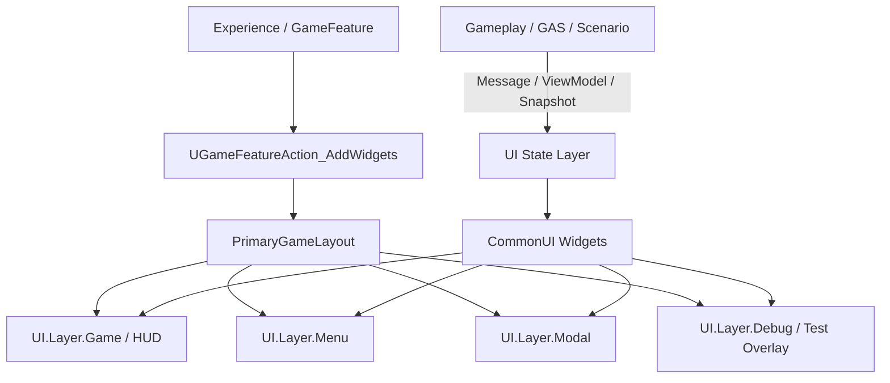

# 游戏 UI 框架选型与接入

> 面向 Lyra / GAS / 多平台游戏项目。结论是：如果项目以 Lyra 为参考，且需要正式 HUD、菜单、弹窗、手柄/键鼠/触屏统一输入，以及测试诊断 Overlay，**CommonUI + Lyra PrimaryGameLayout / UI Layer 思路是优先选择**。

## 结论

推荐架构：

```text
底层渲染与控件：UMG / Slate
游戏 UI 框架：CommonUI
项目布局层：PrimaryGameLayout + UI Layer
内容注入层：GameFeatureAction_AddWidgets + UIExtension
Gameplay 通信层：GameplayMessage / ViewModel / UI State Snapshot
诊断测试 UI：CommonUI Debug/Test Overlay Layer
```

CommonUI 不替代 UMG。它是建立在 UMG 之上的游戏 UI 管理框架，重点解决页面栈、输入模式、焦点、返回键、弹窗、多平台输入提示和 Layer 管理。

## 为什么适合 Lyra / GAS 项目

CommonUI 适合以下需求：

| 需求 | CommonUI / Lyra 对应能力 |
|---|---|
| 手柄、键鼠、触屏统一 | CommonInput、UI Action、Focus 管理 |
| 菜单栈和弹窗 | `UCommonActivatableWidget`、Activatable Widget Stack |
| HUD / 菜单 / Modal 分层 | `UPrimaryGameLayout` + `UI.Layer.*` GameplayTag |
| GameFeature 驱动 UI | `UGameFeatureAction_AddWidgets` |
| 异步加载 UI 且临时挂起输入 | `PushWidgetToLayerStackAsync` |
| 对局内和前端切换 | `ULyraHUDLayout`、Frontend flow |
| GAS 状态提示 | GameplayMessage / ViewModel 驱动 Widget |
| 测试诊断 Overlay | 单独 Debug/Test Layer，旁路显示状态和场景步骤 |

Lyra 已经有清晰落点：

- `ULyraActivatableWidget` 继承 `UCommonActivatableWidget`，通过 `GetDesiredInputConfig()` 声明 Game / Menu / GameAndMenu 输入模式。
- `UPrimaryGameLayout` 管理多层 UI 栈，并使用 `FGameplayTag` 注册 Layer。
- `UGameFeatureAction_AddWidgets` 通过 Experience / GameFeature 声明式注入 HUD Layout 和 HUD Element。
- `ULyraHUDLayout` 处理 Escape 菜单、控制器断连菜单等游戏内 HUD 布局行为。

## 核心架构



推荐 UI Layer：

| Layer | 用途 | 示例 |
|---|---|---|
| `UI.Layer.Game` | 游戏 HUD | 血量、技能栏、状态图标、准星 |
| `UI.Layer.Menu` | 菜单栈 | 暂停菜单、设置页、背包页 |
| `UI.Layer.Modal` | 模态交互 | 确认框、错误提示、断线提示 |
| `UI.Layer.Debug` | 调试和测试 Overlay | GAS Trace、Scenario 步骤、断言结果 |
| `UI.Layer.Toast` | 轻提示 | Ability 失败原因、资源不足、免疫提示 |

## 接入 GAS 的边界

UI 不应该直接承载 Gameplay 逻辑，也不应该到处读取 ASC 内部状态。

推荐流向：

```text
GAS / Gameplay
→ GameplayMessage / ViewModel / UI State Snapshot
→ CommonUI Widget
```

不推荐：

```text
Widget 每帧直接查询 ASC
Widget 自己判断 Combo 是否成功
Widget 直接调用 Ability 激活或修改 GameplayTag
Ability 直接持有 Widget 指针并操作 UI
```

推荐：

```text
ASC / Ability / Combat System 发出结构化消息
CombatUIViewModel 汇总 Attribute、Cooldown、Tag、Combo Window
CommonUI Widget 只负责展示和输入焦点
```

### 冰冻重击 UI 示例

```text
Enemy 获得 State.Frozen
→ GameplayMessage: TargetStateChanged
→ UI 显示 Frozen 图标和可碎裂提示

HeavyStrike 可接 Combo
→ GameplayMessage: ComboWindowOpened
→ UI 显示 1.5s 倒计时

Shatter 成功
→ GameplayCue + UI Message
→ UI 显示碎裂反馈、伤害数字、状态变化

Shatter 失败
→ GameplayMessage: ComboFailed
→ UI 显示超时、免疫、未命中或资源不足原因
```

## 接入测试诊断 UI

CommonUI 很适合承接人工测试和诊断 Overlay，尤其是前面质量框架中的 Combat Scenario Harness。

建议新增测试诊断 UI：

| Widget | 用途 |
|---|---|
| `WBP_CombatScenarioOverlay` | 显示场景名、当前步骤、等待条件、Combo 窗口、Pass/Fail |
| `WBP_GASTraceOverlay` | 显示最近 Ability / GE / Tag / Cue 事件 |
| `WBP_DiagnosticPanel` | 展示故障层级、断言失败、建议 Owner、相关产物 |
| `WBP_ProbeControlPanel` | 人工触发 Probe 命令、重置场景、导出报告 |

示例 Overlay：

```text
Scenario: FreezeThenShatter
Mode: Manual
Step 2/4: Wait for State.Frozen
Target: BP_CombatDummy_0
Combo Window: 1.12s
Expected: HeavyStrike hit while Frozen
Last Event: GE_Freeze applied
```

它和正式 UI 的边界：

- Debug/Test Overlay 只在 Editor、QA Build 或显式 CVar 下启用。
- 不修改 Gameplay 结果，只显示状态、按钮和报告。
- 使用单独 Layer，避免污染正式 HUD。
- 所有控制命令走 Probe / ScenarioDirector，不由 Widget 直接改 ASC。

## 选型对比

| 方案 | 优点 | 风险 | 结论 |
|---|---|---|---|
| 纯 UMG AddToViewport | 简单、上手快 | 输入模式、焦点、页面栈、平台差异容易失控 | 只适合小型原型 |
| 自研 UI 管理器 | 可完全定制 | 重复造 CommonUI 已解决的问题，维护成本高 | 不建议作为主方案 |
| CommonUI + Lyra UI Layer | 多平台、输入、Layer、菜单栈成熟；Lyra 已使用 | 需要理解 CommonUI 激活/焦点/Layer 规则 | 推荐 |
| CommonUI + MVVM/ViewModel | UI 状态更清晰，易测试 | 需要建立状态转换约定 | 推荐逐步引入 |

## 落地路线

### Phase 0：遵循 Lyra 现有模式

- 使用 `ULyraActivatableWidget` 作为页面基类。
- HUD Layout 使用 `ULyraHUDLayout` 或其派生类。
- 通过 `UGameFeatureAction_AddWidgets` 在 Experience / GameFeature 中注入 UI。
- 通过 `UPrimaryGameLayout` 管理 Layer，而不是随意 `AddToViewport`。

### Phase 1：建立 UI Layer 规范

- 明确 `UI.Layer.Game`、`UI.Layer.Menu`、`UI.Layer.Modal`、`UI.Layer.Debug`、`UI.Layer.Toast`。
- 建立 Layer 使用规则：HUD 不推 Modal，Modal 不直接改 Gameplay。
- 为测试诊断 UI 单独建 Debug/Test Overlay Layer。

### Phase 2：建立 GAS UI State 层

- 定义 Attribute、Cooldown、Tag、Combo、FailureReason 的 UI State Snapshot。
- Ability / ASC / Combat System 只发消息，不直接改 Widget。
- Widget 订阅 ViewModel 或消息结果。

### Phase 3：接入 Combat Scenario / Probe UI

- `WBP_CombatScenarioOverlay` 显示人工测试步骤。
- `WBP_GASTraceOverlay` 显示事件时间线。
- `WBP_DiagnosticPanel` 显示故障层级和断言失败。
- Probe 控制按钮只调用 ScenarioDirector / Probe API。

### Phase 4：质量门禁

- Widget 编译校验：焦点目标、Layer Tag、软引用、输入模式。
- UI 视觉证据：关键 HUD、Combo 提示、失败提示截图。
- Cook Gate：GameFeature UI 资源是否进入客户端包。
- 平台验证：手柄焦点、返回键、输入图标、控制器断连。

## 注意事项

1. CommonUI 负责 UI 框架，不负责 Gameplay 结果。
2. UI 不直接推断 GAS 复杂状态，应消费 ViewModel / Snapshot。
3. Ability 不直接持有 Widget 或操作 Widget。
4. 测试诊断 UI 必须旁路、可开关、只在允许环境启用。
5. 所有 UI 控制命令走 ScenarioDirector / Probe，不绕过质量框架。
6. GameFeature 停用时 UI Widget 和 Extension Handle 必须清理。
7. 手柄焦点必须作为一等需求，`ULyraActivatableWidget` 已在编辑器校验中提示未实现焦点目标的问题。
8. Debug/Test Overlay 不应影响正式 HUD 输入和网络时序。

## 相关页面

- [[30-tutorials/lyra-practical/07-LyraUI框架详解]]
- [[30-tutorials/umg/08-Lyra项目UMG实战]]
- [[70-topics/gas-feature-quality-framework]]
- [[70-topics/game-feature-system]]
- [[10-architecture/subsystems/experience-system]]
