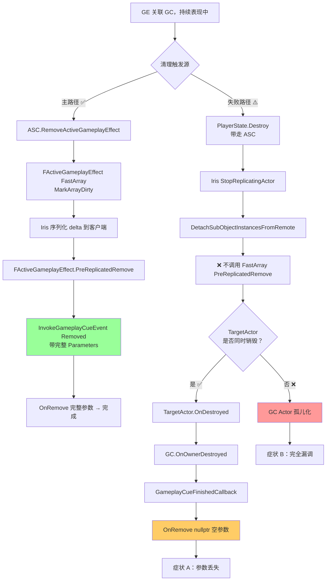

# Pawn / PlayerState 销毁时 GameplayCue 的清理边界

> 当承载 GAS 的 Actor（Pawn 或 PlayerState）被销毁、且其上还有未结束的 GameplayEffect 关联了 GameplayCue Actor 时，UE 是否能保证客户端 GC Actor 的 `OnRemove` 被正确调用？答案是**有条件的兜底，但 Parameters 可能为空**。

## 适用范围

- UE 5.7 + GAS（`GameplayAbilities` 插件）
- 使用 `AGameplayCueNotify_Actor`（含 `Looping` 派生类）的持续表现
- Iris 启用或 Legacy Replication 路径均适用（Iris 下风险面更大）
- Lyra 默认 ASC 在 PlayerState 上、avatar 是 Character 的拓扑

## 失败模式

### 症状

1. **症状 A（信息丢失型）**：减速类 GE 在 Character 死亡时仍未到期，客户端的减速特效粒子被清掉了，但 `OnRemove` 收到的 `FGameplayCueParameters` 是**空的**——`SourceObject` / `Instigator` / `AggregatedSourceTags` / `RawMagnitude` 全部为默认值。

2. **症状 B（彻底漏调型）**：自定义玩法中 ASC 与 avatar 解耦（如载具/灵魂出窍/换 PlayerState），ASC 所在 Actor 销毁但 TargetActor 没销毁，客户端 GC Actor 的 `OnRemove` **完全不被调用**，残留特效一直在场上播放。

3. **症状 C（日志报错型）**：`LogGameplayCueNotify: Error: GameplayCueNotify [...] is calling EndPlay(). This should not happen since they are recycled through the GameplayCueManager.`（`GameplayCueNotify_Actor.cpp` L68）—— 表示 GC Actor 走的是异常的 actor destroy 路径，而非正常的对象池回收路径。

### 根因链



**关键源码**（UE 5.7）：

| 现象 | 源码位置 |
|---|---|
| Iris SubObject Destroy 跳过 FastArray Remove | `Engine/Source/Runtime/Net/Iris/Private/Iris/ReplicationSystem/ObjectReplicationBridge.cpp` L511-515、L941-944 |
| 客户端 EndReplication 走 Destroy 路径 | `Engine/Source/Runtime/Net/Iris/Private/Iris/ReplicationSystem/ReplicationReader.cpp` L677-705 |
| `OnOwnerDestroyed` 兜底注册 | `Engine/Plugins/Runtime/GameplayAbilities/Source/GameplayAbilities/Private/GameplayCueNotify_Actor.cpp` L170-181 |
| `GameplayCueFinishedCallback` 强制 OnRemove(nullptr) | `GameplayCueNotify_Actor.cpp` L361-382 |
| GC Owner 设为 TargetActor | `Engine/Plugins/Runtime/GameplayAbilities/Source/GameplayAbilities/Private/GameplayCueManager.cpp` L505、L525 |
| `bAutoAttachToOwner / bAutoDestroyOnRemove` 默认 false | `GameplayCueNotify_Actor.cpp` L42、L55 |
| `ActiveGameplayEffectsContainer::Uninitialize`（不广播 Remove） | `Engine/Plugins/Runtime/GameplayAbilities/Source/GameplayAbilities/Private/GameplayEffect.cpp` L5200 |
| ASC `OnComponentDestroyed → DestroyActiveState`（不调 RemoveAllCues） | `AbilitySystemComponent_Abilities.cpp` L96、L1356 |

## 触发条件检查

逐条对照，命中越多风险越高：

- [ ] 使用持续型 GE（Duration / Infinite），其上配置了 `GameplayCue Tags`
- [ ] 关联的 GC 是 `AGameplayCueNotify_Actor`（或派生 `Looping`）类型，**不是** `Burst`
- [ ] 实现了 `OnRemove`，且 OnRemove 内部读取了 `FGameplayCueParameters` 的字段
- [ ] 项目使用 Iris 复制（或正在迁移）
- [ ] Pawn / PlayerState 可能在 GE 未到期时被销毁（玩家离场、死亡复活、关卡切换）
- [ ] **危险信号**：自定义玩法中 ASC 与 avatar 解耦（载具切换、控制权转移、死亡尸体保留特效）

## 解决方案

### 方案 A：服务器侧"先清理后销毁"（推荐，主路径）

在死亡 / 离场入口显式清理 GE，让 Removed 事件先送达客户端：

```cpp
// 死亡场景：ALyraCharacter 风格
void ALyraCharacter::OnDeathFinished(AActor* OwningActor)
{
    if (HasAuthority())
    {
        if (UAbilitySystemComponent* ASC = GetAbilitySystemComponent())
        {
            // 移除关心的 GE → 触发 FastArray Remove → 客户端 OnRemove 走完整路径
            FGameplayEffectQuery Query;
            // 按需精确匹配，或用空 Query 全清
            ASC->RemoveActiveEffects(Query);

            // 兜底：清理 ActiveGameplayCueContainer
            ASC->RemoveAllGameplayCues();

            ASC->ForceReplication();
        }
    }
    DestroyDueToDeath();
}
```

```cpp
// 离场场景：PlayerState 销毁
void ALyraPlayerState::EndPlay(const EEndPlayReason::Type EndPlayReason)
{
    if (HasAuthority() && AbilitySystemComponent)
    {
        AbilitySystemComponent->RemoveActiveEffects(FGameplayEffectQuery());
        AbilitySystemComponent->RemoveAllGameplayCues();
        AbilitySystemComponent->ForceReplication();
    }
    Super::EndPlay(EndPlayReason);
}
```

### 方案 B：延迟一帧销毁（Iris 下必备）

`ForceNetUpdate` 在 Iris 下**不保证同帧发送**，必须延迟一帧让 SendUpdate 完成序列化：

```cpp
void ALyraPlayerState::HandleLogout()
{
    if (HasAuthority() && AbilitySystemComponent)
    {
        AbilitySystemComponent->RemoveActiveEffects(FGameplayEffectQuery());
        AbilitySystemComponent->RemoveAllGameplayCues();

        // 延迟到下一帧再销毁，本帧 NetUpdate 把 Remove delta 发出
        GetWorldTimerManager().SetTimerForNextTick([this]()
        {
            Destroy();
        });
    }
    else
    {
        Destroy();
    }
}
```

### 方案 C：GC Actor 子类自我保护（兜底）

在 `AGameplayCueNotify_Looping` 子类的 `EndPlay` 中处理 `Destroyed` 路径，避免被 owner 强拆时跳过清理：

```cpp
void AMySlowdownCue::EndPlay(const EEndPlayReason::Type EndPlayReason)
{
    if (EndPlayReason == EEndPlayReason::Destroyed && bHasHandledWhileActiveEvent && !bHasHandledOnRemoveEvent)
    {
        // 兜底处理 GE Removed 完全没送达的极端场景
        // 注意：这里 Parameters 同样为空
        OnRemove(GetOwner(), FGameplayCueParameters());
    }
    Super::EndPlay(EndPlayReason);
}
```

**注意**：方案 C 只能保护跟随 owner 销毁的 cue 实例，对**孤儿化**的 cue 无效。它是"最后一道防线"，不能替代方案 A/B。

### 方案 D：避免在 OnRemove 中依赖 Parameters

如果 OnRemove 只做幂等的"停粒子 / 停音效 / 恢复材质"，不依赖任何 Parameters 字段，**UE 兜底足够**，无需工程介入。这是设计 GC 表现时应优先考虑的形式。

## 验证方法

### 启用日志

```ini
; DefaultEngine.ini
[Core.Log]
LogGameplayCues=Verbose
LogGameplayCueNotify=Verbose
LogGameplayEffects=Verbose
```

观察以下日志判定走的是哪条路径：

- 主路径：`FActiveGameplayCue::PreReplicatedRemove ... <Tag>` → `InvokeGameplayCueEvent Removed`
- 兜底路径：`OnOwnerDestroyed` 调用 → `OnRemove` 接收到的 Parameters 各字段为空
- 异常路径：`LogGameplayCueNotify: Error: ... is calling EndPlay()` 警告

### 模拟测试

1. 服务器：给 Character 应用 30s 减速 GE
2. 在客户端用 ShowDebug AbilitySystem 确认 cue 已激活
3. 服务器：5s 后直接 `Pawn->Destroy()`（不走 RemoveActiveEffect）
4. 观察客户端：
   - GC Actor 是否被销毁 / 回收（无残留 → 兜底生效）
   - `OnRemove` 中的 Parameters 是否为空（断点验证）

## 相关页面

- [[30-tutorials/gas/21-GC运行时详解]] — 完整 GC 运行机制 + 兜底链路
- [[30-tutorials/gas/14-GE网络复制]] — Full / Mixed / Minimal 三模式
- [[30-tutorials/gas/20-GC简介与配置]] — `bAutoAttachToOwner` / `bAutoDestroyOnRemove` 字段
- [[30-tutorials/network-sync/iris/06-IrisObjectReplicationBridge与SubObject]] — Iris SubObject Destroy 路径
- [[80-gotchas/networking-ue57-review-checklist]] — UE5.7 网络同步整体复核

<!-- nav:auto -->

---

**导航**: ← [[80-gotchas/networking-ue57-review-checklist|networking-ue57-review-checklist]] · [[80-gotchas/gas-predicted-add-cue-on-full-replication|gas-predicted-add-cue-on-full-replication]] →

<!-- /nav:auto -->
