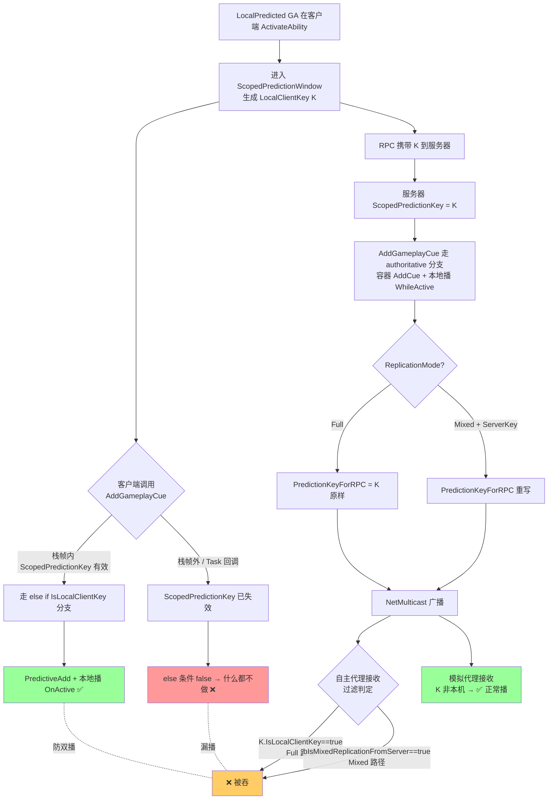
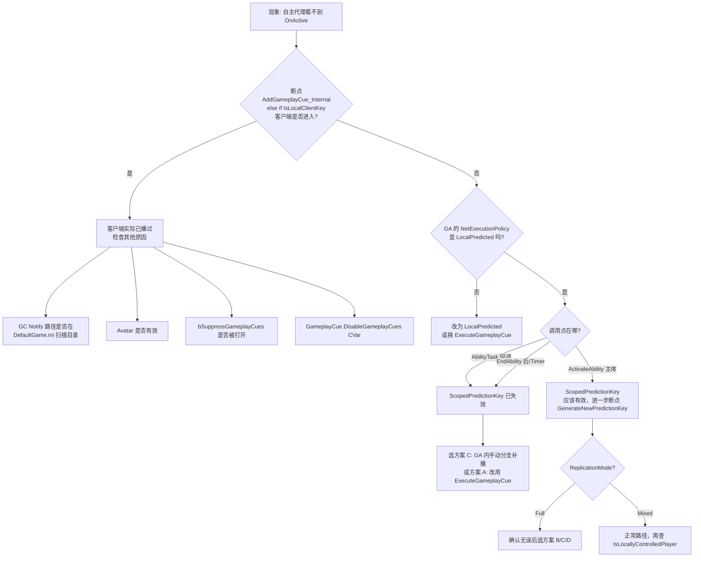

# 预测 GA 调用 AddGameplayCue 在 Full 模式下"自主代理看不到 OnActive"

> 在 `LocalPredicted` 类型的 GA 中调用 `ASC->AddGameplayCue(...)` 触发持续表现，自主代理（预测发起者本人）有时**完全看不到 OnActive**。表面看是 `NetMulticast_InvokeGameplayCueAdded_WithParams_Implementation` 把广播吞了；真正根因是 PredictionKey + 防双播过滤的组合行为，不是 ReplicationMode 单独造成的。

## 适用范围

- UE 5.7 + GAS（`GameplayAbilities` 插件）
- GA 的 `NetExecutionPolicy = LocalPredicted` 或 `LocalOnly`
- 在 GA 内部（或 Task 回调内）调用 `AddGameplayCue` / `AddGameplayCue_WithParams`
- `AGameplayCueNotify_Actor` / `Looping` 类型 GC（Burst 一般不受影响）
- `ASC->ReplicationMode` 为 `Full`（Mixed 同样受影响但触发分支不同；Minimal 不适合 owner ASC）

## 失败模式

### 症状

1. **症状 A**：客户端断点 `OnActive`、`WhileActive` 都不进入；模拟代理（旁观者）一切正常 → 仅"自己"看不到。
2. **症状 B**：把 `AddGameplayCue` 改到 AbilityTask 异步回调里反而能看到 OnActive——但因此丢失了预测/撤销保护，预测被服务器拒绝时无法回滚。
3. **症状 C**：服务器日志能看到 `NetMulticast_InvokeGameplayCueAdded_WithParams` 广播发出；客户端断点能看到 RPC 进入 `_Implementation`，但条件判断被 false 短路。

### 根因链



**关键源码**（UE 5.7）：

| 现象 | 源码位置 |
|---|---|
| 客户端预测分支 `else if (ScopedPredictionKey.IsLocalClientKey())` | `Engine/Plugins/Runtime/GameplayAbilities/Source/GameplayAbilities/Private/AbilitySystemComponent.cpp` L1538-L1545 |
| 服务器分支 PredictionKeyForRPC 选择（Full 不重写） | `AbilitySystemComponent.cpp` L1503-L1523 |
| 广播 RPC 过滤逻辑 | `AbilitySystemComponent.cpp` L1637-L1648 |
| Mixed 模式补救分支注释 | `AbilitySystemComponent.cpp` L1500-L1501、L1515-L1517 |
| `EGameplayEffectReplicationMode` 枚举 + Minimal 限制注释 | `Engine/Plugins/Runtime/GameplayAbilities/Source/GameplayAbilities/Public/AbilitySystemComponent.h` L78-L88 |
| `Call_InvokeGameplayCueAdded_WithParams` 转发到 NetMulticast | `Engine/Plugins/Runtime/GameplayAbilities/Source/GameplayAbilities/Private/AbilitySystemReplicationProxyInterface.cpp` L41-L44 |

## 触发条件检查

逐条对照，全部命中 → 症状 100% 出现：

- [ ] GA 的 `NetExecutionPolicy` 是 `LocalPredicted`
- [ ] GA 内通过 `ASC->AddGameplayCue(...)` 触发 Cue（不是 `ExecuteGameplayCue`，不是 GE 自动触发）
- [ ] `ASC->ReplicationMode == Full`（Mixed 同样有，但通过另一分支）
- [ ] 调用点在 `FScopedPredictionWindow` 失效后（如 AbilityTask 回调、`SetTimerForNextTick` 内、`EndAbility` 后）
- [ ] 没有在客户端手动调 `InvokeGameplayCueEvent(OnActive)` 兜底

> 如果前 4 条都中、第 5 条没做兜底，**自主代理 100% 看不到 OnActive**。

## 解决方案

### 方案 A：换用 `ExecuteGameplayCue`（一次性表现首选）

适用于命中音、出招闪光、burst 粒子等**没有 OnRemove 生命周期**的表现。

```cpp
// GA 内（LocalPredicted）
void UMyGA::ActivateAbility(...)
{
    Super::ActivateAbility(...);
    if (!CommitAbility(...)) { return; }

    // ExecuteGameplayCue 在客户端会立即本地播；
    // 服务器广播被自家吞掉（同样的 IsLocalClientKey 过滤），不会双播。
    GetAbilitySystemComponentFromActorInfo()->ExecuteGameplayCue(MyCueTag, MakeEffectContext(...));
}
```

**优点**：单条 API、无需手动兜底、自动防双播。  
**缺点**：不能 OnRemove，不适合 looping 类持续表现。  
**Lyra 实践**：武器射击的命中音效、出招特效大量使用此路径，详见 [[30-tutorials/gas/26-Lyra综合案例死亡能力链]]。

### 方案 B：切换到 Mixed 模式（项目允许时首选）

`SetReplicationMode(EGameplayEffectReplicationMode::Mixed)`：

- 自主代理仍然被过滤，但走的是 `bIsMixedReplicationFromServer` 分支（服务器把 key 重写为 `ServerInitiatedKey`）。
- 客户端 else 分支同样会本地播 OnActive——**前提仍然是 `ScopedPredictionKey` 在预测窗口内**。
- 模拟代理走 Minimal 容器，带宽节省。

```cpp
// LyraAbilitySystemComponent 构造或 InitAbilityActorInfo 后
ASC->SetReplicationMode(EGameplayEffectReplicationMode::Mixed);
```

> ⚠️ Mixed 是 GAS 官方为"Player-Owned ASC"（玩家直接拥有的 ASC，如 ASC 挂 PlayerState 上）推荐的模式。`AbilitySystemComponent.h` L82 注释明确：`Minimal does not work for Owned AbilitySystemComponents (Use Mixed instead)`。**Lyra 默认就是 Mixed**（ASC 注册到 PlayerState），如果项目把它改成 Full，要慎重评估。
>
> 切换到 Mixed **并不能解决** "AbilityTask 回调里调用导致 else 分支失效" 的问题——根因是预测窗口而非 ReplicationMode。

### 方案 C：保留 Full + Add/Remove → 在 GA 内手动分支补播

不想动 ReplicationMode、又要 Add/Remove 生命周期：

```cpp
void UMyGA::ActivateAbility(const FGameplayAbilitySpecHandle Handle,
                           const FGameplayAbilityActorInfo* ActorInfo,
                           const FGameplayAbilityActivationInfo ActivationInfo,
                           const FGameplayEventData* TriggerEventData)
{
    Super::ActivateAbility(Handle, ActorInfo, ActivationInfo, TriggerEventData);
    if (!CommitAbility(Handle, ActorInfo, ActivationInfo)) { return; }

    UAbilitySystemComponent* ASC = GetAbilitySystemComponentFromActorInfo();

    if (HasAuthority(&CurrentActivationInfo))
    {
        // 服务器：常规 Add，走属性复制把容器同步到模拟代理
        // 自主代理上广播会被吞（防双播），靠下面客户端分支已本地播过
        ASC->AddGameplayCue(MyCueTag, MakeEffectContext(ActorInfo));
    }
    else
    {
        // 客户端：手动本地播一次（GAS 自家 AddGameplayCue_Internal else 分支也是这么做的）
        FGameplayCueParameters P;
        P.Instigator   = ActorInfo->OwnerActor.Get();
        P.EffectCauser = ActorInfo->AvatarActor.Get();
        // ... 按需填 SourceObject / AggregatedSourceTags 等
        ASC->InvokeGameplayCueEvent(MyCueTag, EGameplayCueEvent::OnActive,    P);
        ASC->InvokeGameplayCueEvent(MyCueTag, EGameplayCueEvent::WhileActive, P);
    }
}
```

**预测撤销保护**（必做）：

```cpp
void UMyGA::OnPredictiveAbilityRejected_Implementation()  // 或重载 OnAbilityFailedToActivate
{
    // 服务器拒绝预测时，客户端手动 OnRemove 把本地播的表现停掉
    if (UAbilitySystemComponent* ASC = GetAbilitySystemComponentFromActorInfo())
    {
        ASC->InvokeGameplayCueEvent(MyCueTag, EGameplayCueEvent::Removed, FGameplayCueParameters());
    }
}
```

**优点**：保留 Full 模式 + 完整 Add/Remove 生命周期 + 预测响应即时。  
**缺点**：需要手动管理撤销路径；OnRemove 在断线重连恢复时不会被客户端容器路径触发（因为客户端这次没进容器）。

### 方案 D：`AddGameplayCue_MinimalReplication` + 手动本地播

服务器侧用 Minimal 容器（不走那条 RPC，只靠属性复制），客户端在 GA 里手动 OnActive/OnRemove：

```cpp
// 服务器
ASC->AddGameplayCue_MinimalReplication(MyCueTag, MakeEffectContext(...));

// 客户端（同 GA 内）
ASC->InvokeGameplayCueEvent(MyCueTag, EGameplayCueEvent::OnActive, P);
// EndAbility 时：
ASC->InvokeGameplayCueEvent(MyCueTag, EGameplayCueEvent::Removed,  P);
// 服务器：
ASC->RemoveGameplayCue_MinimalReplication(MyCueTag);
```

适用于 Full 模式但希望"自主代理完全靠本地预测、不靠广播 RPC"的场景。**代价**：自主代理断线重连时本地预测播的表现无法恢复（Minimal 容器只复制给模拟代理）。

## 定位排查决策树

按顺序排查，命中即定位：



## 验证方法

### 启用日志

```ini
; DefaultEngine.ini
[Core.Log]
LogAbilitySystem=Verbose
LogGameplayCues=Verbose
LogGameplayCueNotify=Verbose
LogPredictionKey=Verbose
```

关键日志关键词：

- `AbilitySystemComponent::AddGameplayCue` —— 服务器 / 客户端各打一条
- `NetMulticast_InvokeGameplayCueAdded_WithParams_Implementation` —— 客户端是否收到
- `Predicted Key` —— 看是否在预测窗口内
- 自定义：在 `_Implementation` 入口加 `UE_LOG` 打印 `IsLocalClientKey() / IsServerInitiatedKey() / ReplicationMode`

### 调试 CVar

```
AbilitySystem.DisplayGameplayCues 1       ; 在世界中显示 GC 事件文本
AbilitySystem.GameplayCue.DisplayDuration 5
AbilitySystem.AlwaysConvertGESpecToGCParams 1
```

### 一键复现 demo 步骤

1. 新建 `LocalPredicted` GA，`ActivateAbility` 内同步调 `AddGameplayCue(MyTag)`
2. 绑定一个 `AGameplayCueNotify_Looping`，在 `OnActive` 里打 log + spawn 粒子
3. 双客户端启动（Listen Server + 1 Client，或 Dedicated + 2 Clients）
4. **客户端 1 触发能力 → 客户端 1 看不到粒子（症状）；客户端 2 / 服务器看得到**
5. 把 `AddGameplayCue` 换成 `ExecuteGameplayCue` → 客户端 1 立刻看得到（方案 A 验证）
6. 改回 `AddGameplayCue` + 加 `HasAuthority` 分支 + `InvokeGameplayCueEvent` 兜底 → 客户端 1 也能看到（方案 C 验证）

## 相关页面

- [[30-tutorials/gas/21-GC运行时详解]] — 完整 GC 运行机制 + 多端触发 + 本踩坑的教程章节
- [[30-tutorials/gas/14-GE网络复制]] — Full / Mixed / Minimal 三模式机制
- [[30-tutorials/gas/23-PredictionKey预判机制]] — ScopedPredictionKey 与预测窗口
- [[30-tutorials/gas/20-GC简介与配置]] — GC 类型与触发方式
- [[20-modules/cpp/ULyraAbilitySystemComponent]] — Lyra 默认 Mixed 模式的配置位置
- [[80-gotchas/gas-cue-cleanup-on-asc-destroy]] — Cue 销毁兜底（互为补充的另一个坑）

<!-- nav:auto -->

---

**导航**: ← [[80-gotchas/gas-cue-cleanup-on-asc-destroy|gas-cue-cleanup-on-asc-destroy]] · [[80-gotchas/powershell-clixml-output|powershell-clixml-output]] →

<!-- /nav:auto -->
