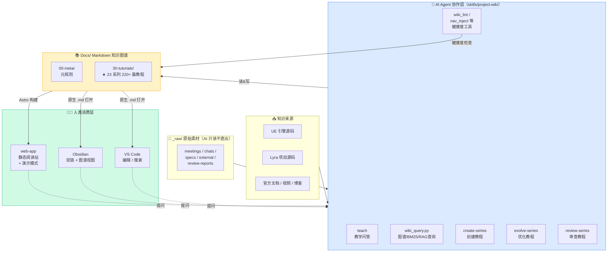
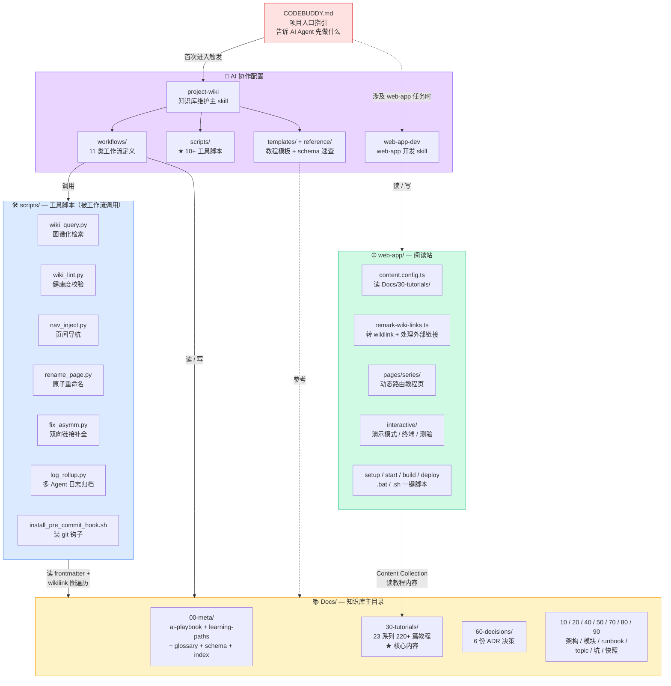
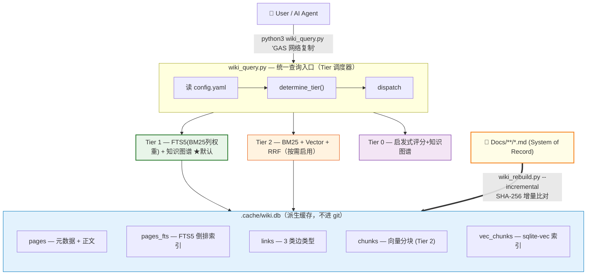
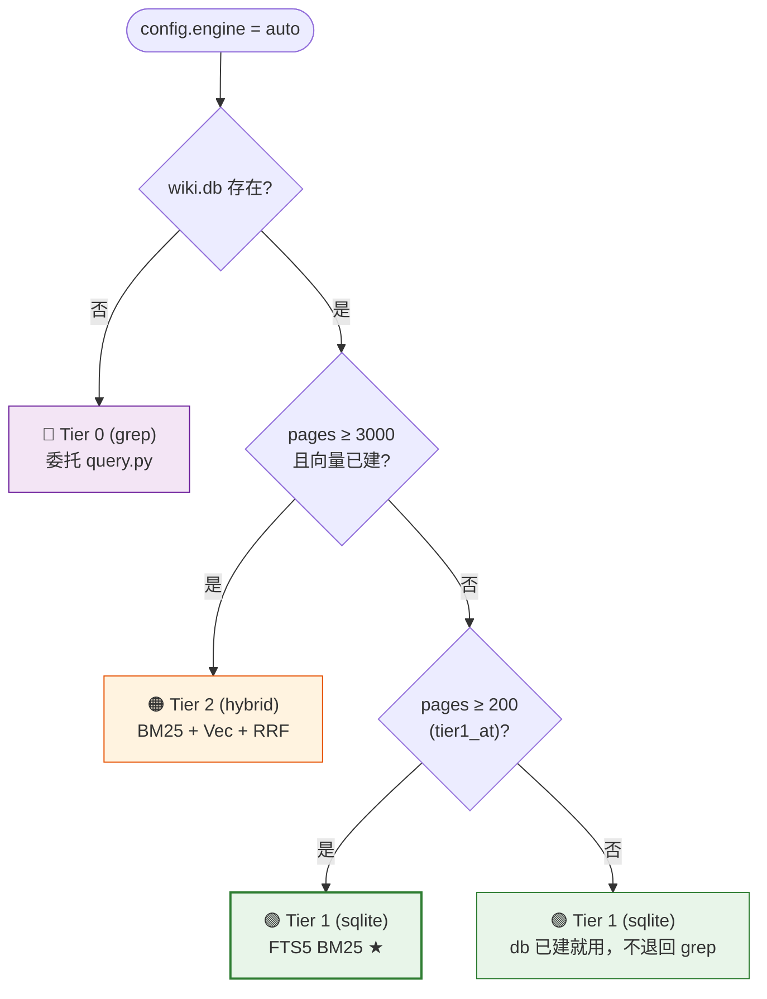
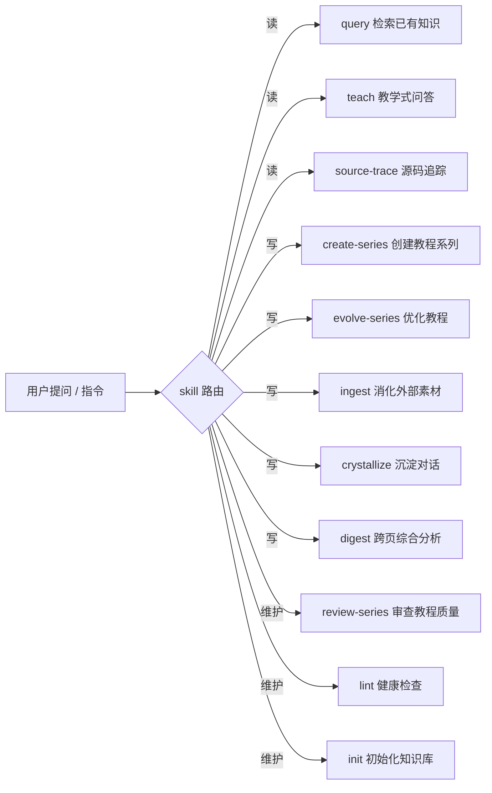

# LyraStarterGame 技术学习知识库

> 基于 UE5 官方示例项目 LyraStarterGame，结合引擎源码构建的**系统化 UE 技术学习知识库**。
>
> 本文是给**人类用户**的"知识库总览 + 上手指南"，按「由浅入深、先总后分」组织——读完前 3 节即可上手；后续章节按需深入。

---

## 1️⃣ 速览：这是什么

这是一个 **UE 技术学习知识库**，不是传统项目开发文档。


它同时服务两类用户：

| 读者 | 怎么用 |
|---|---|
| 👨‍💻 **人类学习者** | 1.用内置web-app（推荐）/ Obsidian / VS Code 直接阅读，按教程系列由浅入深      2.通过 AI Agent 基于构建的知识库进行问答或者迭代个人专属UE知识库|
| 🤖 **AI Agent**（Claude Code / CodeBuddy / Cursor） | 接收用户指令读 schema + frontmatter + wikilink 图谱，做精准检索与教学或者对知识库进行迭代 |

**三大特色**：

1. **教程为核心** — `30-tutorials/` 23 个系列 220+ 篇深度教程，由浅入深
2. **以 Lyra 为锚** — 每个引擎概念对应 Lyra 真实代码（不是空洞理论）
3. **AI 写、人审、git 兜底** — Markdown + Git

### 运行机制总览

下图展示「**教程系列内容沉淀** + **AI Agent 协作构建/使用** + **人类阅读消费**」三方如何在同一份 Markdown 知识库上协同：



**核心机制**：

- **AI Agent 是主要构建者**——通过 `.codebuddy/skills/project-wiki/` 中的 11 类工作流（teach/create-series/evolve-series/...）和 10+ 工具脚本，自动写、改、审教程。
- **wikilink 双向链接是图谱主干**——`[[id]]` 把 282 篇 wiki 织成 2594 处边，`wiki_query.py` 在其上做多跳推理，同时支持BM25、RAG 向量混合查找(丰俭由人)。
- **人类用 web-app 阅读 + 用 Agent 协作**——而不是手工翻 Markdown。日常使用方式见 §2。

> 📜 **设计灵感**：[karpathy/llm-wiki](https://gist.github.com/karpathy/442a6bf555914893e9891c11519de94f)，详见下文 §6 「设计思路」。


---

## 2️⃣ 三种推荐上手方式（按你的角色选）


### 2.1 🌐 教学系列学习者 — 启动 web-app 阅读站（首选）


最直观、最适合**完整学一个教程系列**的方式。web-app 把 `Docs/30-tutorials/` 渲染成精美阅读体验：系列导航、Mermaid / KaTeX 渲染、代码高亮、全文搜索、进度追踪、**演示模式**（PPT 模式）。

**Windows 一键启动**：

```bat
cd web-app
setup.bat        :: 首次：装 Node/pnpm/依赖（含可选的 terminal-server）
start.bat        :: 之后：开发模式 → http://localhost:4321
```

**macOS / Linux 等价命令**：

```bash
cd web-app
./setup.sh                              # 或手动：pnpm install
./start.sh                              # 或手动：pnpm dev
```

**纯 npm 命令（手动）**：

```bash
cd web-app
pnpm install
pnpm dev          # 开发预览（http://localhost:4321）
pnpm build        # 静态构建（输出 dist/，可独立部署）
pnpm preview      # 预览构建产物
```

启动后浏览器自动打开。从首页选教程系列 → 点课程标题阅读 → 课内可触发**演示模式**（按钮在页眉）做投屏讲课。详见 [ADR-0001](60-decisions/0001-knowledge-base-web-app.md) / [ADR-0002](60-decisions/0002-web-app-ui-enhancements.md) / [ADR-0003](60-decisions/0003-dev-only-web-terminal.md)。

> 💡 web-app 仅渲染 `30-tutorials/` 教程系列。要看 ADR / 架构 / C++ 模块文档，请用 §2.3 Obsidian。

### 2.2 🤖 AI 协作上手 — 通过 Agent 触发核心工作流

如果你用 Claude Code / CodeBuddy / Cursor / Codex 等 AI Agent，知识库设计成**让 Agent 主动驱动**——通过 `.codebuddy/skills/project-wiki/` skill，Agent 会自动按工作流处理任务。

**4 类最常用 Agent 操作**（直接用自然语言提，Agent 会自动路由到对应工作流）：

| 操作 | 触发说话方式 | Agent 内部走什么 |
|---|---|---|
| 🎓 **teach 教学式问答** | "讲讲 GameplayTag 网络复制是怎么工作的" | 走 [teach 工作流](../.codebuddy/skills/project-wiki/workflows/teach.md)：先 `wiki_query.py` 图谱定位 → 沿 prereq / related 1-hop 收集上下文 → 三层教学结构（概念→机制→Lyra 实例）输出 |
| 🆕 **create-series 创建教程系列** | "为 XXX 主题创建一个新教程系列" | 走 [create-series 工作流](../.codebuddy/skills/project-wiki/workflows/create-series.md)：先 `wiki_query.py` 查重 → 评估难度/篇数 → 生成 `_series.yaml` + 概览页 + 课时骨架 |
| ✏️ **evolve-series 优化教程** | "把 GAS 系列第 19 课更新到 UE5.7" | 走 [evolve-series 工作流](../.codebuddy/skills/project-wiki/workflows/evolve-series.md)：`wiki_query.py --id` 找入边 → 评估改动影响面 → 改正文 + 更新 `last_synced` + 联动改下游引用 |
| 🔍 **review-series 审查教程质量** | "审查一下 network-sync 教程系列" | 走 [review-series 工作流](../.codebuddy/skills/project-wiki/workflows/review-series.md)：扫 lesson_index 连续性 / status 健康度 / 三层教学完整度 → 输出 review-report 到 `_raw/review-reports/` |


**对 web-app 做开发迭代** — 加载 `web-app-dev` skill：

```
"加载 web-app-dev skill，给 web-app 加 XX 功能"
```

Agent 会读 `.codebuddy/skills/web-app-dev/` 里的 SKILL.md + workflows，按规范修改 `web-app/src/` 下的组件、Astro 页面、remark plugin 等。

> 详见 §7.1 11 类工作流路由图、[`00-meta/ai-playbook.md`](00-meta/ai-playbook.md) AI 协作硬约束。


### 2.3 📒 Obsidian 浏览阅读 — 体验 wikilink 图谱

如果你想**手动浏览全 282 页 wiki**（教程 + 架构 + ADR + 模块文档全包含），用 [Obsidian](https://obsidian.md/) 打开 `Docs/` 目录是最佳方式：

- **自动渲染 `[[wikilink]]`** — 点击直接跳转，不用配置
- **图谱视图**（Graph View）— 可视化全部 2594 处 wikilink，直观感受知识图谱
- **大纲面板** — 自动生成 H1/H2/H3 目录
- **后向链接面板** — 看任一页"被谁引用"
- **全文搜索** — 跨整个 vault 搜索

**首次打开**：Obsidian → "Open folder as vault" → 选 `Docs/` → 直接开用，无需配置（`.wiki-schema.md` 已规定 frontmatter 字段，Obsidian 全部识别）。

> VS Code 用户也可直接用 Markdown 插件打开 `Docs/`，但 wikilink 跳转和图谱视图体验弱于 Obsidian。

>  知识库图谱


---

## 3️⃣ 5 分钟掌握知识库结构

### 3.1 目录全景（按编号即学习深度）

```
LyraStarterGame/
├── Docs/                ← 📚 知识库本体（Markdown）
│   ├── README.md            ← 本文：知识库总览
│   ├── overview.md          ← Lyra 项目顶层概览
│   ├── index.md             ← 全 282 页 wiki 目录（AI 自动维护）
│   ├── log.md               ← append-only 日志（重要变更时间线）
│   ├── .wiki-schema.md      ← Schema 规范（frontmatter / type / 命名）
│   │
│   ├── 00-meta/             📋 元规则（必读）
│   │   ├── ai-playbook.md       ← AI 协作硬约束 ★必读
│   │   ├── learning-paths.md    ← 5 条主学习路线 ★人类入口
│   │   ├── conventions.md       ← 命名/编码/文档约定
│   │   ├── glossary.md          ← 项目术语表
│   │   └── workflows.md         ← 开发/测试/发布工作流
│   │
│   ├── 10-architecture/     🏗️ Lyra 架构层（"系统怎么运转"）
│   ├── 20-modules/          🔧 模块层（"具体类做什么"）
│   ├── 30-tutorials/        ★ 教程系列（核心，23 系列 220+ 篇）
│   ├── 40-runbooks/         🛠️ 操作手册（"如何做 X"）
│   ├── 50-references/       📚 外部参考资料
│   ├── 60-decisions/        📋 ADR 架构决策记录（6 份）
│   ├── 70-topics/           🔀 横切主题
│   ├── 80-gotchas/          ⚠️ 已知坑、bug 模式
│   ├── 90-snapshots/        📸 季度/版本快照
│   └── _raw/                💾 原始素材（AI 只读，不直接展示）
│
├── web-app/             ← 🌐 教学阅读站（Astro 5 + React 19 Islands）
│   ├── astro.config.mjs        ← Astro 主配置 + remark plugins 注册
│   ├── tailwind.config.mjs     ← Tailwind CSS
│   ├── package.json            ← scripts: dev / build / preview
│   ├── setup.bat / start.bat / build.bat / deploy.bat   ← Windows 一键脚本
│   ├── setup.sh  / start.sh  / build.sh  / deploy.sh    ← *nix 等价
│   ├── public/                  ← 静态资源
│   ├── src/
│   │   ├── content.config.ts        ← Astro Content Collection（glob Docs/30-tutorials/）
│   │   ├── pages/                   ← 路由（index / search / series/[...slug]）
│   │   ├── layouts/                 ← Astro 页面布局
│   │   ├── components/
│   │   │   ├── interactive/             ← React Islands（按需 hydrate）
│   │   │   │   ├── PresentationMode.tsx     ← 演示模式（reveal.js）
│   │   │   │   ├── TerminalPanel.tsx        ← 嵌入式 PTY 终端（dev-only）
│   │   │   │   ├── MermaidDiagram.tsx       ← Mermaid 图渲染
│   │   │   │   ├── CodeBlock.tsx            ← Shiki 代码块
│   │   │   │   ├── Quiz.tsx / StepAnimation.tsx / ProgressTracker.tsx
│   │   │   │   └── ...
│   │   │   ├── layout/                  ← Navbar / Hero / TOC / Sidebar (.astro)
│   │   │   └── ui/                      ← Badge 等基础组件
│   │   ├── lib/                     ← 工具（progress / series / theme）
│   │   ├── plugins/
│   │   │   └── remark-wiki-links.ts     ← ★ [[id]] → 路由 +
│   │   │                                       外部 wikilink 渲染为不可点击 span
│   │   │                                       （ADR-0005）
│   │   └── styles/                  ← Tailwind + typography
│   └── terminal-server/         ← Dev-only PTY bridge（独立 package，ADR-0003）
│
├── .codebuddy/skills/   ← 🤖 AI Agent skill 配置
│   ├── project-wiki/        ← 知识库维护 skill（核心）
│   │   ├── SKILL.md             ← skill 主入口（通用前置约束）
│   │   ├── workflows/           ← 11 类工作流（teach / create-series / ...）
│   │   ├── scripts/             ← ★ 10+ 工具脚本（wiki_query.py / wiki_lint / ...）
│   │   ├── templates/           ← 教程页 / ADR / runbook 模板
│   │   └── reference/           ← schema 速查 / 字段示例
│   └── web-app-dev/         ← web-app 开发 skill
│
└── CODEBUDDY.md         ← 项目顶层指引（AI 进入项目的"招呼板"）
```

### 3.2 一张图理解：核心模块如何协同驱动知识库运转

下图展示 `CODEBUDDY.md` / 两个 Skill / web-app / Docs/ 主目录 / 工具脚本 之间的依赖与驱动关系：



**关键流向**：

1. **`CODEBUDDY.md` 是 AI 进入项目的第一道门**——指引 Agent 先加载哪个 skill
2. **`project-wiki` skill 是知识库的"大脑"**——11 类工作流定义"何时该做什么"，10+ 脚本是工作流的辅助工具
3. **`Docs/` 是Wiki数据本体**——所有工作流读它、写它
4. **`web-app` 是消费端**——通过 Content Collection 读 `Docs/30-tutorials/`，加上 remark plugin 渲染 wikilink 图谱

### 3.3 当前规模数据

| 指标 | 数值 | 备注 |
|---|---|---|
| **wiki 总页数** | **282 篇**（不含 _raw） | 已进入图谱 sweet spot |
| **教程系列** | **23 个**（220+ 篇） | 占 wiki 近 80% |
| **wikilink 边** | **2594 处** | 平均每页 9.2 边，图密度高 |
| **prerequisites 教程依赖边** | **257 处** | 教程系列特色：依赖图导航 |
| **C++ 模块文档** | **20+** | 每个含 anchors 锚到源码 |
| **ADR 决策记录** | **6 份** | 架构演进可追溯 |

---

## 4️⃣ 5 个核心机制（让知识库"会自我维护"）

### 4.1 wikilink `[[id]]` — 双向链接 = 知识图谱（核心）


`[[id]]` 是 Obsidian 兼容语法，**比普通 markdown 链接强**：

| 维度 | `[[id]]` | 普通 markdown link |
|---|---|---|
| 重命名 | `rename_page.py` 批量改全仓 | 手工 grep 替换易漏 |
| 断链检测 | `wiki_lint.py` 自动检 | 难检测 |
| 双向回引 | lint `asymm-link` 强制 | 无机制 |
| AI 识别 | id 全局唯一，反幻觉 | 容易写错 |
| 图遍历 | 可沿 related/prereq 多跳推理 | 不支持 |

#### 知识图谱化查询的优势（实测对比）

每篇 wiki 的 frontmatter `related:` / `prerequisites:` 字段共同织成一张**有向图**。在 282 页 / 2594 边的当前规模下，AI 用 `wiki_query.py` 沿图遍历**相比裸 grep 的实测优势**（详见 [ADR-0004](60-decisions/0004-knowledge-graph-query.md)）：

| 场景 | grep 表现 | wiki_query.py（图谱）|
|---|---|---|
| **单点查询**（"Tag 网络复制怎么做"）| 87 文件命中（噪音） | TOP1 score=11.8 锁定 + 含 status / inbound 元数据 |
| **多页综合**（"GAS 网络复制 + 预测 演化"）| 154 文件淹没，无边类型，token 占用 ~460KB | 5 候选 + 11 邻居（5 类边：related / prereq / needed-by / series-prev/next），token 占用 ~30KB（**节省 15×**）|
| **创建新页查重** | 13 文件需人工判断是否 ≥70% 重合，**易产生重复页** | TOP1 score 自动判定 + 1-hop 邻居作为 `related:` 候选 |
| **抗 stale**（避引过期内容）| **完全感知不到** `status: stale / deprecated`，照常引用 | 自动 `× 0.5` 降权 + ⚠ GLOBAL WARNINGS 强制提示 |

**核心质变能力**：

1. **alias 词表自动展开** — `gas` → `gameplay ability system` / `能力系统`，覆盖语义歧义
2. **5 类图边召回** — `related` / `prereq` / `inverse-prereq`（被谁依赖）/ `series-prev` / `series-next`，自然完成"沿因果链遍历"
3. **anchor-hit 反向定位** — 用类名 / 文件名查 wiki（"ALyraCharacter" → 直接命中模块文档）
4. **status 警告硬约束** — 引用 `stale / deprecated` 页时强制警告，避免传播过期知识
5. **教程系列优化** — `lesson_index` 排序 + `tutorial / topic / adr` 类型 boost，找教程比 grep 准 5×

详见 §5.1 wiki_query.py 工具说明 + [ADR-0004](60-decisions/0004-knowledge-graph-query.md) 实施细节。


### 4.2 FTS5 + Vector + RRF — 多维度混合检索
在知识图谱的基础上，通过 FTS5 + Vector + RRF 实现多维度混合检索。详细设计建[知识库检索引擎设计方案](_raw/specs/知识库检索引擎设计方案.md)



#### 4.2.1 Tier 能力矩阵

| | **Tier 0**（当前默认 fallback） | **Tier 1**（推荐日常） | **Tier 2**（语义增强） |
|---|---|---|---|
| **engine 配置值** | `grep` | `sqlite` | `hybrid` |
| **入口脚本** | `wiki_query.py --engine grep` | `wiki_query.py` | `wiki_query.py --engine hybrid` |
| **检索策略** | 文件扫描 + 启发式评分 | FTS5 BM25 列权重 | BM25 + Vec + RRF |
| **知识图谱** | ✅ wikilink + related + prerequisite + series-prev/next | ✅ links 表（3 类边类型） | ✅ links 表 |
| **中文支持** | `str.in` 子串 + alias 词表 | unicode61 + **CJK 字符级预处理** | + 嵌入模型语义匹配 |
| **同义词** | ✅ alias 词表（schema 「别名词表」节自动抽取） | ❌（FTS5 不做） | ✅（嵌入天然） |
| **打分** | 5 信号手工权重 + 状态/category/domain 修正 | BM25（带 IDF + 长度归一化） + 后置软降权 | RRF 融合两路排名 |
| **依赖** | Python stdlib | Python stdlib（sqlite3 内置） | + `pip install sqlite-vec` + 嵌入 API |
| **构建** | 无需构建 | `wiki_rebuild.py --incremental` | + `--with-vectors` |
| **查询延迟（278 页实测）** | ~124 ms | **~46 ms** | ~250 ms（含 API 网络） |
| **适用规模** | 任何（启发式） | 100 - 3000 页 | 3000+ 页或语义查询 |

#### 4.2.2 实测性能

| 查询 | Tier 1 延迟 | Top-1 命中 | BM25 score |
|---|---|---|---|
| `GameplayAbility` | 48 ms | `30-tutorials/gas/01-GA简介与配置` | 5.48 |
| `网络复制` | 46 ms | `30-tutorials/gas/14-GE网络复制` | 2.79 |
| `modular gameplay` | 45 ms | `30-tutorials/modular-gameplay/00-...系列` | 4.66 |
| `Experience` | 45 ms | `40-runbooks/how-to-create-new-experience` | 2.25 |
| `受击反馈` | 46 ms | `30-tutorials/animation/03-...` | 5.06 |

> Tier 1 比 Tier 0 快 **2-3 倍**，且排名质量肉眼可见提升（短文档不再被长 overview 压制）。

#### 4.2.3 自动 Tier 决策

```yaml
# config.yaml
retrieval:
  engine: auto
  auto_thresholds:
    tier1_at: 200       # 页数 > 200 → 启用 Tier 1（项目当前 278，已默认 Tier 1）
    tier2_at: 3000      # 页数 > 3000 才考虑 Tier 2
```




#### 4.2.4 评分公式

**Tier 0**：
```
raw_score = id_hit (3.0) × 命中数
          + desc_hit (1.5) × 命中数
          + tag_hit (1.0) × 命中数
          + type_hit (0.6) × 命中数
          + anchor_hit (1.2) × 命中数
          + body_hit (0.5) × min(命中次数, 5)
          + alias-only token 命中 × 0.6（damp）
          + 核心 type boost (tutorial 0.4 / topic 0.3 / adr 0.3)

+ inbound × 0.1 (cap 10)

× status 修正系数 (current 1.0 / draft 0.7 / stale 0.5 / deprecated 0.2)
```


**Tier 1**：
```sql
SELECT bm25(pages_fts, 5.0, 3.0, 2.0, 1.0, 1.0) as score
FROM pages_fts ...
ORDER BY score LIMIT ?
```

| 列序 | 列名 | BM25 权重 | 设计意图 |
|---|---|---|---|
| 1 | `id` | **5.0** | 路径命中 = 结构性精确匹配（如 page_id 含 "ability-system" 即强相关） |
| 2 | `title` | **3.0** | 标题命中 = 高相关 |
| 3 | `description` | **2.0** | 摘要命中 = 主题相关 |
| 4 | `tags` | **1.0** | 标签命中 = 分类相关 |
| 5 | `body_text` | **1.0** | 正文命中 = 基础相关（BM25 自带 TF 饱和 + 长度归一化，无需手动 cap） |


**Tier 2**

> RRF 融合算法

```
score(doc) = bm25_weight × 1/(k + bm25_rank + 1)
           + vector_weight × 1/(k + vector_rank + 1)
```

#### 4.2.5 查询示例


### 4.3 frontmatter — 结构化元数据

每页头部 YAML 段定义 id / type / status / 锚点 / 关联，构建知识图谱、提供查询评分权重依据、Web 渲染元数据。

```yaml
---
id: 30-tutorials/gas/19-Tag网络复制
type: tutorial
status: current             # current | draft | stale | deprecated
series: gas
lesson_index: 19
difficulty: intermediate
prerequisites: [[30-tutorials/gas/18-Tag匹配查询]]
engine_sources:
  - path: Engine/Plugins/.../GameplayTagContainer.h
    context: GameplayTag 容器定义
lyra_sources:
  - path: Source/LyraGame/.../LyraGameplayTags.cpp
    context: Lyra 的 Tag 注册
related: [[30-tutorials/gas/14-GE网络复制]]
last_synced: 2026-05-18
tags: [GAS, GameplayTag, 网络复制, UE5.7]
---
```

字段全规范在 [`.wiki-schema.md`](.wiki-schema.md)。`status: stale / deprecated` 的页**不准被引用而不警告**（`wiki_query.py` 自动报警）。


### 4.4 教程系列 `_series.yaml` — 学习路径

每个 `30-tutorials/<slug>/` 下有 `_series.yaml`，定义课程顺序、难度、学时：

```yaml
id: gas
title: "Gameplay Ability System 从入门到实战"
difficulty_range: [intermediate, advanced]
estimated_hours: 40
total_lessons: 26
learning_path:
  - stage: 入门
    lessons: [00-GAS系统总览]
  - stage: GA（GameplayAbility）
    lessons: [01-GA简介与配置, 02-GA执行流程详解, ...]
  - stage: 高级主题
    lessons: [...]
```

驱动：① 学习者按顺序读；② AI `wiki_query.py --series gas` 一次性看全套；③ web-app 自动生成系列导航 UI。

### 4.5 web-app 教学阅读站 — 双层架构的消费端

`web-app/` 是把 `Docs/30-tutorials/` 转成精美阅读站的**消费层**。

**技术栈**：

- **Astro 5** — 静态站生成器，零 JS 运行时（除 Islands）
- **React 19 Islands** — 按需 hydrate 的交互组件（演示模式、Terminal、Quiz、StepAnimation 等）
- **Pagefind** — 构建期生成全文搜索索引
- **Mermaid + KaTeX + Shiki** — 图表 / 数学公式 / 代码高亮
- **reveal.js** — 演示模式底层（投屏讲课）
- **Tailwind CSS** — 样式

**可选 dev-only 模块**：`terminal-server/`（PTY bridge）— 让 web-app 内嵌一个真实 shell 终端，方便边读教程边通过内置终端启用 Agent CLI 进行问答。仅 `pnpm dev` 启用，`pnpm build` 不打包（[ADR-0003](60-decisions/0003-dev-only-web-terminal.md)）。

启动方式见 §2.1。详细架构见 [ADR-0001](60-decisions/0001-knowledge-base-web-app.md) / [ADR-0002](60-decisions/0002-web-app-ui-enhancements.md)。

---

## 5️⃣ 工具链（10+ 脚本）

> 📌 **重要**：除 `web-app/` 下的 `.bat` / `.sh`（人类直接跑）外，**`.codebuddy/skills/project-wiki/scripts/` 下的所有脚本主要为 AI Agent 服务**，由 Agent 在对应工作流中**自动调用**。人类一般不需要直接跑它们；除非你在做调试或一次性维护。脚本均为纯 Python 3 stdlib，无外部依赖。

### 5.1 ★ `scripts/wiki_query.py` — 知识图谱化一击查询（Agent 用）

最常用的工具，供 query / teach / digest / ingest / crystallize / create-series / evolve-series / source-trace 等 8 个工作流调用。把"读 index → 读 frontmatter → 1-hop 邻居展开 → grep 兜底"折叠成单次工具调用。

```bash
# 关键词查询（默认开启 alias 词表扩展，e.g. GAS ↔ Gameplay Ability System）
python3 .codebuddy/skills/project-wiki/scripts/wiki_query.py "GAS GameplayTag 网络复制"

# 看某个 id 的图邻居（多类型边：related / prereq / inverse-prereq / series-prev/next）
python3 .codebuddy/skills/project-wiki/scripts/wiki_query.py --id 30-tutorials/gas/19-Tag网络复制

# 看一整个教程系列（按 lesson_index 升序 + 跨系列邻居）
python3 .codebuddy/skills/project-wiki/scripts/wiki_query.py --series gas

# JSON 输出（喂给下游工具 / fix_asymm.py 等消费）
python3 .codebuddy/skills/project-wiki/scripts/wiki_query.py "log rollup" --json --no-body
```

输出含 TOP N 候选（含 score / status / anchors / why）+ 1-hop 多类型图邻居 + grep 兜底命中 + stale 警告 + 推荐先读 hint。详见 [[60-decisions/0004-knowledge-graph-query]]。

### 5.2 `scripts/wiki_lint.py` — 健康度校验（Agent 用 + pre-commit hook）

```bash
python3 .codebuddy/skills/project-wiki/scripts/wiki_lint.py            # 全检查
python3 .codebuddy/skills/project-wiki/scripts/wiki_lint.py --check    # 仅 ERROR（pre-commit 用）
python3 .codebuddy/skills/project-wiki/scripts/wiki_lint.py --json     # 给下游工具消费
python3 .codebuddy/skills/project-wiki/scripts/wiki_lint.py --update-cache  # 更新 anchor sha256
```

- **ERROR**（拦 commit）：断链、缺 frontmatter、bad anchor、id 与文件路径不一致、tutorial 缺必填字段...
- **WARN**（提示）：双向链接非对称、tutorial-ext-ref 正文外引、stale、ASCII art、anchor sha256 已变...

### 5.3 `scripts/install_pre_commit_hook.sh` / `.bat` — 装 git pre-commit hook（人类用，一次性）

把 `wiki_lint.py --check` 装到 `.git/hooks/pre-commit`，**之后每次 `git commit` 自动跑健康检查**，0 ERROR 才放行。

```bash
# macOS / Linux
./.codebuddy/skills/project-wiki/scripts/install_pre_commit_hook.sh

# Windows
.\.codebuddy\skills\project-wiki\scripts\install_pre_commit_hook.bat

# 检查版本 / 卸载
./install_pre_commit_hook.sh --check-version
./install_pre_commit_hook.sh --uninstall
```

特性：版本化（`HOOK_VERSION` 标记，旧版自动覆盖更新）、防误覆盖（识别非本脚本装的 hook 会报错）、opt-in autofix（`WIKI_LINT_AUTOFIX_ASYMM=1 git commit ...` 自动补对称回链）。

### 5.4 `scripts/nav_inject.py` — 自动注入页间导航（Agent 用）

```bash
python3 .codebuddy/skills/project-wiki/scripts/nav_inject.py --section-scope --apply
```

给每页底部注入 `← 上一页 · ↑ index · 下一页 →` 导航块。`--section-scope` 模式不跨教程目录边界（避免上一页跳到无关章节）。

### 5.5 `scripts/rename_page.py` — 安全重命名（Agent 用）

```bash
python3 .codebuddy/skills/project-wiki/scripts/rename_page.py \
    --from 60-topics/old-name --to 60-topics/new-name --apply
```

**4 步原子操作**：① 改文件名 → ② 改 frontmatter `id` → ③ 改 `index.md` 引用 → ④ 全仓 `[[old-name]]` → `[[new-name]]`。

### 5.6 `scripts/fix_asymm.py` — 修双向链接非对称（Agent 用）

```bash
python3 .codebuddy/skills/project-wiki/scripts/fix_asymm.py        # dry-run
python3 .codebuddy/skills/project-wiki/scripts/fix_asymm.py --apply  # 写入
```

读 `wiki_lint --json` 报告，自动给 target 页 `related:` 追加回引（或 `--reverse` 删除单向边）。

### 5.7 `scripts/log_rollup.py` — 多 Agent 日志归档（Agent 用）

把 `log.d/log-<owner>.md`（每个 Agent 一份）合并到主 `log.md`，支持去重和按时间排序。

### 5.8 全套测试

每个工具都有配套 `test_*.py`：

```bash
for f in test_*.py; do python3 .codebuddy/skills/project-wiki/scripts/$f; done
```

目前 `test_query.py` 88 项断言全 PASS，`test_wiki_lint.py` / `test_nav_inject.py` / `test_rename_page.py` / `test_fix_asymm.py` 同样通过。

### 5.9 web-app/ 一键脚本（人类用）

> 这几个脚本是给**人类用户**准备的，不属于 AI Agent 工作流。Windows `.bat` 与 *nix `.sh` 一一对应。

| 脚本 | 作用 | 等价 npm 命令 |
|---|---|---|
| `web-app/setup.bat` / `setup.sh` | 检查 Node ≥18 → 装 pnpm（如缺）→ `pnpm install` → 装 terminal-server 依赖（可选） | `pnpm install && (cd terminal-server && pnpm install)` |
| `web-app/start.bat` / `start.sh` | 检查依赖 → 启动 terminal-server（可选）→ `pnpm dev` 起开发服务 + 浏览器自动打开 `http://localhost:4321` | `pnpm dev` |
| `web-app/build.bat` / `build.sh` | 检查依赖 → `pnpm build` 生成静态 dist/ → 注入 `serve.bat`（独立部署用） | `pnpm build` |
| `web-app/deploy.bat` / `deploy.sh` | 调用 `deploy.ps1` / 部署脚本，把 dist/ 推到目标环境 | （项目特定）|

**首次使用流程**：`setup` → `start`（开发预览） → 满意后 `build`（出静态产物） → 必要时 `deploy`。

---

## 6️⃣ 设计思路


### 6.1 Karpathy LLM Wiki 模式

本知识库深受 Andrej Karpathy 的 [LLM Wiki](https://gist.github.com/karpathy/442a6bf555914893e9891c11519de94f) 启发。

**与传统 RAG 的本质区别**：

| 维度 | 传统 RAG | LLM Wiki（本项目）|
|---|---|---|
| 知识形态 | 临时检索的文档块 | 持久化结构化 Markdown |
| 复用性 | 每次查询从头梳理 | **知识只编译一次，持续复利** |
| 关联 | 隐式向量距离 | **显式双向 wikilink 图谱** |
| 可解释性 | 黑盒（embedding） | **极高（图可视化）** |
| 多跳推理 | 弱 | **天然支持（沿 related/prereq）** |
| 维护 | embedding 重算 | lint + 双向规则（人写人审 / AI 写 AI 审） |

类比：**Obsidian 是 IDE，LLM 是程序员，Wiki 是代码库。**

### 6.2 三层架构

```
原始数据源（_raw/）         ← 永不修改的素材：spec、会议、外部文章、源码扫描
        │
        ▼  AI 通过 ingest 工作流读取、提取、整合

Wiki 本体（Docs/ 各目录）   ← AI 创建/更新，含摘要/实体/概念/对比页
        │
        ▼  Schema（.wiki-schema.md）+ ai-playbook 指导 AI 如何维护

用户查询 → 基于 Wiki 而非原始文档回答
```

### 6.3 工程化扩展（针对技术学习场景）

相对 Karpathy 的通用模式，本项目针对**技术学习**做了 5 项扩展：

1. **教程是核心内容，不是附属参考** — `30-tutorials/` 占 wiki 近 80%
2. **三层教学结构** — 概念直觉 → 技术机制 → Lyra 实例
3. **由浅入深的学习路径** — `_series.yaml` 定义课程顺序
4. **AI 可消费** — 结构化 frontmatter + wikilink + alias 词表
5. **源码追踪集成** — anchors / engine_sources / lyra_sources 锚到具体代码

### 6.4 与传统文档的对比

| 维度 | 传统项目文档 | 本知识库 |
|---|---|---|
| 定位 | 记录"做了什么" | 教学"为什么这样设计" |
| 组织 | 按模块/功能 | 按**学习路径**（由浅入深）|
| 主读者 | 项目开发者 | 技术学习者 + AI Agent |
| 深度 | API 文档级别 | **源码级深度分析** |
| 关联 | 单向引用 | **双向 wikilink 图谱** |
| 维护 | 人手工更新 | AI 写 + lint 兜底 |

### 6.5 文档编写原则

1. **由浅入深** — 先概念直觉，再技术细节
2. **先总后分** — 先全景图，再逐模块拆解
3. **理论 + 实践** — 每个引擎概念对应 Lyra 真实代码
4. **渐进式代码** — 核心行 → 完整函数 → 调用链
5. **图示优先** — 流程/架构强制 Mermaid，禁止 ASCII art

---

## 7️⃣ 运行机制：知识库如何"活起来"

### 7.1 AI Agent 协作（主驱动力）

知识库由 AI Agent 编写和维护，通过 `.codebuddy/skills/project-wiki/` skill 驱动。

**11 类工作流**（按用户意图自动路由）：



每个工作流的详细约定在 `.codebuddy/skills/project-wiki/workflows/<name>.md`。

### 7.2 通用前置约束（所有工作流通用）

每次 AI 介入知识库工作前必须：

1. 读 `Docs/.wiki-schema.md` 确认目录约定
2. 读 `Docs/index.md` 做轻量定位
3. **★ 任何"查 wiki / 找重 / 检索 / 收集来源 / 检查影响"的步骤，先用 `wiki_query.py`**——`rg` 仅作 fallback
4. 引用 `status: stale / deprecated` 时**必须警告**用户

详见 [`00-meta/ai-playbook.md`](00-meta/ai-playbook.md)。

### 7.3 质量保障

| 机制 | 保障内容 |
|---|---|
| `wiki_lint.py` pre-commit hook | 0 ERROR 才能 commit（断链 / 缺字段 / id 错位等） |
| `nav_inject.py` | 自动维护页间导航（不跨节边界） |
| anchor sha256（v1.1） | 检测代码变更 → 标 wiki stale |
| `rename_page.py` | 重命名 4 步原子（避免漏改） |
| 6 份 ADR | 架构决策记录可追溯 |

### 7.4 多 Agent 共享坐标系

本项目同时使用 4 个 AI Agent（Cursor / Claude Code / CodeBuddy / Codex），通过 [ADR-0004](60-decisions/0004-knowledge-graph-query.md) 的 symlink 机制共享同一份 skill 与查询规范——无论谁写的 log，指向的 `[[id]]` 全项目唯一，避免重复造页。

### 7.5 web-app 与 Docs/ 的协同

详见 §4.4 web-app 阅读站说明。核心是「图谱完备性 vs 读者可达性」的双层架构（[ADR-0005](60-decisions/0005-tutorial-cross-link-policy.md)）。

### 7.6 人工使用方式

| 场景 | 推荐工具 |
|---|---|
| 浏览阅读教程系列 | **web-app**（首选）/ Obsidian |
| 浏览全 wiki 含 ADR/架构 | Obsidian（自动渲染 wikilink + 图谱视图）|
| 编辑写作 | VS Code + Markdown 插件 |
| 全文搜索 | VS Code 内置 / Obsidian 搜索 / web-app Pagefind |
| 教学演示 | web-app 的演示模式 |
| AI 协作 | Claude Code / CodeBuddy / Cursor / Codex |

---

## 8️⃣ 重点模块解析

### 8.1 `00-meta/` — 必读元规则

| 文件 | 用途 | 读者 |
|---|---|---|
| **[`ai-playbook.md`](00-meta/ai-playbook.md)** | AI 协作硬约束（信源优先级 / 检索规范 / 教学约束 / 反模式）| AI 必读 |
| **[`learning-paths.md`](00-meta/learning-paths.md)** | 5 条主学习路线（A/B/C/D/E）+ 难度推荐 | 人类入口 |
| [`conventions.md`](00-meta/conventions.md) | Lyra 命名 / 编码 / 文档约定 | 贡献者必读 |
| [`glossary.md`](00-meta/glossary.md) | 项目术语表（GAS / Experience / etc.）| 全体 |
| [`workflows.md`](00-meta/workflows.md) | 开发/测试/发布工作流 | 维护者 |

### 8.2 `30-tutorials/` — 教程系列（核心）

23 个系列按主题分组：

| 主题群 | 系列 | 篇数 |
|---|---|---|
| **基础框架** | ue-framework / ue-reflection | 16 + 8 |
| **核心玩法系统** | gas / modular-gameplay / game-feature / ai-behavior | 27+6+6+7 |
| **网络与同步** | network-sync | 15 |
| **资源管理** | resource-management / garbage-collection / config-ini | 8+8+8 |
| **运动与角色** | movement-system / camera-system / input-system | 11+11+7 |
| **视觉系统** | animation / niagara / pcg / mutable | 11+8+11+9 |
| **UI / 工具** | umg / blueprint-system / editor-extension | 10+9+9 |
| **优化与本地化** | performance-optimization / localization-i18n | 7+8 |
| **Lyra 实战** | lyra-practical | 11 |

详见 [`30-tutorials/README.md`](30-tutorials/README.md)。每个系列有自己的 `00-overview.md` 入口。

### 8.3 `60-decisions/` — ADR（架构决策记录）

读 ADR 比读"现状"更能理解项目"为什么是这样"：

| ADR | 决策内容 |
|---|---|
| [0001](60-decisions/0001-knowledge-base-web-app.md) | 知识库教学演示 Web 应用（Astro + React Islands） |
| [0002](60-decisions/0002-web-app-ui-enhancements.md) | Web 应用 UI 增强 + 演示模式 |
| [0003](60-decisions/0003-dev-only-web-terminal.md) | 开发专用 Terminal（PTY bridge） |
| [0004](60-decisions/0004-knowledge-graph-query.md) | **知识图谱化查询**（wiki_query.py + 差异化规范） ★最新 |
| [0005](60-decisions/0005-tutorial-cross-link-policy.md) | **教程跨层引用策略**（图谱完备性 vs 读者可达性的分层处理） ★最新 |

### 8.4 `_raw/` — 原始素材

```
_raw/
├── meetings/     会议记录
├── chats/        关键 AI 对话沉淀
├── specs/        需求 / 设计文档
├── external/     抓取的外部素材（UE 官方文档、博客、视频转写）
└── review-reports/  教程审查报告（review-series 工作流产物）
```

**AI 只读，不直接展示给读者**。所有进入 wiki 正文的内容必须经过 `ingest` 工作流的整理。

### 8.5 `web-app/`（位于项目根目录，非 Docs/ 内）

| 路径 | 作用 |
|---|---|
| `astro.config.mjs` | Astro 配置（含 remark plugins 注册） |
| `src/content.config.ts` | Content Collection（glob `Docs/30-tutorials/`） |
| `src/plugins/remark-wiki-links.ts` | ★ 把 `[[id]]` 转 URL；外部 wikilink 渲染为不可点击 span（[ADR-0005](60-decisions/0005-tutorial-cross-link-policy.md)） |
| `src/pages/series/[...slug].astro` | 动态路由教程页 |
| `src/components/interactive/` | React Islands：`PresentationMode`（演示模式）/ `TerminalPanel`（dev-only PTY）/ `MermaidDiagram` / `Quiz` / `StepAnimation` 等 |
| `src/components/layout/` | Astro 布局组件（Navbar / Hero / TOC / FloatingSidebar）|
| `src/lib/` | 工具（progress / series / theme） |
| `terminal-server/` | Dev-only PTY bridge（独立 package） |
| `setup.bat / start.bat / build.bat / deploy.bat` | Windows 一键脚本 |
| `setup.sh  / start.sh  / build.sh  / deploy.sh`  | *nix 一键脚本 |

**对 web-app 做开发**：加载 `web-app-dev` skill，详见 §2.2。

---

## 9️⃣ 给三类读者的具体上手建议

### 9.1 第一次接触 UE 的学习者

**第 1 周**：

1. 启动 `web-app`（§2.1），从首页选**路线 A：UE 框架基础** 进入
2. 按系列 `_series.yaml` 顺序读教程，每篇 30-60 分钟，可开演示模式投屏
3. 遇到不懂的概念 → 直接问 AI Agent（"讲讲 X 是什么"），它会走 [`teach` 工作流](../.codebuddy/skills/project-wiki/workflows/teach.md)精准教学

可选：用 Obsidian 打开 `Docs/` 看图谱视图，建立"UE 知识全景"直觉。

### 9.2 已有 UE 经验、想深入 Lyra 的开发者

1. 跳过 `learning-paths.md`，用 Obsidian 打开 `Docs/` 直接看 [`overview.md`](overview.md) + [`10-architecture/overview.md`](10-architecture/overview.md)
2. 按主题查 `30-tutorials/lyra-practical/` 系列（11 篇 Lyra 项目实战）
3. 想了解某个类的实现 → `20-modules/cpp/<ClassName>.md` 查 anchors 跳源码
4. 关心架构演进 → 读 `60-decisions/` 全部 6 份 ADR

### 9.3 知识库贡献者 / AI 提示词工程师

1. 必读 [`00-meta/ai-playbook.md`](00-meta/ai-playbook.md) 与 [`.wiki-schema.md`](.wiki-schema.md)
2. 学一遍 11 个工作流（在 `.codebuddy/skills/project-wiki/workflows/`）
3. 装 pre-commit hook（§5.3），让 commit 自动跑 lint
4. 跑一次工具链熟悉手感：
   ```bash
   python3 .codebuddy/skills/project-wiki/scripts/wiki_query.py "你感兴趣的关键词"
   python3 .codebuddy/skills/project-wiki/scripts/wiki_lint.py
   ```
5. 读 [ADR-0004](60-decisions/0004-knowledge-graph-query.md) 理解"为什么走图谱"的设计闭环
6. 读 [ADR-0005](60-decisions/0005-tutorial-cross-link-policy.md) 理解 wiki ↔ web-app 双层架构

---

## 🔟 演进路线 + 当前版本

| 版本 | 能力 | 状态 |
|---|---|---|
| v1.0 | 知识库重构 + 教程体系 + 学习路线 | ✅ 已完成 |
| v1.1 | anchor sha256 + stale 自动检测 | 🔧 实装中 |
| v1.2 | git pre-commit / post-commit hook | ✅ 已落地（pre-commit） |
| **v1.3** | **知识图谱化查询 + 教程跨层引用策略** | ✅ 已完成（[ADR-0004](60-decisions/0004-knowledge-graph-query.md) / [ADR-0005](60-decisions/0005-tutorial-cross-link-policy.md)） |
| v1.4 | `.indexes/` 派生索引（by-tag / by-series / by-anchor） | 📅 规模超 500 页时 |
| v1.5 | qmd 本地检索集成 | 📅 规模超 1000 页时 |

---

## 1️⃣1️⃣ 相关链接

### 内部资源

- 📋 **Schema 规范**：[`.wiki-schema.md`](.wiki-schema.md)
- 🤖 **AI 协作手册**：[`00-meta/ai-playbook.md`](00-meta/ai-playbook.md)
- 🎓 **学习路线**：[`00-meta/learning-paths.md`](00-meta/learning-paths.md)
- 📒 **全量目录**：[`index.md`](index.md)
- 📝 **变更日志**：[`log.md`](log.md)
- 🛠️ **project-wiki Skill**：[`.codebuddy/skills/project-wiki/`](../.codebuddy/skills/project-wiki/)
- 🧱 **web-app-dev Skill**：[`.codebuddy/skills/web-app-dev/`](../.codebuddy/skills/web-app-dev/)
- 🌐 **web-app 阅读站**：[`web-app/`](../web-app/)

### 外部参考

- **设计灵感**：[karpathy/llm-wiki](https://gist.github.com/karpathy/442a6bf555914893e9891c11519de94f)
- **Lyra 项目**：[UE5 官方 Lyra 示例](https://docs.unrealengine.com/5.0/zh-CN/lyra-sample-game-in-unreal-engine/)
- **Unreal Engine**：[UE 5 官方文档](https://docs.unrealengine.com/5.0/zh-CN/)
- **Obsidian**（推荐阅读工具）：[obsidian.md](https://obsidian.md/)
- **Astro**（web-app 框架）：[astro.build](https://astro.build/)

---

> 📌 **本文档持续更新**。最后更新：2026-05-23（v1.3）。如有变更建议，请改 `Docs/log.md` 追加段头并 PR。
