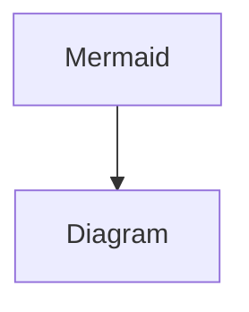

[全网首篇? Unreal Iris Replication中文资料-腾讯云开发者社区-腾讯云](https://cloud.tencent.com/developer/article/2255819)

[虚幻引擎中的Iris简介 | 虚幻引擎 5.3 文档 | Epic Developer Community](https://dev.epicgames.com/documentation/zh-cn/unreal-engine/introduction-to-iris-in-unreal-engine?application_version=5.3)

> 💡
>
> 基于UE5.7版本

# 概述

---

 **Iris** 是虚幻引擎 5.2 引入的全新**网络同步体系**，旨在通过**解耦**游戏逻辑数据与网络传输数据，提升大规模多人互动的性能。该系统核心通过**复制桥 (ReplicationBridge)** 连接游戏世界(Gameplay)与复制系统(ReplicationSystem)。相比旧版架构，Iris 支持**并发操作**处理数据的对比与拷贝，能更高效地利用多核 CPU 资源。此外，它引入了**网络序列化器(NetSerializer)机制**，实现了更灵活的网络带宽流量控制、序列化效率、提升了扩展性。



## 特性&优势

---

**Iris通过以下方式实现复制性能优化**：

> [!note]- **提高了可扩展性**
> > 💡
> >
> >     每个类型都可以通过定制一个网络序列化器(NetSerializer)来自定义以下操作
> >
> >     量化(Quantize&Dequantize)、
> >
> >     序列化(Serialize&Deserialize&SerializeDelta&DeserializeDelta)、
> >
> >     拷贝(Apply)、
> >
> >     对比(IsEqual)逻辑
>
> - 代码示例
>
>     ```cpp
>     struct FNetSerializer
>     {
>         //序列化
>         NetSerializeFunction Serialize;
>         NetDeserializeFunction Deserialize;
>
>         //增量序列化
>         NetSerializeDeltaFunction SerializeDelta;
>         NetDeserializeDeltaFunction DeserializeDelta;
>
>         //量化
>         NetQuantizeFunction Quantize;
>         NetDequantizeFunction Dequantize;
>
>         //对比
>         NetIsEqualFunction IsEqual;
>
>         //有效检查
>         NetValidateFunction Validate;
>
>         //拷贝量化数据
>         NetCloneDynamicStateFunction CloneDynamicState;
>         NetFreeDynamicStateFunction FreeDynamicState;
>
>
>         //反序列化时拷贝到 Gameplay 的复制对象中
>         NetApplyFunction Apply;
>     }
>
>     struct FStructNetSerializer
>     {
>     public:
>         static void Serialize(...);
>         static void Deserialize(...);
>
>         static void SerializeDelta(...);
>         static void DeserializeDelta(...);
>
>         static void Quantize(...);
>         static void Dequantize(...);
>
>         static bool IsEqual(...);
>         static bool Validate(...);
>
>         static void CloneDynamicState(...);
>         static void FreeDynamicState(...);
>
>         static void CollectNetReferences(...);
>
>     private:
>         static void CloneStructMember(...);
>     }
>     ```

> [!note]- **通过分离复制和游戏线程数据，DS 支持启用并发操作对比和拷贝复制数据**
> DefaultEngine.ini开启并发配置
>
> ```cpp
> [/Script/Engine.NetDriver]
> ReplicationSystemConfigServer=(bAllowParallelTasks=true)
> ```
>
> 对比和拷贝当前帧复制对象发生修改的字段(每个并发线程分配处理不同的复制对象)
>
> ```cpp
> void FObjectPoller::PollAndCopyObjects(...)
> {
>     if (ReplicationSystemInternal->AreParallelTasksAllowed() && 
>             bEachTaskHasAChunkOfWork && 
>             NumPollingTasks > 0)
>     {
>         ReplicationSystemInternal->StartParallelPhase();
>     }
> }
> ```

- **连接之间共享复制数据，提高了效率**
- **通过为不同类型定制网络序列化器(NetSerializer)提高序列化效率、压缩网络数据**
    
    

**与旧版体系相比**:

- 强依赖PushModel
- Property级别的流量控制
- RPC和属性复制时序稳定
- 不支持ReplicationGraph(Iris通过Filter机制代替)


旧版网络复制架构

> 💡
>
> 在旧版网络同步架构中，以Actor为通信单元，每个网络同步的Actor在各个网络连接中都会创建一个ActorChannel负责该Actor在连接中网络通信。
>
> 新的Iris架构中 所有Actor的通信都是通过UDataStreamChannel完成，不再为每个Actor创建单独的ActorChannnel


Iris架构 Gameplay系统与复制系统(ReplicationSystem)隔离开，不互相依赖

## **相关概念梳理**

---

> [!note]- **复制系统(ReplicationSystem)**
> 复制系统(ReplicationSystem)是 Iris 架构中负责执行网络复制逻辑的主体


> [!note]- **复制网桥(ReplicationBridge)**
> Iris的设计理念是将Gameplay系统与复制系统(ReplicationSystem)隔离开，不互相依赖。两者之间通过中间层来进行通信。这个中间层就是**复制网桥(ReplicationBridge)。**
>
> > 💡
> >
> >     复制网桥(ReplicationBridge)充当Gameplay系统与复制系统(ReplicationSystem)两者之间的通信桥接。


> [!note]- 网络对象(**NetObject)&网络句柄(NetHandle)**
> 当Gameplay中的一个复制对象(UObject)需要开启复制时，会通过ReplicationBridge向ReplicationSystem中执行注册，会在ReplicationSystem中生成一个对应的网络对象(**NetObject)。**并为两者建立映射关系**网络句柄(NetHandle)。**
>
> > 💡
> >
> >     网络对象(**NetObject)**即Gameplay的复制对象(UObject)在ReplicationSystem中的分身


> [!note]- **复制实例协议(ReplicationInstanceProtocol)&复制片段(ReplicationFragment)**
> 然后就需要为复制对象(UObject)和ReplicationSystem中对应的网络对象(NetObject**)**创建一个协议方便两者之间进行数据交换，这个协议就是**复制实例协议(ReplicationInstanceProtocol)。**
>
> ReplicationInstanceProtocol内部又拆分成多个**复制片段(ReplicationFragment)**，每个ReplicationFragment负责一个或者多个复制字段的数据交换(包括需要复制的属性字段和RPC函数)。
>
> > 💡
> >
> >     ReplicationInstanceProtocol是ReplicationFragment的集合。所以上面Iris架构图ReplicationFragments就是ReplicationInstanceProtocol，负责执行两者之间的数据交换。
>
> ```cpp
> //复制协议
> struct FReplicationInstanceProtocol
> {
>     **//复制片段(ReplicationFragment)数组指针**
>     FReplicationFragment* const * Fragments;
>     **//复制片段的数量**
>     uint16 FragmentCount;
> };
> ```
>
> ```cpp
>
> bool FReplicationInstanceOperations::PollAndCopyPropertyData(...)
> {
> ...
>     **//复制对象(UObject)的复制数据拷贝到网络对象(NetObject)
>     //遍历协议内部的复制片段，交由复制片段去执行**
>     for (uint32 StateIt = 0; StateIt < FragmentCount; ++StateIt)
>     {
>         InstanceProtocol->Fragments[StateIt]->PollReplicatedState(...);
>     }
> ...
> }
> ```


> [!note]- **复制协议(ReplicationProtocol)&复制状态描述符(ReplicationStateDescriptor)**
> 在创建复制实例协议(ReplicationInstanceProtocol)或者说复制片段组时会先找到此类型的 UObject对应的**复制协议(ReplicationProtocol)。** 复制协议是描述所有此类型的复制对象遵循什么规则进行Gameplay 与ReplicationSystem之间的数据转换。
>
> > 💡
> >
> >     ReplicationProtocol才是定义数据转化规则的核心协议。ReplicationProtocol与ReplicationInstanceProtocol有点类似类与类对象实例之间的关系。
> >
> >     ReplicationProtocol定义了规则(相同类型的共用一套规则)，ReplicationInstanceProtocol在规则的基础上增加了复制对象实例的数据部分。(Gameplay 的原始数据和ReplicationSystem的副本数据)
>
> 对应上面的ReplicationInstance，ReplicationProtocol内部也拆分成多个**复制状态描述符(ReplicationStateDescriptor)，**每个ReplicationStateDescriptor负责一个或者多个复制字段的规则定制(包括需要复制的属性字段和RPC函数)。也就是ReplicationFragment和ReplicationStateDescriptor一一对应
>
> 
>
> > 💡
> >
> >     每种类型的复制对象之所以会拆分成一个或者多个ReplicationStateDescriptor，是因为根据复制内容的不同会进行分组，每组对应一个ReplicationStateDescriptor，一个ReplicationStateDescriptor管理的一个或者多个复制字段
> >
> >     目前遵循的分组规则是:
> >
> >     描述只在连接初始化才复制的字段分为一组(InitOnly)
> >
> >     描述带有复制条件的字段分为一组(LifetimeConditionals)
> >
> >     描述其他类型的字段分为一组
> >
> >     描述RPC 函数分为一组
> >
> >     描述 FastArray 此类自定义复制片段的字段，每个字段单独分为一组


> [!note]- **复制状态(ReplicationState)**
> 复制状态(ReplicationState)是存放在ReplicationSystem中的副本数据。每次复制之前都需要将复制对象Gameplay 中的原始数据跟ReplicationSystem中副本数据进行对比，将发生修改的字段置脏并拷贝到副本数据中（PollAndCopy）。
>
> > 💡
> >
> >     每个复制片段(ReplicationFragment)都会存放一份其负责字段的副本数据，并且会持有原始数据(UObject 的指针)，这样ReplicationFragment就集齐了复制规则+Gameplay 中的原始数据+ReplicationSystem中副本数据，能够顺利进行数据转换了
>
> ```cpp
> class FPropertyReplicationFragment : public FReplicationFragment
> {
> ...
>     **//复制规则**
>     TRefCountPtr<const FReplicationStateDescriptor> ReplicationStateDescriptor;
>     **//Gameplay 中的原始数据**
>     UObject* Owner;
>     **//ReplicationSystem中副本数据**
>     TUniquePtr<FPropertyReplicationState> SrcReplicationState;
>
>
> ...
> }
>
> ```


| 概念 | **说明** |
| --- | --- |
| **复制网桥(ReplicationBridge)** | 充当Gameplay系统与复制系统(ReplicationSystem)两者之间的通信桥接 |
| **复制实例协议(ReplicationInstanceProtocol)** | **负责复制对象在 Gameplay和复制系统之间所有复制数据转换。**内部包含多个复制片段(ReplicationFragment) |
| **复制片段(ReplicationFragment)** | 包含了**复制状态、复制对象UObject指针。**也就是同时关联了Gameplay需要复制的数据(原始数据)和ReplicationSystem保留的副本数据(复制状态)。**所以复制片段负责了两者之间复制字段的数据对比&交换** |
| **复制协议(ReplicationProtocol)** | 指定类型的复制对象遵循什么规则进行Gameplay 与ReplicationSystem之间的数据转换 |
| **复制状态描述符(ReplicationStateDescriptor)** | 基于类型的反射数据构造，描述复制对象复制字段的信息，**内存偏移**、**复制条件、NetSerializer**等信息。 |
| **复制状态(ReplicationState)** | 包含需要复制字段的**副本数据(StateBuff)**，用来跟Gameplay的复制数据做对比，对比后修改字段会写入副本数据(StateBuff)中 |
| **网络序列化器(NetSerializer)** | 定义数据类型的量化&序列化&对比操作 |
| **筛选器(Fitering)** | 筛选允许哪些Actor复制到哪些连接。 |
| **优先级安排(Priortization)** | 排定复制Actor和对象的优先顺序。 |

## 数据转换

---


Iris复制系统数据转换流程

- **PollAndCopy**:属性同步时，会先通过 PollAndCopy 操作跟复制系统存放的副本数据(ReplicationState)做对比，将有改动的字段置脏(MarkDirty)并拷贝新的数值到副本
- **Quantize**:量化(Quantize)操作将副本数据中本帧发生改动的字段量化到量化数据中
- **Serialize**:序列化会将量化数据序列化到网络字节流中准备发送
- **Deserialize**:反序列化将网络中接收到修改数据转化成量化数据。
- **Dequantize**:反量化将量化数据转换成副本数据(ReplicationState)
- **Apply(InternalApplyPropertyValue)**:将副本数据(ReplicationState)的数据拷贝到 Gameplay中


Iris数据内存布局

> 💡
>
> - 副本数据只保留原始数据中需要复制的字段(复制字段的内存布局跟原始数据的一致)
> - 量化数据相对于副本数据为了适配更高效的序列化和压缩数据量，可以是新的类型，新的内存布局(具体参照后面示例)。
> - 量化数据中只保留需要复制的字段。比如复制字段中嵌套了一个Struct的，副本数据中是保留完整的Struct的内存布局，而量化数据则只保留Struct中需要复制的子字段，不复制的子字段丢弃，内存更加连续紧凑。

> 💡
>
> Iris 网络序列化器就像一个**高级物流打包站**。
>
> - **PollAndCopy** 是质检员，对比货物是否发生了变化；
> - **Quantize** 是打包员，把松散的货物拆掉多余包装，紧凑地塞进标准规格的盒子里（量化数据）；
> - **Serialize** 是贴单员，把盒子里的信息压缩成一张轻便的条码（位流）发送出去；

# 启用Iris

---

**要在你的项目中启用Iris，请确保启用了Iris插件。**

方法是将下面的代码块添加到你的 .uproject 文件的 Plugins 分段：

```cpp
{
	"Name": "Iris",
	"Enabled": true
},
```

> 💡
>
> 也可以直接通过编辑器启用插件

> 💡
>
> 5.7 之后**Iris**已经正式合入，不再是插件形式，但也需要在插件中手动开启

调用 SetupIrisSupport 以快速轻松地将Iris的必需依赖性添加到你的模块的 .Build.cs 文件中。将以下代码添加到你的模块的 .Build.cs 文件，以在你的模块中包含Iris：

```cpp
SetupIrisSupport(Target);
```

**启用或禁用Iris的配置** 

是否启用Iris可以参照UEngine::WillNetDriverUseIris

> [!note]- 直接将变量CVarUseIrisReplication默认值改为1 则默认启用Iris。
> > 💡
> >
> >     如果启动命令参数带了UseIrisReplication=0 则会关闭
> >
> >     参照UEngine::WillNetDriverUseIris

> [!note]- GameMode有个可编辑字段GameNetDriverReplicationSystem可以修改使用当前GameMode时是否启用Iris
> > 💡
> >
> >     默认配置不修改Iris的是否启用配置 听上面CVarUseIrisReplication的

> [!note]- 启动游戏时使用命令行参数启用或禁用Iris
> > 💡
> >
> >     UseIrisReplication=1 启用Iris
> >
> >     UseIrisReplication=0 禁用Iris
> >
> >     参照函数EReplicationSystem GetUseIrisReplicationCmdlineValue()
> >
> >     如果没加命令行参数则参考前面两个配置
>
>
> > 上面3种修改Iris是否启用的优先级 
**CVarUseIrisReplicationpe配置>GameMode配置>命名行参数UseIrisReplication**
> 

```cpp
bool UEngine::WillNetDriverUseIris(..) const
{

	//首先通过ShouldUseIrisReplication 判定是否默认开启了Iris
	//(控制台变量CVarUseIrisReplication)
	const bool bIsEngineDefaultIris = UE::Net::ShouldUseIrisReplication();

	bool bUseIrisRepSystem = bConfigCanUseIris && bIsEngineDefaultIris;

	if (UGameInstance* ContextGameInstance = Context.OwningGameInstance)
	{
		//GameMode配置还可以修改下Iris的启用配置
		//GetDesiredReplicationSystem实际读取的是GameMode的配置
		//GameMode的配置默认值是EReplicationSystem::Default
		//默认不修改Iris是否启用配置 有需求单独设置
		EReplicationSystem GameInstanceDesiredRepSystem = 
		ContextGameInstance->GetDesiredReplicationSystem(InNetDriverDefinition);
		if (GameInstanceDesiredRepSystem == EReplicationSystem::Generic)
		{
			bUseIrisRepSystem = false;
		}
		else if (GameInstanceDesiredRepSystem == EReplicationSystem::Iris)
		{
			bUseIrisRepSystem = bConfigCanUseIris;
		}
	}

	
	//启动参数UseIrisReplication 可以修改下Iris的启用配置
	const EReplicationSystem CmdlineRequest = UE::Net::GetUseIrisReplicationCmdlineValue();
	if (CmdlineRequest == EReplicationSystem::Iris)
	{
		bUseIrisRepSystem = bConfigCanUseIris;
	}
	else if (CmdlineRequest == EReplicationSystem::Generic)
	{
		bUseIrisRepSystem = false;
	}

	return bUseIrisRepSystem;
}
```

开启Iris后要还需要将DefaultEngine.ini的配置net.SubObjects.DefaultUseSubObjectReplicationList改为1 

> 💡
>
> 5.7 这个配置已经默认开启

> 💡
>
> 指令net.SubObjects.DefaultUseSubObjectReplicationList控制的全局变量
> GDefaultUseSubObjectReplicationList置为1表示默认使用AddReplicatedSubObject来复制Actor上的SubObject
>
> 复制Actor上的SubObject可以通过AddReplicatedSubObject加入复制列表中，或者重写接口
> ReplicateSubobjects来实现。**Iris只支持AddReplicatedSubObject这种方式**
>
> **重写ReplicateSubobjects**是往ActorChannel写入SubObject的复制数据，Iris体系不再使用ActorChannel，所以不能支持重写ReplicateSubobjects的方式。
>
> **AddReplicatedSubObject**是先将要复制的SubObject加入Actor的
> ReplicatedComponentsInfo中，在复制时遍历列表执行复制。旧版两种方式都支持

```cpp
//重写ReplicateSubobjects是往ActorChannel写入SubObject的复制数据
bool UAbilitySystemComponent::ReplicateSubobjects(UActorChannel* Channel...)
{
...
	for (UGameplayAbility* Ability : GetReplicatedInstancedAbilities())
	{
		if (IsValid(Ability))
		{
			WroteSomething |= Channel->ReplicateSubobject(Ability, *Bunch, *RepFlags);
		}
	}
...
	return WroteSomething;
}

//旧版复制SubObject支持两种方式
bool UActorChannel::DoSubObjectReplication(...)
{
	bool bWroteSomethingImportant = false;

	if (Actor->IsUsingRegisteredSubObjectList())
	{
	  //变量Actor的ReplicatedComponentsInfo
		bWroteSomethingImportant |= ReplicateRegisteredSubObjects(Bunch, OutRepFlags);
	}
	else
	{
	  //直接通过ReplicateSubobjects接口写入复制数据
		bWroteSomethingImportant |= Actor->ReplicateSubobjects(this, &Bunch, &OutRepFlags);
	}

	return bWroteSomethingImportant;
}
```

创建 Iris 的复制系统

```cpp
void UNetDriver::CreateReplicationSystem(bool bInitAsClient)
{
...
...
}
```

# **复制系统(ReplicationSystem)**

---

复制系统是Iris的内部系统的接口层，仅公开必要的API功能。复制系统执行以下功能：

- 维护游戏的所有联网状态数据的副本。
- 按连接跟踪复制的Actor的状态。
- 筛选哪些Actor复制到哪些连接。
- 排定复制的优先顺序。
- 序列化数据以进行传输。

```cpp
class UReplicationSystem : public UObject
{
		//每帧调用  准备当前帧需要发送的数据
		void NetUpdate(float DeltaSeconds);
		
		//发送数据
		void SendUpdate(...)
		void PostSendUpdate(...)
		
		
		//接收数据
		void PreReceiveUpdate(...);
		void PostReceiveUpdate(...);
		
		//链接
		void AddConnection(uint32 ConnectionId);
		void RemoveConnection(uint32 ConnectionId);
		
		//设置优先级策略
		bool SetPrioritizer(...);
		
		//设置筛选策略
		bool SetFilter(...);
		
		//DataStream(
		UDataStream* OpenDataStream(...);
		void CloseDataStream(...);
		
		//RPC
		bool SendRPC(...)
	
}
```

# **复制网桥(ReplicationBridge)**

---

**复制网桥（ReplicationBridge）** 控制Gameplay代码和复制系统(**ReplicationSystem**)之间的通信
(桥接中间层)。

## 添加&移除复制对象

---

在复制系统中添加和删除Actor及其SubObject对象。

```cpp
class UEngineReplicationBridge : public UObjectReplicationBridge
{
	//开始复制Actor及其关联的Component和SubObject
	ENGINE_API FNetRefHandle StartReplicatingActor(...);
	
	//开始复制Actor的Component及其关联SubObject
	ENGINE_API FNetRefHandle StartReplicatingComponent(...);
	
	//开始复制Actor本身
	IRISCORE_API FNetRefHandle StartReplicatingRootObject(...);
	//开始复制SubObject(Actor或者Component关联的) 
	//(Component本身也是一个特殊的SubObject)
	ENGINE_API FNetRefHandle StartReplicatingSubObject(..);
	
	
	//停止复制Actor及其关联的Component和SubObject
	ENGINE_API void StopReplicatingActor();
	//停止复制Actor的Component及其关联的SubObject
	ENGINE_API void StopReplicatingComponent(...);
	
	
	//DS端复制下来的UObject(Actor、Component、SubObject)
	FReplicationBridgeCreateNetRefHandleResult CallCreateNetRefHandleFromRemote(...)
	
	//DS端移除UObject(Actor、Component、SubObject)
	void DestroyNetObjectFromRemote(...);
	void ReadAndExecuteDestructionInfoFromRemote(...);
	void DetachSubObjectInstancesFromRemote(...);
}
```


## **复制对象Gameplay与ReplicationSystem的映射**

---

建立Gameplay的UObject和复制系统(ReplicationSystem)网络对象(Net Object)的映射

```cpp
UCLASS(Transient, MinimalAPI)
class UReplicationBridge: public UObject
{

	IRISCORE_API FNetRefHandle InternalCreateNetObject(...);
	IRISCORE_API FNetRefHandle InternalCreateNetObjectFromRemote(...);

	IRISCORE_API void InternalDestroyNetObject(FNetRefHandle Handle);
	void DestroyNetObjectFromRemote(...);
}
```

## 收集复制对象需要复制的数据

---

收集需要复制对象的脏数据(修改的字段)

```cpp
UCLASS(Transient, MinimalAPI)
class UObjectReplicationBridge: public UReplicationBridge
{
	//构建本帧需要复制对象
	//之前的操作已经筛选出来一批需要复制的对象
	//这里根据轮询频率、休眠状态、依赖关系进行再次修正
	void BuildPollList(..);
	
	//遍历上面构建的复制对象列表 与副本数据进行比较
	//将发送修改的数据(脏数据)复制到复制系统的副本数据中
	void PollAndCopy(...);
}

```

# **网络句柄(NetHandle)&网络对象(NetObject)**

---

Gameplay的复制对象(Actor及其SubObject)在Iris内部(**ReplicationSystem**)表示为网络对象
(**NetObject**)

## **网络对象(NetObject)**

---

**网络对象(Net Object)** 对应的数据结构是FReplicatedObjectData。

> 💡
>
> NetObject 也可以称为ReplicationInstance

```cpp
struct FReplicatedObjectData
{
	//本地唯一标识
	FNetRefHandle RefHandle;
	//网络唯一标识
	FNetHandle NetHandle;
	
	//复制协议	
	const FReplicationProtocol* Protocol = nullptr;
	
	//复制实例协议
	const FReplicationInstanceProtocol* InstanceProtocol = nullptr;
	
	//SubObject的根节点Object的索引下标(NetObject的全局大数组的下标)
	//(根节点Object一般是Actor 
	//参照StartReplicatingActorSubObject/StartReplicatingActorComponentSubObject)
	FInternalNetRefIndex SubObjectRootIndex = InvalidInternalIndex;
	
	//SubObject的上一级UObject的索引下标(NetObject的全局大数组的下标)	
	//上一级UObject可能是Actor、Component或者其他UObject
	FInternalNetRefIndex SubObjectParentIndex = InvalidInternalIndex;
}
```

- 复制实例协议：能完整的描述复制对象在Gameplay和ReplicationSystem之间如何转换。
- NetHandle+NetRefHandle:是Gameplay复制对象(UObject)和ReplicationSystem的NetObject(FReplicatedObjectData的实例)的关联映射
- SubObjectRootIndex、SubObjectParentIndex 表面复制对象在嵌套的结构中的位置

## **NetObject管理器**

---

```cpp
//**NetObject管理器**
class FNetRefHandleManager
{
	//存放所有NetObject的大数组(类似存放所有UObject的大数组)
	TNetChunkedArray<FReplicatedObjectData> ReplicatedObjectData;
	
	//存放所有量化数据的大数组 跟ReplicatedObjectData一一对应
	TNetChunkedArray<uint8*> ReplicatedObjectStateBuffers;
	
	//存放所有复制对象(UObject)的大数组 跟ReplicatedObjectData一一对应
	TNetChunkedArray<TObjectPtr<UObject>> ReplicatedInstances;
	
	
	
	//NetrRefHandle 跟ReplicatedObjectData数组下标的映射(方便快速访问)
	FRefHandleMap RefHandleToInternalIndex;
	
	//NetHandle 跟ReplicatedObjectData数组下标的映射(方便快速访问)
	FNetHandleMap NetHandleToInternalIndex;
	
	
	
}
```

复制系统(ReplicationSystem)的NetObject管理器维护了一个大数组，存放所有的NetObject(类似存放所有UObject的大数组)。

- 每个复制对象NetObject都在数组中有对应的下标
- 通过NetrRefHandle和NetHandle 能快速获取到对应的数组下标
- 通过数组下标也能取到复制对象对应的量化数据和UObject指针

**创建NetObject**

```cpp
//**创建NetObject**
FNetRefHandle FNetRefHandleManager::CreateNetObject(...)
{
	const FInternalNetRefIndex InternalIndex = 
	InternalCreateNetObject(NetRefHandle, GlobalHandle, Params);
	
	if (InternalIndex != InvalidInternalIndex)
	{
		//创建成功后 先new一份空白的量化数据 量化(Quantize)时填充
		uint8* StateBuffer = (uint8*)FMemory::MallocZeroed(
		FPlatformMath::Max(ReplicationProtocol->InternalTotalSize, 1U), 
		ReplicationProtocol->InternalTotalAlignment);
		
		ReplicatedObjectStateBuffers[InternalIndex] = StateBuffer;
	}
}

FInternalNetRefIndex FNetRefHandleManager::InternalCreateNetObject(...)
{
	//填充ReplicatedObjectData(NetObject)
	FReplicatedObjectData& Data = ReplicatedObjectData[InternalIndex];

	Data = FReplicatedObjectData();

	Data.RefHandle = NetRefHandle;
	Data.NetHandle = GlobalHandle;
	Data.Protocol = Params.ReplicationProtocol;
	Data.InstanceProtocol = nullptr;
	
	ReplicatedObjectStateBuffers[InternalIndex] = nullptr;
}

//关联复制实例协议
void FNetRefHandleManager::AttachInstanceProtocol(...)
{
	FReplicatedObjectData& Data = ReplicatedObjectData[InternalIndex];
	Data.InstanceProtocol = InstanceProtocol;
	
	//缓存下对应的复制对象(UObject)指针
	ReplicatedInstances[InternalIndex] = Instance;
}

uint32 FReplicationInstanceOperationsInternal::QuantizeObjectStateData(...)
{
...
//量化时填充量化数据
FReplicationInstanceOperations::Quantize(SerializationContext, 
NetRefHandleManager.GetReplicatedObjectStateBufferNoCheck(InternalIndex), ...);
...
}
```

## **网络句柄(NetHandle)**

---

**网络句柄（NetHandle）** 是用于将Gameplay的复制对象(UObject)与复制系统使用的内部网络对象(Net Object)表示关联的唯一标识符。

```cpp
//**NetHandle和UObject的互相映射**
class FNetHandleManager::FPimpl
{
private:
	friend FNetHandleManager;

	FNetHandle CreateNetHandle(const UObject* Object) const;

	TMap<const UObject*, FNetHandle> ObjectToNetHandle;
	TMap<FNetHandle, const UObject*> NetHandleToObject;
};

//FNetRefHandle和UObject的互相映射
class FObjectReferenceCache
{
	TMap<const UObject*, FNetRefHandle> ObjectToNetReferenceHandle;
	TMap<FNetRefHandle, FCachedNetObjectReference> ReferenceHandleToCachedReference;
}

struct FCachedNetObjectReference
{
	TWeakObjectPtr<UObject> Object;
	// NetRefHandle
	FNetRefHandle NetRefHandle;
};
```

## **FNetHandle和FNetRefHandle的区别**

---

> [!note]- FNetHandle实际就是Object的全局标识(ObjectIndex+ObjectSerialNumber)，本地端UObject唯一标识(创建接口:FObjectReferenceCache::CreateObjectReferenceHandle)。
> ```cpp
> struct FObjectKey
> {
>     int32       ObjectIndex;
>     int32       ObjectSerialNumber;
> }
>
> //FNetHandle实际就是Object的全局标识(ObjectIndex+ObjectSerialNumber)
> //创建接口:FNetHandleManager::GetOrCreateNetHandle
> class FNetHandle
> {
>     union
>     {
>         FObjectKey Value;
>         FInternalValue InternalValue;
>     };
> }
> ```

> [!note]- FNetRefHandle就是旧版复制系统的NetGUID(网络唯一标识)，为客户端和DS端的UObject建立关联。(创建接口:FObjectReferenceCache::CreateObjectReferenceHandle)
> ```cpp
> //FNetRefHandle取代旧版的网络GUID,网络唯一标识，为客户端和DS端的UObject建立关联
> //创建接口:FObjectReferenceCache::CreateObjectReferenceHandle
> //本质是一个60bit的自增数
> class FNetRefHandle
> {
> union 
>     {
>         struct
>         {
>             //低60 bit位 标识UObject网络唯一标识
>             //59个bit位表示自增数 最后一个Bit位表示是静态还是动态            
>             uint64 Id : IdBits;     
>             //高4bit位 表示ReplicationSystemId(ReplicationSystem标识)
>             //PIE可能存在多个ReplicationSystem 需要标识下
>             uint64 ReplicationSystemId : ReplicationSystemIdBits; 
>         };
>         uint64 Value;
>     };
> }
>
> uint64 FNetRefHandleManager::GetNextNetRefHandleId(uint64 HandleId) const
> {
>     constexpr uint64 NetHandleIdIndexBitMask = 
>     (1ULL << (FNetRefHandle::IdBits - 1)) - 1;
>
>     uint64 NextHandleId = (HandleId + 1) & NetHandleIdIndexBitMask;
>     if (NextHandleId == 0)
>     {
>         ++NextHandleId;
>     }
>     return NextHandleId;
> }
> ```
>
> > 💡
> >
> >     静态创建和动态创建参照
> >      [**UObject的网络映射** ](UE%20%E7%BD%91%E7%BB%9C%E9%80%9A%E4%BF%A1-%E5%B1%9E%E6%80%A7%E5%A4%8D%E5%88%B6%26RPC%E8%AF%A6%E8%A7%A3.md)


# 复制状态描述符(ReplicationStateDescriptor)

---

**复制状态描述符（ReplicationStateDescriptor）** 基于类型的反射数据构造，描述复制对象的复制字段(包括 RPC的参数列表字段)内存偏移、内存大小、怎么复制(量化、序列化操作等）。

其中包括：

- 内存布局(内存偏移)
- 序列化器(NetSerializer)
- 条件过滤(ELifetimeCondition)
- 优先级安排

**复制对象(UObject)可能存在一个或者多个复制状态描述符(会将复制字段进行分组)**

**每个复制状态描述符可以描述一个或者多个复制字段**

```cpp
struct FReplicationStateDescriptor
{
	**//描述复制字段的内存偏移**
	//(包括副本数据内存偏移和复制系统量化数据的内存偏移)
	//有了内存偏移就能根据复制对象实例的起始地址获取属性字段的内存地址(指针) 
	//就可以取出对应的值了
	const FReplicationStateMemberDescriptor* MemberDescriptors;
	
	**//描述复制字段的网络序列化器**(NetSerializer 描述怎么量化、序列化、对比)
	//字段的序列化器这里的NetSerializerConfig中
	const FReplicationStateMemberSerializerDescriptor* 
	MemberSerializerDescriptors;
	
	**//RPC 函数的描述(包括函数指针和函数参数列表的描述)**
	const FReplicationStateMemberFunctionDescriptor* MemberFunctionDescriptors;
}	
```

> 💡
>
> 描述复制中的MemberDescriptors、MemberSerializerDescriptors可以视为一个数组的起始地址。通过这两个属性可以找到复制状态描述符描述的多个字段的内存偏移信息和对应的序列化器(NetSerializer)，在复制时就可以对其中的字段进行复制操作了。
>
> 序列化器(NetSerializer)执行对比、量化、序列化等操作，内存偏移信息定位内存地址，获取字段值

> 💡
>
> Map和Set类型的字段不支持网络复制

> 💡
>
> MemberFunctionDescriptors可以视为一个数组的起始地址，包含了一个或者多个的RPC函数描述，每份描述中包含一个参数列表的状态描述符和函数的反射信息

**复制状态描述符的创建流程**


创建堆栈

当一个复制对象UObject注册到复制系统时(StartReplicatingNetObject),会为其在复制系统生成一个对应的 NetObject，此时需要:

- 为复制对象UObject和对应的NetObject生成一个**复制实例协议(Replication Instance Protocol)**让两者能互相转化，交换数据。
- 复制实例协议其实就是各个**复制片段(ReplicationFragment)**的集合
- 复制片段的包含了**复制状态描述符(**还有复制对象实例的指针和副本数据指针)
- **创建复制片段时需要先创建对应的复制状态描述符**(CreateDescriptorsForClass)

> 💡
>
> 为 UObject 创建复制状态描述符时 会创建一个或者多个(复制字段会分成多组，每组创建一个，所有RPC函数创建一个,每个 FastArray 类型的单独创建一个)，每个复制状态描述符对应一个复制片段。

```cpp
FReplicationFragmentUtil::CreateAndRegisterFragmentsForObject(...)
{
	FReplicationStateDescriptorBuilder::FResult Result;
	//为 UObject 创建复制状态描述符(一个或者多个)
	FReplicationStateDescriptorBuilder::CreateDescriptorsForClass(...);
	
	//为每个复制状态描述符创建**复制片段(ReplicationFragment)**
	for (TRefCountPtr<const FReplicationStateDescriptor>& Desc : Result)
	{
		if (Desc->CreateAndRegisterReplicationFragmentFunction)
		{
			Fragment = Desc->CreateAndRegisterReplicationFragmentFunction(...);
		}
		else
		{
			Fragment = FPropertyReplicationFragment::CreateAndRegisterFragment(...);
		}
	}

}
```

**相同类型共用一组状态描述符**

```cpp
//一个类型对应一个或者多个描述符(UObject 类型就可能对应多个)
class FReplicationStateDescriptorRegistry
{
	FClassToDescriptorMap RegisteredDescriptorsMap;
}

if (Parameters.DescriptorRegistry)
	{	
		if (... Result = Parameters.DescriptorRegistry->Find(Property))
		{
			return (*Result)[0];
		}
	}
	
	
```

[UE 网络通信-`I`ris-复制状态描述符](UE%20%E7%BD%91%E7%BB%9C%E9%80%9A%E4%BF%A1-Iris-%E5%A4%8D%E5%88%B6%E7%8A%B6%E6%80%81%E6%8F%8F%E8%BF%B0%E7%AC%A6.md) 

# **复制协议（Replication Protocol）**

---

包括构成复制对象总状态的所有复制状态描述符(**FReplicationStateDescriptor**)列表

复制协议按对象类型使用，相同类型的所有实例之间共享相同的协议。


```cpp
class FReplicationProtocolManager
{
IRISCORE_API const FReplicationProtocol* CreateReplicationProtocol(...);
}

struct FReplicationProtocol
{

	//复制状态描述符(**FReplicationStateDescriptor**)列表
	const FReplicationStateDescriptor** ReplicationStateDescriptors;
};
```

```cpp
class FReplicationStateDescriptorBuilder
{
//为UClass类型创建复制状态描述符的列表(复制字段的内存布局和偏移信息)
static SIZE_T CreateDescriptorsForClass(...);

//为UStruct类型创建复制状态描述符的列表(复制字段的内存布局和偏移信息)
static TRefCountPtr<const FReplicationStateDescriptor> CreateDescriptorForStruct(...);

//为UFunction类型创建复制状态描述符的列表(复制字段的内存布局和偏移信息)
static TRefCountPtr<const FReplicationStateDescriptor> CreateDescriptorForFunction(...);
}
```

# **复制状态(ReplicationState)**

---


**复制状态(ReplicationState)** Gameplay复制数据在复制系统中的副本数据。

复制对象的每个复制字段都有一份ReplicationState

复制状态的包含了复制状态描述符(Replication State Descriptor)和对应的副本数据指针

```cpp
class FPropertyReplicationState
{
	TRefCountPtr<const FReplicationStateDescriptor> ReplicationStateDescriptor;
	uint8* StateBuffer;
}
```

> 💡
>
> 复制状态(Replication State)包含了复制状态描述符(**ReplicationStateDescriptor)、**副本数据指针(StateBuffer)
>
> 根据复制状态描述符中复制对象类型的内存布局，再结合副本数据的指针 就可以读取对应属性字段的值，执行对比拷贝操作。

# **复制片段(ReplicationFragment)**

---

**复制片段(ReplicationFragment)** 负责在Gameplay代码和复制系统之间来回传递复制字段数据(ReplicationState)。

复制对象的每个复制字段都有一份复制片段。

```cpp
class FReplicationFragment
{
//轮询需要发送的复制脏数据
virtual bool PollReplicatedState(..)
//接收复制数据
virtual void ApplyReplicatedState(...) const;
//调用CallRepNotifies
virtual void CallRepNotifies(...)
}
```


轮询需要发送的复制脏数据(PollReplicatedState)


接收复制数据(ApplyReplicatedState)


接收复制数据(调用CallRepNotifies)


```cpp
class FPropertyReplicationFragment : public FReplicationFragment
{
	//复制状态描述符
	TRefCountPtr<const FReplicationStateDescriptor> ReplicationStateDescriptor;
	//复制对象实例指针
	UObject* Owner;
	
	//复制副本数据(上一次复制时保留的副本，用来对比是否发生了修改)
	TUniquePtr<FPropertyReplicationState> SrcReplicationState;
}
```

> 💡
>
> 以FPropertyReplicationFragment(属性字段的复制片段)为例，包含了复制状态描述符(**ReplicationStateDescriptor)、**实例指针(**Owner**)、副本数据指针(**SrcReplicationState**)，  
>
> 根据复制状态描述符中复制对象类型的内存布局，再结合复制对象实例的指针(Gameplay最新数值)和副本数据的指针(复制系统中缓存的数据) 就可以读取对应属性字段的值，执行对比、拷贝操作。

# **复制实例协议(ReplicationInstanceProtocol)**

---

复制实例协议就是复制片段(**FReplicationFragment**)集合，用于复制对象所有复制字段(一个字段对应一个片段)在Gameplay和ReplicationSystem之间进行转换。

```cpp
struct FReplicationInstanceProtocol
{
	
	struct FFragmentData
	{
		uint8* ExternalSrcBuffer;
	};
	
	FFragmentData* FragmentData;
	
	//复制片段(**FReplicationFragment**)列表
	FReplicationFragment* const * Fragments;
	//复制片段 数量
	uint16 FragmentCount;
	
	//复制实例协议 特性标记
	EReplicationInstanceProtocolTraits InstanceTraits;
};
```

```cpp
FReplicationInstanceProtocol* FReplicationProtocolManager::CreateInstanceProtocol(...)
{
	for (const FReplicationFragmentInfo& Info : Fragments)
	{
		InstanceProtocol->FragmentData[FragmentIt].ExternalSrcBuffer = 
		reinterpret_cast<uint8*>(Info.SrcReplicationStateBuffer);
		
		const_cast<FReplicationFragment**>(InstanceProtocol->Fragments)[FragmentIt] = 
		Info.Fragment;
		
		const EReplicationFragmentTraits FragmentTraits = 
		Info.Fragment->GetTraits();
		
		AccumulatedTraits |= FragmentTraits;
		SharedTraits &= FragmentTraits;
		++FragmentIt;
	}
}
```

> 💡
>
> 复制片段(**FReplicationFragment**) 包括复制状态描述符(FReplicationStateDescriptor)、Gameplay的复制对象UObject的指针、复制系统(ReplicationSystem)副本数据的指针。


```cpp
class FReplicationProtocolManager
{
IRISCORE_API static FReplicationInstanceProtocol* CreateInstanceProtocol(...);
}
```

> [!note]- **为复制实例创建复制协议(ReplicationInstanceProtocol)**
> ```cpp
> UE::Net::FNetRefHandle UObjectReplicationBridge::StartReplicatingNetObject(...)
> {
>
>     //为复制实例创建复制片段(FReplicationFragment)列表
>     CallRegisterReplicationFragments(Instance, FragmentRegistrationContext,...);
>     const FReplicationFragments& RegisteredFragments = 
>     FFragmentRegistrationContextPrivateAccessor::GetReplicationFragments(
>     FragmentRegistrationContext);
>
>     //根据复制片段(FReplicationFragment)列表创建复制实例协议
>     FReplicationInstanceProtocolPtr InstanceProtocol(ProtocolManager->CreateInstanceProtocol(RegisteredFragments, FragmentRegistrationContext.GetFragmentTraits()));
>
> }
> ```

> [!note]- **为复制实例创建复制片段(FReplicationFragment)列表**
> ```cpp
> uint32 FReplicationFragmentUtil::CreateAndRegisterFragmentsForObject(...)
> {
>  //创建复制状态描述符(Replication State Descriptor)
>  FReplicationStateDescriptorBuilder::CreateDescriptorsForClass(Result, 
>  Object->GetClass(), 
>  BuilderParameters);
>
>  for (TRefCountPtr<const FReplicationStateDescriptor>& Desc : Result)
>     {
>
>         //根据复制状态描述符(ReplicationStateDescriptor)创建**复制片段**
>         Fragment = FPropertyReplicationFragment::CreateAndRegisterFragment(
>             Object,
>              Desc.GetReference(), 
>              Context);
>
>         if (Fragment && OutCreatedFragments)
>         {
>             OutCreatedFragments->Add(Fragment);
>             ++NumCreatedReplicationFragments;
>         }
>     }
> }
> ```


# 网络序列化器(NetSerializer)

---

网络序列化器(NetSerializer)定义了一个数据类型该如何**量化、序列化、增量序列化、对比**等。

[UE 网络通信-`I`ris-NetSerializer](UE%20%E7%BD%91%E7%BB%9C%E9%80%9A%E4%BF%A1-Iris-NetSerializer.md) 

# 多线程并发

---

Iris 复制系统支持采用任务并行（Task Parallelism）来执行复制对象当前帧复制属性的对比和拷贝操作(PollAndCopy)，主要目标是：

- 减少游戏线程（Game Thread）的执行时间
- 利用多核 CPU 加速属性轮询和复制
- 保持线程安全的数据访问
- 支持动态任务调度

## 开启并发配置

---

```cpp
// ReplicationSystemInternal.h
struct FReplicationSystemInternalInitParams
{
    bool bAllowParallelTasks;  // 是否允许并行任务
    // ...
};

class FReplicationSystemInternal
{
public:
    /**
     * 当为 true 时，允许子系统运行并行工作负载
     * 例如 PollAndCopy 步骤运行多个异步任务以加速游戏线程执行时间
     * 仅在 bIsServer = true 且 bAllowObjectReplication = true 时支持
     */
    bool bAllowParallelTasks = false;

    /** 当并行阶段正在运行任务时为 true。如果 bAllowParallelTasks 为 false，则永远不会为 true */
    bool bIsInParallelPhase = false;

    bool AreParallelTasksAllowed() const { return bAllowParallelTasks; }
    bool GetIsInParallelPhase() const { return bIsInParallelPhase; }
};

```

DefaultEngine.ini开启并行配置

```cpp
[/Script/Engine.NetDriver]
ReplicationSystemConfigServer=(bAllowParallelTasks=true)

```

## 并发配置参数

---

```cpp
// ObjectPoller.cpp
namespace CVars
{
    // 并行任务数量（默认 32）
    static int32 GNumPollingTasks = 32;
    static FAutoConsoleVariableRef CvarNumPollingTasks(
        TEXT("net.Iris.NumPollingTasks"),
        GNumPollingTasks,
        TEXT("Number of Tasks that will be created to poll dirty objects in a single frame. Setting to 0 will run Polling Synchronously instead.")
    );

    // 每个 Chunk 的字数（默认 16，即 512 位）正好 64 字节，一个缓存行
    static int32 GNumWordsPerChunk = 16;
    static FAutoConsoleVariableRef CvarNumWordsToInterleave(
        TEXT("net.Iris.NumWordsToInterleave"),
        GNumWordsPerChunk,
        TEXT("Number of words in a row to interleave before queuing to the next task")
    );
}

```

# **Iris流程简述**

---

## **注册复制对象**

---


当DS创建一个Actor时(执行DispatchBeginPlay时),首先会尝试向Iris系统进行注册。

```cpp
void AActor::BeginReplication(const FActorReplicationParams& Params)
{
	UE::Net::FReplicationSystemUtil::BeginReplication(this, Params);
	UpdateOwningNetConnection();
}
```

UEngineReplicationBridge::**StartReplicatingActor**负责Actor在Iris系统的注册

```cpp
UE::Net::FNetRefHandle UEngineReplicationBridge::StartReplicatingActor(...)
{
	//不支持网络复制的Actor不需要进行注册
	if (!Actor->GetIsReplicated())
	{
		return FNetRefHandle::GetInvalid();
	}
	
	//注册成功 为Actor在Iris中分配一个NetRefHandle
	FNetRefHandle ActorRefHandle = StartReplicatingRootObject(...);
	
	
	//为Actor上开启网络复制的Component及其他SuObject执行注
	{
		for (const FSubObjectRegistry::FEntry& SubObjectInfo : 
		ActorSubObjects.GetRegistryList())
		{
			UObject* SubObjectToReplicate = SubObjectInfo.GetSubObject();
			if (IsValid(SubObjectToReplicate) && 
			SubObjectInfo.NetCondition != ELifetimeCondition::COND_Never)
			{
				FNetRefHandle SubObjectRefHandle = Super::StartReplicatingSubObject(...);
				if (SubObjectRefHandle.IsValid())
				{
					UObjectReplicationBridge::SetSubObjectNetCondition(...);
				}
			}
		}
		
		for (const FReplicatedComponentInfo& RepComponentInfo : ReplicatedComponents)
		{
			if (IsValid(RepComponentInfo.Component) && 
			RepComponentInfo.NetCondition != ELifetimeCondition::COND_Never)
			{
				UActorComponent* ReplicatedComponent = RepComponentInfo.Component;
				ReplicatedComponent->BeginReplication();
			}
		}
	}
}
```

UEngineReplicationBridge::**StartReplicatingComponent**负责Component的注册

```cpp
UE::Net::FNetRefHandle UEngineReplicationBridge::StartReplicatingComponent()
{

	//为Component分配一个NetRefHandle
	FNetRefHandle ReplicatedComponentHandle = GetReplicatedRefHandle(SubObject);
	if (!ReplicatedComponentHandle.IsValid())
	{
		const FSubObjectReplicationParams Params{ .RootObjectHandle = RootObjectHandle };
		ReplicatedComponentHandle = 
		Super::StartReplicatingSubObject(SubObject, Params, SubObjectFactoryId);
	}
	
	//为Component关联的可复制SubObject注册
	for (const FSubObjectRegistry::FEntry& SubObjectInfo : 
	RepComponentInfo->SubObjects.GetRegistryList())
		{
			UObject* SubObjectToReplicate = SubObjectInfo.GetSubObject();
			if (IsValid(SubObjectToReplicate))
			{
				FNetRefHandle SubObjectHandle = 
				Super::StartReplicatingSubObject(...);
				if (SubObjectHandle.IsValid())
				{
					SetSubObjectNetCondition(SubObjectHandle, SubObjectInfo.NetCondition);
				}
			}
		}
}
```

UObjectReplicationBridge::**StartReplicatingNetObject**负责所有UObject的注册(包括Actor和Component最后都会执行到这里)

```cpp
UE::Net::FNetRefHandle UObjectReplicationBridge::StartReplicatingNetObject(...)
{
	//调用复制的Object实现的RegisterReplicationFragments来注册**复制片段(Replication Fragment)
	//最后会执行到FReplicationFragmentUtil::CreateAndRegisterFragmentsForObject**
	CallRegisterReplicationFragments(...);
	
	
	//这里为UObject创建Iris中对应的NetObject 
	//生成两者的关联标识NetHandle、NetRefHandle
	FNetHandle NetHandle = FNetHandleManager::GetOrCreateNetHandle(Instance);
	FNetRefHandle RefHandle = InternalCreateNetObject(...);
}
```

**Gameplay**：

- 向复制系统注册对象。
- 声明复制状态和复制状态描述符

**Iris:**

- 使用对象及其组件定义的所有复制状态，构造复制协议和复制实例协议。
- 使用构造的复制协议和复制实例协议，创建对应于新注册的对象的网络对象(**Net Object**)。
- 为复制的对象分配唯一的网络句柄(**Net Handle**)，以便Iris的API函数可以与此复制的对象交互。

## **发送数据**

---

- 收集脏对象(发送修改的复制对象)
- 量化所有的脏对象(从Gameplay的复制对象上面拷贝数据到复制系统的副本数据中)
- 对每个连接生成ChangeMask(需要复制哪些数据)
- 根据掩码直接从副本数据里选取所需的数据序列化到网络进行发送

```cpp
void UNetDriver::TickFlush(float DeltaSeconds)
{
#if UE_WITH_IRIS
		if (ReplicationSystem)
		{
			//通过Iris发送数据
			UpdateIrisReplicationViews();
			SendClientMoveAdjustments();
			ReplicationSystem->NetUpdate(...);
		}
		else
#endif
		{
			//旧版网络复制发送数据
			...
		}
}
```

```cpp
void UReplicationSystem::NetUpdate(float DeltaSeconds)
{

		// 通知复制系统要准备开始执行PreSendUpdate
		Impl->StartPreSendUpdate();

		//更新本帧的脏对象列表(本帧有哪些对象需要执行复制的对象)
		Impl->UpdateDirtyObjectList();

		//更新脏对象列表中对象的位置信息(用于复制时筛选和优化)
		Impl->UpdateWorldLocations();

		//对脏对象列表执行筛选
		//筛选结果会按连接id进行分组,记录每个脏对象需要在哪些连接执行复制
		Impl->UpdateFiltering();

		// 轮询筛选过后的脏对象列表收集需要发送的脏数据(哪些属性字段发生了修改)
		Impl->CallPreSendUpdate(DeltaSeconds);
		
		//量化(Quantize)收集的脏数据(从Gameplay拷贝修改的数据到复制系统副本数据)
		Impl->QuantizeDirtyStateData();

		// 
		Impl->ProcessNetObjectAttachmentSendQueue(...);

		//更新每个连接需要复制的脏对象
		//每个连接会通过连接id在之前的筛选结果里查找需要复制的脏对象列表
		//然后连接的ReplicationWriter会记录需要复制的脏对象对应索引以及复制类型(新增、修改、删除)
		Impl->UpdateObjectScopes();

		// 刷新脏数据在所有连接修改记录(哪些属性字段发生了改变)
		Impl->PropagateDirtyChanges();
}
```

发送端包含两个阶段：

- **发送前更新**
- **发送更新**

**发送前更新**

发送前更新包含Iris为准备将数据发送到接收端而执行的多个步骤。在发送前更新中

- 轮询所有复制的对象以了解状态更改（如果在旧版模式下运行）。
- 使用相应的网络序列化器量化所有脏状态数据。
- 更新所有网络对象的筛选状态和优先级安排。

**发送更新**

发送更新包括通过更新所有Iris数据流来创建和填充数据包。

**网络令牌数据流**

网络令牌数据流使用相应的网络序列化器序列化所有新令牌。

**复制数据流**

对于从复制数据流读取的数据，Iris：

- 将带有脏状态的对象安排为基于对象和安排优先级发送。
- 基于优先级和依赖性为对象排序。
- 使用相应的网络序列化器序列化所有新数据。

在此阶段，Iris会将数据发送到相应的连接。

## 复制条件(ReplicationConditional)

---

GetLifetimeReplicatedProps函数中通过DOREPLIFETIME_CONDITION 宏定义不同的字段的复制条件，灵活地控制复制字段在不同网络连接是否需要被复制，实现精细的网络带宽优化和安全控制。

```cpp
void ACharacter::GetLifetimeReplicatedProps(...) const
{
	Super::GetLifetimeReplicatedProps( OutLifetimeProps );
	DOREPLIFETIME_CONDITION( ACharacter, RepRootMotion,COND_SimulatedOnly );
}
```

核心作用：

- **控制属性复制的目标连接**：决定属性应该复制给哪些客户端
- **实现条件复制**：支持 Owner Only、Skip Owner、Simulated Only 等条件
- **动态条件支持**：支持运行时修改复制条件（COND_Dynamic）

```cpp
enum ELifetimeCondition : int
{
    COND_None = 0,                  //无条件，任何时候变化都复制
    COND_InitialOnly = 1,           //仅在初始包中发送(只在连接建立时传输)
    COND_OwnerOnly = 2,             //仅发送给其Owner持有的网络连接
    COND_SkipOwner = 3,             //发送给除其Owner持有的网络连接之外的所有连接
    COND_SimulatedOnly = 4,         //仅发送给在所在网络连接被视为Simulated
    COND_AutonomousOnly = 5,        //仅发送给在所在网络连接被视为AutonomousOnly
    COND_SimulatedOrPhysics = 6,        //发送给模拟或物理 Actor
    COND_InitialOrOwner = 7,            //初始包或发送给所有者
    COND_Custom = 8,               //自定义条件，可通过SetCustomIsActiveOverride切换
    COND_ReplayOrOwner = 9,             //仅发送给回放连接或所有者
    COND_ReplayOnly = 10,               //仅发送给回放连接
    COND_SimulatedOnlyNoReplay = 11,    //仅发送给模拟 Actor，不包括回放
    COND_SimulatedOrPhysicsNoReplay = 12, //发送给模拟或物理 Actor，不包括回放
    COND_SkipReplay = 13,               //不发送给回放连接
    COND_Dynamic = 14,                  //运行时动态条件（默认总是复制，直到覆盖）
    COND_Never = 15,                    //永不复制
    COND_NetGroup = 16,                 //子对象复制给同组连接（不用于属性）
    COND_Max = 17
};

```


### OwnerOnly和AutonomousOnly的区别

---

这个两个很多应用场景很接近，区别在于OwnerOnly是发送给自身或者 Owner所持有的网络连接(PlayerController持有对应客户端的网络连接)，AutonomousOnly在满足OwnerOnly的基础还要求 Actor 的 RemoteRole 需要为ROLE_AutonomousProxy(一般只用于Character和PlayerController)。

> 💡
>
> 比如一个玩家的宠物数据，如果标记为COND_OwnerOnly，则这些数据只会发给其主人所在的客户端(基于网络连接是否是其 Owner 持有)。
>
> 但如果标记位COND_AutonomousOnly，则不会同步，因为宠物是 DS 创建的，在所有的客户端都被视为模拟角色(Simulated) RemoteRole 为ROLE_Simulated

> 💡
>
> 当 Actor 的同步条件设置为COND_AutonomousOnly
>
> 需要AutonomousConnectionId跟当前需要同步的网络连接相同

```cpp
FReplicationConditionals::GetLifetimeConditionals(...) const
{
	**//需要当前网络连接跟 UObject 或者其 Owner持有 的网络连接相同**
	const bool bIsReplicatingToOwner = 
	(ReplicatingConnectionId == ObjectOwnerConnectionId);

	**//需要当前网络连接跟 UObjec 的AutonomousConnectionId网络连接相同**
	const bool bRoleAutonomous = 
	ReplicatingConnectionId == ObjectInfo->AutonomousConnectionId;
	
	**//不是RoleAutonomous都视为RoleSimulated**
	const bool bRoleSimulated = 
	ReplicatingConnectionId != ObjectInfo->AutonomousConnectionId;
	
	
	
	ConditionalsMask.SetConditionEnabled(COND_OwnerOnly, bIsReplicatingToOwner);
	ConditionalsMask.SetConditionEnabled(COND_SkipOwner, !bIsReplicatingToOwner);
	ConditionalsMask.SetConditionEnabled(COND_SimulatedOnly, bRoleSimulated);
	ConditionalsMask.SetConditionEnabled(COND_AutonomousOnly, bRoleAutonomous);
}
```

> 💡
>
> 只有 Actor 的RemoteRole为ROLE_AutonomousProxy时
> 才会将AutonomousConnectionId设置为OwningNetConnectionId，否则AutonomousConnectionId都是无效的

```cpp
void AActor::SetAutonomousProxy(...)
{
...
	if (bReplicates)
	{
	...
		
		**//只有 Actor 的RemoteRole为ROLE_AutonomousProxy时
		//会将OwningNetConnectionId设置为AutonomousConnectionId**
		const bool bEnableAutonomousCondition = 
		Actor->GetRemoteRole() == ROLE_AutonomousProxy;
		
		ReplicationSystem->SetReplicationConditionConnectionFilter
		(..., OwningNetConnectionId, bEnableAutonomousCondition);
		
	...
	}
...
}
bool FReplicationConditionals::SetConditionConnectionFilter()
{
...
	const uint32 AutonomousConnectionId = (
	ConnectionId == 0U || !bEnable) ? 0U : ConnectionId;
...
}
```

### **筛选器(Fitering)**

https://dev.epicgames.com/documentation/zh-cn/unreal-engine/iris-filtering-in-unreal-engine

### **优先级安排(Priortization)**

https://dev.epicgames.com/documentation/zh-cn/unreal-engine/iris-prioritization-in-unreal-engine

## **接收数据**

---

接收者开始接收数据包之后，接收者会向发送者通知所有收到的数据包。对于每个收到的数据包，相应的数据流会处理数据包中包含的数据：

**网络令牌数据流**

网络令牌数据流会在服务器与客户端之间同步对象路径，以便可以使用更小的表示来复制它们。

**复制数据流**

对于从复制数据流读取的数据，Iris：

- 反序列化并读取收到的状态数据。
- 立即实例化新对象，因为它们是构建复制协议所需的。
- 将数据推送到游戏，以便新状态可以应用于相应的复制对象并反映在Gameplay中。

- 
- 
- 

- 
- 
- 
- 

- 
- 
- 
- 
- 
-