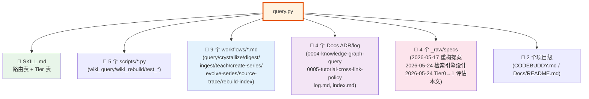
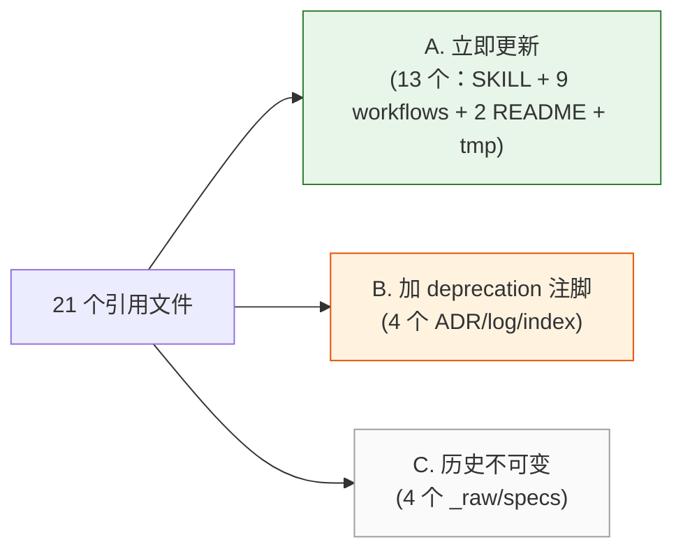
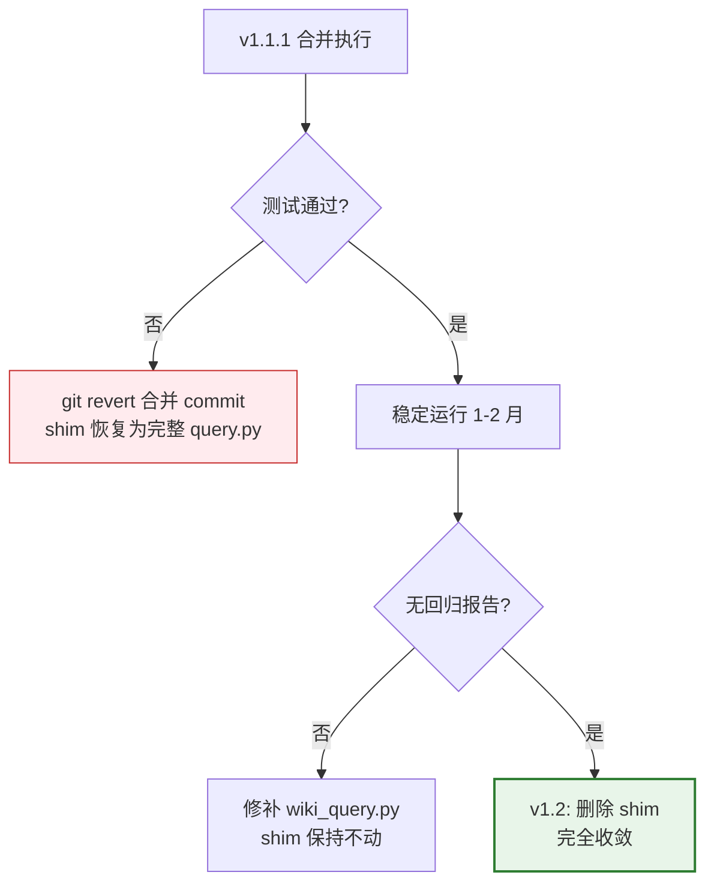
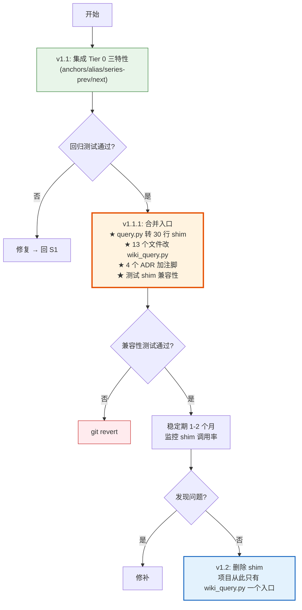

# `query.py` 合并到 `wiki_query.py` 统一入口评估

> **类型**：架构合并评估 / 落地方案
> **日期**：2026-05-24
> **状态**：评估完成，建议执行 v1.1（合并）+ v1.1.1（清理引用）
> **关联文档**：
> - [[_raw/specs/2026-05-24-retrieval-engine-design]]（三层引擎设计）
> - [[_raw/specs/2026-05-24-tier0-features-into-tier1-eval]]（Tier 0 特性集成评估，本评估的前置）
>
> **目标读者**：知识库维护者、AI Agent

---

## TL;DR

✅ **建议合并**。理由：

1. **没有代码层硬依赖**——只有 `test_query.py` 一处 `import query`，其余全是 CLI 调用（容易兼容）
2. **当前两入口造成 21 个文件文档不一致**——SKILL / 9 个 workflows / 4 个 ADR/specs / 测试，AI 路由表说"默认 wiki_query.py"，但 ADR-0004 / digest.md / create-series.md 仍写 `query.py`
3. **Tier 0 独有特性已在前一份评估中规划集成到 Tier 1 v1.1**（anchors / alias / series-prev/next）——一旦 v1.1 落地，`query.py` 的"独有价值"几乎清零
4. **合并不等于删除**——保留 `query.py` 作 deprecation shim（薄壳，转发到 `wiki_query.py`），向后兼容已有引用，过渡期 1-2 个版本后再删

**推荐执行路径**：


---

## 一、现状盘点

### 1.1 引用面积（21 个文件）



### 1.2 引用类型分布

| 引用类型 | 文件数 | 修改成本 | 备注 |
|---|---|---|---|
| **CLI 调用** `python3 .../query.py "..."` | ~15 | 替换字符串 | workflows + SKILL + commands/tmp.md |
| **代码 import** `import query` | **1** | 改 import 路径 | 仅 `test_query.py` |
| **ADR / 历史记录** 提到名字 | 4 | 加注解，不改 | 0004 / 0005 / log / specs（历史不可变） |
| **架构图 / 路由表** 描述 | 5 | 整段重写 | SKILL / query.md / Tier 表 |

### 1.3 当前命令行表面对比

| 维度 | `query.py` | `wiki_query.py` | 合并影响 |
|---|---|---|---|
| 关键词查询 | ✅ | ✅ | ✅ 无差异 |
| `--id <seed>` | ✅ | ✅ | ✅ 无差异 |
| `--series <slug>` | ✅ | ✅ | ✅ 无差异 |
| `--max-candidates N` | ✅ | ✅ | ✅ 无差异 |
| `--json` | ✅ | ✅ | ✅ 无差异 |
| `--no-body` | ✅ Tier 0 独有 | ❌ | ⚠️ 需保留：FTS5 等价是默认就不 grep body，但用户语义是"快速模式" |
| `--no-alias` | ✅ Tier 0 独有 | ❌（v1.1 计划加） | ✅ v1.1 后对齐 |
| `--brain` / `--category` | ❌（旧 brain 概念） | ✅ category | ⚠️ 不影响：query.py 没有 brain/category 软降权 |
| `--domain` | ❌ | ✅ | ✅ 不冲突 |
| `--engine` | ❌ | ✅ grep/sqlite/hybrid | ✅ 合并后用 `--engine grep` 触发 Tier 0 行为 |

**结论**：CLI 表面 90% 重合，差异点都可在合并版本中保留。

### 1.4 Tier 0 独有"价值"现状

回顾 [前一份评估](./2026-05-24-tier0-features-into-tier1-eval.md) 的结论：

| Tier 0 特性 | v1.1 后 Tier 1 是否覆盖 | 合并后是否还需要保留 query.py |
|---|---|---|
| anchors 命中 | ✅ v1.1 集成（FTS5 第 6 列） | ❌ 不需要 |
| alias 词表扩展 | ✅ v1.1 集成（查询时扩展） | ❌ 不需要 |
| series-prev/next 隐式邻居 | ✅ v1.1 集成（写入 links 表） | ❌ 不需要 |
| inbound 加分 | ⚠️ v1.2 集成（tie-breaker） | ⚠️ 短期保留 |
| body grep 行号 | 🟠 v1.3 用 FTS5 snippet 替代 | ⚠️ 短期保留 |
| BODY-ONLY MATCHES 区块 | ❌ 不集成（Tier 1 全局排序无此反差） | ⚠️ Tier 0 唯一独有 |

→ **v1.1 完成后**，Tier 0 唯一硬独有的是 `BODY-ONLY MATCHES`——但这个能力在 Tier 1 BM25 全局排序下意义不大（被 grep 命中但 BM25 没排上来的页几乎不存在）。

→ **结论**：v1.1 落地 + 合并 query.py 后，零真正的能力丢失。

---

## 二、合并方案设计

### 2.1 三种合并策略

#### 方案 A：硬合并（删除 query.py）

```
将 query.py 全部删除
所有引用直接改为 wiki_query.py
```

| 优点 | 缺点 |
|---|---|
| 彻底干净 | 21 个文件全要改；ADR 引用历史不便改；旧 git 历史命令失效 |
| 维护成本最低 | 风险高：万一 v1.1 某特性回归，无法降级 |

**评估**：❌ 不推荐。代价太大、回滚困难。

#### 方案 B：保留 query.py 作为薄壳（shim）

```python
# query.py 重写为 ~30 行 shim
import sys, subprocess
from pathlib import Path

# 一次性 deprecation 警告（写到 stderr，不污染 stdout/JSON）
if not os.environ.get("PROJECT_WIKI_QUERY_NO_DEPRECATION_WARN"):
    print("[deprecation] query.py is deprecated; forwarding to wiki_query.py", file=sys.stderr)

# 透传所有参数到 wiki_query.py（默认 --engine grep 保持 Tier 0 行为）
SCRIPTS = Path(__file__).resolve().parent
cmd = [sys.executable, str(SCRIPTS / "wiki_query.py")]
# 把 --no-alias / --no-body 等独有参数转为 wiki_query.py 等价参数
args = sys.argv[1:]
if "--no-body" in args:
    args.remove("--no-body")
    # wiki_query.py FTS5 默认就不 grep body，无需特殊处理
# 自动注入 --engine grep（让用户 100% 拿到 Tier 0 行为）
if not any(a.startswith("--engine") for a in args):
    args += ["--engine", "grep"]
cmd += args
sys.exit(subprocess.call(cmd))
```

| 优点 | 缺点 |
|---|---|
| 已有 21 处引用**全部继续工作** | 进程多一层 fork（实测 ~50 ms 开销，可接受） |
| 渐进迁移，文档更新可分批 | shim 维护期需要测试 |
| 1-2 月稳定后可直接 `delete shim` | 用户感知不到差异 |

**评估**：🟢 **推荐**。零迁移成本启动，**风险可控**。

#### 方案 C：保留 query.py 完整逻辑，只统一文档话术

```
代码不动；只改 SKILL / workflows / 文档：
"query.py" → "wiki_query.py"
"两个独立入口" → "wiki_query.py 统一入口（含 --engine grep 触发 Tier 0）"
```

| 优点 | 缺点 |
|---|---|
| 代码零风险 | 用户对"两个文件"持续困惑 |
| 文档清理快 | 维护两套代码长期成本 |

**评估**：🟡 中性。短期可行但治标不治本。

#### 推荐路径：A + B 组合

| 时间窗 | 动作 |
|---|---|
| **v1.1 期**（Tier 0 特性集成） | 维持现状不动，先把 anchors/alias/series 集成到 Tier 1 |
| **v1.1.1**（本方案合并） | 用方案 B（query.py → shim）；批量更新文档话术为 wiki_query.py 优先 |
| **v1.2**（1-2 月稳定后） | 评估 shim 调用率（grep `query.py` 引用数）；若文档/工具链都迁移完，删除 shim（方案 A 收尾） |

---

### 2.2 v1.1.1 合并执行清单

#### Step 1：把 query.py 转为 shim（保留独有逻辑作为内部实现）

实际上 `query.py` 的核心逻辑（alias / anchors / body grep）已被规划集成到 Tier 1 v1.1，因此 shim 化时：

- **alias 词表扩展逻辑** → 移到 `wiki_query.py` 内部模块或独立 `_alias.py`，由 v1.1 直接复用
- **body grep 行号** → 用 FTS5 snippet 替代（v1.3）
- **图边遍历** → wiki_query.py 已实现等价能力（多类型 1-hop）
- **query.py 自身仅保留 30 行 shim** 转发到 `wiki_query.py --engine grep`

#### Step 2：更新文档（21 个文件分类处理）



**A. 立即更新**：把所有 `python3 .../query.py "..."` 替换为 `python3 .../wiki_query.py "..."`，移除"备选路径 B：query.py"段落，简化为单一入口；保留"`--engine grep` 用于诊断"作为提示

**B. 加 deprecation 注脚**：ADR-0004 / ADR-0005 / log / index 这些是历史记录，不应改写过去陈述。在末尾追加一段：

```markdown
> **2026-05-24 更新**：query.py 已合并入 wiki_query.py 统一入口（v1.1.1）。
> 详见 [[_raw/specs/2026-05-24-merge-query-into-wiki-query-eval]]。
> 历史命令通过 shim 自动转发，无需手工修改既有脚本。
```

**C. _raw/specs 历史不可变**：作为评估文档保留，本评估文档是其中之一（自引用闭环）

#### Step 3：测试与验证

```python
# test_wiki_query.py 新增
def test_query_py_shim_compatibility():
    """query.py shim 应能正确转发常见命令到 wiki_query.py。"""
    import subprocess
    # 关键词查询
    r = subprocess.run(
        ["python3", str(SCRIPTS_DIR / "query.py"), "ability", "--max-candidates", "1", "--json"],
        capture_output=True, text=True
    )
    assert r.returncode == 0
    import json
    d = json.loads(r.stdout)
    assert "candidates" in d
    # 应包含 deprecation 警告（写到 stderr）
    assert "deprecat" in r.stderr.lower()

def test_query_py_shim_seed_mode():
    r = subprocess.run(
        ["python3", str(SCRIPTS_DIR / "query.py"),
         "--id", "30-tutorials/gas/14-GE网络复制", "--json"],
        capture_output=True, text=True
    )
    assert r.returncode == 0
    d = json.loads(r.stdout)
    assert d["mode"] == "seed"
```

---

### 2.3 文档话术统一规范（v1.1.1 后）

**所有 workflows / SKILL 应使用统一推荐话术**：

```markdown
## ★ 推荐路径：wiki_query.py 一击查询

`scripts/wiki_query.py` 是知识库的**唯一查询入口**，自动选 Tier 0/1/2：

\`\`\`bash
# 关键词查询（默认 Tier 1 FTS5 BM25 + 图谱 + 多类型边邻居 + alias 词表 + anchors 命中）
python3 .codebuddy/skills/project-wiki/scripts/wiki_query.py "GAS GameplayTag 网络复制"

# 种子模式（多类型 1-hop 邻居：related / prereq / wikilink / series-prev/next + 反向边）
python3 .codebuddy/skills/project-wiki/scripts/wiki_query.py --id 30-tutorials/gas/14-GE网络复制

# 教程系列模式（按 lesson_index 严格排序）
python3 .codebuddy/skills/project-wiki/scripts/wiki_query.py --series gas

# 强制 Tier 0（极少需要：诊断 / wiki.db 不可用时）
python3 .codebuddy/skills/project-wiki/scripts/wiki_query.py "ability" --engine grep
\`\`\`

> **历史用户**：原 `query.py` 已合并入 `wiki_query.py`（v1.1.1）。旧命令仍可工作（自动转发），
> 但建议新代码直接用 `wiki_query.py`。
```

---

## 三、风险与回滚

### 3.1 主要风险

| 风险 | 影响 | 缓解 |
|---|---|---|
| shim subprocess 多一层 fork ~50 ms | 查询延迟略增 | Tier 1 本身仅 46 ms，加 50 ms 仍 ≈ 100ms（与 Tier 0 当前持平），可接受 |
| 用户习惯 `query.py` 命令 | 心智迁移成本 | shim 完全兼容；deprecation 警告非阻断 |
| AI Agent 读到旧文档（ADR/log）的 query.py 引用 | 误用旧路径 | 新 SKILL.md 路由表第一句声明"统一入口"；shim 第一行 stderr 警告引导 |
| Tier 0 alias / anchors 未集成到 Tier 1 就先合并 | 检索质量回归 | **严格按顺序：先 v1.1（特性集成），再 v1.1.1（合并）** |

### 3.2 回滚机制



每一步都有明确的 git 回滚点（合并是单 commit；shim 化是单 commit；文档更新可分多个 commit）。

---

## 四、与 v1.1 的执行顺序

**强烈建议按以下顺序**：

| 步骤 | 内容 | 时间 |
|---|---|---|
| **Step 0**（已完成） | 评估方案 ✅ | 已交付 2 份 spec |
| **Step 1: v1.1** | Tier 0 P0 三特性集成到 Tier 1 | 估 1-2 工作日 |
| **Step 2: v1.1 验证** | 跑回归测试 + 标杆查询人工对比 | 估 0.5 天 |
| **Step 3: v1.1.1（本方案）** | query.py → shim；文档话术统一 | 估 0.5-1 天 |
| **Step 4**（1-2 月后） | 评估 shim 调用率，删除 shim | 估 0.5 天 |

**为什么这个顺序**？

- ❌ 先合并后集成 → 用户的 `query.py "GAS"` 通过 shim 转到 `wiki_query.py`，但后者还没 alias，**真实回归**
- ✅ 先集成后合并 → shim 转发后用户感知不到差异（甚至更好）

---

## 五、决策清单

请评审以下决策点：

### 5.1 合并策略

- [ ] **推荐：方案 B（shim）** — query.py 转 30 行薄壳，转发到 wiki_query.py
- [ ] 保守：方案 C（仅文档话术统一） — 代码不动
- [ ] 激进：方案 A（直接删 query.py） — 一次性切换 21 处引用

### 5.2 执行时机

- [ ] **推荐：v1.1 后再做 v1.1.1** — Tier 0 特性集成到 Tier 1 后，确保零能力丢失
- [ ] 立即合并，v1.1 与 v1.1.1 并行
- [ ] 推迟到 v1.2 一次性大版本

### 5.3 文档处理

- [ ] **A. 立即更新（13 个文件）**：SKILL / workflows / README / tmp.md
- [ ] **B. 加 deprecation 注脚（4 个文件）**：ADR-0004 / ADR-0005 / log / index
- [ ] **C. 历史不可变（4 个 _raw/specs）**：保留原状

### 5.4 shim 移除时间

- [ ] **推荐：v1.1.1 + 1-2 月**（观察期后删除）
- [ ] v1.1.1 + 立即删除（激进）
- [ ] 永久保留 shim（避免任何用户脚本破坏）

---

## 六、最终建议



**一句话总结**：先做 v1.1（特性集成）→ 再做 v1.1.1（query.py 转 shim + 文档话术统一）→ 1-2 月后删 shim。零能力丢失、可回滚、用户无感切换。

---

## 七、变更历史

| 日期 | 版本 | 变更 |
|---|---|---|
| 2026-05-24 | 1.0 | 初版评估，给出方案 B（shim）+ 三步执行计划 |
| 计划 | 1.1 | v1.1.1 实施完成后追加 shim 调用统计 |
