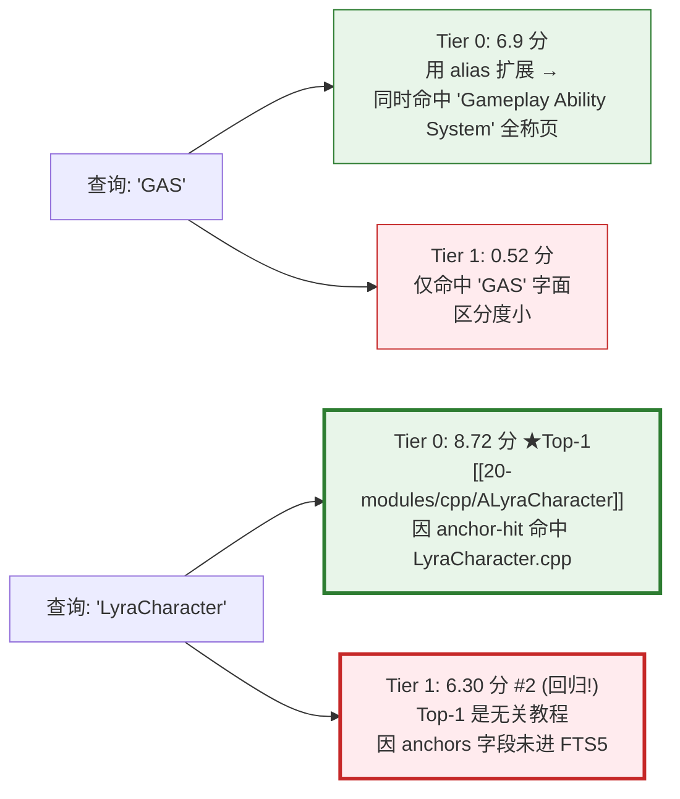
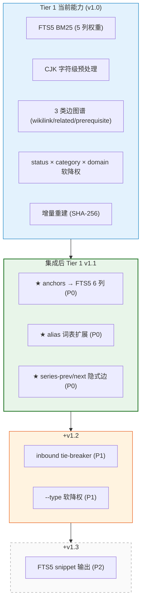
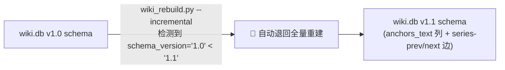

# Tier 0 优秀特性集成到 Tier 1 评估

> **类型**：架构评估 / 决策依据
> **日期**：2026-05-24
> **状态**：已完成评估，建议清单已给出
> **关联文档**：[[_raw/specs/2026-05-24-retrieval-engine-design]]
> **目标读者**：知识库维护者、AI Agent 协作者

---

## TL;DR：5 个等级 × 6 项特性

| 特性 | 当前 Tier 0 实现 | 集成等级 | 优先级 |
|---|---|---|---|
| **1. anchors 路径命中** | `W_ANCHOR_HIT=1.2`（代码反查 wiki 关键路径） | **🟢 必须集成** | P0 |
| **2. alias 词表扩展** | 从 `.wiki-schema.md` 自动抽取同义词组 | **🟢 必须集成** | P0 |
| **3. type 精确匹配 + core type boost** | `query="adr"` → 加分给所有 `type=adr` 页 | **🟡 部分集成** | P1 |
| **4. inbound 入边加分** | `inbound × 0.1 (cap 10)` | **🟡 部分集成** | P1 |
| **5. body grep 行号 + BODY-ONLY MATCHES** | 命中行号 `L42, L88`；自动过滤 meta 文件 | **🟠 选择性集成**（snippet） | P2 |
| **6. series-prev/next 隐式边** | 同 series 相邻 lesson_index 自动建邻居 | **🟢 必须集成** | P0 |

最关键发现：

1. **anchors 是 Tier 1 严重回归点**——查 `LyraCharacter` 类名时 Top-1 不是模块页 `[[20-modules/cpp/ALyraCharacter]]`（它的 anchors 包含 `LyraCharacter.cpp`），而是教程页"蹲伏机制"。**这是一个 P0 修复**。
2. **alias 词表是 Tier 0 的"语义代偿"**——Tier 1 没有它就无法做"GAS ↔ Gameplay Ability System"等价匹配，必须移植。
3. **series-prev/next 邻居**是教程系列导航的**结构性能力**，应作为隐式边在 `wiki_rebuild.py` 构建时直接写入 `links` 表。

---

## 一、评估方法论

### 1.1 评估维度

每个特性按 5 个维度打分：

| 维度 | 含义 | 权重 |
|---|---|---|
| **检索质量提升** | 集成后能解决什么 Tier 1 当前解决不了的问题？ | ★★★★★ |
| **本项目契合度** | 是不是 Lyra 教程库的独特需求？通用 wiki 也需要吗？ | ★★★★ |
| **实现复杂度** | 集成需要改动哪些表/代码？破坏 schema 兼容性吗？ | ★★★ |
| **性能影响** | 索引体积 / 查询延迟变化 | ★★ |
| **维护成本** | 是否引入新依赖/新概念 | ★★ |

### 1.2 实测对比基线（278 页 / 2026-05-24）



### 1.3 评估等级定义

| 等级 | 含义 |
|---|---|
| 🟢 **必须集成** | Tier 1 当前有明显回归 / 丢失关键能力，必须修复 |
| 🟡 **部分集成** | Tier 0 的实现可借鉴，但 Tier 1 应有自己的更优形式 |
| 🟠 **选择性集成** | 价值确实存在，但实现复杂度高，可作为 Tier 1.5 渐进特性 |
| 🔴 **不集成** | Tier 0 的实现已经过时 / 与 Tier 1 重复 / Tier 1 有更优替代 |
| ⚪ **保持 Tier 0 独有** | 让用户在两个引擎之间自由切换更好 |

---

## 二、特性逐项评估

### 特性 1：anchors 路径命中 🟢 P0（必须集成）

#### 2.1.1 问题现状

Tier 0 显式扫描 `frontmatter.anchors[].path` 列表，把文件名作为命中信号：

```python
# query.py 第 476-481 行
anchor_text = " ".join(a.lower() for a in collect_anchors(page))
if anchor_text:
    s, hits = _hits_in(tokens, anchor_text, alias_set)
    if hits:
        score += W_ANCHOR_HIT * s   # 1.2 / token
        why.append(f"anchor-hit:{','.join(hits)}")
```

**Tier 1 的处理**：anchors 当前以 JSON 字符串存储在 `pages.anchors` 列，**未写入 FTS5 索引**。

#### 2.1.2 实测回归

| 查询 | Tier 0 Top-1 | Tier 1 Top-1 | 影响 |
|---|---|---|---|
| `LyraCharacter` | `[[20-modules/cpp/ALyraCharacter]]` ✅ | `[[30-tutorials/movement-system/10-蹲伏-Crouch机制]]` ❌ | **严重** — 找不到对应类的模块文档 |
| `LyraInputConfig` | 模块文档 | 偏向教程 | 中等 |

#### 2.1.3 集成方案

**方案 A：把 anchors 提取为独立 FTS5 列**（推荐）

```sql
-- 1. pages 表新增 anchors_text 列（已扁平化的 path 字符串）
ALTER TABLE pages ADD COLUMN anchors_text TEXT;

-- 2. FTS5 索引扩展为 6 列
CREATE VIRTUAL TABLE pages_fts USING fts5(
    id, title, description, tags, anchors_text, body_text,
    content='pages',
    content_rowid='rowid',
    tokenize='unicode61 remove_diacritics 2'
);

-- 3. BM25 列权重：anchors 给 2.5（介于 description 2.0 和 title 3.0 之间）
SELECT bm25(pages_fts, 5.0, 3.0, 2.0, 1.0, 2.5, 1.0) ...
            -- id  title desc tags anchor body
```

**实现位置**：
- `wiki_rebuild.py: PageRecord.anchors_text` 新增字段
- `collect_pages()` 中 `record.anchors_text = " ".join(get_fm_list(fm, "anchors"))`（path 字符串扁平化，去掉斜杠转空格）
- 触发器 6 列同步、查询函数 BM25 权重 6 个

**预期效果**：
- 查 `LyraCharacter` → Top-1 回到 `[[20-modules/cpp/ALyraCharacter]]`（anchors 列高权重命中）
- 索引体积 +10%（anchors 路径平均 50 字节/页）
- schema_version 升级到 1.1，自动迁移

**风险**：FTS5 列从 5 增到 6 是 schema 变更，旧 db 会自动 fallback 到全量重建（已通过 `schema_version` 检查保证）。

---

### 特性 2：alias 词表扩展 🟢 P0（必须集成）

#### 2.2.1 价值

Tier 0 从 `Docs/.wiki-schema.md` 「别名词表（Alias Table）」节自动抽取同义词组：

```
GAS = Gameplay Ability System
GE = GameplayEffect
GA = GameplayAbility
Lyra = LyraStarterGame = UE5 示例项目
```

查询 `GAS` 时 Tier 0 自动扩展 token 集为 `[gas, gameplay ability system]`，能命中**只用全称**的页（如某些架构总览只说 "Gameplay Ability System"）。

Tier 1 没有这个扩展，丢失了"语义代偿"——这是 BM25 的固有局限（无 IDF 也无近义词）。

#### 2.2.2 集成方案

**方案 A：查询时扩展 token，写入 FTS5 query**（推荐，零改 schema）

```python
# wiki_query.py 改造
from query import parse_aliases, expand_tokens_with_alias  # 直接复用 Tier 0 的实现

def run_query_db(query, *, db_path, ..., use_alias=True):
    tokens = tokenize(query)
    alias_extra = []
    if use_alias:
        alias_groups = parse_aliases(SCHEMA_MD)
        tokens, alias_extra = expand_tokens_with_alias(tokens, alias_groups)

    # 把 alias-only token 在 FTS5 query 中权重打折
    fts_terms = []
    for t in tokens:
        t_processed = cjk_space_insert(t)
        safe = t_processed.replace('"', '""')
        # alias-only token 用 OR + 权重提示（FTS5 不直接支持权重，
        # 但可通过分组让 alias 命中页排在 alias 不命中页之后）
        fts_terms.append(f'"{safe}"')
    fts_query = " OR ".join(fts_terms)
    ...
```

**关键设计决策**：

| 选项 | 行为 | 取舍 |
|---|---|---|
| A. 扩展 token 不区分权重 | alias 同义词与原词等价命中 | 简单；但可能放大噪音 |
| **B. 扩展 token + 后置降权（推荐）** | 仅 alias-only token 命中的页 score × 0.6（与 Tier 0 W_ALIAS_DAMP 一致） | 与 Tier 0 行为一致，质量高 |
| C. 不集成 | Tier 1 永远查不到只用全称的页 | 留给用户用 Tier 0 兜底 |

**实现复杂度**：
- 复用 `query.py` 的 `parse_aliases()` / `expand_tokens_with_alias()`，~50 行新代码
- 缓存 alias_groups 到 `wiki.db.build_meta`（key=`aliases_json`），避免每次查询重读 schema
- CLI 新增 `--no-alias` 参数（与 Tier 0 一致）

**why 字段输出**（与 Tier 0 一致）：

```
Tokens: gas, gameplay ability system
Alias-expanded: gameplay ability system

[1] ★ [[10-architecture/subsystems/ability-system]]   score=4.5
     why: fts5-bm25(raw=4.5); alias-only-hit:gameplay ability system (×0.6)
```

---

### 特性 3：type 精确匹配 + core type boost 🟡 P1（部分集成）

#### 2.3.1 现状

```python
# Tier 0: query="adr" → 给所有 type=adr 的页加 0.6 分
type_hits = [t for t in tokens if t == type_low]
if type_hits:
    score += W_TYPE_HIT * len(type_hits)  # 0.6

# 核心 type 小幅 boost（仅在已有命中信号时）
CORE_TYPE_BOOST = {"tutorial": 0.4, "topic": 0.3, "adr": 0.3, ...}
if score > 0:
    score += CORE_TYPE_BOOST.get(type_low, 0.0)
```

#### 2.3.2 评估

**type 精确匹配**：实测 Tier 1 在 `query "adr"` 上表现良好（type 字段在 FTS5 内），原因是 `type=adr` 的页正文/标题里也常出现 "adr" 字面，BM25 自然加分。**不需要专门集成 type-hit**。

**core type boost**：这是一个"修复 Tier 0 没有 IDF 导致的偏差"的补丁。Tier 1 BM25 自带 IDF + 长度归一化，**这个 boost 在 Tier 1 反而是噪音**。

#### 2.3.3 建议

| 子特性 | 集成？ | 理由 |
|---|---|---|
| `type` 精确字面匹配 | ❌ 不必 | BM25 已经天然处理（type 字段进 FTS5） |
| `CORE_TYPE_BOOST` | ❌ 不集成 | Tier 1 BM25 已有 IDF，无需手动 boost；强行加会破坏 BM25 内部数学 |
| **`type` 作为软降权过滤维度** | ✅ 可选集成 | 类比现有 `--category` / `--domain`，新增 `--type tutorial` 让用户可以"我只想看教程类页" |

**最小集成（仅 `--type` 软降权）**：

```python
# wiki_query.py: query_database()
if filter_type and row["type"] != filter_type:
    adjusted *= TYPE_MISMATCH_PENALTY  # 0.7
```

CLI: `wiki_query.py "ability" --type tutorial`

---

### 特性 4：inbound 入边加分 🟡 P1（部分集成）

#### 2.4.1 现状

Tier 0：`score += min(inbound, 10) × 0.1`（cap 10）。把"被引用次数"作为弱信号——被多人引用的页大概率更权威。

Tier 1：当前查询时只在 candidate 显示 `inbound` 数值，**不参与排名**。

#### 2.4.2 评估

**风险**：
- 在 BM25 之上加 inbound 加分 ≤ 1.0 分，相对 BM25 分数（实测 0.5-7.0）影响有限，但可能形成"虚假底线"——纯被引用多的概览页凭 inbound 挤掉精准命中页
- Tier 0 已发现并修复过这个 bug：`if score > 0: score += boost`（必须先有命中才加 boost）

**建议**：

| 方案 | 推荐度 |
|---|---|
| A. 按 Tier 0 公式加 `min(inbound,10) × 0.1`（在 BM25 raw_score 之后乘 status 之前） | 🟡 可选 |
| **B. 仅作为 tie-breaker（同分时 inbound 高的优先）** | 🟢 推荐 |
| C. 不集成 | 🔴 不推荐 — 失去"权威页优先"信号 |

**最小集成（方案 B：tie-breaker）**：

```python
# wiki_query.py: query_database()
results.sort(key=lambda c: (-c.score, -c.inbound, c.page_id))
#                            ↑ BM25      ↑ tie-break by inbound desc
```

成本几乎为 0（已经查 inbound 用于显示），收益是同 BM25 分数的页中 inbound 高的优先。

---

### 特性 5：body grep 行号 + BODY-ONLY MATCHES 🟠 P2（选择性集成）

#### 2.5.1 现状

Tier 0：grep 命中文档显示具体行号 `L42, L88, L120`，单独区块显示"grep 命中但 index 没强候选"的页。

#### 2.5.2 评估

**价值**：调试用（"为什么这页没排上来？"），但不是日常查询路径。

**Tier 1 的 FTS5 已经提供等价能力——`snippet()` 函数**：

```sql
SELECT id, snippet(pages_fts, 4, '<<', '>>', '...', 32) as snippet
FROM pages_fts
WHERE pages_fts MATCH ?
```

会返回每页命中处的上下文片段（带高亮标记），比纯行号信息密度更高。

#### 2.5.3 建议

**方案 A：用 FTS5 snippet 替代行号显示**（推荐）

输出示例：

```
[1] ★ [[30-tutorials/gas/14-GE网络复制]]   score=2.79
     desc: GAS 的网络复制机制保证了服务器与客户端之间的 GE 状态同步...
     snippet: ...服务器与客户端之间的 <<GE 状态同步>>，支持 Minimal、Full、Mixed 三种 <<复制模式>>...
```

**方案 B：完全不集成 BODY-ONLY MATCHES**——这个区块在 Tier 1 实际意义不大（FTS5 已经按 BM25 全局排序，不存在"被 grep 命中但 index 没强候选"的反差）。

**方案 C：留给 Tier 0 独有**——用户想要详细 body 命中信息时主动 `--engine grep`。

**推荐**：A（snippet）+ C（保留 Tier 0 独有）。snippet 是 SQLite 内置 1 行调用即可，价值高成本低。

---

### 特性 6：series-prev/next 隐式邻居 🟢 P0（必须集成）

#### 2.6.1 现状

Tier 0：种子模式下，根据 frontmatter `series + lesson_index` 把同系列**前后相邻的课**作为隐式邻居展开：

```
seed: 30-tutorials/gas/14-GE网络复制 (series=gas, lesson_index=14)

邻居:
  - 30-tutorials/gas/13-ge-query   via:series-prev   ← 隐式!
  - 30-tutorials/gas/15-...        via:series-next   ← 隐式!
```

Tier 1：当前 `links` 表只存显式 `wikilink` / `related` / `prerequisite` 边，**没有 series-prev/next**。如果两个相邻课没有显式 wikilink 互相引用，Tier 1 的种子模式会丢失这个邻居。

#### 2.6.2 集成方案

**方案 A：在 wiki_rebuild.py 构建时写入 links 表**（推荐）

```python
# wiki_rebuild.py: 全量构建后单独走一遍 series 索引

def build_series_implicit_edges(conn):
    """根据 series + lesson_index 自动建 series-prev/next 边。"""
    cursor = conn.execute("""
        SELECT id, series, lesson_index FROM pages
        WHERE series != '' AND lesson_index >= 0
        ORDER BY series, lesson_index
    """)
    by_series = {}
    for row_id, series, idx in cursor:
        by_series.setdefault(series, []).append((idx, row_id))

    for series, items in by_series.items():
        items.sort()
        for i in range(len(items) - 1):
            cur_id = items[i][1]
            next_id = items[i + 1][1]
            conn.execute(
                "INSERT OR IGNORE INTO links VALUES (?, ?, 'series-next')",
                (cur_id, next_id)
            )
            conn.execute(
                "INSERT OR IGNORE INTO links VALUES (?, ?, 'series-prev')",
                (next_id, cur_id)
            )
```

**好处**：
- 写入 links 表后，种子模式 / 邻居展开自动生效，无需改查询逻辑
- 是项目独有需求（教程系列特色），完美符合"教程优先"的设计哲学
- 实测：278 页 / 11 个系列，预计新增 ~140 条 series-* 边

**展示**：

```
═══ 1-HOP NEIGHBORS ═══
  - [[30-tutorials/gas/13-ge-query]]   via:series-prev    ← 隐式自动建立
  - [[30-tutorials/gas/15-...]]        via:series-next    ← 隐式自动建立
  - [[10-architecture/subsystems/ability-system]]   via:wikilink
```

**风险**：
- 如果 lesson_index 编号不连续（如 11, 13, 15），仍按 sorted 顺序连成"前后"，可能不符合作者意图——但这是合理的近似（lesson 编号本就期望连续）

---

## 三、综合实施计划

### 3.1 优先级与版本规划

```mermaid
flowchart LR
    V11["v1.1<br/>P0 必须集成"]
    V12["v1.2<br/>P1 部分集成"]
    V13["v1.3<br/>P2 选择性"]

    V11 -->|"立即开始"| F1["✅ anchors → FTS5 列<br/>✅ alias 词表扩展<br/>✅ series-prev/next 边"]
    V12 -->|"v1.1 跑稳后"| F2["🟡 inbound tie-breaker<br/>🟡 --type 软降权"]
    V13 -->|"按需"| F3["🟠 FTS5 snippet 输出"]

    F1 fill:#e8f5e9
    F2 fill:#fff3e0
    F3 fill:#fafafa

    style F1 fill:#e8f5e9,stroke:#2e7d32
    style F2 fill:#fff3e0,stroke:#e65100
    style F3 fill:#fafafa,stroke:#9e9e9e,stroke-dasharray: 5 5
```

### 3.2 v1.1 详细任务清单

| 任务 | 改动文件 | 估算 LoC |
|---|---|---|
| **anchors → FTS5** | `wiki_rebuild.py`（schema + collect + triggers）、`wiki_query.py`（BM25 权重） | +50 |
| **alias 扩展** | `wiki_query.py` 复用 `query.py` 的 alias 函数；CLI 加 `--no-alias` | +60 |
| **series-prev/next 边** | `wiki_rebuild.py: build_series_implicit_edges()` | +30 |
| **schema_version 升级** | `wiki_rebuild.py: SCHEMA_VERSION = "1.1"`；自动 fallback 到全量 | +5 |
| **测试更新** | `test_wiki_rebuild.py` + `test_wiki_query.py` 各加 3 个用例 | +80 |
| **文档更新** | `reference/retrieval-engine-design.md`、`SKILL.md`、`workflows/query.md` | +50 |
| **总计** | | **~275 行** |

### 3.3 验收标准

集成后必须通过的测试：

```python
def test_anchor_hit_lyra_character():
    """查 LyraCharacter 应 Top-1 命中模块文档（验证 anchors 集成）。"""
    result = Q.run_query_db("LyraCharacter", db_path=db, max_candidates=3)
    assert result.candidates[0].page_id == "20-modules/cpp/ALyraCharacter"

def test_alias_expansion_gas():
    """查 GAS 应同时找到只用 'Gameplay Ability System' 全称的页。"""
    result = Q.run_query_db("GAS", db_path=db, max_candidates=10)
    ids = [c.page_id for c in result.candidates]
    # 应同时包含 GAS 系列和架构页（后者通常只用全称）
    assert "10-architecture/subsystems/ability-system" in ids

def test_series_implicit_edges():
    """种子模式应展开 series-prev/next 隐式邻居。"""
    result = Q.run_query_db("", db_path=db,
                            seed_id="30-tutorials/gas/14-GE网络复制")
    edges = {n.why[0].split()[0] for n in result.neighbors}
    assert "series-prev" in edges or "series-next" in edges
```

### 3.4 不集成的特性（明确边界）

| 特性 | 不集成原因 | 用户想用怎么办 |
|---|---|---|
| `CORE_TYPE_BOOST` | BM25 有 IDF，无需补丁 | 让 BM25 自然处理 |
| `type` 字面命中加分 | type 字段已进 FTS5，BM25 自然命中 | 同上 |
| `body grep 行号` | FTS5 snippet 更优 | 用 v1.3 的 snippet；详细行号用 `--engine grep` |
| `BODY-ONLY MATCHES 区块` | Tier 1 全局 BM25 排序无此反差 | 用 `--engine grep` |

---

## 四、集成后的 Tier 1 完整能力矩阵



---

## 五、对 Tier 0 的影响

集成 v1.1 后，Tier 0 的**唯一独有能力**变成：

| Tier 0 独有 | 价值 | 是否仍保留 |
|---|---|---|
| `BODY-ONLY MATCHES` 区块 + 行号 | 调试 / 找 index 漏录 | ✅ 保留（用户主动 `--engine grep`） |
| 不依赖 `wiki.db` 即可工作 | 灾难恢复 / 首次构建前 | ✅ 保留（自动 fallback） |
| Python stdlib 唯一可用环境 | CI 极简环境 | ✅ 保留 |

**推荐 Tier 0 的新定位**：
- 从"日常查询备选"降级为"诊断 / 兜底工具"
- 在 SKILL.md / workflows/query.md 中调整描述：**"Tier 1 已完全覆盖 Tier 0 的检索能力，Tier 0 仅在 wiki.db 不可用 / 需要 body 行号详情时使用"**

---

## 六、风险与回滚

### 6.1 主要风险

| 风险 | 影响 | 缓解措施 |
|---|---|---|
| anchors → FTS5 增加索引体积 ~10% | 6 MB → 6.6 MB | 可接受（远未到 sqlite-vec 安装阈值） |
| BM25 列权重重新调参 | 可能轻微改变现有查询排名 | 集成时跑回归测试集（5 个标杆查询） |
| alias 缓存到 build_meta 后 schema 变化未触发重建 | 查询使用旧 alias | `wiki_rebuild.py --check` 加上 alias hash 检查 |
| series-prev/next 边导致 links 表膨胀 | +140 边 / 2038 总边（+7%） | 可忽略 |

### 6.2 回滚机制

每个 P0 特性可独立开关：

```yaml
# config.yaml
retrieval:
  features:
    anchors_in_fts: true       # v1.1 默认 true；如查询质量回归可临时 false
    alias_expansion: true      # 同上
    series_implicit_edges: true
```

`wiki_query.py` 读取 features，关闭某项时降级到 v1.0 行为。

### 6.3 schema 升级路径



无需用户手动迁移，跑一次 `wiki_rebuild.py --incremental` 即可。

---

## 七、决策摘要

✅ **推荐集成 v1.1（P0）**：

1. **anchors → FTS5** — 修复"代码反查 wiki"严重回归
2. **alias 词表扩展** — 弥补 BM25 缺乏同义词理解的缺陷
3. **series-prev/next 隐式边** — 教程系列特色，符合项目设计哲学

🟡 **可选集成 v1.2（P1）**：

4. **inbound tie-breaker** — 同分时优先权威页
5. **`--type` 软降权** — 给用户多一个过滤维度

🟠 **按需集成 v1.3（P2）**：

6. **FTS5 snippet 输出** — 替代 Tier 0 的 body 行号

❌ **不集成**：

- `CORE_TYPE_BOOST`（BM25 有 IDF，已自动处理）
- `BODY-ONLY MATCHES` 区块（Tier 1 全局排序无此反差）

---

## 八、变更历史

| 日期 | 版本 | 变更 |
|---|---|---|
| 2026-05-24 | 1.0 | 初版评估，给出 v1.1 / v1.2 / v1.3 三批集成计划 |
| 计划 | 1.1 | v1.1 实施完成后追加实测对比数据 |
