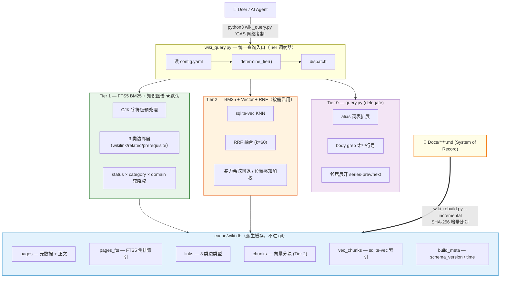
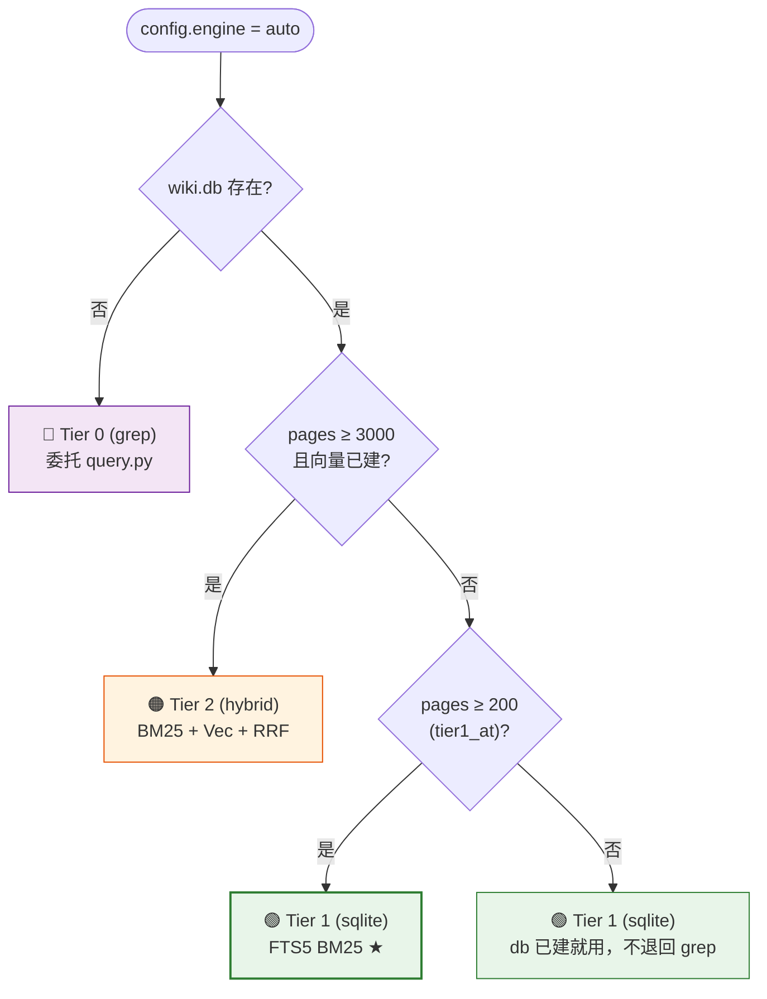
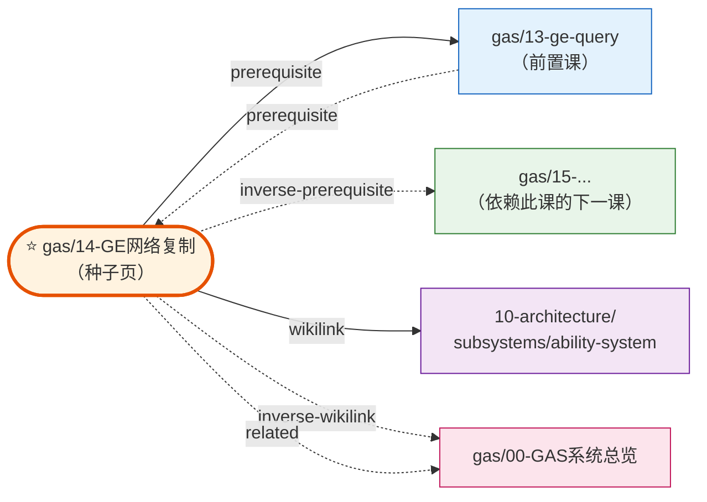
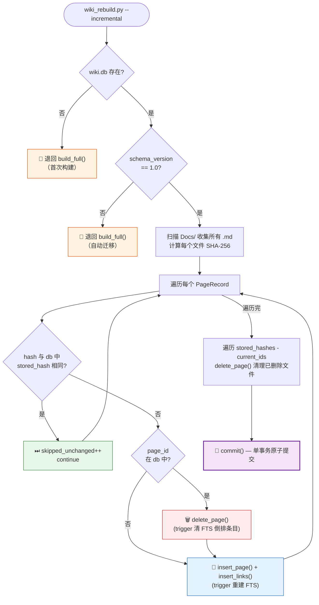
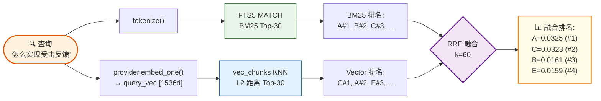

# LyraStarterGame 知识库检索引擎设计方案

> **类型**：架构设计 & 引擎实现
> **日期**：2026-05-24
> **状态**：已实现（Tier 0 + Tier 1）/ 计划中（Tier 2）
> **目标读者**：项目维护者、AI Agent 协作者
> **配套实现**：`.codebuddy/skills/project-wiki/scripts/{wiki_rebuild,wiki_query,query}.py`
> **配套配置**：`.codebuddy/skills/project-wiki/config.yaml`

---

## 摘要

本项目知识库已达 **278 篇 / 2038 条图边 / 5 个核心教程系列共 73 课**，规模超出"裸 grep + 人脑导航"的舒适区。本方案设计**三层渐进式检索引擎**，让 AI Agent 在毫秒内定位精确候选页，并能沿 `wikilink / related / prerequisite` 三类图边自动展开关联知识。

设计原则：

1. **Markdown 是真相源**（System of Record），SQLite 索引是可重建的派生缓存
2. **零依赖起步，按需升级**（Tier 0 stdlib → Tier 1 stdlib + sqlite3 → Tier 2 + sqlite-vec + 嵌入 API）
3. **配置一行切换**（`config.yaml: retrieval.engine = auto | grep | sqlite | hybrid`）
4. **优雅降级**（任何一层不可用都自动 fallback 到下一层，永不崩溃）
5. **教程系列优先**（区别于通用 wiki 工具，深度支持 `series + lesson_index + prerequisites` 三元组）

---

## 一、问题域：本项目的检索难点

### 1.1 项目实情速览（2026-05-24 实测）

| 维度 | 数值 |
|---|---|
| 索引页面数 | **278** |
| 知识图边数 | **2038**（wikilink 1445 + related 313 + prerequisite 280） |
| 平均文档字数 | 1318 |
| 总字数 | 36.6 万 |
| 教程系列数 | 11 个 |
| Top 5 教程系列 | gas (27)、ue-framework (16)、network-sync (15)、animation (11)、camera-system (11) |
| `30-tutorials/` 占比 | **83.5%**（232/278） |
| 状态分布 | current 95.3%、draft 2.5%、accepted/proposed 1.8% |
| wiki.db 体积 | 6.05 MB |

### 1.2 与通用 wiki 检索的差异

本项目不是普通文档库，而是**以 Lyra 为锚的 UE 技术学习知识库**。这带来三个独特检索需求：

#### 需求 A：教程系列必须按学习顺序聚合

教程不是独立文档，而是**有依赖关系的课程序列**：

```yaml
# Docs/30-tutorials/gas/03-GE简介与配置.md
---
series: gas
lesson_index: 3
prerequisites:
  - "[[30-tutorials/gas/02-GA执行流程详解]]"
  - "[[30-tutorials/gas/01-GA简介与配置]]"
---
```

通用全文检索（grep / FTS5）只看词频，会把"GA 简介"和"GE 简介"混排，**丢失学习路径语义**。
→ 必须显式建模 `series + lesson_index` 字段，并把 `prerequisites` 作为一类**独立的图边**。

#### 需求 B：中英文混合查询

UE 项目天然中英混合：类名是英文（`UGameplayAbility`、`ALyraCharacter`），讲解是中文。典型查询如：

```
"GameplayAbility 网络复制"   → 命中 [[30-tutorials/gas/14-GE网络复制]]
"封装层"                    → 命中 [[10-architecture/subsystems/ability-system]]
"受击反馈"                  → 命中 [[30-tutorials/animation/03-...]]
```

SQLite FTS5 默认 `unicode61` 分词器对中文无能为力（把"封装层"当成 1 个 token，无法部分匹配）。
→ 必须做 **CJK 字符级预处理**：在每个汉字前后插入空格，让汉字成为独立 token，配合 phrase 查询保证相邻性。

#### 需求 C：从代码反查 wiki

UE 开发常见场景："这个 `ULyraInputConfig` 类哪些 wiki 解释了？"

```yaml
# Docs/20-modules/cpp/ULyraInputConfig.md
---
anchors:
  - path: Source/LyraGame/Input/LyraInputConfig.h
  - path: Source/LyraGame/Input/LyraInputConfig.cpp
---
```

→ 检索时需要把 `anchors[].path` 作为独立信号（已在 Tier 0 `query.py` 实现：`anchor-hit` 权重 1.2）。

### 1.3 现有方案的局限（重构动机）

`scripts/query.py`（v1.0）已经是一个相当完整的 Tier 0 实现（启发式评分 + 图遍历 + alias 词表 + body grep 兜底），但有以下硬伤：

| 局限 | 后果 | 实测 |
|---|---|---|
| 每次查询要扫描全部 278 个 .md 文件 | 单次查询 100-130 ms | `time query.py "ability"` ≈ 124 ms |
| 无 IDF（逆文档频率） | "system" 这种高频词与"GameplayCue"这种稀有词权重相同，前者噪音大 | 查"system"返回 30+ 候选都几乎同分 |
| 无文档长度归一化 | 5800 字的 overview 永远压制 78 字的精准 gotcha | overview 类页面长期占据 Top |
| 中文短语命中靠 `in` 子串匹配 | "网络复制"能命中"网络复制 GE"，但无法精准排序 | 无 |
| body grep 是后置串行步骤 | 越大库越慢 | 366K 字 grep 一次 ≈ 80 ms |

→ Tier 1（FTS5 BM25）是工程上的自然下一步：**毫秒级、有 IDF、有长度归一化、原生 phrase 查询**，且不破坏 Tier 0 的图谱+alias 能力。

---

## 二、三层架构总览



### 2.1 Tier 能力矩阵

| | **Tier 0**（当前默认 fallback） | **Tier 1**（推荐日常） | **Tier 2**（语义增强） |
|---|---|---|---|
| **engine 配置值** | `grep` | `sqlite` | `hybrid` |
| **入口脚本** | `query.py` | `wiki_query.py` | `wiki_query.py --engine hybrid` |
| **检索策略** | 文件扫描 + 启发式评分 | FTS5 BM25 列权重 | BM25 + Vec + RRF |
| **知识图谱** | ✅ wikilink + related + prerequisite + series-prev/next | ✅ links 表（3 类边类型） | ✅ links 表 |
| **中文支持** | `str.in` 子串 + alias 词表 | unicode61 + **CJK 字符级预处理** | + 嵌入模型语义匹配 |
| **同义词** | ✅ alias 词表（schema 「别名词表」节自动抽取） | ❌（FTS5 不做） | ✅（嵌入天然） |
| **打分** | 5 信号手工权重 + 状态/category/domain 修正 | BM25（带 IDF + 长度归一化） + 后置软降权 | RRF 融合两路排名 |
| **依赖** | Python stdlib | Python stdlib（sqlite3 内置） | + `pip install sqlite-vec` + 嵌入 API |
| **构建** | 无需构建 | `wiki_rebuild.py --incremental` | + `--with-vectors` |
| **查询延迟（278 页实测）** | ~124 ms | **~46 ms** | ~250 ms（含 API 网络） |
| **适用规模** | 任何（启发式） | 100 - 3000 页 | 3000+ 页或语义查询 |

### 2.2 实测性能（2026-05-24，278 页）

| 查询 | Tier 1 延迟 | Top-1 命中 | BM25 score |
|---|---|---|---|
| `GameplayAbility` | 48 ms | `30-tutorials/gas/01-GA简介与配置` | 5.48 |
| `网络复制` | 46 ms | `30-tutorials/gas/14-GE网络复制` | 2.79 |
| `modular gameplay` | 45 ms | `30-tutorials/modular-gameplay/00-...系列` | 4.66 |
| `Experience` | 45 ms | `40-runbooks/how-to-create-new-experience` | 2.25 |
| `受击反馈` | 46 ms | `30-tutorials/animation/03-...` | 5.06 |

> Tier 1 比 Tier 0 快 **2-3 倍**，且排名质量肉眼可见提升（短文档不再被长 overview 压制）。

### 2.3 自动 Tier 决策

```yaml
# config.yaml
retrieval:
  engine: auto
  auto_thresholds:
    tier1_at: 200       # 页数 > 200 → 启用 Tier 1（项目当前 278，已默认 Tier 1）
    tier2_at: 3000      # 页数 > 3000 才考虑 Tier 2
```



> 📌 本项目当前 278 页 ≥ tier1_at(200)，且 wiki.db 已建 → **默认走 Tier 1**。

**手动覆盖**：`wiki_query.py --engine grep | sqlite | hybrid`，CLI 参数优先级高于 config。

---

## 三、Tier 0：query.py（保留，作为 fallback）

> **决策**：保留现有 `query.py` 不动，作为 `--engine grep` 的 fallback。Tier 1 不替换它，因为 Tier 0 有以下**Tier 1 没有的特色能力**，不应丢弃。

### 3.1 Tier 0 独有能力

| 能力 | 说明 | 何时用 |
|---|---|---|
| **alias 词表扩展** | 自动从 `.wiki-schema.md` 「别名词表」节抽取同义词组（如 `GAS = Gameplay Ability System`），查询时同步扩展 token 集 | 用户用缩写查（"查 GAS"应同时命中 `Gameplay Ability` 全称页） |
| **anchors 命中权重 1.2** | `anchors[].path` 中的文件名匹配 token → 加分（关键的从代码反查 wiki 路径） | "查哪些 wiki 提到 LyraCharacter.cpp" |
| **body grep 行号详情** | 命中文档显示具体行号（`L42, L88, L120`） | 想知道 wiki 哪一段提到关键词 |
| **BODY-ONLY MATCHES 区块** | 把"grep 命中但 index 没强候选"的页单独列出（自动跳过 index/log/overview 等 meta 文件） | 检测 index.md 漏录 |
| **series-prev/next 隐式边** | 同 series 相邻 lesson_index 自动建邻居关系 | 教程系列内导航 |

### 3.2 评分公式（保留 query.py v1.0 的设计）

```
raw_score = id_hit (3.0) × 命中数
          + desc_hit (1.5) × 命中数
          + tag_hit (1.0) × 命中数
          + type_hit (0.6) × 命中数
          + anchor_hit (1.2) × 命中数
          + body_hit (0.5) × min(命中次数, 5)
          + alias-only token 命中 × 0.6（damp）
          + 核心 type boost (tutorial 0.4 / topic 0.3 / adr 0.3)

+ inbound × 0.1 (cap 10)

× status 修正系数 (current 1.0 / draft 0.7 / stale 0.5 / deprecated 0.2)
```

详细规范见 `query.py` 模块 docstring 和工作流 `workflows/query.md`。

---

## 四、Tier 1：SQLite FTS5 BM25 + 知识图谱 ★

> 本项目当前**默认引擎**。配置 `engine: auto` + 实际页数 278 ≥ tier1_at(200) → 自动启用。

### 4.1 数据 Schema

```sql
CREATE TABLE pages (
    id TEXT PRIMARY KEY,            -- "30-tutorials/gas/14-GE网络复制"
    title TEXT,                     -- 正文 # 标题（CJK 预处理后）
    type TEXT NOT NULL,             -- tutorial / module / adr / runbook / ...
    status TEXT NOT NULL,           -- current / draft / stale / deprecated
    category TEXT NOT NULL,         -- "30-tutorials"（顶层目录，本项目用数字前缀分类替代源方案的 brain）
    domain TEXT NOT NULL,           -- "gas"（page_id 第二段，教程系列名）
    description TEXT,               -- frontmatter description / compiled_summary（CJK 预处理后）
    tags TEXT,                      -- JSON array
    anchors TEXT,                   -- JSON array of {path: ...}
    related TEXT,                   -- JSON array of wikilink id
    prerequisites TEXT,             -- JSON array（教程前置依赖）★
    series TEXT,                    -- "gas" / "network-sync" / ...
    lesson_index INTEGER DEFAULT -1,-- 教程序号（-1 = 非教程）
    last_synced TEXT,
    content_hash TEXT,              -- SHA-256，用于增量比对
    body_text TEXT,                 -- 正文（CJK 预处理后；frontmatter 已剥离）
    word_count INTEGER
);

-- FTS5 倒排索引（External Content 模式：不重复存正文，靠 trigger 同步）
CREATE VIRTUAL TABLE pages_fts USING fts5(
    id, title, description, tags, body_text,
    content='pages',
    content_rowid='rowid',
    tokenize='unicode61 remove_diacritics 2'
);

-- 知识图谱边（区分 3 类边类型）★
CREATE TABLE links (
    from_page TEXT NOT NULL,
    to_page   TEXT NOT NULL,
    edge_type TEXT NOT NULL DEFAULT 'wikilink',  -- wikilink | related | prerequisite
    PRIMARY KEY (from_page, to_page, edge_type)
);

CREATE TABLE build_meta (key TEXT PRIMARY KEY, value TEXT);
-- 关键 key: schema_version='1.0', build_time, page_count, link_count
```

**与源 ProjectWiki v2.0 方案的关键差异**（已沉淀进实现）：

1. **`brain` → `category`**：本项目顶层目录是 `00-meta/30-tutorials/...` 数字前缀，不按 programming/design/art 分 brain
2. **新增 `series` / `lesson_index`**：直接把教程元数据建模为一等公民列，支持 `--series gas` 系列模式按序输出
3. **新增 `prerequisites`** + 单独写入 `links` 表（`edge_type='prerequisite'`）：项目实测 280 条 prerequisite 边，是教程导航的关键
4. **`description`（fallback `compiled_summary`）/ `last_synced`（fallback `last_verified`）**：兼容本项目 frontmatter 实际字段
5. **`schema_version` 元数据**：增量重建检测到版本不匹配时**自动**退回全量

### 4.2 BM25 列权重

```sql
SELECT bm25(pages_fts, 5.0, 3.0, 2.0, 1.0, 1.0) as score
FROM pages_fts ...
ORDER BY score LIMIT ?
```

| 列序 | 列名 | BM25 权重 | 设计意图 |
|---|---|---|---|
| 1 | `id` | **5.0** | 路径命中 = 结构性精确匹配（如 page_id 含 "ability-system" 即强相关） |
| 2 | `title` | **3.0** | 标题命中 = 高相关 |
| 3 | `description` | **2.0** | 摘要命中 = 主题相关 |
| 4 | `tags` | **1.0** | 标签命中 = 分类相关 |
| 5 | `body_text` | **1.0** | 正文命中 = 基础相关（BM25 自带 TF 饱和 + 长度归一化，无需手动 cap） |

> ⚠ **权重顺序必须与 FTS5 建表列顺序一致**。`bm25()` 返回**负值**（越小越相关），代码中 `abs()` 后展示。

### 4.3 CJK 字符级预处理（关键的中文支持）

`unicode61` 分词器把连续非分隔字符当一个 token：

```
原文: "通过AbilitySet数据资产批量授予能力"
unicode61 分词: ["通过abilityset数据资产批量授予能力"]   ← 整段不可拆！

→ 查"数据资产"无法命中
```

**解法**：在 `wiki_rebuild.py` 写入 FTS5 前 / `wiki_query.py` 构造 FTS5 query 时，对所有文本走 `cjk_space_insert`：

```python
_CJK_RE = re.compile(r"([一-鿿㐀-䶿豈-﫿])")

def cjk_space_insert(text: str) -> str:
    """每个汉字前后插空格，让汉字成为独立 FTS5 token。"""
    result = _CJK_RE.sub(r" \1 ", text)
    return re.sub(r" +", " ", result).strip()
```

预处理后：

```
索引侧: "通 过 AbilitySet 数 据 资 产 批 量 授 予 能 力"
查询侧: "数据资产" → cjk_space_insert → "数 据 资 产"
        FTS5 MATCH '"数 据 资 产"' (短语查询，要求 4 个 token 相邻)
        → ✅ 精确命中
```

实测效果：`"网络复制"` 查询命中 `30-tutorials/gas/14-GE网络复制`，BM25 score=2.79。
展示时再用 `cjk_space_strip` 还原中文不带空格的自然形态。

### 4.4 三类图边的设计（区别于通用 wiki 引擎）

通用 wiki 工具的 links 表只记录 `wikilink`。本项目把 `frontmatter.related` 和 `frontmatter.prerequisites` **作为独立边类型**写入：

```python
# wiki_rebuild.py 写入逻辑
for rid in record.related:                      # frontmatter.related
    INSERT INTO links VALUES (id, rid, 'related')
for pid in record.prerequisites:                # frontmatter.prerequisites（教程特有）
    INSERT INTO links VALUES (id, pid, 'prerequisite')
for tid in record.body_links:                   # 正文 [[...]]
    INSERT INTO links VALUES (id, tid, 'wikilink')
```

实测分布（278 页）：

| 边类型 | 数量 | 占比 | 用途 |
|---|---|---|---|
| `wikilink` | 1445 | 70.9% | 通用引用（正文内 `[[...]]`） |
| `related` | 313 | 15.4% | 同主题强相关页（双向语义） |
| `prerequisite` | 280 | 13.7% | **教程前置依赖（学习顺序）** |

**邻居展开时按边类型语义化标注**：

```python
# wiki_query.py 邻居展开
SELECT to_page, edge_type FROM links WHERE from_page = ?
UNION
SELECT from_page, 'inverse-' || edge_type FROM links WHERE to_page = ?
```

**示意（以 `[[30-tutorials/gas/14-GE网络复制]]` 为种子）**：



> 实线 = 出边（种子 → 邻居）；虚线 = 入边（反向，邻居 → 种子）。
> 三种边语义化区分让 AI Agent 一眼识别**学习顺序（prerequisite）vs 通用引用（wikilink）vs 强相关（related）**。

输出示例：

```
═══ 1-HOP NEIGHBORS (11) ═══
  - [[30-tutorials/gas/00-GAS系统总览]]   via:inverse-wikilink
  - [[30-tutorials/input-system/05-Lyra实践InputTag与GAS联动详解]]   via:inverse-prerequisite
                                                                 ↑↑↑↑↑↑↑↑↑↑↑↑↑↑↑↑↑
                              说明"InputTag 与 GAS 联动"这一课依赖当前页（反向 prereq）
```

→ AI Agent 看到 `via:inverse-prerequisite` 立刻知道："哪些课程把当前页列为前置"，这是教学场景独有的关键信号。

### 4.5 状态/类别软降权（关键设计决策）

不在 SQL `WHERE` 硬过滤 `category` / `domain` / `status`，而是**多取 3× 候选后做后置乘法修正**：

```python
fetch_limit = max_candidates * 3
sql = """SELECT ... FROM pages_fts JOIN pages
         WHERE pages_fts MATCH ?
         ORDER BY score LIMIT ?"""

for row in rows:
    adjusted = abs(bm25_score)
    adjusted *= STATUS_MULTIPLIER[status]            # current 1.0 / stale 0.5 / deprecated 0.2
    if filter_category and row.category != filter_category:
        adjusted *= CATEGORY_MISMATCH_PENALTY        # × 0.5
    if filter_domain and row.domain != filter_domain:
        adjusted *= DOMAIN_MISMATCH_PENALTY          # × 0.7

results.sort(key=lambda c: -c.score)
return results[:max_candidates]
```

**设计原因**：

| 方案 | 行为 | 后果 |
|---|---|---|
| SQL `WHERE category=?` 硬过滤 | 跨 category 页直接消失 | 用户查 `--category 30-tutorials` 找不到 `10-architecture/` 的关键架构页 |
| **后置软降权（当前）** | 跨 category 页降分但仍展示 | 不丢结果；输出 `why: category-mismatch(...)` 提示用户 |
| SQL `CASE WHEN` 加权 | 性能略好 | FTS5 内部优化失效；SQL 复杂；三 Tier 难统一 |

实测 `wiki_query.py "ability" --category 60-decisions`：
- 返回 5 条候选（不是 0 条）
- Top-1 是 `10-architecture/subsystems/ability-system`，`why: fts5-bm25(raw=1.15); category-mismatch(10-architecture!=60-decisions)`，分数从 1.15 降到 0.5725

### 4.6 增量构建机制

**核心算法**：基于 SHA-256 content hash 比对。



**对应实现**（精简版）：

```python
def build_incremental(docs_root, db_path):
    if not db_path.exists():
        return build_full(docs_root, db_path)        # 退回全量

    # schema 版本不匹配 → 退回全量（自动迁移）
    if get_schema_version(db) != "1.0":
        return build_full(docs_root, db_path)

    stored_hashes = get_stored_hashes(conn)           # {page_id: sha256}
    for record in collect_pages(docs_root):
        if stored_hashes.get(record.id) == record.content_hash:
            stats.skipped_unchanged += 1
            continue                                  # hash 未变 → 跳过

        if record.id in stored_hashes:
            delete_page(conn, record.id)              # trigger 清 FTS 索引
        insert_page(conn, record)                     # trigger 重建 FTS 索引
        insert_links(conn, record)

    for old_id in stored_hashes - current_ids:
        delete_page(conn, old_id)                     # 文件被删 → 清理

    conn.commit()
```

**关键保证**：
- ✅ 幂等：连续跑两次 `--incremental` 第二次全部 skip
- ✅ 原子：`pages` 和 `pages_fts` 在同一事务内由 trigger 同步，不会出现不一致
- ✅ 自动迁移：schema_version 升级时退回全量，无需手动删库
- ✅ 性能：278 页**全量** 361 ms，**无变更增量** 241 ms

**`--check` 模式**（CI / pre-commit hook 用）：

```bash
python3 wiki_rebuild.py --check
# exit 0 = 索引已最新
# exit 1 = 检测到变更（输出第一个变更页 id）
```

---

## 五、Tier 2：BM25 + Vector + RRF（按需启用）

> 当前**未启用**。本项目 278 页 < 3000，BM25 已经够用。Tier 2 是为未来扩展（万页规模 / 需要语义模糊匹配）预留的接口。

### 5.1 Tier 2 解决什么 BM25 解决不了的问题

```
查询: "怎么实现受击反馈"
BM25: ❌ 找不到 [[30-tutorials/animation/...]]，因为该页用 "HitReaction" 不是 "受击反馈"
Tier 2: ✅ 嵌入向量在语义空间找到，即使词汇不重合

查询: "类似 StateTree 的方案"
BM25: ❌ 只能找含 "StateTree" 字面的页
Tier 2: ✅ 找到 BehaviorTree / GameplayAbility 等同类决策框架页
```

→ Tier 2 适合**自然语言问句查询**和**跨语言/同义概念检索**。

### 5.2 关键设计要点（已实现，待启用）

| 模块 | 设计 | 实现位置 |
|---|---|---|
| **分块** | Chunk 0 = `description` + body 前 500 词；Chunk 1 = body 第 501~1000 词（仅 body > 1000 时） | `wiki_embeddings.py: chunk_page()` |
| **嵌入 Provider** | `openai` / `ollama` / `custom` 三种，纯 stdlib `urllib.request`，无外部依赖 | `wiki_embeddings.py: OpenAIProvider/OllamaProvider/CustomProvider` |
| **向量存储** | 双层：`chunks` 表（BLOB 原始字节）+ `vec_chunks` 虚拟表（sqlite-vec 索引） | `wiki_rebuild.py: build_vectors()` |
| **降级** | sqlite-vec 不可用 → 暴力余弦计算（Python 算）；嵌入 API 不可用 → 跳过向量路只用 BM25 | `wiki_query.py: _query_vectors_fallback()` |
| **位置感知加权（Tier 2.3）** | chunk_index=0 × 1.2（摘要+前段，信息密度高） / chunk_index=1 × 0.8（后段补充信息） | `wiki_query.py: VECTOR_POSITION_BOOST` |

### 5.3 RRF 融合算法

**评分公式**：

```
score(doc) = bm25_weight × 1/(k + bm25_rank + 1)
           + vector_weight × 1/(k + vector_rank + 1)
```

**数据流**：



**优势**：
- 只看排名不看绝对分数 → 天然解决 BM25（绝对值 1-5）和 Vector（绝对值 0-1）尺度不同
- `k=60` 是经验最优值（GBrain / qmd / 本方案统一）
- 两路都命中的文档自动获得叠加加分

**算例**（对应上图右侧节点）：

```
BM25 排名: [PageA(#1), PageB(#2), PageC(#3)]
Vector 排名: [PageC(#1), PageA(#2), PageE(#3)]

RRF (k=60):
  PageA: 1/61 + 1/62 = 0.0325  ← #1（两路都靠前）
  PageC: 1/63 + 1/61 = 0.0323  ← #2
  PageB: 1/62 + 0    = 0.0161  ← #3
  PageE: 0    + 1/63 = 0.0159  ← #4
```

### 5.4 启用步骤（按需）

```bash
# 1. 安装 sqlite-vec
pip install sqlite-vec

# 2. 配置嵌入 API
export OPENAI_API_KEY="sk-..."
# 或修改 config.yaml 的 retrieval.embedding.provider 为 ollama

# 3. 构建向量索引
python3 .codebuddy/skills/project-wiki/scripts/wiki_rebuild.py --with-vectors

# 4. 切换引擎
# config.yaml: retrieval.engine: hybrid

# 5. 查询时自动启用 Tier 2
python3 .codebuddy/skills/project-wiki/scripts/wiki_query.py "怎么实现受击反馈"
```

预期开销（278 页 × text-embedding-3-small @ 1536d）：
- 构建一次：~12 秒（OpenAI 网络）/ ~3 秒（本地 Ollama）
- 增量更新向量：暂不支持，需要全量重嵌（这是默认增量 rebuild 不带 `--with-vectors` 的原因）
- DB 体积：6 MB → 约 8 MB（增 ~33%）
- 单次查询：+ ~200 ms 嵌入 API 网络延迟（本地 Ollama 可降至 ~30 ms）

---

## 六、入口与工作流集成

### 6.1 文件布局

```
.codebuddy/skills/project-wiki/
├── SKILL.md                              ← 路由表（含 rebuild-index 工作流）
├── config.yaml                           ← 引擎配置 / 嵌入配置 / 路径
├── .gitignore                            ← 忽略 .cache/ 派生缓存
├── .cache/
│   └── wiki.db                           ← 索引（不进 git）
├── scripts/
│   ├── wiki_rebuild.py    ★              ← Tier 1/2 构建器
│   ├── wiki_query.py      ★              ← Tier 1/2 查询入口（统一调度）
│   ├── wiki_embeddings.py ★              ← Embedding Provider 抽象
│   ├── query.py                          ← Tier 0（保留，alias + body grep）
│   ├── wiki_lint.py                      ← 健康检查（独立工具）
│   ├── nav_inject.py / rename_page.py    ← 其他知识库工具
│   ├── test_wiki_rebuild.py              ← 12 个测试
│   └── test_wiki_query.py                ← 15 个测试
├── workflows/
│   ├── query.md                          ← 查询工作流（指向 wiki_query.py 优先）
│   ├── rebuild-index.md   ★              ← 索引重建工作流（默认增量）
│   ├── ingest.md / teach.md / ...
│   └── lint.md
└── reference/
    └── retrieval-engine-design.md         ← 引擎设计文档（与本 spec 互补）
```

### 6.2 与现有工作流的衔接

| 工作流 | 衔接点 | AI 行为 |
|---|---|---|
| **query** | 优先调用 `wiki_query.py`（Tier 1）；想看 alias 词表展开 / body 行号详情时回退 `query.py` | 查询前不需要重建索引（除非 `--check` 报变更） |
| **rebuild-index** ★（新增） | `wiki_rebuild.py --incremental` 是日常路径；`--check` 用于 CI / 自检 | 默认增量；只有用户明确说"全量/drop"才删库 |
| **ingest / crystallize / evolve-series / create-series / lint --fix** | 这些写 wiki 的工作流收尾时，**主动建议**跑 `--incremental` 让索引同步 | 不自动跑，等用户确认 |
| **teach / source-trace** | 仅查询，不写 wiki | 仅在 `--check` 报变更时提示先 rebuild |

### 6.3 路径与产物

| 路径 | 作用 | git? |
|---|---|---|
| `Docs/**/*.md` | **System of Record（真相源）** | ✅ |
| `.codebuddy/skills/project-wiki/config.yaml` | 引擎/嵌入配置 | ✅ |
| `.codebuddy/skills/project-wiki/scripts/*.py` | 构建/查询脚本 | ✅ |
| `.codebuddy/skills/project-wiki/.cache/wiki.db` | 索引（派生缓存） | ❌（.gitignore 排除） |

**多机器同步** = `git pull` + `wiki_rebuild.py --incremental`。
**灾难恢复** = `rm wiki.db` + `wiki_rebuild.py`（自动全量）。

---

## 七、关键设计权衡与决策记录

### 决策 1：保留 `query.py`，新增 `wiki_query.py`（不替换）

**选项 A**：直接用 `wiki_query.py` 替代 `query.py`
**选项 B**：保留 `query.py`，新增 `wiki_query.py`，`--engine grep` 委托 ✅

**选 B 的原因**：
- `query.py` 的 alias 词表 / anchors 命中 / body grep 行号 / BODY-ONLY MATCHES 是 FTS5 不天然提供的
- 对小规模库（< 100 页）或想看"alias 扩展过程"时，Tier 0 仍是更好选择
- 移除 `query.py` 会破坏 SKILL 路由表中已有的 19 处文档约定（query.md / ai-playbook.md / 工作流引用）
- 代价：维护两个查询脚本，但通过 `wiki_query.py --engine grep` 统一入口缓解

### 决策 2：`category` 替代源方案的 `brain`

**源 ProjectWiki v2.0** 用 `brain ∈ {programming, design, art, shared}` 分类（按职能）。
**本项目** 用数字前缀目录 `00-meta / 30-tutorials / ...` 分类（按内容类型）。

直接复用 `brain` 字段会概念错配。改名为 `category`：
- pages 表列名 / FTS5 查询参数 / CLI `--category` 全套对齐
- 软降权 / 邻居展开 / Tier 决策逻辑都按 `category` 而非 `brain`
- 文档化在 `reference/retrieval-engine-design.md` § 0「本项目特化补丁」

### 决策 3：`prerequisites` 作为独立边类型

**选项 A**：把 prerequisites 全部当 `wikilink` 边写入
**选项 B**：单独 `edge_type='prerequisite'` ✅

**选 B 的原因**：
- 教学场景需要区分"被引用"（弱关系）vs"被依赖"（强关系，定义学习顺序）
- 邻居展开时输出 `via:prerequisite` / `via:inverse-prerequisite` 让 AI 立刻识别"前置课程"vs"被哪些课依赖"
- 实测 280 条 prerequisite 边占 13.7%，量级足以单独建模
- 未来可扩展更多边类型（如 `replaces` / `superseded_by`）而不破坏现有 schema

### 决策 4：状态修正后置乘法（不在 SQL 硬过滤）

详见 § 4.5。三个 Tier 复用同一套修正系数（`STATUS_MULTIPLIER` / `CATEGORY_MISMATCH_PENALTY` / `DOMAIN_MISMATCH_PENALTY`），单点维护，行为一致。

### 决策 5：默认增量重建（rebuild-index 工作流）

详见 `workflows/rebuild-index.md`。核心规则：

- 用户说"更新索引/重建索引/刷新数据库"等模糊表述 → **必须**走 `--incremental`
- 只有用户**明确**说"全量/drop/from scratch/删库重建"才走全量
- schema 升级时**自动**退回全量（无需用户介入）
- 写 wiki 工作流收尾时**主动建议**（不自动执行）跑增量 rebuild

### 决策 6：wiki.db 不进 git

**理由**：
- Markdown 是 System of Record，wiki.db 可在毫秒级 rebuild
- 二进制文件进 git 会污染 diff、膨胀仓库
- 多人协作 / 多机器同步用 `git pull && wiki_rebuild.py --incremental` 即可

实现：`.codebuddy/skills/project-wiki/.gitignore` 包含 `.cache/` + `*.db`。

---

## 八、测试覆盖

实现包含 **27 个自动化测试**（全部通过）：

### `test_wiki_rebuild.py`（12 个）

- `test_infer_category` / `test_infer_domain` / `test_cjk_space_insert` / `test_normalize_link_id` / `test_should_exclude` — 工具函数单元测试
- `test_build_creates_valid_db` — 全量构建验证表结构与统计
- `test_pages_have_tutorial_fields` — series / lesson_index / prerequisites 正确写入
- `test_fts5_query` — FTS5 BM25 命中验证
- `test_fts5_chinese_query` — CJK 中文短语命中验证
- `test_links_extraction_with_edge_types` — 三类边类型分别存在
- `test_incremental_skips_unchanged` — 增量幂等性
- `test_check_rebuild_needed` — `--check` 模式正确报告

### `test_wiki_query.py`（15 个）

- `test_tokenize_*` — 分词（CamelCase / 中文 / 去重 / 短词过滤）
- `test_determine_tier_*` — Tier 决策（无 db / 有 db / engine 强制）
- `test_query_returns_top_hit` / `test_query_chinese` — 查询命中验证
- `test_seed_mode` — 种子模式 + 多类型边邻居展开
- `test_series_mode` — 系列模式按 lesson_index 排序
- `test_category_filter_softdemote` — 软降权而非硬过滤
- `test_status_multiplier` — 状态修正系数正确
- `test_json_output` — JSON 输出格式
- `test_rrf_merge` — RRF 融合算法

### 跑测试

```bash
python3 .codebuddy/skills/project-wiki/scripts/test_wiki_rebuild.py
python3 .codebuddy/skills/project-wiki/scripts/test_wiki_query.py
```

---

## 九、演进路线

| 阶段 | 能力 | 状态 | 触发条件 |
|---|---|---|---|
| **Tier 0** | grep + 启发式 + 图遍历 + alias | ✅ 已实现（`query.py`） | 默认 fallback |
| **Tier 1** | FTS5 BM25 + 图谱 + CJK + 软降权 + 增量 rebuild + 3 类边 | ✅ 已实现（`wiki_query.py` + `wiki_rebuild.py`） | **本项目当前默认** |
| **Tier 2** | + sqlite-vec + RRF 融合 + 位置感知 + 嵌入 Provider 抽象 | ✅ 已实现待启用 | 用户明确要语义检索 / 库 ≥ 3000 页 |
| Tier 2.1 | 查询扩展（同义词表 + 可选 LLM 改写） | 📋 计划 | Tier 2 跑稳后 |
| Tier 2.2 | 本地重排序（cross-encoder） | 📋 计划 | 千页+且追求精度 |
| **Tier 3** | Postgres + pgvector（万页+多 Agent 并发） | 📋 远期 | 仓库年增长 5x+ |

**演进路线图**：


**触发升级的信号**：

- Tier 1 → Tier 2：用户反馈"查不到语义相关但词不同的页"≥ 5 次 / 月
- Tier 2 → Tier 2.1：跨语言查询（中文问句找英文类名页）准确率 < 80%
- Tier 2 → Tier 3：单库 ≥ 万页或并发查询 ≥ 10 QPS（当前实测连续 100 次查询稳定 45-50 ms）

---

## 十、附录：典型查询输出

### 10.1 关键词查询

```text
$ python3 wiki_query.py "GameplayAbility" --max-candidates 3

Query: 'GameplayAbility'
Tokens: gameplayability, gameplay, ability

═══ TOP 3 CANDIDATES ═══
[1] ★ [[30-tutorials/gas/01-GA简介与配置]]   score=5.4785
     type=guide  status=current  category=30-tutorials  domain=gas  inbound=11  series=gas#1
     desc:  基于 UE 5.7 的 GameplayAbility 技术深度解析...
     related: [[30-tutorials/gas/00-GAS系统总览]], [[30-tutorials/gas/02-GA执行流程详解]]
     why: fts5-bm25(raw=5.48)

[2]   [[30-tutorials/camera-system/08-Lyra摄像机与ExperiencePawnData集成]]   score=5.3873
     type=tutorial  status=current  category=30-tutorials  domain=camera-system  inbound=2  series=camera-system#8
     prereq:  [[30-tutorials/camera-system/07-Lyra摄像机模式系统]], [[30-tutorials/modular-gameplay/04-Lyra实战]]
     why: fts5-bm25(raw=5.39)

[3]   [[10-architecture/subsystems/ability-system]]   score=5.3453
     type=subsystem  status=current  category=10-architecture  domain=subsystems  inbound=14
     why: fts5-bm25(raw=5.35)

═══ 1-HOP NEIGHBORS (26) ═══
  - [[30-tutorials/gas/00-GAS系统总览]]   via:inverse-wikilink (inbound=14)
  - [[30-tutorials/input-system/05-Lyra实践InputTag与GAS联动详解]]   via:inverse-prerequisite
  - [[30-tutorials/modular-gameplay/04-Lyra实战]]   via:prerequisite
  ...

💡 建议优先读 [[30-tutorials/gas/01-GA简介与配置]]
[Tier: Tier 1 (FTS5)]
```

### 10.2 教程系列模式

```text
$ python3 wiki_query.py --series gas

Series mode: --series gas  (27 课)

═══ --series gas 系列课程 ═══
[1] ★ [[30-tutorials/gas/00-GAS系统总览]]
     series=gas#0  inbound=14
[2]   [[30-tutorials/gas/01-GA简介与配置]]
     series=gas#1  inbound=11
[3]   [[30-tutorials/gas/02-GA执行流程详解]]
     series=gas#2  inbound=5
...
[27]  [[30-tutorials/gas/26-AbilityFailureType详解]]
     series=gas#26  inbound=1
```

### 10.3 种子模式（多类型边邻居）

```text
$ python3 wiki_query.py --id 30-tutorials/gas/14-GE网络复制

Seed mode: '30-tutorials/gas/14-GE网络复制'

═══ TOP 1 CANDIDATES ═══
[1] ★ [[30-tutorials/gas/14-GE网络复制]]   score=10.0
     type=tutorial  status=current  category=30-tutorials  domain=gas  inbound=4  series=gas#14
     prereq:  [[30-tutorials/gas/13-ge-query]]

═══ 1-HOP NEIGHBORS ═══
  - [[30-tutorials/gas/13-ge-query]]               via:prerequisite       ← 前置课
  - [[30-tutorials/gas/15-...]]                    via:inverse-prerequisite ← 依赖此课的下一课
  - [[10-architecture/subsystems/ability-system]]  via:wikilink           ← 正文引用了架构页
  ...
```

---

## 十一、对外参考

- 本方案灵感源：[karpathy/llm-wiki](https://gist.github.com/karpathy/442a6bf555914893e9891c11519de94f)
- 类似工程：ProjectWiki v2.0（同作者另一项目，已在本项目做特化适配）
- BM25 算法：Robertson & Zaragoza, *The Probabilistic Relevance Framework: BM25 and Beyond*
- RRF 融合：Cormack et al., *Reciprocal Rank Fusion outperforms Condorcet and individual Rank Learning Methods* (SIGIR 2009)
- SQLite FTS5：[https://www.sqlite.org/fts5.html](https://www.sqlite.org/fts5.html)
- sqlite-vec：[https://github.com/asg017/sqlite-vec](https://github.com/asg017/sqlite-vec)

---

## 十二、变更历史

| 日期 | 版本 | 变更 | 状态 |
|---|---|---|---|
| 2026-05-24 | 1.0 | 初版：Tier 0 (`query.py`) + Tier 1 (`wiki_query.py` + `wiki_rebuild.py` + FTS5 BM25 + CJK + 三类边) + Tier 2 接口（待启用） | 已实现 |
| — | — | rebuild-index 工作流落地 | 已实现 |
| 计划 | 1.1 | Tier 2 实际启用 + 性能基准 + RRF 调参 | 待规模触发 |
| 计划 | 2.0 | 查询扩展（LLM 改写）+ 本地重排序 | 远期 |
