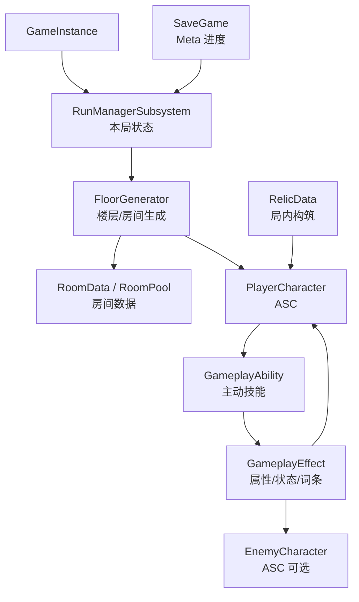
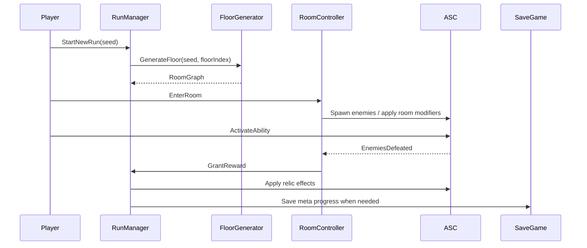

# 架构总览

## 项目定位

这是一个单机 3D 动作 roguelike。核心体验是玩家在一局 run 中通过技能释放、局内成长、随机奖励和房间推进形成不断变化的战斗构筑。

早期架构目标：

- 先建立稳定的技能释放闭环。
- 用 GAS 表达主动技能、被动效果、buff/debuff、消耗、冷却和词条。
- 用数据资产驱动技能、relic、敌人、房间和奖励池。
- 将本局状态、永久进度和关卡生成职责分清楚。

## 高层结构



## 核心模块

### RunManagerSubsystem

建议初期使用 `GameInstanceSubsystem` 承载 run 状态。它跨关卡存活，适合保存一局内需要延续的数据。

职责：

- 当前 run 随机种子。
- 当前楼层、房间索引、已访问房间。
- 玩家本局 relic 列表。
- 本局临时货币、钥匙、房间奖励状态。
- 本局全局 modifier，例如“敌人生命 +20%”“技能冷却 -30%”。
- 触发楼层生成、进入下一房间、进入下一层。

不放在这里的内容：

- 永久解锁和存档进度，这些属于 `SaveGame`。
- 单个技能的冷却、消耗、状态，这些属于 GAS。
- 单个房间里的临时 Actor 生命周期，这些属于 World/Level。

### GAS 战斗核心

GAS 是技能型动作 roguelike 的核心。早期只需要本地权威，不需要复制预测。

建议对象划分：

| 概念 | 载体 |
|---|---|
| 主动技能 | `GameplayAbility` |
| 冷却 | `GameplayEffect` + cooldown tag |
| 消耗 | `GameplayEffect` 修改 mana/energy/stamina |
| 属性 | `AttributeSet` |
| 状态 | `GameplayTag` |
| buff/debuff | 持续型 `GameplayEffect` |
| relic 词条 | `GameplayEffect`、`AbilitySet` 或监听事件的组件 |

第一阶段只做最小闭环：

1. 玩家角色拥有 ASC。
2. 一个 AttributeSet，包含生命、能量、攻击力等基础属性。
3. 一个主动技能 GameplayAbility。
4. 一个冷却 GameplayEffect。
5. 一个消耗 GameplayEffect。
6. 一个命中后造成伤害的 GameplayEffect。

### Relic / 词条系统

relic 是 roguelike 构筑的核心，建议全部数据化。

推荐数据模型：

```text
RelicData
  - DisplayName
  - Description
  - Rarity
  - Tags
  - GrantedAbilitySets
  - GrantedGameplayEffects
  - TriggerRules
```

实现策略按复杂度分三档：

| 类型 | 实现方式 | 示例 |
|---|---|---|
| 纯属性修改 | 授予无限期 GameplayEffect | 伤害 +10%、最大生命 +20 |
| 新技能/被动 | 授予 AbilitySet | 闪避后放电、击杀后回血 |
| 条件触发 | 自定义组件或监听 GameplayEvent | 每第 3 次技能释放追加火球 |

早期优先做前两类。第三类等技能和事件系统稳定后再扩展。

### 程序化关卡

建议从“手工房间块 + 程序化拼接”开始，而不是直接做完全程序化几何。

职责划分：

- `RoomData`：描述房间类型、入口出口、大小、敌人池、奖励类型、权重。
- `RoomPool`：按楼层主题组织房间候选集。
- `FloorGenerator`：根据种子生成房间图。
- `RoomRuntimeController`：负责房间进入、关门、刷怪、清房、发奖励。

房间类型建议：

- Combat
- Elite
- Treasure
- Shop
- Event
- Boss
- Rest

楼层生成不要依赖 Experience 切换。一局内换层是高频流程，应保持轻量。

### Meta 进度

永久进度写入 `SaveGame`。

可能包含：

- 已解锁角色。
- 已解锁 relic / 技能池。
- 永久货币。
- 永久升级。
- 图鉴。
- 通关记录和统计。

Meta 进度只决定“哪些内容进入候选池”，不要直接污染本局运行时状态。

## 数据流



## 与 Lyra 的关系

借鉴：

- GAS 使用方式。
- PawnData / AbilitySet 的数据驱动思想。
- Experience 将玩法配置从代码中抽离的思想。

暂不采用：

- 完整 Experience 优先级链。
- GameFeature 插件生命周期。
- 匹配、专服、复制预测和 ReplicationGraph。
- CommonUI 全套框架。

## 当前架构判断

早期最小可行架构是：

```text
Third Person 模板
  + GAS
  + RunManagerSubsystem
  + RelicData / SkillData / RoomData
  + 手工房间块拼接
  + SaveGame
```

这套结构足够支撑第一个可玩的原型，同时不会被 Lyra 的在线服务框架拖慢。
